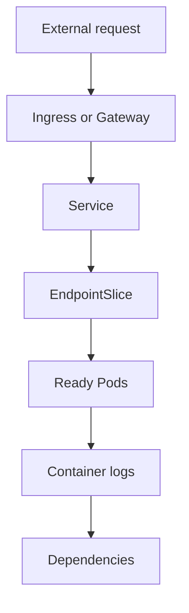

## Table of Contents

1. [Start With the Symptom](#start-with-the-symptom)
2. [Build a Timeline](#build-a-timeline)
3. [Check the Workload From the Outside In](#check-the-workload-from-the-outside-in)
4. [Separate Rollout, Runtime, and Dependency Failures](#separate-rollout-runtime-and-dependency-failures)
5. [Use Safe Mitigations Before Deep Fixes](#use-safe-mitigations-before-deep-fixes)
6. [Know When to Roll Back](#know-when-to-roll-back)
7. [Failure Mode: Debugging Changes the System](#failure-mode-debugging-changes-the-system)
8. [The Repeatable Workflow](#the-repeatable-workflow)

## Start With the Symptom

Production debugging starts with the user-visible symptom, not with the first object you happen to inspect. A Kubernetes cluster has many layers. If you begin by editing a Deployment because a Pod looks suspicious, you can change the system before you know what failed.

For `devpolaris-orders-api`, the symptom is: checkout requests return `503` for some users. That sentence is more useful than "Kubernetes is broken." It names the service, endpoint path, status code, and user impact. It also leaves room for several possible causes: no ready endpoints, ingress routing failure, application errors, database outage, or a bad rollout.

Capture one concrete request if possible:

```bash
$ curl -i https://api.devpolaris.local/orders/checkout -H 'x-request-id: debug-20260507-1015'
HTTP/2 503
content-type: application/json

{"error":"orders service unavailable","requestId":"debug-20260507-1015"}
```

That request ID can connect ingress logs, API logs, and tracing if the platform has them. If you do not capture a concrete symptom, every later theory is harder to prove.

## Build a Timeline

A timeline turns scattered facts into cause and effect. Write down when the symptom started, what changed near that time, and which evidence supports each point.

```text
10:03 deploy devpolaris-orders-api image 2026-05-07.2 started
10:05 first 503 reported by checkout monitor
10:06 Deployment reports 1/3 available
10:07 events show readiness probe failures on new Pods
10:09 rollback started to image 2026-05-07.1
10:11 Deployment reports 3/3 available
```

This timeline suggests the rollout is connected to the incident. It does not prove the root cause yet, but it tells you rollback may be a valid mitigation while deeper diagnosis continues.

Use Kubernetes rollout history when available:

```bash
$ kubectl -n orders rollout history deployment/devpolaris-orders-api
deployment.apps/devpolaris-orders-api
REVISION  CHANGE-CAUSE
18        image ghcr.io/devpolaris/orders-api:2026-05-06.4
19        image ghcr.io/devpolaris/orders-api:2026-05-07.1
20        image ghcr.io/devpolaris/orders-api:2026-05-07.2
```

If your team does not set change cause or deploy metadata, add that to the delivery workflow. Debugging is much easier when the cluster can tell you what changed.

## Check the Workload From the Outside In

Move from the user path toward the Pod. This avoids confusing an internal symptom with the first failure.



Start with the Deployment and endpoints:

```bash
$ kubectl -n orders get deploy devpolaris-orders-api
NAME                    READY   UP-TO-DATE   AVAILABLE
devpolaris-orders-api   1/3     3            1

$ kubectl -n orders get endpointslice -l kubernetes.io/service-name=devpolaris-orders-api
NAME                          ADDRESSTYPE   PORTS   ENDPOINTS
devpolaris-orders-api-rb6hb   IPv4          8080    10.244.1.42
```

Only one endpoint is ready. That can explain partial capacity or 503s if traffic exceeds one replica. Now inspect why the other Pods are not ready.

```bash
$ kubectl -n orders get pods -l app.kubernetes.io/name=devpolaris-orders-api
NAME                                      READY   STATUS    RESTARTS   AGE
devpolaris-orders-api-6df87c7676-9j4mt   1/1     Running   0          22m
devpolaris-orders-api-78b6f596dc-kzt9p   0/1     Running   0          5m
devpolaris-orders-api-78b6f596dc-wc6s2   0/1     Running   0          5m
```

The old Pod is serving. The two new Pods are running but not ready. This is a rollout readiness failure, not a node-wide outage.

## Separate Rollout, Runtime, and Dependency Failures

Production failures often look similar from the outside. Separate them by asking what changed and which layer reports the failure.

| Failure family | Signal | First useful command |
|----------------|--------|----------------------|
| Rollout failure | New ReplicaSet not available | `kubectl rollout status` |
| Runtime crash | Pod restarts or CrashLoopBackOff | `kubectl logs --previous` |
| Readiness failure | Running Pods not in endpoints | `kubectl describe pod` |
| Dependency failure | App logs show timeouts or refused connections | App logs plus dependency checks |
| Routing failure | Service healthy internally, external path fails | Ingress or Gateway status |

For the current incident, events point to readiness:

```bash
$ kubectl -n orders describe pod devpolaris-orders-api-78b6f596dc-kzt9p
Events:
  Type     Reason     Age   From     Message
  Warning  Unhealthy  4m    kubelet  Readiness probe failed: HTTP probe failed with statuscode: 500
```

Application logs explain the readiness failure:

```bash
$ kubectl -n orders logs pod/devpolaris-orders-api-78b6f596dc-kzt9p --tail=40
2026-05-07T10:06:22Z info server started port=8080 image=2026-05-07.2
2026-05-07T10:06:23Z error readiness failed component=database error="relation orders_outbox does not exist"
2026-05-07T10:06:33Z error readiness failed component=database error="relation orders_outbox does not exist"
```

The new image expects a database table that does not exist. The next decision is mitigation.

## Use Safe Mitigations Before Deep Fixes

During user impact, mitigation comes before the perfect root cause fix. A mitigation reduces impact while keeping evidence intact. For this incident, the safest mitigation is likely rollback because the previous image has a ready Pod and the new image expects an unapplied schema change.

Other mitigations might include scaling the last known good ReplicaSet, disabling a feature flag, increasing replicas if capacity is the issue, or routing traffic away from a broken region. Choose a mitigation that matches the evidence.

Avoid speculative edits. Do not change readiness probes to make Pods ready if logs say the app cannot query a required table. That would send users to broken Pods.

## Know When to Roll Back

Rollback is appropriate when a recent rollout is strongly connected to user impact and the previous version is known to work. Kubernetes makes Deployment rollback direct:

```bash
$ kubectl -n orders rollout undo deployment/devpolaris-orders-api --to-revision=19
deployment.apps/devpolaris-orders-api rolled back

$ kubectl -n orders rollout status deployment/devpolaris-orders-api
deployment "devpolaris-orders-api" successfully rolled out
```

Verify the service path after rollback:

```bash
$ kubectl -n orders get deploy devpolaris-orders-api
NAME                    READY   UP-TO-DATE   AVAILABLE
devpolaris-orders-api   3/3     3            3

$ curl -i https://api.devpolaris.local/orders/checkout/health
HTTP/2 200
content-type: application/json

{"status":"ok","service":"orders-api"}
```

The rollback does not end the work. It restores service. The follow-up is to fix the migration process, add a pre-deploy check, or change readiness behavior so the next incompatible image cannot reach production.

## Failure Mode: Debugging Changes the System

A dangerous debugging habit is making unrecorded changes during diagnosis. Examples include scaling Deployments manually, deleting Pods repeatedly, editing live objects, or disabling policies without recording why. These changes can hide the original failure.

```bash
$ kubectl -n orders delete pod -l app.kubernetes.io/name=devpolaris-orders-api
pod "devpolaris-orders-api-78b6f596dc-kzt9p" deleted
pod "devpolaris-orders-api-78b6f596dc-wc6s2" deleted
```

Deleting Pods may be useful in some cases, but here it destroys evidence and recreates the same bad Pods because the Deployment still points to the bad image. If you need to make a change, record it in the timeline and prefer controller-level actions such as rollback or a reviewed config change.

Use read-only commands first. When you must mutate, choose the smallest action that reduces user impact and preserves a path back.

## The Repeatable Workflow

A production debugging workflow should be boring enough to follow when several people are watching.

1. Capture the exact user symptom.
2. Write a short timeline with evidence.
3. Check Deployment, Pods, Services, EndpointSlices, and ingress from the outside in.
4. Read events before changing objects.
5. Read logs for the exact failing container, including `--previous` when restarts happened.
6. Decide whether the failure is rollout, runtime, dependency, routing, capacity, or policy.
7. Mitigate with rollback, scale, feature flag, or routing only when evidence supports it.
8. Verify user-facing recovery.
9. Preserve notes for the follow-up fix.

For `devpolaris-orders-api`, that workflow found a bad image expecting a missing table, rolled back to a known good revision, and left a clear follow-up: database migration compatibility must be part of the release process. The main skill is not memorizing commands. It is proving one layer at a time before changing production.

A useful production note includes commands and conclusions side by side. Commands alone force every later reader to redo the thinking. Conclusions alone are hard to trust. Keep both.

```text
Evidence record:

Command:
  kubectl -n orders get deploy devpolaris-orders-api
Observation:
  Deployment was 1/3 available during the 503 window.
Conclusion:
  The Service had reduced backend capacity.

Command:
  kubectl -n orders describe pod devpolaris-orders-api-78b6f596dc-kzt9p
Observation:
  Readiness probe failed with HTTP 500.
Conclusion:
  Pod process was running but not eligible for traffic.

Command:
  kubectl -n orders logs pod/devpolaris-orders-api-78b6f596dc-kzt9p --tail=40
Observation:
  readiness failed because relation orders_outbox did not exist.
Conclusion:
  New image expected a schema change that production did not have.
```

This format is small enough to write during an incident and clear enough for a follow-up review. It also separates observation from conclusion. That separation matters because conclusions can change when new evidence arrives.

Use labels to gather data consistently:

```bash
$ export NS=orders
$ export APP=devpolaris-orders-api

$ kubectl -n "$NS" get deploy "$APP"
$ kubectl -n "$NS" get rs,pod -l app.kubernetes.io/name="$APP"
$ kubectl -n "$NS" get endpointslice -l kubernetes.io/service-name="$APP"
$ kubectl -n "$NS" get events --sort-by=.lastTimestamp | tail -20
```

The variables reduce typing mistakes, but they also make the runbook easier to adapt. In a real shell script, quote variables and print the namespace and app at the top so the operator can verify the target before running mutating commands.

When the incident involves a rollout, compare old and new ReplicaSets:

```bash
$ kubectl -n orders get rs -l app.kubernetes.io/name=devpolaris-orders-api
NAME                                DESIRED   CURRENT   READY   AGE
devpolaris-orders-api-6df87c7676    1         1         1       2d
devpolaris-orders-api-78b6f596dc    3         3         0       7m
```

This output tells you the new ReplicaSet has no ready Pods while an older ReplicaSet still has one. That supports rollback. If both old and new ReplicaSets are unhealthy, rollback may not help and the problem may be a dependency, node, policy, or cluster issue.

After mitigation, verify recovery from more than one angle:

```bash
$ kubectl -n orders get deploy devpolaris-orders-api
NAME                    READY   UP-TO-DATE   AVAILABLE
devpolaris-orders-api   3/3     3            3

$ kubectl -n orders run curlcheck --rm -it --image=curlimages/curl --restart=Never -- \
  curl -sS http://devpolaris-orders-api/health/ready
{"status":"ready","database":"ok","queue":"ok"}

$ curl -sS -o /dev/null -w '%{http_code}\n' https://api.devpolaris.local/orders/checkout/health
200
```

The first command proves Kubernetes availability. The second proves in-cluster routing and dependencies. The third proves the external path. One green check is not enough when the failure could live at several layers.

The follow-up fix should become a preventive check. For the missing table incident, the release workflow could run a compatibility check before deploying the image:

```text
Pre-deploy check:
  image: ghcr.io/devpolaris/orders-api:2026-05-07.2
  required schema version: 202605071004_orders_outbox
  production schema version: 202605061730_orders_totals
  result: block deploy
```

That check would have stopped the bad rollout before readiness failed in production. The exact implementation may live in CI, migration tooling, or an admission policy, but the lesson is the same: turn the incident evidence into a guard for the next release.

Finally, decide which commands are safe for first responders. Read-only commands can be available to a wider on-call group. Mutating commands such as rollback, scale, and delete should have clearer ownership.

| Action | Risk | Who should run it |
|--------|------|-------------------|
| `kubectl get` and `describe` | Low | Any trained responder |
| `kubectl logs` | Low to medium because logs may contain sensitive data | Responders with production log access |
| `kubectl rollout undo` | Medium because it changes production | Service owner or incident lead |
| `kubectl scale` | Medium because it changes capacity and dependency load | Service owner or platform support |
| `kubectl delete pod` | Medium because it destroys local evidence | Use only with a reason |

A production workflow is reliable when people know what to inspect, what to record, and which changes require a decision. That structure helps junior responders contribute useful evidence without needing to guess their way through the cluster.

---

**References**

- [Kubernetes: Debug Applications](https://kubernetes.io/docs/tasks/debug/debug-application/) - Official entry point for application debugging tasks.
- [Kubernetes: Debug Running Pods](https://kubernetes.io/docs/tasks/debug/debug-application/debug-running-pod/) - Shows how to inspect Pod state, logs, and events.
- [Kubernetes: Deployments](https://kubernetes.io/docs/concepts/workloads/controllers/deployment/) - Official Deployment behavior, rollout, and rollback reference.
- [Kubernetes: Services](https://kubernetes.io/docs/concepts/services-networking/service/) - Explains how Services route traffic to ready Pod endpoints.
