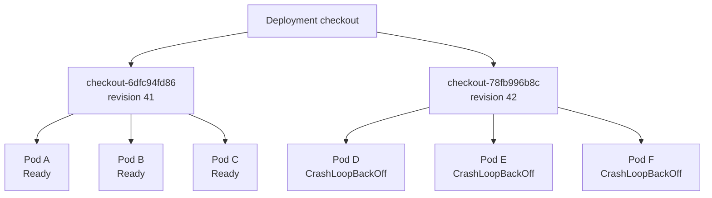
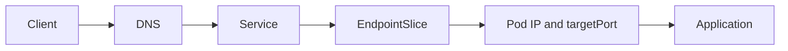

## Table of Contents

1. [What exact result can the team repeat, and how wide is its scope?](#what-exact-result-can-the-team-repeat-and-how-wide-is-its-scope)
2. [What do the Deployment, ReplicaSets, and Pods each reveal?](#what-do-the-deployment-replicasets-and-pods-each-reveal)
3. [How does a healthy-versus-unhealthy comparison reduce the search space?](#how-does-a-healthy-versus-unhealthy-comparison-reduce-the-search-space)
4. [What separate evidence comes from status, events, logs, and requests?](#what-separate-evidence-comes-from-status-events-logs-and-requests)
5. [How does a Service turn Pod labels and readiness into traffic endpoints?](#how-does-a-service-turn-pod-labels-and-readiness-into-traffic-endpoints)
6. [How can a dependency test reproduce the workload's network context?](#how-can-a-dependency-test-reproduce-the-workloads-network-context)
7. [How should the team choose, verify, and record a recovery action?](#how-should-the-team-choose-verify-and-record-a-recovery-action)
8. [Check Your Answers](#check-your-answers)
9. [References](#references)

A production request succeeds only when a chain of contracts succeeds: a controller creates the intended revision, Pods schedule and start, the application becomes Ready, EndpointSlices contain useful backends, a Service routes to them, dependencies respond, and the edge returns the result. Debugging is the work of finding the earliest false contract with the smallest useful experiment.

Seven questions make that process repeatable:

1. **What exact result can the team repeat, and how wide is its scope?**
2. **What do the Deployment, ReplicaSets, and Pods each reveal?**
3. **How does a healthy-versus-unhealthy comparison reduce the search space?**
4. **What separate evidence comes from status, events, logs, and requests?**
5. **How does a Service turn Pod labels and readiness into traffic endpoints?**
6. **How can a dependency test reproduce the workload's network context?**
7. **How should the team choose, verify, and record a recovery action?**

## What exact result can the team repeat, and how wide is its scope?
<!-- section-summary: Convert a vague report into a bounded test whose path, timing, outcome, and affected subset can be compared before and after each intervention. -->

### Express the incident as a broken chain of contracts

A successful request depends on a sequence: the Deployment controller creates the intended ReplicaSet, Pods schedule and start, the application becomes Ready, EndpointSlices contain those Pods, the Service routes to them, dependencies respond, and the edge returns the result. If the request fails, at least one statement in that chain is false.

Debugging should locate the **earliest false contract** with the smallest experiment. This prevents a team from jumping randomly between ingress, logs, CPU, DNS, and restarts without reducing uncertainty. Prove one upstream boundary before moving downstream.

Write the request path as a checklist of statements:

```text
Deployment points to the intended revision
ReplicaSet creates the intended Pod population
Pods schedule and containers start
application reports Ready
EndpointSlices publish those ready Pod addresses
Service port reaches the endpoint target port
application reaches required dependencies
Ingress or Gateway matches the public request
client receives the expected response
```

The first failed statement defines the current investigation neighborhood. If the Deployment has only seven of ten Ready replicas, external DNS cannot explain why those three Pods are unready. If every internal Service request succeeds but the public request fails, the earlier Pod and Service contracts are evidence worth retaining while the search moves to the edge.

This is fault isolation through falsification. Each command should test one explicit claim and either preserve it as working or replace it with a narrower broken claim. A command that cannot change the current hypothesis is probably not the next useful experiment.

Write down each proved boundary during the incident. The record prevents another responder from repeating settled checks and makes any change in evidence immediately visible.
It also preserves the causal chain for the final review.

“Checkout is intermittently returning 502s” is an observation. Turn it into a test:

```bash
for i in {1..10}; do
  date -Iseconds
  curl -sS \
    --max-time 5 \
    -o /dev/null \
    -w 'status=%{http_code} time=%{time_total}\n' \
    https://shop.example.com/api/checkout
  sleep 1
done
```

Now the incident can be stated precisely: three of ten requests returned HTTP 502 through `https://shop.example.com/api/checkout` between known timestamps. Capture request IDs, latency, and affected user or tenant when those fields help correlation.

Also determine the scope. Does every request fail, only one Pod, one revision, one Node, or one zone? Does the same operation fail from a laptop, through the public edge, from another Pod, or from the affected workload? These are different contracts. Keep the bounded test as the incident invariant and repeat it after meaningful hypotheses or recovery actions.

The timestamp, status code, latency, and request ID turn intermittency into evidence that can be correlated across layers. “Three of ten failed” can later be compared with “zero of ten failed” using the same route and bounded sample; “it seems better” cannot.

### Measure the failure's dimensions

Ask whether failure follows a particular coordinate:

| Dimension | Comparison | What a split suggests |
|---|---|---|
| Revision | old healthy, new broken | release regression |
| Pod | two healthy, one broken | replica-specific state or configuration |
| Node | all Pods on one Node fail | Node, CNI, or local runtime path |
| Zone | one zone fails | zonal network, storage, or dependency path |
| Namespace | same call differs by namespace | DNS search, policy, identity, or configuration |
| Entry point | internal works, public fails | DNS, load balancer, Gateway, or Ingress |

Keep the original caller and route fixed unless the experiment deliberately bypasses one layer. Changing hostname, protocol, source namespace, and endpoint together may produce a successful but unrelated path.

The bounded sample is diagnostic, not a load test. Ten timestamped requests can reveal a one-in-three pattern that resembles one bad endpoint behind a three-replica Service. Request IDs can then connect the failed client observations with edge and application logs.

## What do the Deployment, ReplicaSets, and Pods each reveal?
<!-- section-summary: Read the owning controller first, then use ReplicaSets to identify revisions and Pods to inspect the instances produced by each revision. -->

### Start with desired state before inspecting one disposable instance

Start with the object that owns desired state:

```bash
kubectl get deploy checkout -n prod
kubectl describe deploy checkout -n prod
kubectl rollout status deploy/checkout -n prod
kubectl get rs -n prod
kubectl get pods -n prod -l app=checkout -o wide
```

Suppose the Deployment wants ten Pods but shows seven Ready. That proves the controller requested the replicas while three failed a later contract. There is no reason yet to begin with DNS, the edge, or the database.

ReplicaSets separate rollout revisions:


```mermaid
flowchart TD
    Deployment[Deployment checkout]
    Deployment --> Rev41[checkout-6dfc94fd86<br/>revision 41]
    Deployment --> Rev42[checkout-78fb996b8c<br/>revision 42]
    Rev41 --> PodA[Pod A<br/>Ready]
    Rev41 --> PodB[Pod B<br/>Ready]
    Rev41 --> PodC[Pod C<br/>Ready]
    Rev42 --> PodD[Pod D<br/>CrashLoopBackOff]
    Rev42 --> PodE[Pod E<br/>CrashLoopBackOff]
    Rev42 --> PodF[Pod F<br/>CrashLoopBackOff]
```

The useful fact is not merely that Pod D crashes. Every revision-42 Pod crashes while revision 41 remains healthy. The failure follows a revision.

A Pod is often a symptom produced by an owning controller. Reading one crashing Pod first can hide the fact that the Deployment wants ten replicas, an old ReplicaSet remains healthy, and only the new ReplicaSet fails. Controller state tells you the intended population and rollout boundary; Pod evidence then explains why particular instances did not satisfy it.

### Read population state before one Pod story

Suppose the Deployment reports:

```text
DESIRED      10
UP-TO-DATE   10
AVAILABLE     7
```

The controller accepted the new template and asked for ten current-revision Pods, but three have not become available. `kubectl rollout status` and Deployment conditions show whether progress has stalled. ReplicaSets reveal whether seven available Pods belong to the old revision while all new Pods fail, or whether seven new Pods are healthy and only three particular placements fail.

These patterns imply different comparisons:

```text
all revision 42 Pods fail, revision 41 healthy -> compare revision templates
only Pods on Node 23 fail                     -> compare placement and node path
all Pods Running but none Ready               -> inspect readiness and dependencies
Pods Pending before startup                    -> inspect scheduling Events
```

Only after the population pattern is known should one Pod be selected as a representative evidence source.

## How does a healthy-versus-unhealthy comparison reduce the search space?
<!-- section-summary: A healthy instance is a control group, so differences shared by all broken instances become the first hypotheses to test. -->

### Variation is evidence

Inspect both revisions:

```bash
kubectl rollout history deploy/checkout -n prod
kubectl rollout history deploy/checkout -n prod --revision=41
kubectl rollout history deploy/checkout -n prod --revision=42
```

Compare image and image digest, command, arguments, environment, ConfigMap and Secret references, resource requests and limits, probes, ports, volumes, service account, sidecars, labels, and annotations. Do not stop at a mutable tag; inspect the running image ID:

```bash
kubectl get pod <pod> -n prod \
  -o jsonpath='{.status.containerStatuses[*].imageID}'
```

The same comparison works beyond revisions. If `checkout-a` and `checkout-b` can reach Redis but `checkout-c` cannot, compare Node, zone, Pod configuration, and endpoint. If all failures occur on one Node, the search moves from “Redis is broken” to a Node or network-path boundary.

Healthy A and broken B often share most of their environment. Investigate the small set of differences first.

Treat the healthy instance as a control group. Revision 41 proves that the cluster, Service, and dependency can serve at least one version under the same broad environment. Revision 42 differs in an image digest, Secret reference, probe, command, or another template field. Those changes deserve attention before universal failures such as “CoreDNS is down.”

Compare rendered state rather than only source intent. A mutable image tag can point at different digests. Admission can add fields. A ConfigMap or Secret name can remain similar while its keys differ. Inspect the Pod template and running `imageID`, then list the exact environmental differences that correlate with every failing instance.

Repeat this pattern at every useful dimension: healthy revision versus unhealthy revision, Pod versus Pod, Node versus Node, zone versus zone, endpoint versus endpoint, or namespace versus namespace. If all failures follow Node 23 while another Pod on Node 17 succeeds, the hypothesis moves away from a universal dependency outage and toward the Node or its network path.

## What separate evidence comes from status, events, logs, and requests?
<!-- section-summary: Status describes observed state, Events explain Kubernetes actions, logs explain process behavior, and requests test a chosen runtime boundary. -->

### Give each evidence stream one job

Each evidence stream has a separate job:

- **Status:** current state, readiness, restart count, last termination reason, and exit code.
- **Events:** scheduling, image pulls, volume mounts, probes, and kubelet or controller decisions.
- **Logs:** what the application or container observed.
- **Requests:** whether behavior succeeds at a selected boundary.

For a crash loop:

```bash
kubectl describe pod checkout-xyz -n prod
kubectl logs checkout-xyz -n prod -c checkout --previous
```

Suppose status says `CrashLoopBackOff`, Events show the image pulled and the container started, and previous logs say `FATAL: DATABASE_URL is missing`. Together they prove that Kubernetes launched the process and the application then exited because configuration was missing. A scheduler event such as “insufficient memory” would instead explain why the process never started, without application logs.

Do not merge these streams into “the Pod is broken.” Use each to test one contract.

The combined crash-loop example is a complete causal explanation: status proves the process will not remain running, Events prove scheduling, image pull, and container startup succeeded, and previous-container logs identify the missing `DATABASE_URL`. If Events instead said `FailedScheduling` because of insufficient memory, application logs would be irrelevant because no process had started.

### Build one timeline from the evidence

For the missing database configuration, the causal sequence can be written:

```text
14:03:01 scheduler binds revision-42 Pod to Node 5
14:03:03 kubelet reports image available and container started
14:03:04 application logs FATAL: DATABASE_URL is missing
14:03:04 container terminates with exit code 1
14:03:05 kubelet restarts the container
14:03:20 repeated exits produce BackOff
```

`CrashLoopBackOff` is Kubernetes' reaction to repeated process failure, not the initiating defect. The application message identifies the missing input; terminated state and exit code record the process result; Events record Kubernetes' startup and backoff actions. Ordering those observations keeps a visible reaction from being mistaken for root cause.

The same logic explains empty logs. `FailedScheduling`, `FailedMount`, `ErrImagePull`, and `CreateContainerConfigError` can stop the lifecycle before the application executes. Ask “did this process ever start?” before assuming its empty stream is a logging-system defect.

## How does a Service turn Pod labels and readiness into traffic endpoints?
<!-- section-summary: A Service routes through EndpointSlices built from matching, useful Pods, so the Service object alone does not prove that any backend can receive traffic. -->

### Bypass one routing abstraction at a time

A Service is an abstraction over endpoints:


```mermaid
flowchart LR
    Client[Client] --> DNS[DNS]
    DNS --> Service[Service]
    Service --> Slice[EndpointSlice]
    Slice --> Pod[Pod IP and targetPort]
    Pod --> App[Application]
```

Inspect both the Service and its backends:

```bash
kubectl get svc checkout -n prod
kubectl get endpointslices \
  -n prod \
  -l kubernetes.io/service-name=checkout
```

Ten Ready Pods plus zero endpoints points toward the label/selector or endpoint-generation boundary. A selector such as `app: payments` cannot match Pods labelled `app: payment`.

When an EndpointSlice lists `10.42.7.23:8080`, bypass one abstraction at a time from an appropriate Pod:

```bash
curl http://10.42.7.23:8080/health
curl http://checkout:8080/health
```

If the Pod IP fails, investigate the Pod or application. If the Pod IP succeeds but the Service fails, investigate selector, target port, and the Service network path. If both succeed, continue upstream. Intermittent failures call for endpoint-by-endpoint comparison.

| Direct Pod endpoint | Service request | First investigation neighborhood |
|---|---|---|
| Fails | Fails | Pod or application |
| Succeeds | Fails | Service selector, port, or network path |
| Succeeds | Succeeds | DNS, ingress, gateway, or client farther upstream |
| Intermittent | Intermittent | Compare individual endpoints and their placement |

A healthy-looking Service object contains no proof that it has useful backends. EndpointSlices connect selectors and readiness to concrete Pod IPs and ports, so they are the next contract after the Service definition.

### Translate the friendly name into concrete destinations

Assume the Service exposes `checkout:8080`, targets container port `3000`, and currently publishes three ready endpoints:

```text
checkout:8080
  -> 10.42.7.23:3000
  -> 10.42.8.11:3000
  -> 10.42.9.35:3000
```

Call each address from the same source when failure is intermittent. If two return 200 and `10.42.9.35` times out, “the checkout Service fails sometimes” becomes “the original caller cannot reach one endpoint.” Compare that Pod's revision, readiness, Node, listener, and policy with the two controls.

If the endpoint list is empty, compare the Service selector with Pod labels and then Pod readiness. A matching Running Pod can still be excluded because `Ready=False`. If direct endpoints all work while the ClusterIP fails, the application path is proven and the remaining contract is Service translation or policy. Each bypass should remove exactly one abstraction.

## How can a dependency test reproduce the workload's network context?
<!-- section-summary: Test from the failing workload or its closest safe equivalent because namespace, policy, identity, DNS, proxies, credentials, and Node placement shape reachability. -->

### Reproduce from the closest safe context

If the application reports a timeout to `redis.prod.svc:6379`, a laptop test does not reproduce the workload's context. Test DNS and connectivity from the workload:

```bash
kubectl exec -n prod checkout-xyz -- \
  getent hosts redis.prod.svc.cluster.local

kubectl exec -n prod checkout-xyz -- \
  curl -v --connect-timeout 3 http://dependency:8080/health
```

When the production image intentionally lacks diagnostic tools, use `kubectl debug` to add an ephemeral debugging container or create a debugging copy.

Context matters because namespace, NetworkPolicy, service account or workload identity, DNS search domains, a sidecar proxy, mesh policy, mounted credentials, environment, Node, zone, IP family, and TLS can differ. Reproduce the failure from the closest possible context to the component that experiences it.

A successful laptop connection proves the laptop's path. It says little about the failing Pod's namespace policy, service account, sidecar, certificate, DNS search path, or Node placement. An ephemeral debug container is useful precisely because it can preserve much more of that runtime context without adding tools to a deliberately minimal production image.

Test dependency resolution and transport separately. `getent hosts redis.prod.svc.cluster.local` asks whether the workload's resolver can obtain an address. Connecting to that address and port asks whether the Pod's egress path, destination ingress, CNI route, and listener permit the flow. Application authentication is a later contract.

This separation prevents a broad statement such as “Redis is unreachable.” A DNS failure, TCP timeout, TLS error, and authentication rejection each prove a different amount of the path. Run the check from the affected Pod or an ephemeral container sharing its network namespace so the source identity remains representative.

If one checkout Pod fails while two succeed, compare their Nodes before changing Redis. When every workload on Node 23 shows the same failure and workloads on Node 17 succeed, the variation moves the hypothesis toward Node 23, its routes, CNI state, or zonal path.

## How should the team choose, verify, and record a recovery action?
<!-- section-summary: Recovery must follow from the first broken contract, verification must repeat the original path, and the incident record must preserve the evidence and prevention. -->

### Let evidence select the smallest recovery

Match action to evidence:

| Evidence | Suitable action |
|---|---|
| Revision 42 fails while revision 41 is healthy | Roll back |
| ConfigMap contains an invalid value | Correct configuration |
| Pods cannot schedule because requests exceed capacity | Add or free capacity, or correct requests |
| Service selector misses the Pods | Correct selector or labels |
| Readiness probe uses the wrong port | Correct the probe |
| One Node consistently breaks networking | Investigate or isolate that Node |
| Dependency is unavailable | Recover or fail over the dependency |

A restart can mitigate a proven transient runtime state, but symptom removal is not root-cause evidence.

Recovery and diagnosis have different time pressures but should still connect. A rollback can be the safest immediate mitigation when a new revision is the only failing variable, even before every code-level detail is known. The evidence justifies returning to the last known-good state. A later permanent fix can explain and correct the missing Secret key.

A blind restart offers weaker reasoning. If the configuration remains invalid, every fresh process fails again. If one process was genuinely wedged in transient memory state, restart can be appropriate—but the status, logs, or liveness behavior should support that hypothesis. “It sometimes helps” is not a causal model.

For the revision regression:

```bash
kubectl rollout undo deploy/checkout -n prod --to-revision=41
kubectl rollout status deploy/checkout -n prod
```

Then repeat the original ten public requests. Ten successes and zero failures prove the user path recovered; Running Pods alone do not. Supporting checks include rollout convergence, Ready Pods, and EndpointSlices.

The reasoning should remain explicit: revision 41 is healthy; revision 42 fails; the failure reproduces only on revision 42; therefore restoring revision 41 is the smallest evidence-backed mitigation. A blind restart might temporarily remove a symptom, but it neither explains why the new revision fails nor proves that restarting is an appropriate treatment.

Verification must be symmetrical with the symptom. If customers saw three 502 responses in ten requests through the public hostname, `kubectl get pods` cannot close the incident. Repeat the ten public requests with the same hostname, path, protocol, and representative headers. Then use rollout status, Ready Pods, EndpointSlices, logs, and error metrics as supporting evidence that the recovered path is stable.

One successful request can miss the bad replica that created intermittency. Either repeat enough requests to exercise the backend set or call every endpoint directly, then confirm the bounded public sample. The team should be able to say “the exact failing operation is now 10/10 successful and every intended endpoint is Ready,” not merely “the rollout command finished.”

### Verify the same path and preserve the experiment

Record the symptom, reproduction, timeline, first broken contract, healthy/unhealthy comparison, root cause, mitigation, permanent fix, useful commands, misleading signals, missing observability, and prevention. In this incident, revision 41 read `DATABASE_URL` from Secret `checkout-db`, revision 42 referenced `checkout-db-v2`, and that Secret lacked `DATABASE_URL`. The rollback restored revision 41; startup configuration validation and a deployment smoke test prevent recurrence.

The record should make the investigation reusable: the exact ten-request sample, the first divergent revision, status/Event/log evidence, the configuration difference, the rollback, and the same-path verification. The next incident then begins with a tested method and better prevention rather than another sequence of ritual commands.

A useful incident record preserves cause and reaction separately:

```text
symptom:      3/10 public checkout requests returned 502
scope:        failures followed revision 42 only
first break:  revision-42 containers exited before readiness
cause:        checkout-db-v2 lacked DATABASE_URL
reaction:     kubelet restarted containers; edge saw no healthy new backends
mitigation:   restore revision 41
verification: 10/10 original requests succeeded; endpoints Ready
prevention:   startup config validation and pre-promotion smoke test
```

That record captures not only a command that happened to help, but the falsified contract, the evidence that owned it, and the new test that should prevent recurrence.

## Check Your Answers
<!-- section-summary: Reconstruct the workflow from a repeatable symptom through controller ownership, controlled comparison, evidence streams, routing, dependencies, and verified recovery. -->

:::expand[What exact result can the team repeat, and how wide is its scope?]{kind="recap"}
Turn the report into a bounded test with a path, time, status, latency, and affected subset. Reuse that test throughout the incident.
:::

:::expand[What do the Deployment, ReplicaSets, and Pods each reveal?]{kind="recap"}
The Deployment exposes desired and rollout state, ReplicaSets divide revisions, and Pods show the instances produced by each revision. Prove an upstream contract before moving downstream.
:::

:::expand[How does a healthy-versus-unhealthy comparison reduce the search space?]{kind="recap"}
A healthy revision, Pod, Node, zone, or endpoint is a control. Compare it with the broken instance and test the small set of differences first.
:::

:::expand[What separate evidence comes from status, events, logs, and requests?]{kind="recap"}
Status shows observed state, Events show Kubernetes actions, logs show process observations, and requests test behavior at a chosen boundary.
:::

:::expand[How does a Service turn Pod labels and readiness into traffic endpoints?]{kind="recap"}
Matching useful Pods become EndpointSlice backends. Test the Pod endpoint and then the Service to isolate application versus Service-path failures.
:::

:::expand[How can a dependency test reproduce the workload's network context?]{kind="recap"}
Run it from the workload or a close debug context so namespace, policy, identity, DNS, proxies, credentials, and placement match the failure.
:::

:::expand[How should the team choose, verify, and record a recovery action?]{kind="recap"}
Choose the smallest action supported by the first broken contract, rerun the original failing path, and preserve evidence, cause, mitigation, and prevention.
:::

## References

- [Debug Pods](https://kubernetes.io/docs/tasks/debug/debug-application/debug-pods/)
- [Debug Services](https://kubernetes.io/docs/tasks/debug/debug-application/debug-service/)
- [Debug running Pods](https://kubernetes.io/docs/tasks/debug/debug-application/debug-running-pod/)
- [Deployments](https://kubernetes.io/docs/concepts/workloads/controllers/deployment/)
- [Use a Service to access an application in a cluster](https://kubernetes.io/docs/tutorials/services/connect-applications-service/)
