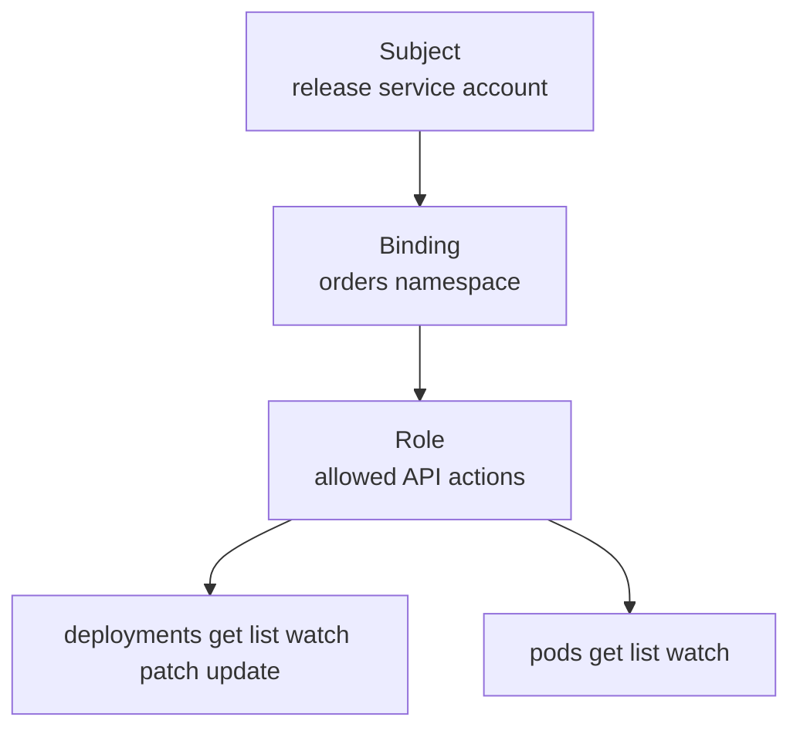

## Table of Contents

1. [Permissions Are API Decisions](#permissions-are-api-decisions)
2. [Subjects, Verbs, Resources, and Scope](#subjects-verbs-resources-and-scope)
3. [Roles and RoleBindings](#roles-and-rolebindings)
4. [ClusterRoles and ClusterRoleBindings](#clusterroles-and-clusterrolebindings)
5. [Service Accounts for Workloads](#service-accounts-for-workloads)
6. [Testing Permissions With auth can-i](#testing-permissions-with-auth-can-i)
7. [Failure Mode: A Helpful Role That Is Too Broad](#failure-mode-a-helpful-role-that-is-too-broad)
8. [Reviewing RBAC Changes](#reviewing-rbac-changes)

## Permissions Are API Decisions

RBAC is Kubernetes authorization for API requests. Every meaningful Kubernetes operation becomes an API request: `kubectl get pods`, a controller updating a Deployment, a CI job reading rollout status, and a Pod listing ConfigMaps all ask the Kubernetes API server to do something. Authentication answers "who are you?" Authorization answers "are you allowed to do this action?"

RBAC stands for role-based access control. In Kubernetes, RBAC grants permissions by binding subjects to roles. A subject can be a user, group, or service account. A role describes allowed verbs on resources. A binding connects the subject to the role in a namespace or across the cluster.

For `devpolaris-orders-api`, the team has a release job that deploys into the `orders` namespace. That job should update Deployments, read Pods, and watch rollouts. It should not read Secrets from every namespace, delete nodes, or modify unrelated teams' workloads.



RBAC is protective because it limits the damage from mistakes. If the release token leaks, the attacker should not inherit cluster-admin access. If a script has a bug, it should fail with `Forbidden` before it deletes another namespace.

## Subjects, Verbs, Resources, and Scope

An RBAC rule is a permission sentence for the Kubernetes API: a subject can perform a verb on a resource in a scope. Reading the YAML this way turns abstract fields into a concrete access decision.


*RBAC answers one API question: who wants to do which action to which resource at which scope.*


Example: "the `orders-release` service account can update Deployments in the `orders` namespace" means subject `orders-release`, verb `update`, resource `deployments`, scope `orders`.

| Word | Plain meaning | Example |
|------|---------------|---------|
| Subject | Who receives permission | User, group, or service account |
| Verb | API action | `get`, `list`, `watch`, `create`, `update`, `patch`, `delete` |
| Resource | API object type | `pods`, `deployments`, `secrets` |
| Scope | Where permission applies | One namespace or the whole cluster |

The verbs are Kubernetes API verbs, not shell commands. `kubectl rollout restart deployment/devpolaris-orders-api` may look like one command, but it results in patching the Deployment template. That means the subject needs `patch` on Deployments.

## Roles and RoleBindings

A Role grants permissions inside one namespace, and a RoleBinding attaches that Role to a subject. This is the usual starting point for application team permissions because it keeps access close to the namespace where the team works.


*A RoleBinding grants a Role to a subject inside a namespace.*


Example: the orders release service account can patch Deployments and read Pods in `orders`, without gaining Secret reads or permissions in other namespaces.

```yaml
apiVersion: v1
kind: ServiceAccount
metadata:
  name: orders-release
  namespace: orders
---
apiVersion: rbac.authorization.k8s.io/v1
kind: Role
metadata:
  name: orders-release-deployer
  namespace: orders
rules:
  - apiGroups: ["apps"]
    resources: ["deployments"]
    verbs: ["get", "list", "watch", "patch", "update"]
  - apiGroups: [""]
    resources: ["pods", "events"]
    verbs: ["get", "list", "watch"]
---
apiVersion: rbac.authorization.k8s.io/v1
kind: RoleBinding
metadata:
  name: orders-release-deployer
  namespace: orders
subjects:
  - kind: ServiceAccount
    name: orders-release
    namespace: orders
roleRef:
  apiGroup: rbac.authorization.k8s.io
  kind: Role
  name: orders-release-deployer
```

The Role lets the release job update Deployments and read Pods and Events. It does not allow Secret reads. It does not allow namespace deletion. The namespace on the Role and RoleBinding is part of the safety boundary.

## ClusterRoles and ClusterRoleBindings

A ClusterRole is a reusable role object stored at cluster scope. Its rules are not automatically cluster-wide. The binding decides where those rules apply: a RoleBinding can use the ClusterRole in one namespace, while a ClusterRoleBinding applies it across the whole cluster.

Example: binding the built-in `view` ClusterRole into the `orders` namespace gives read access only there. Binding the same role with a ClusterRoleBinding gives cluster-wide read access, which is a much larger grant.

This distinction is useful because Kubernetes ships common ClusterRoles such as `view`, `edit`, and `admin`. You can bind `view` into the `orders` namespace without granting view access to the whole cluster.

```yaml
apiVersion: rbac.authorization.k8s.io/v1
kind: RoleBinding
metadata:
  name: orders-readonly
  namespace: orders
subjects:
  - kind: Group
    name: devpolaris-orders-developers
roleRef:
  apiGroup: rbac.authorization.k8s.io
  kind: ClusterRole
  name: view
```

That binding says the group can use the `view` ClusterRole only in `orders`. A ClusterRoleBinding would make the same role apply cluster-wide, which is a much larger grant.

Use ClusterRoleBindings carefully. They are appropriate for cluster operators, admission controllers, monitoring agents, and infrastructure controllers that truly need cluster-wide access. They are rarely the right starting point for one application team.

## Service Accounts for Workloads

A service account is a Kubernetes identity for a process running in the cluster. Pods, controllers, CI deployers, and in-cluster tools use service accounts when they need to call the Kubernetes API.

Example: the orders API runtime can use `orders-api` with no mounted API token, while the release job uses a separate `orders-release` identity that can patch Deployments.

For `devpolaris-orders-api`, the application itself may not need to call the Kubernetes API at all. In that case, give it a dedicated service account with no extra permissions.

```yaml
apiVersion: v1
kind: ServiceAccount
metadata:
  name: orders-api
  namespace: orders
---
apiVersion: apps/v1
kind: Deployment
metadata:
  name: devpolaris-orders-api
  namespace: orders
spec:
  template:
    spec:
      serviceAccountName: orders-api
      automountServiceAccountToken: false
      containers:
        - name: api
          image: ghcr.io/devpolaris/orders-api:2026-05-07.1
```

`automountServiceAccountToken: false` prevents Kubernetes from automatically mounting an API token into the Pod. This is a good default when the app does not need to talk to the Kubernetes API. If an attacker gets code execution inside the container, there is no Kubernetes token waiting in the filesystem.

## Testing Permissions With auth can-i

`kubectl auth can-i` asks the API server a direct permission question. It is the safest way to test whether a subject can perform an action before a CI job fails during a release.

Example: ask whether `system:serviceaccount:orders:orders-release` can `patch deployments` in `orders` and whether it cannot `get secrets`.

```bash
$ kubectl auth can-i patch deployments \
  --as=system:serviceaccount:orders:orders-release \
  -n orders
yes

$ kubectl auth can-i get secrets \
  --as=system:serviceaccount:orders:orders-release \
  -n orders
no

$ kubectl auth can-i delete namespaces \
  --as=system:serviceaccount:orders:orders-release
no
```

Those three checks prove the intended shape: the release job can patch Deployments, cannot read Secrets, and cannot delete namespaces. Add these checks to runbooks or CI validation when RBAC changes are high risk.

If the release fails, the error is usually direct:

```text
Error from server (Forbidden): deployments.apps "devpolaris-orders-api" is forbidden:
User "system:serviceaccount:orders:orders-release" cannot patch resource "deployments"
in API group "apps" in the namespace "orders"
```

Read the error as a permission sentence. It names the subject, verb, resource, API group, and namespace. One of those fields is missing from the Role or binding.

## Failure Mode: A Helpful Role That Is Too Broad

An overly broad role fixes a permission error by removing too much of the boundary. During an incident, someone may propose binding `cluster-admin` to the release service account so deploys stop failing. That works in the same way giving every developer production database owner access "works." It removes the error by removing the boundary.

```yaml
apiVersion: rbac.authorization.k8s.io/v1
kind: ClusterRoleBinding
metadata:
  name: orders-release-cluster-admin
subjects:
  - kind: ServiceAccount
    name: orders-release
    namespace: orders
roleRef:
  apiGroup: rbac.authorization.k8s.io
  kind: ClusterRole
  name: cluster-admin
```

Broad permissions create security risk and make automation bugs more dangerous. A script intended to delete old Pods in `orders` can delete workloads in another namespace if it has cluster-wide delete access.

The diagnostic path is to reproduce the forbidden action with `kubectl auth can-i`, then add the smallest missing verb and resource in the right namespace. If a job needs `patch deployments`, grant that. Do not grant every verb on every resource.

## Reviewing RBAC Changes

RBAC review is about concrete API actions granted to a concrete identity. Avoid reviewing role names alone. Names such as `deployer`, `operator`, and `reader` are helpful for humans, but the rules decide the real access. For example, a release identity that only needs to patch Deployments should not also receive `get secrets` or cluster-wide delete permissions.

Use this checklist:

| Review question | What to inspect |
|-----------------|-----------------|
| Who receives the permission? | `subjects` in the binding |
| Where does it apply? | RoleBinding namespace or ClusterRoleBinding |
| Which API group and resource? | `apiGroups` and `resources` |
| Which verbs? | `verbs`, especially `delete`, `update`, `patch`, and `create` |
| Does the workload need an API token? | `serviceAccountName` and token automount |

For `devpolaris-orders-api`, a healthy design has separate identities: the API runtime identity, the release identity, and human read-only access. Each identity gets only the actions it needs. That separation makes incident response easier because you can reason about what each token or user could have changed.

A useful RBAC pull request includes a permission matrix. The matrix should translate YAML into tasks a person or process actually performs.

```text
Identity: system:serviceaccount:orders:orders-release
Purpose: CI release job for devpolaris-orders-api

Allowed:
  patch deployments.apps in orders
  update deployments.apps in orders
  get/list/watch deployments.apps in orders
  get/list/watch pods in orders
  get/list/watch events in orders

Denied:
  get secrets in orders
  delete deployments.apps in orders
  create clusterrolebindings
  delete namespaces
```

That record is easier to review than a raw Role alone. It also gives you a test plan. Each line can become a `kubectl auth can-i` check.

```bash
$ for verb in get list watch patch update; do
  kubectl auth can-i "$verb" deployments.apps \
    --as=system:serviceaccount:orders:orders-release \
    -n orders
done
yes
yes
yes
yes
yes

$ kubectl auth can-i get secrets \
  --as=system:serviceaccount:orders:orders-release \
  -n orders
no
```

If a future release job starts failing, this record helps you decide whether the job changed or the permission changed. Without the record, teams often add broad permissions because they cannot remember what the identity was meant to do.

You should also inspect what a subject can already do before adding a new binding. Kubernetes has aggregation and inherited group access in many clusters, so a user may already receive permissions through a group.

```bash
$ kubectl auth can-i --list \
  --as=system:serviceaccount:orders:orders-release \
  -n orders
Resources          Non-Resource URLs   Resource Names   Verbs
deployments.apps   []                  []               [get list watch patch update]
events             []                  []               [get list watch]
pods               []                  []               [get list watch]
```

The `--list` view is a quick scan, not a replacement for exact checks. It can still reveal accidental grants, such as `secrets get list watch` appearing for an identity that should only deploy.

RBAC failures can also happen because the namespace is wrong. Service accounts are namespaced. A release job running as `system:serviceaccount:ci:orders-release` is a different subject from `system:serviceaccount:orders:orders-release`.

```text
Error from server (Forbidden): deployments.apps "devpolaris-orders-api" is forbidden:
User "system:serviceaccount:ci:orders-release" cannot patch resource "deployments"
in API group "apps" in the namespace "orders"
```

The subject in that error points at the `ci` namespace. If your RoleBinding names the service account in `orders`, it will not match. Fix the subject namespace or run the job under the intended service account. Do not add a second broad binding until you understand which identity is actually calling the API.

For human access, prefer group bindings over individual user bindings. People join, leave, rotate teams, and change responsibilities. A binding to `devpolaris-orders-developers` is easier to audit than twenty separate user subjects.

```yaml
subjects:
  - kind: Group
    name: devpolaris-orders-developers
roleRef:
  apiGroup: rbac.authorization.k8s.io
  kind: ClusterRole
  name: view
```

This still needs identity-provider hygiene outside Kubernetes, but it keeps the cluster RBAC file focused on roles and team boundaries.

Finally, include one negative test in every sensitive RBAC review. Proving that an identity cannot read Secrets or delete namespaces is as important as proving it can deploy. Least privilege is a positive and negative claim: allow the work, deny the dangerous extra actions.


*Use this checklist before granting a helpful role that may be too broad.*

---

**References**

- [Kubernetes: Using RBAC Authorization](https://kubernetes.io/docs/reference/access-authn-authz/rbac/) - Official RBAC reference for Roles, ClusterRoles, and bindings.
- [Kubernetes: Service Accounts](https://kubernetes.io/docs/concepts/security/service-accounts/) - Explains service account identities for Pods and automation.
- [Kubernetes: kubectl auth can-i](https://kubernetes.io/docs/reference/kubectl/generated/kubectl_auth/kubectl_auth_can-i/) - Command reference for testing authorization decisions.
- [Kubernetes: API Overview](https://kubernetes.io/docs/reference/using-api/) - Helpful background on Kubernetes API resources and verbs.
