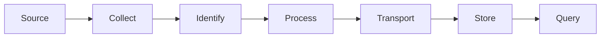
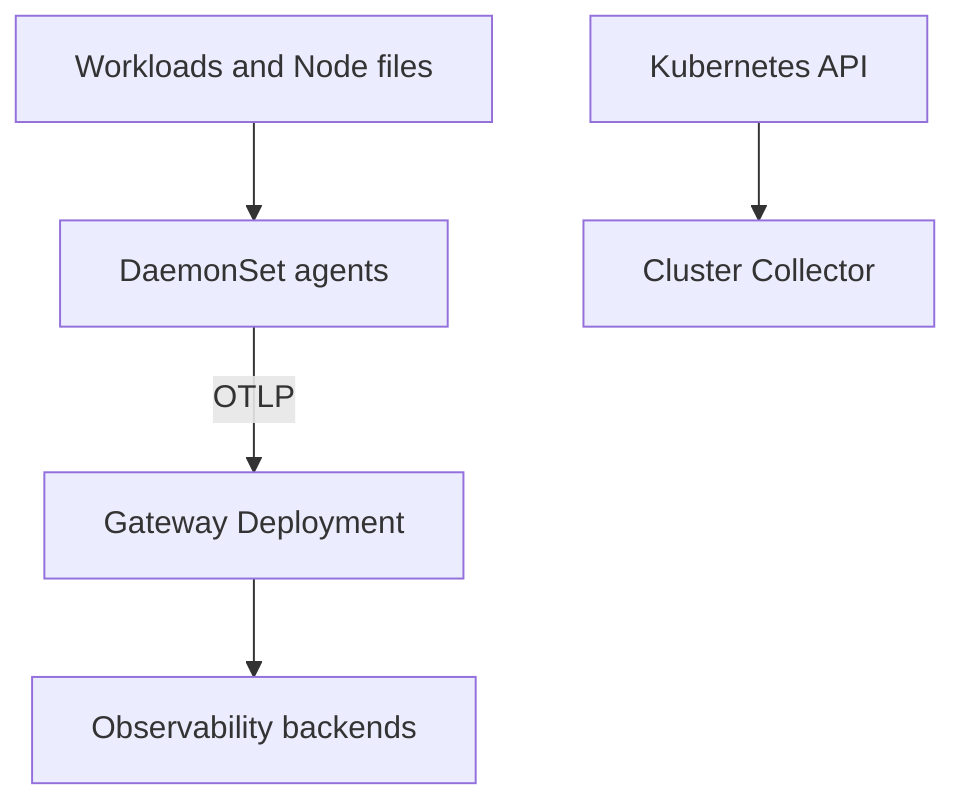
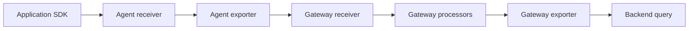

## Table of Contents

1. [Why does useful telemetry need a delivery pipeline?](#why-does-useful-telemetry-need-a-delivery-pipeline)
2. [How do receivers, processors, exporters, and service pipelines form one active route?](#how-do-receivers-processors-exporters-and-service-pipelines-form-one-active-route)
3. [Why do application OTLP, container logs, and Kubernetes Events start through different paths?](#why-do-application-otlp-container-logs-and-kubernetes-events-start-through-different-paths)
4. [Which Collector placement fits node-local collection and shared processing?](#which-collector-placement-fits-node-local-collection-and-shared-processing)
5. [How can attributes improve correlation while controlling privacy and cost?](#how-can-attributes-improve-correlation-while-controlling-privacy-and-cost)
6. [How should the pipeline handle bursts and a slow backend?](#how-should-the-pipeline-handle-bursts-and-a-slow-backend)
7. [How can a team prove one request across the application, Collector, and backend?](#how-can-a-team-prove-one-request-across-the-application-collector-and-backend)
8. [Check Your Answers](#check-your-answers)
9. [References](#references)

When a request fails inside `checkout-service`, evidence may exist as a container log line, an in-memory metric, spans inside application processes, and Kubernetes metadata about the Pod, Deployment, Node, namespace, and container. A backend query cannot see that evidence until a system captures, identifies, processes, transports, and stores it. That system is the telemetry pipeline.

Seven questions follow the data from source to query:

1. **Why does useful telemetry need a delivery pipeline?**
2. **How do receivers, processors, exporters, and service pipelines form one active route?**
3. **Why do application OTLP, container logs, and Kubernetes Events start through different paths?**
4. **Which Collector placement fits node-local collection and shared processing?**
5. **How can attributes improve correlation while controlling privacy and cost?**
6. **How should the pipeline handle bursts and a slow backend?**
7. **How can a team prove one request across the application, Collector, and backend?**

## Why does useful telemetry need a delivery pipeline?
<!-- section-summary: Telemetry is a data-delivery problem before it is a query problem because evidence begins in ephemeral processes, files, endpoints, and APIs. -->

### A signal is not queryable merely because it exists

At the instant `checkout-service` fails, a log line may exist in a Node file, a metric observation may exist in memory or behind `/metrics`, and spans may still exist inside several application processes. Kubernetes also knows which Pod, Deployment, namespace, Node, and container were involved. None of that guarantees that a later backend query can retrieve or correlate the evidence.

The data must survive a sequence of boundaries: capture it before the source disappears, attach usable identity, perform controlled processing, transport it across unreliable links, and store it in the intended backend. Telemetry is therefore a distributed data-delivery problem before it becomes an observability query.

Signals begin in different places:

- application logs commonly begin on `stdout` and `stderr`, which the runtime writes to Node-local files;
- metrics may wait behind `/metrics` for a scraper or leave through an OpenTelemetry SDK;
- trace spans begin inside instrumented application processes;
- Node and Pod measurements come from the kubelet;
- Kubernetes state and Events come from the Kubernetes API.

Kubernetes does not provide permanent cluster-level log storage. A Collector or another collector must see each source, and a backend must store it before it becomes durable and queryable.



For every signal, ask where it physically exists, who can see it, whether it is pushed or pulled, what identity it has, where buffering occurs, what happens when the next hop is unavailable, and how one record can be proven across that hop. Collector architecture follows from those answers.

### Follow the evidence before choosing the tooling

Take one checkout request. Its log begins when the container writes bytes to stdout. Its metric may remain as an in-process counter until a scraper asks for `/metrics`. Its trace begins as several spans emitted by the frontend, checkout, and payment processes. Kubernetes metadata exists in a different control-plane view. A useful query may need all four, but none starts in the backend and none is automatically durable.

```text
container stdout → runtime-managed Node file → log collector → log backend
application counter → /metrics scrape → metrics pipeline → metrics backend
application spans → OTLP receiver → trace pipeline → trace backend
Pod identity → Kubernetes API lookup → enrichment processor → attached attributes
```

This is why “we installed a dashboard” is not a telemetry design. A dashboard is a consumer at the final boundary. Every preceding arrow needs an owner, a protocol or file path, an identity model, failure behavior, and evidence that it is working.

## How do receivers, processors, exporters, and service pipelines form one active route?
<!-- section-summary: Components are only definitions until a service pipeline connects a receiver through ordered processors to an exporter. -->

### Defined components are inert until a pipeline connects them

An OpenTelemetry Collector is a receive-process-export engine:

- a **receiver** accepts OTLP, Prometheus, file logs, kubelet statistics, or another source;
- a **processor** limits memory, enriches, filters, redacts, samples, transforms, or batches data;
- an **exporter** sends data to an OTLP endpoint, remote-write endpoint, message bus, or backend.

Defining components does not activate them. `service.pipelines` must connect them:

```yaml
receivers:
  otlp:
    protocols:
      grpc:
        endpoint: 0.0.0.0:4317

processors:
  memory_limiter:
    check_interval: 1s
    limit_percentage: 75
  k8sattributes:
    auth_type: serviceAccount
  batch:

exporters:
  otlp/backend:
    endpoint: observability-gateway.example:4317

service:
  pipelines:
    traces:
      receivers: [otlp]
      processors: [memory_limiter, k8sattributes, batch]
      exporters: [otlp/backend]
```

Processor order can matter. Load protection belongs early, Kubernetes enrichment needs source context while it is still available, and batching belongs after record-level processing.

The configuration contains two different ideas. The top-level blocks define components that *could* be used. `service.pipelines` selects an active route for a particular signal and fixes the processor order. A correctly configured `filelog` receiver that is never listed in a logs pipeline collects nothing; an exporter that is not connected exports nothing.

Read the active trace path from bottom to top: traces enter through `otlp`, pass through memory protection, Kubernetes enrichment, and batching, then leave through `otlp/backend`. This habit turns a large Collector configuration into explicit data routes rather than a bag of enabled-looking components.

The same Collector can define separate pipelines for logs, metrics, and traces, but each signal must name its route. A component may be shared by several routes only when its behavior fits each one. For example, batching records before export can reduce connection overhead, while redaction may need different rules for log bodies and trace attributes.

Ordering expresses causality. The memory limiter protects the Collector before a burst consumes all available memory. Kubernetes enrichment runs while source association information is available. Filtering or redaction happens before records cross the external boundary. Batching groups the already-approved records for efficient export. Reordering these stages can change what metadata is available, what data leaves the cluster, or whether overload is controlled soon enough.

When debugging configuration, inspect the route rather than merely searching for a component name:

```text
defined receiver
→ named in the correct signal pipeline?
→ processors listed in the intended order?
→ exporter named in that pipeline?
→ endpoint reachable with valid credentials?
```

A syntactically valid component block that never appears in `service.pipelines` is unused configuration, not an active collector.

## Why do application OTLP, container logs, and Kubernetes Events start through different paths?
<!-- section-summary: Each signal's physical source determines its natural receiver and first Collector rather than one arbitrary shared collection point. -->

### Derive the first collector from physical locality

Map sources before choosing a deployment:

| Signal | Source | Natural first collector | Destination |
|---|---|---|---|
| Application traces | OTel SDK | OTLP receiver | Trace backend |
| Application OTLP metrics | OTel SDK | OTLP receiver | Metrics backend |
| Prometheus metrics | `/metrics` endpoint | Prometheus receiver | Metrics backend |
| Container logs | Node log files | Filelog receiver | Log backend |
| Node and Pod metrics | Kubelet | Kubeletstats receiver | Metrics backend |
| Host metrics | Node OS | Host metrics receiver | Metrics backend |
| Kubernetes state | Kubernetes API | Cluster receiver | Metrics backend |
| Kubernetes Events | Kubernetes API | Objects receiver | Log or event backend |

An OTLP receiver can accept network traffic from applications elsewhere in the cluster. A Collector on Node 3 cannot directly read Node 7's `/var/log/pods`, and a host metrics receiver naturally observes its own machine. Cluster receivers are different again: identical copies can collect the same API-wide data several times.

The placement rule is simple: put collection where the data exists.

For example, a container's stdout begins as a Node-local log file. A collector on another Node cannot read that path as though it were local, so placing one collector on every selected Node follows directly. OTLP is network-delivered, so a receiver behind a Service can accept it centrally. Kubernetes Events live behind the Kubernetes API, so running the same cluster receiver on every Node may duplicate the same observations instead of improving coverage.

The push-or-pull direction also shapes reachability. An instrumented application can push OTLP to a known Service endpoint. A Prometheus receiver pulls from application endpoints and therefore needs discovery and network access to those targets. A filelog receiver does not communicate with the application at all; it needs the host path where the container runtime writes logs. A kubeletstats receiver talks to the kubelet associated with its Node. Calling all four “collection” hides the distinct boundary each one must cross.

Build the source map first and verify each row. If a signal's physical source, first receiver, and destination cannot be named, the architecture still contains an unexplained gap.

## Which Collector placement fits node-local collection and shared processing?
<!-- section-summary: DaemonSet agents fit Node-local sources, gateway Deployments fit shared policy and backend access, and sidecars fit unusually tight per-Pod isolation. -->

### Each placement owns a different boundary

A **DaemonSet agent** places one Collector on each selected Node. It fits container logs, host metrics, kubelet metrics, and optionally local OTLP because the collector is near Node-local sources.

A **gateway Deployment** places horizontally scalable Collectors behind a Service. Gateways fit central credentials, organization-wide filtering and redaction, routing, batching, sampling, controlled backend connections, queues, and retries.

A **sidecar** travels with one Pod. It can isolate a special pipeline or satisfy a very local collection need, but it adds a Collector per Pod and increases resource and operational cost.

Cluster-wide receivers can use a separate cluster Collector so that every DaemonSet replica does not duplicate the same Kubernetes API data.



This is a data-locality design, not a requirement that every layer look symmetrical.

A common route now follows naturally: DaemonSet agents read local files and kubelet data, then send OTLP to a gateway Service. Gateway replicas centralize credentials, redaction, routing, batching, queues, and backend connections. A separate cluster Collector reads API-wide state once. Sidecars remain an exception for signals that genuinely need a per-Pod collector boundary.

Scaling every placement identically would be incorrect. More DaemonSet instances mean more selected Nodes. More gateway replicas add shared processing capacity. More identical cluster receivers can merely duplicate data. Placement and scaling both follow the source and processing state.

### Derive the common agent-to-gateway shape

Start with Node-local data. One DaemonSet Pod per selected Node can see that Node's log files, host metrics, and kubelet. Those agents then export over the network to one logical gateway endpoint backed by a Deployment:

```text
Node 1 files and kubelet → agent 1 ┐
Node 2 files and kubelet → agent 2 ├→ gateway Service → gateway replicas → backends
Node 3 files and kubelet → agent 3 ┘

Kubernetes API → one cluster collector → gateway or backend
```

The agents solve locality. The gateway solves shared policy: one place for backend credentials, organization-wide redaction, routing, sampling, batching, retries, and control over outbound connections. The cluster collector solves a different duplication problem by collecting API-wide state once rather than once per Node.

This architecture is not mandatory for every cluster. It is a derivation from three different facts: files and host state are local, shared processing can scale behind a Service, and cluster-wide receivers can duplicate data. If those facts differ—for example, a special Pod requires a tightly isolated per-Pod pipeline—the placement can differ too.

## How can attributes improve correlation while controlling privacy and cost?
<!-- section-summary: Stable service identity and selected Kubernetes runtime attributes make records joinable, while an allowlist prevents high cardinality and sensitive-data leakage. -->

### Keep logical identity stable and runtime identity precise

Identity has two levels. Logical attributes answer which software produced the signal:

```text
service.name = checkout
service.namespace = store
service.version = 2026.08.19
```

`service.name` stays stable across replicas. Runtime attributes answer which incarnation produced it:

```text
k8s.cluster.name = prod-eu
k8s.namespace.name = ecommerce
k8s.deployment.name = checkout
k8s.pod.name = checkout-78c9f5...
k8s.pod.uid = 671ab...
k8s.node.name = node-27
```

The `k8sattributes` processor can discover Pods and attach selected namespace, Pod UID, Deployment, Node, and container metadata. Keep an explicit metadata contract instead of copying every label and annotation.

If `service.name` were set to `checkout-78c9f5-h72js`, every rollout and replica would appear to create a new service. Instead, `service.name = checkout` groups the logical software across replicas and versions, while `k8s.pod.uid` and `service.instance.id` identify the exact runtime incarnation. Investigations can move from the stable service to one failing Pod without confusing ephemerality with service identity.

### Enrichment is a schema contract, not a metadata dump

Values such as customer IDs, request IDs, session IDs, random Pod hashes, full URLs, and commit strings can create excessive metric cardinality. Tokens, email addresses, customer data, and internal annotations can violate privacy. Enrichment, redaction, least-privilege Collector service accounts, TLS and authentication at network boundaries, and protected backend credentials belong to the pipeline design.

Treat the allowed attributes like a versioned API consumed by queries and alerts. `service.name`, environment, cluster, namespace, Deployment, version, and Pod UID each answer a known operational question. A newly copied label should be admitted only when its value space, privacy, and purpose are understood.

Cardinality is the number of distinct label combinations a metrics system must track. A bounded attribute such as namespace creates a manageable set. An unbounded request ID creates a new series for nearly every request. The same request ID may be useful in logs or traces for correlation, but using it as a metric dimension can make storage and queries explode. “Useful somewhere” does not mean “safe on every signal.”

Security follows the same boundary model. The Collector's ServiceAccount should read only the Kubernetes metadata its receivers and processors need. Backend credentials should be available only to the layer that exports there. Transport across a network boundary should authenticate and encrypt the parties. Redaction must happen before sensitive records leave the trusted boundary, not after a vendor has stored them.

## How should the pipeline handle bursts and a slow backend?
<!-- section-summary: Bounded queues, retries, memory limits, sampling, and capacity absorb finite disruption, but sustained arrival above export capacity must eventually shed data or add real throughput. -->

### Backlog growth is arrival rate minus service rate

If 100,000 spans arrive each second while a backend consumes 60,000, backlog grows by 40,000 spans per second. After 30 seconds, 1.2 million spans are waiting. Kubernetes does not change that arithmetic.

```text
backlog growth per second = arrival rate - export rate
100,000 - 60,000 = 40,000 spans
40,000 × 30 seconds = 1,200,000 queued spans
```

Queues buy time; they do not create capacity. A memory queue survives only short disruptions and disappears with the Collector. A queue backed by persistent storage can survive Collector restarts. A durable message bus provides stronger decoupling but introduces another distributed system to operate.

Bounded queues, retry behavior, `memory_limiter`, intentional sampling, and planned data-loss behavior prevent unbounded memory growth. If the backend stays slow until the queue fills, telemetry is eventually refused or dropped. Adding Collector replicas can make an overloaded backend worse by sending to it faster, so queue saturation is often a more direct scaling signal than Collector CPU alone.

A memory queue is appropriate when short disruption can be absorbed and loss on Collector restart is acceptable. Persistent queue storage lets queued batches survive that restart. A durable message bus creates stronger decoupling, but it also creates another production system. The reliability choice should follow the signal: sampled traces and audit logs may have very different loss tolerances.

### Stateful processing needs all records for the same key

Some processing also needs related records together. Tail sampling decides after seeing a trace's outcome, so all spans for one trace must meet at the same sampler. With scaled gateways:


Head sampling decides when the request begins and scales simply, but it cannot know the final outcome. Tail sampling can keep errors or slow traces intelligently, but it needs memory, time, and trace-affine routing.

Randomly balancing spans across three tail samplers can send the frontend, checkout, payment, and database spans of one trace to different instances. No sampler then sees the complete outcome. A stateless first tier must route by `trace_id` so every span for one trace reaches the same stateful sampler. This is the same distributed-systems rule as routing all events for one key to the same partition or shard.

## How can a team prove one request across the application, Collector, and backend?
<!-- section-summary: Send one uniquely identifiable request, trace it across each pipeline boundary, and use Collector self-telemetry to localize missing data. -->

### Follow one identifier instead of looking for generic activity

Send a known request with `synthetic.request_id = test-20260820-001` and propagate trace context through frontend, checkout, and payment. Record the trace ID, then prove it at each hop:



Logs should carry the same trace ID, traces should show the service chain, and metrics can use controlled dimensions such as `service.name = checkout` and `route = /checkout`. “The backend has some traces” does not prove delivery for this request.

When a span disappears, inspect accepted and refused telemetry at receivers, sent and failed telemetry at exporters, and queue size versus capacity. If an agent accepts and sends 1,000 spans while a gateway accepts 1,000 and sends 400, the failure is after gateway ingress.

The same proof should join signals. Query trace ID `ABC` in the trace backend, find application logs carrying `trace_id=ABC`, and inspect controlled metrics dimensions such as `service.name=checkout` and `route=/checkout`. “The backend contains some recent traces” proves only that some path works; accounting for the synthetic request proves this particular path.

### Operate the pipeline as a production service

Operate the telemetry pipeline as a production service. Measure ingress, intentional processing drops and resource use, buffering pressure, successful and failed egress, and delivery delay. Different signals can have different reliability goals: trace sampling may be acceptable while audit-log loss is not.

Four views cover the data plane:

- **ingress:** accepted and refused telemetry;
- **processing:** intentional drops, sampling behavior, CPU, and memory;
- **buffering:** queue size relative to capacity and the age of backlog;
- **egress:** sent records, failed exports, and delivery delay.

A delivery objective can then state what the pipeline owes its users, such as the proportion of accepted production telemetry that reaches its destination within a defined delay. Without its own health signals and objective, the telemetry pipeline can fail during the incident and remove the evidence needed to investigate that failure.

### Turn one synthetic request into a boundary-by-boundary proof

Assume the test request receives trace ID `ABC`. The proof is not one screenshot from a trace UI. It is a chain of observations:

```text
application SDK reports export for ABC
→ agent receiver accepted ABC
→ agent exporter sent ABC
→ gateway receiver accepted ABC
→ processors did not filter or sample ABC away
→ gateway exporter sent ABC
→ backend query returns ABC
```

At each boundary, compare counters over the same interval. If the agent receiver accepts records but its exporter reports failures and the queue grows, the problem is between the agent and its destination. If the gateway accepts the records but sends fewer after an intentional sampling processor, disappearance may be policy rather than transport failure. If exports succeed while the backend query cannot find the trace, verify the destination, tenant, time range, and query identity.

The pipeline's own telemetry makes this possible. Accepted and refused counts describe ingress. Queue size and capacity describe how much disruption remains absorbable. Sent and failed export counts describe egress. Processing-drop metrics distinguish deliberate filtering or sampling from accidental loss. Delivery delay reveals a pipeline that is technically moving data but too slowly to support an incident.

Finally, correlate the request across signal types. The trace shows the frontend-to-checkout-to-payment path. Logs containing `trace_id=ABC` supply detailed events from those services. Metrics grouped by stable dimensions such as `service.name=checkout` and `route=/checkout` show whether the request occurred during a broader pattern. This joins durable, controlled identities; it does not require turning the unique trace ID into a high-cardinality metric label.

## Check Your Answers
<!-- section-summary: Rebuild the pipeline from physical sources, active routes, placement, identity, resilience, trace state, and end-to-end evidence. -->

:::expand[Why does useful telemetry need a delivery pipeline?]{kind="recap"}
Evidence begins in processes, Node files, endpoints, kubelets, and the Kubernetes API. It must be collected, identified, processed, transported, and stored before it can be queried.
:::

:::expand[How do receivers, processors, exporters, and service pipelines form one active route?]{kind="recap"}
Receivers accept data, ordered processors control or enrich it, and exporters send it. The route is active only when `service.pipelines` connects those components.
:::

:::expand[Why do application OTLP, container logs, and Kubernetes Events start through different paths?]{kind="recap"}
They physically exist in different places and use different push, pull, file, or API paths. Their first receiver and Collector follow that locality.
:::

:::expand[Which Collector placement fits node-local collection and shared processing?]{kind="recap"}
DaemonSet agents fit Node-local data, gateways fit shared processing and backend access, sidecars fit exceptional per-Pod isolation, and a cluster Collector avoids duplicate API-wide collection.
:::

:::expand[How can attributes improve correlation while controlling privacy and cost?]{kind="recap"}
Use stable logical service identity plus selected runtime attributes. Allowlist enrichment so high-cardinality or sensitive Kubernetes data does not leak into telemetry.
:::

:::expand[How should the pipeline handle bursts and a slow backend?]{kind="recap"}
Use bounded queues, retries, limits, sampling, and enough real export capacity. Queues absorb finite disruption; trace-aware routing keeps spans together for tail sampling.
:::

:::expand[How can a team prove one request across the application, Collector, and backend?]{kind="recap"}
Send one uniquely identified request, account for it at every hop, and use receiver, exporter, and queue telemetry to locate the first boundary where it disappears.
:::

## References

- [OpenTelemetry Collector configuration](https://opentelemetry.io/docs/collector/configuration/)
- [OpenTelemetry Collector deployment patterns](https://opentelemetry.io/docs/collector/deployment/)
- [OpenTelemetry Collector in Kubernetes](https://opentelemetry.io/docs/platforms/kubernetes/collector/)
- [Kubernetes logging architecture](https://kubernetes.io/docs/concepts/cluster-administration/logging/)
- [DaemonSet](https://kubernetes.io/docs/concepts/workloads/controllers/daemonset/)
