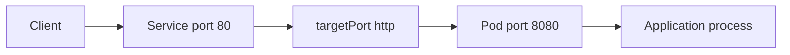
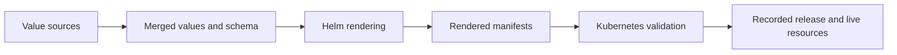

## Table of Contents

1. [What job do values and templates each perform?](#what-job-do-values-and-templates-each-perform)
2. [How does Helm turn values into ordinary Kubernetes YAML?](#how-does-helm-turn-values-into-ordinary-kubernetes-yaml)
3. [How should a chart design and validate its public inputs?](#how-should-a-chart-design-and-validate-its-public-inputs)
4. [Which input wins when Helm receives values from several places?](#which-input-wins-when-helm-receives-values-from-several-places)
5. [How do Service port, targetPort, and containerPort relate?](#how-do-service-port-targetport-and-containerport-relate)
6. [How can a chart keep secret data on a separate path?](#how-can-a-chart-keep-secret-data-on-a-separate-path)
7. [How can a team verify that the rendered release matches its intent?](#how-can-a-team-verify-that-the-rendered-release-matches-its-intent)
8. [Check Your Answers](#check-your-answers)
9. [References](#references)

Helm values are configuration inputs. Templates are transformation logic. Helm combines them with chart and release context to produce ordinary Kubernetes manifests. Kubernetes never sees `.Values`, `values.yaml`, or template expressions.

The rendering equation is:

```text
chart templates
+ final merged .Values
+ Helm context such as .Release, .Chart, and .Capabilities
──────────────────────────────────────────────────────────
rendered Kubernetes manifests
```

Helm is not a process that remains between a Service and a Pod at runtime. Once Helm submits a rendered Deployment or Service, the Kubernetes API and controllers interpret those ordinary objects. This static authoring boundary is the key to debugging values: trace the input into rendered YAML, then use Kubernetes concepts from that point onward.

Keep these questions in view as you work through the lesson:

1. **What job do values and templates each perform?**
2. **How does Helm turn values into ordinary Kubernetes YAML?**
3. **How should a chart design and validate its public inputs?**
4. **Which input wins when Helm receives values from several places?**
5. **How do Service port, targetPort, and containerPort relate?**
6. **How can a chart keep secret data on a separate path?**
7. **How can a team verify that the rendered release matches its intent?**

## What job do values and templates each perform?
<!-- section-summary: Values hold supported configuration choices; templates decide how those choices become fields and objects in Kubernetes. -->

Defaults for `myapp` can describe intent:

```yaml
replicaCount: 2
image:
  repository: ghcr.io/acme/myapp
  tag: "1.4.0"
containerPort: 8080
service:
  type: ClusterIP
  port: 80
secret:
  existingSecret: myapp-runtime
```

Those fields do nothing unless a template consumes them. `replicaCount: 10` means ten replicas only because a template contains:

```gotemplate
replicas: {{ .Values.replicaCount }}
```

Likewise, `service.enabled: false` has no effect unless a conditional omits the Service. Values are knobs; templates decide what those knobs control.

### A value is part of an interface only when rendering connects it

The key name alone has no Kubernetes meaning. A chart author can expose `containerPort`, then use it in a Deployment, or expose `service.port`, then use it in a Service. A misspelled or unused value can merge successfully while changing no manifest at all.

This is why values are best understood as the chart's public input contract and templates as its implementation. The contract should expose choices users own while the template preserves labels, selectors, references, and other Kubernetes wiring.

Treat values as user-facing configuration and templates as the Kubernetes implementation. A chart consumer should state “three replicas, this image, this Service exposure, and these resources” without reconstructing the complete Deployment structure.

Consider the chart layout:

```text
myapp/
├── Chart.yaml
├── values.yaml
├── values.schema.json
└── templates/
    ├── deployment.yaml
    └── service.yaml
```

`values.yaml` can define defaults, but a template must read each field to give it an effect. A Deployment might connect `replicaCount`, image fields, `containerPort`, and an existing Secret name:

```gotemplate
spec:
  replicas: {{ .Values.replicaCount }}
  template:
    spec:
      containers:
        - name: app
          image: "{{ .Values.image.repository }}:{{ .Values.image.tag }}"
          ports:
            - name: http
              containerPort: {{ .Values.containerPort }}
          env:
            - name: DATABASE_PASSWORD
              valueFrom:
                secretKeyRef:
                  name: {{ .Values.secret.existingSecret }}
                  key: database-password
```

A separate Service template connects its own values and the named Pod port. This division matters because values do not issue instructions to Kubernetes. They are data read by a program—the chart templates. A value named `service.enabled` changes nothing unless conditional template logic uses it to include or omit a Service.

When an override appears ineffective, first prove that the template consumes the exact key. An accepted but unused value is not a Kubernetes failure; it is an unconnected chart input.

## How does Helm turn values into ordinary Kubernetes YAML?
<!-- section-summary: Helm exposes the merged values to templates, evaluates expressions, and emits concrete objects that no longer contain Helm syntax. -->

The Deployment can read values and release identity:

```gotemplate
apiVersion: apps/v1
kind: Deployment
metadata:
  name: {{ .Release.Name }}
spec:
  replicas: {{ .Values.replicaCount }}
  selector:
    matchLabels:
      app: {{ .Release.Name }}
  template:
    metadata:
      labels:
        app: {{ .Release.Name }}
    spec:
      containers:
        - name: app
          image: "{{ .Values.image.repository }}:{{ .Values.image.tag }}"
          ports:
            - name: http
              containerPort: {{ .Values.containerPort }}
```

Rendering with `helm template payments ./myapp` produces fields such as:

```yaml
metadata:
  name: payments
spec:
  replicas: 2
  template:
    spec:
      containers:
        - name: app
          image: "ghcr.io/acme/myapp:1.4.0"
          ports:
            - name: http
              containerPort: 8080
```

Templates can combine `.Values` with built-in context such as `.Release`, `.Chart`, and `.Capabilities`. The compiler analogy is useful: values are input, templates are source, Helm is the compiler, rendered YAML is output, and the Kubernetes API consumes that output.

### Follow one input through rendering

If `.Values.replicaCount` is `2`, `.Values.image.tag` is `1.4.0`, and `.Release.Name` is `payments`, the template produces a Deployment named `payments` with two replicas of `ghcr.io/acme/myapp:1.4.0`. Helm expressions disappear from the output.

At that point, Kubernetes cannot tell whether the YAML came from Helm, Kustomize, a hand-written file, or another generator. It validates and reconciles the concrete Deployment fields.

### Render the Service and Deployment as one connected example

Suppose the final values are:

```yaml
replicaCount: 2
image:
  repository: ghcr.io/acme/myapp
  tag: "1.4.0"
containerPort: 8080
service:
  type: ClusterIP
  port: 80
```

Helm substitutes each expression and produces no `.Values` references. The Deployment has two replicas, image `ghcr.io/acme/myapp:1.4.0`, and a Pod port named `http` at 8080. The Service is a `ClusterIP` listening at port 80 and targeting `http`. Release context can supply the shared name `payments`, making its selector and the Pod label agree.

```text
Helm source world                    Kubernetes object world
─────────────────                    ───────────────────────
.Values.replicaCount = 2       →     Deployment.spec.replicas = 2
.Values.image.*                →     container image string
.Values.service.port = 80      →     Service port = 80
.Release.Name = payments       →     names, labels, and selectors
```

The compiler analogy helps only if the output is inspected. A valid template expression can still wire the wrong value into the wrong field, just as valid source code can implement the wrong behavior. Treat the rendered manifests as a review artifact: they are the first representation shared by Helm, Kubernetes validation, and operators.

## How should a chart design and validate its public inputs?
<!-- section-summary: Expose only meaningful release choices, keep the structure understandable, and validate the final merged values with a JSON schema. -->

Good values represent choices an installer needs:

```yaml
replicaCount: 3
image:
  repository: ghcr.io/acme/payments
  tag: "2.7.1"
  pullPolicy: IfNotPresent
service:
  type: ClusterIP
  port: 80
resources:
  requests:
    cpu: 100m
    memory: 128Mi
  limits:
    memory: 256Mi
```

Avoid mirroring the entire nested Deployment API as values or exposing a switch merely because templating makes it possible. Very deep value trees and hundreds of switches can become harder than direct YAML.

A `values.schema.json` validates the final merged `.Values` object:

```json
{
  "$schema": "https://json-schema.org/draft-07/schema#",
  "type": "object",
  "properties": {
    "replicaCount": {"type": "integer", "minimum": 1},
    "containerPort": {
      "type": "integer",
      "minimum": 1,
      "maximum": 65535
    },
    "image": {
      "type": "object",
      "required": ["repository", "tag"]
    }
  },
  "required": ["replicaCount", "image", "containerPort"]
}
```

This catches `replicaCount: banana` at the Helm input boundary. Kubernetes schema validation separately checks whether the rendered objects are valid Kubernetes resources.

### Input validation and Kubernetes validation protect different contracts

The values schema can say that `replicaCount` must be an integer of at least one and `containerPort` must fall between 1 and 65535. It cannot prove that the rendered Service selector matches the Pod labels or that an admission policy accepts the Deployment.

Conversely, the Kubernetes API only sees the rendered object. It cannot tell a chart user that `image.tag` was omitted from the public interface unless the resulting manifest violates a Kubernetes rule. Strong charts validate values early and still validate the rendered resources later.

### Design the value surface around installer intent

An installer can understand this contract without knowing the exact Pod layout:

```text
replicaCount → how many application instances are desired
image        → which application artifact should run
service      → how clients inside the cluster reach it
resources    → what each instance requests and may consume
```

Mirroring `deployment.spec.template.spec.containers[0]` into values exposes Kubernetes implementation structure and ties users to array positions and template internals. A very deep tree also makes command-line overrides difficult to read. Expose a field because consumers own a real decision, not because Helm can interpolate it.

`values.schema.json` formalizes the contract before rendering. It can require the image object, reject an empty repository, require an integer replica count of at least one, and bound a port to 1–65535. Helm validates the *final merged values*, so a bad value from an environment file or `--set` is checked just like a bad chart default. Commands such as lint, template, install, and upgrade can surface the input failure before Kubernetes sees `replicas: banana`.

The second validation boundary still matters:

```text
values schema → Is this a valid chart input?
rendering     → Did the chart connect it correctly?
API schema and admission → Is the resulting Kubernetes object acceptable?
```

No one boundary proves the other two. A valid integer can be rendered into the wrong object; valid Kubernetes YAML can still violate a chart's intended contract.

## Which input wins when Helm receives values from several places?
<!-- section-summary: Helm merges value layers in documented precedence order, with later files and command-line overrides winning conflicts. -->

From lower to higher priority:

1. chart `values.yaml`;
2. parent-chart subchart overrides;
3. `-f` values files;
4. `--set` and other command-line overrides.

With:

```bash
helm install payments ./myapp \
  -f common.yaml \
  -f production.yaml \
  --set replicaCount=5
```

the command-line value wins. Among repeated `-f` files or repeated `--set` arguments, the right-most conflicting value wins.

### Reconstruct the final merged object layer by layer

Suppose chart defaults set two replicas, `common.yaml` describes shared image settings, `production.yaml` sets eight replicas, and a command line sets ten. The template sees ten. It still receives non-conflicting image fields from the earlier layers.

```text
chart defaults
      ↓ overlay common.yaml
      ↓ overlay production.yaml
      ↓ overlay command-line values
final merged .Values
```

This is a merge of an object rather than selection of one winning file. When a release surprises you, inspect the computed values and identify the last source that supplied the conflicting field.

Upgrades add another decision. `helm upgrade --reuse-values` starts from the previous release values and merges new overrides. Reset-related options intentionally return toward chart defaults. Always inspect the computed values rather than assuming a file alone describes the release.

### Calculate precedence with a worked merge

Assume these sources:

```yaml
# chart values.yaml
replicaCount: 2
image:
  repository: ghcr.io/acme/payments
  tag: "1.0.0"
```

```yaml
# common.yaml
image:
  tag: "2.0.0"
```

```yaml
# production.yaml
replicaCount: 8
```

and this command:

```bash
helm install payments ./myapp \
  -f common.yaml \
  -f production.yaml \
  --set replicaCount=10
```

The final object contains `replicaCount: 10`, image repository from chart defaults, and image tag `2.0.0` from `common.yaml`. Later sources cover conflicting keys; they do not discard every non-conflicting key from earlier sources.

The order of repeated files is operationally meaningful. Swapping `common.yaml` and `production.yaml` changes only conflicts between them, but that can still change a release. A command-line emergency override is highest priority and easy to forget in later debugging, so use `helm get values --all` to inspect what the release actually computed.

During upgrades, decide explicitly whether the previous release's values remain a base. `--reuse-values` carries them forward and layers new overrides on top; reset options move back toward the new chart's defaults. An upgrade can therefore change even when the file in front of you has not, because previous release values or changed chart defaults participate in the merge.

## How do Service port, targetPort, and containerPort relate?
<!-- section-summary: Each port belongs to a different boundary: client-to-Service, Service-to-Pod, and the application's declared container endpoint. -->

If the application listens on 8080:

```yaml
ports:
  - name: http
    containerPort: 8080
```

a Service can expose it at 80:

```yaml
ports:
  - name: http
    port: 80
    targetPort: http
```

The traffic path is:



`containerPort` describes the Pod-side port; it does not make the program listen. The application must bind to `0.0.0.0:8080`. Service `port` is the client-facing cluster port. `targetPort` selects the Pod port by number or name.

Values can expose `containerPort: 8080` and `service.port: 80` while templates wire the Service's `targetPort` to the named `http` Pod port. The numbers need not match because they describe different boundaries.

### The port declarations do not start the process listener

The application must still bind to `0.0.0.0:8080`. `containerPort: 8080` documents and names that Pod endpoint for Kubernetes configuration; it does not reconfigure an application listening on another address. The full proof follows traffic from Service port 80 through named target `http` to the process that is actually listening at 8080.

### Name each boundary before changing a number

The port fields answer different questions:

| Field | Question |
|---|---|
| `service.port: 80` | Which port do Service clients connect to? |
| `targetPort: http` | Which named or numbered Pod endpoint receives Service traffic? |
| `containerPort: 8080` | Which Pod-side application endpoint is declared and named? |
| process listener | On which address and port did the application actually bind? |

Named target ports keep the Service stable while the Pod-side number can change. The Service targets `http`; the Deployment defines `http` as 8080. If a later application listens on 9090, the chart can change the named Pod port while Service clients still use port 80.

An Ingress or Gateway adds another upstream boundary:

```text
external client
→ Ingress or Gateway route
→ Service payments:80
→ targetPort http
→ Pod IP:8080
→ process listening on 0.0.0.0:8080
```

Making all numbers identical does not simplify the model; it hides that each belongs to a different network boundary. When traffic fails, verify each mapping and the process listener separately.

## How can a chart keep secret data on a separate path?
<!-- section-summary: Pass only an existing Secret reference through normal values and deliver confidential material through a protected secret-management path. -->

Putting a production password in a values file sends it through values storage, Helm rendering, debug output, and the generated Secret. A cleaner value is:

```yaml
secret:
  existingSecret: payments-runtime
```

The template references the separately managed Secret:

```gotemplate
env:
  - name: DATABASE_PASSWORD
    valueFrom:
      secretKeyRef:
        name: {{ .Values.secret.existingSecret }}
        key: database-password
```

Normal configuration travels from Git through values and Helm. Confidential data travels through a secret manager, secure delivery system, or secret operator into a Kubernetes Secret. The two paths meet in the Pod.

```text
normal settings: Git → values → Helm → Deployment
secret material: protected source → Kubernetes Secret
                                      ↑
                         Deployment references its name
```

This keeps the chart's public value as “which Secret should this release use?” rather than “what is the password?”

Base64 is not encryption. Secret protection also needs appropriate RBAC and cluster storage controls. Treat Helm dry-run output carefully because rendered Secrets can appear there.

### Compare the two secret paths explicitly

Putting `database.password` in `values-production.yaml` creates this route:

```text
values file
→ CI or operator command
→ Helm merged values
→ rendered Secret manifest
→ release/debug output and Helm history
→ Kubernetes Secret
```

The chart may work, but the confidential value has crossed every Helm input and inspection surface. A separately managed Secret changes the chart contract to a reference:

```text
protected secret source → Kubernetes Secret payments-runtime
                                      ↑
Helm values contain only its name → Deployment secretKeyRef
```

The Pod still receives the credential through a Secret environment reference or mounted volume, but Helm does not need the password value to render the Deployment. This separation reduces accidental disclosure without claiming that a Kubernetes Secret is automatically secure. RBAC, encryption at rest, careful access, and safe debug output remain required.

References also make ownership clearer. The chart owns how the workload consumes a credential; the secret-delivery system owns the credential's material and rotation. Both must agree on the Secret name and key contract.

## How can a team verify that the rendered release matches its intent?
<!-- section-summary: Validate inputs, render exact values, inspect the output as Kubernetes YAML, ask the API server to validate it, and compare the installed manifest. -->

Use a boundary-by-boundary sequence:

```bash
helm lint ./myapp -f values-production.yaml

helm template payments ./myapp \
  -f values-production.yaml \
  --debug > rendered.yaml

kubectl apply --dry-run=server -f rendered.yaml
```

Read `rendered.yaml` without relying on the source template. Confirm replicas, image, Service port, named `targetPort`, container port, and Secret reference.

For a production input containing four replicas, image `2.7.1`, container port 8080, Service port 80, and Secret `payments-production`, the rendered proof should show all five decisions in the correct objects and references. That single scenario checks the value contract, rendering logic, port wiring, and secret boundary together.

After installation:

```bash
helm get manifest payments
helm get values payments --all
```

The evidence chain is:



Rendered YAML is the boundary truth Kubernetes sees.

### Localize failures by stopping at the first broken boundary

Use the verification steps as a diagnostic ladder:

1. `helm lint` and schema validation prove that the selected chart inputs satisfy the declared contract.
2. `helm template --debug` proves what those inputs and templates generate without installing the release.
3. Human inspection proves that the intended replicas, image, ports, selectors, and Secret reference appear in the correct objects.
4. Server-side dry-run asks the real API server, including applicable validation and admission, whether it would accept those objects without persistence.
5. `helm get manifest` and `helm get values --all` show what the installed release recorded.
6. Live Kubernetes objects and status show what exists and whether controllers converged.

If `replicaCount` is wrong in computed values, investigate precedence. If it is correct there but wrong in rendered YAML, investigate the template. If rendered YAML is correct but server dry-run rejects it, investigate Kubernetes schema or admission. If installation succeeded but the application cannot receive traffic, continue through Service endpoints, Pod readiness, and the process listener.

This boundary-by-boundary method replaces the vague question “What is Helm thinking?” with observable artifacts. Start from the values that actually won, then the YAML actually rendered, then the API response and live resources. Each step has a different owner and a different class of failure.

### Reconstruct one production release from its values

Suppose production selects:

```yaml
replicaCount: 4
image:
  repository: ghcr.io/acme/payments
  tag: "2.7.1"
containerPort: 8080
service:
  type: ClusterIP
  port: 80
secret:
  existingSecret: payments-production
```

Read this as intent before reading any template: run four copies of application `2.7.1`; the application listens on 8080; clients inside the cluster use Service port 80; and credentials come from a separately managed Secret.

The templates should turn that statement into a connected object set:

```text
Deployment payments
├─ replicas 4
├─ image ghcr.io/acme/payments:2.7.1
├─ named Pod port http = 8080
└─ secretKeyRef payments-production/database-password

Service payments
├─ ClusterIP port 80
└─ targetPort http
```

Kubernetes then creates four Pods through the Deployment controller, and the Service routes to ready matching Pods at their named `http` endpoint. Helm is no longer part of that traffic path.

This walkthrough is also a compact acceptance test. The values schema validates the types and required keys. Rendering must place every input in the intended field and preserve label, selector, and port relationships. Server-side dry-run must accept the objects. After installation, computed values and the recorded manifest must match the inspected proposal, and runtime verification must show four Ready Pods reachable through the Service. Each failure points back to one boundary rather than to “Helm” as a whole.

If the Pods are Ready but the Service is unreachable, do not change `service.port`, `targetPort`, and `containerPort` together at random. Inspect the rendered Service selector, its endpoint population, the named Pod port, and the process listener. If the image is wrong, compare computed `.Values.image` with the rendered Deployment before investigating the registry or kubelet. If the Secret reference is correct but the key is absent, the chart has fulfilled its reference contract and the protected secret-delivery path is the next boundary.

The same reasoning applies to every chart input. State the human decision, identify the winning merged value, locate every template consumer, inspect the rendered fields, validate them at the API, and then observe the resulting controller or traffic behavior. That sequence turns a values file from a loose collection of switches into a testable public interface.

When a value is removed or renamed, test that interface as a compatibility change. Existing environment files, parent-chart overrides, command-line automation, and upgrade reuse can still supply the old key even when a new default works in a fresh install.
Computed values reveal those older consumers before their rendered effect is mistaken for a template bug.

## Check Your Answers
<!-- section-summary: Rebuild Helm values from their role, render path, schema, precedence, port wiring, Secret boundary, and verification workflow. -->

:::expand[What job do values and templates each perform?]{kind="recap"}
Values express supported choices. Templates connect those choices to Kubernetes fields and decide which objects exist.
:::

:::expand[How does Helm turn values into ordinary Kubernetes YAML?]{kind="recap"}
Helm evaluates templates against merged values and built-in context, replacing expressions with concrete fields before Kubernetes sees the objects.
:::

:::expand[How should a chart design and validate its public inputs?]{kind="recap"}
Expose meaningful intent instead of the complete Kubernetes implementation, keep the structure shallow, and validate merged values with `values.schema.json`.
:::

:::expand[Which input wins when Helm receives values from several places?]{kind="recap"}
Chart defaults have the lowest priority, then parent overrides, values files, and command-line overrides. Later conflicting files or overrides win.
:::

:::expand[How do Service port, targetPort, and containerPort relate?]{kind="recap"}
Clients use Service `port`, the Service maps through `targetPort`, and the application listens at the Pod-side port described by `containerPort`.
:::

:::expand[How can a chart keep secret data on a separate path?]{kind="recap"}
Put only the existing Secret name in ordinary values. Deliver the actual secret through a protected system and reference its key from the Pod.
:::

:::expand[How can a team verify that the rendered release matches its intent?]{kind="recap"}
Lint, render, inspect the exact YAML, validate it with the API server, and compare Helm's computed values and recorded manifest after installation.
:::

## References

- [Values files](https://helm.sh/docs/chart_template_guide/values_files/)
- [Values](https://helm.sh/docs/chart_best_practices/values/)
- [Schema files](https://helm.sh/docs/topics/charts/#schema-files)
- [Debugging templates](https://helm.sh/docs/chart_template_guide/debugging/)
- [Kubernetes Services](https://kubernetes.io/docs/concepts/services-networking/service/)
- [Kubernetes Secrets](https://kubernetes.io/docs/concepts/configuration/secret/)
