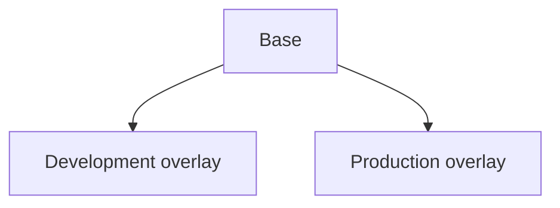
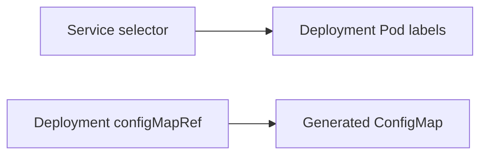

## Table of Contents

1. [What does Kustomize build from a directory?](#what-does-kustomize-build-from-a-directory)
2. [What belongs in a base, and what belongs in an overlay?](#what-belongs-in-a-base-and-what-belongs-in-an-overlay)
3. [How does an overlay compose resources from a base?](#how-does-an-overlay-compose-resources-from-a-base)
4. [How do transformers keep names and references aligned?](#how-do-transformers-keep-names-and-references-aligned)
5. [How does a patch find and change the intended fields?](#how-does-a-patch-find-and-change-the-intended-fields)
6. [Which overlay problems only become visible after rendering?](#which-overlay-problems-only-become-visible-after-rendering)
7. [How can a team review, apply, and recover a rendered change?](#how-can-a-team-review-apply-and-recover-a-rendered-change)
8. [Check Your Answers](#check-your-answers)
9. [References](#references)

Kubernetes requires complete resource objects. It cannot interpret “use the normal API Deployment, but run eight replicas because this is production.” Kustomize turns valid reusable Kubernetes resources plus a deployment-specific delta into the complete YAML the API server receives.

Kustomize is therefore closer to a configuration compiler than a template engine. Its source resources remain valid Kubernetes YAML: it composes and transforms objects instead of placing `${VARIABLES}` or template expressions inside them.

The complete model is:

```text
reusable Kubernetes resources
+ environment-specific changes
→ Kustomize build
→ complete Kubernetes objects
→ Kubernetes API
```

Kubernetes does not know which fields came from a base, overlay, generator, transformer, or patch. Those are source-organization concepts. The boundary between Kustomize and Kubernetes is the rendered object set.

Keep these questions in view as you work through the lesson:

1. **What does Kustomize build from a directory?**
2. **What belongs in a base, and what belongs in an overlay?**
3. **How does an overlay compose resources from a base?**
4. **How do transformers keep names and references aligned?**
5. **How does a patch find and change the intended fields?**
6. **Which overlay problems only become visible after rendering?**
7. **How can a team review, apply, and recover a rendered change?**

## What does Kustomize build from a directory?
<!-- section-summary: Kustomize loads valid Kubernetes resources and generation or transformation instructions, then emits complete Kubernetes objects without changing the source files. -->

A base can contain ordinary Kubernetes YAML:

```yaml
# base/deployment.yaml
apiVersion: apps/v1
kind: Deployment
metadata:
  name: api
spec:
  replicas: 2
  selector:
    matchLabels:
      app: api
  template:
    metadata:
      labels:
        app: api
    spec:
      containers:
        - name: api
          image: ghcr.io/example/api:v1
          envFrom:
            - configMapRef:
                name: api-config
```

Its `kustomization.yaml` composes files and can generate resources:

```yaml
apiVersion: kustomize.config.k8s.io/v1beta1
kind: Kustomization
resources:
  - deployment.yaml
  - service.yaml
configMapGenerator:
  - name: api-config
    literals:
      - LOG_LEVEL=info
```

`kubectl kustomize base/` builds YAML without changing the cluster. `kubectl apply -k base/` builds and submits it. Kustomize is therefore a configuration compiler: Kubernetes objects go in, transformed Kubernetes objects come out, and source files remain unchanged.

### Build and apply cross an important boundary

`kubectl kustomize` proves what the local directory renders. It does not create a Deployment, call an admission webhook, or wait for a rollout. `kubectl apply -k` takes that generated object graph and sends it to Kubernetes.

```text
valid Kubernetes source resources
          +
generation and transformation instructions
          ↓
      Kustomize build
          ↓
complete Kubernetes YAML
          ↓
      Kubernetes API
```

That boundary lets a team inspect the complete desired state before the cluster participates.

### Build a resource graph, not a text file

Add a base Service:

```yaml
apiVersion: v1
kind: Service
metadata:
  name: api
spec:
  selector:
    app: api
  ports:
    - port: 80
      targetPort: 8080
```

The base now contains related objects: the Service selector points at Pod labels from the Deployment, while the Deployment refers to the generated ConfigMap. `kustomization.yaml` tells Kustomize which resources belong to the input set and which resource to generate.

```text
deployment.yaml ─┐
service.yaml ────┼→ load and generate resource graph → serialize YAML
ConfigMap data ──┘
```

This is more than concatenation. Transformations can change identities and known references across the graph. Kustomize then emits a stream of complete YAML documents. `kubectl kustomize` stops at that artifact; `kubectl apply -k` takes the additional step of submitting it to the API server.

## What belongs in a base, and what belongs in an overlay?
<!-- section-summary: A base owns application invariants; an overlay owns the small delta required for one concrete deployment context. -->

A base answers “what is true everywhere?” For `api`, that can include its name, port 8080, health endpoint, required Service and ConfigMap, container name, labels, and selectors.

### Put invariants and context decisions in different owners

An overlay answers “what must change here?” Production can choose eight replicas, namespace `production`, image `v4.2.1`, one CPU, one GiB of memory, and prefix `prod-`.

```text
environment configuration = common configuration + environment delta
```

The base must not know which overlays consume it:



Use `resources` to reference another kustomization; the older literal `bases` field is deprecated. Keep composition shallow so a reviewer does not need to search base, region, environment, customer, and cluster layers to learn where one value came from.

If every environment needs `/healthz`, the base should own the probe. If only production needs eight replicas, the production overlay should own that delta. File size does not decide the boundary; whether a fact is universal or contextual does.

A component can represent an optional reusable capability such as monitoring or hardened security. The base is the common application, a component is an optional feature, and an overlay is a complete deployable variant.

This is composition rather than deep inheritance. A chain of base → region → environment → customer → cluster may be possible, but it hides where a final value came from. Prefer a common base and a shallow deployable overlay unless another layer expresses a genuinely reusable concept.

### Classify a field by meaning, not by file size

For `api`, the application invariants can be stated in ordinary language:

```text
the container is named api
the process is reached at port 8080
the Service selects Pods labeled app=api
configuration comes from api-config
the application exposes /healthz
```

If development, staging, and production all rely on those facts, the base should own them. A probe does not become a production concern merely because it was first requested during a production incident.

Context decisions answer different questions:

```text
how much production capacity is needed?
which image has production approval?
which namespace owns this instance?
which resource requests fit this cluster?
which hostname represents this environment?
```

Those belong in the deployable overlay when they genuinely vary. The equation `environment = invariants + delta` prevents both common drift and an overloaded base that silently encodes one environment's choices for every consumer.

Optional features form a third category. Monitoring or hardened security may be reusable across several, but not all, overlays. A component can package that optional capability without pretending it is universal base state or a complete environment. Keep the roles explicit: base is the application, component is an optional reusable feature, and overlay is the deployable result.

## How does an overlay compose resources from a base?
<!-- section-summary: An overlay recursively loads the base, applies contextual transformations and patches, and derives a new output without mutating the common source. -->

```yaml
# overlays/prod/kustomization.yaml
apiVersion: kustomize.config.k8s.io/v1beta1
kind: Kustomization
resources:
  - ../../base
namespace: production
namePrefix: prod-
images:
  - name: ghcr.io/example/api
    newTag: v4.2.1
patches:
  - path: deployment-patch.yaml
```

The patch describes the production-only resources:

```yaml
apiVersion: apps/v1
kind: Deployment
metadata:
  name: api
spec:
  replicas: 8
  template:
    spec:
      containers:
        - name: api
          resources:
            requests:
              cpu: "1"
              memory: 1Gi
```

Kustomize starts with Deployment `api`, Service `api`, and the generated ConfigMap, then applies namespace, prefix, image, replica, and resource changes. The base still says `name: api` afterward; `prod-api` exists only in rendered output.

### Follow the resource set through production composition

The overlay does not create a second Deployment. It loads the base's object set, then derives a production variant:

```text
input graph
├── Deployment api
├── Service api
└── generated ConfigMap api-config
          ↓ production overlay
namespace = production
namePrefix = prod-
image = v4.2.1
replicas = 8
resources = 1 CPU and 1 GiB
          ↓
rendered production graph
```

The source Deployment still has `name: api` and two replicas after the build. Development and production can derive different outputs from the same unmodified source.

The production output is calculated rather than written back:

```text
Deployment api, replicas 2, image v1
Service api
ConfigMap generator api-config
        ↓ compose ../../base
namespace transformer → production
name transformer      → prod- prefix
image transformer     → v4.2.1
Deployment patch      → replicas 8 and production resources
        ↓
Deployment prod-api in production
Service prod-api in production
generated prod-api-config-<hash> in production
```

Building the development overlay later begins from the same base source, not from production's output. This one-way relationship is why the base must remain unaware of overlays: any number of consumers can derive variants without environment logic accumulating in common resources.

## How do transformers keep names and references aligned?
<!-- section-summary: Resource-aware transformers update object identity and known reference fields together rather than performing unsafe text replacement. -->

Transformers apply a general operation across matching resources. `namePrefix: prod-` can rename the Deployment, Service, and ConfigMap. Kustomize also understands common reference fields, so the Deployment's `configMapRef.name` follows the ConfigMap rename.

### A transformer operates on resource relationships

Text replacement can rename a ConfigMap while leaving the Deployment pointed at its old name. Resource-aware transformation updates the known identity and its known reference fields together. The same idea applies when generated resource identities change.

Generated ConfigMaps normally receive a content hash:

```yaml
metadata:
  name: prod-api-config-k4ttm68f99
```

The Deployment reference becomes the same name. If `LOG_LEVEL=info` changes to `debug`, the hash and Pod-template reference change, which can naturally trigger a rollout.

The content hash makes configuration identity explicit. Changing generated content creates a new ConfigMap name; rewriting the Pod template reference makes the workload template change too. The Deployment controller can then create Pods that refer to the new configuration rather than silently reusing the old name.

This is resource-graph transformation:



Kustomize knows common Kubernetes relationships, but it cannot infer that every arbitrary string in a Custom Resource is a reference. A field such as `spec.databaseRef.name` may need custom transformer configuration.

Kustomize cannot infer that every string ending in `name` is an object reference. Custom Resources can define arbitrary schemas, so their relationships may require additional transformer configuration.

### Follow one generated ConfigMap through a change

Initially the generator contains `LOG_LEVEL=info`. Kustomize can create `prod-api-config-abc123` and update the Deployment's known `configMapRef.name` to the same identity. The Pod template therefore points at an object that exists.

Change the literal to `LOG_LEVEL=debug`. The generated content changes, so the content-based suffix can become `prod-api-config-def456`. Reference rewriting changes the Pod template too:

```text
ConfigMap content changes
→ generated ConfigMap identity changes
→ Deployment configMapRef changes
→ Deployment Pod template changes
→ controller can roll out Pods using the new configuration
```

A global text replacement would not understand this relationship. It might rename the ConfigMap but leave the reference broken, or replace unrelated strings. Kustomize's built-in resource knowledge is what makes common transformations structural.

That knowledge has a boundary. A Custom Resource field such as `spec.databaseRef.name` has application-specific meaning that cannot be inferred from its text. Unless transformer configuration teaches Kustomize the relationship, renaming the referenced object may leave the custom field unchanged. Always inspect custom-resource references in the rendered graph.

## How does a patch find and change the intended fields?
<!-- section-summary: A patch selects an input resource by identity and applies either a partial Kubernetes object or explicit JSON operations in declared order. -->

A target can select group, version, kind, name, namespace, labels, or annotations:

```yaml
patches:
  - target:
      kind: Deployment
      name: api
    patch: |-
      - op: replace
        path: /spec/replicas
        value: 8
```

A strategic-style patch describes the partial object and can match list members such as a container by semantic key:

```yaml
spec:
  template:
    spec:
      containers:
        - name: api
          resources:
            limits:
              memory: 1Gi
```

A JSON 6902 patch instead describes precise operations and paths. It is useful for arbitrary fields or where Kubernetes-aware merge semantics are unavailable. Patches run in declared order.

### Choose between object structure and explicit operations

A strategic-style patch says what a partial Deployment should contain. Kubernetes-aware merge keys can identify a container by `name: api`, which is safer than assuming it is the first list item. JSON 6902 says exactly which operation to perform at which object path, making it useful for arbitrary fields or resources without strategic merge behavior.

Patch order matters when later patches touch fields changed by earlier patches. The rendered object, rather than any isolated patch, shows their combined result.

Target the resource as it exists in the input. If the base name is `api` and a transformer later adds `prod-`, the patch normally targets `api`, not `prod-api`. Patch the model, then inspect the result.

### Think in terms of an input resource graph

The Service selector, Deployment Pod labels, and ConfigMap reference form relationships:

```text
Service selector → Pod labels ← Deployment
                                ↓
                         configMapRef
                                ↓
                         generated ConfigMap
```

Kustomize loads that graph, composes resources, generates new nodes, applies transformations and patches, maintains known links, and finally serializes the graph as YAML. This is why patching the input identity `api` is the stable model even though the final name is `prod-api`.

### Match patch form to the change being expressed

An object-shaped patch is readable when the desired change is naturally a partial Kubernetes object:

```yaml
apiVersion: apps/v1
kind: Deployment
metadata:
  name: api
spec:
  replicas: 8
  template:
    spec:
      containers:
        - name: api
          resources:
            limits:
              memory: 1Gi
```

The container is identified by the semantic key `name: api`, not by assuming it is list position zero. Where Kubernetes-aware merge behavior applies, that makes the patch read like the intended resource delta.

JSON 6902 expresses operations on an object tree:

```yaml
- op: replace
  path: /spec/replicas
  value: 8
- op: add
  path: /metadata/annotations/example.com~1owner
  value: platform-team
```

This is useful for precise arbitrary fields or resource structures without strategic merge behavior. The escaped slash in the annotation path also demonstrates that JSON Patch addresses a structural path, not a YAML line number.

Whichever form is used, selectors and order matter. A patch can target group, version, kind, name, namespace, labels, or annotations, and later patches see effects from earlier ones. A valid patch that selects nothing can leave the expected field unchanged; two patches that touch the same field can make the last operation decisive. Render the combination rather than reviewing each patch as though it acts alone.

## Which overlay problems only become visible after rendering?
<!-- section-summary: Composition, transformer order, patch semantics, and generated identities can produce effects that no single source file reveals. -->

The rendered output might contain Deployment `prod-api` in `production`, eight replicas, image `ghcr.io/example/api:v4.2.1`, and reference `prod-api-config-96bmb7g4kg`. Kubernetes sees those concrete objects; it knows nothing about base, overlay, prefix, or patch.

### Source explains intent; output proves effect

An overlay containing `namePrefix`, `images`, and a resource patch makes the reason for production differences easy to review. The rendered Deployment proves the resulting name, namespace, image, resources, and references. Both views are necessary: source is optimized for human intent, while output is the actual API proposal.

Render review can reveal:

- a patch targeted the wrong object and left a field unchanged;
- list patch semantics replaced containers, ports, or environment unexpectedly;
- a custom reference still points to an old name;
- labels and selectors no longer match;
- a namespace or image transformation affected the wrong resource;
- changed ConfigMap content produced a new hash;
- two sources produced the same object identity;
- a removed source object disappeared from output.

Rendered desired resources are not the same as every object already in the cluster. A resource disappearing from normal `kubectl apply -k` input is not automatically a request to delete every old live object; pruning behavior belongs to the deployment system.

Source configuration answers why this variant differs. Rendered configuration answers exactly what Kubernetes will receive. Review both.

Deep composition makes this inspection more important. When a final value could come from a base, region layer, component, environment patch, or image transformer, the output settles what won even if the source remains difficult to navigate.

### Inspect a complete production result

The intended output can be summarized before review:

```text
Deployment/prod-api
├─ namespace production
├─ replicas 8
├─ image ghcr.io/example/api:v4.2.1
├─ resource requests 1 CPU and 1Gi
└─ configMapRef prod-api-config-<content hash>

Service/prod-api
├─ namespace production
└─ selector app=api

ConfigMap/prod-api-config-<content hash>
├─ namespace production
└─ LOG_LEVEL=info
```

Now verify the actual rendered objects against that statement. A wrong replica count means some patch did not match or another operation changed it. An old ConfigMap reference exposes a transformation gap. A Service selector that no longer matches Pod labels creates a networking failure despite individually valid objects. A surprising namespace can make every reference appear correct while placing related resources apart.

The render also shows removals. If a source object disappears, it disappears from desired output, but a normal apply does not necessarily delete every previously created live object that is now absent. Pruning belongs to the deployment system and must be understood separately from Kustomize's build result.

## How can a team review, apply, and recover a rendered change?
<!-- section-summary: Build and preserve the output, compare it with live state, ask the API server to validate it, apply the same kustomization, and recover through desired state. -->

```bash
kubectl kustomize overlays/prod > /tmp/prod.yaml
kubectl diff -k overlays/prod
kubectl apply --dry-run=server -k overlays/prod
kubectl apply -k overlays/prod
kubectl rollout status deployment/prod-api -n production
```

### Preserve and inspect the same result you intend to apply

Inspect resource identities, namespaces, selectors, images, ConfigMap and Secret references, replicas, hosts, RBAC subjects, volumes, resources, and environment variables in the rendered file.

`kubectl diff -k` compares the rendered proposal with live state. Server-side dry run checks API schema, admission, and other server processing without persistence. Applying the kustomization then crosses into runtime reconciliation, where rollout status proves whether the Deployment converges.

If the result is bad, revert the base or overlay change in version control, render and diff the previous desired state, and apply that kustomization again. `kubectl rollout undo` can mitigate an immediate Deployment failure, but source must be reconciled or the next declarative apply will restore the bad state.

This preserves the key distinction: source explains intent, output proves effect, and live status shows runtime convergence.

An emergency `kubectl rollout undo` can restore one Deployment revision, but it does not repair the Kustomize source. Unless the base or overlay is reverted and reapplied, the next declarative run can recreate the bad state. Recovery finishes when source, rendered output, and live objects agree again.

### Scale through one shared change and small environment diffs

With twenty applications across four environments, copying complete manifests produces roughly eighty configuration sets. Adding a common readiness probe requires updating every copy correctly, and missed copies drift.

With a base and shallow overlays:

```text
change common probe behavior → edit the application base once
change production replicas   → edit the production overlay once
```

The Git diff mirrors the conceptual change. Raising production replicas from eight to twelve should be a small delta, not a review of hundreds of duplicated lines. That property improves both consistency and review focus.

Recovery follows the same ownership model. Revert the bad base change if the invariant was wrong, or the bad overlay change if the environment decision was wrong. Build again, inspect and diff the restored output, apply it, then verify runtime convergence. Declarative recovery is complete only when the source of truth, rendered graph, and live resources tell the same story.

### Keep four rules visible during every change

First, the base contains invariants: facts every deployment of the application needs. Second, the overlay contains a delta: only the decisions that make this deployable context different. Third, the rendered output is the complete desired state Kubernetes will evaluate. Fourth, references are relationships rather than arbitrary matching strings, so built-in transformations can maintain known links while custom-resource links may need explicit configuration.

Apply the rules to an image and configuration update. A new application image for every environment belongs in shared source or the common image decision, while a production-only replica increase belongs in the production overlay. Changing generated ConfigMap data should produce a new hashed identity and matching Deployment reference. The final render must show all three effects in their intended scope.

If a reviewer cannot tell which layer owns one of those changes, composition is too deep or responsibilities overlap. If the source looks clear but the render disagrees, the transformation or patch model is wrong. If the render is correct but the API rejects it, the failure is beyond Kustomize at schema or admission. These boundaries keep the tool understandable from source intent through runtime submission.

Preserve the rendered artifact or make its exact rebuild reproducible from a pinned source revision. Then a later responder can compare the intended resource graph with live objects without guessing which overlay inputs were used.
That comparison should include generated identities and known references, because a content hash or prefix can make the live name differ legitimately from the base source name.
It should also account for resources absent from the new output, since deletion and pruning are controlled by the deployment workflow rather than by rendering alone.

## Check Your Answers
<!-- section-summary: Reconstruct Kustomize from build inputs, invariant and delta ownership, composition, transformers, patches, output review, and declarative recovery. -->

:::expand[What does Kustomize build from a directory?]{kind="recap"}
It loads valid Kubernetes resources plus generators and transformations, then emits complete Kubernetes objects without mutating the source.
:::

:::expand[What belongs in a base, and what belongs in an overlay?]{kind="recap"}
The base holds universally true application configuration. The overlay holds only the differences for one deployable context.
:::

:::expand[How does an overlay compose resources from a base?]{kind="recap"}
It references the base through `resources`, then applies namespace, naming, image, generation, and patch decisions to derive a variant.
:::

:::expand[How do transformers keep names and references aligned?]{kind="recap"}
Kustomize transforms resource identity and known Kubernetes reference fields together, including generated ConfigMap names. Custom-resource links may need extra configuration.
:::

:::expand[How does a patch find and change the intended fields?]{kind="recap"}
It selects the input resource and applies a partial-object or JSON operation. Target the pre-transformation name and account for patch ordering and list semantics.
:::

:::expand[Which overlay problems only become visible after rendering?]{kind="recap"}
Wrong targets, list replacement, broken references, selector drift, unexpected namespaces, image changes, hashes, collisions, and missing resources appear in the complete output.
:::

:::expand[How can a team review, apply, and recover a rendered change?]{kind="recap"}
Build, inspect, diff, server-validate, apply, and observe the same kustomization. Recover by restoring declarative source and reapplying it.
:::

## References

- [Kustomize overview](https://kubernetes.io/docs/tasks/manage-kubernetes-objects/kustomization/)
- [Kustomize introduction](https://kubectl.docs.kubernetes.io/guides/introduction/kustomize/)
- [Kustomize patching](https://kubectl.docs.kubernetes.io/references/kustomize/kustomization/patches/)
- [Kustomize components](https://kubectl.docs.kubernetes.io/guides/config_management/components/)
