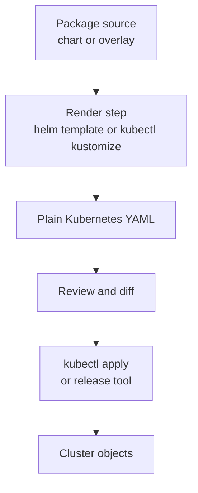

## Table of Contents

1. [The Copy Problem Behind Kubernetes YAML](#the-copy-problem-behind-kubernetes-yaml)
2. [What Manifest Packaging Means](#what-manifest-packaging-means)
3. [The Running Example](#the-running-example)
4. [Rendering Before Applying](#rendering-before-applying)
5. [What Packaging Should Not Hide](#what-packaging-should-not-hide)
6. [Failure Mode: A Small Difference Reaches Production](#failure-mode-a-small-difference-reaches-production)
7. [Choosing the Smallest Useful Package](#choosing-the-smallest-useful-package)
8. [A Review Habit for Packaged Manifests](#a-review-habit-for-packaged-manifests)
9. [What CI Should Prove](#what-ci-should-prove)
10. [A Practical Migration Path](#a-practical-migration-path)

## The Copy Problem Behind Kubernetes YAML

Kubernetes work starts with plain YAML. A Deployment says which Pods should exist, a Service gives those Pods a stable network name, a ConfigMap carries plain settings, and an Ingress or Gateway decides how outside traffic reaches the app. That directness is good for learning because every field is visible.

The trouble starts when the same application runs in more than one place. `devpolaris-orders-api` needs a staging namespace, a production namespace, different replica counts, different image tags, and different hostnames. If the team copies four YAML files into two environment folders, the first release is easy. The tenth release is where small differences begin to hide.

Manifest packaging is the answer to that repetition. It lets you keep one shared shape for an application and apply deliberate differences for each environment. The important promise is not shorter YAML. The promise is that reviewers can understand what will run without comparing twenty copied files by hand.

You can see the risk in a normal repository diff. A teammate changes the Deployment label in staging because the team adopted the recommended Kubernetes app labels. Production still has the old label because nobody remembered the second copy. Both files look valid. Both apply cleanly. Only one of them still matches the Service selector.

```text
Copied manifest risk

staging/deployment.yaml
  app.kubernetes.io/name: devpolaris-orders-api

prod/deployment.yaml
  app: orders-api

prod/service.yaml
  selector:
    app: orders-api
```

This is the kind of problem packaging is meant to reduce. The shared label pattern should live in one place, and each environment should only declare the differences that truly belong to that environment.

## What Manifest Packaging Means

A manifest package is a source form that produces Kubernetes manifests. The source might be a Helm chart, a Kustomize base with overlays, or another tool in the same family. Kubernetes still receives normal API objects at the end.

That last point matters. Helm and Kustomize do not replace Deployments, Services, ConfigMaps, or Secrets. They help generate or assemble them. The cluster does not run a chart or an overlay. The cluster runs the rendered objects.



Think of this like building a small Node project. You edit TypeScript, but the runtime executes JavaScript. You still need to understand the JavaScript enough to debug production. With Kubernetes packaging, you edit chart templates or overlays, but the cluster accepts rendered YAML.

That mental model protects you from a common beginner mistake. If a packaged release breaks, do not stop at "Helm did it" or "Kustomize did it." Ask which rendered object changed, whether Kubernetes accepted that object, and whether the application became healthy after the object changed.

```text
Diagnostic layers

Package source:
  values file, chart template, base, overlay, patch

Rendered manifest:
  Deployment, Service, ConfigMap, Ingress

Cluster state:
  live object, rollout status, events, Pod logs

Application behavior:
  health endpoint, metrics, user-visible requests
```

The layers give you a path through confusion. Packaging is one layer in the release, not the whole release.

## The Running Example

The `devpolaris-orders-api` service starts with four objects. The Deployment runs the API container. The Service points traffic to the Pods. The ConfigMap provides plain settings. The Ingress exposes the API through `orders.devpolaris.example`.

```text
k8s/
  deployment.yaml
  service.yaml
  configmap.yaml
  ingress.yaml
```

The first environment difference looks harmless. Staging uses one replica and a staging hostname. Production uses three replicas and a production hostname. Both use the same container port, labels, probes, and Service shape.

```yaml
apiVersion: apps/v1
kind: Deployment
metadata:
  name: devpolaris-orders-api
spec:
  replicas: 3
  template:
    spec:
      containers:
        - name: api
          image: ghcr.io/devpolaris/orders-api:2026.05.07
          ports:
            - containerPort: 8080
```

If this file is copied into every environment, a reviewer has to ask an awkward question on every pull request: is this change intentional everywhere, or did one copy drift? Packaging gives the team a place to express "same app shape" and "environment differences" separately.

## Rendering Before Applying

The safest habit is to render the package before applying it. Rendering means asking the packaging tool to print the final YAML. For Helm, that command is usually `helm template`. For Kustomize, it is `kubectl kustomize` or `kustomize build`.

```bash
$ helm template orders-api ./charts/orders-api \
  --namespace devpolaris-staging \
  -f environments/staging.values.yaml \
  > rendered/staging.yaml
```

The file should look like ordinary Kubernetes YAML. A reviewer should be able to search for the image, replica count, namespace, labels, probes, and resource requests.

```bash
$ grep -n "image:\\|replicas:\\|readinessProbe:" rendered/staging.yaml
8:  replicas: 1
36:          image: ghcr.io/devpolaris/orders-api:2026.05.07
42:          readinessProbe:
```

Kustomize has the same inspection habit:

```bash
$ kubectl kustomize overlays/prod > rendered/prod.yaml
$ kubectl diff -f rendered/prod.yaml
diff -u -N /tmp/LIVE-189234/apps.v1.Deployment.devpolaris-prod.devpolaris-orders-api /tmp/MERGED-773581/apps.v1.Deployment.devpolaris-prod.devpolaris-orders-api
```

The exact command can vary by delivery system, but the review question stays the same: what Kubernetes objects will this package produce?

## What Packaging Should Not Hide

Packaging becomes risky when it makes simple questions harder. A beginner should still be able to answer which image will run, which port will receive traffic, which ConfigMap keys the Pod reads, which namespace receives objects, and which labels connect the Service to Pods.

Here is a useful review checklist for `devpolaris-orders-api`:

| Question | What to inspect |
|----------|-----------------|
| Which image runs? | Deployment container image |
| How many Pods should exist? | Deployment `spec.replicas` |
| How does traffic find Pods? | Service selector and Pod labels |
| Which config values are injected? | ConfigMap and Deployment `envFrom` or `env` |
| How will rollout safety work? | Readiness probe and rollout strategy |

If a package makes these answers difficult, the package is too clever. A good chart or overlay removes duplication while keeping the final objects understandable.

## Failure Mode: A Small Difference Reaches Production

Suppose staging and production both use copied manifests. A teammate fixes the Service selector in staging after a label cleanup, but production keeps the old selector. The next production deploy creates healthy Pods, yet the Service has no endpoints.

```bash
$ kubectl get pods -n devpolaris-prod -l app.kubernetes.io/name=devpolaris-orders-api
NAME                                      READY   STATUS    RESTARTS
devpolaris-orders-api-6cc9db6f78-n72p9    1/1     Running   0
devpolaris-orders-api-6cc9db6f78-xm6b4    1/1     Running   0

$ kubectl get endpoints devpolaris-orders-api -n devpolaris-prod
NAME                    ENDPOINTS   AGE
devpolaris-orders-api   <none>      12m
```

The diagnostic path is direct. First check Pods. Then check the Service selector. Then compare it with Pod labels.

```bash
$ kubectl get service devpolaris-orders-api -n devpolaris-prod -o jsonpath='{.spec.selector}{"\n"}'
{"app":"orders-api"}

$ kubectl get pod devpolaris-orders-api-6cc9db6f78-n72p9 -n devpolaris-prod --show-labels
NAME                                      READY   STATUS    LABELS
devpolaris-orders-api-6cc9db6f78-n72p9    1/1     Running   app.kubernetes.io/name=devpolaris-orders-api
```

The fix is not "use a package" by itself. The fix is to make the selector and Pod labels come from one shared source, then render production and verify that the Service selector matches the labels before apply.

## Choosing the Smallest Useful Package

Helm and Kustomize solve overlapping but different problems. Helm is good when you want reusable application packages with named releases, values files, versioned charts, and lifecycle commands such as upgrade and rollback. Kustomize is good when you already have valid Kubernetes YAML and need environment overlays without a template language.

For `devpolaris-orders-api`, a team might start with Kustomize if the app is internal and the manifests are easy to read. The base holds the shared Deployment, Service, and ConfigMap. The overlays patch replica count, hostname, namespace, and image tag.

The same team might choose Helm if platform engineers publish a reusable chart for many services. Each service then supplies values for image, ports, resources, probes, and ingress. That chart can standardize labels and rollout defaults across the organization.

The tradeoff is control versus abstraction. A package should remove boring repetition, not remove the need to understand Kubernetes.

Start smaller than your future design. A first package for `devpolaris-orders-api` does not need to solve every service in the company. It needs to prove that one app can render staging and production manifests that match the team's expectations. Once that works, you can decide whether the pattern should become shared.

```text
Small first target

Must package:
- Deployment
- Service
- ConfigMap

Can wait:
- optional autoscaling
- optional service mesh annotations
- optional extra sidecars
- optional preview environment generator
```

This keeps the first review focused. The team learns the render and diff habit before adding more knobs.

## A Review Habit for Packaged Manifests

A healthy review asks for source and output. The source shows the intended packaging change. The output proves the Kubernetes result. For a small team, that can be a rendered YAML file attached to the pull request. For a larger team, CI can run the render command and publish a diff.

```text
Packaging review for devpolaris-orders-api

Source changed:
- charts/orders-api/templates/deployment.yaml
- environments/prod.values.yaml

Rendered output changed:
- Deployment image: 2026.05.06 to 2026.05.07
- Deployment replicas: unchanged at 3
- Service selector: unchanged
- Ingress host: unchanged
```

That review record gives you a practical safety rail. If production fails, you can compare the rendered object with the live object and decide whether the package produced the wrong YAML, the delivery tool applied the wrong version, or the application failed after Kubernetes accepted the change.

## What CI Should Prove

Packaging review gets much easier when CI produces the same evidence every time. The pipeline does not need to deploy production from every pull request. It only needs to render the package, validate the output, and make the important changes visible to humans.

For `devpolaris-orders-api`, a pull request that changes packaging could run three checks. First, render the staging and production manifests. Second, scan the rendered YAML for the fields that often break releases. Third, run a dry-run validation against a cluster API when that is available.

```text
Pull request checks

render-staging:
  command: helm template orders ./charts/orders-api -f environments/staging.values.yaml
  artifact: rendered/staging.yaml

render-prod:
  command: helm template orders ./charts/orders-api -f environments/prod.values.yaml
  artifact: rendered/prod.yaml

validate-prod:
  command: kubectl apply --dry-run=server -f rendered/prod.yaml
  result: accepted by API server
```

The rendered artifact matters because it gives reviewers a stable file to inspect. A review comment can point at `rendered/prod.yaml` and ask why `replicas` changed from three to one. Without that output, the reviewer has to mentally execute the chart or overlay.

A useful CI summary is short and specific:

```text
Rendered production changes

Deployment/devpolaris-orders-api
  image: ghcr.io/devpolaris/orders-api:2026.05.06 -> ghcr.io/devpolaris/orders-api:2026.05.07
  replicas: 3 -> 3
  readiness path: /health/ready -> /health/ready

Service/devpolaris-orders-api
  selector: unchanged
  port: unchanged

Ingress/devpolaris-orders-api
  host: unchanged
```

This is not ceremony. It is the same habit you use when reading a Terraform plan or a database migration. The source change tells you what the author edited. The rendered summary tells you what the system will receive.

## A Practical Migration Path

Do not convert every manifest at once if the team is still learning. Start with one app and one environment. Render the packaged output and compare it with the current raw manifests. The first goal is identical output, not clever packaging.

```bash
$ kubectl kustomize k8s/overlays/prod > /tmp/packaged.yaml
$ diff -u k8s/raw-prod.yaml /tmp/packaged.yaml
```

The first diff will often show ordering changes, labels added by the tool, or generated names. Work through those differences one at a time. If a difference affects runtime behavior, explain it in the pull request. If it is only formatting or object order, keep the note short.

For `devpolaris-orders-api`, migrate in this order:

| Step | Change | Reason |
|------|--------|--------|
| 1 | Package Deployment and Service | They carry the main app shape |
| 2 | Add ConfigMap handling | Config changes often drive rollouts |
| 3 | Add Ingress or Gateway | Hostname differences are environment-specific |
| 4 | Add CI rendering | Review needs output before production |
| 5 | Remove old copied manifests | Two sources of truth create confusion |

Keep the old raw manifests until the packaged output has deployed successfully in a lower environment. Then remove the old files in a separate cleanup change. That keeps rollback simple while the team gains confidence in the new source form.

---

**References**

- [Helm Charts](https://helm.sh/docs/topics/charts/) - Official Helm documentation for chart structure and how charts are rendered into Kubernetes manifests.
- [Helm Template Guide](https://helm.sh/docs/chart_template_guide/) - Official guide to Helm templates, values, and generated manifests.
- [Declarative Management of Kubernetes Objects Using Kustomize](https://kubernetes.io/docs/tasks/manage-kubernetes-objects/kustomization/) - Official Kubernetes task guide for Kustomize bases, overlays, and `kubectl apply -k`.
- [kubectl diff](https://kubernetes.io/docs/reference/kubectl/generated/kubectl_diff/) - Official command reference for comparing proposed manifests with live cluster objects.
