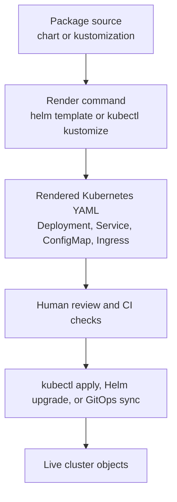

## Table of Contents

1. [Why Copying YAML Starts To Hurt](#why-copying-yaml-starts-to-hurt)
2. [What Manifest Packaging Means](#what-manifest-packaging-means)
3. [The Orders API Example](#the-orders-api-example)
4. [Rendering Before Applying](#rendering-before-applying)
5. [How Environment Differences Stay Reviewable](#how-environment-differences-stay-reviewable)
6. [The Selector Drift Failure](#the-selector-drift-failure)
7. [Choosing A Small First Package](#choosing-a-small-first-package)
8. [CI Checks For Packaged Manifests](#ci-checks-for-packaged-manifests)
9. [Production Review Before Release](#production-review-before-release)
10. [A Practical Migration Path](#a-practical-migration-path)
11. [What's Next](#whats-next)

## Why Copying YAML Starts To Hurt
<!-- section-summary: Kubernetes YAML stays easy while one app has one environment, then copied manifests make small differences hard to see. -->

Kubernetes asks you to describe the desired state of your application with API objects. A **Deployment** describes the Pods the platform should keep running, a **Service** gives those Pods a stable network address inside the cluster, a **ConfigMap** stores plain configuration values, and an **Ingress** or **Gateway** can route traffic from outside the cluster to the Service. Those objects use YAML because humans can read it, review it, and keep it in Git.

That directness helps a lot at the start. A team building `devpolaris-orders-api` can place four files in a `k8s/` directory, apply them to a staging namespace, and understand the whole release by reading the files. The Deployment names the container image, the Service maps port `80` to the API's `8080` port, the ConfigMap provides values such as `LOG_LEVEL`, and the Ingress owns a hostname such as `orders.staging.devpolaris.example`.

Now the team adds production. Production needs three replicas instead of one, a different hostname, stricter resource requests, and a different image tag during a controlled release. A quick copy from `staging/` into `prod/` solves the first deploy, and the repository still looks friendly. The trouble grows quietly as every future fix needs a human to remember which copies should match and which copies should differ.

Here is the kind of drift that shows up after several releases. Staging has moved to the recommended Kubernetes application label, while production still has the older label on one object.

```
k8s/
  staging/
    deployment.yaml  # app.kubernetes.io/name: devpolaris-orders-api
    service.yaml     # selector uses app.kubernetes.io/name
  prod/
    deployment.yaml  # app.kubernetes.io/name: devpolaris-orders-api
    service.yaml     # selector still uses app: orders-api
```

Both production files can pass a quick visual scan because the names look familiar. Kubernetes also accepts the files because a Service selector can target any label key. The release fails later, when the Service cannot find the Pods that the Deployment created.

That is the packaging problem in plain English. The team wants one shared application shape, plus deliberate environment choices, plus a review step that shows the final Kubernetes YAML before anything reaches the cluster.

## What Manifest Packaging Means
<!-- section-summary: Manifest packaging creates ordinary Kubernetes objects from a reusable source form, so teams can review output instead of maintaining copied files. -->

**Manifest packaging** means the team keeps Kubernetes configuration in a reusable source form and renders it into normal Kubernetes YAML before apply time. The source form might use a Helm chart, a Kustomize base with overlays, or another tool that fits the same pattern. The important habit stays the same: the package source creates Kubernetes objects, and the rendered objects still deserve review.

For `devpolaris-orders-api`, the reusable shape includes the Deployment, Service, ConfigMap, and optional Ingress or Gateway. Staging can supply `replicaCount: 1` and a staging host. Production can supply `replicaCount: 3`, a production host, and a stricter resource request. The package keeps repeated labels, selectors, ports, and probes in one shared place.

Helm and Kustomize take different routes. **Helm** packages templates, default values, metadata, release commands, chart dependencies, and versioned application packages. **Kustomize** starts from valid Kubernetes YAML and layers patches, generated ConfigMaps, generated Secrets, names, labels, and other customizations through a `kustomization.yaml` file. Kubernetes receives rendered API objects at the end of both flows.



This flow gives the team a clean debugging path. A release problem can live in the package source, the rendered YAML, the apply step, the live cluster state, or the application itself. The render step separates those layers, so the team can ask a concrete question during review: which Kubernetes objects will this package create or change?

## The Orders API Example
<!-- section-summary: The module uses one API service so every packaging decision has a concrete Deployment, Service, ConfigMap, and route to inspect. -->

The running example for this module follows a team that packages `devpolaris-orders-api`. The API listens on container port `8080`, reads a few plain settings from a ConfigMap, and serves HTTP traffic through an internal Service. The team also wants a public route for staging and production, using either an Ingress resource today or a Gateway API route later.

The raw starting point looks familiar to any Kubernetes beginner. One Deployment runs the container, one Service targets the Pods, one ConfigMap carries environment settings, and one Ingress maps a hostname to the Service.

```
k8s/raw/
  deployment.yaml
  service.yaml
  configmap.yaml
  ingress.yaml
```

The Deployment contains the fields operators care about during most releases. The image tag tells the cluster which version to pull, the replica count tells the Deployment controller how many Pods to maintain, and the readiness probe tells Kubernetes when a Pod can receive traffic.

```yaml
apiVersion: apps/v1
kind: Deployment
metadata:
  name: devpolaris-orders-api
  labels:
    app.kubernetes.io/name: devpolaris-orders-api
    app.kubernetes.io/part-of: devpolaris
spec:
  replicas: 3
  selector:
    matchLabels:
      app.kubernetes.io/name: devpolaris-orders-api
  template:
    metadata:
      labels:
        app.kubernetes.io/name: devpolaris-orders-api
    spec:
      containers:
        - name: api
          image: ghcr.io/devpolaris/orders-api:2026.05.07
          ports:
            - containerPort: 8080
          readinessProbe:
            httpGet:
              path: /health/ready
              port: 8080
```

The Service needs the same label value because it sends traffic to Pods through its selector. This is one of the first places where packaging pays for itself. A copied Service can drift from a copied Deployment, while a package can produce both fields from one shared source.

```yaml
apiVersion: v1
kind: Service
metadata:
  name: devpolaris-orders-api
spec:
  selector:
    app.kubernetes.io/name: devpolaris-orders-api
  ports:
    - name: http
      port: 80
      targetPort: 8080
```

The team now has a real release question. They want staging and production to differ on image tag, replicas, hostname, and maybe resource sizing. They want labels, selectors, ports, probes, and object names to stay consistent unless a reviewer explicitly approves a change.

## Rendering Before Applying
<!-- section-summary: Rendering prints the final Kubernetes YAML, which lets teams inspect real objects before a package changes the cluster. -->

**Rendering** means asking the packaging tool to print the Kubernetes YAML it will produce. This step gives reviewers the final Deployment, Service, ConfigMap, and route manifest before the apply or upgrade step touches the API server. It also helps beginners because it connects template inputs to plain Kubernetes objects they already know.

For a Helm chart, the team can render staging like this. The release name `orders` and the values file both influence the output, so the command in CI should match the command used for review.

```bash
$ helm template orders ./charts/orders-api \
  --namespace devpolaris-staging \
  -f environments/staging.values.yaml \
  > rendered/staging.yaml
```

For a Kustomize layout, the same habit uses `kubectl kustomize`. The Kubernetes docs describe this command as the way to view resources from a directory that contains a kustomization file, and the output can go to a file for review.

```bash
$ kubectl kustomize k8s/overlays/prod > rendered/prod.yaml
```

The team then searches the rendered output for fields that commonly break a release. The exact tool can vary, but the review should confirm the image, replicas, namespace, labels, selector, probes, resources, and route host.

```bash
$ grep -n "kind:\\|name:\\|replicas:\\|image:\\|readinessProbe:\\|host:" rendered/prod.yaml
2:kind: ConfigMap
4:  name: devpolaris-orders-api
18:kind: Service
20:  name: devpolaris-orders-api
36:kind: Deployment
38:  name: devpolaris-orders-api
45:  replicas: 3
68:          image: ghcr.io/devpolaris/orders-api:2026.05.07
76:          readinessProbe:
104:  - host: orders.devpolaris.example
```

When a cluster connection exists, `kubectl diff` adds a stronger review because it compares the proposed rendered YAML with the live version. The command reference describes this as a diff between the current online configuration and the configuration as it would look after apply.

```bash
$ kubectl diff -n devpolaris-prod -f rendered/prod.yaml
diff -u -N /tmp/LIVE/apps.v1.Deployment.devpolaris-orders-api /tmp/MERGED/apps.v1.Deployment.devpolaris-orders-api
--- /tmp/LIVE/apps.v1.Deployment.devpolaris-orders-api
+++ /tmp/MERGED/apps.v1.Deployment.devpolaris-orders-api
@@ -42,7 +42,7 @@
       containers:
       - name: api
-        image: ghcr.io/devpolaris/orders-api:2026.05.06
+        image: ghcr.io/devpolaris/orders-api:2026.05.07
```

This habit changes the tone of a packaging review. The author no longer asks reviewers to trust a chart, an overlay, or a values file. The author shows the Kubernetes objects that the cluster will receive.

## How Environment Differences Stay Reviewable
<!-- section-summary: A package works well when shared application shape and environment choices stay separate and easy to trace. -->

Every environment difference should have a clear home. Shared application shape belongs in the package source, while environment decisions belong in values files, overlays, or patches. The point of the split is review clarity, because reviewers can see whether a change affects the reusable shape or only one environment.

For Helm, the shared Deployment template might read values for the image, replica count, and ConfigMap data. Staging and production then provide small values files that express the environment choices.

```yaml
# environments/staging.values.yaml
replicaCount: 1
image:
  repository: ghcr.io/devpolaris/orders-api
  tag: "2026.05.07-rc.2"
ingress:
  host: orders.staging.devpolaris.example
config:
  LOG_LEVEL: debug
  CHECKOUT_TIMEOUT_MS: "2500"
```

```yaml
# environments/prod.values.yaml
replicaCount: 3
image:
  repository: ghcr.io/devpolaris/orders-api
  tag: "2026.05.07"
ingress:
  host: orders.devpolaris.example
config:
  LOG_LEVEL: info
  CHECKOUT_TIMEOUT_MS: "1500"
```

For Kustomize, the base can hold the shared Deployment and Service, while overlays patch the namespace, replica count, image tag, and hostname. The official Kubernetes Kustomize guide describes this style as composing and customizing collections of resources, which matches the staging and production split well.

```
k8s/
  base/
    deployment.yaml
    service.yaml
    configmap.yaml
    kustomization.yaml
  overlays/
    staging/
      kustomization.yaml
      ingress-patch.yaml
    prod/
      kustomization.yaml
      ingress-patch.yaml
```

The review rule stays the same across both tools. The package input explains intent, and the rendered manifest proves the outcome. A reviewer can approve a production replica change with confidence when the rendered diff shows only `replicas: 2` moving to `replicas: 3` and the Service selector staying unchanged.

## The Selector Drift Failure
<!-- section-summary: Packaging should protect the fields that connect Kubernetes objects, especially Service selectors and Pod labels. -->

Service selector drift makes manifest packaging feel practical very quickly. Imagine the orders API team cleans up labels in staging first. The Deployment now uses `app.kubernetes.io/name: devpolaris-orders-api`, and the Service selector follows it. Production receives only half of that cleanup because the copied Service file missed the pull request.

Production deploys without a YAML error. The Deployment creates Pods, the Pods pass readiness checks, and the API container logs look normal. The customer-facing route still fails because the Service has no endpoints.

```bash
$ kubectl get pods -n devpolaris-prod -l app.kubernetes.io/name=devpolaris-orders-api
NAME                                      READY   STATUS    RESTARTS
devpolaris-orders-api-6cc9db6f78-n72p9    1/1     Running   0
devpolaris-orders-api-6cc9db6f78-xm6b4    1/1     Running   0

$ kubectl get endpoints devpolaris-orders-api -n devpolaris-prod
NAME                    ENDPOINTS   AGE
devpolaris-orders-api   <none>      12m
```

The next check compares the Service selector with the Pod labels. This gives the team a direct explanation instead of a vague "Kubernetes networking" problem.

```bash
$ kubectl get service devpolaris-orders-api \
  -n devpolaris-prod \
  -o jsonpath='{.spec.selector}{"\n"}'
{"app":"orders-api"}

$ kubectl get pod devpolaris-orders-api-6cc9db6f78-n72p9 \
  -n devpolaris-prod \
  --show-labels
NAME                                      READY   STATUS    LABELS
devpolaris-orders-api-6cc9db6f78-n72p9    1/1     Running   app.kubernetes.io/name=devpolaris-orders-api
```

A package reduces this risk when labels and selectors share one source. Helm can use a helper that renders the same label block in the Deployment and Service. Kustomize can keep the selector shape in a base and apply environment differences around it. Either way, rendered output should show a matching selector before the production release proceeds.

## Choosing A Small First Package
<!-- section-summary: The first package should remove real repetition while keeping the rendered Kubernetes objects easy to understand. -->

The first package for `devpolaris-orders-api` should stay small enough for the whole team to review. A useful starting package includes the Deployment, Service, ConfigMap, and optional route because those objects travel together during an API release. Autoscaling, service mesh annotations, extra sidecars, preview environments, and multi-region routing can wait until the team proves the basic render and review loop.

This is a practical boundary for a first pass. It keeps the team focused on the objects that move together during a normal API release.

| Include now | Reason |
|---|---|
| Deployment | Carries image, replicas, probes, resources, and Pod labels |
| Service | Connects traffic to Pods through selectors |
| ConfigMap | Carries plain environment settings that often differ by environment |
| Ingress or Gateway route | Carries environment hostnames and traffic entry points |

Some settings need more care because they can turn a tidy package into a hidden programming system. A package can expose image tag, replica count, resource requests, and hostnames as values because teams change those during releases. A package should avoid dozens of optional knobs that nobody tests, because reviewers then have to reason through many possible object shapes.

The team can decide between Helm and Kustomize by looking at the work in front of them. Helm fits when the organization wants a reusable application chart, named releases, chart versions, dependencies, and release commands such as upgrade and rollback. Kustomize fits when the team already has clear Kubernetes YAML and mainly needs environment overlays without a template language.

For this module, the next article goes deeper into Helm because many Kubernetes teams meet packaging through charts. The same render-first habit still applies when a team chooses Kustomize for a smaller internal service.

## CI Checks For Packaged Manifests
<!-- section-summary: CI should render every important environment, validate the result, and publish enough evidence for human review. -->

CI gives the render habit a repeatable place to live. A pull request should render staging and production with realistic inputs, run chart or overlay checks, and preserve the output as an artifact or review summary. Packaging pull requests can skip production deploys while still proving that the package produces readable Kubernetes YAML.

A Helm-based pull request can use this shape, where the chart is linted once and then rendered with staging and production inputs. The workflow gives reviewers both the source diff and the generated manifests.

```yaml
name: package-checks

on:
  pull_request:
    paths:
      - "charts/orders-api/**"
      - "environments/*.values.yaml"

jobs:
  render:
    runs-on: ubuntu-latest
    steps:
      - uses: actions/checkout@v4
      - name: Lint chart
        run: helm lint ./charts/orders-api
      - name: Render staging
        run: |
          mkdir -p rendered
          helm template orders ./charts/orders-api \
            --namespace devpolaris-staging \
            -f environments/staging.values.yaml \
            > rendered/staging.yaml
      - name: Render production
        run: |
          helm template orders ./charts/orders-api \
            --namespace devpolaris-prod \
            -f environments/prod.values.yaml \
            > rendered/prod.yaml
      - name: Server-side dry run
        run: kubectl apply --dry-run=server -f rendered/prod.yaml
```

The `kubectl apply --dry-run=server` step needs a real cluster connection because the API server checks the request without storing the object. When CI cannot reach a cluster, the team can still render, lint, and run client-side schema or policy checks. The article's key habit remains visible: every environment gets rendered from the same source form that release automation will use.

A good CI summary should name the fields reviewers care about. Long rendered YAML files can overwhelm a pull request, while a short summary helps a reviewer find the important changes fast.

```
Rendered production summary

Deployment/devpolaris-orders-api
  image: ghcr.io/devpolaris/orders-api:2026.05.06 -> ghcr.io/devpolaris/orders-api:2026.05.07
  replicas: 3 -> 3
  readiness path: /health/ready -> /health/ready
  selector: app.kubernetes.io/name=devpolaris-orders-api

Service/devpolaris-orders-api
  selector: app.kubernetes.io/name=devpolaris-orders-api
  port: 80 -> 80

Ingress/devpolaris-orders-api
  host: orders.devpolaris.example -> orders.devpolaris.example
```

This summary supports a human review instead of replacing it. The reviewer still opens the rendered manifest when a selector, route, probe, or ConfigMap value changes. CI simply makes those changes hard to miss.

## Production Review Before Release
<!-- section-summary: A production packaging review follows source, rendered output, live diff, and rollback evidence in that order. -->

A production review for packaged manifests should read like a calm release conversation. The author explains which source files changed, attaches rendered production output, shows the diff against the live cluster when possible, and states the rollback path. The reviewer then has enough evidence to approve the change or ask for a safer split.

For `devpolaris-orders-api`, the pull request might include a short review note like this. The note gives reviewers a compact story before they open the rendered YAML.

```
Packaging review: devpolaris-orders-api 2026.05.07

Source changed:
- charts/orders-api/templates/deployment.yaml
- environments/prod.values.yaml

Rendered production output:
- Deployment image updates to ghcr.io/devpolaris/orders-api:2026.05.07
- Deployment replicas stay at 3
- Service selector stays app.kubernetes.io/name=devpolaris-orders-api
- Ingress host stays orders.devpolaris.example

Validation:
- helm lint passed
- helm template passed for staging and production
- kubectl diff shows only the image change
- kubectl apply --dry-run=server passed against the production API server

Rollback:
- previous image tag: ghcr.io/devpolaris/orders-api:2026.05.06
- Helm release rollback target: revision 41
```

This review separates package source from Kubernetes output. A values file change might look small, but it can alter many rendered objects. A template change might look technical, but it can leave production untouched if the rendered output stays the same for current values.

This style also helps during incidents. If the release breaks, the team can compare the rendered manifest from the pull request with the live object in the cluster. That comparison tells them whether the package produced unexpected YAML, the deployment tool applied a different artifact, or the application version failed after Kubernetes accepted the manifest.

## A Practical Migration Path
<!-- section-summary: Migration should prove equivalent output first, then add environment differences and CI checks in small reviewable steps. -->

A team with copied YAML should avoid a dramatic rewrite as the first move. The safer path packages one application, renders one environment, and compares the output with the current raw manifest. The first useful milestone is boring output: same objects, same labels, same selectors, same image, same ports, same route.

For a Kustomize migration, the team can render the production overlay and compare it with the current production file. The first diff will often show object order or generated labels, so the reviewer should focus on runtime behavior rather than formatting.

```bash
$ kubectl kustomize k8s/overlays/prod > /tmp/orders-packaged.yaml
$ diff -u k8s/raw/prod.yaml /tmp/orders-packaged.yaml
```

For a Helm migration, the team can render the chart with production values and compare that output with the existing production manifest. The chart should earn trust by matching the current release before it adds new flexibility.

```bash
$ helm template orders ./charts/orders-api \
  --namespace devpolaris-prod \
  -f environments/prod.values.yaml \
  > /tmp/orders-packaged.yaml

$ diff -u k8s/raw/prod.yaml /tmp/orders-packaged.yaml
```

The migration can move in small steps, and each step should leave the rendered output easy to compare with the previous production manifest. That pacing helps the team learn the package while keeping rollback and review evidence clear.

| Step | Change | Review focus |
|---|---|---|
| 1 | Package Deployment and Service | Pod labels match Service selector |
| 2 | Add ConfigMap handling | Environment keys and rollout behavior stay clear |
| 3 | Add Ingress or Gateway route | Hostname and backend Service stay correct |
| 4 | Add CI rendering | Staging and production outputs appear in every pull request |
| 5 | Remove copied manifests | One source path remains for future releases |

The old raw manifests can stay in the repository until the packaged output succeeds in a lower environment. After that, a separate cleanup pull request can remove the copied files. That pacing keeps rollback understandable while the team learns the new review habit.

## What's Next

The next article zooms into Helm charts, because Helm is the packaging tool many teams meet first. We will keep following `devpolaris-orders-api`, but now the source form will have `Chart.yaml`, `values.yaml`, templates, helpers, render checks, dependencies, and a chart review flow.

---

**References**

- [Helm Charts](https://helm.sh/docs/topics/charts/) - Official Helm chart documentation covering chart files, templates, chart types, versions, and dependencies.
- [helm template](https://helm.sh/docs/helm/helm_template/) - Official command reference for rendering chart templates locally and writing the generated manifests to output.
- [Declarative Management of Kubernetes Objects Using Kustomize](https://kubernetes.io/docs/tasks/manage-kubernetes-objects/kustomization/) - Official Kubernetes guide for Kustomize, including `kubectl kustomize` and `kubectl apply -k`.
- [kubectl diff](https://kubernetes.io/docs/reference/kubectl/generated/kubectl_diff/) - Official command reference for comparing live resources with the would-be applied configuration.
- [kubectl apply](https://kubernetes.io/docs/reference/kubectl/generated/kubectl_apply/) - Official command reference documenting `--dry-run=server` and file-based apply behavior.
- [Recommended Kubernetes Labels](https://kubernetes.io/docs/concepts/overview/working-with-objects/common-labels/) - Official guidance for shared `app.kubernetes.io/*` labels across application resources.
