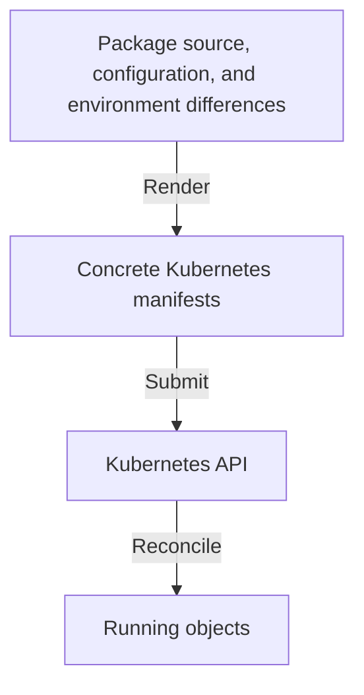

## Table of Contents

1. [What problem does manifest packaging solve?](#what-problem-does-manifest-packaging-solve)
2. [Where does packaging end and Kubernetes begin?](#where-does-packaging-end-and-kubernetes-begin)
3. [How can environments share structure while keeping deliberate differences visible?](#how-can-environments-share-structure-while-keeping-deliberate-differences-visible)
4. [How do Helm charts and Kustomize overlays approach this work differently?](#how-do-helm-charts-and-kustomize-overlays-approach-this-work-differently)
5. [Who should own the shared package and each environment's inputs?](#who-should-own-the-shared-package-and-each-environments-inputs)
6. [How should secret data move through a packaged release?](#how-should-secret-data-move-through-a-packaged-release)
7. [How can a team connect source, rendered YAML, and the running release?](#how-can-a-team-connect-source-rendered-yaml-and-the-running-release)
8. [When are plain manifests still the clearer choice?](#when-are-plain-manifests-still-the-clearer-choice)
9. [Check Your Answers](#check-your-answers)
10. [References](#references)

Manifest packaging sits between the Kubernetes configuration humans maintain and the ordinary resource objects the API server receives. It becomes useful when one application contains several related resources, is deployed more than once, or needs controlled differences between environments.

A direct manifest needs no packaging layer:

```bash
kubectl apply -f deployment.yaml
```

That can be the clearest solution for one object in one place. Packaging appears when the maintenance unit grows beyond that file:

```text
application intent
→ package source and deployment inputs
→ composition, configuration, and generation
→ rendered Kubernetes manifests
→ API server
→ controllers and running workloads
```

The package is a human and delivery-system abstraction. It organizes a related collection and produces a deployment-specific object set; it does not replace Kubernetes reconciliation.

Eight questions define that boundary:

1. **What problem does manifest packaging solve?**
2. **Where does packaging end and Kubernetes begin?**
3. **How can environments share structure while keeping deliberate differences visible?**
4. **How do Helm charts and Kustomize overlays approach this work differently?**
5. **Who should own the shared package and each environment's inputs?**
6. **How should secret data move through a packaged release?**
7. **How can a team connect source, rendered YAML, and the running release?**
8. **When are plain manifests still the clearer choice?**

## What problem does manifest packaging solve?
<!-- section-summary: Packaging represents one application's shared resource structure once while preserving the smaller set of intentional deployment differences. -->

Imagine a `payments` service that needs a Deployment, Service, ServiceAccount, ConfigMap, HPA, Ingress, PodDisruptionBudget, and NetworkPolicy in development, staging, and production.

Copying complete directories works at first:

```text
manifests/
├── dev/
├── staging/
└── production/
```

But a shared image change or a new `runAsNonRoot` setting must then be repeated in every copy. Most configuration remains identical while replicas, resource limits, hostnames, and image tags deliberately differ.

### Copying turns a small delta into several complete configurations

Suppose 90% of the eight resource definitions are common and 10% varies. Three copied environment directories express that as three 100% representations. A new health probe must be applied three times, while an intentional production replica difference is hidden among hundreds of repeated lines.

The problem is not that production differs. Production often should differ. The problem is that accidental drift and deliberate variation look the same in copied files.

The packaging problem is therefore to combine shared application structure with intentional variation and produce exact Kubernetes manifests.

The goal is to remove accidental duplication without erasing real environment differences. Production may need eight replicas, a two-CPU limit, a public hostname, and a pinned release while development needs one replica and smaller resources. A useful package makes the reason for each difference visible.

```text
shared payments resource structure
                +
production: replicas 8, CPU 2, public hostname, pinned image
                ↓
complete production objects
```

### See duplication as a data-model problem

The `payments` application may require eight related kinds:

```text
Deployment              runs the application
Service                 gives it a stable network endpoint
ServiceAccount          gives Pods an API identity when needed
ConfigMap               supplies non-confidential configuration
HorizontalPodAutoscaler adjusts replica count
Ingress                 routes external requests
PodDisruptionBudget     constrains voluntary disruption
NetworkPolicy           constrains network communication
```

Three complete environment copies turn one logical application into twenty-four files before counting supporting configuration. A common security change such as `runAsNonRoot: true` must be repeated correctly in every Deployment. A missing change becomes accidental drift, yet it looks similar to a deliberate production-only difference.

This is the underlying shape:

```text
90% shared configuration + 10% intentional variation
```

Full copies encode it as three separate 100% configurations. Packaging seeks a more accurate representation: one shared definition plus three explicit deltas. The objective is not to force identical environments; it is to make every difference answerable. “Production has eight replicas because its input says eight” is an owned decision. “Production lacks the new probe because that copy was missed” is a defect.

## Where does packaging end and Kubernetes begin?
<!-- section-summary: Helm, Kustomize, Git, and delivery systems prepare manifests; the Kubernetes API receives only concrete resource objects and reconciles them. -->

Kubernetes understands Deployments, Services, ConfigMaps, Secrets, Ingresses, and other API objects. It does not understand “the payments package,” `values-production.yaml`, or “the production overlay.”


```mermaid
flowchart TD
    Source[Package source, configuration, and environment differences] -->|Render| Manifests[Concrete Kubernetes manifests]
    Manifests -->|Submit| API[Kubernetes API]
    API -->|Reconcile| Runtime[Running objects]
```

Packaging does not change what a Deployment means. It changes how people produce that Deployment definition. When troubleshooting, keep the source model and the object accepted by Kubernetes separate.

The delivery layer can compose, parameterize, validate, and version a collection. After submission, Kubernetes controllers know only their individual objects and desired-state contracts. A Deployment controller does not know which values file or overlay produced its Pod template.

### Separate static generation from runtime reconciliation

Before submission, the delivery layer can decide which objects exist, substitute an image, apply an environment patch, generate configuration resources, and check policy. The output might be a YAML stream containing a Deployment and Service.

After submission, the API server validates and stores those objects. The Deployment controller creates ReplicaSets and Pods. The scheduler assigns Nodes. The Service and network data plane route to ready endpoints. None of those components evaluates a Helm expression or asks which Kustomize overlay was used.

This boundary localizes errors:

```text
wrong field in rendered YAML → packaging source, inputs, or transformation
API rejection                → Kubernetes schema or admission
accepted Deployment not ready → controller, Pod, image, config, or dependency
Service has no endpoints      → selector and readiness path
```

Changing packaging tools does not change what `spec.replicas`, a Service selector, or a Secret reference means. It changes how reliably humans produce and review those fields.

## How can environments share structure while keeping deliberate differences visible?
<!-- section-summary: Put stable resource structure in a common source and describe each environment only by the differences it intentionally owns. -->

A coherent source might look like:

```text
payments/
├── common application resources
│   ├── Deployment
│   ├── Service
│   ├── HPA
│   └── NetworkPolicy
└── deployment choices
    ├── dev
    ├── staging
    └── production
```

The shared source owns facts such as application name, container port, health checks, and label relationships. Each deployment input owns only the choices that truly vary, such as replica count, resources, hostname, and image tag.

This makes drift explainable. “Production has eight replicas because the production input sets eight” is better than “the production copy happens to differ from a file copied six months ago.”

The same structure also improves shared changes. Adding a required probe to the common application definition changes every derived environment intentionally, while changing the production hostname touches only the production delta.

The repeatability goal is:

```text
same package + same inputs = same desired resources
```

The result may still vary where the tool deliberately includes release identity or other context, but the source of that variation should be known.

### Make the environment contract readable as a delta

A compact comparison shows which decisions vary:

| Property | Development | Staging | Production |
|---|---|---|---|
| replicas | 1 | 2 | 8 |
| CPU | 500m | 1 core | 2 cores |
| image | development build | candidate | pinned release |
| hostname | development | staging | public production |

Application port 8080, standard labels, health checks, and Service relationships can remain shared. If a new probe is an application invariant, one common change reaches every derived environment. If production capacity changes from eight to twelve replicas, one production input changes and the review stays focused on that decision.

Preserving intentional variation also prevents a common overcorrection: forcing one value across environments merely to achieve reuse. Packaging should factor out accidental duplication, not erase operational context. A good source tree lets a reviewer see both the shared truth and the named reason for each exception.

## How do Helm charts and Kustomize overlays approach this work differently?
<!-- section-summary: Helm fills parameterized templates with values, while Kustomize starts from valid Kubernetes resources and transforms them for a context. -->

Helm combines templates, values, and release context into manifests.

For example, values can select three replicas and image `company/payments:2.1.0`, while a template places those values into a Deployment. Helm also tracks each named installation as a release.

Kustomize combines valid base resources with overlay transformations to produce manifests.

A base Deployment can already be valid Kubernetes YAML with one replica. A production overlay can reference the base and set `payments` to eight replicas.

Helm says “fill in the package's supported inputs.” Kustomize says “start from these resources and apply these contextual differences.” Neither model is universally better; both must ultimately produce ordinary Kubernetes objects.

The choice follows ownership. A reusable package shipped to many consumers can benefit from a chart author defining a stable values interface. Kubernetes configuration owned by one platform across several environments can benefit from a base whose overlay owners describe their deltas directly.

### Compare both approaches with the same replica decision

Helm can expose:

```yaml
replicaCount: 8
image:
  repository: company/payments
  tag: "2.1.0"
```

and templates can render those values into a Deployment. The chart producer decides that replica count and image are supported inputs. This resembles a configurable function: consumers call the package with values and Helm generates the resource set. A named installation can also become a Helm release with its own operation history.

Kustomize can begin with a complete Deployment at one replica and let production say:

```yaml
resources:
  - ../../base
replicas:
  - name: payments
    count: 8
```

The overlay owner describes a transformation against the Kubernetes resource model. The base author does not need to expose a template variable for every structural difference.

Both can produce an equivalent Deployment with eight replicas. The meaningful choice is whether a package producer should own a values API or an environment owner should own resource deltas. In either model, render the output; Kubernetes sees neither input language.

## Who should own the shared package and each environment's inputs?
<!-- section-summary: Package boundaries should follow cohesive ownership and lifecycle so related resources can be deployed, upgraded, rolled back, and removed together. -->

The Deployment, Service, ServiceAccount, HPA, PodDisruptionBudget, and NetworkPolicy for `payments` often belong together because they change, deploy, roll back, and are owned together.

Cluster-wide monitoring, cert-manager, an ingress controller, a database operator, and the payments application do not automatically share one lifecycle. A clearer split is:

```text
cluster infrastructure
├── ingress controller
├── cert-manager
└── monitoring

platform services
├── database operator
└── external secrets

applications
├── payments
├── checkout
└── accounts
```

A package is therefore an ownership and lifecycle boundary, not merely a folder. Its maintainers own the shared resource contract. Environment owners supply deliberate deployment choices without silently forking the structure.

The boundary should support a coherent sentence such as “deploy, upgrade, roll back, or remove payments.” If that action also changes company-wide monitoring, cert-manager, and an unrelated database, the package has crossed several ownership and lifecycle boundaries.

### Test cohesion with lifecycle verbs

Ask whether the same team can safely perform these actions on the proposed collection:

```text
install the collection
upgrade it as one change
review its version and configuration
recover or roll it back coherently
remove it without harming unrelated systems
```

The `payments` Deployment, Service, HPA, disruption budget, and NetworkPolicy often pass that test because they represent one workload and are changed together. A company-wide ingress controller fails it: it serves many applications, has a different owner, and should not disappear when payments is removed.

Folder boundaries can hide this distinction. A directory named `everything/` can contain valid YAML but still be a poor package because a single release now couples unrelated blast radii. Conversely, several resource kinds can be one strong package when they implement one application's lifecycle. Cohesive responsibility, not file count, defines the boundary.

## How should secret data move through a packaged release?
<!-- section-summary: Package the reference and integration shape, while confidential values follow a dedicated secret-management and delivery path. -->

The application package can declare its dependency:

```yaml
env:
  - name: DATABASE_PASSWORD
    valueFrom:
      secretKeyRef:
        name: payments-db
        key: password
```

It should not require a plaintext production password in normal package source. A separate path can retrieve or decrypt secret material through an external secret system, cloud secret manager, Vault, SOPS-encrypted file, or Sealed Secret and create the Kubernetes Secret.

The division is:

```text
package: “the application needs key password in Secret payments-db”
secret system: “this is the confidential value”
```

Packaging configuration and delivering confidential data are related, but they do not need the same storage or access policy.

Both paths converge when the Pod references the resulting Secret. The package owns the integration shape and key name; the protected system owns the value and its access controls.

### Separate the requirement from the confidential value

The package can safely state:

```text
payments needs key password
from Kubernetes Secret payments-db
```

That declaration lets the Deployment render a `secretKeyRef` and makes the dependency reviewable. The production password itself can travel through a protected source, external secret controller, cloud secret manager, Vault, an encrypted file workflow, or another approved mechanism.

```text
package source ───────────────→ Deployment reference ┐
protected secret source → Kubernetes Secret value ───┴→ Pod
```

The two paths have a small shared contract: Secret name and key. They need not share Git visibility, CI logs, renderer output, or access policy. This keeps manifest packaging responsible for application integration while a security-focused system owns confidential material and rotation.

The separation does not make the resulting Kubernetes Secret harmless. Cluster-side RBAC, storage encryption, and workload access still need protection. It simply avoids routing the plaintext through every ordinary packaging surface when only a reference is necessary.

## How can a team connect source, rendered YAML, and the running release?
<!-- section-summary: Render, validate, review, and preserve traceability so every running object can be connected to package inputs, source commits, and an immutable image. -->

The delivery path is:


```mermaid
flowchart LR
    Source[Package source] --> Render[Render]
    Render --> Checks[Schema and policy checks]
    Checks --> Review[Review]
    Review --> Deploy[Deploy]
```

Render Helm with `helm template` or Kustomize with `kubectl kustomize`. Validate object schemas, security rules, required labels, production replica requirements, pinned images, and API versions. Review the complete output because a small value or overlay change can produce a large manifest change.

### Review the generated proposal rather than only its compact input

A one-line image or feature value can affect several resources through templates. An overlay patch can interact with transformers and generated names. Source review explains intent, while rendered review proves the full Kubernetes effect. Schema, admission, and policy checks then test the proposal at the API boundary.

Production should be traceable backward:


```mermaid
flowchart LR
    Pod[Running Pod] --> Deployment[Deployment]
    Deployment --> Image[Image payments at sha256 abc]
    Image --> Package[Manifest package commit 8f31ac]
    Package --> SourceCommit[Application source commit c42891]
```

That chain answers what runs, who changed configuration, which source produced it, what was rendered, and whether the deployment can be reproduced. It also explains why packages fit naturally with GitOps: Git holds desired package state, while rendering and reconciliation turn it into Kubernetes state.

Traceability makes repeatability testable: the same package and inputs should reproduce the same desired objects, aside from deliberate release context. A running Pod should lead back through its Deployment and immutable image to the package and application source that produced it.

### Verify every transition from intent to evidence

A production delivery can preserve these artifacts:

```text
package source commit
+ exact environment inputs
+ package or chart version
→ rendered manifest set
→ schema and policy results
→ reviewed diff
→ applied release identity
→ live object identity and immutable image digest
```

The rendered set is essential because a small value can cause several template branches to add, remove, or modify objects. An overlay can interact with generators and transformations. Reviewing only compact inputs proves why the author requested a change, not the full effect.

Validation should ask different questions at different boundaries. Schema checks ask whether objects are structurally valid. Policy checks can require resource limits, non-privileged containers, approved labels, pinned images, minimum production replicas, or supported API versions. Server-side validation and admission ask whether the actual cluster would accept the proposal. Runtime checks then ask whether controllers converge and the application works.

Traceability reverses the path during an incident. From a Pod, identify its owner Deployment and exact image digest. Connect the Deployment to the release and rendered manifests, then to the package commit and application source. The team can now explain what is running, who changed it, reproduce the desired resources, and select the correct recovery source.

## When are plain manifests still the clearer choice?
<!-- section-summary: Use the least abstract representation that solves the real reuse and variation problem; packaging is optional and adds cognitive cost. -->

Parameterizing a fixed Namespace name can turn one obvious field into a template, a value, a rendering step, and tool semantics without gaining useful flexibility.

Plain manifests can be clearer when there are few resources, one deployment target, minimal variation, rare changes, no reuse requirement, or an abstraction more complicated than the duplication it removes. A Namespace, StorageClass, simple RBAC policy, small internal service, or one-off cluster configuration may need no package.

The complexity ladder moves from plain manifests to Kustomize, then Helm, then more elaborate configuration systems.

Stop when the actual problem is solved. Kubernetes does not require packaging; people introduce it when maintaining the manifests becomes the difficult part.

### Spend abstraction only when it removes a real cost

Consider a fixed Namespace:

```yaml
apiVersion: v1
kind: Namespace
metadata:
  name: payments
```

Turning `payments` into a template input adds a variable, renderer, tool version, and debugging step. If the name never varies and the object is not distributed as part of a reusable product, nothing important has been abstracted.

Move up the complexity ladder only for an observed need:

```text
plain manifests → direct and explicit
Kustomize       → shared resource configuration plus structural deltas
Helm            → configurable versioned package plus release lifecycle
additional systems → only when the earlier layers cannot express the requirement
```

The best stopping point depends on resource count, deployment targets, variation, reuse, ownership, and recovery needs. A small internal service deployed once may remain clearer as ordinary manifests. A platform product installed by many teams may justify a chart contract. A team-owned application across several clusters may justify bases and overlays.

Manifest packaging is therefore not a Kubernetes requirement or a maturity badge. It is a maintainable, versionable definition of a related object set plus a mechanism for producing the exact objects for one deployment. Use it when managing the source representations has become harder than the abstraction it introduces.

The need follows from six basic facts. Kubernetes accepts declarative objects. A real application often needs a collection of them. The application may run in several environments. Most structure is shared, while some differences are intentional. Those differences must remain explicit. Finally, the collection needs a coherent lifecycle for review, versioning, deployment, recovery, and removal.

From those facts, a package can be judged by concrete outcomes. Does one shared security change reach every intended deployment? Can a reviewer explain why production differs? Can every rendered resource be traced to owned source and inputs? Does rollback or recovery operate on one cohesive application boundary? Are confidential values kept on the protected path? Is the output inspectable before Kubernetes receives it?

If the answers are yes, packaging is reducing maintenance risk. If the package only replaces obvious YAML with templates and hidden indirection, plain manifests may still be the stronger design. The objective is not abstraction itself; it is an exact, repeatable, reviewable desired resource set whose ownership and variation remain clear.

Keep that objective visible in every package review. Count not only duplicated lines removed, but also new interfaces, render layers, compatibility promises, and recovery steps introduced. A package succeeds when the resulting application unit is easier to explain and operate across environments.

The final Kubernetes objects remain the common evidence. Whatever source model produced them, reviewers and operators should be able to connect each important field to one deliberate package or environment decision.
That trace is what turns a convenient renderer into a dependable deployment abstraction with understandable change, recovery, and ownership boundaries.
It must remain visible in practice.

## Check Your Answers
<!-- section-summary: Reconstruct manifest packaging from duplication, the render boundary, deliberate variation, tool models, ownership, secrets, traceability, and abstraction cost. -->

:::expand[What problem does manifest packaging solve?]{kind="recap"}
It represents shared resource structure once and keeps each deployment's smaller set of intentional differences explicit.
:::

:::expand[Where does packaging end and Kubernetes begin?]{kind="recap"}
Packaging tools render concrete manifests. Kubernetes accepts those ordinary resource objects and reconciles them; it does not interpret chart values or overlays.
:::

:::expand[How can environments share structure while keeping deliberate differences visible?]{kind="recap"}
Put invariant application structure in a common source and keep only replicas, resources, hostnames, image choices, and other real differences in environment inputs.
:::

:::expand[How do Helm charts and Kustomize overlays approach this work differently?]{kind="recap"}
Helm generates manifests from templates and values. Kustomize transforms valid Kubernetes resources from a base through an overlay.
:::

:::expand[Who should own the shared package and each environment's inputs?]{kind="recap"}
Draw package boundaries around resources with one owner and lifecycle. Package maintainers own the contract; deployment owners supply supported inputs.
:::

:::expand[How should secret data move through a packaged release?]{kind="recap"}
The package declares which Secret and key the workload needs. A dedicated secret system stores and delivers the confidential value.
:::

:::expand[How can a team connect source, rendered YAML, and the running release?]{kind="recap"}
Render and validate the output, then preserve links among the running object, immutable image, package commit, inputs, and application source.
:::

:::expand[When are plain manifests still the clearer choice?]{kind="recap"}
Use plain manifests when reuse and variation are small enough that a template or overlay would add more indirection than value.
:::

## References

- [Declarative Management of Kubernetes Objects](https://kubernetes.io/docs/tasks/manage-kubernetes-objects/declarative-config/)
- [Helm charts](https://helm.sh/docs/topics/charts/)
- [Kustomize](https://kubectl.docs.kubernetes.io/guides/introduction/kustomize/)
- [Managing Kubernetes Secrets](https://kubernetes.io/docs/concepts/configuration/secret/)
