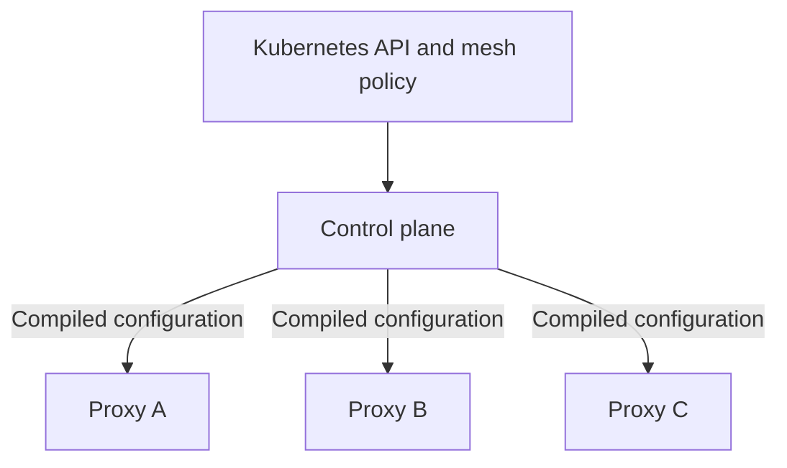
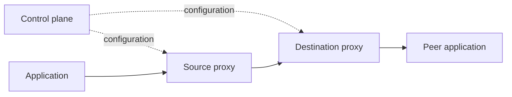
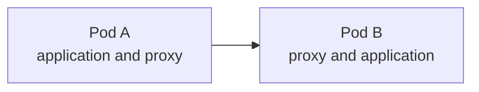
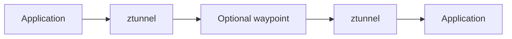

## Table of Contents

1. [What problem does a service mesh solve for several communicating services?](#what-problem-does-a-service-mesh-solve-for-several-communicating-services)
2. [What does the data plane do to one request?](#what-does-the-data-plane-do-to-one-request)
3. [What does the control plane configure and distribute?](#what-does-the-control-plane-configure-and-distribute)
4. [Which workloads and traffic paths participate in the mesh?](#which-workloads-and-traffic-paths-participate-in-the-mesh)
5. [How do sidecar and ambient-style data planes change application Pods and operations?](#how-do-sidecar-and-ambient-style-data-planes-change-application-pods-and-operations)
6. [Which benefits justify the added latency, capacity, and operational work?](#which-benefits-justify-the-added-latency-capacity-and-operational-work)
7. [How should a team choose its first mesh adoption boundary?](#how-should-a-team-choose-its-first-mesh-adoption-boundary)
8. [Check Your Answers](#check-your-answers)
9. [References](#references)

Kubernetes gives Pods connectivity, Services stable names, EndpointSlices changing backends, and NetworkPolicy controls mainly at IP, port, and protocol boundaries. A service mesh adds shared rules for how selected service-to-service communication should behave.

Seven questions define that additional layer:

1. **What problem does a service mesh solve for several communicating services?**
2. **What does the data plane do to one request?**
3. **What does the control plane configure and distribute?**
4. **Which workloads and traffic paths participate in the mesh?**
5. **How do sidecar and ambient-style data planes change application Pods and operations?**
6. **Which benefits justify the added latency, capacity, and operational work?**
7. **How should a team choose its first mesh adoption boundary?**

## What problem does a service mesh solve for several communicating services?
<!-- section-summary: A mesh moves repeated communication mechanics from many application libraries into a programmable infrastructure layer close to workloads. -->

For `checkout → payments`, connectivity answers only whether one workload can reach the other. Production communication also asks:

- is the caller really `checkout` and is it authorized?
- is the connection encrypted with mutual authentication?
- which version and endpoint should receive the request?
- what timeout and retry policy applies?
- what latency, error, and trace evidence should be recorded?

Applications can implement TLS, identity, retries, load balancing, circuit breaking, metrics, tracing, rate limits, and traffic splitting themselves. Across Java, Go, Python, Rust, Node.js, and .NET services, compatible libraries and upgrades become a repeated organizational problem.

### The repeated work begins inside otherwise simple application calls

Imagine `Frontend → Orders → Payments`. The first version of the Orders code may appear to need only one call:

```python
response = http.get("http://payments/charge")
```

Production requirements turn that line into a collection of communication responsibilities: a deadline, retry policy, TLS credentials, connection pooling, load balancing, caller identity, authorization, metrics, and trace propagation. Those responsibilities are real even when they remain hidden behind a client library.

With one language and a few services, a shared library may be sufficient. With many languages and teams, the same behavior must be implemented, configured, upgraded, and diagnosed repeatedly. A security change such as requiring mutual TLS to `payments` can otherwise become an application-release project for dozens of owners.

The first-principles separation is therefore:

```text
business operation: charge this order
communication machinery: reach, identify, secure, route, limit, and observe the call
```

The mesh moves much of the second category into separately operated infrastructure. The application still owns the business operation.

### Communication machinery can live in three different places

A central gateway is valuable for north-south traffic, but forcing every east-west call through one gateway creates a shared path and failure domain. A mesh puts communication intermediaries close to participating workloads while managing them as one system.

The alternatives make the mesh design easier to understand:

| Placement | Advantage | Cost or boundary |
|---|---|---|
| Inside each application | The application controls every detail | Every language and service must implement and upgrade compatible behavior |
| One central gateway | A strong boundary for internet-facing north-south traffic | Routing all internal east-west calls through it creates longer paths and a shared bottleneck |
| Close to participating workloads | Policy can be common while traffic remains distributed | The proxy layer and its control plane become another production system |

The word *mesh* describes the third shape: many local traffic intermediaries form a distributed communication layer rather than sending every internal request through one central point.

### Kubernetes location and mesh communication policy solve different layers

Suppose `payments` has three ephemeral Pods. A Kubernetes Service and its EndpointSlices maintain a stable name and the changing endpoint set behind it:

```text
payments.default.svc.cluster.local
              ↓
       Service payments
       ↙      ↓      ↘
    Pod A   Pod B   Pod C
```

That machinery primarily answers where a connection can go. The mesh can attach interaction behavior to the same logical call: who `checkout` is, whether it may call `POST /charge`, whether transport uses mTLS, whether `payments-v2` receives 5%, how long the call may wait, and which telemetry describes the result.

Layer 4 and Layer 7 mark an important boundary. L4 policy reasons about identity, address, port, protocol, and connections. L7 processing understands requests such as `POST /charge`, headers, status codes, and gRPC methods. Request routing, request-level authorization, HTTP retries, and HTTP telemetry require that deeper understanding.

Kubernetes mainly answers “where is the service?” A mesh increasingly answers “how should this interaction behave?”

### Keep discovery, connectivity, and communication semantics distinct

Follow `checkout → payments` from the caller's point of view. DNS can resolve the stable Service name. The Service and EndpointSlices can identify current ready backends. The cluster network can carry packets to one selected Pod. NetworkPolicy can decide whether the connection is permitted at the supported network boundary. Those mechanisms establish a usable route, but they do not by themselves establish an application-aware caller identity, select a canary by an HTTP header, enforce a method-level rule, or standardize request telemetry.

```text
DNS and Service discovery → Which logical destination and endpoints exist?
cluster networking        → Can packets reach the selected endpoint?
NetworkPolicy             → Is this network flow permitted?
mesh identity and policy  → Which workload is calling, and may it perform this interaction?
mesh L7 behavior          → How should this HTTP or gRPC request be routed and observed?
application               → What does the business operation mean?
```

These layers complement rather than replace one another. A mesh does not make a missing Service selector correct. Method-level authorization does not make the application idempotent. mTLS authenticates and encrypts the mediated connection, but it does not decide whether charging the same order twice is valid.

This separation also prevents feature inflation. If the only requirement is to block one namespace from opening a TCP connection to another, the existing network-policy layer may solve it. If the requirement is stable workload identity, automatic mutual authentication, or consistent traffic evidence across many languages, a mesh solves a different repeated problem. If the requirement is safe payment retries, application design is still required even when the proxy implements the retry mechanism.

A useful design review therefore starts with the missing semantic rather than the product feature. Name the exact call, the identity needed, the policy or reliability behavior desired, the layer capable of enforcing it, and the evidence that will prove it. Only the paths that need mesh mediation should pay the operational cost.

## What does the data plane do to one request?
<!-- section-summary: Data-plane proxies carry the real request, select and secure its destination, enforce policy, apply reliability rules, and observe the result. -->

In a sidecar path:


The application still calls a normal address such as `payments:8080`; traffic interception sends the request through the local proxy.

### Follow one request through the enforcement path

For one request, the source proxy can:

1. identify source `checkout`, destination `payments`, and protocol;
2. choose `payments-v1` or `payments-v2` from routing policy;
3. select an eligible endpoint such as `10.0.8.27`;
4. establish an authenticated, encrypted mTLS connection;
5. apply timeout and safe retry rules;
6. let the destination proxy enforce caller and request policy;
7. deliver the business operation to `payments`;
8. record source, destination, status, latency, bytes, and trace context.

Suppose the application sends:

```http
POST http://payments:8080/charge
```

The source proxy can learn that `payments` currently has endpoints `10.0.2.14`, `10.0.5.19`, and `10.0.8.27`, then apply a rule that sends 90% of requests to v1 and 10% to v2. If it chooses v2 at `10.0.8.27`, it establishes the secured proxy-to-proxy connection and spends the configured timeout and retry budget. The destination proxy can then evaluate whether the certified `checkout` identity may perform this operation before the Payments application sees it.

The result returns through the same intermediaries. That position lets them record the chosen route, endpoint, response status, latency, transferred bytes, and trace context without requiring every application library to invent a different representation.

At Layer 4, policy understands identity, address, port, protocol, and connection. Layer 7 processing understands HTTP or gRPC methods, paths, headers, status, retries, and request-level authorization. That difference determines which features a traffic path can receive.

### The proxy is a policy enforcement point, not only a load balancer

The proxy is more than a load balancer because every mediated request passes an identity, security, routing, reliability, and telemetry enforcement point.

That placement lets infrastructure change communication behavior without changing the caller. `checkout` can continue calling `payments` while policy changes the destination split from 100% v1 to 95% v1 and 5% v2. The same power creates operational risk: a mistaken route, authorization rule, timeout, or retry policy can affect live traffic even when application code has not changed.

## What does the control plane configure and distribute?
<!-- section-summary: The control plane watches Kubernetes and mesh policy, compiles desired behavior, and distributes proxy configuration without carrying normal application requests. -->

Thousands of proxies need current knowledge of Services, endpoints, workload identities, routes, certificates, and authorization rules. A control plane watches Kubernetes state and mesh configuration and programs the data plane:



In Istio, `istiod` performs that control-plane role.

### Desired communication becomes compiled proxy configuration

The split resembles Kubernetes reconciliation. A mesh policy might say “checkout may call payments, payments-v2 receives 5%, and the timeout is 500 ms.” The control plane turns that desired behavior into proxy instructions.

Conceptually, the transformation is:

```text
Kubernetes Services, Pods, and endpoints
                  +
mesh routes, identities, certificates, and policies
                  ↓
             control plane
                  ↓
     proxy-specific networking instructions
```

This resembles a Deployment controller translating a replica target into Pods. Operators author desired behavior; the control plane calculates the instructions each intermediary needs. Thousands of proxies therefore do not need to be configured manually.

### Configuration traffic and application traffic follow separate paths

Normal application traffic does not travel through the control plane:



The control plane decides and distributes; the data plane executes.

If the control plane becomes unavailable, that does not mean every existing request must pass through the failed component. It means configuration distribution, certificate work, discovery updates, or future changes may be affected. Keeping the two paths separate helps an operator ask whether a failure is in request execution or in the system that programmed that execution.

## Which workloads and traffic paths participate in the mesh?
<!-- section-summary: Mesh installation does not enroll every workload, and each boundary crossing can have different security, routing, and telemetry behavior. -->

Namespaces or workloads can join selectively. `orders`, `payments`, and `checkout` can be inside the mesh while a legacy service, batch Job, and database remain outside.

### Installation, enrollment, and traffic mediation are separate facts

Installing mesh components creates the ability to operate a mesh. Enrollment determines which namespaces or workloads participate. The actual request path determines which controls apply to one call. Treating those as separate questions avoids assuming that every packet automatically receives identity, mTLS, L7 policy, and telemetry.

Membership and path are separate. A call from meshed A to meshed B can receive identity, mTLS, authorization, and telemetry. A call from meshed A to outside C leaves the boundary. A call from outside C to meshed B crosses it in the other direction.

| Path | Boundary question |
|---|---|
| Meshed A → meshed B | Which mesh capabilities mediate both sides? |
| Meshed A → outside C | Where does mesh control end on egress? |
| Outside C → meshed B | What identity and policy apply when traffic enters? |
| Cluster ingress or cross-cluster traffic | Which gateway or mesh boundary carries the path? |

Ingress, egress, east-west, cross-cluster, and external-service paths can therefore have different controls. Installing a mesh does not mean every packet in the cluster automatically receives every feature.

This selective boundary is operationally useful: teams can adopt one namespace or communication relationship, measure it, and expand deliberately.

## How do sidecar and ambient-style data planes change application Pods and operations?
<!-- section-summary: Sidecars place a full workload-local proxy in every participating Pod, while ambient separates a shared Node-level L4 layer from optional destination-oriented L7 waypoints. -->

The traditional sidecar model is:



It provides strong workload-local context and mature L4/L7 features. Proxy failure and load are usually isolated with that workload. The cost is another container, CPU, memory, injection, lifecycle, configuration, and debugging in every enrolled Pod.

### Sidecars couple proxy capacity and lifecycle to each application replica

For 1,000 participating Pods, the sidecar model creates roughly 1,000 workload-local proxies. Each proxy knows which workload it belongs to and can perform both connection-level and request-level processing close to that application. Failure and overload tend to remain associated with one workload proxy.

The same coupling multiplies small costs. Every application replica now carries another container with CPU, memory, injection, startup, upgrade, configuration, and debugging requirements. Scaling the application scales proxy capacity too, even when the application needs only secure L4 transport.

### Ambient mode separates the common L4 layer from optional L7 work

Istio ambient mode uses a lightweight `ztunnel` per Node for secure L4 transport. Application Pods need no sidecar. Workloads that need HTTP routing, L7 authorization, retries, or HTTP telemetry can use a shared waypoint:



The L4 layer can provide workload identity, mTLS, L4 authorization, and TCP telemetry. A waypoint adds request-aware policy and can serve a namespace, Service, or workload boundary while scaling independently.

Without a waypoint, an ambient request can travel from the source application through its Node's `ztunnel`, across an encrypted tunnel, through the destination Node's `ztunnel`, and into the destination workload. This path supplies the secure L4 layer without placing a full L7 proxy in either application Pod.

When `payments` needs HTTP authorization, HTTP metrics, or traffic splitting, a waypoint adds request-aware processing:

```text
checkout
   ↓
source ztunnel
   ↓ secure transport
payments waypoint
   ↓ inspect HTTP, enforce policy, choose endpoint
destination ztunnel
   ↓
payments
```

The architectural principle is to pay for deeper request understanding where it is required. It does not make sidecars or ambient universally superior; it changes isolation, resource sharing, upgrade coupling, and where L7 policy executes.

Sidecars couple full proxy capacity and upgrades to application replicas. Ambient shares more infrastructure and pays for L7 processing where required. They optimize different isolation, cost, lifecycle, and feature-placement choices.

## Which benefits justify the added latency, capacity, and operational work?
<!-- section-summary: A mesh earns its cost when standardized identity, encryption, policy, telemetry, and rollout control solve repeated multi-team problems better than application-specific implementations. -->

The value grows when many services and teams need:

- stable workload identity rather than trust in changing IP addresses;
- uniform certificate distribution, rotation, and mTLS;
- common network telemetry across different languages and libraries;
- declarative authorization;
- traffic splitting, timeouts, and other policy without application releases;
- consistent behavior across clusters.

### The benefits follow from standardizing repeated communication work

Stable workload identity makes a rule such as “checkout may call payments” more durable than a rule tied to changing Pod IPs. Infrastructure-managed certificates avoid every application independently distributing and rotating TLS material. A shared traffic layer can produce consistent networking telemetry even when teams use different languages and HTTP libraries. Declarative policy and routing can also change an interaction without coordinating application releases across every caller.

The cost also grows: proxies consume capacity and add latency; the control plane and certificates need operation; traffic can fail because of proxy state, policy, routing, identity, or mesh configuration; ownership and debugging become more complex.

The complexity has moved rather than disappeared. An operator must now be able to ask why a proxy rejected a request, why a route selected v2, whether mTLS failed, which policy applied, whether the control plane distributed current configuration, and which team owns the rule.

### Look for the point where standardization is cheaper than repetition

A small single-team system with five services, one language, and simple security may pay more for the mesh than it gains. Hundreds of services, many teams and languages, strong identity requirements, canaries, multiple clusters, and required common telemetry create a stronger case. Organizational scale can matter as much as request volume.

The decision can be expressed as a comparison:

```text
value of standardized communication behavior
                     >
cost of operating another distributed system
```

The left side rises with service count, team count, language diversity, identity and authorization requirements, progressive releases, cross-cluster communication, and the difficulty of keeping client behavior consistent. The right side includes proxy capacity and latency, control-plane operation, certificate management, policy ownership, upgrades, and a larger debugging surface.

A mesh also cannot replace sound application design. It cannot make a long fragile call chain reliable, and it cannot know whether retrying `POST /charge-card` is safe after a lost response. Infrastructure supplies generic mechanics; applications still own business semantics.

## How should a team choose its first mesh adoption boundary?
<!-- section-summary: Begin with one measurable communication problem and a narrow owner-aligned boundary, then add capabilities and enrollment in stages. -->

Suppose Storefront calls Orders, and Orders calls Inventory and Payments. If the real need is “Orders to Payments must have authenticated identity, encryption, authorization, and reliable telemetry,” begin with those two workloads.

### Start from one communication problem, not a cluster-wide installation goal

The narrow boundary gives the team a falsifiable result. It can prove that Orders and Payments receive the intended identities, that transport is encrypted, that unexpected callers are rejected, that request evidence appears, and that the added layer stays within its capacity and latency budget. A cluster-wide rollout makes those questions harder to isolate.

Choose a boundary with measurable value:

- **security:** only checkout may call payments, and calls use workload mTLS;
- **observability:** trace latency and errors across API, recommendation, and ranking;
- **deployment:** route 95% to catalog-v1 and 5% to catalog-v2;
- **ownership:** enroll one payments namespace containing payments-api, fraud, ledger, and settlement.

A staged progression is normal Kubernetes networking, one boundary, identity/mTLS/basic telemetry, authorization, L7 observation where needed, traffic management for a concrete problem, then more boundaries.

```text
normal Kubernetes networking
        ↓
one namespace or application boundary
        ↓
identity, mTLS, and basic telemetry
        ↓
authorization policy
        ↓
L7 observation where it is valuable
        ↓
traffic management for a concrete release problem
        ↓
additional proven boundaries
```

### Keep business semantics in the application

Retries make the remaining boundary concrete. The mesh can repeat a failed request, but it cannot know whether `POST /charge-card` completed before the response was lost. A retry without application-level idempotency can charge twice. Generic communication mechanics can move into infrastructure; the meaning and repeatability of the business operation stay with the application.

A mesh also cannot repair a fragile chain such as `A → B → C → D → E → F`. Per-hop availability still compounds, and retries at several layers can amplify traffic against a failing dependency. The mesh supplies powerful controls, while teams remain responsible for choosing settings that fit the application.

Avoid enabling every feature across every namespace at once. Prove that the selected path receives the intended policy, measure overhead and reliability, clarify ownership, and only then expand.

For the Orders-to-Payments boundary, define the proof before enrollment: both workloads expose distinct ServiceAccount identities; normal calls establish mTLS; an unexpected caller is denied; request rate, latency, errors, and traces show the relationship; proxy and control-plane capacity remain within budget; and the team can remove or bypass the new policy without changing unrelated namespaces.

Then add one capability at a time. First prove mediation and identity, then strict transport, then authorization, then any L7 routing or retry behavior. This sequence separates a traffic-capture failure from a certificate failure, and both from a request-policy mistake. It also gives each new operational cost a measurable benefit.

Expansion should reuse the method, not blindly copy every setting. A read-only catalogue call and a payment mutation have different retry safety, latency budgets, policy sensitivity, and evidence requirements. The mesh standardizes the mechanism while each communication relationship still supplies its application semantics.

## Check Your Answers
<!-- section-summary: Reconstruct the mesh from its communication problem, data and control planes, membership boundary, deployment models, value threshold, and adoption path. -->

:::expand[What problem does a service mesh solve for several communicating services?]{kind="recap"}
It centralizes repeated identity, security, routing, reliability, and telemetry mechanics that would otherwise be implemented inconsistently in many applications.
:::

:::expand[What does the data plane do to one request?]{kind="recap"}
Proxies carry the request, choose and secure the destination, enforce policy, apply traffic behavior, and observe the result.
:::

:::expand[What does the control plane configure and distribute?]{kind="recap"}
It watches services, endpoints, identities, and mesh policy, then distributes compiled instructions to proxies. It normally does not carry application traffic.
:::

:::expand[Which workloads and traffic paths participate in the mesh?]{kind="recap"}
Enrollment is selective, and calls inside, into, or out of the boundary can receive different controls. Cluster installation alone does not mesh everything.
:::

:::expand[How do sidecar and ambient-style data planes change application Pods and operations?]{kind="recap"}
Sidecars provide a full workload-local proxy per Pod. Ambient uses a shared Node L4 layer and adds shared L7 waypoints only where needed.
:::

:::expand[Which benefits justify the added latency, capacity, and operational work?]{kind="recap"}
The mesh is justified when repeated cross-team identity, mTLS, policy, telemetry, and rollout needs cost more than operating the additional distributed system.
:::

:::expand[How should a team choose its first mesh adoption boundary?]{kind="recap"}
Choose one owner-aligned communication problem with measurable value, add capabilities in stages, verify the path, and expand only with evidence.
:::

## References

- [Istio architecture](https://istio.io/latest/docs/ops/deployment/architecture/)
- [Istio ambient mode](https://istio.io/latest/docs/ambient/overview/)
- [Kubernetes Services](https://kubernetes.io/docs/concepts/services-networking/service/)
- [EndpointSlices](https://kubernetes.io/docs/concepts/services-networking/endpoint-slices/)
- [Network Policies](https://kubernetes.io/docs/concepts/services-networking/network-policies/)
