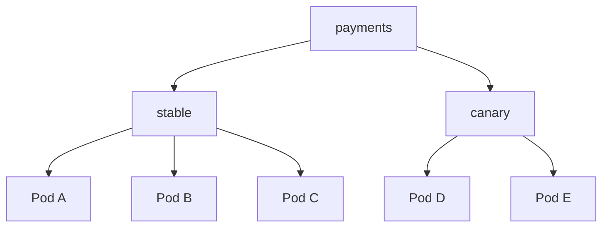
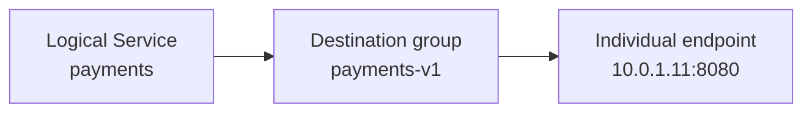
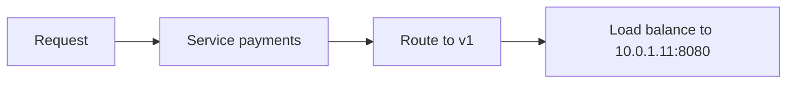

## Table of Contents

1. [How does a mesh route one Service name to a particular destination version?](#how-does-a-mesh-route-one-service-name-to-a-particular-destination-version)
2. [What does a weighted traffic split actually control?](#what-does-a-weighted-traffic-split-actually-control)
3. [Where does load balancing choose an individual endpoint?](#where-does-load-balancing-choose-an-individual-endpoint)
4. [How does a timeout bound the caller's total wait?](#how-does-a-timeout-bound-the-callers-total-wait)
5. [When can a retry help, and how can retries multiply load?](#when-can-a-retry-help-and-how-can-retries-multiply-load)
6. [How do connection limits and outlier detection protect a struggling destination?](#how-do-connection-limits-and-outlier-detection-protect-a-struggling-destination)
7. [How can a team verify a route change and return traffic to the stable version?](#how-can-a-team-verify-a-route-change-and-return-traffic-to-the-stable-version)
8. [Check Your Answers](#check-your-answers)
9. [References](#references)

Plain Kubernetes discovery gives an application a logical Service and a changing set of possible endpoints. A mesh proxy turns that topology into a request decision: which group, which endpoint, how much time, whether another attempt is safe, and how much failure or load the destination may absorb.

Read the request path as six ordered control layers:

```text
discovery       → What logical destinations and endpoints exist?
routing         → Which destination group should receive this request?
load balancing  → Which eligible endpoint in that group?
time control    → How much of the caller's latency budget may be spent?
failure control → May an attempt repeat, or should a bad endpoint be ejected?
capacity control→ How much connection, request, and queue load is safe?
```

The order matters. A proxy cannot load-balance within v2 until routing has chosen v2, and it should not retry until it knows the operation, failure, remaining deadline, and retry capacity allow another attempt.

Seven questions follow that decision:

1. **How does a mesh route one Service name to a particular destination version?**
2. **What does a weighted traffic split actually control?**
3. **Where does load balancing choose an individual endpoint?**
4. **How does a timeout bound the caller's total wait?**
5. **When can a retry help, and how can retries multiply load?**
6. **How do connection limits and outlier detection protect a struggling destination?**
7. **How can a team verify a route change and return traffic to the stable version?**

## How does a mesh route one Service name to a particular destination version?
<!-- section-summary: Routing matches a request for a logical Service and selects a destination group such as stable, canary, region, or version. -->

The application calls:

```http
GET http://payments:8080/charge
```

It asks for logical Service `payments`, not endpoint `10.0.1.10`. The proxy can model:



A route can choose stable or canary by weight, or match a path, method, header, source, or host. For example, internal users can go to canary, `/checkout` can go to v2, and other traffic can remain on v1.

Keep three identities separate:



Routing chooses the group. It does not yet choose the Pod.

### One Service name creates several distinct decisions

Suppose the endpoint topology is:

```text
payments
├── stable
│   ├── 10.0.1.10
│   ├── 10.0.1.11
│   └── 10.0.1.12
└── canary
    ├── 10.0.1.20
    └── 10.0.1.21
```

The caller names only `payments`. A proxy can first match the request, then choose stable or canary, then choose an endpoint inside that group. It can also decide whether the endpoint has capacity, how much time remains, whether a failed attempt may repeat, and whether repeated failures have made an endpoint temporarily ineligible.

Most traffic-policy configuration answers one of those questions. Keeping them separate prevents a common mistake: treating the Service name, destination version, and Pod address as three names for the same thing.

### Read routing policy from the proxy's point of view

If a request carries `x-user-type: internal`, a route may send it to canary; `/checkout` may go to v2; everything else may stay on v1. The route is selecting a destination group. It is not yet choosing `10.0.1.20` or another physical server.

That gives a stable sentence for reading configuration:

```text
For a request to payments, when this match applies,
choose this destination group.
```

Endpoint health, locality, available capacity, and the load-balancing algorithm enter only after that sentence has selected a group.

### Translate one policy into a complete proxy decision

Suppose the intended sentence is:

```text
For requests to payments, send 90% to stable and 10% to canary.
Within the chosen group, use least-request balancing across eligible Pods.
Allow at most two seconds overall and one retry while time remains.
Limit excessive concurrency and eject endpoints that repeatedly fail.
```

The Service name `payments` identifies the logical destination. Labels or other destination metadata define stable and canary groups. The weighted route selects one of those groups. The endpoint pool for the selected group is then filtered by eligibility and health, after which least-request balancing chooses one Pod. Only then does the proxy send an attempt and begin observing its result against time, retry, health, and capacity rules.

Reading real configuration in this order avoids letting product vocabulary obscure the mechanics. A route object, destination rule, subset, cluster, connection pool, and outlier setting are not unrelated features; each contributes one answer to the same request decision.

## What does a weighted traffic split actually control?
<!-- section-summary: A route weight is a probabilistic choice for each routing event, not an exact quota over a small request sample. -->

With 90% stable and 10% canary, the proxy conceptually draws a destination group for each request. Ten requests may include one canary request or none. Over a sufficiently large volume, the proportions approach the configured weights.

### A weight describes probability rather than sequence

The proxy does not need to send every tenth request to canary. Ten consecutive requests can all reach stable and still be consistent with a 90/10 policy. The useful evidence is the observed distribution over a large enough request population, together with the outcome of requests that actually reached canary.

This distinction matters operationally. At low traffic, a 1% or 10% route may produce too few canary requests to establish latency, error, or business-correctness evidence. The configured weight states the selection bias; it does not guarantee a useful sample.

For HTTP, routing can generally occur per request even when an underlying TCP connection is reused. With raw TCP traffic, a choice is more naturally attached to the connection. Protocol and proxy configuration determine the exact boundary.

A long-lived TCP connection can therefore make connection-weighted traffic look different from request-weighted HTTP traffic. Before interpreting a split, identify what event the proxy is weighting.

A weight controls which group receives traffic. It does not reserve exactly every tenth request or guarantee canary receives useful statistical coverage at low traffic.

This matters during rollout: judge actual request counts and outcomes rather than assuming the configured percentage produced an exact sample.

### Calculate the sample the canary actually received

At ten requests per minute, a 10% weight has an expected canary rate of about one request per minute, but individual minutes may contain zero, one, or several canary requests. An error rate calculated from one request is not stable evidence. At ten thousand requests per minute, the observed distribution has more opportunity to approach 90/10 and produce useful outcome counts.

The protocol changes the selection event too. With HTTP request-aware routing, several requests sharing one TCP connection can be assigned separately. With opaque TCP traffic, the natural decision may be made when a connection is established, and a few long-lived high-volume connections can make request counts differ sharply from connection weights.

Therefore verify three things separately: the configured weight, the number of routing events that occurred, and the actual requests and outcomes observed in each group. A correct weight can still be an ineffective experiment when traffic is too low or connection behavior produces too small a sample.

## Where does load balancing choose an individual endpoint?
<!-- section-summary: After routing selects a group, load balancing chooses one eligible physical endpoint inside that group. -->

Suppose the route chose v1:

```text
v1 endpoints
10.0.1.10
10.0.1.11
10.0.1.12
```

Load balancing chooses one endpoint using round robin, least requests, random choice, consistent hashing, or locality-aware behavior.

### Routing and load balancing multiply together

The complete decision is:



The two decisions compose. If v1 receives 80% of total traffic and has four equally balanced Pods, each receives about 20% of total traffic. If v2 receives 20% and has two equal Pods, each receives about 10%.

Conceptually:

```text
P(endpoint) = P(destination group) × P(endpoint within that group)
```

For v1, `0.8 × 1/4 = 0.2`; each endpoint receives about 20% of total traffic. For v2, `0.2 × 1/2 = 0.1`; each receives about 10%. The calculation is approximate because real algorithms can account for request load, hashing, and locality, but it makes the two layers visible.

### The proxy sees a richer topology than Kubernetes alone

Kubernetes can expose four endpoints for `payments`. The proxy adds subsets, route weights, endpoint eligibility, load-balancing policy, time budgets, retry rules, health observations, and capacity limits.

Kubernetes supplies the raw service topology. The proxy turns it into a decision system. When debugging, compare those two views: an endpoint can exist in the EndpointSlice while a proxy excludes it from a subset, considers it unhealthy, or has not received current configuration.

The probability calculation also exposes uneven group sizes. If stable receives 90% across nine equally used Pods, each stable Pod receives roughly 10% of total traffic. If canary receives 10% but has only one Pod, that single Pod also receives roughly 10%. The two individual Pods may therefore see similar traffic even though their destination groups have radically different weights.

Real balancing can differ because requests vary in duration, least-request favors less busy endpoints, consistent hashing preserves a key-to-endpoint relationship, and locality policy favors nearby capacity. The simple multiplication is the baseline; deviations should be explained by the configured algorithm and eligible endpoint set.

## How does a timeout bound the caller's total wait?
<!-- section-summary: A timeout expresses the finite latency budget the caller is willing to spend, and downstream budgets should fit inside the remaining upstream deadline. -->

A two-second timeout means:

```text
t=0 ───────────────────────── t=2s
       permitted call budget
```

A response at 500 ms succeeds. No response by the deadline fails the call.

### The deadline belongs to the caller's complete operation

Timeouts matter because latency propagates. A user request can travel Frontend → Checkout → Payments → Bank API. If every hop waits 30 seconds independently, work continues long after the original caller has given up.

A coherent budget can be:

```text
user request          2.0 s
frontend processing   0.1 s
checkout call         1.7 s
payments downstream   1.2 s
bank API              0.8 s
```

Downstream budgets normally fit inside remaining upstream time. A timeout is the total patience contract, not a request to kill work arbitrarily.

If Frontend will abandon the user request after two seconds, a Payments dependency cannot sensibly keep a separate 30-second budget for work that only serves that request. Each hop consumes processing, queueing, network, and proxy time from the remaining budget. Making downstream budgets tighter prevents abandoned work from continuing to occupy capacity.

Timeout configuration therefore starts with the user-facing latency budget and works inward. Choosing an arbitrary per-hop number first can create a call graph whose individual settings cannot all fit inside the original request.

### Spend one end-to-end deadline, not a fresh budget at every hop

Assume the user-facing request has two seconds. Frontend spends 100 ms before calling Checkout, leaving 1.9 seconds. Checkout reserves some time to assemble and return the response, so it gives Payments at most 1.7 seconds. Payments performs 200 ms of work before calling the Bank API, whose deadline must fit inside the remaining time.

```text
t=0 ms      Frontend begins
t=100 ms    Checkout call begins, at most 1.7 s
t=300 ms    Payments downstream call begins, at most 1.2 s
t=1100 ms   Bank returns
t<2000 ms   response must reach original caller
```

Queueing, connection establishment, proxy processing, network travel, and application work all consume the same user-visible patience. A downstream 30-second timeout cannot create another 30 seconds for an upstream caller that abandons the request after two. It merely allows useless work to continue after the result can no longer be delivered.

## When can a retry help, and how can retries multiply load?
<!-- section-summary: A retry spends remaining time and adds another attempt, so it is useful only for repeatable operations, bounded failures, and available downstream capacity. -->

Separate an overall request deadline from per-attempt limits:

```text
overall budget = 1 second
attempt 1 fails at 300 ms
attempt 2 fails at 650 ms
attempt 3 may use only the time left to 1,000 ms
```

Retries also spend traffic capacity. At 10,000 original requests per second, two retries can create up to 30,000 attempts per second precisely while a dependency is failing. Backoff, retry limits, retry budgets, timeouts, circuit breaking, and outlier detection contain that amplification.

### One retry spends time and traffic simultaneously

An overall one-second deadline might permit attempt one to fail at 300 ms and attempt two at 650 ms. A third attempt has only the remaining 350 ms; it does not receive a fresh second. The proxy must check retries remaining, time remaining, eligible endpoints, and available retry capacity before trying again.

Traffic arithmetic makes the second budget concrete:

```text
10,000 original requests/second
+ up to 10,000 first retries/second
+ up to 10,000 second retries/second
= up to 30,000 attempts/second
```

If several layers retry independently—client, gateway, source proxy, and application—the amplification can compound. The retry mechanism is most active precisely when the destination is already signalling trouble.

### Repeatability is a business property

The operation must also be safe to repeat. A GET for a product is generally safer than `POST /charge-credit-card`. The charge may succeed while its response is lost, so a blind retry can charge twice. Idempotency keys or application semantics must make that safe; a proxy cannot infer business meaning.

Retries are additional load, not free reliability.

### Prevent retries at several layers from multiplying each other

Suppose the application library retries twice and the mesh proxy also retries twice. One original request can now create more attempts than either owner expects because a proxy retry can occur inside an application retry. Add a gateway with its own policy and the amplification grows again.

Assign one owner for the retry behavior on a path, or account explicitly for the combined maximum. Bound retryable conditions, per-attempt time, the overall deadline, backoff, and the share of capacity allowed for retries. Observe original requests and retry attempts separately so an apparent traffic surge is not mistaken for new user demand.

Even one bounded retry must satisfy two gates. Mechanically, the failure and remaining budget must permit another attempt. Semantically, repeating the operation must not create an invalid business outcome. An idempotency key can let Payments recognize a repeated charge request as the same operation; the proxy cannot invent that business guarantee from an HTTP method alone.

## How do connection limits and outlier detection protect a struggling destination?
<!-- section-summary: Capacity limits bound how much work is admitted, while outlier detection removes repeatedly failing endpoints from the eligible pool for a period. -->

If one of four endpoints repeatedly fails, outlier detection can temporarily eject it:

```text
before: [A] [B] [C failing] [D]
after:  [A] [B] [X]         [D]
```

The proxy can later test C again. This stops a load balancer from knowingly sending every fourth request to a bad endpoint.

### Outlier detection changes eligibility

The endpoint remains a Kubernetes endpoint, but repeated observed failures can remove it from the proxy's eligible pool for a period. After that interval, the proxy can test it again. This is a local traffic decision based on observed behavior, not deletion of the Pod.

### Capacity limits bound admitted work

Connection or circuit-breaking limits solve a different problem: healthy endpoints can still be overloaded. Bound connections, concurrent requests, pending requests, and queues so the proxy fails some work quickly instead of allowing latency, timeout, retry, and load to grow until everything fails.

If a dependency can complete 500 concurrent requests, accepting 1,000 can cause queues, latency, timeouts, and retries to grow together. Rejecting some work quickly can preserve capacity for the requests the service can complete. Outlier detection asks which endpoints remain trustworthy; limits ask how much work the eligible endpoints may absorb.

### Displaced traffic still needs somewhere to go

These controls move traffic rather than destroying it. Ejecting four of five Pods can place all former traffic on one survivor. Failing over one 50% region to another can double the remaining region's load. Always ask where traffic goes when a policy activates and whether the destination has capacity.

Traffic follows a conservation rule: making one destination unavailable either moves its share elsewhere or turns that share into failures. If East normally carries 50% and disappears, West must support 100% for full failover to succeed. A policy that protects East can destroy West if the remaining region lacks twice the capacity.

### Combine endpoint health with remaining capacity

Assume five Pods each handle 20 requests per second, for 100 total. Ejecting one failing Pod leaves four Pods. Preserving all traffic raises each survivor to 25 requests per second. If their safe capacity is 22, outlier ejection has removed errors from one endpoint but overloaded every remaining endpoint.

```text
before ejection: 20 + 20 + 20 + 20 + 20 = 100
after ejection:  25 + 25 + 25 + 25      = 100
safe survivor capacity: 4 × 22 = 88
```

The system must shed twelve requests per second, reduce upstream demand, restore capacity, or accept overload. Connection and request limits can reject the excess quickly. They cannot manufacture the missing capacity.

This is why health and capacity are different axes. An endpoint may pass its health check yet be saturated. An ejected endpoint may recover while the remaining pool is already near its limit. Every failover and ejection policy needs a stated destination for displaced traffic and a capacity calculation for that state.

## How can a team verify a route change and return traffic to the stable version?
<!-- section-summary: Move traffic in measured stages, observe technical and business outcomes, and treat a return to stable as a traffic-policy change separate from Pod lifecycle. -->

A progressive route can move:

```text
stable  canary
100       0
 95       5
 90      10
 75      25
 50      50
 25      75
  0     100
```

At each stage, measure actual request distribution, error rate, latency, CPU, memory, dependency failures, and business correctness. Verify from the proxy's perspective: which route matched, which group was chosen, which endpoints remained eligible, which load balancer ran, how much time remained, whether a retry occurred, and which response returned.

### Walk one request through the complete decision tree

Suppose `checkout` calls `inventory`. Policy sends 80% to v1 and 20% to v2, gives the call one second, permits one retry, and enables outlier detection. For one request:

1. the logical destination is `inventory`;
2. the weighted route chooses v2;
3. v2 currently contains endpoints D and E;
4. the load balancer chooses D;
5. D fails after 200 ms;
6. the proxy confirms the failure is retryable, one retry remains, and about 800 ms remains;
7. the next choice selects E;
8. E succeeds after another 100 ms;
9. the application receives success after roughly 300 ms plus overhead.

If D repeatedly fails, outlier detection can eject it. Future v2 traffic then concentrates on E, so the next question is whether E has enough capacity for the entire v2 share. Features cannot be evaluated independently of where they move load.

### Verify effective decisions rather than authored intent

Read the route as the proxy would: which match won, which group was selected, which endpoints were eligible, which balancing rule ran, whether a connection was reused, how the deadline was spent, whether an attempt counted as retryable, and which response returned. This reconstruction localizes a surprising outcome more effectively than reading only the intended YAML.

If canary fails at 10%, return policy to stable 100% and canary 0%. Canary Pods can remain running for investigation. Traffic control and deployment control are separate; removing customer traffic does not require killing Pods.

Keeping the canary alive preserves its logs, proxy state, and repeatable test surface. The team can repair it, send a small measured share back, and increase again without making Pod destruction part of the traffic decision.

After every policy change, answer: if the selected destination becomes unhealthy now, exactly where will the next request go?

### Prove both the forward shift and the return path

Before moving from stable 100% to 95/5, establish baseline request count, latency, error, saturation, and business-correctness measures for stable. Apply the route change, then verify that the effective proxy configuration contains the intended match and both groups. Generate enough known traffic to measure actual distribution and identify which endpoint handled each request.

At the 5% stage, compare canary with the stable control under the same interval and request mix. Confirm that retries are not inflating canary attempts and that the single or smaller canary pool has sufficient per-endpoint capacity. Increase weight only after the technical and business acceptance signals pass.

Test the recovery control before it is needed: change policy to stable 100% and canary 0%, verify new requests stop reaching canary, and confirm stable can absorb the returned share. Canary Pods can remain available for logs, proxy inspection, and synthetic testing. This proves traffic rollback independently of deployment deletion.

## Check Your Answers
<!-- section-summary: Rebuild traffic policy from routing, weights, endpoint balancing, time, retries, failure and capacity controls, and deliberate recovery. -->

:::expand[How does a mesh route one Service name to a particular destination version?]{kind="recap"}
It matches a request for the logical Service and chooses a destination group such as stable or canary. The application need not know individual versions.
:::

:::expand[What does a weighted traffic split actually control?]{kind="recap"}
It biases per-request or per-connection routing decisions over time. It is not an exact quota for a small sample.
:::

:::expand[Where does load balancing choose an individual endpoint?]{kind="recap"}
After routing chooses a group, load balancing selects one eligible endpoint inside it using the configured algorithm.
:::

:::expand[How does a timeout bound the caller's total wait?]{kind="recap"}
It defines the finite overall latency budget. Downstream and retry attempts must fit inside the time the caller still has.
:::

:::expand[When can a retry help, and how can retries multiply load?]{kind="recap"}
Retries can recover repeatable transient failures, but each attempt consumes time and capacity and may be unsafe for non-idempotent operations.
:::

:::expand[How do connection limits and outlier detection protect a struggling destination?]{kind="recap"}
Limits bound admitted load; outlier detection ejects repeatedly failing endpoints. Both require checking where displaced traffic will go.
:::

:::expand[How can a team verify a route change and return traffic to the stable version?]{kind="recap"}
Increase canary weight in stages, observe actual distribution and outcomes, and return to stable by policy while keeping canary Pods available for diagnosis.
:::

## References

- [Istio traffic management](https://istio.io/latest/docs/concepts/traffic-management/)
- [Istio request routing](https://istio.io/latest/docs/tasks/traffic-management/request-routing/)
- [Istio traffic shifting](https://istio.io/latest/docs/tasks/traffic-management/traffic-shifting/)
- [Istio circuit breaking](https://istio.io/latest/docs/tasks/traffic-management/circuit-breaking/)
- [Envoy load balancing](https://www.envoyproxy.io/docs/envoy/latest/intro/arch_overview/upstream/load_balancing/overview)
