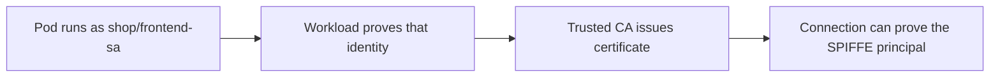

## Table of Contents

1. [How does a mesh give a workload a cryptographic identity?](#how-does-a-mesh-give-a-workload-a-cryptographic-identity)
2. [What does mTLS establish and protect during one service call?](#what-does-mtls-establish-and-protect-during-one-service-call)
3. [How do PeerAuthentication and DestinationRule divide the TLS decision?](#how-do-peerauthentication-and-destinationrule-divide-the-tls-decision)
4. [Why are namespace and ServiceAccount both part of a workload principal?](#why-are-namespace-and-serviceaccount-both-part-of-a-workload-principal)
5. [How does AuthorizationPolicy decide whether a request reaches a workload?](#how-does-authorizationpolicy-decide-whether-a-request-reaches-a-workload)
6. [How can a team introduce strict mTLS and an allow policy while preserving expected callers?](#how-can-a-team-introduce-strict-mtls-and-an-allow-policy-while-preserving-expected-callers)
7. [How can a team verify the identity, transport mode, and authorization result?](#how-can-a-team-verify-the-identity-transport-mode-and-authorization-result)
8. [Check Your Answers](#check-your-answers)
9. [References](#references)

Assume one rule throughout: Pod `frontend` in namespace `shop` runs as ServiceAccount `frontend-sa` and may `POST /charge` to `payments` in namespace `payments`; other callers and operations should be rejected. Kubernetes discovery finds the destination. Mesh identity, mTLS, and authorization decide whether this exact request is trusted.

The intended decision is precise:

```text
source principal: cluster.local/ns/shop/sa/frontend-sa
destination:      payments workloads in namespace payments
operation:        HTTP POST /charge
result:           allow

different principal, plaintext transport, or different operation
result:           reject
```

Keeping every coordinate visible prevents “inside the cluster” from becoming an implicit permission.

A Kubernetes Service maps a name such as `payments.payments.svc.cluster.local` to changing network endpoints. That answers where to send traffic, not whether the selected endpoint is cryptographically `payments` or whether the caller is authorized.

Keep these questions in view as you work through the lesson:

1. **How does a mesh give a workload a cryptographic identity?**
2. **What does mTLS establish and protect during one service call?**
3. **How do PeerAuthentication and DestinationRule divide the TLS decision?**
4. **Why are namespace and ServiceAccount both part of a workload principal?**
5. **How does AuthorizationPolicy decide whether a request reaches a workload?**
6. **How can a team introduce strict mTLS and an allow policy while preserving expected callers?**
7. **How can a team verify the identity, transport mode, and authorization result?**

## How does a mesh give a workload a cryptographic identity?
<!-- section-summary: The mesh uses a workload's Kubernetes ServiceAccount evidence to issue a short-lived certificate whose SPIFFE URI can be proven during a connection. -->

### Start with five separate security questions

When frontend calls `http://payments.payments.svc.cluster.local/charge`, the system must answer:

1. Where should the packet go?
2. Which server did the caller actually reach?
3. Which workload made the request?
4. Can another party read or modify the traffic in transit?
5. May this caller perform this operation?

Kubernetes Service discovery primarily answers the first question. The Service name resolves to a ClusterIP and eventually one of several selected Pods. That does not cryptographically prove that the endpoint is Payments, prove that the caller is Frontend, protect the bytes, or authorize `POST /charge`.

The mesh builds the remaining answers as a chain. Each link supplies evidence needed by the next: ServiceAccount identity becomes a certificate, the certificate becomes an authenticated peer principal, and that principal becomes an input to authorization.

### Follow ServiceAccount identity into a certificate

The frontend Pod selects:

```yaml
apiVersion: v1
kind: Pod
metadata:
  name: frontend
  namespace: shop
spec:
  serviceAccountName: frontend-sa
```

Kubernetes provides short-lived projected ServiceAccount credentials. A mesh certificate authority uses workload evidence to issue a short-lived X.509 certificate whose Subject Alternative Name contains a SPIFFE identity:

```text
spiffe://cluster.local/ns/shop/sa/frontend-sa
```

The transformation is:



This replaces trust in an ephemeral Pod IP or application-supplied header with possession of a certificate chained to a trusted issuer.

The distinction matters because Pods are replaced and their IP addresses change. The namespaced ServiceAccount represents a workload role across those replicas, while the certificate makes that role provable to another participant in the mesh.

### Service discovery names a destination; identity proves a principal

The DNS name `payments.payments.svc.cluster.local` resolves through a Kubernetes Service to one of its current endpoints. It remains stable while Pods are added and replaced. That stability is useful for routing, but the DNS answer does not prove that the selected network peer holds the Payments workload identity.

The mesh security chain supplies that proof:

```text
Pod spec selects ServiceAccount payments-sa
→ workload proves its Kubernetes identity to the mesh authority
→ authority issues a short-lived certificate
→ certificate contains the namespaced SPIFFE principal
→ peer verifies certificate chain and identity during mTLS
```

The resulting principal represents a security role, not an individual Pod or the Service object. Three replicas behind Service `payments` can all prove `cluster.local/ns/payments/sa/payments-sa`. Their Pod names and IPs remain useful operational identities, while policy survives replacement because it targets the stable workload role.

This distinction also exposes a design error. If Payments, Reconciliation, and an unrelated maintenance Job all use the namespace's `default` ServiceAccount, they all prove the same principal. A policy cannot distinguish responsibilities that the identity model collapsed. Give distinct workload roles distinct ServiceAccounts before expecting identity-aware authorization to separate them.

## What does mTLS establish and protect during one service call?
<!-- section-summary: Mutual TLS makes both proxies prove certified workload identities and then protects the connection with confidentiality and integrity. -->

For `frontend → payments`, the client proxy proves:

```text
cluster.local/ns/shop/sa/frontend-sa
```

and the server proxy proves:

```text
cluster.local/ns/payments/sa/payments-sa
```

Both certificates chain to a trust anchor accepted by the proxies. A successful handshake provides:

- **authentication:** each side knows the peer's certified workload identity;
- **confidentiality:** another party cannot read the connection;
- **integrity:** traffic cannot be silently modified in transit.

### Walk the handshake and request as two different decisions

In a sidecar path, the frontend application first sends ordinary HTTP to its local proxy. The frontend proxy and payments proxy then establish mTLS. During the handshake, both sides present certificates, validate their chain to a trusted authority, and learn the peer's certified identity. Only after that secure channel exists does the destination proxy evaluate the application request.

```text
frontend application
        ↓ local HTTP
frontend proxy: shop/frontend-sa
        ↓ authenticated and encrypted mTLS
payments proxy: payments/payments-sa
        ↓ authorized application request
payments application
```

This order explains why successful mTLS still can end in an authorization denial. The channel can be authentic, confidential, and intact while the authenticated caller lacks permission for the method or path.

mTLS proves who communicated and protects the channel. It does not mean every certified workload may call every other workload. `frontend-sa` having a valid certificate does not authorize it to charge a card; authorization is a separate decision.

In sidecar mode, workload proxies establish this channel. In ambient mode, Node-level `ztunnel` provides transparent workload mTLS over the secure transport. The mechanism changes, but the identity and mutual-authentication model remains.

### Separate the connection proof from the request permission

During the handshake, the source and destination each present a certificate. Each peer validates that the certificate is signed by a trusted authority, is acceptable for the connection, and contains the expected certified identity. Only after that exchange can the encrypted channel carry the application request.

```text
handshake result
├─ certified source = shop/frontend-sa
├─ certified destination = payments/payments-sa
├─ encryption keys established
└─ integrity protection established

request result
└─ authorization still evaluates POST /charge
```

This produces two independent failure classes. A trust, certificate, or transport-mode mismatch prevents the secure connection. A valid mTLS connection can then receive a policy denial because its principal, method, path, or another condition does not match. A 403 after authenticated transport is not evidence that mTLS failed; it can be evidence that mTLS successfully produced an identity the authorization layer rejected.

The same model applies when ambient `ztunnel` rather than Pod sidecars supplies the transport. Do not infer the security property from proxy placement. Prove which identity was authenticated on the actual path and which policy enforcement point evaluated the request.

## How do PeerAuthentication and DestinationRule divide the TLS decision?
<!-- section-summary: The outbound side decides whether to originate mTLS, while inbound PeerAuthentication decides whether a destination accepts plaintext, mTLS, or only mTLS. -->

TLS has two decisions:

```text
client side: should I originate TLS or mTLS?
server side: which connection modes will I accept?
```

In Istio sidecar mode, auto-mTLS or a `DestinationRule` governs the outbound choice. `PeerAuthentication` governs inbound acceptance.

### Client origination and server acceptance must agree

| Client sends | Server mode | Result |
|---|---|---|
| plaintext | `PERMISSIVE` | Accepted without mesh transport identity |
| mTLS | `PERMISSIVE` | Accepted securely |
| plaintext | `STRICT` | Rejected |
| mTLS | `STRICT` | Accepted securely |

Namespace-wide strict transport can be:

```yaml
apiVersion: security.istio.io/v1
kind: PeerAuthentication
metadata:
  name: default
  namespace: payments
spec:
  mtls:
    mode: STRICT
```

Strict mode closes the plaintext path. If outbound configuration sends plaintext to a strict destination, the handshake fails before request authorization.

`PERMISSIVE` is useful during migration because a destination can receive both meshed mTLS and legacy plaintext callers. It does not finish the security boundary: a random plaintext client can still reach the destination. Moving to `STRICT` makes a valid mesh-authenticated channel a prerequisite for every accepted connection.

In ambient mode, a Node-level `ztunnel` supplies transparent workload mTLS rather than placing an Envoy sidecar in every application Pod. The mechanics differ, while the model remains the same: workload evidence produces identity, peers authenticate that identity, and policy decides what it may do.

### Use the transport matrix as a migration test

While Payments is `PERMISSIVE`, both a correctly configured mesh caller and a plaintext legacy caller may succeed. That mode enables migration but cannot prove that every observed request is authenticated. Measure which paths establish mTLS before treating principal-based policy as complete.

Switching to `STRICT` changes the acceptance contract:

```text
mesh caller originates mTLS     → handshake can succeed
legacy caller sends plaintext   → rejected before HTTP authorization
misconfigured mesh caller sends plaintext → rejected at transport
```

If a legitimate caller fails after the switch, inspect its outbound origination decision rather than weakening the ALLOW rule. `PeerAuthentication` answers what the destination accepts; auto-mTLS or explicit outbound configuration answers what the caller sends. Security requires those independent decisions to agree.

Test all four matrix cells in a controlled boundary when possible. A positive mTLS request proves the secure path. A negative plaintext request proves strict rejection. Leaving only the positive test cannot distinguish strict enforcement from permissive acceptance.

## Why are namespace and ServiceAccount both part of a workload principal?
<!-- section-summary: Namespace makes identically named ServiceAccounts distinct, while ServiceAccount gives every replica of one workload role a stable security identity. -->

Three `payments` Pods can share ServiceAccount `payments-sa`. Their Pod names are ephemeral, but their principal is stable:

```text
cluster.local/ns/payments/sa/payments-sa
```

Two workloads that share one ServiceAccount also share a mesh principal. Giving unrelated workloads the `default` ServiceAccount removes useful separation.

### The principal represents a workload role rather than one replica

The Kubernetes Service `payments` might select `payments-abc`, `payments-def`, and `payments-ghi`. Those Pod names help operators identify instances, but all three can legitimately act as the same security role when they run as `payments-sa`. Authorization can then survive rollout and replacement without listing Pod IPs or generated names.

The reverse is also important. If the API server, reconciliation worker, and database migration Job all run as `default`, the mesh sees one principal even though they perform different jobs. Separate ServiceAccounts create separate authorization subjects.

Namespace is part of the identity:

```text
cluster.local/ns/shop/sa/frontend-sa
cluster.local/ns/staging/sa/frontend-sa
```

These are different principals even though the ServiceAccount name matches. Treat namespace as a coarse organization or policy boundary and ServiceAccount as a workload-role boundary.

Namespaces alone do not block network communication. Under authenticated mTLS, however, authorization can rely on source namespace and principal as verified identity data rather than an inferred source IP.

## How does AuthorizationPolicy decide whether a request reaches a workload?
<!-- section-summary: The destination proxy combines the authenticated source principal with request attributes and policy target selection to produce an allow or deny result. -->

```yaml
apiVersion: security.istio.io/v1
kind: AuthorizationPolicy
metadata:
  name: frontend-can-charge
  namespace: payments
spec:
  selector:
    matchLabels:
      app: payments
  action: ALLOW
  rules:
    - from:
        - source:
            principals:
              - cluster.local/ns/shop/sa/frontend-sa
      to:
        - operation:
            methods: ["POST"]
            paths: ["/charge"]
```

Read it as: target `app=payments` workloads in `payments`; allow when the authenticated caller is `shop/frontend-sa` and the HTTP operation is `POST /charge`.

The TLS handshake supplies `source.principal`. L7 protocol parsing supplies method, path, host, headers, and possibly JWT claims. A matching source and operation combine with required conditions to decide the request.

No applicable ALLOW policy generally leaves traffic allowed. Once an ALLOW policy applies, requests must match an ALLOW rule. Istio evaluates CUSTOM, then DENY, then ALLOW; a matching DENY wins.

### Authentication data becomes authorization data

Before mTLS, the receiver may see only an address such as `10.42.1.17` and infer which workload might own it. After the certificate handshake, the proxy has a verified `source.principal`:

```text
ServiceAccount
      ↓
short-lived certificate
      ↓
mTLS peer authentication
      ↓
source.principal
      ↓
AuthorizationPolicy
      ↓
ALLOW or DENY
```

Break the identity or mTLS links and principal-based authorization loses its trustworthy input. This is why a policy that selects `source.namespaces` or `source.principals` depends on authenticated transport rather than an unverified source address.

### Policy targets, sources, and operations all need to match

The example policy first selects destination workloads labelled `app=payments` in the `payments` namespace. Its rule then requires the `shop/frontend-sa` principal and the HTTP operation `POST /charge`. A caller can therefore fail because the policy targets a different workload, because its principal differs, or because method and path do not match.

An ALLOW policy also changes the default for its targets. Before it applies, Frontend, Catalog, and an unrelated workload may all reach Payments. Once the narrow ALLOW applies, only matching requests pass unless another applicable rule also allows them. A matching DENY still takes precedence.

Kubernetes RBAC is separate. It controls what `frontend-sa` may do to the Kubernetes API. Mesh AuthorizationPolicy controls what the workload may do to another workload.

### Evaluate the policy as target AND source AND operation

Begin with the target. The policy exists in namespace `payments` and selects workloads labelled `app=payments`. A correct source rule has no effect on a workload the policy did not target. Verify labels on the actual destination workload rather than assuming the Service name establishes the target.

Next evaluate the authenticated source. The rule requires `cluster.local/ns/shop/sa/frontend-sa`; `cluster.local/ns/staging/sa/frontend-sa` and `cluster.local/ns/shop/sa/default` are different principals. A request with no authenticated principal cannot satisfy this identity rule merely because its source IP came from the `shop` namespace.

Finally evaluate the operation. The example permits HTTP `POST` and path `/charge`. `GET /charge`, `POST /admin`, or an opaque TCP flow does not supply the same matching attributes. Method and path policy depends on the proxy recognizing and processing the protocol at Layer 7.

```text
target payments workload
AND source shop/frontend-sa
AND method POST
AND path /charge
AND no higher-priority DENY match
→ ALLOW
```

When an ALLOW policy applies to a target, an unmatched request is denied. That changes the destination from broad reachability to positive authorization. DENY still takes precedence, so list every applicable policy instead of assuming the nearest ALLOW is the complete decision.

## How can a team introduce strict mTLS and an allow policy while preserving expected callers?
<!-- section-summary: Establish identity and encrypted traffic first, reject plaintext next, then narrow authorized callers and operations while testing positive and negative cases. -->

Move in stages:

1. establish mesh identity, mTLS, and telemetry while destinations remain permissive;
2. inventory every expected caller and call path;
3. switch `payments` to strict mTLS and verify that all legitimate callers originate mTLS;
4. add narrow ALLOW policy for `shop/frontend-sa` and `POST /charge`;
5. prove catalog, random workloads, and other methods or paths are denied;
6. expand only after the policy matches observed communication.

### Inventory callers before narrowing the destination

Payments may receive expected traffic from Frontend, reconciliation Jobs, health tooling, or another service. Moving directly from permissive transport to one narrow ALLOW can turn undocumented dependencies into an outage. Telemetry under the permissive stage supplies the caller identities and operations that the intended policy must classify.

The stages deliberately separate two migrations. First, make legitimate callers capable of authenticated transport and reject plaintext. Then convert authenticated reachability into explicitly authorized operations. A failure in the first migration is a TLS or identity problem; a failure in the second is a policy problem.

The intended final model is:

```text
frontend-sa POST /charge → allowed
catalog-sa  POST /charge → denied
frontend-sa GET  /admin  → denied
plaintext connection      → rejected
```

Network reachability is not permission, and a valid mesh certificate is not permission. Both authenticated identity and an authorized operation are required.

### Use observed traffic to construct the intended allowlist

Before enforcement, list each legitimate relationship:

| Caller principal | Operation | Reason |
|---|---|---|
| `shop/frontend-sa` | `POST /charge` | Customer checkout |
| reconciliation principal, if present | its exact operation | Scheduled financial work |
| health or platform caller, if present | its exact path | Operational check |

The table should come from application ownership and observed authenticated traffic, then be reviewed for necessity. Observation alone can include accidental or compromised traffic; design alone can miss real dependencies. Combining them produces a deliberate classification.

Roll out transport and authorization separately. First prove each legitimate caller has its expected principal and uses mTLS under permissive acceptance. Then enable strict transport and prove plaintext rejection. Finally introduce the ALLOW policy and test each authorized pair plus nearby negatives. This sequencing makes a failure attributable to identity, transport, or request policy instead of changing all three at once.

Do not keep permissive or broad access merely because an unknown caller appears. Identify its owner and operation, decide whether it is legitimate, and give it a distinct identity and narrow rule when justified. The point of enforcement is to turn undocumented network reachability into explicit workload permission.

## How can a team verify the identity, transport mode, and authorization result?
<!-- section-summary: Debug the whole request chain in order so discovery, TLS origination, certificate identity, strict acceptance, protocol parsing, and policy matching are not confused. -->

Follow:

```mermaid
flowchart LR
    DNS[DNS and Service] --> Endpoint[Selected endpoint]
    Endpoint --> Interception[Outbound interception]
    Interception --> Origination[TLS origination decision]
    Origination --> Handshake[Certificate handshake and principals]
    Handshake --> PeerAuth[Inbound PeerAuthentication]
    PeerAuth --> Protocol[HTTP protocol parsing]
    Protocol --> Authz[AuthorizationPolicy target and rules]
    Authz --> Payments[Payments application]
```



If the certificate handshake fails, changing an ALLOW rule cannot help. If mTLS succeeds and the proxy returns a 403 authorization denial, investigate target labels, source principal, method, path, and any matching DENY.

### Localize the first failed boundary

Use the observed symptom to choose the next question:

| Observation | Boundary to inspect |
|---|---|
| Service name does not resolve | DNS and Kubernetes Service discovery |
| Endpoint is absent | Service selector, readiness, and endpoint discovery |
| TLS handshake fails | Outbound TLS mode, certificate identity, trust, and inbound PeerAuthentication |
| `source.principal` is empty | Whether authenticated mesh transport actually carried the request |
| Proxy returns authorization denial | Policy target, principal, method, path, conditions, and DENY rules |
| Request reaches the wrong application behavior | Application handling after security gates |

If `source.principal` is empty, investigate transport identity. If principal matches but `POST /charge` does not, confirm the proxy recognizes the traffic as HTTP; path and header rules do not behave like L4 TCP attributes.

Verify the expected positive request and explicit negatives. The proof must cover identity, secure transport, and the final authorization result rather than only showing that a Service name resolves.

### Build a four-part security proof

For the positive test, originate `POST /charge` from a Pod that actually runs as `shop/frontend-sa`. Verify the selected destination is the intended Payments workload, the connection used mTLS, the observed source principal is exact, and the destination allowed the request. Application success alone is insufficient because permissive plaintext or a broad policy could also produce success.

Then test deliberate negatives:

```text
shop/frontend-sa POST /charge  → allowed
shop/catalog-sa  POST /charge  → denied by source rule
shop/frontend-sa GET /admin    → denied by operation rule
plaintext caller → rejected by STRICT transport
```

For each result, capture the first enforcement boundary and reason. A TLS failure proves the request never reached L7 authorization. An authorization-denied response should identify the principal and request attributes that were evaluated. If the application itself returns an error after the proxy allows the request, mesh security has finished and application behavior is the next boundary.

Finally, test certificate and identity lifecycle rather than only one moment. Workload replicas are replaced and short-lived certificates rotate. The same ServiceAccount role should retain its authorized principal through normal rotation, while a Pod changed to another ServiceAccount should lose the old authority. That demonstrates the policy is bound to intended workload identity rather than an accidental Pod instance or IP.

Repeat the negative authorization checks after rotation and rollout. Continued denial proves that renewal preserved the security boundary as well as the allowed path.
Record the authenticated principal and policy result as evidence for both cases.
Preserve that evidence durably.

## Check Your Answers
<!-- section-summary: Rebuild mesh security from ServiceAccount identity, certificates, mTLS, inbound and outbound decisions, principal scope, policy, rollout, and diagnosis. -->

:::expand[How does a mesh give a workload a cryptographic identity?]{kind="recap"}
It maps the namespaced ServiceAccount to a short-lived certificate containing a SPIFFE URI that the workload can prove during a connection.
:::

:::expand[What does mTLS establish and protect during one service call?]{kind="recap"}
It mutually authenticates the two workload identities and provides confidentiality and integrity. It does not grant application authorization.
:::

:::expand[How do PeerAuthentication and DestinationRule divide the TLS decision?]{kind="recap"}
Auto-mTLS or DestinationRule decides outbound TLS origination; PeerAuthentication decides which inbound transport modes the destination accepts.
:::

:::expand[Why are namespace and ServiceAccount both part of a workload principal?]{kind="recap"}
ServiceAccount identifies the stable workload role, and namespace distinguishes the same ServiceAccount name in different security domains.
:::

:::expand[How does AuthorizationPolicy decide whether a request reaches a workload?]{kind="recap"}
It targets destination workloads and matches authenticated source identity plus request attributes. Applicable ALLOW rules create an allowlist, while DENY takes precedence.
:::

:::expand[How can a team introduce strict mTLS and an allow policy while preserving expected callers?]{kind="recap"}
Establish identities and encryption, inventory callers, enforce strict transport, add the narrow allow rule, and test both allowed and denied paths.
:::

:::expand[How can a team verify the identity, transport mode, and authorization result?]{kind="recap"}
Trace discovery, TLS decisions, certificate principals, strict acceptance, protocol parsing, and policy matching in order and localize the first failed boundary.
:::

## References

- [Istio security concepts](https://istio.io/latest/docs/concepts/security/)
- [Istio authentication policies](https://istio.io/latest/docs/concepts/security/#authentication-policies)
- [PeerAuthentication](https://istio.io/latest/docs/reference/config/security/peer_authentication/)
- [Authorization Policy](https://istio.io/latest/docs/reference/config/security/authorization-policy/)
- [Kubernetes Service Accounts](https://kubernetes.io/docs/concepts/security/service-accounts/)
