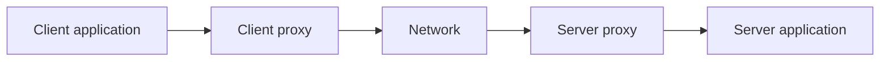
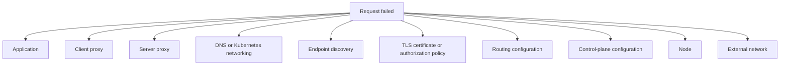
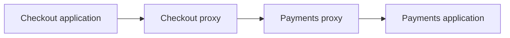
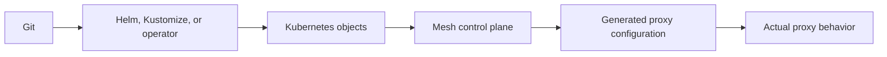

## Table of Contents

1. [What extra system does a team operate after adding a mesh?](#what-extra-system-does-a-team-operate-after-adding-a-mesh)
2. [Where does telemetry come from along one meshed request?](#where-does-telemetry-come-from-along-one-meshed-request)
3. [Why can source and destination measurements differ?](#why-can-source-and-destination-measurements-differ)
4. [How should metrics, traces, and logs work together?](#how-should-metrics-traces-and-logs-work-together)
5. [How do sampling and label cardinality control telemetry cost?](#how-do-sampling-and-label-cardinality-control-telemetry-cost)
6. [How can proxy, application, and configuration signals be correlated?](#how-can-proxy-application-and-configuration-signals-be-correlated)
7. [How do service objectives and staged upgrades guide mesh operations?](#how-do-service-objectives-and-staged-upgrades-guide-mesh-operations)
8. [Check Your Answers](#check-your-answers)
9. [References](#references)

A mesh inserts infrastructure into the application request path. The team now operates a distributed system that carries traffic, distributes configuration and certificates, produces telemetry, consumes capacity, and can fail independently of the applications it serves.

Every operational question follows from one fact: a request now crosses mesh-owned runtime components whose behavior depends on asynchronously distributed state.

```text
request path:   application → data plane → network → data plane → application
control path:   Kubernetes and mesh policy → control plane → proxy configuration
reporting path: proxies and applications → telemetry pipeline → backend and query
```

All three paths must work, but they do not fail at the same time or produce the same symptoms.

Keep these questions in view as you work through the lesson:

1. **What extra system does a team operate after adding a mesh?**
2. **Where does telemetry come from along one meshed request?**
3. **Why can source and destination measurements differ?**
4. **How should metrics, traces, and logs work together?**
5. **How do sampling and label cardinality control telemetry cost?**
6. **How can proxy, application, and configuration signals be correlated?**
7. **How do service objectives and staged upgrades guide mesh operations?**

## What extra system does a team operate after adding a mesh?
<!-- section-summary: The mesh has a traffic-carrying runtime path plus configuration and reporting paths whose failures have different effects. -->

The runtime path carries requests:



The control and reporting paths distribute routes, policy, endpoints, certificates, and configuration to proxies and carry proxy telemetry toward an observability backend.

### Runtime, control, and reporting failures have different clocks

The runtime path is synchronous with the user request: a failed data-plane proxy can fail traffic now. The control plane is normally outside that request path. Existing proxies may continue using their last configuration while discovery changes, certificates, policies, or new routes stop arriving. The reporting path can fail again independently, leaving healthy requests with missing dashboards or failed requests with missing evidence.

That produces four more precise health questions:

1. Is production traffic flowing?
2. Is the data plane enforcing the intended effective state?
3. Is the control plane distributing current state?
4. Is telemetry accurately reporting what occurred?

One green control-plane dashboard cannot answer all four.

Keep failure classes separate:

- unhealthy data plane: requests can fail immediately;
- unhealthy control plane: existing traffic may continue while new endpoints, policy, certificates, or configuration stop propagating;
- unhealthy telemetry path: requests may succeed while dashboards are wrong or empty.

For one failed request, those broad classes expand into several independent failure domains:



The extra layers can make the first investigation feel wider. They also provide a common proxy observation point around applications written in different languages, so the same request evidence can be compared across workloads.

“Is the mesh healthy?” is too broad. Ask whether traffic flows, the data plane enforces intended effective configuration, the control plane distributes it, and telemetry reports the result accurately.

The mesh is a distributed system controlling an application distributed system on Kubernetes. Each layer has state, propagation delay, partial failure, version skew, resource limits, and eventual consistency.

Configuration therefore becomes true gradually. After a route change, Kubernetes may hold the new object before the control plane observes it, and some proxies may acknowledge the generated version before others. “Is it deployed?” should become “what proportion of the relevant proxies acknowledged and are executing this version?”

### Name the consequence of each path failure

If a source proxy is unavailable or rejects a request, user traffic can fail immediately. If the control plane is unavailable, proxies may keep forwarding with their last accepted configuration, yet new endpoints, routes, policies, or certificate material may stop arriving. If the reporting exporter or backend is unavailable, traffic may remain healthy while the operator loses the evidence needed to prove it.

```text
data-plane failure    → present request behavior changes
control-plane failure → future or changing request behavior can become stale
reporting failure     → knowledge of behavior becomes incomplete
```

These effects can combine. A control-plane outage may not affect steady traffic until a Pod is replaced and its endpoint never reaches relevant proxies. A telemetry outage can hide that transition. The correct health model therefore tests the paths independently rather than using control-plane Pod readiness as a proxy for application traffic.

The distributed-state timeline is equally important. At one moment, Kubernetes stores a new route, the control plane has generated it for 80% of relevant proxies, and the remainder still use the old route. Both outcomes can occur legitimately during convergence. An operator needs acknowledgement and effective-state evidence, not only the timestamp at which YAML was accepted.

## Where does telemetry come from along one meshed request?
<!-- section-summary: The client proxy, server proxy, and application observe different boundaries of the same request and therefore produce complementary evidence. -->

For `checkout → payments`:



The client proxy sees the caller's total upstream experience, connection work, route, retry, and final response. The destination proxy sees arrival at the server workload and the server-side exchange. The application sees its own business processing and dependencies.

### Reconstruct one request before interpreting an aggregate

Suppose:

```text
client proxy duration        5.1 s
client upstream time         5.0 s
server proxy duration        5.0 s
application database query   4.8 s
```

That is a coherent slow-database story. If the client proxy records five seconds while the server proxy sees no request, investigate DNS, connection establishment, TLS, load balancing, network policy, proxy configuration, and endpoint discovery instead.

In the first story, nearly all observed time exists at the destination and inside its database dependency. In the second, the destination has no evidence because the request failed before arrival. The same five-second client symptom therefore leads to completely different investigations.

Reconstruct one request across both ends before treating an aggregate dashboard as the cause.

### Use absence of destination evidence as evidence

For the slow-database case, both proxies observe roughly five seconds and the application identifies 4.8 seconds in a query. The measurements nest coherently: almost all user-visible latency is accounted for at the destination.

Now consider:

```text
checkout proxy: request starts, waits 5 s, returns failure
payments proxy: no matching request
payments app:   no matching request
```

Do not search Payments database logs for a request that never arrived. The first missing observation moves the investigation to the path before destination ingress: route selection, endpoint knowledge, local queueing, connection establishment, TLS, network reachability, or a source-proxy timeout.

The reverse distinction also helps. If the destination proxy records the request but the application does not, inspect destination-side policy, local proxy-to-application delivery, protocol handling, and application listener state. Reconstructing one trace or synthetic request turns “latency is high” into a bounded location along the path.

## Why can source and destination measurements differ?
<!-- section-summary: The source includes work before the destination observes the call, and retries or failures can create source-side attempts that never arrive at the selected server proxy. -->

The source proxy's timing can include connection establishment, TLS negotiation, queueing, routing, retry delay, network latency, and proxy saturation. The destination proxy measures only requests that reached it. The application measures an even narrower processing boundary.

### Measurement boundaries explain disagreement

This can produce:

```text
application latency  40 ms
proxy latency       900 ms
```

The difference is evidence of work around the application, not necessarily a contradiction.

If the application reports 40 ms while the source proxy reports 900 ms, the missing 860 ms can include connection work, queuing, proxy saturation, network travel, or retries. If the destination proxy reports 40 ms too, the delay is probably before destination arrival. If it reports 900 ms while the application still reports 40 ms, inspect destination-side queueing and proxy work.

Retries also separate logical requests from upstream attempts. Three configured retries can turn one logical request into four attempts. At 10,000 logical requests per second, a failing destination can receive close to 40,000 attempts per second. If clients, gateways, mesh proxies, and applications all retry, amplification compounds.

Measure both requests and attempts, and correlate source and destination records by trace identity and workload metadata.

A retry changes the unit being counted. One logical checkout operation can create four upstream attempts. Combining those units misleads request-rate dashboards and dependency-capacity calculations, so name and measure them separately.

### Reconcile timing from increasingly narrow observers

Think of timing as nested boundaries:

```text
source application operation
└─ source proxy upstream experience
   ├─ routing and queueing
   ├─ connection and TLS
   ├─ network travel
   ├─ one or more attempts
   └─ destination proxy request
      └─ destination application processing
```

Each observer can legitimately report a different duration. The difference between adjacent boundaries estimates where time was spent. It is not exact proof by itself—clocks, sampling, and record matching matter—but it directs the next measurement.

Also distinguish final logical status from attempt statuses. A source proxy may observe one failed attempt and one successful retry while the application caller sees success. Destination proxies may each see only the attempt that reached their endpoint. Correlation must join the attempt records under one logical request before error counts are interpreted.

## How should metrics, traces, and logs work together?
<!-- section-summary: Metrics detect aggregate change, traces localize one request's time and causal path, and logs explain the detailed event. -->

Metrics answer “is something happening?” They show request rate, error rate, latency distributions, retries, connection and TLS failures, CPU, and memory.

### Metrics establish the affected population

Traces answer “where did this request spend time?” A 2.4-second checkout trace can localize 2.3 seconds to payments and 2.1 seconds of that to its database.

### Traces establish one causal path

Logs answer “what exactly happened?” An application can report `lock wait timeout` while a proxy can report `upstream_reset_before_response_started`.

### Logs explain the concrete event

Use the compact model: metrics detect, traces localize, and logs explain.

The tools overlap, but giving them primary jobs prevents unnecessary cost. A metric should not carry a request ID, a trace should not replace aggregate rate monitoring, and an isolated log line should not establish how many users were affected.

Keep top-level dashboards about service behavior and use lower-level proxy or control-plane telemetry after the user-facing symptom is decomposed.

### Apply the three signal jobs to one incident

Metrics show that Payments p99 rose from 180 ms to 2.4 seconds while error rate remains low. That establishes the affected service, interval, and tail population. Select a slow trace from that interval. Its spans show Checkout waiting 2.3 seconds on Payments and Payments waiting 2.1 seconds on its database. Application logs for that trace report a lock wait timeout; proxy logs show no TLS or reset failure.

```text
metric change → detect the tail-latency incident
slow trace    → localize it to Payments database work
matched log   → explain the lock-wait event
```

If instead the trace ends at the source proxy and its log reports an upstream reset, the same metric symptom produces a different explanation. This is why one giant telemetry system does not replace the different evidence types.

Dashboards should preserve this drill-down. Start from user success, latency, traffic, and error budget. Decompose by destination and route, then by proxy result or Node, then inspect control-plane and configuration internals only when the request evidence points there.

## How do sampling and label cardinality control telemetry cost?
<!-- section-summary: Retain high-value request detail selectively and keep unbounded identities out of metric labels so observability remains affordable and usable. -->

At 100,000 requests per second, the mesh handles 8.64 billion requests per day. Keeping a complete trace for every request can be impractical.

### Cardinality multiplies rather than adds

Metric dimensions multiply. Fifty sources, fifty destinations, ten response codes, five methods, and twenty clusters already produce a theoretical 2.5 million combinations. Adding Pod, route, zone, user ID, request ID, session ID, or URL can explode the series count.

The calculation is:

```text
50 sources × 50 destinations × 10 response codes
× 5 methods × 20 clusters
= 2,500,000 possible series
```

An unbounded user or request identifier can then multiply that space again. Cardinality is therefore a storage, query, and reliability concern, not merely a naming preference.

Use low-cardinality metric labels such as service, bounded route, response class, and region. Keep trace IDs, request IDs, and request-specific context in traces and logs.

Sampling should preserve value: routine successes can have a low rate, while slow requests, 5xx responses, and rare routes can have higher rates. Tail sampling can decide after the request outcome is known.

Head sampling decides when a request begins and is operationally simple. Tail sampling can retain a slow or failed trace after observing its outcome, but it must keep related spans together until the decision. The richer selection requires memory, time, and trace-affine routing.

Treat cardinality and sampled data volume as capacity resources like CPU and memory.

### Budget dimensions before enabling them everywhere

The 2.5 million theoretical series example assumes every combination is present; real occupancy may be lower, but the multiplication explains why one unbounded dimension is dangerous. Adding 100,000 distinct request IDs can turn a bounded service metric into a nearly per-request series space.

Choose each metric label by an operational grouping question: service identifies ownership, bounded route identifies behavior, response class identifies outcome, and region identifies a failure domain. Put the unique trace ID in traces and logs where per-request search is expected.

Sampling needs a coverage statement too. A 1% random sample at low traffic may retain no examples of a rare failing route. Outcome-aware tail sampling can preferentially keep errors and slow traces, but it requires collecting a trace's spans before deciding. Track the sampling policy and retained counts so “no trace found” is not mistaken for “no request failed.”

## How can proxy, application, and configuration signals be correlated?
<!-- section-summary: Join request identity with workload, proxy, Kubernetes, certificate, policy, and effective configuration so desired state can be compared with runtime behavior. -->

For a failed request, aim to identify:

- trace or request ID;
- source and destination workloads;
- proxy version;
- Deployment revision and Pod or Node;
- certificate and policy;
- mesh configuration version;
- application logs and proxy result.

### Correlation joins request state to infrastructure state

A trace ID identifies one request, while workload, revision, proxy, Node, certificate, policy, and configuration attributes explain the runtime context that handled it. Without both levels, an operator may find the request but not the state that made it fail, or find a suspicious proxy without proving it handled the request.

Desired state passes through several transformations:



The configuration in Git and the YAML accepted by Kubernetes are not necessarily the configuration a proxy currently has. Inspect effective proxy state.

For a timeout change from ten seconds to two, verify four layers:

1. desired state says two seconds;
2. the control plane generated and distributed two seconds;
3. the relevant proxies acknowledged and hold two seconds;
4. requests actually terminate around the expected deadline.

These are desired, distributed, effective, and observed state. A mismatch localizes the problem:

- desired differs from Kubernetes: packaging or delivery failed;
- Kubernetes differs from generated state: the control plane rejected or misread it;
- generated differs from proxy state: distribution or acknowledgement failed;
- proxy state differs from behavior: the request matched a different path or runtime execution is faulty.

`kubectl apply` succeeding proves only the API acceptance step. A GitOps “Synced” result also does not prove runtime enforcement.

### Walk one timeout change through every state

For `payments` timeout `10s → 2s`, define evidence at each transition:

```text
desired state
→ reviewed Git commit and rendered mesh resource say 2s

accepted state
→ Kubernetes stores the intended resource

generated and distributed state
→ control plane accepts it, generates proxy config, and reports delivery

effective state
→ checkout proxies that can match the route show a 2s timeout

observed behavior
→ a controlled slow request terminates at approximately the intended budget
```

If only some proxies acknowledge the version, requests can behave differently according to which source instance handles them. Record the cohort and acknowledgement proportion before judging the test. If every proxy holds two seconds but requests still last ten, verify that the request matched the intended route and that another layer is not applying a different deadline or retry behavior.

This method turns configuration propagation into a testable pipeline. It also makes rollback concrete: restore the desired value, verify new distribution and effective state, and repeat the behavior test rather than stopping when Git or Kubernetes looks reverted.

## How do service objectives and staged upgrades guide mesh operations?
<!-- section-summary: Begin with user-facing success and latency objectives, budget both proxy planes, and move high-blast-radius changes through measured cohorts with rollback evidence. -->

Start from an objective such as:

```text
99.9% of checkout requests succeed
99% finish under 500 ms
```

The top-level view should show success, p99 latency, traffic, and error-budget status. Decompose from service to dependency, proxy, Node/network, and control plane only as needed.

### Build the dashboard from user impact downward

Starting from every metric a proxy exposes reverses the useful hierarchy. Begin with the service objective, then drill into destination, proxy, Node or network, and control plane only when the user-facing signal requires explanation. An internal configuration-push fluctuation should not page a service owner when traffic remains inside its objective.

### Budget steady-state and recovery capacity separately

Capacity has two shapes. Data-plane cost depends on request rate, connections, TLS handshakes, payload, filters, retries, and telemetry. A 100m CPU and 100 MB sidecar repeated across 2,000 Pods becomes substantial. Control-plane cost depends on proxy, Service, endpoint, and configuration counts plus change rate. Test recovery events such as thousands of proxies reconnecting after a network interruption, control-plane restart, upgrade, or certificate rotation.

Two meshes with 10,000 proxies can have different control-plane needs when one is nearly static and the other changes continuously. A system sized for steady state can still fail when 5,000 proxies reconnect and request current state simultaneously. Recovery capacity is part of the operating budget.

### Promote behavior, not merely running proxy versions

Roll out mesh changes through development, test, a small production cluster or workload cohort, then measured percentages. Compare baseline and candidate latency, errors, CPU, memory, restarts, connection and TLS failures, configuration rejection, push latency, and telemetry volume.

A successful Kubernetes rollout proves the software deployed, not that request behavior stayed correct. Because configuration propagation is gradual, ask what percentage of relevant proxies acknowledged version X. Roll back or stop progression when service objectives or mesh health gates regress.

At each cohort, compare baseline and candidate p99 latency, errors, proxy CPU and memory, restarts, connection churn, TLS failures, configuration rejection, push latency, retry behavior, and telemetry volume. New proxies being Ready is a deployment fact; unchanged service behavior is the release evidence.

### Size for recovery and promote by observed behavior

For a sidecar example, 100m CPU and 100 MB memory multiplied across 2,000 Pods is roughly 200 CPU cores of requested proxy capacity and 200 GB of memory before accounting for actual sizing rules. Request rate, concurrent connections, TLS handshakes, payloads, filters, retries, and telemetry determine real data-plane demand; an average per-Pod estimate is only a starting point.

Control-plane recovery follows another shape. Thousands of proxies reconnecting after a restart or network partition request current discovery, policy, and certificates over a short interval. A control plane comfortable with slow steady updates can become saturated during that synchronization wave. Exercise reconnect, certificate rotation, and endpoint churn in addition to steady request load.

Promote a mesh revision through cohorts small enough to stop. For each cohort, compare the same service traffic mix against a baseline and keep an explicit rejection rule for latency, errors, connection failures, TLS behavior, resource use, rejected configuration, and telemetry change. Confirm the previous revision or configuration can be restored and that relevant proxies acknowledge it.

The governing hierarchy remains user experience first. A candidate whose Pods are Ready but whose p99, retry amplification, or certificate behavior regresses has failed. A control-plane metric that changes without request impact may deserve investigation, but it should not be confused with a demonstrated service outage.

## Check Your Answers
<!-- section-summary: Rebuild mesh operations from runtime and control paths, dual-sided evidence, signal roles, cost control, effective state, capacity, and staged change. -->

:::expand[What extra system does a team operate after adding a mesh?]{kind="recap"}
The team operates a data plane carrying traffic, a control plane distributing state, and a reporting pipeline. Each can fail independently.
:::

:::expand[Where does telemetry come from along one meshed request?]{kind="recap"}
Client proxy, destination proxy, and application each observe a different boundary. Correlating them reconstructs the request.
:::

:::expand[Why can source and destination measurements differ?]{kind="recap"}
The source observes connection work, routing, retries, and failures before destination arrival. The destination and application see narrower portions of the path.
:::

:::expand[How should metrics, traces, and logs work together?]{kind="recap"}
Metrics detect aggregate change, traces localize one request's causal time, and logs explain the specific event.
:::

:::expand[How do sampling and label cardinality control telemetry cost?]{kind="recap"}
Keep metric dimensions bounded and retain detailed request data selectively, with greater sampling for failures, slow calls, and rare paths.
:::

:::expand[How can proxy, application, and configuration signals be correlated?]{kind="recap"}
Join request identity, workload and proxy versions, Kubernetes placement, certificate, policy, and the actual proxy configuration to compare intent with behavior.
:::

:::expand[How do service objectives and staged upgrades guide mesh operations?]{kind="recap"}
Use user-facing objectives as gates, budget data and control planes, test recovery capacity, and promote mesh changes through measured cohorts.
:::

## References

- [Istio observability](https://istio.io/latest/docs/concepts/observability/)
- [Istio performance and scalability](https://istio.io/latest/docs/ops/deployment/performance-and-scalability/)
- [Istio upgrade](https://istio.io/latest/docs/setup/upgrade/)
- [Envoy statistics](https://www.envoyproxy.io/docs/envoy/latest/operations/stats_overview)
- [OpenTelemetry sampling](https://opentelemetry.io/docs/concepts/sampling/)
