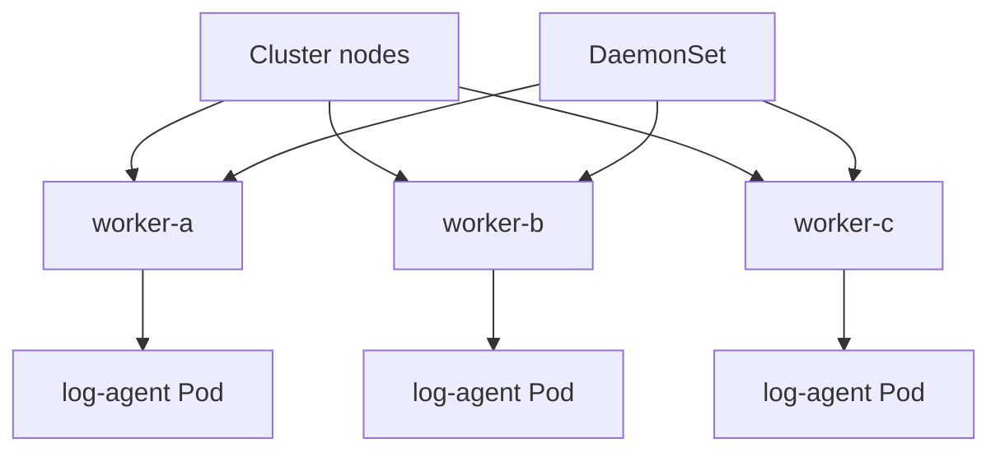

## Table of Contents

1. [Work That Belongs on Nodes](#work-that-belongs-on-nodes)
2. [A Log Agent for Orders API Nodes](#a-log-agent-for-orders-api-nodes)
3. [How DaemonSet Scheduling Feels Different](#how-daemonset-scheduling-feels-different)
4. [Node Selection, Taints, and Tolerations](#node-selection-taints-and-tolerations)
5. [Updating a DaemonSet](#updating-a-daemonset)
6. [Failure Mode: Missing Pods on Some Nodes](#failure-mode-missing-pods-on-some-nodes)
7. [DaemonSet Tradeoffs](#daemonset-tradeoffs)
8. [Operational Checks](#operational-checks)

## Work That Belongs on Nodes

Most application work belongs behind a Deployment. You choose a replica count, and Kubernetes places that many Pods wherever they fit. A DaemonSet solves a different problem: run one copy of a Pod on every eligible node, or on every node that matches a rule.

This is useful for node-local helpers. Log collectors, monitoring agents, storage plugins, and network plugins need to be present where the application Pods run. If `devpolaris-orders-api` lands on `worker-a`, the logging agent on `worker-a` can read node log files and ship them to the team's logging system.

The count follows the nodes. Add a node and the DaemonSet creates a Pod there. Remove a node and the DaemonSet Pod disappears with it. You do not set `replicas: 3` because the cluster size determines the count.

## A Log Agent for Orders API Nodes

A node log agent is a helper Pod that reads log files from the worker node where it is running. A DaemonSet is a good fit because every node that may run orders API Pods should also have the helper that collects their logs.

Example: the simplified DaemonSet below reads `/var/log` from each node and adds a cluster label before forwarding records to the logging system.

```yaml
apiVersion: apps/v1
kind: DaemonSet
metadata:
  name: devpolaris-log-agent
  namespace: observability
spec:
  selector:
    matchLabels:
      app: devpolaris-log-agent
  template:
    metadata:
      labels:
        app: devpolaris-log-agent
    spec:
      containers:
        - name: agent
          image: ghcr.io/devpolaris/log-agent:2026-05-07.1
          resources:
            requests:
              cpu: 100m
              memory: 128Mi
            limits:
              memory: 256Mi
          volumeMounts:
            - name: varlog
              mountPath: /var/log
              readOnly: true
      volumes:
        - name: varlog
          hostPath:
            path: /var/log
```

The `hostPath` volume mounts a path from the node into the Pod. It is a direct bridge from the container to the node filesystem, so it is powerful and risky. The agent can read node files, so it should run in a controlled namespace with least privilege and clear ownership.

Inspect a DaemonSet by comparing desired and available counts:

```bash
$ kubectl get daemonset -n observability devpolaris-log-agent
NAME                   DESIRED   CURRENT   READY   UP-TO-DATE   AVAILABLE   NODE SELECTOR   AGE
devpolaris-log-agent   4         4         4       4            4           <none>          12m
```

If the cluster has four eligible nodes, `DESIRED` should be four. If it is lower, node selection or taints may be excluding nodes.

## How DaemonSet Scheduling Feels Different

A Deployment asks, "How many copies of this application should run?" A DaemonSet asks, "Which nodes should have this helper?" That difference changes how you debug it.



The DaemonSet controller evaluates eligible nodes and creates one Pod per matching node. The scheduler still has to place the Pod, and the Pod still needs enough resources, image pull access, and any required tolerations.

For a log agent, the DaemonSet should usually run before or alongside application Pods. Missing node agents create blind spots in logs and metrics. That makes DaemonSet health part of application observability and platform plumbing.

## Node Selection, Taints, and Tolerations

Node selection is the set of rules that decides which nodes are eligible for a Pod. You can limit a DaemonSet to certain nodes with `nodeSelector`, node affinity, or tolerations.

Example: if only nodes labeled `devpolaris.io/node-pool=app` can run the orders API, the log agent can use the same label so it follows the application node pool.

```yaml
spec:
  template:
    spec:
      nodeSelector:
        devpolaris.io/node-pool: app
```

Now the log agent runs only on nodes with that label. If the orders API runs only in the `app` node pool, that is reasonable. If the API can land elsewhere, this selector can create a logging gap.

Taints and tolerations are Kubernetes scheduling rules. A taint on a node says "do not schedule ordinary Pods here." A toleration on a Pod says "this Pod is allowed to use nodes with that taint." For example, a GPU node might have `dedicated=gpu:NoSchedule`, and the log agent needs a matching toleration only if it is supposed to run there. DaemonSets automatically tolerate several node conditions because node-level agents often need to run even when a node is not fully ready.

## Updating a DaemonSet

A DaemonSet rolling update replaces node-local helper Pods across eligible nodes. It exists so a cluster-wide agent can change versions without disappearing everywhere at once.

Example: updating the log agent image from `2026-05-07.1` to `2026-05-07.2` should keep most nodes covered while Kubernetes replaces each agent Pod over time. The exact rollout can matter because node agents can affect every workload on the node.

```bash
$ kubectl set image daemonset/devpolaris-log-agent \
  -n observability agent=ghcr.io/devpolaris/log-agent:2026-05-07.2
daemonset.apps/devpolaris-log-agent image updated

$ kubectl rollout status daemonset/devpolaris-log-agent -n observability
daemon set "devpolaris-log-agent" successfully rolled out
```

For critical agents, watch application signals during the rollout. A broken network or log DaemonSet can affect many services at once, including `devpolaris-orders-api`.

## Failure Mode: Missing Pods on Some Nodes

A missing DaemonSet Pod means expected node coverage and actual helper Pods do not match. For the orders API, that can show up as logs from `worker-a`, `worker-b`, and `worker-c`, but no logs from `worker-d`.

First compare nodes with DaemonSet Pods.

```bash
$ kubectl get pods -n observability -l app=devpolaris-log-agent -o wide
NAME                         READY   STATUS    NODE
devpolaris-log-agent-2m7ks    1/1     Running   worker-a
devpolaris-log-agent-hq5s9    1/1     Running   worker-b
devpolaris-log-agent-xr8dp    1/1     Running   worker-c

$ kubectl get nodes
NAME       STATUS   ROLES
worker-a   Ready    <none>
worker-b   Ready    <none>
worker-c   Ready    <none>
worker-d   Ready    <none>
```

There are four nodes but only three agent Pods. Describe the DaemonSet and the missing node.

```bash
$ kubectl describe daemonset -n observability devpolaris-log-agent
Events:
  Type     Reason        Message
  ----     ------        -------
  Warning  FailedCreate  Error creating: pods "devpolaris-log-agent-" is forbidden:
                         node(s) had untolerated taint {dedicated: gpu}
```

The DaemonSet is not broken in a general way. It cannot run on `worker-d` because the node has a taint the Pod does not tolerate. The fix is either to add the correct toleration, remove the node from the expected target set, or adjust where `devpolaris-orders-api` is allowed to run.

## DaemonSet Tradeoffs

DaemonSets are convenient because they follow node membership automatically. That same convenience gives them a wide blast radius. A bad Deployment rollout might affect one service. A bad DaemonSet rollout can affect every node.

Use DaemonSets for node-local responsibilities, not ordinary application scaling. If a helper does not need node files, node networking, node metrics, or one-per-node placement, a Deployment is often easier to reason about.

| Workload | Good DaemonSet fit? | Why |
|----------|---------------------|-----|
| Log collector | Yes | Needs node log files |
| Node metrics agent | Yes | Measures node-local resources |
| Orders API | No | Needs service replicas, not per-node copies |
| One-time migration | No | Should finish as a Job |

This choice keeps the platform understandable. Controllers should express the operating model of the process.

## Operational Checks

A DaemonSet operational check is a coverage check. It asks whether every eligible node has the helper Pod it needs, and whether those helper Pods are ready enough to do their node-local job.

For a DaemonSet that supports `devpolaris-orders-api`, include that check in routine cluster operations. The fastest command compares desired, ready, and available.

```bash
$ kubectl get daemonset -A
NAMESPACE       NAME                   DESIRED   READY   AVAILABLE
observability   devpolaris-log-agent   4         4       4
kube-system     cni-agent              4         4       4
```

When the count is wrong, check node labels, taints, resource pressure, and image pull events. DaemonSet problems are often scheduling problems before they are application problems.

A second useful check is node coverage. The DaemonSet summary gives counts, but it does not show which node is missing an agent. Use `-o wide` when the problem is a logging or metrics gap on one worker.

```bash
$ kubectl get pods -n observability -l app=devpolaris-log-agent -o wide
NAME                         READY   STATUS    NODE       IP
devpolaris-log-agent-2m7ks    1/1     Running   worker-a   10.42.0.12
devpolaris-log-agent-hq5s9    1/1     Running   worker-b   10.42.1.19
devpolaris-log-agent-xr8dp    1/1     Running   worker-c   10.42.2.23
```

Compare that list with nodes that can run `devpolaris-orders-api`:

```bash
$ kubectl get nodes -l devpolaris.io/node-pool=app
NAME       STATUS   ROLES
worker-a   Ready    <none>
worker-b   Ready    <none>
worker-c   Ready    <none>
worker-d   Ready    <none>
```

The missing `worker-d` is where you focus. Describe the node and check taints, labels, and pressure conditions.

```bash
$ kubectl describe node worker-d
Taints:             dedicated=gpu:NoSchedule
Conditions:
  Type             Status
  Ready            True
  MemoryPressure   False
  DiskPressure     False
```

If the orders API should never run on GPU nodes, the DaemonSet does not need to run there either. If the orders API can run there during burst capacity, the missing log agent is a real observability bug.

DaemonSet Pods often need permissions that ordinary application Pods do not. They may mount host paths, use host networking, or run with extra Linux capabilities. Treat those permissions as part of the workload design, not as incidental YAML.

```yaml
securityContext:
  runAsUser: 10001
  runAsNonRoot: true
  readOnlyRootFilesystem: true
```

This small security context does not solve every agent permission problem, but it shows the direction: run with the least privilege that still lets the agent do its node-local job. If an agent truly needs broader access, document why in the owning platform repo and monitor it like critical infrastructure.

When a DaemonSet update goes badly, rollback works through the same rollout command family as Deployments:

```bash
$ kubectl rollout undo daemonset/devpolaris-log-agent -n observability
daemonset.apps/devpolaris-log-agent rolled back

$ kubectl rollout status daemonset/devpolaris-log-agent -n observability
daemon set "devpolaris-log-agent" successfully rolled out
```

After rollback, verify both the agent and the dependent application signal. For the orders API, that could mean logs from all nodes and no sudden gaps in request metrics.

```text
Checklist after DaemonSet rollback:
1. Desired and ready counts match.
2. Every expected node has one agent Pod.
3. Agent logs show successful shipping.
4. Orders API logs appear from all nodes that run API Pods.
5. No node reports new memory, disk, or network pressure.
```

This checklist is intentionally operational. DaemonSets sit close to the node, so a healthy object count is necessary but not enough. You also need to prove the node-level service it provides is working.

Resource settings matter for DaemonSets too. A node agent runs beside every application Pod on that node. If the agent has no request, the scheduler may underestimate node usage. If the agent has a tight memory limit, it may restart exactly when logs spike during an incident.

```yaml
resources:
  requests:
    cpu: 100m
    memory: 128Mi
  limits:
    memory: 256Mi
```

This example gives the scheduler a small reservation and protects the node from unbounded memory use. The exact values should come from measurement, especially for agents that parse high-volume logs.

If a DaemonSet Pod restarts, inspect it the same way you would inspect an application Pod, but keep the node context in mind.

```bash
$ kubectl get pod -n observability devpolaris-log-agent-2m7ks
NAME                        READY   STATUS    RESTARTS
devpolaris-log-agent-2m7ks   1/1     Running   6

$ kubectl describe pod -n observability devpolaris-log-agent-2m7ks
Last State:
  Terminated:
    Reason:     OOMKilled
    Exit Code:  137
```

Now check whether the node had unusual log volume or pressure:

```bash
$ kubectl describe node worker-a
Conditions:
  Type             Status
  MemoryPressure   False
  DiskPressure     False
```

If the node is healthy but the agent was killed, the agent limit or workload spike is the likely path. If the node has pressure, the DaemonSet may be a symptom of a broader node capacity problem.

---

**References**

- [Kubernetes DaemonSet](https://kubernetes.io/docs/concepts/workloads/controllers/daemonset/) - The official concept page for one-Pod-per-node workload behavior.
- [Taints and Tolerations](https://kubernetes.io/docs/concepts/scheduling-eviction/taint-and-toleration/) - The scheduling reference that explains why some nodes reject ordinary Pods.
- [Assign Pods to Nodes](https://kubernetes.io/docs/concepts/scheduling-eviction/assign-pod-node/) - Official guidance for node selectors, affinity, and placement rules.
