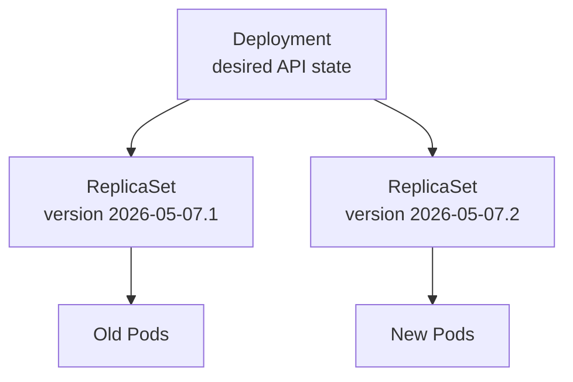

## Table of Contents

1. [Keeping an API Running](#keeping-an-api-running)
2. [The Deployment Spec](#the-deployment-spec)
3. [ReplicaSets Under the Deployment](#replicasets-under-the-deployment)
4. [Labels and Selectors Are the Contract](#labels-and-selectors-are-the-contract)
5. [Scaling Without Changing the Image](#scaling-without-changing-the-image)
6. [Failure Mode: Selector Mismatch](#failure-mode-selector-mismatch)
7. [Deployment Tradeoffs](#deployment-tradeoffs)
8. [The Review Checklist](#the-review-checklist)

## Keeping an API Running

A single Pod can run `devpolaris-orders-api`, but it cannot express the promise you usually want from production: keep three copies running, replace failed copies, and update them in a controlled way when the image changes. A Deployment is the Kubernetes workload object that expresses that promise for stateless applications.

Stateless means any replica can handle any request because durable state lives somewhere else, such as PostgreSQL, Redis, object storage, or an event stream. The API can keep short-lived memory caches, but an individual Pod should be replaceable. That replaceability is what lets Kubernetes recover from node failures and roll out new versions without treating one Pod as special.

A Deployment does not run containers directly. It creates a ReplicaSet. The ReplicaSet creates Pods. This layering looks fussy at first, but it gives Kubernetes a clean history of revisions during updates.



During a rollout, the Deployment can scale the new ReplicaSet up while scaling the old ReplicaSet down. That is why you normally inspect ReplicaSets, but do not edit them directly.

## The Deployment Spec

Here is a practical Deployment for `devpolaris-orders-api`. It asks Kubernetes to keep three API Pods running and to create each Pod from the template under `spec.template`.

```yaml
apiVersion: apps/v1
kind: Deployment
metadata:
  name: devpolaris-orders-api
  labels:
    app: devpolaris-orders-api
spec:
  replicas: 3
  selector:
    matchLabels:
      app: devpolaris-orders-api
  template:
    metadata:
      labels:
        app: devpolaris-orders-api
        tier: api
    spec:
      containers:
        - name: api
          image: ghcr.io/devpolaris/orders-api:2026-05-07.1
          ports:
            - containerPort: 8080
          readinessProbe:
            httpGet:
              path: /health/ready
              port: 8080
```

The top-level `metadata.labels` identify the Deployment itself. The selector decides which Pods belong to the Deployment's ReplicaSets. The Pod template is the factory blueprint for new Pods. When you change the template, Kubernetes creates a new ReplicaSet because the desired Pod shape changed.

Apply it and read the status from the outside inward:

```bash
$ kubectl apply -f deployment.yaml
deployment.apps/devpolaris-orders-api created

$ kubectl get deploy,rs,pod -l app=devpolaris-orders-api
NAME                                     READY   UP-TO-DATE   AVAILABLE   AGE
deployment.apps/devpolaris-orders-api    3/3     3            3           71s

NAME                                                DESIRED   CURRENT   READY   AGE
replicaset.apps/devpolaris-orders-api-6c98b8f6d7    3         3         3       71s

NAME                                      READY   STATUS    RESTARTS   AGE
pod/devpolaris-orders-api-6c98b8f6d7-8p6cz 1/1    Running   0          68s
pod/devpolaris-orders-api-6c98b8f6d7-mr2xh 1/1    Running   0          68s
pod/devpolaris-orders-api-6c98b8f6d7-w6dmm 1/1    Running   0          68s
```

The useful habit is to compare desired, current, and ready counts. If desired is 3 and ready is 1, Kubernetes is still trying or something is blocking readiness.

## ReplicaSets Under the Deployment

A ReplicaSet keeps a stable number of matching Pods alive. It watches Pods that match its selector and creates or deletes Pods until the count matches `replicas`.

You can see the owner chain with `kubectl describe`:

```bash
$ kubectl describe rs devpolaris-orders-api-6c98b8f6d7
Name:           devpolaris-orders-api-6c98b8f6d7
Controlled By:  Deployment/devpolaris-orders-api
Selector:       app=devpolaris-orders-api,pod-template-hash=6c98b8f6d7
Replicas:       3 current / 3 desired
```

The `pod-template-hash` label is how Kubernetes separates Pods from different template revisions. You do not choose that value. Kubernetes adds it so the old and new ReplicaSets can exist at the same time without fighting over the same Pods.

ReplicaSets are important to understand, but a beginner should rarely create one directly. A Deployment adds rollout history, rollback behavior, pause and resume, and controlled replacement. For an API team, those features are usually exactly why Kubernetes is in the stack.

## Labels and Selectors Are the Contract

Selectors are the matching rules controllers use to find Pods. In a Deployment, the selector must match the labels in the Pod template. If those labels drift apart, Kubernetes either rejects the object or cannot manage the Pods you meant it to manage.

The labels also connect other objects. A Service that sends traffic to the API might use the same `app` label:

```yaml
apiVersion: v1
kind: Service
metadata:
  name: devpolaris-orders-api
spec:
  selector:
    app: devpolaris-orders-api
  ports:
    - port: 80
      targetPort: 8080
```

Now the Deployment and Service agree on what counts as an orders API Pod. That agreement is powerful, but it means careless labels can route traffic to the wrong workload. Use labels that describe identity (`app`, `component`, `tier`) and avoid using temporary details such as image tags as Service selectors.

## Scaling Without Changing the Image

Scaling a Deployment changes the desired replica count. It does not create a new application version because the Pod template stays the same.

```bash
$ kubectl scale deployment devpolaris-orders-api --replicas=5
deployment.apps/devpolaris-orders-api scaled

$ kubectl get deployment devpolaris-orders-api
NAME                    READY   UP-TO-DATE   AVAILABLE
devpolaris-orders-api   5/5     5            5
```

This is useful during a traffic increase, but it is still a manual command. In production, teams often store replica counts in YAML, Helm values, Kustomize overlays, or a GitOps repo so the source of truth stays reviewable.

The tradeoff is speed versus traceability. A direct `kubectl scale` is quick during an incident. A reviewed config change is easier to audit and repeat. Many teams allow emergency manual changes, then require a follow-up pull request that records the intended steady state.

## Failure Mode: Selector Mismatch

Selector mistakes usually show up before the Deployment is accepted. Kubernetes protects you from changing a Deployment selector after creation because doing so could orphan or adopt Pods unexpectedly.

```bash
$ kubectl apply -f deployment.yaml
The Deployment "devpolaris-orders-api" is invalid:
spec.selector: Invalid value: v1.LabelSelector{MatchLabels:map[string]string{"app":"orders-api"}}:
field is immutable
```

This error says the Deployment already exists with a different selector. Do not delete and recreate it blindly in production because that can disrupt the rollout history and Pods. First inspect the current object:

```bash
$ kubectl get deployment devpolaris-orders-api -o yaml | grep -A4 selector:
  selector:
    matchLabels:
      app: devpolaris-orders-api
```

If the current selector is correct, update your file to match it. If the current selector is wrong and this is a planned migration, create a new Deployment with a new name, shift Service selectors deliberately, and remove the old Deployment after traffic has moved.

## Deployment Tradeoffs

Deployments are excellent for replaceable Pods. That makes them a good fit for `devpolaris-orders-api`, a web API where any replica can serve a request after it is ready.

They are a poor fit when each Pod needs a stable identity, stable attached storage, or ordered startup. A Deployment replica named `devpolaris-orders-api-6c98b8f6d7-8p6cz` can disappear and be replaced with a different name. If the application expects `orders-0` and `orders-1` with durable volumes, that is a StatefulSet problem.

| Need | Deployment fit | Better object when not |
|------|----------------|------------------------|
| Replaceable API replicas | Strong | StatefulSet if identity matters |
| Controlled image rollout | Strong | Job if the process should finish |
| Scale count up or down | Strong | DaemonSet if count should follow nodes |
| Per-Pod durable volume identity | Weak | StatefulSet |

This tradeoff is why the controller choice starts from application behavior, not from the Kubernetes object you learned most recently.

## The Review Checklist

When you review a Deployment for `devpolaris-orders-api`, check the parts that change production behavior. The image should be the intended artifact. The selector should match the template labels. The replica count should match expected capacity. The readiness probe should protect traffic. Resource requests should give the scheduler useful information.

```bash
$ kubectl rollout status deployment/devpolaris-orders-api
deployment "devpolaris-orders-api" successfully rolled out
```

That command is not a deep health check. It tells you the Deployment controller believes the rollout completed. After that, check the Service, application logs, and a real endpoint if the change is user-facing.

A useful review starts before the rollout. Compare the Deployment template with the last running version. Kubernetes creates a new ReplicaSet only when the Pod template changes, so the template is the exact surface area that affects replacement Pods.

```bash
$ kubectl get deployment devpolaris-orders-api -o jsonpath='{.spec.template.metadata.labels}{"\n"}'
{"app":"devpolaris-orders-api","tier":"api"}

$ kubectl get deployment devpolaris-orders-api -o jsonpath='{.spec.template.spec.containers[0].image}{"\n"}'
ghcr.io/devpolaris/orders-api:2026-05-07.1
```

Those commands answer two high-value questions quickly: which Pods will the Deployment create, and which image will they run? In a production review, your deployment system or Git diff should show the same information more clearly.

When a Deployment is not healthy, inspect its conditions. Conditions are structured status records. They explain whether the Deployment has enough available replicas and whether the rollout is progressing.

```bash
$ kubectl describe deployment devpolaris-orders-api
Conditions:
  Type           Status  Reason
  ----           ------  ------
  Available      True    MinimumReplicasAvailable
  Progressing    True    NewReplicaSetAvailable
```

Those two conditions are a healthy shape. `Available=True` means the Deployment has enough ready Pods according to its availability rules. `Progressing=True` with `NewReplicaSetAvailable` means the newest ReplicaSet became available.

A stuck Deployment looks different:

```text
Conditions:
  Type           Status  Reason
  ----           ------  ------
  Available      False   MinimumReplicasUnavailable
  Progressing    False   ProgressDeadlineExceeded
```

`ProgressDeadlineExceeded` means the Deployment did not make progress within its configured deadline. The next step is not to delete the Deployment. Look at the newest ReplicaSet and the Pods it created.

```bash
$ kubectl get rs -l app=devpolaris-orders-api --sort-by=.metadata.creationTimestamp
NAME                                DESIRED   CURRENT   READY   AGE
devpolaris-orders-api-6c98b8f6d7    3         3         3       2d
devpolaris-orders-api-7b7d4b5f9c    1         1         0       7m
```

The newest ReplicaSet has one desired Pod and zero ready Pods. That points to a Pod-level problem in the new version. Describe one new Pod and read its events or logs before changing scaling settings.

Deployments also make accidental deletes less dramatic. If someone deletes one API Pod, the ReplicaSet creates another.

```bash
$ kubectl delete pod devpolaris-orders-api-6c98b8f6d7-mr2xh
pod "devpolaris-orders-api-6c98b8f6d7-mr2xh" deleted

$ kubectl get pods -l app=devpolaris-orders-api
NAME                                      READY   STATUS
devpolaris-orders-api-6c98b8f6d7-8p6cz    1/1     Running
devpolaris-orders-api-6c98b8f6d7-w6dmm    1/1     Running
devpolaris-orders-api-6c98b8f6d7-z5xlt    0/1     ContainerCreating
```

This recovery behavior is the reason production teams avoid bare Pods for services. The controller is the part that remembers the desired count after an individual Pod disappears.

For pull request reviews, the Deployment questions are practical:

| Check | Why it matters |
|-------|----------------|
| Selector matches template labels | Prevents ownership mistakes |
| Image tag or digest is intentional | Prevents wrong code release |
| Readiness probe exists | Prevents early traffic |
| Replica count fits capacity | Prevents Pending Pods or overload |
| Resource requests exist | Gives the scheduler useful data |
| Config and Secret references exist | Prevents startup failures |

You do not need to memorize every Deployment field at once. Start with the fields that can cause outage-shaped failures, then use official docs when a workload needs less common behavior.

There is one more review habit worth learning early: never judge a Deployment only from the YAML you meant to apply. Check the live object after the rollout starts. Admission controllers, defaulting, image automation, and previous emergency changes can make the live object differ from the file in front of you.

```bash
$ kubectl diff -f deployment.yaml
diff -u -N /tmp/LIVE-1165412823/apps.v1.Deployment.default.devpolaris-orders-api /tmp/MERGED-991482003/apps.v1.Deployment.default.devpolaris-orders-api
--- /tmp/LIVE-1165412823/apps.v1.Deployment.default.devpolaris-orders-api
+++ /tmp/MERGED-991482003/apps.v1.Deployment.default.devpolaris-orders-api
@@
-        image: ghcr.io/devpolaris/orders-api:2026-05-07.1
+        image: ghcr.io/devpolaris/orders-api:2026-05-07.2
```

`kubectl diff` shows what would change before apply. In a GitOps setup, your deployment tool may show the same comparison in its own UI. The habit is the important part: compare desired change with live state before changing production.

After apply, check that the Deployment created the new ReplicaSet you expected:

```bash
$ kubectl get rs -l app=devpolaris-orders-api --sort-by=.metadata.creationTimestamp
NAME                                DESIRED   CURRENT   READY   AGE
devpolaris-orders-api-6c98b8f6d7    0         0         0       3d
devpolaris-orders-api-7b7d4b5f9c    3         3         3       2m
```

That output closes the loop between manifest, controller, and Pods. You are no longer hoping the Deployment worked. You have evidence that the desired revision owns the running replicas.

---

**References**

- [Kubernetes Deployments](https://kubernetes.io/docs/concepts/workloads/controllers/deployment/) - The official Deployment concept page and rollout behavior reference.
- [Kubernetes ReplicaSet](https://kubernetes.io/docs/concepts/workloads/controllers/replicaset/) - The official explanation of how ReplicaSets maintain matching Pods.
- [Labels and Selectors](https://kubernetes.io/docs/concepts/overview/working-with-objects/labels/) - The core reference for the matching rules used by controllers and Services.
