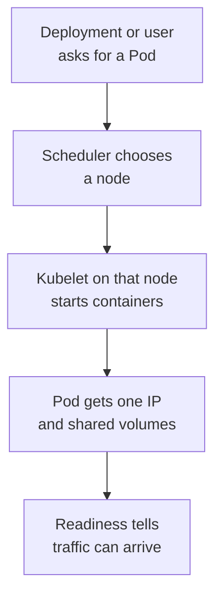

## Table of Contents

1. [The Unit Kubernetes Actually Runs](#the-unit-kubernetes-actually-runs)
2. [A Pod Around the Orders API](#a-pod-around-the-orders-api)
3. [Shared Network and Storage](#shared-network-and-storage)
4. [Lifecycle, Restart Policy, and Readiness](#lifecycle-restart-policy-and-readiness)
5. [Inspecting a Pod Without Guessing](#inspecting-a-pod-without-guessing)
6. [Failure Mode: ImagePullBackOff](#failure-mode-imagepullbackoff)
7. [When to Use a Pod Directly](#when-to-use-a-pod-directly)
8. [The Habit to Practice](#the-habit-to-practice)

## The Unit Kubernetes Actually Runs

Before Kubernetes can help you scale or recover an application, it needs a unit of work to place on a node. That unit is a Pod. A Pod is one or more containers that Kubernetes schedules together, starts together, and treats as one small running environment.

Most application Pods contain one main container. For `devpolaris-orders-api`, that container runs the HTTP API that accepts orders and writes order events. A Pod can also include helper containers when the helper must share the same network identity or local files as the main process. The important beginner idea is that Kubernetes does not schedule an individual container by itself. It schedules a Pod, then the kubelet on the chosen node asks the container runtime to start the containers inside it.

That extra wrapper exists because real applications need more than a process image. They need environment variables, ports, volumes, restart rules, labels, probes, and a place in the cluster network. The Pod is the envelope that carries those details.



The diagram starts with a higher-level object or a direct Pod request because both are possible. In production, a Deployment usually creates Pods for you. Learning a direct Pod first helps you understand the object every controller creates later.

## A Pod Around the Orders API

Here is a small Pod manifest for `devpolaris-orders-api`. The image name is realistic, but the lesson is about the shape of the Pod rather than the registry itself.

```yaml
apiVersion: v1
kind: Pod
metadata:
  name: devpolaris-orders-api
  labels:
    app: devpolaris-orders-api
    tier: api
spec:
  containers:
    - name: api
      image: ghcr.io/devpolaris/orders-api:2026-05-07.1
      ports:
        - containerPort: 8080
      env:
        - name: NODE_ENV
          value: production
        - name: ORDERS_DB_HOST
          value: orders-postgres.default.svc.cluster.local
```

Read the file in layers. `apiVersion` and `kind` tell the Kubernetes API which object type you are sending. `metadata.name` gives this Pod a cluster name. Labels are key-value pairs used by selectors, Services, Deployments, and humans who need to find related objects. The `spec` describes the desired runtime.

The `containers` list is the heart of the Pod. Each entry names a container image and the configuration needed to run it. The `ports` entry does not publish the API to the internet. It documents that the process listens on port `8080` inside the Pod and gives other Kubernetes objects a clear target.

You can apply the file and inspect the object:

```bash
$ kubectl apply -f pod.yaml
pod/devpolaris-orders-api created

$ kubectl get pod devpolaris-orders-api -o wide
NAME                    READY   STATUS    RESTARTS   AGE   IP           NODE
devpolaris-orders-api   1/1     Running   0          42s   10.42.1.18   worker-a
```

The `READY` column says one of one containers is ready. The `STATUS` column describes the broad Pod phase or waiting reason. The `NODE` column tells you where the Pod landed, which matters when the problem is storage, node pressure, image pull credentials, or network access from that node.

## Shared Network and Storage

All containers in one Pod share the same network namespace. A namespace here means an isolated Linux view of networking. Containers in the same Pod see the same Pod IP and can talk to each other through `localhost`.

That design is useful for tightly coupled helpers. Imagine `devpolaris-orders-api` needs a tiny sidecar that exports metrics from a local Unix socket. The API and sidecar can share a volume and communicate inside the Pod without creating a Service. This is similar to two Node.js processes on the same VM sharing `localhost`, except Kubernetes can place and restart them as one unit.

```yaml
spec:
  containers:
    - name: api
      image: ghcr.io/devpolaris/orders-api:2026-05-07.1
      volumeMounts:
        - name: runtime
          mountPath: /var/run/orders
    - name: metrics-sidecar
      image: ghcr.io/devpolaris/orders-metrics:2026-05-07.1
      volumeMounts:
        - name: runtime
          mountPath: /var/run/orders
  volumes:
    - name: runtime
      emptyDir: {}
```

`emptyDir` creates scratch storage for the life of the Pod. If the Pod is deleted and recreated, the data is gone. That is fine for a socket, a temporary cache, or files generated from source data. It is not fine for customer orders, uploaded files, or anything you cannot rebuild.

This shared fate is the tradeoff. A Pod gives containers a convenient shared environment, but it also ties their lifecycle together. If the helper is optional or should scale separately, it probably belongs in a different Pod behind a Service.

## Lifecycle, Restart Policy, and Readiness

A Pod moves through states as Kubernetes tries to make reality match the Pod spec. The scheduler chooses a node, the kubelet pulls images, containers start, probes run, and the Pod eventually becomes ready or reports why it is waiting.

The default restart behavior for normal Pods is `Always`. If the `api` process exits, kubelet restarts the container in the same Pod. That is useful for a long-running API, but it does not solve every problem. If the node dies, Kubernetes treats Pods on that node as failed and a higher-level controller must create replacements.

Readiness probes tell Kubernetes when a container should receive traffic. For `devpolaris-orders-api`, a health endpoint can check that the HTTP server is up and the app has loaded required configuration.

```yaml
readinessProbe:
  httpGet:
    path: /health/ready
    port: 8080
  initialDelaySeconds: 5
  periodSeconds: 10
livenessProbe:
  httpGet:
    path: /health/live
    port: 8080
  initialDelaySeconds: 15
  periodSeconds: 20
```

Readiness and liveness answer different questions. Readiness asks, "Should this Pod receive traffic now?" Liveness asks, "Is this process stuck badly enough that kubelet should restart it?" If the database is down, readiness may fail so traffic stops. Liveness should usually keep passing if the process itself can still serve a basic local check.

## Inspecting a Pod Without Guessing

When a Pod does not behave as expected, start with the API state, then move inward. `kubectl get` shows the summary. `kubectl describe` shows events and probe results. `kubectl logs` shows the container output. `kubectl exec` lets you ask questions from inside the running container.

```bash
$ kubectl describe pod devpolaris-orders-api
Name:             devpolaris-orders-api
Namespace:        default
Node:             worker-a/10.0.3.21
Containers:
  api:
    Image:        ghcr.io/devpolaris/orders-api:2026-05-07.1
    State:        Running
    Ready:        False
Events:
  Type     Reason     Age   From     Message
  ----     ------     ----  ----     -------
  Warning  Unhealthy  12s   kubelet  Readiness probe failed: HTTP probe failed with statuscode: 503
```

This output tells you the image started and the container is running, but readiness failed. That means the next check should be the application log or the readiness endpoint, not the image registry or scheduler.

```bash
$ kubectl logs devpolaris-orders-api -c api --tail=20
2026-05-07T09:14:22Z orders-api listening on :8080
2026-05-07T09:14:24Z readiness failed: ORDERS_DB_HOST resolved, connection refused
```

Now the failure has moved from "Kubernetes is broken" to a specific dependency path. The API process is alive, DNS resolved the database hostname, and the TCP connection was refused. That points you toward the database Service, database Pod, or NetworkPolicy.

## Failure Mode: ImagePullBackOff

The first Pod failure many people see is `ImagePullBackOff`. It means kubelet could not pull the container image and is backing off before retrying. Backoff means Kubernetes waits longer between repeated attempts so it does not hammer the registry.

```bash
$ kubectl get pod devpolaris-orders-api
NAME                    READY   STATUS             RESTARTS   AGE
devpolaris-orders-api   0/1     ImagePullBackOff   0          3m12s
```

The status alone is not enough. Describe the Pod and read the events at the bottom.

```bash
$ kubectl describe pod devpolaris-orders-api
Events:
  Type     Reason     Age    From     Message
  ----     ------     ----   ----     -------
  Normal   Pulling    2m58s  kubelet  Pulling image "ghcr.io/devpolaris/orders-api:2026-05-07.2"
  Warning  Failed     2m57s  kubelet  Failed to pull image: manifest unknown
  Warning  Failed     2m57s  kubelet  Error: ErrImagePull
  Normal   BackOff    90s    kubelet  Back-off pulling image
```

`manifest unknown` usually means the tag does not exist in the registry. Check the tag produced by CI, correct the manifest, and apply it again. If the message says `unauthorized`, inspect `imagePullSecrets` and registry permissions instead.

## When to Use a Pod Directly

Direct Pods are useful for learning, one-off debugging, and rare static situations. They are not a good production shape for a web API. If a directly created Pod is deleted, Kubernetes does not create another one for you. If the node disappears, the Pod is gone and your service has no replacement.

For `devpolaris-orders-api`, a Deployment is the normal controller. The Deployment owns ReplicaSets, and ReplicaSets create replacement Pods until the desired replica count is running. That ownership chain is what turns "start this container" into "keep this service available."

| Use case | Better object | Reason |
|----------|---------------|--------|
| Long-running stateless API | Deployment | Replaces Pods and supports rollouts |
| One-time migration | Job | Expects completion instead of endless running |
| Scheduled cleanup | CronJob | Creates Jobs on a schedule |
| Per-node log collector | DaemonSet | Runs one Pod on each eligible node |
| Stable identity with storage | StatefulSet | Keeps ordered names and volumes |

This table is a map for the rest of the workload module. Pods are the common building block, but controllers are how you express operational intent.

## The Habit to Practice

When you inspect a Pod, keep the layers separate. Kubernetes can tell you whether the Pod was scheduled, whether images were pulled, whether containers started, whether probes passed, and what events happened. Your application logs tell you what the process did after it started.

For `devpolaris-orders-api`, a useful first diagnostic loop is:

```bash
$ kubectl get pod -l app=devpolaris-orders-api
$ kubectl describe pod -l app=devpolaris-orders-api
$ kubectl logs -l app=devpolaris-orders-api --tail=50
```

The first command finds the affected Pods by label. The second command shows Kubernetes-level reasons. The third command reads application output. That order keeps you from chasing code bugs when the image never pulled, and from chasing cluster bugs when the app is returning `503` by design.

There is one more useful layer when the Pod is running but the service still does not work: check from inside the Pod. Start with Pod startup evidence, because a Pod that never starts cannot run your debug command. Once the container is alive, `kubectl exec` lets you test what the application sees.

```bash
$ kubectl exec devpolaris-orders-api -c api -- printenv ORDERS_DB_HOST
orders-postgres.default.svc.cluster.local

$ kubectl exec devpolaris-orders-api -c api -- node -e "require('dns').lookup(process.env.ORDERS_DB_HOST, console.log)"
null 10.43.21.18 4
```

That pair of commands separates configuration from DNS. The first command proves the environment variable is present. The second command proves the name resolves from inside the same network view as the application. If DNS fails inside the Pod but works on your laptop, your laptop result does not matter because your laptop is not in the cluster network.

For HTTP services, you can also ask the Pod to call its own local health endpoint:

```bash
$ kubectl exec devpolaris-orders-api -c api -- wget -qO- http://127.0.0.1:8080/health/ready
{"status":"not_ready","database":"connection refused","queue":"ok"}
```

This output tells you the HTTP server is reachable locally and the readiness failure comes from a dependency. If this command cannot connect at all, inspect the application port, startup command, and logs before looking at Services or Ingress.

Events are another place beginners underuse. They are not full logs. They are Kubernetes' short record of scheduling, pulling, starting, probing, and warning events. Sorting by time makes the story easier to read.

```bash
$ kubectl get events --field-selector involvedObject.name=devpolaris-orders-api --sort-by=.lastTimestamp
LAST SEEN   TYPE      REASON      OBJECT                         MESSAGE
4m          Normal    Scheduled   pod/devpolaris-orders-api       Successfully assigned default/devpolaris-orders-api to worker-a
4m          Normal    Pulling     pod/devpolaris-orders-api       Pulling image "ghcr.io/devpolaris/orders-api:2026-05-07.1"
3m          Normal    Started     pod/devpolaris-orders-api       Started container api
2m          Warning   Unhealthy   pod/devpolaris-orders-api       Readiness probe failed: HTTP probe failed with statuscode: 503
```

The events form a timeline: the scheduler did its job, the image pulled, and the container started. The unresolved problem is readiness. That means the next evidence should come from the application health endpoint and dependency checks.

The same diagnostic shape works for multi-container Pods, but you must name the container. If you omit `-c`, `kubectl logs` may choose the wrong container or ask you to choose one.

```bash
$ kubectl logs devpolaris-orders-api -c metrics-sidecar --tail=10
2026-05-07T09:20:31Z exporting metrics from /var/run/orders/metrics.sock

$ kubectl logs devpolaris-orders-api -c api --tail=10
2026-05-07T09:20:33Z request completed method=GET path=/health/live status=200
```

This distinction matters when the helper fails but the main API is healthy, or when the helper is healthy but the main API cannot write the shared file it expects. The Pod is one scheduling unit, but each container still has its own logs and state.

Before you move on from Pods, practice reading these fields together:

| Evidence | What it answers |
|----------|-----------------|
| `STATUS` | Broad Pod phase or waiting reason |
| `READY` | How many containers passed readiness |
| `Events` | Kubernetes actions and warnings |
| `Logs` | What the process wrote |
| `Last State` | Why a previous container instance ended |
| `Node` | Where the Pod was scheduled |

That table is small, but it is the daily operating map. Most Pod debugging is not a secret command. It is reading the right layer in the right order and letting the evidence narrow the search.

One final beginner trap is confusing Pod readiness with Service reachability. A Pod can be ready and still unreachable from outside the cluster if no Service selects it, if the Service points at the wrong port, or if Ingress is misconfigured. Keep that boundary clear.

```bash
$ kubectl get pod devpolaris-orders-api
NAME                    READY   STATUS    RESTARTS
devpolaris-orders-api   1/1     Running   0

$ kubectl get service devpolaris-orders-api
NAME                    TYPE        CLUSTER-IP     PORT(S)
devpolaris-orders-api   ClusterIP   10.43.90.12    80/TCP
```

The Pod is healthy in its own lifecycle. The Service is a separate routing object. If users cannot reach the API, inspect the Service selector and endpoints next.

```bash
$ kubectl get endpoints devpolaris-orders-api
NAME                    ENDPOINTS
devpolaris-orders-api   10.42.1.18:8080
```

An empty endpoint list means the Service has no ready matching Pods. That can be a label mismatch or readiness failure. This is still Pod knowledge, but now you are using it to debug the next layer up.

---

**References**

- [Kubernetes Pods](https://kubernetes.io/docs/concepts/workloads/pods/) - The official concept page for Pod structure, lifecycle, and behavior.
- [Pod Lifecycle](https://kubernetes.io/docs/concepts/workloads/pods/pod-lifecycle/) - The canonical reference for Pod phases, container states, probes, and restart behavior.
- [Configure Liveness, Readiness and Startup Probes](https://kubernetes.io/docs/tasks/configure-pod-container/configure-liveness-readiness-startup-probes/) - Practical guidance for health checks that affect restarts and traffic.
