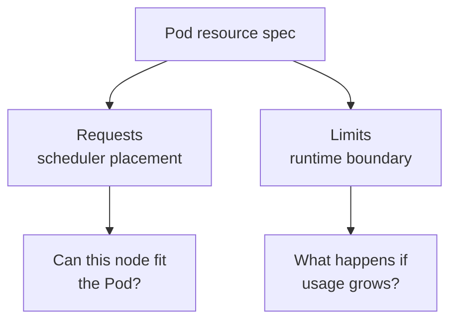

## Table of Contents

1. [Why Kubernetes Needs Resource Signals](#why-kubernetes-needs-resource-signals)
2. [Requests Are Scheduling Promises](#requests-are-scheduling-promises)
3. [Limits Are Runtime Boundaries](#limits-are-runtime-boundaries)
4. [A Practical Orders API Resource Spec](#a-practical-orders-api-resource-spec)
5. [CPU and Memory Behave Differently](#cpu-and-memory-behave-differently)
6. [Failure Mode: Pending from Insufficient CPU](#failure-mode-pending-from-insufficient-cpu)
7. [Failure Mode: OOMKilled](#failure-mode-oomkilled)
8. [Choosing Starting Values](#choosing-starting-values)

## Why Kubernetes Needs Resource Signals

Kubernetes schedules Pods onto nodes. To do that responsibly, it needs to know how much CPU and memory each Pod is expected to need. Without resource requests, the scheduler has little information. It may pack too many Pods onto one node and leave another node underused.

For `devpolaris-orders-api`, resource settings are not decoration. They decide whether three API replicas can fit on the current worker nodes, whether a traffic spike slows the API or kills it, and whether one noisy Pod can starve its neighbors.

There are two different ideas: requests and limits. A request is what Kubernetes reserves for scheduling decisions. A limit is the boundary enforced at runtime. They look similar in YAML, but they answer different questions.



## Requests Are Scheduling Promises

A resource request is the amount of CPU or memory Kubernetes should plan for before placing a Pod on a node. It is a scheduling promise, not a live usage measurement.


*Requests are scheduling promises: the scheduler uses them to decide whether a node has room before the pod starts.*


Example: a `250m` CPU request for each orders API Pod tells Kubernetes to place three replicas only where the cluster can account for three quarters of a CPU core. Kubernetes uses the sum of requests on a node to decide whether another Pod fits.

CPU is measured in cores. `500m` means half a CPU core. Memory is measured in bytes with suffixes such as `Mi` and `Gi`. `512Mi` means 512 mebibytes.

```yaml
resources:
  requests:
    cpu: 250m
    memory: 256Mi
```

These values do not mean the container always uses that much. They mean the scheduler should reserve capacity on paper. If the API usually uses 120Mi but needs 220Mi during startup, a `256Mi` request is a reasonable starting promise.

Requests affect cluster economics too. If every team requests far more than it uses, the cluster looks full while real CPU sits idle. If every team requests too little, Pods fit on paper but compete heavily at runtime.

## Limits Are Runtime Boundaries

A resource limit is the runtime ceiling Kubernetes asks the node to enforce for a container. It exists to stop one container from consuming unlimited CPU or memory on a shared node.

Example: a `512Mi` memory limit lets the orders API use memory up to that boundary, but if a large import pushes the process above it, the node kernel can kill the container and Kubernetes reports `OOMKilled`.

```yaml
resources:
  limits:
    cpu: "1"
    memory: 512Mi
```

For a Node.js API, memory limits deserve special care. The process may need heap memory, native module memory, buffers, TLS overhead, and runtime overhead. If the limit is too close to normal usage, traffic spikes or a large response can kill the process.

The tradeoff is protection versus headroom. Limits protect neighboring workloads from one process using everything. Limits that are too tight create avoidable restarts.

## A Practical Orders API Resource Spec

A resource spec is the part of a Pod template that tells Kubernetes how much CPU and memory to reserve and where to draw runtime boundaries. For `devpolaris-orders-api`, it turns the broad request "run three API replicas" into a schedulable shape: each replica reserves `250m` CPU and `256Mi` memory, then can burst up to the configured limits.

Here is that resource shape inside a Deployment snippet:

```yaml
apiVersion: apps/v1
kind: Deployment
metadata:
  name: devpolaris-orders-api
spec:
  replicas: 3
  template:
    spec:
      containers:
        - name: api
          image: ghcr.io/devpolaris/orders-api:2026-05-07.1
          resources:
            requests:
              cpu: 250m
              memory: 256Mi
            limits:
              cpu: "1"
              memory: 512Mi
```

This says each replica needs a quarter core and 256Mi of memory for scheduling. At runtime, the API can burst up to one core and 512Mi before limits apply.

Check the effective values after apply:

```bash
$ kubectl describe pod -l app=devpolaris-orders-api
Containers:
  api:
    Requests:
      cpu:     250m
      memory:  256Mi
    Limits:
      cpu:     1
      memory:  512Mi
```

If the values are missing in the Pod, your Deployment template did not include them or the running Pods are from an older ReplicaSet.

## CPU and Memory Behave Differently

CPU is compressible, which means a process can often keep running with less CPU by running more slowly. If a container wants more CPU than its limit, it can be throttled and requests may wait longer.


*CPU pressure is usually throttled. Memory above the limit can kill and restart the container.*


Example: the orders API might keep serving requests during a CPU spike, but P95 latency can climb from `180ms` to `920ms` because the process is waiting for CPU time.

Memory is not compressible in the same way. If the process needs memory and crosses its limit, it can be killed. That makes memory limits a common source of sudden restarts.

```bash
$ kubectl top pod -l app=devpolaris-orders-api
NAME                                      CPU(cores)   MEMORY(bytes)
devpolaris-orders-api-7b7d4b5f9c-4p2sx    180m         311Mi
devpolaris-orders-api-7b7d4b5f9c-h9x7b    240m         328Mi
devpolaris-orders-api-7b7d4b5f9c-r6nmd    190m         305Mi
```

This output is a point-in-time measurement, not a capacity plan by itself. Use it with historical metrics. If normal memory is already 328Mi and the limit is 512Mi, the API has some headroom. If normal memory is 490Mi, expect restarts during spikes.

## Failure Mode: Pending from Insufficient CPU

A `Pending` Pod is accepted by the Kubernetes API but not running yet. When resource requests are too high for available nodes, the container never starts because the scheduler cannot find a node with enough unrequested capacity.

```bash
$ kubectl get pod -l app=devpolaris-orders-api
NAME                                      READY   STATUS    RESTARTS
devpolaris-orders-api-66f4f8f8d8-q4vls    0/1     Pending   0
```

Describe the Pod and read scheduler events:

```bash
$ kubectl describe pod devpolaris-orders-api-66f4f8f8d8-q4vls
Events:
  Type     Reason             Message
  ----     ------             -------
  Warning  FailedScheduling   0/4 nodes are available: 4 Insufficient cpu.
```

The scheduler cannot find a node with enough unrequested CPU. The fix might be to lower an unrealistic request, reduce replicas, add nodes, or move other workloads. Do not set requests to zero just to make the Pod schedule. That hides the problem and makes runtime contention worse.

## Failure Mode: OOMKilled

`OOMKilled` means the node killed a container because it crossed its memory boundary. For `devpolaris-orders-api`, that might happen when a bulk import loads too many rows into memory and pushes the process above its `512Mi` limit.

```bash
$ kubectl get pod devpolaris-orders-api-7b7d4b5f9c-h9x7b
NAME                                      READY   STATUS    RESTARTS
devpolaris-orders-api-7b7d4b5f9c-h9x7b    1/1     Running   3

$ kubectl describe pod devpolaris-orders-api-7b7d4b5f9c-h9x7b
Last State:
  Terminated:
    Reason:       OOMKilled
    Exit Code:    137
```

`OOMKilled` means the container exceeded memory available under its limit. The next check should include application memory behavior and Kubernetes configuration.

```bash
$ kubectl logs devpolaris-orders-api-7b7d4b5f9c-h9x7b --previous --tail=20
2026-05-07T12:22:03Z processing bulk order import request id=req-9821 rows=50000
2026-05-07T12:22:18Z memory rss=506Mi heapUsed=421Mi
```

The fix direction depends on the evidence. A one-off bulk import might need streaming instead of loading every row into memory. A normal traffic path might need a higher limit and request. A memory leak needs code investigation. The resource setting tells you where the boundary was, not why the process crossed it.

## Choosing Starting Values

Start from measurement when you can. Run the service under realistic load in staging, observe CPU and memory, then set requests near normal steady usage and limits with enough headroom for expected bursts. For a new service with little data, choose conservative values, watch metrics, and adjust after the first real traffic.

Do not copy values from another service without checking behavior. An API that parses large JSON payloads has different memory needs than a small health-check service. A worker that compresses files has different CPU behavior than a mostly idle admin endpoint.

For `devpolaris-orders-api`, a first review should ask four questions:

| Question | Why it matters |
|----------|----------------|
| Can all replicas fit with current requests? | Prevents Pending Pods |
| Is memory limit above normal and startup usage? | Prevents avoidable OOM kills |
| Is CPU limit causing throttling during peak? | Explains latency spikes |
| Are metrics available after deploy? | Lets the team tune with evidence |

Requests and limits are not a one-time guess. They are part of operating the service as traffic and code change.

For `devpolaris-orders-api`, the first week after launch should include a tuning review. Look at the highest normal memory, startup memory, CPU during peak, and any throttling. If metrics-server is available, `kubectl top` gives a quick view, but historical metrics from Prometheus, Cloud Monitoring, or another observability system are better because they show spikes you did not happen to watch live.

```text
Example review notes:
service: devpolaris-orders-api
replicas: 3
normal memory: 300Mi to 340Mi
startup memory peak: 390Mi
normal CPU: 120m to 260m
peak CPU: 720m during bulk import requests
current request: 250m CPU, 256Mi memory
current limit: 1 CPU, 512Mi memory
```

Those notes suggest the memory request may be too low because normal usage often exceeds `256Mi`. A request below normal usage can make scheduling look cheaper than it really is. The memory limit may still be acceptable if peak usage stays below it with enough margin.

CPU throttling is harder to notice from restarts because throttled containers keep running. You usually see it as latency. If the API has a one-core CPU limit and a traffic burst needs more, requests may queue and response times may climb.

```text
Observed during 12:00 traffic peak:
P95 latency: 180ms -> 920ms
Container restarts: 0
CPU usage: near 1000m
CPU throttling: increased for all replicas
```

That pattern points toward CPU saturation rather than memory death. The fix might be increasing replicas, increasing the CPU limit, moving expensive work to a Job, or changing the endpoint to stream work instead of doing it all in the request path.

Namespace-level policies can also affect resources. Some clusters use LimitRanges to provide defaults or ResourceQuotas to cap total usage in a namespace.

```bash
$ kubectl describe resourcequota -n orders
Name:            orders-quota
Resource         Used    Hard
--------         ----    ----
requests.cpu     1500m   2000m
requests.memory  1536Mi  2Gi
limits.memory    3072Mi  4Gi
```

If a new Deployment cannot create Pods because quota is exceeded, the Pod might not even appear in the shape you expect. Describe the ReplicaSet or Deployment events.

```bash
$ kubectl describe rs devpolaris-orders-api-78df8f8fc9
Events:
  Type     Reason        Message
  ----     ------        -------
  Warning  FailedCreate  pods "devpolaris-orders-api-78df8f8fc9-" is forbidden:
                         exceeded quota: orders-quota, requested: requests.cpu=250m
```

That is a namespace capacity problem. Lowering requests may be correct if they were inflated. Otherwise, add quota, reduce replicas, or move other workloads. The event tells you the API controller tried to create Pods and the API server rejected them because of quota.

A practical starting policy for application teams is:

| Resource | Starting approach |
|----------|-------------------|
| CPU request | Typical steady usage plus some margin |
| CPU limit | Optional or high enough to avoid constant throttling |
| Memory request | Near normal working set |
| Memory limit | Above peak usage with room for startup and bursts |
| Review cadence | After launch, after major traffic or code changes |

Different organizations choose different CPU limit policies. Some avoid CPU limits for latency-sensitive services and rely on requests plus autoscaling. Others require limits for every container. The important part for a junior engineer is to understand the behavior: CPU limit usually slows, memory limit can kill.

Resource settings also affect quality of service, often shortened to QoS. Kubernetes assigns a Pod a QoS class based on requests and limits. You do not need to memorize every detail on day one, but you should know that Pods with clear requests and limits are treated more predictably under node pressure than Pods with no resource information.

```bash
$ kubectl get pod devpolaris-orders-api-7b7d4b5f9c-h9x7b \
  -o jsonpath='{.status.qosClass}{"\n"}'
Burstable
```

`Burstable` is common for application Pods where requests are lower than limits. If a Pod has no requests or limits, it can be `BestEffort`, which is usually the first class you should fix for production services.

Resource reviews should include init containers and sidecars too. A Pod is scheduled based on the whole Pod's resource shape. If `devpolaris-orders-api` adds a sidecar for metrics, that helper needs requests and limits as well.

```yaml
containers:
  - name: api
    resources:
      requests:
        cpu: 250m
        memory: 256Mi
      limits:
        memory: 512Mi
  - name: metrics-sidecar
    resources:
      requests:
        cpu: 50m
        memory: 64Mi
      limits:
        memory: 128Mi
```

Without sidecar resources, the Pod may look cheaper than it really is. During traffic spikes, the helper and API can compete inside the same Pod and on the same node.

The final habit is to change one resource assumption at a time when possible. If you increase replicas, raise memory limits, and change the image in one release, it becomes harder to explain whether latency improved because of more replicas, fewer memory kills, or code changes. Small resource changes with clear metrics teach the team faster.

When you do change resources, leave a short note in the pull request about the evidence. A sentence like "memory limit raised from 512Mi to 768Mi because P99 request imports reached 610Mi in staging" is far more useful than "increase memory."


*Capacity decisions become clearer when you separate scheduling requests from runtime CPU and memory limits.*

---

**References**

- [Resource Management for Pods and Containers](https://kubernetes.io/docs/concepts/configuration/manage-resources-containers/) - The official Kubernetes reference for CPU and memory requests and limits.
- [Assign CPU Resources to Containers and Pods](https://kubernetes.io/docs/tasks/configure-pod-container/assign-cpu-resource/) - Practical task documentation for CPU requests and limits.
- [Assign Memory Resources to Containers and Pods](https://kubernetes.io/docs/tasks/configure-pod-container/assign-memory-resource/) - Practical task documentation for memory requests, limits, and OOM behavior.
