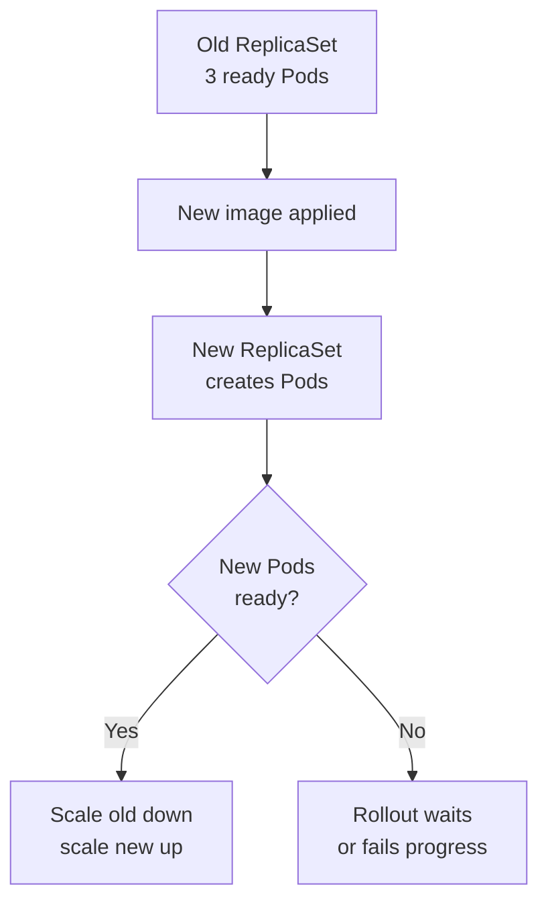

## Table of Contents

1. [Changing Pods Without Dropping Traffic](#changing-pods-without-dropping-traffic)
2. [The RollingUpdate Strategy](#the-rollingupdate-strategy)
3. [Starting and Watching a Rollout](#starting-and-watching-a-rollout)
4. [Reading ReplicaSets During a Release](#reading-replicasets-during-a-release)
5. [Failure Mode: Rollout Stuck on Readiness](#failure-mode-rollout-stuck-on-readiness)
6. [Rolling Back a Bad Revision](#rolling-back-a-bad-revision)
7. [Pause, Resume, and Safer Changes](#pause-resume-and-safer-changes)
8. [What Kubernetes Rollback Does Not Prove](#what-kubernetes-rollback-does-not-prove)

## Changing Pods Without Dropping Traffic

An update to `devpolaris-orders-api` usually means the team has built a new container image and wants production Pods to use it. Kubernetes cannot change the image inside a running container. It creates new Pods from a new template and removes old Pods when enough new Pods are ready.

That process is called a rollout. A rollback tells Kubernetes to return a Deployment to an earlier Pod template revision. Both operations depend on readiness probes because Kubernetes needs a signal that a new Pod can receive traffic.

The goal is to keep enough healthy replicas available while moving from old code to new code.



## The RollingUpdate Strategy

Deployments use `RollingUpdate` by default. Two fields control the pace: `maxUnavailable` and `maxSurge`.

```yaml
spec:
  strategy:
    type: RollingUpdate
    rollingUpdate:
      maxUnavailable: 1
      maxSurge: 1
```

`maxUnavailable: 1` allows one fewer ready Pod than desired during the rollout. `maxSurge: 1` allows one extra Pod above desired during the rollout. For a three-replica API, Kubernetes may temporarily run four Pods while it brings a new one up before removing an old one.

These values are a tradeoff. More surge can make rollouts faster, but it needs spare cluster capacity. Less unavailability protects service capacity, but a rollout may wait longer if new Pods cannot fit or cannot become ready.

## Starting and Watching a Rollout

In a GitOps workflow, you usually change the image in a file and let automation apply it. For learning, `kubectl set image` makes the moving parts visible.

```bash
$ kubectl set image deployment/devpolaris-orders-api \
  api=ghcr.io/devpolaris/orders-api:2026-05-07.2
deployment.apps/devpolaris-orders-api image updated

$ kubectl rollout status deployment/devpolaris-orders-api
Waiting for deployment "devpolaris-orders-api" rollout to finish: 1 old replicas are pending termination...
deployment "devpolaris-orders-api" successfully rolled out
```

The status command watches the Deployment controller's view. It does not call your public API. It tells you Kubernetes completed the replacement according to the Deployment's rules.

Check the final image after rollout:

```bash
$ kubectl get deployment devpolaris-orders-api \
  -o jsonpath='{.spec.template.spec.containers[0].image}{"\n"}'
ghcr.io/devpolaris/orders-api:2026-05-07.2
```

That proves the desired Pod template changed. You still need application-level verification for user behavior.

## Reading ReplicaSets During a Release

ReplicaSets are useful during rollouts because they show old and new template revisions at the same time.

```bash
$ kubectl get rs -l app=devpolaris-orders-api
NAME                                DESIRED   CURRENT   READY   AGE
devpolaris-orders-api-6c98b8f6d7    0         0         0       2d
devpolaris-orders-api-7b7d4b5f9c    3         3         3       4m
```

The old ReplicaSet remains with zero desired replicas so Kubernetes can roll back to its template if history is retained. The new ReplicaSet owns the running Pods.

Rollout history makes that relationship easier to read:

```bash
$ kubectl rollout history deployment/devpolaris-orders-api
deployment.apps/devpolaris-orders-api
REVISION  CHANGE-CAUSE
1         <none>
2         <none>
```

Many teams record change cause through annotations or through their deployment system instead of relying only on this table. The important part is that you can identify which template revision is running.

## Failure Mode: Rollout Stuck on Readiness

Suppose the new image starts but never becomes ready. The rollout waits because removing more old Pods would reduce available capacity too far.

```bash
$ kubectl rollout status deployment/devpolaris-orders-api --timeout=60s
Waiting for deployment "devpolaris-orders-api" rollout to finish: 1 out of 3 new replicas have been updated...
error: timed out waiting for the condition
```

Now inspect the Deployment, then the new Pods:

```bash
$ kubectl get deploy devpolaris-orders-api
NAME                    READY   UP-TO-DATE   AVAILABLE
devpolaris-orders-api   2/3     1            2

$ kubectl get pods -l app=devpolaris-orders-api
NAME                                      READY   STATUS    RESTARTS
devpolaris-orders-api-6c98b8f6d7-v2q5m    1/1     Running   0
devpolaris-orders-api-6c98b8f6d7-zk6nd    1/1     Running   0
devpolaris-orders-api-7b7d4b5f9c-dx8mt    0/1     Running   0
```

The new Pod is running but not ready. Describe it and read logs:

```bash
$ kubectl describe pod devpolaris-orders-api-7b7d4b5f9c-dx8mt
Events:
  Type     Reason     Message
  ----     ------     -------
  Warning  Unhealthy  Readiness probe failed: HTTP probe failed with statuscode: 500

$ kubectl logs devpolaris-orders-api-7b7d4b5f9c-dx8mt --tail=20
2026-05-07T11:03:41Z startup complete
2026-05-07T11:03:43Z readiness failed: missing env ORDERS_EVENT_TOPIC
```

The fix direction is specific. The new image expects `ORDERS_EVENT_TOPIC`, but the Deployment template or ConfigMap does not provide it. You can add the missing environment value and continue the rollout, or roll back if production should return to the previous version immediately.

## Rolling Back a Bad Revision

A rollback changes the Deployment's Pod template back to a previous revision. For a bad image or missing environment variable, this can restore the old known-good Pods quickly.

```bash
$ kubectl rollout undo deployment/devpolaris-orders-api
deployment.apps/devpolaris-orders-api rolled back

$ kubectl rollout status deployment/devpolaris-orders-api
deployment "devpolaris-orders-api" successfully rolled out
```

After a rollback, verify the image:

```bash
$ kubectl get deployment devpolaris-orders-api \
  -o jsonpath='{.spec.template.spec.containers[0].image}{"\n"}'
ghcr.io/devpolaris/orders-api:2026-05-07.1
```

Rollback is a production safety tool, but it is not a substitute for fixing the release. Open a follow-up change that adds the missing environment variable or corrects the image, then roll forward deliberately.

## Pause, Resume, and Safer Changes

Deployments can be paused. While paused, you can make several template changes without starting multiple rollout revisions. This is useful when a release needs an image change plus an environment variable change and you want them to roll out together.

```bash
$ kubectl rollout pause deployment/devpolaris-orders-api
deployment.apps/devpolaris-orders-api paused

$ kubectl set image deployment/devpolaris-orders-api api=ghcr.io/devpolaris/orders-api:2026-05-07.3
$ kubectl set env deployment/devpolaris-orders-api ORDERS_EVENT_TOPIC=orders.events.v2

$ kubectl rollout resume deployment/devpolaris-orders-api
deployment.apps/devpolaris-orders-api resumed
```

This is helpful for emergency command-line work. In a steady team workflow, prefer one reviewed manifest change that contains both updates. The operational idea is the same: avoid creating half-updated revisions.

## What Kubernetes Rollback Does Not Prove

Kubernetes can tell you whether Pods became ready. It cannot prove that checkout totals are correct, that a new API field is backward compatible, or that a downstream payment provider accepted the new request shape.

For `devpolaris-orders-api`, a rollout check should be followed by a small application check:

```bash
$ curl -fsS https://orders.devpolaris.example/health/ready
{"status":"ready","database":"ok","events":"ok"}
```

That endpoint is still only a health check. For risky releases, teams add smoke tests, metrics checks, and error-rate alerts. Kubernetes controls the replacement of Pods. Your release process still needs evidence that the application behaves correctly.

You can make that evidence more concrete with a short post-rollout check. For the orders API, a smoke test might create a test order in a staging namespace, read it back, and confirm the event writer is connected. In production, the same idea should use a safe synthetic request or a read-only check that cannot create customer-visible data by accident.

```bash
$ curl -fsS https://orders.devpolaris.example/internal/version
{"service":"orders-api","version":"2026-05-07.2","gitSha":"a8f14c9"}

$ curl -fsS https://orders.devpolaris.example/internal/dependencies
{"database":"ok","eventTopic":"orders.events.v2","payments":"ok"}
```

Those responses connect the Kubernetes rollout to application reality. The Deployment says the new image is running. The internal endpoint says the new process can see the dependencies the release needs.

Rollbacks also have data limits. If version `2026-05-07.2` writes a new database column and version `2026-05-07.1` ignores it, rollback is usually fine. If the new version rewrites data into a shape the old version cannot read, rollback may restore Pods while leaving the application broken.

```text
Rollback risk review:
1. Did the release change only code?
2. Did it add backward-compatible config?
3. Did it change database schema?
4. Did it write new data formats?
5. Did it change messages sent to other services?
```

The Deployment controller cannot answer those questions. The release owner has to answer them before deciding whether rollback is safe or whether a forward fix is safer.

Progress deadlines are another part of rollout design. A Deployment can declare how long Kubernetes should wait before marking progress as failed.

```yaml
spec:
  progressDeadlineSeconds: 300
```

This does not stop the rollout by itself. It changes the Deployment condition so automation and humans can see that progress failed. Pair it with alerting or deployment tooling that notices the condition.

```bash
$ kubectl get deployment devpolaris-orders-api -o jsonpath='{.status.conditions[?(@.type=="Progressing")].reason}{"\n"}'
ProgressDeadlineExceeded
```

When you see that reason, collect evidence before acting: Deployment conditions, ReplicaSet counts, Pod events, and logs from the newest Pods. That evidence tells you whether to fix config, add capacity, roll back, or pause.

For review, keep rollout settings close to service behavior:

| Setting or signal | Question it answers |
|-------------------|---------------------|
| `maxUnavailable` | How much capacity can disappear during update? |
| `maxSurge` | How much spare capacity can the cluster use? |
| Readiness probe | When can a new Pod receive traffic? |
| Progress deadline | When should humans or automation intervene? |
| Rollout history | Which template can we return to? |
| Smoke test | Does the application behavior still work? |

This is the difference between "Kubernetes replaced the Pods" and "the release is healthy." Both matter, and they are not the same check.

A final rollout skill is knowing when to stop adding change. If a rollout is already unhealthy, do not stack unrelated edits onto the same Deployment unless they are part of the fix. More changes make it harder to know which line changed behavior.

For `devpolaris-orders-api`, a clean fix might add the missing environment variable and keep the same image:

```bash
$ kubectl set env deployment/devpolaris-orders-api ORDERS_EVENT_TOPIC=orders.events.v2
deployment.apps/devpolaris-orders-api env updated

$ kubectl rollout status deployment/devpolaris-orders-api
deployment "devpolaris-orders-api" successfully rolled out
```

If the image itself is bad, a clean rollback might only undo the image revision. Both paths are valid. The decision comes from evidence: Pod events, logs, and application behavior.

Keep a small release note even for command-line emergency fixes:

```text
Release note:
service: devpolaris-orders-api
time: 2026-05-07T11:18Z
action: rollback deployment to image 2026-05-07.1
reason: 2026-05-07.2 readiness failed because ORDERS_EVENT_TOPIC was missing
follow-up: add env var in Git and redeploy 2026-05-07.3
```

That note is not ceremony. It prevents the next engineer from rediscovering the same failure from scattered terminal history and chat messages. It also makes the follow-up clear: roll forward with the corrected manifest.

Rollout work also needs a clear owner while the release is moving. If two people both run `kubectl set image` or `kubectl rollout undo`, the Deployment history can become confusing. Agree who is driving the release, who is watching metrics, and what signal will trigger rollback or a forward fix.

For the orders API, a simple release watch might look like this:

```text
Release watch:
driver: platform-oncall
observer: orders-api owner
rollback trigger: readiness failure for 5 minutes or error rate above 2 percent
forward-fix trigger: missing config with clear one-line patch
success signal: rollout complete, dependency endpoint ok, P95 latency normal
```

Those thresholds should match the service, but writing them down before the rollout reduces hesitation. Kubernetes gives you the mechanism. The team still needs the decision rule.

---

**References**

- [Kubernetes Deployments](https://kubernetes.io/docs/concepts/workloads/controllers/deployment/) - Official reference for rollout, rollback, pause, and revision behavior.
- [Rolling Update a Deployment](https://kubernetes.io/docs/tutorials/kubernetes-basics/update/update-intro/) - Kubernetes tutorial material for updating an application through Deployment rollouts.
- [kubectl rollout](https://kubernetes.io/docs/reference/kubectl/generated/kubectl_rollout/) - The official command reference for rollout status, history, undo, pause, and resume.
