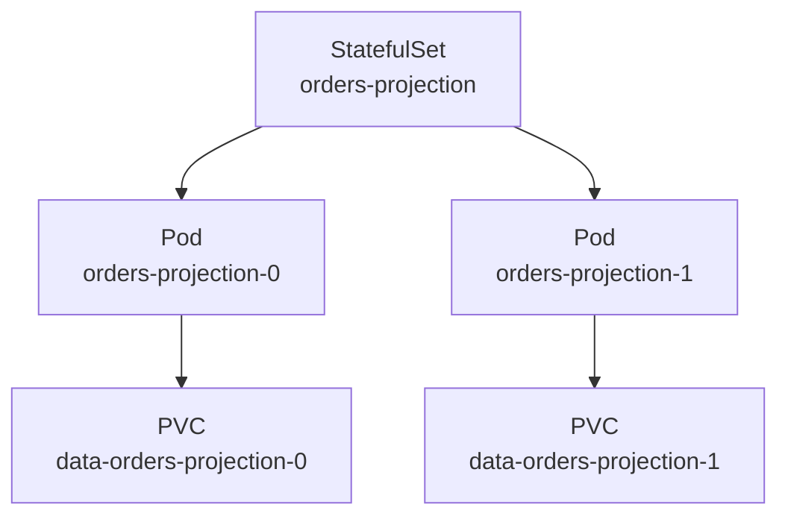

## Table of Contents

1. [When Replicas Are Not Interchangeable](#when-replicas-are-not-interchangeable)
2. [Stable Names and Stable Volumes](#stable-names-and-stable-volumes)
3. [A Stateful Worker for Order Projections](#a-stateful-worker-for-order-projections)
4. [Headless Services and Pod DNS](#headless-services-and-pod-dns)
5. [Ordered Startup and Updates](#ordered-startup-and-updates)
6. [Failure Mode: Pending Volume Claims](#failure-mode-pending-volume-claims)
7. [Data Safety Tradeoffs](#data-safety-tradeoffs)
8. [When Not to Use a StatefulSet](#when-not-to-use-a-statefulset)

## When Replicas Are Not Interchangeable

A Deployment works best when any Pod can replace any other Pod. That is true for `devpolaris-orders-api` itself. One API replica can serve the same request as another because the database holds durable order data.

Some workloads need more identity than that. A database member, a message broker node, or a search index shard may need a stable network name and a specific persistent volume. If `orders-projection-0` owns one shard of a local projection cache, replacing it with a random Pod name can confuse peers and operators.

A StatefulSet is the Kubernetes workload object for that kind of application. It manages Pods from the same template, but each Pod gets an ordered identity: `name-0`, `name-1`, `name-2`. That identity sticks across rescheduling.

## Stable Names and Stable Volumes

StatefulSets give you two stable things: ordinal names and persistent volume claims. An ordinal is the number at the end of the Pod name, and a persistent volume claim is a request for durable storage that can outlive an individual Pod.

Example: `orders-projection-0` can keep using `data-orders-projection-0` after its Pod is recreated, so the worker returns to the same local projection files instead of starting with an empty disk. Kubernetes creates `orders-projection-0` before `orders-projection-1` by default.

Persistent storage is requested through `volumeClaimTemplates`. Each Pod gets its own claim based on the template. If `orders-projection-0` is recreated, Kubernetes reuses the claim for `orders-projection-0` instead of giving it a brand new empty disk.



The matching between Pod identity and volume identity is the main reason to use a StatefulSet. If you only need more replicas of an API, a Deployment is simpler and safer.

## A Stateful Worker for Order Projections

A stateful worker is a background process where a particular replica owns local files or identity that should follow it across restarts. Suppose the orders team runs a projection worker that consumes order events and maintains a local read model cache. PostgreSQL still stores the authoritative order records, but each worker keeps local disk state so it can resume quickly after restart.

```yaml
apiVersion: apps/v1
kind: StatefulSet
metadata:
  name: orders-projection
spec:
  serviceName: orders-projection
  replicas: 2
  selector:
    matchLabels:
      app: orders-projection
  template:
    metadata:
      labels:
        app: orders-projection
    spec:
      containers:
        - name: worker
          image: ghcr.io/devpolaris/orders-projection:2026-05-07.1
          volumeMounts:
            - name: data
              mountPath: /var/lib/orders-projection
  volumeClaimTemplates:
    - metadata:
        name: data
      spec:
        accessModes: ["ReadWriteOnce"]
        resources:
          requests:
            storage: 10Gi
```

The `serviceName` points to a headless Service, which gives stable DNS names for the Pods. The `volumeClaimTemplates` section asks Kubernetes to create one claim per Pod. The `ReadWriteOnce` access mode means the volume can be mounted for writing by one node at a time, which is common for block storage.

Inspect the result:

```bash
$ kubectl get pod,pvc -l app=orders-projection
NAME                      READY   STATUS    RESTARTS   AGE
pod/orders-projection-0   1/1     Running   0          2m
pod/orders-projection-1   1/1     Running   0          95s

NAME                                             STATUS   VOLUME
persistentvolumeclaim/data-orders-projection-0   Bound    pvc-59a1
persistentvolumeclaim/data-orders-projection-1   Bound    pvc-7f22
```

The names are predictable. The volume claims are separate. That is the operating shape StatefulSets provide.

## Headless Services and Pod DNS

A headless Service is a Service without a cluster virtual IP. In Kubernetes YAML, `clusterIP: None` tells DNS to return records for the individual Pods instead of routing every caller through one stable Service address.

Example: a peer process can dial `orders-projection-0.orders-projection.default.svc.cluster.local` when it needs that exact member, rather than any healthy member behind a normal Service.

```yaml
apiVersion: v1
kind: Service
metadata:
  name: orders-projection
spec:
  clusterIP: None
  selector:
    app: orders-projection
  ports:
    - name: worker
      port: 8080
```

With that Service, a Pod can be reached by a predictable DNS name such as:

```text
orders-projection-0.orders-projection.default.svc.cluster.local
orders-projection-1.orders-projection.default.svc.cluster.local
```

This matters for systems that form a cluster or keep peer lists. A Deployment Pod name changes whenever a Pod is replaced. A StatefulSet Pod name is part of the contract.

## Ordered Startup and Updates

Ordered startup means Kubernetes handles StatefulSet Pods by their ordinal numbers instead of treating every replica as interchangeable. This exists for systems where one member must be ready before the next member safely joins.

Example: Kubernetes creates `orders-projection-0`, waits for it to become ready, then creates `orders-projection-1`. During updates, it works through the set in reverse ordinal order.

That order is slower than a Deployment rollout, but it protects applications that need a leader, seed member, or primary before followers join. The cost is rollout speed. If your workload does not need ordering, you may be using the wrong controller.

```bash
$ kubectl rollout status statefulset/orders-projection
Waiting for 1 pods to be ready...
partitioned roll out complete: 2 new pods have been updated
```

When an update pauses, inspect the lowest or current unready ordinal. Later Pods may simply be waiting for that one.

## Failure Mode: Pending Volume Claims

A pending volume claim means Kubernetes has not attached the durable storage the Pod identity needs. For a StatefulSet, that blocks the Pod before the application container can start because the Pod is supposed to come back with its own disk.

Example: `orders-projection-0` may stay `Pending` if the claim `data-orders-projection-0` asks for a StorageClass named `fast-ssd` that does not exist in the cluster. Start with Pods and PVCs together.

```bash
$ kubectl get pod,pvc -l app=orders-projection
NAME                      READY   STATUS    RESTARTS   AGE
pod/orders-projection-0   0/1     Pending   0          4m

NAME                                             STATUS    VOLUME
persistentvolumeclaim/data-orders-projection-0   Pending
```

Describe the claim before editing the StatefulSet:

```bash
$ kubectl describe pvc data-orders-projection-0
Events:
  Type     Reason              Message
  ----     ------              -------
  Warning  ProvisioningFailed  storageclass.storage.k8s.io "fast-ssd" not found
```

The Pod is not pending because the image is bad or the application crashed. It is waiting for storage. The fix is to correct the `storageClassName`, create the required StorageClass, or choose storage that exists in the cluster.

## Data Safety Tradeoffs

Persistent volume claims are deliberately more durable than StatefulSet Pods. StatefulSets intentionally do not delete claims when you scale down or delete the StatefulSet because removing a controller should not automatically erase disks that may contain production state.

Example: scaling from two projection workers to one removes `orders-projection-1`, but its claim can remain so the team can recover data, inspect it, or reuse it when scaling back up.

The tradeoff is cleanup work. After a test StatefulSet, you may need to delete PVCs manually. In production, that manual step is good friction because deleting data should be deliberate.

| Action | Pod result | Volume claim result |
|--------|------------|---------------------|
| Scale from 2 to 1 | `orders-projection-1` removed | Claim remains |
| Delete StatefulSet | Pods removed | Claims remain |
| Recreate same StatefulSet | Pods return | Matching claims reused |

For data systems, this behavior is usually what you want. For stateless APIs, it is unnecessary complexity.

## When Not to Use a StatefulSet

Do not use a StatefulSet just because an application talks to a database. `devpolaris-orders-api` stores state in PostgreSQL, but the API Pods themselves are replaceable. A Deployment is the better fit.

Use a StatefulSet when the Pod itself needs identity or attached storage that follows that identity. If the only state is in an external managed database, object store, or message broker, keep the application Deployment simple and put durability in the backing service.

A useful review question is, "What would break if Pod names changed?" If the answer is "nothing, the Service routes traffic and the database has the data," use a Deployment. If the answer is "peer 0 must keep its disk and other members know it by name," a StatefulSet may be right.

StatefulSet debugging often starts with ownership and identity. This command shows the predictable names and the node each Pod uses:

```bash
$ kubectl get pod -l app=orders-projection -o wide
NAME                  READY   STATUS    IP           NODE
orders-projection-0   1/1     Running   10.42.1.31   worker-a
orders-projection-1   1/1     Running   10.42.2.44   worker-b
```

If `orders-projection-0` moves to another node later, the Pod name stays the same. Its attached claim should stay the same too:

```bash
$ kubectl get pvc data-orders-projection-0
NAME                       STATUS   VOLUME     CAPACITY   ACCESS MODES
data-orders-projection-0   Bound    pvc-59a1   10Gi       RWO
```

That stable link is the value. It also means recovery can be slower than a stateless Pod replacement because Kubernetes may need to detach a volume from one node and attach it to another.

When a StatefulSet is stuck during update, inspect the ordinal that blocks progress. With the default ordered policy, one unhealthy lower ordinal can stop later Pods from updating.

```bash
$ kubectl get pods -l app=orders-projection
NAME                  READY   STATUS             RESTARTS
orders-projection-0   0/1     CrashLoopBackOff   5
orders-projection-1   1/1     Running            0
```

Read the logs for the failing ordinal:

```bash
$ kubectl logs orders-projection-0 --tail=20
2026-05-07T13:04:22Z opening data directory /var/lib/orders-projection
2026-05-07T13:04:22Z fatal: projection index version 3 is newer than binary supports version 2
```

That is an application and data compatibility problem. Rolling the Pod back to an older image may be safer than forcing the new image through every ordinal. If the new binary migrated local data forward, rollback may also need an application-specific recovery plan.

StatefulSets make storage cleanup visible. After deleting a test StatefulSet, list claims before assuming the environment is clean:

```bash
$ kubectl delete statefulset orders-projection
statefulset.apps "orders-projection" deleted

$ kubectl get pvc -l app=orders-projection
NAME                       STATUS   VOLUME
data-orders-projection-0   Bound    pvc-59a1
data-orders-projection-1   Bound    pvc-7f22
```

The claims remain. In production, that protects data. In a temporary namespace, it can leave storage costs behind. The cleanup decision should be explicit:

```bash
$ kubectl delete pvc data-orders-projection-0 data-orders-projection-1
persistentvolumeclaim "data-orders-projection-0" deleted
persistentvolumeclaim "data-orders-projection-1" deleted
```

Do not put that command in a general runbook without warnings. Deleting PVCs can delete data depending on the reclaim policy and storage class.

For review, map the need to the StatefulSet feature:

| Need | StatefulSet feature |
|------|---------------------|
| Stable DNS name per member | Ordered Pod identity |
| Stable disk per member | `volumeClaimTemplates` |
| Controlled startup | Ordered creation |
| Controlled update | Ordered rolling update |
| Ordinary API scaling | Use Deployment instead |

This keeps StatefulSets from becoming the default answer for anything that touches data. They are valuable precisely because they solve a narrower problem.

When you need to connect from one StatefulSet Pod to another, test DNS from inside the cluster. Your laptop may not resolve cluster names, and that is expected.

```bash
$ kubectl exec orders-projection-0 -- getent hosts orders-projection-1.orders-projection.default.svc.cluster.local
10.42.2.44  orders-projection-1.orders-projection.default.svc.cluster.local
```

If this fails, inspect the headless Service before changing the StatefulSet. The Service selector must match the Pod labels, and `clusterIP` must be `None`.

```bash
$ kubectl get service orders-projection -o yaml
spec:
  clusterIP: None
  selector:
    app: orders-projection
```

Stateful workloads also need backup and restore thinking outside the StatefulSet object. A persistent volume keeps data attached to a Pod identity, but it is not automatically a backup. If the volume is corrupted or accidentally deleted, stable identity does not save the data.

For the `orders-projection` example, local projection data can be rebuilt from the event stream, so the restore plan may be "delete the bad volume and replay events." For a primary database, the restore plan should involve snapshots, tested restores, and application downtime decisions.

```text
Stateful review questions:
1. Which data is authoritative?
2. Can this volume be rebuilt from another source?
3. What happens if one ordinal is lost?
4. What happens if all ordinals are lost?
5. Has the team tested restore as well as backup creation?
```

These questions keep StatefulSet work grounded in data recovery. Kubernetes can keep identities stable, but your system design still owns the meaning and safety of the data.

That is why many teams treat StatefulSet changes as application and data changes together. The manifest, storage class, backup plan, and rollback plan all belong in the same review conversation.

The controller is only one part of the stateful system.

---

**References**

- [Kubernetes StatefulSets](https://kubernetes.io/docs/concepts/workloads/controllers/statefulset/) - The official concept page for stable identity, ordered deployment, and persistent storage.
- [StatefulSet Basics](https://kubernetes.io/docs/tutorials/stateful-application/basic-stateful-set/) - A guided tutorial showing StatefulSet DNS and ordered behavior.
- [Persistent Volumes](https://kubernetes.io/docs/concepts/storage/persistent-volumes/) - The official storage reference for PersistentVolumes and PersistentVolumeClaims.
