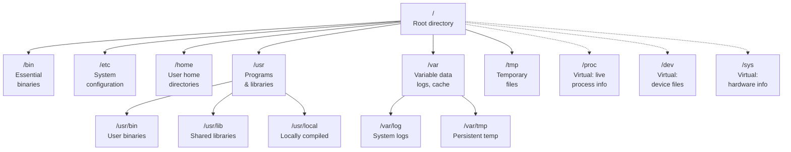

## Table of Contents

1. [What Is a Filesystem?](#what-is-a-filesystem)
2. [Basic Navigation: cd, ls, and pwd](#basic-navigation-cd-ls-and-pwd)
3. [The Filesystem Hierarchy Standard](#the-filesystem-hierarchy-standard)
4. [Virtual Filesystems and "Everything Is a File"](#virtual-filesystems-and-everything-is-a-file)
5. [Finding Files: find, locate, and tree](#finding-files-find-locate-and-tree)
6. [Disk Space: df, du, and Inode Exhaustion](#disk-space-df-du-and-inode-exhaustion)
7. [Mount Points and /etc/fstab](#mount-points-and-etcfstab)

## What Is a Filesystem?

If you are coming from Windows or macOS, you are used to seeing drives with letters like `C:\` or volume icons on a desktop. Linux works differently. There is exactly one tree, and it starts at a single root called `/`. Every file, every directory, every device, and every running process lives somewhere inside this tree. There are no drive letters, no separate volumes floating around. Just one tree with `/` at the top.

A directory is simply a container that holds files and other directories. You can think of it like a folder, but the Linux world prefers the word "directory" because the underlying implementation is literally a list of names mapped to locations on disk. The root directory `/` is special because it is the starting point of the entire tree. Everything branches downward from there.

When you first open a terminal on a Linux machine, you land in your home directory, which is typically `/home/yourname`. This is your personal workspace where your files and configuration live. From here, you can move around the entire tree using a handful of simple commands.

## Basic Navigation: cd, ls, and pwd

Three commands form the foundation of moving around in Linux. The first is `pwd`, which stands for "print working directory." It tells you exactly where you are right now.

```bash
$ pwd
/home/yourname
```

This confirms your current location in the tree. It sounds trivial, but when you are deep inside nested directories or switching between multiple terminal sessions, `pwd` is a quick sanity check.

The second command is `ls`, which lists the contents of the current directory. Run it with no arguments and you see the files and subdirectories in your current location.

```bash
$ ls
Desktop  Documents  Downloads  Music  Pictures  projects
```

On its own, `ls` hides a lot of useful information. Adding flags changes that. The combination `ls -lah` is one you will use constantly: `-l` gives a long format with permissions, ownership, size, and modification date; `-a` shows hidden files (any file whose name starts with a dot); and `-h` makes file sizes human-readable, so you see "4.2K" instead of "4296."

```bash
$ ls -lah
total 44K
drwxr-xr-x  8 yourname yourname 4.0K Jan 15 09:32 .
drwxr-xr-x  4 root     root     4.0K Dec  3 11:20 ..
-rw-------  1 yourname yourname 1.8K Jan 15 09:30 .bash_history
-rw-r--r--  1 yourname yourname  220 Dec  3 11:20 .bash_logout
-rw-r--r--  1 yourname yourname 3.7K Dec  3 11:20 .bashrc
drwx------  2 yourname yourname 4.0K Jan  5 14:22 .ssh
drwxr-xr-x  2 yourname yourname 4.0K Jan 12 16:45 Desktop
drwxr-xr-x  3 yourname yourname 4.0K Jan 14 10:11 Documents
drwxr-xr-x  2 yourname yourname 4.0K Jan 10 08:30 Downloads
drwxr-xr-x  5 yourname yourname 4.0K Jan 15 09:32 projects
```

Hidden files matter because Linux stores most user-level configuration in dotfiles like `.bashrc`, `.ssh/`, and `.gitconfig`. Without the `-a` flag, you will never see them.

The third command is `cd`, which changes your current directory. Give it a path and you move there.

```bash
$ cd /etc
$ pwd
/etc
$ ls
apt       default   hostname  init.d    nginx       resolv.conf  ssh
cron.d    fstab     hosts     network   os-release  sysctl.d     systemd
```

That sequence moves you to the `/etc` directory, confirms the move, and lists its contents. Paths can be absolute (starting from `/`, like `/var/log`) or relative (starting from where you are, like `../` to go up one level). The shortcut `cd ~` takes you back to your home directory, and `cd -` takes you to whatever directory you were in previously, which is handy for bouncing between two locations.

## The Filesystem Hierarchy Standard

Linux distributions follow a specification called the Filesystem Hierarchy Standard (FHS) that defines what goes where. This is why you can sit down at an Ubuntu server, a RHEL box, or a Debian machine and find things in the same places. Learning the FHS once means you never have to guess where configuration, logs, or binaries live.

The `/etc` directory holds system-wide configuration files. When you install Nginx, its config lands in `/etc/nginx/`. When you configure DNS resolution, you edit `/etc/resolv.conf`. If you need to set up scheduled tasks, you look at `/etc/cron.d/`. The name "etc" historically stood for "et cetera," but today it is best understood as "editable text configuration."

The `/var` directory stores variable data, meaning files that change frequently during normal system operation. The most important subdirectory here is `/var/log`, where system and application logs accumulate over time. If a service is misbehaving, `/var/log` is one of the first places you check. The `/var/tmp` directory stores temporary files that should survive a reboot, unlike `/tmp` which may be cleared on restart.

The `/home` directory contains personal directories for each user on the system. Your home directory is where your shell configuration, SSH keys, and personal projects live. The root user is an exception: its home directory is `/root`, not `/home/root`.

The `/usr` directory holds user programs and supporting files. Most of the binaries you run daily live in `/usr/bin`. Shared libraries live in `/usr/lib`. If you compile and install software manually (rather than through a package manager), it conventionally goes into `/usr/local` to keep it separate from system-managed packages.

The `/bin` directory contains essential binaries needed for basic system operation, things like `ls`, `cp`, `mv`, and `cat`. On many modern distributions, `/bin` is actually a symlink to `/usr/bin`, merging them together for simplicity. A symlink (symbolic link) is like a shortcut on Windows or an alias on macOS: a small special file whose entire job is to point at another path. If you run `ls -l /bin` you will see something like `lrwxrwxrwx 1 root root 7 Jan 1 2024 /bin -> usr/bin`, where the arrow shows the target. The same applies to `/sbin` (system administration binaries) and `/lib` (shared libraries).

The `/tmp` directory is scratch space for temporary files. On most modern distributions, `/tmp` is backed by tmpfs, a filesystem that lives entirely in RAM rather than on disk. Think of it like using a JavaScript object as a cache instead of writing to a database: it is fast but evaporates when the process (here, the whole machine) restarts. Programs use `/tmp` for short-lived files they do not need to keep.



The solid lines in the diagram above represent real directories backed by storage on disk. The dotted lines represent virtual filesystems, which look like ordinary directories but are generated on the fly by the kernel. These are some of the most interesting parts of the Linux filesystem.

Here is a quick reference for the most important directories:

| Directory | Purpose | Example Contents |
|-----------|---------|------------------|
| `/etc` | System-wide configuration files | `nginx/nginx.conf`, `resolv.conf`, `fstab` |
| `/var` | Variable data that changes during operation | `/var/log` (logs), `/var/tmp` (persistent temp) |
| `/home` | Personal directories for each user | `~/.bashrc`, `~/.ssh/`, personal projects |
| `/root` | Home directory for the root user | Root's shell config and personal files |
| `/usr` | User programs and supporting files | `/usr/bin` (binaries), `/usr/lib` (libraries) |
| `/usr/local` | Locally compiled/installed software | Manually built packages kept separate from system-managed ones |
| `/bin` | Essential system binaries (often symlinked to `/usr/bin`) | `ls`, `cp`, `mv`, `cat` |
| `/tmp` | Scratch space for temporary files (often RAM-backed tmpfs) | Short-lived files; cleared on reboot |
| `/proc` | Virtual: live kernel and process information | `cpuinfo`, `meminfo`, per-PID directories |
| `/dev` | Virtual: device nodes and pseudo-devices | `null`, `urandom`, `sda`, `sda1` |
| `/sys` | Virtual: hardware and driver information | Block devices, network interfaces, thermals |

## Virtual Filesystems and "Everything Is a File"

One of the most powerful ideas in Linux is the "everything is a file" philosophy. Regular files are files, of course. But directories are also files (they are lists of names mapped to locations on disk). Hardware devices are files. Network sockets can be files. Even live kernel data is presented as files. This design means that the same tools you use to read and write ordinary text (`cat`, `echo`, shell redirection) also work for interacting with hardware and kernel internals.

The `/proc` directory is a virtual filesystem generated entirely by the kernel. It contains no data stored on disk. Instead, reading a file inside `/proc` sends a query to the kernel, which responds with live information. Every running process gets a numbered subdirectory named after its PID (process ID, the unique number the kernel assigns to each running program, similar to a primary key in a users table): `/proc/1234/` contains everything the kernel knows about process 1234. You can read `/proc/1234/cmdline` to see how the process was launched, `/proc/1234/status` to see its memory usage and state, and `/proc/1234/fd/` to list its open file descriptors (numeric handles the kernel assigns to each file a process has open, comparable to the integer returned by `open()` in C or the internal handle behind a Python file object).

```bash
$ cat /proc/cpuinfo
$ cat /proc/meminfo
$ cat /proc/loadavg
$ ls /proc/self/
```

The file `/proc/cpuinfo` describes your CPU, `/proc/meminfo` gives live memory statistics, and `/proc/loadavg` shows the system load averages. None of this occupies disk space. It is the kernel answering your questions in real time.

There is a particularly useful symlink at `/proc/self` that always points to the directory of the currently running process. When a program reads `/proc/self/status`, it gets its own memory and state information without needing to know its own PID first. Many monitoring tools and applications use this for self-introspection: checking their own file descriptor count, memory consumption, or environment variables.

The `/dev` directory holds device nodes, which are the kernel's interfaces to hardware and pseudo-devices. Writing to `/dev/null` discards data silently, which is useful for suppressing output. Reading from `/dev/urandom` produces cryptographically suitable random bytes. Block device files like `/dev/sda` represent entire disks, and `/dev/sda1` represents the first partition on that disk. You rarely interact with these directly in application code, but understanding they exist helps you make sense of mount commands, disk tools, and system logs.

The `/sys` directory is another virtual filesystem that exposes hardware and driver information in a structured hierarchy. Where `/proc` focuses on processes and general kernel state, `/sys` organizes data about block devices, network interfaces, power management, and buses. If you need to check the model of a disk, the link speed of a network interface, or the thermal readings of a CPU, `sys` is where the kernel publishes that data.

## Finding Files: find, locate, and tree

Knowing the filesystem layout gets you most of the way to any file, but sometimes you need to search. Linux gives you a few tools with different tradeoffs for this.

The `find` command is the most powerful. It walks a directory tree and matches files by virtually any attribute: name, size, modification time, permissions, owner, and more. Its syntax takes some getting used to, but it is incredibly flexible once you internalize it.

```bash
$ find /etc -name "*.conf"
$ find /etc -name "*.conf" -mtime -7
$ find / -type f -size +100M 2>/dev/null
$ find /tmp -type f -mtime +30 -exec rm {} \;
```

The first example finds all files ending in `.conf` under `/etc`. The second narrows that to files modified within the last seven days, which is useful when you are trying to figure out what configuration someone recently changed. The third searches the entire filesystem for files larger than 100MB, and the `2>/dev/null` at the end silences the "Permission denied" errors you would otherwise see for every directory your user cannot read. The `2` refers to file descriptor 2, which is stderr (standard error), the separate output channel that programs use for error messages. The `>` redirects that channel into `/dev/null`, the special device file that discards anything written to it. So `2>/dev/null` means "throw away all error output." You will see this pattern frequently in Linux commands and shell scripts. The fourth example finds files in `/tmp` older than 30 days and deletes them, demonstrating how `-exec` lets you chain an action onto each result.

When you need speed over precision, `locate` queries a pre-built database and returns results almost instantly. The tradeoff is that its database is only as fresh as the last time `updatedb` ran, which typically happens once a day via a cron job (a task scheduled to run automatically at set intervals). If a file was created an hour ago, `locate` may not know about it yet. For files that have been around a while, though, it is dramatically faster than `find` because it searches an index rather than scanning the disk.

```bash
$ locate nginx.conf
$ updatedb
```

The `tree` command gives you a visual overview of directory structure, which is invaluable when exploring an unfamiliar project or system directory. You control the depth with `-L` to avoid being overwhelmed by deeply nested hierarchies.

```bash
$ tree -L 2 /etc
/etc
├── apt
│   ├── preferences.d
│   ├── sources.list
│   └── trusted.gpg.d
├── cron.d
│   ├── e2scrub_all
│   └── sysstat
├── nginx
│   ├── conf.d
│   ├── nginx.conf
│   └── sites-enabled
├── ssh
│   ├── ssh_config
│   └── sshd_config
└── systemd
    ├── system
    └── user
```

```bash
$ tree -L 3 /var/log
/var/log
├── apt
│   ├── history.log
│   └── term.log
├── auth.log
├── kern.log
├── nginx
│   ├── access.log
│   └── error.log
└── syslog
```

## Disk Space: df, du, and Inode Exhaustion

Understanding how much space is used and where it is going is a routine part of system administration. Two commands cover this: `df` for the filesystem-level view and `du` for drilling into specific directories.

The `df` command reports how much space is used and available on each mounted filesystem. Adding `-h` gives human-readable sizes and `-T` shows the filesystem type.

```bash
$ df -hT
Filesystem     Type      Size  Used Avail Use% Mounted on
/dev/sda1      ext4       50G   18G   30G  38% /
tmpfs          tmpfs     3.9G     0  3.9G   0% /dev/shm
tmpfs          tmpfs     786M  1.2M  785M   1% /run
/dev/sda2      ext4      200G   89G  101G  47% /data
tmpfs          tmpfs     3.9G     0  3.9G   0% /tmp
```

This shows each mounted filesystem with its type, total size, used space, available space, and mount point. The type column tells you what format the filesystem uses on disk. `ext4` is the default general-purpose Linux filesystem (roughly the Linux equivalent of NTFS on Windows or APFS on macOS). `xfs` is an alternative favored for very large volumes and heavy parallel workloads. `tmpfs` is the in-RAM filesystem mentioned earlier. Knowing the type matters because some tools and options only apply to specific types.

The `du` command measures how much space a specific directory and its contents consume. Running `du -sh /*` gives a per-directory breakdown of everything under the root, and piping it through `sort` highlights the largest consumers.

```bash
$ du -sh /* 2>/dev/null | sort -rh | head -10
8.2G    /usr
4.1G    /var
1.3G    /home
812M    /opt
245M    /boot
102M    /etc
48M     /root
12M     /run
4.0K    /tmp
0       /proc
```

```bash
$ du -sh /var/log
312M    /var/log
```

Sometimes `df` reports a filesystem as nearly full, but `du` on that same filesystem cannot account for all the used space. This discrepancy almost always means there are deleted files still held open by running processes. When a process opens a file and you delete that file, the directory entry disappears but the disk space is not reclaimed until the process closes its file handle. The command `lsof +L1` reveals these ghost files. Restarting the process that holds them open reclaims the space immediately.

To understand why this happens, and to understand disk space in general, it helps to know what an inode is. Every file on a Linux filesystem is described by an inode (short for index node). Think of inodes like rows in a database table: each inode is a fixed-size record that stores everything the filesystem knows about one file (permissions, owner, size, timestamps, and pointers to where the actual data blocks live on disk). You can see inode numbers directly with `ls -i`:

```bash
$ ls -i /etc/hostname /etc/hosts
1835023 /etc/hostname
1835024 /etc/hosts
```

The number on the left is the inode number, essentially the primary key of that database row. Notice what is not stored in the inode: the filename. Filenames live in directory entries, which are basically lookup tables mapping human-readable names to inode numbers. A directory like `/etc` is really just a list of `(name, inode_number)` pairs.

This separation explains several Linux behaviors that would otherwise look strange. A hard link is a second filename pointing to the same inode, so two different paths refer to the exact same file on disk (not a copy). Deleting one name does not delete the data; the kernel only frees the blocks when the inode's link count drops to zero AND no process has the file open. That is exactly why deleted-but-still-open files keep consuming space: the name is gone from the directory, but the inode still has a live reference from the process, so the data blocks stay allocated. Renaming a file is also instant regardless of its size, because you are only editing the directory entry, not touching the inode or data blocks.

A less obvious disk space problem is inode exhaustion. Every file consumes one inode, and a filesystem has a fixed number of inodes set at creation time (much like a database table with a capped row count). If a system generates millions of tiny files (common with mail spools, session caches, or package manager metadata), you can run out of inodes while still having plenty of raw disk space available. The error message is the same misleading "No space left on device." The command `df -i` shows inode usage per filesystem and is worth checking whenever free space looks fine but file creation fails.

```bash
$ df -i
Filesystem     Inodes  IUsed   IFree IUse% Mounted on
/dev/sda1      3276800 185342 3091458    6% /
tmpfs           999282      2  999280    1% /dev/shm
/dev/sda2     13107200  42891 13064309   1% /data
```

```bash
$ lsof +L1
COMMAND   PID  USER  FD  TYPE DEVICE SIZE/OFF NLINK  NODE NAME
nginx    1234  www    4u  REG    8,1   204800     0  5678 /var/log/nginx/access.log (deleted)
python3  5678  app    6w  REG    8,1  1048576     0  9012 /tmp/upload_cache (deleted)
```

## Mount Points and /etc/fstab

Before talking about mount points, it helps to understand what "mounting" actually means. On Windows, when you plug in a USB drive it shows up as a new drive letter like `E:\`. On macOS it appears under `/Volumes/MyDrive`. Linux takes a different approach: there are no drive letters, and every storage device is attached somewhere inside the single tree rooted at `/`. "Mounting" is the act of attaching a device (or a network share, or even a chunk of RAM) to a specific directory so that reading and writing that directory actually reads and writes the device. That directory is called the **mount point**.

A useful mental model: think of a mount point like a Python `dict` where a key gets reassigned to point at a different object. Before mounting, the directory `/mnt/usb` is just an empty folder on your root disk. After running `mount /dev/sdb1 /mnt/usb`, the kernel rewires that path so any access to `/mnt/usb/...` is actually served by the USB drive. Nothing physically moves; only the lookup target changes. Unmounting reverses the wiring and the directory points back at its original (usually empty) contents.

This design is why Linux handles diverse storage so cleanly. A program reading files from `/data` does not need to know whether that directory is backed by a local SSD, a network file share (NFS or SMB), or an in-RAM `tmpfs`. The mount abstraction makes them all look like ordinary directories. Database servers, container runtimes, and backup tools all rely on this uniformity.

The `mount` command shows you everything currently mounted and where it is attached.

```bash
$ mount | column -t
/dev/sda1   on  /         type  ext4    (rw,relatime)
tmpfs       on  /run      type  tmpfs   (rw,nosuid,nodev,size=804400k)
/dev/sda2   on  /data     type  ext4    (rw,relatime)
tmpfs       on  /tmp      type  tmpfs   (rw,nosuid,nodev)
proc        on  /proc     type  proc    (rw,nosuid,nodev,noexec,relatime)
sysfs       on  /sys      type  sysfs   (rw,nosuid,nodev,noexec,relatime)
```

When you plug in a USB drive or attach a network share, it gets mounted at some directory in the tree. For example, mounting a USB drive at `/mnt/usb` means that accessing `/mnt/usb` now reads from that physical device rather than the root filesystem. The convention is that `/mnt` holds manual mounts (things you mount yourself for a one-off task), while `/media` usually holds mounts that the system creates automatically for removable media.

```bash
$ mount /dev/sdb1 /mnt/usb
$ ls /mnt/usb
$ umount /mnt/usb
```

The file `/etc/fstab` defines which filesystems get mounted automatically at boot. Each line specifies a device or UUID, a mount point, the filesystem type, mount options, and backup/check settings. A UUID (Universally Unique Identifier) is a long hexadecimal string that is statistically guaranteed to be unique, similar to the UUIDs you might generate for primary keys in an application database. The kernel stamps one onto every filesystem partition when it is created, and it stays stable for the life of that partition. Using UUIDs instead of device names like `/dev/sda1` is preferred because device names can shift when you add or remove disks (yesterday's `/dev/sdb1` might be today's `/dev/sdc1`), while a UUID follows the filesystem regardless of where it gets plugged in. You can see the UUIDs of currently attached filesystems with `blkid`. Understanding this file is essential because a mistake in `/etc/fstab` can prevent a system from booting properly.

```bash
$ cat /etc/fstab
# <device>                                 <mount>  <type>  <options>        <dump> <pass>
UUID=a1b2c3d4-e5f6-7890-abcd-ef1234567890  /        ext4    defaults,noatime  0      1
UUID=f9e8d7c6-b5a4-3210-fedc-ba9876543210  /data    ext4    defaults          0      2
tmpfs                                      /tmp     tmpfs   defaults,nodev    0      0
```

One subtlety of mount points that surprises newcomers: if the mount point directory already contains files, those files become invisible (but not deleted) while the mount is active. Unmounting reveals them again. This is not a bug. It is simply how overlaying works. The mounted filesystem takes precedence at that directory path, and the original contents are hidden underneath until the mount is removed.

---

**References**

- [Filesystem Hierarchy Standard (FHS) Specification](https://refspecs.linuxfoundation.org/FHS_3.0/fhs-3.0.html) - The official Linux Foundation spec defining the purpose and contents of each standard directory.
- [proc(5) - The /proc Filesystem](https://man7.org/linux/man-pages/man5/proc.5.html) - Comprehensive man page covering every file and subdirectory in the /proc virtual filesystem.
- [sysfs(5) - The /sys Filesystem](https://man7.org/linux/man-pages/man5/sysfs.5.html) - Man page documenting the /sys virtual filesystem for hardware and driver information.
- [fstab(5) - Static Filesystem Information](https://man7.org/linux/man-pages/man5/fstab.5.html) - Man page for the /etc/fstab file format and mount configuration options.
- [find(1) - Search for Files](https://man7.org/linux/man-pages/man1/find.1.html) - Man page for the find command with full documentation of all search predicates and actions.
