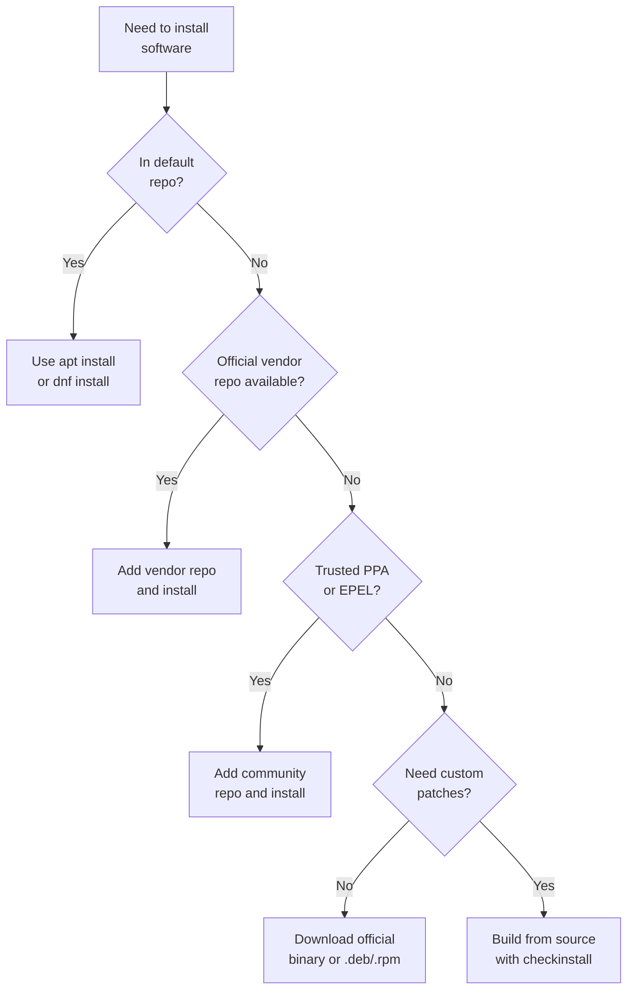

## Table of Contents

1. [What Is a Package?](#what-is-a-package)
2. [Two Major Ecosystems: APT and DNF](#two-major-ecosystems-apt-and-dnf)
3. [APT Basics](#apt-basics)
4. [apt vs apt-get](#apt-vs-apt-get)
5. [Repositories: Where Packages Come From](#repositories-where-packages-come-from)
6. [Adding Third-Party Repositories](#adding-third-party-repositories)
7. [DNF Basics](#dnf-basics)
8. [EPEL and DNF Module Streams](#epel-and-dnf-module-streams)
9. [Version Pinning](#version-pinning)
10. [Choosing Your Software Source](#choosing-your-software-source)
11. [Building from Source and checkinstall](#building-from-source-and-checkinstall)
12. [Dependencies and Conflict Resolution](#dependencies-and-conflict-resolution)

## What Is a Package?

If you have used `npm install express` or `pip install flask`, you already understand the core idea. A package is a bundle that contains a piece of software along with metadata describing what it needs, where its files should go, and what version it is. On Linux, packages also include scripts that run before or after installation (creating system users, starting services, setting permissions).

The problem a package manager solves is the same one npm solves for Node or pip solves for Python, but at the operating system level. Without one, installing software means manually downloading source code, figuring out every library it depends on, compiling it, copying binaries to the right directories, and then remembering all of that when you need to update or remove it. A package manager automates this entire process: it fetches the software from a trusted repository (a server that hosts a collection of packages, similar to npmjs.com or PyPI), pulls in every dependency, places files in standardized locations, and maintains a database of everything installed so it can cleanly upgrade or remove packages later.

The key difference from language-level package managers is scope. npm manages JavaScript libraries within a project. A Linux package manager manages everything on the entire system, from the kernel to the shell to the text editor you use to write config files.

## Two Major Ecosystems: APT and DNF

Linux distributions split into two main families when it comes to package management. Debian-based distributions (Debian, Ubuntu, Linux Mint) use `.deb` packages managed by APT. Red Hat-based distributions (RHEL, CentOS, Fedora, Rocky Linux, AlmaLinux) use `.rpm` packages managed by DNF. These extensions refer to the actual archive file formats: a `.deb` or `.rpm` file is a single archive containing compiled binaries, metadata, dependency declarations, and pre/post-installation scripts for one piece of software.

The concepts are nearly identical between the two. Both download packages from repositories, resolve dependency trees, verify package integrity with cryptographic signatures, and maintain a local database of installed software. The commands differ, but once you learn one system, the other is straightforward to pick up. This guide covers both side by side, starting with APT since Ubuntu is the most common distribution you will encounter on servers and in cloud environments.

## APT Basics

Before you install anything with APT, you need to refresh the local package index. This index is a cached copy of what packages are available in your configured repositories and what versions they offer.

```bash
$ sudo apt update
Hit:1 http://archive.ubuntu.com/ubuntu jammy InRelease
Get:2 http://archive.ubuntu.com/ubuntu jammy-updates InRelease [119 kB]
Get:3 http://security.ubuntu.com/ubuntu jammy-security InRelease [129 kB]
Get:4 http://archive.ubuntu.com/ubuntu jammy-updates/main amd64 Packages [1,287 kB]
Fetched 1,535 kB in 2s (812 kB/s)
Reading package lists... Done
Building dependency tree... Done
18 packages can be upgraded. Run 'apt list --upgradable' to see them.
```

This command does not install or upgrade anything. It just downloads the latest package lists so APT knows what is available. Think of it like running `npm outdated` to check what exists before you actually install.

The reason `apt update` and `apt upgrade` are two separate commands (rather than one combined "refresh and install" operation) comes down to what should happen when the network flakes. Refreshing the index is a many-step download from many mirrors, and any one of those downloads can fail or return partially corrupt data. Installing packages writes to dozens of system directories and runs post-install scripts that can leave the system in a half-configured state if interrupted. If those two phases were fused, a network hiccup during the index refresh could trigger an upgrade against a stale or partially-updated index, which is exactly the recipe for breaking a system. Splitting them gives APT a clean transaction boundary: the index either fully refreshes or you keep the old one, and only after that succeeds do you reach for the riskier install step.

Once the index is fresh, you can install a package:

```bash
$ sudo apt install nginx
Reading package lists... Done
Building dependency tree... Done
The following additional packages will be installed:
  libnginx-mod-http-geoip2 libnginx-mod-http-image-filter
  libnginx-mod-http-xslt-filter libnginx-mod-mail libnginx-mod-stream
  libnginx-mod-stream-geoip2 nginx-common nginx-core
Suggested packages:
  fcgiwrap nginx-doc
The following NEW packages will be installed:
  libnginx-mod-http-geoip2 libnginx-mod-http-image-filter
  libnginx-mod-http-xslt-filter libnginx-mod-mail libnginx-mod-stream
  libnginx-mod-stream-geoip2 nginx nginx-common nginx-core
0 upgraded, 9 newly installed, 0 to remove and 18 not upgraded.
Need to get 880 kB of archives.
After this operation, 2,957 kB of additional disk space will be used.
Do you want to continue? [Y/n]
```

APT shows you exactly what it plans to install, including any dependencies (other packages that nginx needs to function) it needs to pull in, and asks for confirmation. Reading this output is a good habit because it prevents surprises when a simple install triggers a cascade of many dependency packages.

If you scan that list, you may wonder why installing "nginx" pulls in `nginx-core`, `nginx-common`, and a handful of `libnginx-mod-*` packages instead of one self-contained `nginx` blob. This splitting is deliberate, and it solves several problems at once. First, security updates: when a vulnerability is found in a single shared library like OpenSSL, the distro can ship one tiny patched library package, and every program on the system that links against it gets the fix without rebuilding or reinstalling. If every program bundled its own copy of OpenSSL, you would need to update dozens of packages instead of one, and stragglers would stay vulnerable. Second, optional features: not every nginx user wants the image filter or mail proxy modules, so each one is its own `libnginx-mod-*` package and only gets installed if you ask for it. Third, disk and memory footprint: shared libraries on a Linux system are loaded once and reused by every process that needs them, so splitting them out is what makes a 4GB cloud server able to run dozens of services simultaneously. The cost of this design is that dependency graphs are bigger and resolving them is harder, which is exactly why a package manager has to exist in the first place.

To search for a package when you are not sure of the exact name:

```bash
$ apt search "web server"
Sorting... Done
Full Text Search... Done
nginx/jammy-updates 1.24.0-2ubuntu7 amd64
  small, powerful, scalable web/proxy server

apache2/jammy-updates 2.4.58-1ubuntu8 amd64
  Apache HTTP Server

lighttpd/jammy 1.4.63-1ubuntu3 amd64
  fast webserver with minimal memory footprint
```

To see detailed information about a package before installing it:

```bash
$ apt show nginx
Package: nginx
Version: 1.24.0-2ubuntu7
Priority: optional
Section: httpd
Maintainer: Ubuntu Developers <ubuntu-devel-discuss@lists.ubuntu.com>
Installed-Size: 44.0 kB
Depends: nginx-core (<< 1.24.0-2ubuntu7.1~) | nginx-full (<< 1.24.0-2ubuntu7.1~)
Download-Size: 6,132 B
APT-Sources: http://archive.ubuntu.com/ubuntu jammy-updates/main amd64 Packages
Description: small, powerful, scalable web/proxy server
```

This gives you the version, size, description, dependencies, and which repository it comes from. It is the equivalent of checking a package's page on npmjs.com before adding it to your project.

Removing a package is equally straightforward:

```bash
sudo apt remove nginx
```

This removes the package binaries but keeps configuration files. If you want a clean removal including config files, use `purge` instead:

```bash
sudo apt purge nginx
```

After removing packages, orphaned dependencies (packages that were only installed because something else needed them) can linger. Clean them up with:

```bash
sudo apt autoremove
```

## apt vs apt-get

You will see both `apt` and `apt-get` in tutorials and scripts. The `apt-get` command is the older, lower-level tool that has existed since the late 1990s. The `apt` command was introduced later as a more user-friendly wrapper that combines the most common operations from `apt-get` and `apt-cache` into a single tool with nicer output (progress bars, color coding).

For interactive use at the terminal, prefer `apt`. It is simpler and gives better feedback. For shell scripts and automation, `apt-get` is the better choice because its output format is stable and it will not change behavior between releases. The `apt` command explicitly warns that its CLI interface is not guaranteed to remain stable, which matters when scripts parse its output.

In practice, commands like `apt install` and `apt-get install` do the same thing. The difference is cosmetic for most workflows.

## Repositories: Where Packages Come From

When you run `apt install nginx`, APT does not download the package from some random location. It fetches it from a repository, which is a structured collection of packages hosted on a server. Each repository has a Release file that lists every package available, along with their versions and SHA-256 checksums. SHA-256 is a cryptographic hash function that produces a unique fixed-length fingerprint for any piece of data. If even a single byte of a package changes, its SHA-256 hash changes completely, making tampering immediately detectable.

Your system's repository configuration lives in `/etc/apt/sources.list` and in individual files under `/etc/apt/sources.list.d/`. A typical entry looks like:

```text
deb http://archive.ubuntu.com/ubuntu jammy main restricted universe multiverse
```

This breaks down as: `deb` means it is a binary package repository, the URL is the server, `jammy` is the release codename (each Ubuntu version gets a codename, for example `jammy` for 22.04 and `noble` for 24.04, similar to how Node.js ships named LTS lines), and the rest are component categories. The `main` component contains officially supported open-source software. `universe` contains community-maintained packages. `restricted` has proprietary drivers. `multiverse` has software with licensing restrictions.

| Component | Contents | Maintained By |
|-----------|----------|---------------|
| `main` | Officially supported open-source software | Canonical |
| `universe` | Community-maintained open-source software | Community |
| `restricted` | Proprietary drivers (e.g. NVIDIA) | Canonical |
| `multiverse` | Software with licensing restrictions | Community |

The trust model is important to understand. Each repository signs its Release file with a GPG key. GPG (GNU Privacy Guard) is a public-key cryptography tool. Repository maintainers sign their package indexes with a private GPG key, and your system verifies those signatures using the corresponding public key. This ensures that the packages you download genuinely came from the expected source and were not altered in transit. When you run `apt update`, APT downloads the Release file and verifies its signature against keys it already trusts. Then it checks that the SHA-256 hashes of individual package lists match what the Release file declares. Finally, when you install a package, it verifies the package's checksum against the package list. This chain of verification means that if any file was tampered with in transit, APT will reject it. This is why you sometimes need to add GPG keys when configuring new repositories.

## Adding Third-Party Repositories

The default repositories cover a vast amount of software, but sometimes you need a newer version than your distribution ships, or software that is not included at all. This is where third-party repositories come in.

Modern Ubuntu systems use the `add-apt-repository` shortcut for PPAs (Personal Package Archives, which are community-maintained repositories hosted on Launchpad where developers publish their own builds of software):

```bash
sudo add-apt-repository ppa:ondrej/php
sudo apt update
sudo apt install php8.3
```

For other third-party repos, you typically need to add the GPG key and the repository definition manually. Here is an example for adding Docker's official repository:

```bash
curl -fsSL https://download.docker.com/linux/ubuntu/gpg | \
  sudo gpg --dearmor -o /usr/share/keyrings/docker-archive-keyring.gpg

echo "deb [signed-by=/usr/share/keyrings/docker-archive-keyring.gpg] \
  https://download.docker.com/linux/ubuntu $(lsb_release -cs) stable" | \
  sudo tee /etc/apt/sources.list.d/docker.list > /dev/null

sudo apt update
sudo apt install docker-ce
```

The `signed-by` option in the repository line is a security best practice. It tells APT that only packages signed by that specific key should be trusted from this repository. Without it, a compromised third-party repo key could potentially be used to sign packages that override system packages. Always scope GPG keys to their specific repository.

A word on trust: every repository you add is a source you are trusting to put software on your system. Treat adding a repository the same way you would treat adding a dependency to a production application. Stick to official vendor repos and well-known community sources. Random PPAs from unknown maintainers carry real risk.

## DNF Basics

If you are on a Red Hat-based system, DNF is your package manager. The workflow mirrors APT closely:

```bash
$ sudo dnf install nginx
Last metadata expiration check: 1:22:07 ago on Wed 15 Apr 2026 10:05:01 AM UTC.
Dependencies resolved.
================================================================================
 Package              Arch        Version                Repository         Size
================================================================================
Installing:
 nginx                x86_64      1:1.24.0-4.el9         appstream          38 k
Installing dependencies:
 nginx-core           x86_64      1:1.24.0-4.el9         appstream         570 k
 nginx-filesystem     noarch      1:1.24.0-4.el9         appstream          11 k

Transaction Summary
================================================================================
Install  3 Packages

Total download size: 619 k
Installed size: 1.8 M
Is this ok [y/N]:
```

Searching and inspecting packages works the same way as APT:

```bash
$ dnf search "web server"
Last metadata expiration check: 1:23:12 ago.
========================= Name & Summary Matched: web server =========================
nginx.x86_64 : A high performance web server and reverse proxy server
httpd.x86_64 : Apache HTTP Server
```

```bash
$ dnf info nginx
Available Packages
Name         : nginx
Version      : 1.24.0
Release      : 4.el9
Architecture : x86_64
Size         : 38 k
Source       : nginx-1.24.0-4.el9.src.rpm
Repository   : appstream
Summary      : A high performance web server and reverse proxy server
```

Removing packages and cleaning up orphaned dependencies follows the same pattern: `sudo dnf remove nginx` and `sudo dnf autoremove`.

DNF handles dependency resolution similarly to APT, but it uses a different solver (libsolv) that tends to be faster for complex dependency trees. One nice feature is transaction history. Every install, update, and removal is logged, and you can undo entire transactions:

```bash
$ dnf history list
ID     | Command line              | Date and time    | Action(s)      | Altered
-------------------------------------------------------------------------------
    12 | install nginx             | 2026-04-15 11:27 | Install        |    3
    11 | update                    | 2026-04-14 09:00 | Update         |   14
    10 | install postgresql-server | 2026-04-10 16:45 | Install        |    5
     9 | install git               | 2026-04-08 10:30 | Install        |    7
```

```bash
# Undo the last transaction
sudo dnf history undo last
```

This is extremely useful when an upgrade breaks something. You can roll back the entire set of changes in one command.

## EPEL and DNF Module Streams

Red Hat-based distributions ship with a deliberately conservative set of packages. EPEL (Extra Packages for Enterprise Linux) is a community repository maintained by the Fedora project that adds thousands of additional packages while maintaining compatibility with RHEL. Adding it is simple:

```bash
sudo dnf install epel-release
```

DNF also supports module streams, which solve a problem that APT handles less gracefully: running different major versions of the same software. For example, you might need Node.js 18 on one server and Node.js 20 on another, both running the same RHEL version.

```bash
$ dnf module list nodejs
Name      Stream    Profiles                             Summary
nodejs    18        common [d], development, minimal     Node.js runtime
nodejs    20        common [d], development, minimal     Node.js runtime
nodejs    22        common [d], development, minimal     Node.js runtime

Hint: [d]efault, [e]nabled, [x]disabled, [i]nstalled
```

```bash
# Enable and install a specific stream
sudo dnf module enable nodejs:20
sudo dnf install nodejs
```

Module streams lock you into a version track. The `nodejs:20` stream will give you Node.js 20.x updates but will never jump to 21.x. This is valuable for production environments where you want automatic security patches within a major version without risking breaking changes from a major version bump.

## Version Pinning

In production, you often need to prevent a specific package from being upgraded automatically. Maybe your application is tested against a particular version of a database or runtime, and an unexpected upgrade could introduce incompatibilities.

On APT, you pin versions using the preferences system. Create a file in `/etc/apt/preferences.d/`. This works like a `package.json` version range (`"nginx": "1.24.*"`) but at the system level, telling APT which version track to stick to.

```text
# /etc/apt/preferences.d/pin-nginx
Package: nginx
Pin: version 1.24.*
Pin-Priority: 1001
```

A priority above 1000 tells APT to keep this version even if a newer one is available and even if it means downgrading. You can also hold a package at its current version:

```bash
sudo apt-mark hold nginx
```

To see what is held:

```bash
apt-mark showhold
```

On DNF, version locking uses the versionlock plugin:

```bash
sudo dnf install dnf-plugin-versionlock
sudo dnf versionlock add nginx
```

To list locked packages:

```bash
dnf versionlock list
```

Version pinning is a double-edged sword. It protects you from unexpected changes, but it also means you stop receiving security patches for that package. Treat every pinned version as technical debt that needs periodic review. Set a calendar reminder to evaluate whether the pin is still necessary.

## Choosing Your Software Source

When you need to install software, you have several options. This decision tree helps you choose the right one:



The default repository should always be your first choice. Vendor-maintained repositories (like Docker's or PostgreSQL's official repos) are the next best option because the software authors maintain them. Community repositories like EPEL and well-known PPAs are generally reliable. Building from source is the last resort, reserved for situations where no packaged version meets your needs.

## Building from Source and checkinstall

Sometimes the packaged version is too old, or you need to compile with specific options that the packaged version does not include. In those cases, you build from source. The typical pattern looks like:

```bash
# Install build dependencies
sudo apt install build-essential libpcre3-dev libssl-dev zlib1g-dev

# Download and extract source
wget https://example.com/software-1.24.0.tar.gz
tar xzf software-1.24.0.tar.gz
cd software-1.24.0

# Configure, compile, install
./configure --prefix=/usr/local --with-ssl
make
sudo make install
```

The problem with `make install` is that it copies files directly to your filesystem with no tracking. Your package manager has no idea this software exists. Later, if you install a packaged version, you get file conflicts. If you want to uninstall, you have to hope `make uninstall` works (it often does not).

This is where `checkinstall` saves you. It intercepts `make install`, watches what files get placed where, and creates a proper `.deb` or `.rpm` package that it then installs through the package manager:

```bash
sudo apt install checkinstall

# Instead of "sudo make install", run:
sudo checkinstall --pkgname=my-custom-software --pkgversion=1.24.0
```

Now the package manager knows about your compiled software. You can see it with `apt list --installed`, track its files with `dpkg -L my-custom-software`, and remove it cleanly with `apt remove my-custom-software`. This small extra step prevents a class of problems that are painful to debug later.

## Dependencies and Conflict Resolution

Every package declares what it depends on, what it conflicts with, and what it provides. When you install a package, the package manager builds a dependency tree: package A needs library B version 2.x or higher, library B needs library C, and so on. The solver works through this tree to find a set of packages at compatible versions that satisfies all constraints.

Most of the time this works seamlessly. When it does not, you get dependency conflicts. A common scenario: package A needs `libfoo >= 2.0` and package B needs `libfoo < 2.0`. These two packages cannot coexist because they need incompatible versions of the same library.

This pain has a name: "dependency hell." It exists because of a structural choice Linux distributions made decades ago. On Linux, shared libraries are global: there is exactly one copy of `libssl.so.3` on the system, and every program that links against it uses that same copy. That choice is what makes security updates and disk usage manageable, as we saw earlier, but it also means that two programs cannot disagree about which version of a shared library to use. Contrast this with Node.js, where each package gets its own `node_modules` and two libraries can happily depend on different versions of `lodash` because each lives in its own folder. Linux's "one global copy" rule means transitive version conflicts cannot be resolved by duplicating the library; one of the constraints has to give. Newer ecosystems like Flatpak and Nix sidestep this by isolating each application's dependencies, which is essentially the same trick `node_modules` plays at the OS level.

APT will tell you about conflicting constraints when this happens. This is the OS-level equivalent of npm's `ERESOLVE unable to resolve dependency tree` error, where two packages in your tree demand incompatible versions of the same shared library.

```bash
$ sudo apt install package-a package-b
The following packages have unmet dependencies:
  package-a : Depends: libfoo (>= 2.0) but 1.8 is to be installed
  package-b : Depends: libfoo (< 2.0) but 2.1 is to be installed
E: Unable to correct problems, you have held broken packages.
```

When you hit this, you have a few options. First, check if a newer version of either package resolves the conflict. Second, check if one of the packages is available from a different repository at a compatible version. Third, consider whether you actually need both packages on the same system, or whether they could run in separate containers.

On DNF, the `dnf provides` command helps you track down which package supplies a specific file or library:

```bash
$ dnf provides "*/libssl.so.3"
openssl-libs-1:3.0.7-27.el9.x86_64 : A general purpose cryptography library with TLS implementation
Repo        : baseos
Matched from:
Filename    : /usr/lib64/libssl.so.3
```

This is useful when a compilation step fails because it cannot find a library. You can identify which package provides it and install that package.

For complex dependency problems, a practical approach is to simulate the operation first. APT supports a dry-run mode:

```bash
$ apt install --simulate nginx
NOTE: This is only a simulation!
      apt needs root privileges for real execution.
The following additional packages will be installed:
  libnginx-mod-http-geoip2 nginx-common nginx-core
The following NEW packages will be installed:
  libnginx-mod-http-geoip2 nginx nginx-common nginx-core
0 upgraded, 4 newly installed, 0 to remove and 18 not upgraded.
Inst nginx-common (1.24.0-2ubuntu7 Ubuntu:22.04/jammy-updates [all])
Inst nginx-core (1.24.0-2ubuntu7 Ubuntu:22.04/jammy-updates [amd64])
Inst nginx (1.24.0-2ubuntu7 Ubuntu:22.04/jammy-updates [all])
Conf nginx-common (1.24.0-2ubuntu7 Ubuntu:22.04/jammy-updates [all])
Conf nginx-core (1.24.0-2ubuntu7 Ubuntu:22.04/jammy-updates [amd64])
Conf nginx (1.24.0-2ubuntu7 Ubuntu:22.04/jammy-updates [all])
```

This shows you exactly what would happen without making any changes. The `Inst` and `Conf` lines trace the order packages would be installed and configured. Use it whenever you are unsure about the impact of an install or upgrade, especially on production systems.

---

## APT vs DNF Quick Reference

If you switch between Debian-based and Red Hat-based systems, this crosswalk shows the equivalent commands side by side:

| Task | APT (Debian/Ubuntu) | DNF (RHEL/Fedora) |
|------|---------------------|---------------------|
| Refresh package index | `sudo apt update` | `sudo dnf check-update` |
| Install a package | `sudo apt install nginx` | `sudo dnf install nginx` |
| Remove a package | `sudo apt remove nginx` | `sudo dnf remove nginx` |
| Remove with config files | `sudo apt purge nginx` | *(included in `dnf remove`)* |
| Remove orphaned deps | `sudo apt autoremove` | `sudo dnf autoremove` |
| Search for a package | `apt search "web server"` | `dnf search "web server"` |
| Show package details | `apt show nginx` | `dnf info nginx` |
| List installed packages | `apt list --installed` | `dnf list installed` |
| Upgrade all packages | `sudo apt upgrade` | `sudo dnf upgrade` |
| Pin/hold a version | `sudo apt-mark hold nginx` | `sudo dnf versionlock add nginx` |
| Undo last transaction | *(not built-in)* | `sudo dnf history undo last` |
| Find which package owns a file | `dpkg -S /path/to/file` | `dnf provides /path/to/file` |

---

## References

- [Debian APT User's Guide](https://www.debian.org/doc/manuals/apt-guide/) - Comprehensive guide to APT concepts, configuration, and advanced usage on Debian-based systems.
- [DNF Command Reference](https://dnf.readthedocs.io/en/latest/command_ref.html) - Complete reference for all DNF commands, options, and plugins on Red Hat-based systems.
- [Ubuntu Community Help: Repositories](https://help.ubuntu.com/community/Repositories/Ubuntu) - Explains Ubuntu repository structure, components, and how to manage software sources.
- [Fedora Quick Docs: DNF](https://docs.fedoraproject.org/en-US/quick-docs/dnf/) - Practical guide to using DNF for everyday package management tasks on Fedora.
- [EPEL Documentation](https://docs.fedoraproject.org/en-US/epel/) - Overview of the Extra Packages for Enterprise Linux repository, its policies, and how to enable it.
- [Debian Wiki: SecureApt](https://wiki.debian.org/SecureApt) - Deep dive into APT's cryptographic verification chain, including Release file signing and key management.
