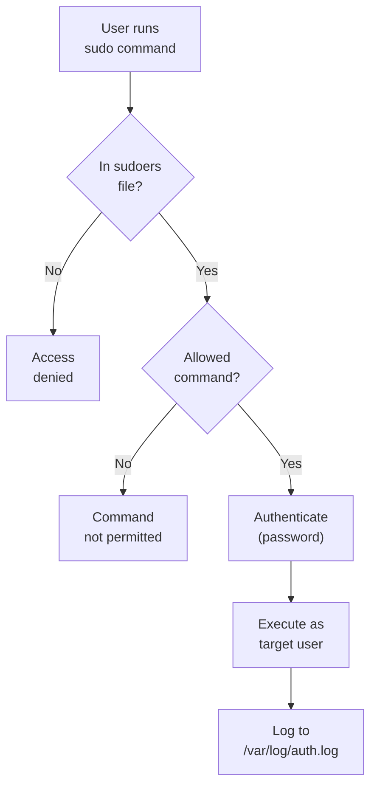

## Table of Contents

1. [Why Permissions Exist](#why-permissions-exist)
2. [Reading ls -l Output](#reading-ls--l-output)
3. [The rwx Model: Files vs Directories](#the-rwx-model-files-vs-directories)
4. [Numeric (Octal) Notation](#numeric-octal-notation)
5. [Ownership with chown and chgrp](#ownership-with-chown-and-chgrp)
6. [Special Permission Bits](#special-permission-bits)
7. [Umask: Default Permission Control](#umask-default-permission-control)
8. [POSIX ACLs: Finer-Grained Control](#posix-acls-finer-grained-control)
9. [User and Group Management](#user-and-group-management)
10. [Sudo and the Principle of Least Privilege](#sudo-and-the-principle-of-least-privilege)
11. [References](#references)

## Why Permissions Exist

Linux is a multi-user operating system. On any given server, you might have a web server process, a database, a monitoring agent, and several human users all sharing the same filesystem. Each of these actors needs access to some files but absolutely should not touch others. The database configuration file contains passwords that the web server has no business reading. The monitoring agent needs to read log files but should never be able to modify application code.

Permissions are the mechanism that enforces these boundaries. Every file and every directory on a Linux system carries metadata that answers three questions: who owns this, what group is it associated with, and what operations are allowed for the owner, the group, and everyone else? This model has been part of Unix since the 1970s, and while it has been extended over the decades, the core ideas remain remarkably simple once you see how they fit together.

If you have worked with cloud IAM systems like AWS IAM or GCP IAM, you can think of Linux permissions as a much simpler, filesystem-local version of the same idea. Where AWS IAM has policies attached to users, roles, and resources with dozens of possible actions, Linux boils it down to three actions (read, write, execute) and three audiences (owner, group, everyone else). The upside of this simplicity is that permission checks are fast and predictable. The downside is that when you need something more nuanced, you reach for extensions like ACLs or sudo rules, which we will cover later in this article.

Let's start at the very beginning: looking at what the system actually tells you about a file.

## Reading ls -l Output

When you run `ls -l` in any directory, you get output that looks like this:

```bash
$ ls -l /etc/passwd
-rw-r--r-- 1 root root 2847 Mar 15 10:22 /etc/passwd
```

That single line packs a lot of information into a compact format. Let's break it apart column by column.

The first column, `-rw-r--r--`, is the permission string. We will spend most of our time on this. The second column, `1`, is the hard link count. A hard link is a directory entry that points to a file's inode, which is the underlying data structure on disk that holds the file's content and metadata. A regular file starts with a hard link count of 1. If you create another hard link to the same file with the `ln` command, the count becomes 2, and both names refer to the exact same data on disk. Directories typically show a count of 2 or more because each subdirectory's `..` entry is a hard link back to the parent.

The third column, `root`, is the owner of the file. The fourth column, also `root`, is the group associated with the file. Then comes the file size in bytes (`2847`), the last modification timestamp, and finally the filename.

Now let's zoom in on that permission string and read it character by character. The string `-rw-r--r--` is exactly 10 characters long, and each position has a specific meaning.

The very first character tells you the file type. A `-` means it is a regular file. A `d` means directory. An `l` means symbolic link (also called a symlink), which is a special file that acts as a pointer to another file or directory by storing its path. Unlike hard links, a symbolic link can span across filesystems and can point to directories. If the target is deleted, the symlink becomes "dangling" and stops working. You will also occasionally see `c` for character devices, `b` for block devices, and `s` for sockets, but those are less common.

The remaining nine characters are three groups of three:

| Position | Characters | Meaning |
|----------|------------|---------|
| 1 | `-` | File type: `-` regular file, `d` directory, `l` symlink |
| 2-4 | `rw-` | Owner: read=yes, write=yes, execute=no |
| 5-7 | `r--` | Group: read=yes, write=no, execute=no |
| 8-10 | `r--` | Others (everyone else): read=yes, write=no, execute=no |

Each group of three represents the permissions for a different category of user. The first triplet is for the file's owner. The second is for anyone in the file's group. The third is for everyone else on the system. Within each triplet, the three positions are always in the same order: read, write, execute. A letter means the permission is granted; a dash means it is not.

Here is a directory listing with more variety so you can practice reading these:

```bash
$ ls -l
drwxr-xr-x 2 alice  devs    4096 Mar 10 09:00 projects/
-rwxr-x--- 1 alice  devs    8192 Mar 11 14:30 deploy.sh
-rw-rw-r-- 1 bob    devs    1024 Mar 12 11:15 config.yaml
-rw------- 1 root   root    4096 Mar 13 08:45 shadow
```

The `projects/` entry starts with `d`, so it is a directory. Its permissions `rwxr-xr-x` mean the owner (alice) can read, write, and enter it; members of the devs group can read and enter it; everyone else can also read and enter it.

The `deploy.sh` file has `rwxr-x---`. Alice can read, write, and execute it. Members of devs can read and execute it. Everyone else has no access at all.

The `shadow` file has `rw-------`. Only root can read and write it. Nobody else can do anything with it. This is exactly how `/etc/shadow` is protected on real systems, because it contains password hashes.

## The rwx Model: Files vs Directories

The letters r, w, and x are straightforward for regular files. Read permission lets you view the contents. Write permission lets you modify the contents. Execute permission lets you run the file as a program or script.

Directories are where people get confused, because the same three letters mean slightly different things.

| Permission | On a File | On a Directory |
|------------|-----------|----------------|
| `r` (read) | View file contents | List directory contents (`ls`) |
| `w` (write) | Modify file contents | Create, rename, or delete files inside |
| `x` (execute) | Run as a program or script | Traverse (enter with `cd`, access files by name) |

Read permission on a directory lets you list its contents. Without it, `ls` on that directory will fail. Write permission lets you create, rename, or delete files inside that directory. This is important: you can delete a file you cannot even read, as long as you have write permission on the directory containing it. This follows from how directories work internally: a directory is a table of name-to-inode mappings, and deleting a file means removing its entry from that table. That is a write to the *directory*, not to the file, so it is the directory's write permission that matters. Execute permission on a directory means you can traverse it, meaning you can `cd` into it and access files inside it if you know their names.

Here is the subtle part that trips people up: you can have execute permission on a directory without read permission. In that case, you can access files inside the directory if you already know the exact filename, but you cannot list what is in the directory. This is occasionally used as a lightweight access control technique, where a shared directory lets authorized users access specific files by name without being able to browse what else is there.

```bash
# Create a directory where others can traverse but not list
$ mkdir /opt/secrets
$ chmod 711 /opt/secrets

# Another user can access a specific file if they know the name
$ cat /opt/secrets/api-key.txt    # works if the file itself is readable
$ ls /opt/secrets/                # fails with "Permission denied"
```

Conversely, read without execute on a directory lets you see filenames but not actually open or stat any of the files inside. In practice you almost always want both r and x together on directories.

## Numeric (Octal) Notation

Reading permission strings like `rwxr-xr--` is intuitive once you get the hang of it, but when you need to set permissions with `chmod`, you will usually use numeric notation because it is faster to type and unambiguous.

These values are not arbitrary. Under the hood, each permission is a single bit in a 3-bit binary field: read is the high bit (100 in binary = 4), write is the middle bit (010 = 2), and execute is the low bit (001 = 1). Octal was chosen as the notation because each octal digit (0 through 7) maps exactly to three binary bits, so one digit perfectly represents one rwx triplet. Adding the values is really just setting the bits you want: `rwx` is 4+2+1 = 7. `r-x` is 4+0+1 = 5. `r--` is 4+0+0 = 4. `---` is 0.

| Permission | Octal Value | Combined Example |
|------------|-------------|------------------|
| `r` (read) | 4 | `r--` = 4 |
| `w` (write) | 2 | `rw-` = 4+2 = 6 |
| `x` (execute) | 1 | `rwx` = 4+2+1 = 7 |
| none | 0 | `---` = 0 |

The full permission is expressed as three digits: owner, group, others. So `rwxr-xr--` becomes 754. Let's work through a few more examples:

```text
rw-r--r--  →  6 4 4  →  644  (typical file)
rwxr-xr-x  →  7 5 5  →  755  (typical directory or executable)
rw-rw----  →  6 6 0  →  660  (shared between owner and group)
rw-------  →  6 0 0  →  600  (owner only)
rwx------  →  7 0 0  →  700  (private executable or directory)
```

Now you can use `chmod` with these numbers:

```bash
# Make a script executable by owner, readable by group, nothing for others
$ chmod 750 deploy.sh

# Lock down a private key file (SSH requires this, more on that later)
$ chmod 600 ~/.ssh/id_rsa

# Standard permissions for a web-accessible directory
$ chmod 755 /var/www/html
```

You can also use symbolic notation with `chmod`, which is handy for making targeted changes without recalculating the entire permission set:

```bash
# Add execute permission for the owner
$ chmod u+x script.sh

# Remove write permission for group and others
$ chmod go-w config.yaml

# Set group permissions to read and execute exactly
$ chmod g=rx deploy.sh
```

The symbolic form uses `u` for user (owner), `g` for group, `o` for others, and `a` for all. The operators `+`, `-`, and `=` add, remove, or set permissions respectively. Both forms are equally valid and you will see both in the wild.

Here is a practical insight: SSH is very particular about file permissions. If your private key file (`~/.ssh/id_rsa`) has permissions looser than 600, SSH will refuse to use it and print a warning about "unprotected private key file." Similarly, your `~/.ssh` directory should be 700 and your `authorized_keys` file should be 644 or stricter. This automatic enforcement is a security feature that prevents accidental exposure of credentials.

## Ownership with chown and chgrp

Every file has an owner and a group. Changing these is done with `chown` (change owner) and `chgrp` (change group). Only root can change the owner of a file, but a file's owner can change the group to any group they belong to.

```bash
# Change owner to alice
$ sudo chown alice deploy.sh

# Change owner and group at once
$ sudo chown alice:devs deploy.sh

# Change only the group
$ sudo chgrp devs config.yaml

# Recursively change ownership of a directory and everything inside
$ sudo chown -R www-data:www-data /var/www/html
```

The colon syntax in `chown alice:devs` is the most common form. You can also write `chown alice.devs` with a dot, but the colon is preferred because dots can appear in usernames.

Understanding ownership matters for service deployment. When you deploy a web application, the files typically need to be owned by the web server user (often `www-data` or `nginx`). If the files are owned by your deploy user but the web server runs as a different user, you need to carefully set group permissions and ensure the web server user is in the correct group.

## Special Permission Bits

Beyond the basic rwx model, Linux has three special permission bits that modify how files and directories behave. Before diving in, a quick note on terminology: Linux tracks every user by a numeric user ID (UID) and every group by a numeric group ID (GID). The kernel uses these numbers internally for all permission checks. You will see UIDs and GIDs in more detail in the User and Group Management section below.

These special bits show up as a fourth leading digit when you use `chmod` with four digits instead of three. Here is a quick overview:

| Bit | Octal | On a File | On a Directory | Shown in `ls -l` as |
|-----|-------|-----------|----------------|---------------------|
| SUID | `4000` | Process runs as file owner | (no common effect) | `s` in owner execute position |
| SGID | `2000` | Process runs as file group | New files inherit directory group | `s` in group execute position |
| Sticky | `1000` | (no common effect) | Only file owner can delete their files | `t` in others execute position |

### SUID: Borrowing the Owner's Identity

Normally when you run a program, it runs with your permissions. But some tasks require higher privileges. Consider changing your password: the `passwd` command needs to write to `/etc/shadow`, a file that only root can modify. How can a regular user change their own password if they cannot write to the password file?

This is the problem SUID solves. When a file has the SUID bit set, anyone who runs it temporarily gets the permissions of the file's owner for the duration of that program. Think of it like a badge that says "while running this specific program, treat me as if I were root." The key word is "temporarily": the elevated permissions only last while that program is running, and they only apply to what that program does internally.

```bash
$ ls -l /usr/bin/passwd
-rwsr-xr-x 1 root root 68208 Mar 15 10:22 /usr/bin/passwd
```

Notice the `s` where you would normally see `x` in the owner's triplet. That `s` means "this file is executable AND has SUID set." When alice runs `passwd`, the process runs with root's UID, which gives it permission to update `/etc/shadow`. Once `passwd` finishes, alice is back to being a normal user.

You can set SUID with either the four-digit octal notation or the symbolic form:

```bash
$ chmod 4755 /usr/local/bin/special-tool
$ chmod u+s /usr/local/bin/special-tool
```

The `4` in `4755` is the SUID bit. The remaining `755` is the normal owner/group/others permission.

SUID is powerful but dangerous. If a SUID program has a bug that lets an attacker control what it does, they effectively get full root access. This is why security auditors regularly scan for SUID files on a system:

```bash
$ find / -perm -4000 -type f 2>/dev/null | head -5
/usr/bin/passwd
/usr/bin/sudo
/usr/bin/chfn
/usr/bin/newgrp
/usr/bin/gpasswd
```

### SGID: Shared Group Ownership

SGID (Set Group ID) works similarly to SUID but for the group. On executable files, it makes the process run with the file's group permissions. On directories, it does something much more practical: any new file created inside an SGID directory automatically inherits the directory's group instead of the creating user's primary group. This is essential for shared team directories.

```bash
# Create a shared project directory
$ sudo mkdir /opt/project
$ sudo chgrp devs /opt/project
$ sudo chmod 2775 /opt/project

# Now any file created inside gets group "devs" automatically
$ touch /opt/project/notes.txt
$ ls -l /opt/project/notes.txt
-rw-r--r-- 1 alice devs 0 Mar 15 10:30 notes.txt
```

Without SGID, that file would have inherited alice's primary group, and other members of devs might not be able to access it. The `2` in `2775` is the SGID bit.

### Sticky Bit: Protecting Shared Directories

The sticky bit solves a specific problem with shared directories. Consider `/tmp`: every user needs to create temporary files there, so the directory has write permission for everyone. But without the sticky bit, any user could delete any other user's files (because directory write permission controls who can delete files inside). The sticky bit adds a rule: you can only delete or rename files you own, even if you have write permission on the directory.

```bash
$ ls -ld /tmp
drwxrwxrwt 18 root root 4096 Mar 15 10:00 /tmp

# The "t" at the end indicates the sticky bit
```

Without the sticky bit on `/tmp`, any user could delete any other user's temporary files, which would break many programs.

## Umask: Default Permission Control

When you create a new file or directory, the kernel does not give it wide-open permissions. The umask (user file-creation mask) subtracts permissions from the default. The system default for new files is 666 (rw for everyone) and for new directories is 777 (rwx for everyone). The umask removes bits from these defaults.

```bash
$ umask
0022

# With umask 022:
# New file:      666 - 022 = 644  (rw-r--r--)
# New directory:  777 - 022 = 755  (rwxr-xr-x)
```

A more restrictive umask of 077 gives you private files by default:

```bash
$ umask 077

# New file:      666 - 077 = 600  (rw-------)
# New directory:  777 - 077 = 700  (rwx------)
```

Note that the subtraction is not arithmetic subtraction but bitwise. The umask 022 removes write permission for group and others. You will not commonly see umask values that would "subtract" a permission bit that was never in the default (like setting umask to 123), because the math works on bits, not decimal digits.

The umask is typically set in `/etc/profile`, `/etc/login.defs`, or your shell's rc file. For service accounts, the umask is often configured in the systemd unit file (the `.service` configuration file that tells systemd how to run a daemon) using the `UMask=` directive. Setting an appropriate umask is an easy way to ensure that files created by automated processes are not accidentally world-readable.

## POSIX ACLs: Finer-Grained Control

The traditional Unix permission model gives you exactly three categories: owner, group, others. But sometimes you need to grant access to a specific user who is not the owner and should not be added to the file's group. POSIX Access Control Lists (ACLs) solve this without resorting to creating special groups for every combination of users.

```bash
# Check current ACLs on a file
$ getfacl config.yaml
# file: config.yaml
# owner: alice
# group: devs
user::rw-
group::r--
other::r--

# Grant bob read and write access specifically
$ setfacl -m u:bob:rw config.yaml

# Grant the ops group read access
$ setfacl -m g:ops:r config.yaml

# Check the updated ACLs
$ getfacl config.yaml
# file: config.yaml
# owner: alice
# group: devs
user::rw-
user:bob:rw-
group::r--
group:ops:r--
mask::rw-
other::r--
```

When a file has ACLs beyond the basic permissions, `ls -l` shows a `+` at the end of the permission string:

```bash
$ ls -l config.yaml
-rw-rw-r--+ 1 alice devs 1024 Mar 12 11:15 config.yaml
```

The `mask` entry in the ACL output is worth understanding. It acts as a ceiling on the effective permissions for all named users and groups (except the owner). If the mask is `r--`, then even if bob's ACL entry says `rw-`, his effective permission is only `r--`. The mask is automatically recalculated when you use `setfacl`, but `chmod` on the group bits also changes the mask, which can unexpectedly reduce ACL permissions.

You can set default ACLs on directories so that new files and subdirectories automatically inherit specific ACL entries:

```bash
# Set default ACL: ops group gets read on all new files in this directory
$ setfacl -d -m g:ops:r /opt/project
```

ACLs are supported on ext4, XFS, and most modern Linux filesystems. They are particularly useful in environments where you need to give a CI/CD service account access to specific directories without broadening group memberships.

## User and Group Management

So far you have seen how every file is owned by a user and associated with a group, and how the kernel checks UIDs and GIDs to enforce access. But where do those accounts actually come from? When you spin up a fresh Ubuntu server, it ships with a handful of built-in accounts: root (UID 0, the all-powerful superuser), nobody (a minimal-privilege placeholder), and various service accounts like www-data. Everyone else, you create yourself.

Think of it like onboarding a new developer to a GitHub organization. You create their account, assign them to teams, and those teams control which repositories they can access. Linux works the same way: you create a user, give them a password, and add them to the groups that map to the permissions you set up in previous sections. The system keeps track of these mappings in two plain-text files. `/etc/passwd` maps usernames to UIDs (despite the name, it has not stored passwords in decades). `/etc/group` maps group names to GIDs and lists their members. Actual password hashes live in `/etc/shadow`, which only root can read, so regular users cannot peek at each other's credentials.

Let's walk through the most common workflow: creating a user, setting their password, and adding them to a group.

```bash
# Create a new user with a home directory and default shell
$ sudo useradd -m -s /bin/bash alice

# Set alice's password
$ sudo passwd alice
New password:
Retype new password:
passwd: password updated successfully

# Create a group
$ sudo groupadd devs

# Add alice to the devs group (append, don't replace)
$ sudo usermod -aG devs alice

# Verify alice's groups
$ groups alice
alice : alice devs

# Check alice's full identity including numeric UID and GID
$ id alice
uid=1001(alice) gid=1001(alice) groups=1001(alice),1002(devs)
```

The `-aG` flag in `usermod` is critical. The `-a` means append, and without it, `usermod -G devs alice` would remove alice from all other groups and put her in devs only. This is one of the most common mistakes in user management and can lock users out of resources they need.

For service accounts, the setup is different. When a program like Prometheus or nginx runs as a daemon, it needs its own user so you can assign file ownership and permissions to it. But nobody should ever log in interactively as that user. You create these accounts with no home directory and a shell that immediately rejects login attempts:

```bash
$ sudo useradd -r -s /usr/sbin/nologin prometheus
```

The `-r` flag creates a system user (UID below 1000 on most distributions), and `/usr/sbin/nologin` prevents anyone from logging in as this user interactively.

One thing worth knowing when auditing systems: the password hash in `/etc/shadow` has a prefix that tells you which hashing algorithm was used. A hash starting with `$6$` uses SHA-512, which has been the default for many years. Newer distributions are moving to `$y$` which indicates yescrypt, a more modern and memory-hard algorithm. If you see `$1$` (MD5), that is old and should be updated. These prefixes let you quickly assess whether a system's password hashing is current without needing to read configuration files.

## Sudo and the Principle of Least Privilege

Root is the superuser, UID 0, and root can do anything on the system with no permission checks. Logging in as root directly is dangerous because every command runs with full privileges, and a single typo can destroy the system. The `sudo` command lets normal users run specific commands with elevated privileges, with full logging.

It is worth pausing on what makes root "root" in the first place, because the answer is more mechanical than people often assume. The kernel does not have a list of "root-equivalent" usernames. It does not check whether the running process is owned by a user named "root". It checks one specific number: is the effective UID of this process equal to 0? If yes, skip every permission check. If no, run the normal checks. That is it. The username "root" is just a convention enforced by `/etc/passwd`, which maps the name to UID 0. If you renamed root to "admin" in `/etc/passwd`, the account would still be all-powerful because the kernel only cares about the number. Conversely, if you created a second user with UID 0 (some systems used to call it `toor`), that user would also bypass every permission check. This is also why "remove root access" really means "remove UID 0 access", and why audits look at every account's UID, not just the names.



The sudo configuration lives in `/etc/sudoers`, which should only be edited with `visudo` (it validates syntax before saving, preventing you from locking yourself out).

```bash
# Give alice full sudo access (common but broad)
alice ALL=(ALL:ALL) ALL

# Give the devs group permission to restart only nginx
%devs ALL=(root) /usr/bin/systemctl restart nginx, /usr/bin/systemctl status nginx

# Allow the deploy user to run deploy scripts without a password
deploy ALL=(root) NOPASSWD: /opt/deploy/run.sh
```

The format is `user HOST=(RUNAS_USER:RUNAS_GROUP) COMMANDS`. The `ALL` keyword is a wildcard. The `%` prefix indicates a group rather than a user.

The principle of least privilege means giving each user and each service only the permissions absolutely necessary for their function, nothing more. Rather than adding every developer to the sudo group with unrestricted access, define exactly which commands they need. A developer who deploys applications might need `sudo systemctl restart myapp` but should not need `sudo su -` or `sudo bash`.

In practice, many organizations use `sudo` with the following approach: developers get sudo for specific service management commands, the CI/CD pipeline user gets passwordless sudo for its deployment scripts only, and full root access is limited to a small number of operations engineers. Every sudo invocation is logged to `/var/log/auth.log` (or the journal on systemd systems), which provides an audit trail.

```bash
# Check who has sudo access
$ sudo grep -v '^#' /etc/sudoers | grep -v '^$'
root    ALL=(ALL:ALL) ALL
%sudo   ALL=(ALL:ALL) ALL
alice   ALL=(root) /usr/bin/systemctl restart nginx
deploy  ALL=(root) NOPASSWD: /opt/deploy/run.sh

# View recent sudo usage
$ sudo journalctl _COMM=sudo --since "1 hour ago"
Mar 15 14:22:01 web01 sudo[4821]:    alice : TTY=pts/0 ; PWD=/home/alice ; USER=root ; COMMAND=/usr/bin/systemctl restart nginx
Mar 15 14:35:12 web01 sudo[4910]:   deploy : TTY=unknown ; PWD=/opt/deploy ; USER=root ; COMMAND=/opt/deploy/run.sh
```

Combining sudo restrictions with proper file ownership and permissions creates defense in depth: even if a compromised service escapes its permission sandbox, it still cannot escalate to root unless sudo rules allow it.

## References

- [Linux man page: chmod](https://man7.org/linux/man-pages/man1/chmod.1.html) - Complete reference for changing file permission modes using both symbolic and numeric notation.
- [Linux man page: chown](https://man7.org/linux/man-pages/man1/chown.1.html) - Reference for changing file ownership and group assignment including recursive operations.
- [Linux man page: setfacl](https://man7.org/linux/man-pages/man1/setfacl.1.html) - Detailed guide to setting and modifying POSIX Access Control Lists for fine-grained permissions.
- [Linux man page: sudoers](https://man7.org/linux/man-pages/man5/sudoers.5.html) - Full specification of the sudoers configuration file format and available options.
- [Linux man page: useradd](https://man7.org/linux/man-pages/man8/useradd.8.html) - Reference for creating new user accounts including system users and home directory options.
- [ArchWiki: File permissions and attributes](https://wiki.archlinux.org/title/File_permissions_and_attributes) - Comprehensive guide covering standard permissions, special bits, and ACLs with practical examples.
- [ArchWiki: Access Control Lists](https://wiki.archlinux.org/title/Access_Control_Lists) - In-depth coverage of POSIX ACLs on Linux including default ACLs and filesystem compatibility.
