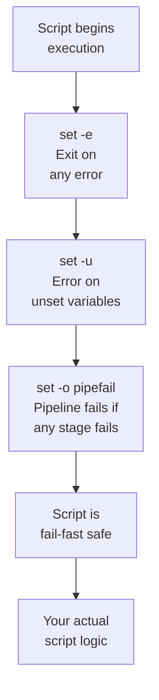

## Table of Contents

1. [What Is a Shell Script?](#what-is-a-shell-script)
2. [The Shebang Line](#the-shebang-line)
3. [Variables: Assigning, Reading, and Quoting](#variables-assigning-reading-and-quoting)
4. [Simple Control Flow: if/else and for Loops](#simple-control-flow-ifelse-and-for-loops)
5. [The Safety Net: set -euo pipefail](#the-safety-net-set--euo-pipefail)
6. [Parameter Expansion and readonly](#parameter-expansion-and-readonly)
7. [Functions with local Variables](#functions-with-local-variables)
8. [Exit Codes, Traps, and Cleanup](#exit-codes-traps-and-cleanup)
9. [Safe File Iteration with Null Delimiters](#safe-file-iteration-with-null-delimiters)

## What Is a Shell Script?

A shell script is a plain text file containing a sequence of commands that the shell executes one after another. Anything you can type into your terminal, you can put into a script and run it repeatedly. If you find yourself running the same five commands every time you deploy, rotate logs, or check disk space across a fleet of servers, a shell script turns that repetitive work into a single command.

Shell scripting is not a replacement for Python or Go. It has no type system, its error handling model is unusual, and complex data structures are painful. But for orchestrating system-level tasks (moving files, calling other programs, reading environment variables, reacting to exit codes) Bash is the right tool. Every Linux server has it. Every CI pipeline can run it. Every container has a shell. You do not need to install anything.

Let's start with the simplest possible script. Open your editor, create a file called `hello.sh`, and write this:

```bash
echo "Hello, world!"
```

That is a valid shell script. One line. To run it, you have two options. The first is to pass it directly to Bash:

```bash
$ bash hello.sh
Hello, world!
```

The second, and more common approach, is to make the file executable and run it directly:

```bash
$ chmod +x hello.sh
$ ./hello.sh
Hello, world!
```

The `chmod +x` command adds the "execute" permission to the file. Without it, the operating system will refuse to run the file directly. The `./` prefix tells the shell to look for the script in the current directory rather than searching your `PATH` (the list of directories the shell checks when you type a command name without a path). Once a script is executable, it behaves like any other program on your system.

## The Shebang Line

When you run `./hello.sh`, the operating system needs to know which interpreter should execute the file. That is what the shebang line does. Add it as the very first line of your script:

```bash
#!/usr/bin/env bash
echo "Hello, world!"
```

The `#!` sequence (called a "shebang") tells the kernel to run this file using the program that follows. The `env` command finds Bash wherever it happens to be installed on the system, which makes your script portable. On some machines Bash lives at `/bin/bash`, on others it is at `/usr/bin/bash`, and on some BSD systems it is somewhere else entirely. Using `/usr/bin/env bash` handles all of those cases.

You could hardcode the path as `#!/bin/bash`, and many scripts do, but there is no advantage to it. The `env` approach costs nothing and avoids portability issues.

From this point forward, every script we write will start with a shebang line.

## Variables: Assigning, Reading, and Quoting

Variables in Bash are untyped strings. If you are coming from Python or JavaScript where values have distinct types (numbers, booleans, arrays, objects), Bash treats everything as text. The number `42` and the string `"42"` are the same thing to Bash. You assign variables without any spaces around the equals sign, and you reference them with a dollar sign:

```bash
#!/usr/bin/env bash

name="devops-engineer"
echo "Hello, $name"
```

Running this script prints `Hello, devops-engineer`. The shell replaces `$name` with its stored value before executing the `echo` command.

That space rule matters. Writing `name = "value"` (with spaces) does not assign a variable. Bash interprets it as running a command called `name` with `=` and `"value"` as arguments, which will fail with a confusing error. No spaces around the equals sign, ever.

When you reference a variable, always wrap it in double quotes. The difference between `$name` and `"$name"` seems cosmetic, but it is the difference between a script that works and one that breaks the moment a value contains a space. Consider this:

```bash
#!/usr/bin/env bash

filename="my report.txt"
cat $filename     # WRONG: Bash splits this into "my" and "report.txt"
cat "$filename"   # RIGHT: Bash treats it as one argument
```

Without quotes, Bash performs word splitting on the expanded value, turning `my report.txt` into two separate arguments. Bash also performs glob expansion, treating characters like `*` and `?` as filename wildcards and replacing them with matching files. With quotes, both behaviors are suppressed and the value stays as one argument. This is the single most common source of bugs in shell scripts. The rule is simple: always quote your variables.

Curly braces let you be explicit about where the variable name ends. This is useful when you need to append text directly to a variable's value:

```bash
#!/usr/bin/env bash

app="myservice"
echo "Log path: /var/log/${app}_errors.log"
```

This prints `Log path: /var/log/myservice_errors.log`. Without the braces, Bash would look for a variable called `app_errors` instead of `app`.

You can capture the output of a command into a variable using `$(...)`. This is called command substitution, and it is Bash's equivalent of calling a function and storing the return value, except the "function" is any program on your system:

```bash
#!/usr/bin/env bash

current_date=$(date +%Y-%m-%d)
file_count=$(ls -1 /tmp | wc -l)
echo "Today is ${current_date}, and /tmp has ${file_count} files"
```

Running this might produce `Today is 2025-04-16, and /tmp has 23 files`. The exact values depend on the current date and the contents of your `/tmp` directory.

Always prefer `$(...)` over backticks for command substitution. Backticks are harder to nest and harder to read.

## Simple Control Flow: if/else and for Loops

Now that you can store values in variables, you need ways to make decisions and repeat actions. The `if` statement in Bash tests the exit code of a command. An exit code is a number that every command returns when it finishes: 0 means success, and any non-zero value means something went wrong. Think of it like `process.exit(0)` in Node or `sys.exit(0)` in Python, except every command (not just your scripts) reports one.

The reason the convention is "0 means success" rather than "1 means success" comes from a simple insight: there is exactly one way to succeed, but there are many distinct ways to fail. A command either did what was asked or it did not, so success collapses cleanly into a single value. Failure, on the other hand, has shades: file not found, permission denied, invalid argument, network unreachable, out of memory. Reserving zero for success leaves every other number free to encode a specific failure mode, which is why exit code 1 typically means "generic error", 2 means "misuse of shell builtins", 126 means "command found but not executable", 127 means "command not found", and 130 means "killed by Ctrl+C". A return-code system designed the other way around (1 for success) would have wasted the cleanest integer on the case that needs the least information.

If the command succeeds (exit code 0), the `then` block runs:

```bash
#!/usr/bin/env bash

if [[ -f "/etc/hostname" ]]; then
    echo "Hostname file exists"
else
    echo "No hostname file found"
fi
```

On most Linux systems, `/etc/hostname` exists, so this prints `Hostname file exists`.

The `[[ ]]` syntax is the modern test form in Bash. It handles edge cases (empty variables, strings with spaces) more gracefully than single brackets. Use `[[ ]]` for all your conditionals.

Common test operators include `-f` (file exists), `-d` (directory exists), `-z` (string is empty), and `-n` (string is not empty). You can combine conditions with `&&` (and) and `||` (or):

Here is a reference for the full set of test operators:

| Operator | Tests | Example |
|----------|-------|---------|
| `-f path` | File exists and is a regular file | `[[ -f "/etc/hosts" ]]` |
| `-d path` | Directory exists | `[[ -d "/var/log" ]]` |
| `-e path` | Path exists (file, directory, or other) | `[[ -e "/tmp/lock" ]]` |
| `-r path` | File is readable by current user | `[[ -r "$config" ]]` |
| `-w path` | File is writable by current user | `[[ -w "$logfile" ]]` |
| `-x path` | File is executable by current user | `[[ -x "$script" ]]` |
| `-z str` | String is empty (zero length) | `[[ -z "$var" ]]` |
| `-n str` | String is not empty | `[[ -n "$var" ]]` |
| `str = str` | Strings are equal | `[[ "$a" = "$b" ]]` |
| `str != str` | Strings are not equal | `[[ "$a" != "$b" ]]` |
| `n -eq n` | Integers are equal | `[[ "$x" -eq 0 ]]` |
| `n -lt n` | Less than (integer) | `[[ "$x" -lt 10 ]]` |
| `n -gt n` | Greater than (integer) | `[[ "$x" -gt 0 ]]` |

```bash
#!/usr/bin/env bash

config="/etc/myapp/config.yml"
if [[ -f "$config" && -r "$config" ]]; then
    echo "Config file exists and is readable"
fi
```

For loops let you iterate over a list of values:

```bash
#!/usr/bin/env bash

for server in web01 web02 web03; do
    echo "Checking ${server}..."
done
```

This produces three lines of output:

```text
Checking web01...
Checking web02...
Checking web03...
```

You can also loop over number ranges:

```bash
#!/usr/bin/env bash

for i in {1..5}; do
    echo "Attempt ${i}"
done
```

This prints `Attempt 1` through `Attempt 5`, one per line.

The `case` statement is useful when you need to match against several known values. It reads more cleanly than a chain of `if/elif`. Before diving in, you need to know about positional parameters: when someone runs your script with arguments (like `./deploy.sh staging`), Bash stores those arguments in numbered variables. `$1` is the first argument, `$2` is the second, and so on.

```bash
#!/usr/bin/env bash

environment="${1:-development}"

case "$environment" in
    production)
        echo "Running full validation suite..."
        ;;
    staging)
        echo "Running smoke tests only..."
        ;;
    *)
        echo "Unknown environment: ${environment}"
        ;;
esac
```

Running `./deploy.sh production` prints `Running full validation suite...`. Running it without arguments defaults to "development", which falls through to the `*` wildcard and prints `Unknown environment: development`.

The `${1:-development}` syntax is your first taste of parameter expansion, which we will cover properly in a moment. It means "use the first argument if provided, otherwise default to development."

## The Safety Net: set -euo pipefail

Now that you understand how a basic script works, let's talk about what happens when things go wrong. By default, Bash does something surprising: when a command fails, the script keeps running. Consider this:

```bash
#!/usr/bin/env bash

cd /some/directory/that/does/not/exist
rm -rf *
```

Without any safety flags, the `cd` fails silently, and `rm -rf *` runs in whatever directory you happened to be in before. This is the kind of silent failure that causes real damage.

Why is the default this way? It is a historical artifact, not a deliberate modern choice. The Bourne shell of the late 1970s was designed when "scripts" were short, interactive sequences a sysadmin would type and watch run on a teletype. If `cp` failed because a disk was full, the human at the terminal would see the error message scroll by and decide what to do. There was no expectation of unattended automation, no CI pipelines, no production servers running scripts at 3am with no human in the loop. By the time those use cases became normal, millions of scripts already depended on the "keep going on error" behavior, so changing the default would have broken every shell script on Earth. Instead, Bash added opt-in flags that you should turn on at the top of every new script.

The fix is a single line that you should add to every script, right after the shebang:

```bash
#!/usr/bin/env bash
set -euo pipefail
```



Each flag addresses a different category of silent failure. The `-e` flag makes the script exit immediately when any command returns a non-zero exit code. The `cd` example above would stop at the failed `cd` instead of continuing to the destructive `rm`. The `-u` flag treats references to unset variables as errors. Without it, a typo like `$UDNEFINED_VAR` silently expands to an empty string, which can turn an innocent `rm -rf "$BUILD_DIR/"` into `rm -rf "/"` if `BUILD_DIR` was never set. The `-o pipefail` flag ensures that if any command in a pipeline fails, the whole pipeline's exit code reflects that failure. Without it, `bad_command | sort | uniq` reports success as long as `uniq` succeeds, even though the data feeding it was garbage.

Together, these three flags transform Bash from a language that hides problems into one that surfaces them immediately.

There is one important subtlety that surprises even experienced engineers: `set -e` does not trigger inside `if` conditions or on the left side of `&&` and `||`. If you write `if some_command; then ...`, and `some_command` fails, the script does not exit. The failure is "expected" as part of the conditional. This means wrapping a failing command in `if` effectively silences `set -e` for that command. Sometimes that is exactly what you want, but sometimes it hides real errors. Be aware of this behavior when you structure your conditionals.

## Parameter Expansion and readonly

You have already seen `${var:-default}` for providing fallback values. Bash has a family of parameter expansion operators that let you manipulate strings without spawning external processes:

```bash
#!/usr/bin/env bash
set -euo pipefail

APP_NAME="myservice"
LOG_DIR="/var/log/${APP_NAME}"
TIMESTAMP=$(date +%Y%m%d_%H%M%S)
ENVIRONMENT="${1:-production}"
MAX_RETRIES="${MAX_RETRIES:-3}"

readonly CONFIG_PATH="/etc/${APP_NAME}/config.yml"
```

The `${var:-default}` form provides a fallback when the variable is unset or empty. The `ENVIRONMENT` line defaults to "production" if no argument is passed. The `MAX_RETRIES` line picks up an environment variable if set, otherwise defaults to 3. This pattern is excellent for configuration because it lets callers override values without modifying the script.

The `${var:?error message}` form aborts the script with a message if the variable is empty. This is ideal for required inputs:

```bash
#!/usr/bin/env bash
set -euo pipefail

DB_HOST="${DB_HOST:?DB_HOST must be set}"
DB_PORT="${DB_PORT:-5432}"
```

If `DB_HOST` is not set in the environment, the script exits immediately with a clear error:

```text
./configure.sh: line 4: DB_HOST: DB_HOST must be set
```

This is much better than silently proceeding with an empty value.

For path manipulation, `${var%pattern}` strips a suffix and `${var#pattern}` strips a prefix:

```bash
#!/usr/bin/env bash
set -euo pipefail

filepath="/var/log/myapp/server.log"
directory="${filepath%/*}"     # /var/log/myapp
filename="${filepath##*/}"     # server.log
extension="${filename##*.}"    # log
basename="${filename%.*}"      # server
```

These expansions are faster than calling `dirname` or `basename` because they happen inside the shell process without forking a subprocess.

Here is a reference for all the parameter expansion operators:

| Syntax | Behavior | Example | Result |
|--------|----------|---------|--------|
| `${var:-default}` | Use `default` if `var` is unset or empty | `${1:-production}` | `production` (if `$1` unset) |
| `${var:=default}` | Assign `default` if `var` is unset or empty | `${COUNT:=0}` | Sets `COUNT` to `0` |
| `${var:?message}` | Abort with `message` if `var` is unset or empty | `${DB_HOST:?required}` | Exits with error if unset |
| `${var:+alt}` | Use `alt` if `var` IS set (non-empty) | `${DEBUG:+--verbose}` | `--verbose` (if `DEBUG` set) |
| `${var%pattern}` | Remove shortest suffix match | `${filepath%/*}` | `/var/log/myapp` |
| `${var%%pattern}` | Remove longest suffix match | `${filepath%%/*}` | (empty string) |
| `${var#pattern}` | Remove shortest prefix match | `${filepath#*/}` | `var/log/myapp/server.log` |
| `${var##pattern}` | Remove longest prefix match | `${filepath##*/}` | `server.log` |

The `readonly` keyword makes a variable immutable. Once set, any attempt to change it causes an error. Use it for constants like file paths and configuration values that should never be modified during execution. It costs nothing and prevents an entire class of accidentally-overwritten-variable bugs.

## Functions with local Variables

As your scripts grow, you will want to organize logic into functions. A function in Bash is declared with its name followed by parentheses and a body in curly braces:

```bash
#!/usr/bin/env bash
set -euo pipefail

check_dependency() {
    local cmd="$1"
    if ! command -v "$cmd" &>/dev/null; then
        echo "ERROR: ${cmd} is not installed" >&2
        return 1
    fi
}

check_dependency docker
check_dependency curl
echo "All dependencies present"
```

If both programs are installed, the script prints `All dependencies present`. If docker is missing, you instead see `ERROR: docker is not installed` and the script exits because `return 1` triggers `set -e`. The `command -v` built-in checks whether a given command exists on the system by looking it up in your PATH.

The `&>/dev/null` redirects both standard output and standard error (stderr, the separate output stream reserved for error messages) to `/dev/null`, silently discarding them so the function only communicates through its return code. The `>&2` on the `echo` line does the reverse: it sends output to stderr so error messages stay separate from normal output. When someone pipes your script's output to another program, they get only the real output, not error messages mixed in.

The `local` keyword is critical. Without it, every variable you set inside a function leaks into the global scope. In a small script that might not matter, but in a script with multiple functions, a shared variable name will cause one function to silently overwrite another's data. Always declare function variables with `local`.

There is a subtle behavior of `local` that differs from almost every other language you might know: `local` in Bash is dynamically scoped, not lexically scoped. If function A declares `local x=5` and then calls function B, function B can see and modify `x`. The `local` keyword prevents leaking to the global scope, but it does not prevent called functions from accessing the variable. This is a historical artifact: the original Bourne shell had no `local` at all, so every variable was global. When Bash added `local`, it implemented it by pushing a scope on function entry and popping it on exit, which naturally produces dynamic scoping. A full lexical scoping model would have required rewriting the interpreter. Keep this in mind when your scripts grow complex enough to have nested function calls.

Functions communicate success or failure through their return code. Use `return 0` for success, `return 1` (or any non-zero value) for failure. The calling code can check this with `if`:

```bash
#!/usr/bin/env bash
set -euo pipefail

deploy_service() {
    local environment="$1"
    local version="${2:-latest}"

    check_dependency docker
    check_dependency curl

    case "$environment" in
        production)
            local replicas=3
            ;;
        staging)
            local replicas=1
            ;;
        *)
            echo "Unknown environment: ${environment}" >&2
            return 1
            ;;
    esac

    echo "Deploying version ${version} to ${environment} with ${replicas} replicas"
}
```

Notice how `echo ... >&2` sends error messages to stderr, consistent with the pattern from the previous example.

## Exit Codes, Traps, and Cleanup

Every command returns an exit code: zero for success, non-zero for failure. Your scripts should follow the same convention, but you can go further by using named exit codes to communicate specific failure modes:

```bash
#!/usr/bin/env bash
set -euo pipefail

readonly ERR_MISSING_CONFIG=10
readonly ERR_SERVICE_DOWN=20
readonly ERR_BAD_ARGUMENTS=30
```

Instead of returning just 0 or 1, you return 10 for a missing config file, 20 for a failed health check, and 30 for invalid arguments. This lets callers distinguish between failure modes programmatically without parsing your log output. They just check the exit code. It transforms your script from a black box into a component with a well-defined interface that other scripts and monitoring systems can reason about.

The `trap` built-in registers a handler that runs when the script exits, regardless of whether it succeeded, failed, or was interrupted by a signal. It is Bash's version of a `try/finally` block in Python or JavaScript: the registered function runs no matter how control leaves the script.

```bash
#!/usr/bin/env bash
set -euo pipefail

readonly CONFIG_PATH="/etc/myapp/config.yml"
readonly ERR_MISSING_CONFIG=10
readonly ERR_SERVICE_DOWN=20

cleanup() {
    rm -f /tmp/myapp_lockfile
    echo "Cleanup complete" >&2
}
trap cleanup EXIT

main() {
    if [[ ! -f "$CONFIG_PATH" ]]; then
        echo "Config file not found: ${CONFIG_PATH}" >&2
        exit $ERR_MISSING_CONFIG
    fi

    if ! curl -sf "http://localhost:8080/health" >/dev/null; then
        echo "Service health check failed" >&2
        exit $ERR_SERVICE_DOWN
    fi

    echo "All checks passed"
}

main "$@"
```

The `trap cleanup EXIT` line means the `cleanup` function runs no matter how the script ends. If it succeeds, cleanup runs. If it crashes halfway through, cleanup runs. If someone hits Ctrl+C, cleanup runs. This is how you ensure temporary files get deleted, lock files get removed, and resources get released. Without traps, a script that fails partway through will leave debris behind, and that debris can cause the next run to fail too.

The `main "$@"` pattern at the bottom is a convention worth adopting. It puts all your top-level logic inside a `main` function and passes all script arguments through with `"$@"` (a special variable that expands to all positional parameters, preserving their original quoting). This keeps the global scope clean, makes the script's entry point obvious, and allows you to define helper functions in any order.

## Safe File Iteration with Null Delimiters

Processing files in a loop is one of the most common shell scripting tasks, and one of the easiest to get wrong. The naive approach breaks on filenames containing spaces or special characters:

```bash
# WRONG: breaks on filenames with spaces
for file in $(find /var/log -name "*.log"); do
    echo "Processing: ${file}"
done
```

The correct approach uses null bytes as delimiters, since null is the one character that cannot appear in a filename:

```bash
#!/usr/bin/env bash
set -euo pipefail

while IFS= read -r -d '' file; do
    echo "Processing: ${file}"
done < <(find /var/log -name "*.log" -print0)
```

Running this might produce:

```text
Processing: /var/log/syslog.log
Processing: /var/log/auth.log
Processing: /var/log/myapp/server.log
```

The `-print0` flag tells `find` to separate results with null bytes instead of newlines. The `-d ''` flag tells `read` to use null bytes as the line delimiter. `IFS=` sets the Internal Field Separator (the characters Bash uses to split input into words) to an empty value, which prevents leading and trailing whitespace from being trimmed. The `-r` flag prevents backslash interpretation. Together, this combination handles every possible filename safely: spaces, newlines, quotes, glob characters, all of it.

The `< <(...)` syntax is process substitution. It runs the `find` command and feeds its output into the `while` loop as if it were a file. This is preferable to piping (`find ... | while read ...`) because a pipe runs the `while` loop in a subshell (a separate child shell process with its own copy of variables), which means any variables set inside the loop are lost when the loop ends.

This pattern looks more complicated than the naive `for` loop, and it is. But the naive version is a latent bug: it works until someone creates a filename with a space in it, and then it fails in a way that is difficult to diagnose. The safe version works in all cases, every time.

---

**References**

- [Bash Reference Manual](https://www.gnu.org/software/bash/manual/bash.html) - The official GNU Bash manual covering all built-in commands, expansion rules, and shell grammar.
- [Shell Command Language (POSIX)](https://pubs.opengroup.org/onlinepubs/9699919799/utilities/V3_chap02.html) - The POSIX specification for portable shell behavior across different Unix-like systems.
- [Bash Pitfalls](https://mywiki.wooledge.org/BashPitfalls) - A comprehensive catalog of common Bash scripting mistakes and how to avoid them.
- [set(1) - Set or Unset Shell Options](https://man7.org/linux/man-pages/man1/set.1p.html) - The man page documenting shell option flags like -e, -u, and -o pipefail.
- [trap(1) - Trap Signals and Events](https://man7.org/linux/man-pages/man1/trap.1p.html) - The man page explaining signal traps and the EXIT pseudo-signal for cleanup handlers.
