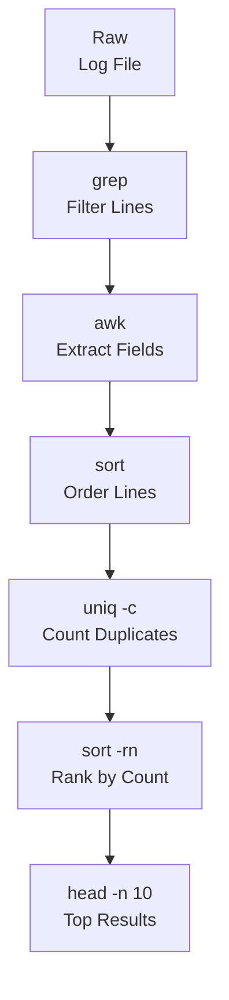

## Table of Contents

1. [Everything Is Text](#everything-is-text)
2. [Searching with grep](#searching-with-grep)
3. [Transforming with sed](#transforming-with-sed)
4. [Analyzing with awk](#analyzing-with-awk)
5. [Building Pipelines](#building-pipelines)
6. [Supporting Utilities](#supporting-utilities)
7. [References](#references)

## Everything Is Text

One of the most important ideas in Linux is that nearly everything is represented as text. Configuration files are text. Log files are text. The output of almost every command you run is text. Even things that seem like they should be binary, like the list of running processes or your network configuration, are exposed as readable text through files in `/proc` and `/sys`.

This matters because it means you only need to learn one set of tools. The same `grep` command that searches a log file also searches configuration files, source code, command output, and anything else. Once you know how to process text, you can work with almost anything on a Linux system.

Let's start with the simplest tools for looking at text.

### Viewing Files with cat, head, and tail

The `cat` command prints the entire contents of a file to your terminal. The name comes from "concatenate" because it can combine multiple files, but most of the time you use it to just look at a file.

```bash
$ cat /etc/hostname
devbox01
```

That prints your machine's hostname. Simple. For short files, `cat` is perfect. For longer files, it dumps everything at once, which is not ideal. That's where `head` and `tail` come in.

```bash
$ head -n 3 /var/log/syslog
Jan 12 08:01:22 devbox01 systemd[1]: Started Session 14 of User root.
Jan 12 08:05:01 devbox01 CRON[2945]: (root) CMD (logrotate /etc/logrotate.conf)
Jan 12 08:10:42 devbox01 systemd[1]: Starting Daily apt download activities...

$ tail -n 3 /var/log/syslog
Jan 12 23:55:01 devbox01 CRON[8834]: (root) CMD (command -v debian-sa1 > /dev/null)
Jan 12 23:58:12 devbox01 app[4021]: graceful shutdown complete
Jan 12 23:59:59 devbox01 systemd[1]: Stopping User Manager for UID 1000...
```

`head` shows the first N lines, `tail` shows the last N lines. The `-n` flag specifies how many lines you want. If you omit it, both default to 10 lines.

`tail` has a particularly useful flag: `-f` (follow). This keeps the file open and prints new lines as they are appended, which is extremely useful when you need to watch a log file in real time.

```bash
tail -f /var/log/syslog
```

Press `Ctrl+C` to stop following.

### Counting and Exploring with wc, echo, and less

The `wc` (word count) command tells you how many lines, words, and bytes are in a file.

```bash
$ wc /etc/passwd
  42   67 2459 /etc/passwd
```

The three numbers are lines, words, and bytes, in that order. Most often you care about lines, so `wc -l` is the flag you will use constantly.

```bash
$ wc -l /var/log/syslog
14832 /var/log/syslog
```

`echo` prints whatever you give it. This sounds trivial, but it's useful for testing pipelines, writing to files, and checking variable values.

```bash
$ echo "hello world"
hello world
$ echo $HOME
/home/user
```

For files too long to read with `cat`, use `less`. It opens the file in a scrollable viewer. Press `j`/`k` or arrow keys to scroll, `/` to search, and `q` to quit. Unlike `cat`, `less` does not load the entire file into memory, so it handles very large files without trouble.

```bash
less /var/log/syslog
```

## Searching with grep

`grep` is probably the command you will use more than any other text processing tool. It searches for a pattern in text and prints every line that matches. The name stands for "global regular expression print," but you don't need regular expressions to start using it.

### The Simplest grep

```bash
$ grep "error" /var/log/syslog
Jan 12 09:14:03 devbox01 app[4021]: connection error: refused by remote host
Jan 12 09:22:17 devbox01 app[4021]: write error: disk quota exceeded
Jan 12 10:01:55 devbox01 kernel: [42103.9] usb error: descriptor read failed
```

Every line containing the word "error" is printed. That is all grep does at its core: filter lines by a pattern.

You can also pipe text into grep instead of giving it a filename. The `|` (pipe) operator takes the output of the command on its left and feeds it as input to the command on its right.

```bash
cat /var/log/syslog | grep "error"
```

Both approaches produce the same result. The pipe version becomes important later when you chain multiple tools together.

### Essential Flags

Case sensitivity catches people all the time. If the log says "Error" or "ERROR," a plain `grep "error"` misses those lines. The `-i` flag makes the search case-insensitive.

```bash
grep -i "error" /var/log/syslog
```

When you find a match, you often want to know which line it's on. The `-n` flag adds line numbers.

```bash
$ grep -n "error" /var/log/syslog
1247:Jan 12 09:14:03 devbox01 app[4021]: connection error: refused by remote host
1302:Jan 12 09:22:17 devbox01 app[4021]: write error: disk quota exceeded
1588:Jan 12 10:01:55 devbox01 kernel: [42103.9] usb error: descriptor read failed
```

Each line is prefixed with its line number, so you can jump straight to that location in the file.

Sometimes you want the opposite: every line that does NOT match. The `-v` flag inverts the match.

```bash
grep -v "debug" /var/log/syslog
```

That shows all lines except those containing "debug," which is useful for filtering out noise.

### Recursive Search and Context

When you need to search across many files, `-r` searches recursively through directories.

```bash
$ grep -r "TODO" /home/user/project/
/home/user/project/app.py:# TODO: add retry logic
/home/user/project/db.py:# TODO: close connection on exit
/home/user/project/tests/test_app.py:# TODO: mock external API calls
```

This searches every file under the project directory. Adding `-l` shows only the filenames that contain matches rather than the matching lines themselves.

```bash
$ grep -rl "database_url" /etc/myapp/
/etc/myapp/config.yaml
/etc/myapp/config.yaml.bak
```

Context flags help you understand what's happening around a match. `-A 3` shows 3 lines after each match, `-B 2` shows 2 lines before, and `-C 2` shows 2 lines both before and after.

```bash
$ grep -C 2 "Connection refused" /var/log/syslog
Jan 12 09:13:58 devbox01 app[4021]: attempting to connect to db.internal:5432
Jan 12 09:14:00 devbox01 app[4021]: retrying connection (attempt 3 of 5)
Jan 12 09:14:03 devbox01 app[4021]: Connection refused by db.internal:5432
Jan 12 09:14:03 devbox01 app[4021]: falling back to read replica
Jan 12 09:14:04 devbox01 app[4021]: connected to db-replica.internal:5432
```

Seeing surrounding lines gives you context about what was happening when the error occurred.

Here is a quick reference for the most commonly used grep flags:

| Flag | Purpose | Example |
|------|---------|---------|
| `-i` | Case-insensitive matching | `grep -i "error" log` |
| `-n` | Show line numbers | `grep -n "error" log` |
| `-v` | Invert match (lines that do NOT match) | `grep -v "debug" log` |
| `-c` | Print only the count of matching lines | `grep -c "error" log` |
| `-r` | Search recursively through directories | `grep -r "TODO" src/` |
| `-l` | Show only filenames containing matches | `grep -rl "db_url" /etc/` |
| `-A N` | Show N lines after each match | `grep -A 3 "error" log` |
| `-B N` | Show N lines before each match | `grep -B 2 "error" log` |
| `-C N` | Show N lines before and after each match | `grep -C 2 "error" log` |
| `-E` | Extended regex (`+`, `?`, `\|` without escaping) | `grep -E "error\|warn" log` |
| `-P` | Perl-compatible regex (lookaheads, `\d`, etc.) | `grep -P "(?<=status=)\d+" log` |

### A Quick Detour: Regular Expressions

So far we have been searching for plain words, but grep can match much more flexible patterns using regular expressions (often shortened to "regex"). A regular expression is a mini-language for describing text patterns. If you have used `re.search()` in Python or `String.prototype.match()` in JavaScript, it is the same idea: instead of saying "find this exact string," you say "find anything that looks like this shape." For example, `[0-9]+` matches one or more digits, `^ERROR` matches lines that start with `ERROR`, and `\.log$` matches lines that end with `.log` (the backslash escapes the dot, which would otherwise mean "any character").

There is a historical quirk: grep supports two regex dialects. Basic Regular Expressions (BRE, the default) require backslashes in front of special characters like `+`, `?`, `|`, `(`, and `)` to give them their special meaning. Extended Regular Expressions (ERE) treat those same characters as special by default. BRE was the original syntax on old Unix systems, and ERE was added later to make patterns easier to read. Most people prefer ERE today, which is why the `-E` flag is so common.

### Extended Regular Expressions

The `-E` flag enables extended regular expressions, which support `+`, `?`, `|`, and grouping without needing to escape them with backslashes.

```bash
$ grep -E "error|warning|critical" /var/log/syslog
Jan 12 09:14:03 devbox01 app[4021]: connection error: refused by remote host
Jan 12 09:30:11 devbox01 app[4021]: warning: connection pool near capacity
Jan 12 10:45:22 devbox01 kernel: critical: temperature threshold exceeded
```

That matches lines containing any of those three words. Without `-E`, you would need to escape the pipe characters: `grep "error\|warning\|critical"`, which is harder to read.

For more powerful pattern matching, `grep -P` enables Perl-compatible regular expressions (PCRE), the same flavor you get in Perl, Python, and most modern languages. This gives you features that extended regex lacks, including `\d` (digit shorthand), lookaheads, lookbehinds, and non-greedy quantifiers. Not all systems have `-P` available (it depends on the grep build), but when you need these features it is invaluable.

```bash
$ grep -P "(?<=status=)\d+" /var/log/app.log
200
404
500
```

That extracts numbers that follow `status=` without including the `status=` prefix in the match. Breaking it down: `\d+` means "one or more digits," and `(?<=status=)` is a lookbehind, which asserts that the text immediately before the match is `status=` but does not include it in the result. Without the lookbehind, a plain search for `status=\d+` would return matches like `status=200` instead of just `200`.

If you find yourself doing a lot of searching, especially in codebases, consider `ripgrep` (`rg`). It is a modern alternative that respects `.gitignore` files, searches recursively by default, and is significantly faster than grep on large directory trees. The syntax is very similar: `rg "pattern" path`.

## Transforming with sed

`grep` finds text. `sed` (stream editor) changes text. The word "stream" here means sed reads input one line at a time, applies a transformation, and emits the result, without loading the whole file into memory. This is similar to how a generator works in Python or how Node.js streams process data in chunks, and it is what lets sed handle files of any size. The most common use of `sed` is find-and-replace.

### Simple Substitution

```bash
$ echo "hello world" | sed 's/world/Linux/'
hello Linux
```

The `s` command means substitute. The format is `s/old/new/`. This replaces the first occurrence of "old" with "new" on each line. To replace ALL occurrences on a line, add the `g` (global) flag.

```bash
$ echo "cat and cat" | sed 's/cat/dog/g'
dog and dog
```

Without the `g` flag, only the first "cat" would become "dog" while the second stays unchanged.

### Working with Files

You can use sed on files just like grep.

```bash
sed 's/localhost/0.0.0.0/' config.txt
```

This prints the modified content to stdout (standard output, meaning your terminal screen by default). The original file is unchanged. To edit the file in place, use `-i`.

```bash
sed -i 's/localhost/0.0.0.0/' config.txt
```

Be careful with `-i` because it modifies the file directly. On macOS, `sed -i` requires an argument for the backup extension (use `sed -i '' 's/...'` for no backup). On Linux, `sed -i 's/...'` works without the extra argument.

### Targeting Specific Lines

So far, every sed substitution has applied to the entire file. In practice, you often know exactly where the change belongs. Maybe you need to fix a typo on a specific line, update a value in one section of a config file, or strip comments before feeding text into another tool. Sed lets you restrict operations to specific lines by number, by range, or by pattern.

By number is the simplest. If you know the problem is on line 3, you can target just that line:

```bash
sed '3s/foo/bar/' file.txt
```

Ranges work the same way. This applies the substitution only to lines 10 through 20, leaving the rest of the file untouched:

```bash
sed '10,20s/old/new/g' file.txt
```

Pattern-based addressing is the most useful in real scripts because you rarely know the exact line number ahead of time. Instead, you describe the lines you care about with a regex. One of the most common tasks is stripping comments from a configuration file before processing it:

```bash
$ cat config.txt
# Database settings
host=localhost
port=5432
# Timeout in seconds
timeout=30

$ sed '/^#/d' config.txt
host=localhost
port=5432
timeout=30
```

The `d` command deletes lines. The pattern `/^#/` matches lines starting with `#` (the `^` means "beginning of line"), so this removes every comment line. You could also combine a pattern with substitution to change values only in matching lines, like updating the port only on lines containing "port."

### Deleting and Printing Specific Lines

Beyond substitution, sed can extract or remove specific portions of a file.

```bash
sed -n '5,10p' file.txt
```

The `-n` flag suppresses normal output, and the `p` command explicitly prints the matched lines. This extracts lines 5 through 10, behaving like a more flexible `head`/`tail` combination.

## Analyzing with awk

If `grep` is for finding and `sed` is for transforming, `awk` is for analyzing structured text. It is especially good at working with columnar data: log files, CSV-like output, and anything where fields are separated by spaces or other delimiters.

### Printing Columns

By default, `awk` splits each line on whitespace and gives you numbered fields. Think of it as automatically calling `line.split()` in Python or `line.split(/\s+/)` in JavaScript on every line of input, but without any ceremony. `$1` is the first field, `$2` is the second, and `$0` is the entire unsplit line. Note that awk fields are 1-indexed, unlike most programming language arrays.

```bash
$ echo "Alice 92 A" | awk '{print $1}'
Alice
```

You can print multiple fields. The comma between fields inserts a space in the output.

```bash
$ echo "Alice 92 A" | awk '{print $1, $3}'
Alice A
```

A very common real-world use is pulling specific columns from command output.

```bash
$ df -h | awk '{print $1, $5}'
Filesystem Use%
/dev/sda1 42%
tmpfs 1%
/dev/sdb1 78%
```

That shows each filesystem and its usage percentage from the `df` output.

### Custom Delimiters

Not all data is space-separated. The `-F` flag sets the field separator.

```bash
$ awk -F: '{print $1, $7}' /etc/passwd
root /bin/bash
daemon /usr/sbin/nologin
www-data /usr/sbin/nologin
user /bin/bash
postgres /bin/bash
```

The `/etc/passwd` file uses colons as delimiters. This prints each username and their login shell.

### Filtering with Conditions

`awk` can filter lines based on conditions, much like grep but with awareness of individual fields.

```bash
$ cat grades.txt
Alice English 92
Bob Math 78
Carol Science 95
Dave History 67

$ awk '$3 > 90 {print $1, $3}' grades.txt
Alice 92
Carol 95
```

That prints the name and score for every student with a score above 90. The condition goes before the curly braces.

You can also match patterns.

```bash
awk '/error/ {print $0}' /var/log/app.log
```

That works like grep for simple cases, but awk's power shows when you combine pattern matching with field access.

### Counting and Aggregating

One of awk's strengths is that it maintains state across lines implicitly. Variables persist from one line to the next without any special syntax, which is why compact one-liners can do surprisingly powerful things.

```bash
$ cat sales.txt
Monday 1200
Tuesday 850
Wednesday 1340
Thursday 960
Friday 1500

$ awk '{sum += $2} END {print "Total:", sum}' sales.txt
Total: 5850
```

This adds up all values in the second column and prints the total at the end. The `END` block runs once after all input lines have been processed. There is also a `BEGIN` block that runs before any input.

```bash
$ awk 'BEGIN {count=0} /error/ {count++} END {print count, "errors found"}' app.log
17 errors found
```

That counts how many lines contain "error." The `BEGIN` block initializes the counter (though awk initializes unset numeric variables to 0 by default, so the `BEGIN` block is optional here).

A more practical example counts occurrences of each unique value. Here, `count[$1]` is an associative array (similar to a Python dictionary or a JavaScript object) where awk uses the first field as the key and the count as the value.

```bash
$ awk '{count[$1]++} END {for (key in count) print key, count[key]}' access.log
192.168.1.10 342
10.0.0.5 187
192.168.1.22 56
```

This builds the array keyed by the first field (here, an IP address) and prints how many times each one appeared. This kind of frequency analysis is something you would need a script for in most languages, but awk handles it in a single line.

## Building Pipelines

The pipe operator `|` connects the output of one command to the input of the next. This is the core idea that makes all of these tools work together. Each tool does one thing well, and pipes let you compose them into complex operations.

### A Simple Pipeline

```bash
cat /var/log/syslog | grep "error" | wc -l
```

This reads the log, filters for lines containing "error," and counts how many there are. Three tools, each doing one simple job, producing a result that none of them could produce alone.

You don't actually need `cat` here because grep can read files directly. The more idiomatic version is:

```bash
grep "error" /var/log/syslog | wc -l
```

But the `cat | grep` form makes the data flow very explicit, which helps when you are building longer pipelines step by step.

### Multi-Stage Pipelines

Here is a pipeline that finds the top 10 IP addresses making requests to a web server.

```bash
$ awk '{print $1}' /var/log/nginx/access.log | sort | uniq -c | sort -rn | head -n 10
    847 192.168.1.42
    523 10.0.0.15
    298 192.168.1.10
    201 172.16.0.8
    187 10.0.0.22
    145 192.168.1.55
    112 172.16.0.3
     98 10.0.0.7
     76 192.168.1.99
     54 172.16.0.12
```

Let's trace the data through each stage. First, `awk` extracts the first field from each line (the IP address in standard log format). Then `sort` arranges all the IP addresses alphabetically because `uniq` only removes adjacent duplicates: if the same IP appears on lines 5 and 500, `uniq` will not merge them unless they are sorted together first. This is a common mistake, and the fix is simple: always sort before uniq. Next, `uniq -c` collapses adjacent identical lines and prefixes each with a count. Then `sort -rn` sorts numerically in reverse order so the highest counts come first. Finally, `head -n 10` takes just the top 10 results.

Here is another practical example that extracts and summarizes HTTP status codes.

```bash
$ awk '{print $9}' /var/log/nginx/access.log | sort | uniq -c | sort -rn
  12840 200
   3201 304
    892 404
    341 301
    127 500
     43 403
```

This pulls the ninth field (the HTTP status code in common log format), counts occurrences of each code, and sorts by frequency. In a few seconds you can see whether your server is returning mostly 200s or if there is a spike in 500s.

### The Pipeline Diagram



This pattern of filter, extract, sort, count, and rank appears over and over in real-world text processing. The specific tools in the middle may change, but the shape of the pipeline stays the same.

## Supporting Utilities

Several smaller tools round out the text processing toolkit. Each solves a specific problem and works well in pipelines.

### sort

You have already seen `sort` in pipelines above, where it arranged lines alphabetically before `uniq`. By default, that is exactly what it does: it reads lines and outputs them in dictionary order. But real-world data often needs more nuance than that.

If a file contains numbers, alphabetical order gives surprising results: "9" sorts after "100" because "9" comes after "1" in character order. The `-n` flag tells `sort` to compare values as numbers instead of characters, and `-r` reverses the order so the largest values come first.

```bash
$ cat sizes.txt
120
9
45
1003
77

$ sort -n sizes.txt
9
45
77
120
1003
```

When your data has columns separated by a delimiter, you can sort by a specific field. For example, `/etc/passwd` uses colons between fields. To sort users by their numeric user ID (the third field), you tell `sort` what the delimiter is (`-t:`), which field to sort on (`-k3`), and that the field is numeric (`-n`):

```bash
$ sort -t: -k3 -n /etc/passwd
root:x:0:0:root:/root:/bin/bash
daemon:x:1:1:daemon:/usr/sbin:/usr/sbin/nologin
bin:x:2:2:bin:/bin:/usr/sbin/nologin
sys:x:3:3:sys:/dev:/usr/sbin/nologin
www-data:x:33:33:www-data:/var/www:/usr/sbin/nologin
```

This combination of delimiter, field selection, and numeric ordering is the pattern you will use whenever data is structured in columns, whether that is CSV output, log files, or colon-delimited system files.

### uniq

`uniq` removes adjacent duplicate lines. This is why you almost always pipe `sort` into `uniq` rather than using `uniq` alone. Without sorting, duplicate lines that are not next to each other will not be merged.

```bash
$ sort names.txt | uniq
Alice
Bob
Carol
Dave
```

The `-c` flag prefixes each line with its count, and `-d` shows only duplicated lines.

```bash
$ sort names.txt | uniq -c
      3 Alice
      1 Bob
      2 Carol
      1 Dave
```

### cut

`cut` extracts specific columns from each line. It is simpler than awk but perfectly sufficient when you just need a particular field.

```bash
$ cut -d: -f1 /etc/passwd
root
daemon
bin
sys
www-data
```

That extracts the first field using colon as the delimiter (`-d:`). The `-f` flag specifies which field or fields to extract. You can select multiple fields with `-f1,3,5` or ranges with `-f1-3`.

### tr

`tr` (translate) replaces or deletes individual characters. It works on characters, not strings, which distinguishes it from sed.

```bash
$ echo "Hello World" | tr 'A-Z' 'a-z'
hello world
```

That converts uppercase to lowercase. You can also squeeze repeated characters.

```bash
$ echo "hello   world" | tr -s ' '
hello world
```

The `-s` flag squeezes repeated characters into a single instance. This cleans up messy spacing before piping into awk.

### xargs

`xargs` takes lines of input and converts them into arguments for another command. This bridges the gap between text output and commands that expect arguments rather than stdin (standard input, the stream of text that pipes feed into a command).

```bash
$ grep -rl "TODO" src/ | xargs wc -l
   42 src/app.py
  118 src/db.py
   87 src/tests/test_app.py
  247 total
```

That finds all files containing "TODO" and then counts the lines in each of those files. Without `xargs`, the filenames from grep would just be printed to the terminal. With `xargs`, they become arguments to `wc -l`.

For filenames that contain spaces, use `-0` with `grep -Z` (or `find -print0`) to handle null-delimited input safely.

```bash
grep -rlZ "TODO" src/ | xargs -0 wc -l
```

## References

- [GNU Coreutils Manual](https://www.gnu.org/software/coreutils/manual/) - Comprehensive documentation for core utilities including cat, head, tail, sort, uniq, cut, tr, and wc.
- [GNU Grep Manual](https://www.gnu.org/software/grep/manual/) - Full reference for grep including regular expression syntax and all command-line options.
- [GNU Sed Manual](https://www.gnu.org/software/sed/manual/) - Complete guide to sed commands, addressing, and regular expression usage.
- [The AWK Programming Language (Kernighan)](https://archive.org/details/awk-the-programming-language) - The original book by one of awk's creators, covering the language from basics to advanced techniques.
- [ripgrep GitHub Repository](https://github.com/BurntSushi/ripgrep) - Documentation and installation instructions for ripgrep, a faster modern alternative to grep.
- [Linux Command Line (William Shotts)](https://linuxcommand.org/tlcl.php) - A free book covering shell usage, text processing, and pipeline construction in depth.
