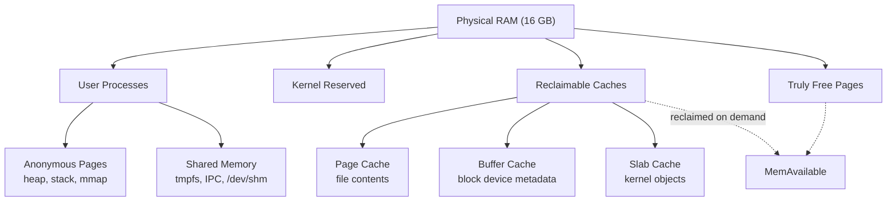

## Table of Contents

1. [The "It Feels Slow" Problem](#the-it-feels-slow-problem)
2. [How the CPU Accounts for Its Time](#how-the-cpu-accounts-for-its-time)
3. [Load Average, Decoded](#load-average-decoded)
4. [Why `free` Lies (And `available` Tells the Truth)](#why-free-lies-and-available-tells-the-truth)
5. [Page Cache, Buffers, and Slab](#page-cache-buffers-and-slab)
6. [Swap: When It Helps and When It Kills You](#swap-when-it-helps-and-when-it-kills-you)
7. [`vmstat`: The Five-Second Triage Tool](#vmstat-the-five-second-triage-tool)
8. [Per-Process Memory and the OOM Killer](#per-process-memory-and-the-oom-killer)
9. [Failure Modes You Will Actually See](#failure-modes-you-will-actually-see)

## The "It Feels Slow" Problem

A user pings you in Slack: "the API is slow." You SSH into the box. Everything looks alive. `ls` returns instantly. Logs are flowing. So what is "slow"? Until you can attach a number to that complaint, you cannot fix it, and you cannot tell when it is fixed.

Almost every "the server is slow" report on Linux comes down to one of four conditions: the CPU is saturated, the disk is saturated, the network is saturated, or the system is paging memory in and out of swap. The first and last live inside this article. Disk and network live in their own. The trick is that all four can produce the *same* user-visible symptom (latency), so you need to read the right meters to tell them apart.

If you have ever watched the Activity Monitor on macOS or Task Manager on Windows, you have seen a shallow version of what we are about to do. Linux exposes the same data, but raw, through the `/proc` virtual filesystem (a fake directory generated by the kernel on the fly, where each file is a live answer rather than bytes on disk) and a handful of small tools that read it. Once you learn to read `/proc`, every monitoring dashboard on the planet stops feeling like magic.

## How the CPU Accounts for Its Time

If you have ever opened the Chrome DevTools Performance tab, you have seen a flame graph color-code where the browser actually spent its time: scripting, painting, idle, waiting on the network. The Linux kernel does the same thing for the whole machine. Every tick of the CPU clock gets dropped into one of about eight buckets, and each bucket means something completely different. The single "87% CPU" number on your monitoring dashboard is the sum of all those buckets mashed together. That sum can hide every interesting story.

The four buckets you will reach for most often:

- **user (`us`)**: the CPU was running your code. Your Node.js handler, your Python loop, your Go binary. If this is high, the fix lives in the application: profile it, find the hot path, optimize.
- **system (`sy`)**: the CPU was inside the kernel doing work *on behalf* of your code. Opening files, sending bytes over a socket, forking new processes. Each of those is a syscall (a request from your program down into the kernel). High `sy` with low `us` usually means "the app is making a lot of tiny requests when it could batch them."
- **iowait (`wa`)**: the CPU was *idle* but at least one process was blocked waiting for the disk to answer. This is the most misread metric in Linux. It is not CPU work, it is the CPU sitting on its hands because storage is the bottleneck. High `wa` always points downstream at disk.
- **steal (`st`)**: only meaningful inside a VM. This is time the hypervisor took your CPU slice and gave it to a different tenant on the same physical host. It is the cloud equivalent of your roommate hogging the WiFi. You cannot fix it from inside the guest; you can only move to a less crowded instance type.

The full list, including the smaller buckets, is below for reference.

| Field | Short for | What it means | What high values usually point to |
|-------|-----------|---------------|-----------------------------------|
| `us` | user | CPU executing your application code (heap, loops, JSON parsing). | A hot code path. Profile the app. |
| `sy` | system | Kernel work done on behalf of your app: system calls, context switches, interrupts. | Too many syscalls, usually small reads/writes or fork bombs. |
| `ni` | nice | User-mode work that has been deprioritized via `nice`. | Background batch jobs. Usually fine. |
| `id` | idle | CPU did nothing. | Healthy, *unless* `wa` is also high. |
| `wa` | iowait | CPU was idle but at least one process was blocked waiting for disk I/O. | Slow disk, saturated EBS volume, network filesystem hiccup. |
| `hi` / `si` | hard/soft IRQ | Time spent servicing hardware interrupts. | Network card under heavy traffic, faulty hardware. |
| `st` | steal | Time the hypervisor gave to *another* VM on the same physical host. | A noisy neighbor. Only visible inside virtualized guests. |

You can read these live from `top`:

```bash
$ top -bn1 | head -5
top - 14:32:07 up 7 days,  3:18,  2 users,  load average: 2.45, 3.12, 2.98
Tasks: 214 total,   3 running, 211 sleeping,   0 stopped,   0 zombie
%Cpu(s): 35.2 us,  8.1 sy,  0.0 ni, 44.0 id, 12.4 wa,  0.0 hi,  0.0 si,  0.3 st
MiB Mem :  15926.4 total,   1124.8 free,   6348.2 used,   8453.4 buff/cache
MiB Swap:   4096.0 total,   3968.0 free,    128.0 used.   9412.6 avail Mem
```

For a per-CPU breakdown over time, `mpstat` (from the `sysstat` package; install it with `apt install sysstat` or `dnf install sysstat`) is the right tool. The arguments mean "sample every 1 second, repeat 5 times":

```bash
$ mpstat 1 5
Linux 5.15.0-91-generic (web-prod-01)    01/15/2024    _x86_64_   (4 CPU)

02:14:33 PM  CPU    %usr   %nice    %sys %iowait   %irq   %soft  %steal  %idle
02:14:34 PM  all   35.21    0.00    8.12   12.41    0.25    0.50    0.31   43.20
02:14:35 PM  all   28.64    0.00    6.78    8.02    0.13    0.38    0.25   55.80
02:14:36 PM  all   42.11    0.00   10.05   14.82    0.38    0.63    0.44   31.57
02:14:37 PM  all   38.92    0.00    9.21   13.66    0.31    0.55    0.38   36.97
02:14:38 PM  all   31.18    0.00    7.44    9.55    0.19    0.41    0.27   50.96
Average:     all   35.21    0.00    8.32   11.69    0.25    0.49    0.33   43.71
```

Three things stand out in that output. `%iowait` averaging 11-14% means the CPU is regularly twiddling its thumbs because something is waiting on disk. That is not a CPU problem, it is a disk problem masquerading as one. `%steal` of 0.3% is fine; on a noisy AWS `t3` burstable instance you will sometimes see 5-20% steal, which means you are renting CPU you cannot actually use. And `%sys` over 10% with low `%usr` is the signature of a syscall-heavy workload (lots of small `read()`/`write()` calls, or a process forking constantly).

To see how the load is distributed across cores, add `-P ALL`:

```bash
$ mpstat -P ALL 1 1
02:15:10 PM  CPU    %usr   %nice    %sys %iowait   %irq   %soft  %steal  %idle
02:15:11 PM  all   35.40    0.00    8.20   11.50    0.25    0.50    0.30   43.85
02:15:11 PM    0   95.00    0.00    2.00    1.00    0.00    1.00    0.00    1.00
02:15:11 PM    1    8.00    0.00   12.00   18.00    0.50    0.50    0.50   60.50
02:15:11 PM    2    9.00    0.00   11.00   13.00    0.25    0.25    0.25   66.25
02:15:11 PM    3   28.00    0.00    7.00   12.00    0.25    0.25    0.25   52.25
```

CPU 0 is pinned at 96% in `%usr` while the other three are mostly idle. Classic single-threaded application: Node.js with no cluster module, a Python script without multiprocessing, a poorly tuned worker. Adding cores will not help. The fix is in the code.

## Load Average, Decoded

Load average is the number on every Linux dashboard that everyone glances at and almost no one reads correctly. People assume it is "CPU percentage." It is not, and treating it that way will mislead you on every incident.

The simplest way to read it: pretend your CPU cores are checkout lines at a grocery store. The load average tells you how many shoppers are either at a register or standing in a line waiting their turn. If you have 4 cores (4 checkout lines) and the load average is `4.0`, every register is busy and nobody is waiting. Healthy and fully utilized. If it is `8.0`, every register is still busy but there is now a second person queued behind each one. The store is backed up. If it is `2.0`, half the registers are idle and shoppers walk straight up.

The three numbers (the 1, 5, and 15 minute averages) tell you whether the queue is growing, shrinking, or steady. A spike in just the 1-minute number is a flash crowd that may not last. A flat-elevated 15-minute number is a real, sustained problem.

With that picture in your head, here is the formal definition you will see in textbooks: load average is the number of processes in the **run queue**, averaged over the last 1, 5, and 15 minutes. The run queue is processes either currently executing on a CPU or ready to run and waiting for a slot. On Linux specifically, it *also* counts processes stuck in uninterruptible sleep (the `D` state in `ps`, usually waiting on disk). The reasoning: load average is meant to capture total system demand, not just CPU demand. A system with 50 processes blocked on disk is just as overloaded as one with 50 runnable processes contending for CPU time, because in both cases work is piling up and users experience latency. Including I/O-blocked processes makes load average a single metric for "is the system keeping up with demand, regardless of which resource is the bottleneck." This was a deliberate Linux-specific change; other Unixes only count runnable processes, which is why their load averages and Linux's are not directly comparable.

That last detail is why a Linux box can show a high load when the CPU is mostly idle: the queue is full of shoppers waiting on the slow ice-cream-scooping employee in produce, not on the registers.

```bash
$ uptime
 14:32:07 up 7 days,  3:18,  2 users,  load average: 2.45, 3.12, 2.98

$ cat /proc/loadavg
2.45 3.12 2.98 3/412 18976
```

The fields after the three averages are: `running/total` processes (3 currently running, 412 total), and the PID of the most recently created process.

The number you compare against is your **core count** (the number of registers in the store). On a 4-core machine, a load average of 4.0 means every core has exactly one process running on it, fully utilized but not backed up. A load of 8.0 on the same machine means there is a backlog: on average, two processes want each core. On a 64-core machine, a load of 8.0 is yawning idle. Always divide by `nproc` before reacting.

```bash
$ nproc
4
```

Read the three averages as a story over time:

- **1-minute high, 15-minute low** → something just started going wrong. Look at recent deploys, cron jobs, traffic spikes.
- **All three roughly equal and elevated** → steady-state saturation. The system has been at this level for a while and is not recovering on its own.
- **1-minute low, 15-minute high** → the storm is passing. Whatever caused the spike has stopped.

> A high load with low CPU usage points to I/O. A high load with high CPU usage points to compute. The fix for each is completely different, and the load number alone cannot tell you which.

This is why load average is useful as an *alarm* but useless as a *diagnosis*. When it goes up, you go look at `mpstat` and `vmstat` to find out *why*.

## Why `free` Lies (And `available` Tells the Truth)

The first time someone runs `free -h` on a busy Linux server they panic:

```bash
$ free -h
               total    used    free    shared  buff/cache  available
Mem:           16Gi    6.2Gi   1.1Gi    256Mi     8.7Gi       9.2Gi
Swap:         4.0Gi   128Mi   3.9Gi
```

"Only 1.1 GB free?! On a 16 GB box?!" Relax. Linux deliberately fills unused RAM with disk cache, on the (correct) theory that empty memory is wasted memory. The kernel will hand any of that cached memory back to an application the instant one asks for it. The number that actually answers "how much memory can I allocate without paging?" is **`available`**, not `free`.

| Column | What it is | Should you care? |
|--------|------------|-------------------|
| `total` | Physical RAM the kernel can see. | Reference only. |
| `used` | Memory consumed by user processes and kernel structures. | Yes. |
| `free` | RAM that contains literally nothing. | **No.** Almost always low on a healthy server. |
| `shared` | `tmpfs` mounts and shared memory segments. | Sometimes. |
| `buff/cache` | Disk cache that can be reclaimed on demand. | Only if it is unreclaimable (rare). |
| `available` | Estimate of memory a new process could allocate. | **Yes. This is the one.** |

If you have written Node.js, you have done the same thing in miniature: `process.memoryUsage()` reports `rss` (resident set size, the actual physical pages your process holds) much higher than your live JS objects, because V8 keeps a reservoir of pages around for the next allocation. The Linux page cache is the same idea applied to the whole machine.

The kernel publishes the underlying numbers in `/proc/meminfo`. If a monitoring tool ever surprises you, this is the file to read:

```bash
$ grep -E "^(MemTotal|MemFree|MemAvailable|Buffers|Cached|SwapTotal|SwapFree|Dirty|Slab):" /proc/meminfo
MemTotal:       16308736 kB
MemFree:         1151232 kB
MemAvailable:    9421824 kB
Buffers:          251904 kB
Cached:          8654848 kB
SwapTotal:       4194304 kB
SwapFree:        4063232 kB
Dirty:             18432 kB
Slab:             542720 kB
```

`MemAvailable` was added to the kernel in 2014 specifically because so many people were misreading `free`. If your distro is from this decade, trust it.

## Page Cache, Buffers, and Slab

That 8.7 GB of "buff/cache" is the line on the dashboard that triggers the most false alarms. "Memory is 90% full!" goes the Slack ping. The truth is closer to: the kernel has been quietly hoarding scraps of useful data so the next request is faster. It is the same instinct as your browser keeping recently-visited pages in memory, or Node.js holding compiled JIT code around even after the function returned. Empty memory does no work; cached memory might.

But "buff/cache" is not one bucket, it is three. Knowing which is which helps when one of them balloons unexpectedly and the dashboard genuinely is telling you something.



**Page cache** is the big one. Every time a process reads a file, the kernel keeps a copy of those bytes in RAM in case someone reads them again. This is why running the same `grep` twice is faster the second time: the first run filled the page cache, the second served straight from RAM without ever touching the disk. If you have used the browser DevTools Memory tab and watched a "disk cache" hit show up as 0 ms, this is the same pattern, just one floor lower in the stack. Database engines like Postgres and MySQL lean on the page cache heavily; when DBAs say "give the database lots of RAM," they usually mean "give the kernel lots of RAM so the page cache can hold the hot tables."

**Buffer cache** is the kernel's cache of the small bookkeeping bytes that surround your files but are not the file contents themselves: directory listings, filesystem journals, the on-disk maps that translate "file X" into "this exact range of blocks on disk." Imagine a library where the page cache is the books and the buffer cache is the card catalog. The catalog is tiny compared to the books, but every lookup goes through it first, so keeping it in RAM makes everything faster. On a normal server it stays small (tens to hundreds of MB) and you rarely need to think about it.

**Slab cache** holds the little internal data structures the kernel itself constantly creates and destroys: one record per open file, one per network socket, one per cached path lookup. Think of it like the object pool a game engine keeps so it does not call `new` on every bullet, or the connection pool your ORM keeps instead of opening a fresh database connection per request. The kernel pre-allocates pools of fixed-size slots ("slabs") for these objects so it can hand them out and recycle them quickly. On most servers slab is well under a gigabyte. Where it bites you is workloads that walk huge directory trees, like a nightly backup or an `rsync` of millions of small files. Each path lookup adds a `dentry` (a "directory entry," basically a cached row of "this name maps to this inode") to slab, and slab can quietly grow to several gigabytes before anyone notices. The tool `slabtop` shows a live, sorted view of which kernel object types are using the most memory.

You can force the kernel to drop these caches:

```bash
$ sudo sh -c 'echo 3 > /proc/sys/vm/drop_caches'
```

Do **not** do this in production except to confirm a diagnosis. The cache will refill within seconds, and in the meantime every disk read is uncached and slow. The only legitimate use is benchmarking, where you want a cold-cache measurement. The values are `1` (page cache only), `2` (dentries and inodes), and `3` (both).

## Swap: When It Helps and When It Kills You

Swap is disk space the kernel uses as overflow when physical memory runs out. When RAM gets tight, the kernel picks pages it judges "inactive" (pages that have not been touched recently) and writes them out to the swap device, freeing the physical RAM for something hotter. If a process later touches a swapped-out page, the kernel reads it back in (a "page fault"). That round-trip from disk is roughly **10,000× slower** than RAM, which is the whole reason swap has a bad reputation.

Used swap, by itself, is *not* a problem. If you see this, do not panic:

```bash
$ free -h
               total    used    free    shared  buff/cache  available
Mem:           16Gi    9.8Gi   1.2Gi    256Mi     5.0Gi       5.4Gi
Swap:         4.0Gi   312Mi   3.7Gi
```

312 MB of swap used means the kernel correctly decided some pages were cold and demoted them to make room for something hotter. Those pages may sit on disk for days without anyone noticing. This is fine and arguably a sign of a well-tuned system.

The dangerous state is *active* swap traffic: pages going in and out continuously. That is **swap thrashing**, and it looks like this in `vmstat` (`si` = swap-in, `so` = swap-out, both in KB/s):

```bash
$ vmstat 2 5
procs -----------memory---------- ---swap-- -----io---- -system-- ------cpu-----
 r  b   swpd   free   buff  cache   si   so    bi    bo   in   cs us sy id wa st
 8  3 1948160  98304  12288 245760 4128 3920  4256  4012 8932 12410 12 28  4 56  0
12  5 1985024  92160  12288 224256 5120 4608  5248  4724 9412 13201 10 32  3 55  0
 9  4 2031616  88064  12288 212992 4736 4992  4864  5108 9128 12876 11 30  3 56  0
```

`si` and `so` both consistently above zero, `wa` (iowait) at 55%, `r` (run queue) of 8 on a 4-core box. The system has stopped doing useful work. It is spending most of its time shuttling pages between disk and RAM. The fix is binary: either the workload shrinks (kill the runaway process) or the hardware grows (more RAM). No amount of swappiness tuning saves you here.

The `swappiness` knob (`/proc/sys/vm/swappiness`, range 0-100) controls how eager the kernel is to swap. The default is 60. Database servers commonly set it to 10 or even 1, because losing your hot index pages to swap is catastrophic for query latency. On a Kubernetes node, swap is usually disabled entirely (`swapoff -a`). The kubelet historically refused to start with swap enabled, and although that has loosened, the convention persists because container memory limits behave more predictably without swap in the picture.

```bash
$ cat /proc/sys/vm/swappiness
60

$ sudo sysctl vm.swappiness=10
vm.swappiness = 10
```

If you are coming from JVM-land, the analogy is hopefully familiar: swapping out the JVM heap is the operating system's version of full GC pauses. The only winning move is not to play.

## `vmstat`: The Five-Second Triage Tool

When a server is misbehaving and you have *one* command to run before you start guessing, run `vmstat 2 10` (sample every 2 seconds, ten times). The output looks intimidating: a 17-column wall of numbers refreshing every couple of seconds. Do not try to read all of it. The trick is that you only ever care about four columns at a time, and which four depends on what kind of trouble you suspect.

```bash
$ vmstat 2 10
procs -----------memory---------- ---swap-- -----io---- -system-- ------cpu-----
 r  b   swpd   free   buff  cache   si   so    bi    bo   in   cs us sy id wa st
 2  0 131072 1124800 245760 8453376    0    0    12    84  312  578 35  8 44 12  1
 1  0 131072 1118208 245760 8459776    0    0     4   120  298  542 29  7 56  8  0
 3  1 131072 1105920 245760 8462336    0    0     8   256  425  612 42 10 32 15  1
 2  0 131072 1102592 245760 8463872    0    0     0    96  302  561 31  8 53  8  0
 1  0 131072 1098240 245760 8466944    0    0    16   148  335  592 33  9 50  7  1
```

Four columns earn their keep on almost every incident.

- **`r` (run queue)**: how many processes want a CPU right now. This is the live, instant version of load average. If `r` is consistently larger than your core count, the CPU is the bottleneck and you should be looking at `mpstat` next.
- **`b` (blocked)**: how many processes are stuck in uninterruptible sleep, almost always waiting on disk. If `b` is greater than 0 for more than a sample or two, the disk is the bottleneck. (This is the same `D`-state count that inflates load average.)
- **`si` and `so` (swap in/out, KB/sec)**: the smoking gun for swap thrashing. If both are nonzero across multiple samples, the kernel is shuttling pages between RAM and disk and the system has stopped doing useful work. Skip ahead to the swap section.
- **`wa` (CPU iowait %)**: the CPU was idle waiting on storage. Same meaning as in `top`. High `wa` paired with high `bi`/`bo` (block-device read/write rates) confirms a disk-bound workload.

In the sample above all four are calm: `r` of 1-3 on a 4-core box, `b` mostly 0, `si`/`so` zero, `wa` in the single digits. This is a healthy machine. Now compare that pattern to the swap-thrashing capture in the next section and the difference jumps out.

The full reference of every column, for when you need it:

| Column | Group | Meaning | Investigate when… |
|--------|-------|---------|-------------------|
| `r` | procs | Processes running or runnable (waiting for CPU). | `r` > number of cores → CPU saturated. |
| `b` | procs | Processes in uninterruptible sleep (usually disk I/O). | `b` > 0 sustained → disk bottleneck. |
| `swpd` | memory | Total virtual memory currently swapped out. | Growing → memory pressure building. |
| `free` | memory | Idle memory in KB. | Misleading on its own; check `available` too. |
| `si` | swap | KB/s read from swap into RAM. | > 0 sustained → thrashing. |
| `so` | swap | KB/s written from RAM to swap. | > 0 sustained → memory pressure. |
| `bi` | io | KB/s read from block devices. | High alongside `wa` → disk-bound. |
| `bo` | io | KB/s written to block devices. | High alongside `wa` → disk-bound. |
| `in` | system | Interrupts per second. | Sudden spike → faulty hardware or NIC storm. |
| `cs` | system | Context switches per second. | Tens of thousands → too many threads or syscalls. |
| `us` `sy` `id` `wa` `st` | cpu | Same five categories from `mpstat`. | See the CPU table above. |

A useful muscle-memory rule: ignore the **first row** of `vmstat` output. It is a system-uptime average, not a current sample. The interesting numbers start on row two.

## Per-Process Memory and the OOM Killer

Once you know the system is under memory pressure, the next question is *who*. You want a per-process leaderboard sorted by RAM consumption. `ps` does this in one line:

```bash
$ ps aux --sort=-%mem | head -10
USER       PID %CPU %MEM    VSZ    RSS TTY      STAT START   TIME COMMAND
postgres  2104  0.5 12.3 1248576 201728 ?      Ss   Jan09   5:22 postgres: main process
java      3891  1.2  8.4  824312 137216 ?      Sl   Jan10  12:07 /usr/bin/java -Xmx512m -jar app.jar
mysql     1567  0.3  6.1  698432  99840 ?      Ssl  Jan09   3:45 /usr/sbin/mysqld
node      4102  2.1  3.9  612480  64256 ?      Sl   Jan11   2:13 node /srv/api/server.js
redis     1890  0.1  2.8  112640  45824 ?      Ssl  Jan09   1:12 redis-server *:6379
www-data  1842  0.2  1.4  214856  58432 ?      S    10:03   0:45 nginx: worker process
```

Two of those columns confuse everyone the first time they see them. Here is the mental model that fixes it: think of a process renting an apartment. The **lease** is the entire address space the process is allowed to touch, signed up front and often wildly bigger than what it actually uses. The **furniture in the room** is the physical pages currently sitting in RAM. The lease costs nothing extra to be large; only the furniture takes up space in the building. Linux calls them:

- **VSZ** (virtual size): the lease. Total address space the process has reserved, including memory it asked for but never wrote to. On a 64-bit system this can run into terabytes for a JVM that has only really allocated megabytes. VSZ almost never tells you anything useful about pressure.
- **RSS** (resident set size): the furniture. Physical pages the process is actually holding in RAM right now. This is the number that competes against every other process and against the page cache.

If you are coming from Node.js, RSS is the same `rss` field that `process.memoryUsage()` reports. If you are coming from Docker, RSS is what `docker stats` shows in the `MEM USAGE` column. If you are coming from Kubernetes, RSS plus a slice of cache is what counts toward your pod's `resources.limits.memory`. Same concept, four different UIs. **When in doubt, sort by RSS, ignore VSZ.**

For deeper detail on a single process, `/proc/<pid>/status` is gold:

```bash
$ grep -E "^(Name|Pid|VmPeak|VmSize|VmRSS|VmSwap|Threads):" /proc/2104/status
Name:   postgres
Pid:    2104
VmPeak:  1248576 kB
VmSize:  1248576 kB
VmRSS:    201728 kB
VmSwap:        0 kB
Threads:       1
```

`VmRSS` is the same number `ps` reports. `VmSwap` shows how much of this process has been paged out, useful when you want to know which process is taking the swap hit, not just which is taking RAM.

Before we get to the OOM killer, it helps to know why it has to exist at all. Linux deliberately practices **overcommit**: when a process calls `malloc()` and asks for a gigabyte, the kernel almost always says yes, even when the box does not actually have a free gigabyte to hand out. The reasoning is that most programs ask for far more memory than they ever touch (a JVM reserves a huge heap, a fork()'d child briefly inherits its parent's address space, glibc rounds allocations up generously). Refusing those reservations would make most software fail to start, so the kernel promises memory now and gambles that the process will not write to all of it. Most of the time the gamble pays off. When it does not, several processes simultaneously try to actually use what was promised, and the kernel runs out of physical pages with nowhere to back them. At that point the only choices are to crash the whole system or to pick one process and kill it. The OOM killer is the second option implemented as policy.

When the kernel runs out of memory entirely and cannot reclaim any more from caches, it invokes the **OOM killer** (Out-Of-Memory killer). The OOM killer is the kernel's last resort: pick a victim, send `SIGKILL`, hope the survivors can keep running. The system is going to lose a process either way; the only question is which one.

The selection is not random. Think of it as a most-wanted list. Every process gets a "badness" score that grows with how much memory it is hogging, so the biggest consumer is usually the first to go. That score lives in `/proc/<pid>/oom_score`. There is also a thumb-on-the-scale knob, `/proc/<pid>/oom_score_adj`, which an admin can set ahead of time to make a process more or less attractive as a victim. The range goes from `-1000` (basically immortal, the kernel will avoid this process at almost any cost) to `+1000` (please kill me first). Critical infrastructure like `sshd` is often nudged toward the negative end so you can still log in after the dust settles, while a known-greedy batch job might be nudged positive so it dies before taking out a database.

```bash
$ cat /proc/2104/oom_score
142

$ cat /proc/2104/oom_score_adj
0
```

When the OOM killer fires, it leaves a clear footprint in the kernel ring buffer:

```bash
$ dmesg -T | grep -i "killed process" | tail -3
[Mon Jan 15 03:14:22 2024] Out of memory: Killed process 4892 (python3) total-vm:8421880kB, anon-rss:7912448kB, file-rss:0kB, shmem-rss:0kB, UID:1000 pgtables:15904kB oom_score_adj:0
[Mon Jan 15 03:14:23 2024] oom_reaper: reaped process 4892 (python3), now anon-rss:0kB, file-rss:0kB, shmem-rss:0kB
```

That message tells you exactly what died (`python3`, PID 4892), how much it was holding (~7.5 GB anonymous RSS), and when. If you are running inside a container or a Kubernetes pod with a memory limit, the same mechanism fires when you exceed *the cgroup's* limit, your container goes away with exit code 137 (`128 + SIGKILL(9)`), even though the host has plenty of free RAM. That is one of the most common "but the box has memory!" confusions in containerized environments.

## Failure Modes You Will Actually See

Knowing the metrics is half the job. The other half is recognizing the patterns. Here are the four diagnoses you will reach for again and again.

**1. CPU steal on a noisy cloud VM.** You are on an AWS `t3.medium` or a GCP `e2-small`. Latency spikes show up at random. `mpstat` shows `%steal` of 15-40%. The host is overcommitted and the hypervisor is handing your CPU slices to other tenants. There is no fix you can deploy from inside the guest. Either move to a non-burstable instance type (`m5`, `c5`, etc.) or accept that you are renting "best-effort" compute. Burstable instances also have a CPU credit balance. Once it hits zero, you are throttled regardless of steal. AWS exposes this as the `CPUCreditBalance` CloudWatch metric.

**2. Swap thrashing.** Latency is terrible, `vmstat` shows `si` and `so` both nonzero and sustained, `wa` is high, `r` exceeds your core count. The system is paging. Find the offender with `ps aux --sort=-%mem | head` or by scanning `/proc/*/status` for high `VmSwap`. Kill it, restart it with a memory cap, or add RAM. Do not waste time tuning swappiness during the incident.

**3. "We have a memory leak" that is actually page cache.** A junior engineer screenshots `free -h` showing 14 GB used out of 16 GB and declares an emergency. Look at `available` and at `Cached` in `/proc/meminfo`. If most of the "used" memory is cache, the system is not leaking. It is doing exactly what it should. The conversation moves to "what should `available` be?" instead of "why is memory full?"

**4. OOM-killed container.** Your Kubernetes pod restarts every few hours. `kubectl describe pod` shows `Last State: Terminated, Reason: OOMKilled, Exit Code: 137`. The host has 32 GB free; the pod's `resources.limits.memory` is 256 MiB and the app blew past it. The fix is either to raise the limit or to make the app respect it. On the JVM, that means setting `-Xmx` *below* the cgroup limit and (on modern JDKs) trusting `-XX:+UseContainerSupport`. On Node.js, that means `--max-old-space-size`. The kernel and the language runtime each have their own idea of "how much memory is available," and when they disagree, the kernel always wins.

The thread tying all four together: the answer is in the metrics, and the metrics are in `/proc`. Every dashboard, every alerting tool, every fancy observability vendor is ultimately reading the same files you can read by hand. Learning to read them yourself means you are never blocked when the dashboard is down.

---

**References**

- [proc(5) - The /proc Filesystem](https://man7.org/linux/man-pages/man5/proc.5.html) - Authoritative reference for every file the kernel exposes under `/proc`, including `meminfo`, `loadavg`, `cpuinfo`, and per-PID `status` and `oom_score`.
- [vmstat(8)](https://man7.org/linux/man-pages/man8/vmstat.8.html) - Man page covering every column of `vmstat` output, including the `procs`, `memory`, `swap`, `io`, `system`, and `cpu` groups.
- [mpstat(1)](https://man7.org/linux/man-pages/man1/mpstat.1.html) - Man page for the per-CPU statistics tool from the `sysstat` package.
- [free(1)](https://man7.org/linux/man-pages/man1/free.1.html) - Man page that explains, in the kernel maintainers' own words, why `available` is the number that matters and `free` is not.
- [Linux Kernel: Concepts of Memory Management](https://www.kernel.org/doc/html/latest/admin-guide/mm/concepts.html) - Kernel admin guide chapter explaining anonymous pages, page cache, swap, and the reclaim path that drives the OOM killer.
- [Brendan Gregg: Linux Load Averages, Solving the Mystery](https://www.brendangregg.com/blog/2017-08-08/linux-load-averages.html) - The definitive explainer on why Linux load average counts uninterruptible sleep, and what that means for your interpretation.
