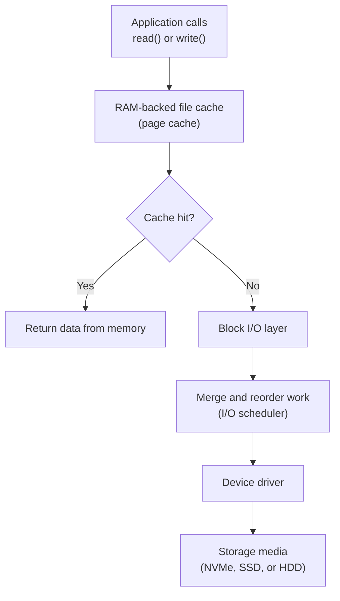

## Table of Contents

1. [Why Storage Is Where Incidents Hide](#why-storage-is-where-incidents-hide)
2. [Block Devices and lsblk](#block-devices-and-lsblk)
3. [Filesystems: ext4, xfs, btrfs](#filesystems-ext4-xfs-btrfs)
4. [Mount Points and /etc/fstab](#mount-points-and-etcfstab)
5. [Inodes, df, and du](#inodes-df-and-du)
6. [Reading iostat and the I/O Stack](#reading-iostat-and-the-io-stack)
7. [Per-Process I/O with iotop](#per-process-io-with-iotop)
8. [LVM: Resizing Storage Without a Reboot](#lvm-resizing-storage-without-a-reboot)
9. [The Disk-Full Triage Runbook](#the-disk-full-triage-runbook)
10. [Failure Modes That Look Like Bugs](#failure-modes-that-look-like-bugs)

## Why Storage Is Where Incidents Hide

The storage stack has more places for problems to hide than any other part of a Linux system, because it is actually three layers stacked on top of each other (block devices, filesystems, the kernel page cache), and each layer can run out of a different resource for a different reason. A "no space left on device" error can fire even when `df -h` shows 60% free, because the filesystem ran out of inodes while blocks were plentiful. Understanding which layer is complaining is the difference between a five-minute fix and an hour of guessing.

The reason this matters in production is that storage is the slowest piece of hardware in the box by orders of magnitude. A CPU register access is roughly one nanosecond; a DRAM access is around 100 nanoseconds; a fast NVMe read is on the order of 100 microseconds; a spinning disk seek is closer to 10 milliseconds. That is roughly a ten-million-times spread between the fastest and slowest tiers. When something goes wrong with storage, the application does not get slower in a graceful way. It stalls, queues build up, and timeouts cascade.

The good news is that Linux ships with a small, reliable set of tools that, once you can read them, tell you exactly which layer is unhappy. The rest of this article is about learning to read them.

## Block Devices and lsblk

If you have ever attached an EBS volume to an EC2 instance, plugged a USB drive into a Linux laptop, or read a `dmesg` line that said something about `/dev/sda1`, you have already met a block device. A **block device** is just the kernel's name for anything that stores data in fixed-size chunks called blocks: physical SATA drives, NVMe SSDs, virtual disks attached to a VM, RAID arrays, and LVM logical volumes all show up the same way under `/dev`. Roughly speaking, this is the Linux equivalent of "Disk 0" in Windows Disk Management or the entries you see in macOS's `diskutil list`.

The naming convention is worth pinning down up front, because it confuses everyone the first time. A name like `sda` refers to the **whole disk** (the physical or virtual drive). A name like `sda1`, `sda2`, `sda3` refers to a **partition** inside that disk: a labeled region the disk has been carved into so different parts can hold different filesystems or different purposes (boot loader, swap, root). Same disk, different slices. NVMe drives use a slightly noisier scheme: `nvme0n1` is the whole drive and `nvme0n1p1` is its first partition.

The fastest way to see what storage a machine actually has is `lsblk`, which renders the device hierarchy as a tree.

```bash
$ lsblk -f
NAME    FSTYPE LABEL  UUID                                 MOUNTPOINT  SIZE
sda                                                                    100G
├─sda1  ext4   boot   2b7b1c3a-0a23-4f9e-8b21-1c9c2f5a4d11 /boot         1G
├─sda2  swap          7e91d6b8-3d1d-4c55-9b8e-2a8b1e0c3f27 [SWAP]        4G
└─sda3  xfs    root   c1f4d2e0-9a8b-4d7e-bf21-aa11bb22cc33 /            95G
nvme0n1                                                                500G
└─nvme0n1p1 ext4 data 5fd2a611-9b1d-4e02-bf99-77f0a31c5e12 /var/lib/pg 500G
```

Each top-level row is a whole device; the indented rows are partitions inside it. `sda` is a 100 GB disk split into a small `/boot` partition, a 4 GB swap area, and a 95 GB root. `nvme0n1` is a separate 500 GB NVMe drive holding a single Postgres data partition. The UUID column is the **filesystem UUID** (a stable hex string the kernel writes onto the partition when the filesystem is created), which is what you should reference in `/etc/fstab` because device names like `sda` and `sdb` can swap on reboot when you add or remove disks.

If you only care about sizes and mount points, `lsblk` with no flags is enough. The `-f` flag adds filesystem type and UUID, which is what you almost always want when triaging.

## Filesystems: ext4, xfs, btrfs

A raw block device on its own is just a long sequence of numbered blocks. There are no folders, no filenames, no permissions, nothing. A **filesystem** is the layer that turns that flat sea of blocks into the directory tree, file metadata, and permissions you actually use. You can think of it as the database engine that runs on top of a block device: same data underneath, but suddenly you have rows, columns, and an index.

This layering is also why a Docker volume, an AWS EBS volume, and a Kubernetes PersistentVolumeClaim all eventually need a filesystem. The cloud or container runtime hands you a block device; the filesystem on top is what your application sees as files and directories. When an EBS volume is created "empty," what is missing is the filesystem, which is why provisioning scripts so often run `mkfs.ext4` or `mkfs.xfs` as one of their first steps.

Three filesystems cover almost every Linux machine you will meet:

| Filesystem | Default For | Strengths | Trade-offs |
|------------|-------------|-----------|------------|
| `ext4` | Debian, Ubuntu, most general-purpose servers | Mature, predictable, easy to repair with `fsck` | No copy-on-write, no built-in snapshots |
| `xfs` | RHEL, Rocky, Amazon Linux 2/2023 | Excellent for very large volumes and parallel writes | Cannot be shrunk, only grown |
| `btrfs` | SUSE root, Synology NAS, some container hosts | Built-in snapshots, checksumming, subvolumes | More complex; some operations are still considered experimental |

For most workloads, the right answer is "use whatever your distribution defaults to." The two cases where the choice matters are large database volumes (XFS handles large files and many parallel writers better than ext4) and systems that need cheap, frequent snapshots (btrfs or LVM thin pools).

One feature all three modern filesystems share is a **journal**, and it is the reason your laptop boots in seconds after a hard crash instead of an hour. A filesystem update is rarely a single write: creating a file touches the inode table, the directory entry, the block allocation bitmap, and the data blocks themselves. If the power dies in the middle, those structures can disagree (a directory pointing at a half-allocated inode, a free-block bitmap that still marks claimed blocks as free), and the result is silent corruption that surfaces hours later as missing files or duplicate blocks. The pre-journal answer was `fsck`: at next boot, walk the entire filesystem and reconcile every structure against every other. On a multi-terabyte volume that took hours, sometimes a full day, and the machine was offline the whole time. A journal sidesteps the problem by writing the *intent* of every change to a small reserved area first, then performing the change, then marking the journal entry done. After a crash, the kernel only has to scan the journal: anything in flight is either replayed or rolled back, and the filesystem is consistent in seconds. This is the same trick a database transaction log uses, applied one layer down.

You almost never create a filesystem by hand on a server you did not provision yourself. When you do, the commands look like this:

```bash
$ sudo mkfs.ext4 -L data /dev/nvme0n1p1
mke2fs 1.46.5 (30-Dec-2021)
Creating filesystem with 131072000 4k blocks and 32768000 inodes
Filesystem UUID: 5fd2a611-9b1d-4e02-bf99-77f0a31c5e12
Allocating group tables: done
Writing inode tables: done
Writing superblocks and filesystem accounting information: done
```

Notice the line about inode tables. The filesystem decides at creation time how many inodes it will ever have. We will come back to why that matters in a few sections.

## Mount Points and /etc/fstab

Creating a filesystem only writes metadata onto a partition. To actually use it, you have to **mount** it: attach it to a directory in the single Linux filesystem tree. The directory becomes the entry point for everything stored on that device. Mounting at the command line is one line:

```bash
$ sudo mount -o noatime /dev/nvme0n1p1 /var/lib/postgresql
$ mount | grep postgres
/dev/nvme0n1p1 on /var/lib/postgresql type ext4 (rw,noatime)
```

The `noatime` option deserves a callout. By default, every time you read a file, the kernel updates that file's access timestamp on disk. On a busy server, this turns every read into a small write, which is wasteful. `noatime` disables that behavior. Almost every production filesystem should mount with `noatime` (or its less aggressive cousin `relatime`) unless you have a specific reason to track read times.

The same mount machinery is what makes Docker bind mounts (`-v /host/path:/container/path`) and Kubernetes volume mounts work: the container runtime is just calling `mount` under the hood to attach a host directory or a block device into the container's filesystem tree at the path you specified. Once you understand mounting on a real Linux box, container volumes stop feeling like magic.

Manual mounts disappear on reboot. To make a mount persistent, add it to `/etc/fstab`, the file the kernel reads at boot to wire up storage:

```ini
# <device>                                  <mount>                <type>  <options>                  <dump> <pass>
UUID=c1f4d2e0-9a8b-4d7e-bf21-aa11bb22cc33   /                      xfs     defaults,noatime           0      1
UUID=2b7b1c3a-0a23-4f9e-8b21-1c9c2f5a4d11   /boot                  ext4    defaults                   0      2
UUID=5fd2a611-9b1d-4e02-bf99-77f0a31c5e12   /var/lib/postgresql    ext4    defaults,noatime           0      2
UUID=ab12cd34-ef56-7890-abcd-1122aabbccdd   /mnt/uploads           ext4    defaults,nosuid,nodev      0      2
UUID=7e91d6b8-3d1d-4c55-9b8e-2a8b1e0c3f27   none                   swap    sw                         0      0
```

The options column is where the interesting per-mount behavior lives. The two security flags worth knowing now are `nosuid` (ignore setuid bits on executables in this filesystem, so a file flipped to "run as root" cannot actually do that) and `nodev` (do not honor device-node special files here). You almost always want both on any filesystem that holds untrusted data: user uploads, removable media, network shares. They turn an entire class of "I uploaded a malicious binary and tricked the server into executing it as root" attacks into nothing.

Always reference filesystems by UUID rather than `/dev/sda1`. A UUID is a stable identifier the filesystem owns; a device name is just whatever the kernel happened to enumerate first that boot. After editing `fstab`, run `sudo mount -a` to test the configuration *before* rebooting. A typo in `fstab` can leave the machine stuck in emergency mode at boot, which is a much worse problem to discover at 4 a.m. than a noisy `mount` error message.

## Inodes, df, and du

Imagine a library. Every book sitting on the shelves is the actual content of a file: the bytes that make up your photo, your config, your log line. But the library also has a card catalog, with one card per book describing where the book lives, who is allowed to check it out, when it was last touched, and how big it is. On Linux, that catalog card is called an **inode** (short for index node). Every single file on a filesystem has exactly one inode, and the filesystem decides up front (when it is formatted) how many cards the catalog can hold.

Notice what is *not* on the card: the book's title. The title (the filename) lives in a separate index, which is what a directory actually is: a lookup table mapping human-readable names to inode numbers. This is why `mv` within the same filesystem is instant no matter how huge the file is. You are not moving any data; you are erasing one entry from one directory's index and writing a new entry in another. Same card, same book, just filed under a new name.

This design is also what makes a hard link work: two filenames in two different directories pointing at the exact same inode, so they refer to the same physical file (not a copy). Deleting one name does not delete the data; the kernel only frees the blocks when the inode's link count drops to zero AND no process still has the file open.

The library analogy also explains the most counterintuitive disk failure mode in Linux: a filesystem can run out of space in two completely different ways. It can run out of shelf space (data blocks), which is the obvious one. Or it can run out of catalog cards (inodes), even when the shelves are half empty. A mail server that creates ten million two-kilobyte spool files can exhaust the catalog while occupying barely any actual storage. The application sees the same generic error in both cases: `ENOSPC` ("No space left on device"). You need two different commands to tell which kind of full it is.

```bash
$ df -hT
Filesystem     Type      Size  Used Avail Use% Mounted on
/dev/sda3      xfs        95G   62G   33G  66% /
/dev/sda1      ext4      976M  187M  723M  21% /boot
/dev/nvme0n1p1 ext4      492G  489G  3.5G 100% /var/lib/postgresql
tmpfs          tmpfs     7.8G  1.4M  7.8G   1% /run
```

```bash
$ df -i
Filesystem      Inodes   IUsed    IFree IUse% Mounted on
/dev/sda3      6291456  245891  6045565    4% /
/dev/sda1        65536     312    65224    1% /boot
/dev/nvme0n1p1 32768000 1284532 31483468    4% /var/lib/postgresql
```

The first command shows blocks (shelf space); the second shows inodes (catalog cards). On the example above, the Postgres volume is 100 percent full on blocks but barely scratching inodes. A mail server with millions of tiny spool files would show the opposite pattern: lots of free blocks, but `IUse%` at 100 percent. There is no command to "add more inodes" to an existing filesystem, which is why running out of them is genuinely scary: the only fix is to delete files or to back up, reformat, and restore.

> A filesystem can run out of space in two ways. `df -h` only checks one of them. Always check `df -i` too.

`df` tells you a filesystem is full. `du` tells you what is filling it. Run it from the top of the offending mount and let `sort -rh` rank the offenders:

```bash
$ sudo du -sh /var/* 2>/dev/null | sort -rh | head -10
12G     /var/log
4.2G    /var/lib
1.8G    /var/cache
256M    /var/spool
28M     /var/tmp
```

The `2>/dev/null` swallows the "Permission denied" errors `du` prints when it walks into directories your user cannot read. Drill in one level at a time until you find the actual offender:

```bash
$ sudo du -sh /var/log/* | sort -rh | head -5
8.4G    /var/log/journal
2.1G    /var/log/nginx
1.2G    /var/log/myapp
180M    /var/log/syslog
24M     /var/log/auth.log
```

There is one important caveat: `du` measures only files that have a name. If a process has a file open and the file has been deleted, `du` will not count it but the disk space is still allocated. We will deal with that scenario in the failure-modes section.

## Reading iostat and the I/O Stack

`df` and `du` answer "is the disk full?" `iostat` answers "is the disk slow?" It is part of the `sysstat` package and reads from `/proc/diskstats`. The flag combination you want is `-xz`: extended statistics, suppressing devices that had zero activity in the interval.

```bash
$ iostat -xz 2 3
Linux 5.15.0-91-generic (db-prod-01)    04/19/2026      _x86_64_    (8 CPU)

Device            r/s     w/s    rkB/s    wkB/s   rrqm/s   wrqm/s     await   %util
sda             12.40   85.30   198.40  1364.80     0.20    42.60      2.14   18.60
nvme0n1        245.10   32.70  3921.60   523.20     1.80     8.40      0.87   52.30

Device            r/s     w/s    rkB/s    wkB/s   rrqm/s   wrqm/s     await   %util
sda              0.00    9.50     0.00    76.00     0.00     2.50      4.10    2.40
nvme0n1        982.00  118.50 15712.00  1896.00     2.30    12.10      6.34   97.80
```

The `2 3` arguments mean "sample every 2 seconds, print 3 reports." The first report is always cumulative since boot, so ignore it; the second and third are real numbers from the last interval. Here is what each column actually tells you:

| Column | Meaning | Why You Care |
|--------|---------|--------------|
| `r/s`, `w/s` | Read and write IOPS (operations per second) | Compares directly to your storage tier's rated IOPS |
| `rkB/s`, `wkB/s` | Throughput in kilobytes per second | Tells you whether you are IOPS-bound or bandwidth-bound |
| `rrqm/s`, `wrqm/s` | Requests merged by the kernel before hitting the device | High values mean the I/O scheduler is coalescing your work; low values on a busy device suggest small random I/O |
| `await` | Average time (ms) each I/O spends in the queue plus on the device | This is the latency your application actually feels |
| `%util` | Percentage of time the device had at least one request in flight | Sustained values above 80% mean the device is the bottleneck |

A quick rule of thumb for reading these together: if `%util` is near 100 and `await` is much higher than your storage tier should produce, the device is genuinely saturated and you need either faster storage or less work. If `%util` is near 100 but `await` is reasonable, the device is being kept busy but is keeping up; that is normal during a backup or a big import. If `%util` is low but `await` is high, you probably have a small number of expensive operations (random reads on a cold cache, or a slow remote disk) rather than a throughput problem.

The numbers you should know by heart:

| Storage Class | Typical IOPS | Typical await |
|---------------|--------------|---------------|
| Spinning disk (7200 RPM) | 75 - 200 | 8 - 20 ms |
| SATA SSD | 20,000 - 100,000 | 0.2 - 1 ms |
| NVMe SSD (consumer) | 100,000 - 500,000 | 0.05 - 0.2 ms |
| NVMe SSD (datacenter) | 500,000 - 1,000,000+ | 0.02 - 0.1 ms |
| AWS EBS `gp3` | 3,000 baseline, up to 16,000 provisioned | 1 - 2 ms |
| AWS EBS `io2` | up to 256,000 provisioned | < 1 ms |

If your application needs more IOPS than the device can deliver, no amount of CPU or memory will fix it. On AWS in particular, the most common storage incident is a `gp3` volume left at its 3,000 IOPS baseline being asked to do 10,000 IOPS by a database. The cure is to bump the provisioned IOPS, not to retune the application.

It helps to picture where I/O actually goes. When an application calls `read()`, it does not talk to the disk directly. It traverses a stack:



The **page cache** is the kernel's in-memory cache of file data. When you read a file, the kernel keeps a copy in free RAM; the next read of the same data is served from memory at roughly 100-nanosecond latency, not from disk. This is why a server with plenty of free memory often *feels* like its disk is fast even when the underlying device is slow. It also explains why "free memory" on a healthy Linux box is often near zero: the kernel has filled it with cached file data and will release it instantly the moment a process needs it. The `free -h` command's `buff/cache` column is the page cache.

## Per-Process I/O with iotop

`iostat` tells you a device is busy. It does not tell you which process is hammering it. For that, use `iotop`, which is to disk what `top` is to CPU. It needs root because it reads per-task I/O accounting from `/proc`.

```bash
$ sudo iotop -oP
Total DISK READ:       3.92 M/s | Total DISK WRITE:       1.36 M/s
Current DISK READ:     4.10 M/s | Current DISK WRITE:     1.42 M/s
    PID  PRIO  USER     DISK READ  DISK WRITE  SWAPIN      IO    COMMAND
   2104  be/4  postgres   3.41 M/s   512.00 K/s  0.00 %  8.24 %  postgres: writer
   3891  be/4  java       0.00 B/s   840.00 K/s  0.00 %  2.15 %  java -jar app.jar
   1842  be/4  www-data   504.00 K/s   0.00 B/s  0.00 %  0.41 %  nginx: worker
```

The `-o` flag hides idle processes and `-P` aggregates by process instead of per-thread, which is almost always what you want. The `IO` column is the percentage of time the process spent waiting for I/O, not the percentage of disk bandwidth it consumed; a process can show low MB/s but high `IO%` if it is doing tiny random reads against slow storage.

If you cannot install `iotop` (it is missing on minimal container images and many hardened base images), the same data is available raw in `/proc/<pid>/io`. It is uglier but it works anywhere:

```bash
$ cat /proc/2104/io
rchar: 9821649302
wchar: 4192847102
syscr: 1284932
syscw: 824019
read_bytes: 3577982976
write_bytes: 538214400
cancelled_write_bytes: 0
```

`read_bytes` and `write_bytes` are what actually hit the block device; `rchar` and `wchar` include reads served from the page cache. The gap between them is a rough measure of how well the cache is working for that process.

## LVM: Resizing Storage Without a Reboot

Putting a filesystem directly on a partition works fine until the day you need more space. Then you have to either copy everything to a bigger disk (slow, requires downtime) or live with what you have. **LVM** (Logical Volume Manager) solves this by inserting a layer of indirection between physical disks and filesystems.

The easiest way to think about LVM is to picture a kitchen. You have a few sacks of flour from different suppliers (the physical disks). You pour them all into one big bin (the volume group), so you no longer care which sack any given cup of flour came from. When a recipe needs flour, you scoop out exactly as much as you need into a separate container (a logical volume), and that container is what you actually bake with. If a recipe needs more flour later, you just scoop more from the bin, as long as the bin still has some. Adding a new sack to the bin (a new disk) just makes more available without disturbing any of the containers already in use.

The vocabulary maps cleanly onto that picture:

- **Physical Volume (PV):** a whole disk or partition you have donated to LVM, like `/dev/sdb1`. The sack of flour.
- **Volume Group (VG):** the pooled bin that aggregates one or more PVs into a single chunk of storage.
- **Logical Volume (LV):** the container you scoop out of the bin and put a filesystem on. This is what actually gets mounted.

```bash
$ sudo pvs
  PV           VG    Fmt  Attr PSize    PFree
  /dev/sda2    vg0   lvm2 a--   <99.00g  20.00g
  /dev/sdb1    vg0   lvm2 a--  500.00g 100.00g

$ sudo vgs
  VG    #PV #LV #SN Attr   VSize    VFree
  vg0     2   3   0 wz--n- 598.99g  120.00g

$ sudo lvs
  LV    VG    Attr       LSize
  root  vg0   -wi-ao----  50.00g
  data  vg0   -wi-ao---- 400.00g
  swap  vg0   -wi-ao----   8.00g
```

The killer feature is online resize. With 120 GB free in `vg0`, you can grow the `data` LV and its filesystem on a running system, no unmount required:

```bash
$ sudo lvextend -L +50G /dev/vg0/data
  Size of logical volume vg0/data changed from 400.00 GiB to 450.00 GiB.
  Logical volume vg0/data successfully resized.

# For an ext4 filesystem on top:
$ sudo resize2fs /dev/vg0/data
resize2fs 1.46.5 (30-Dec-2021)
Filesystem at /dev/vg0/data is mounted on /data; on-line resizing required
The filesystem on /dev/vg0/data is now 117964800 (4k) blocks long.

# For an XFS filesystem, you resize by mount point, not device:
$ sudo xfs_growfs /data
```

Two rules will save you grief:

1. **Always grow, never shrink.** XFS cannot be shrunk at all. ext4 can in theory, but it requires unmounting and is genuinely risky. If you need a smaller volume, create a new one and copy.
2. **`lvextend` and the filesystem resize are two separate steps.** `lvextend -r` will do both in one command if you trust it; many operators prefer to do them separately so a failure at the LVM layer cannot corrupt the filesystem.

Cloud block storage interacts with this nicely. On AWS, you grow an EBS volume in the console, then on the instance run `growpart` to extend the partition, `pvresize` to tell LVM about the new space, and finally `lvextend -r` to grow the LV and its filesystem. The whole sequence happens with the volume mounted and the application running.

## The Disk-Full Triage Runbook

You get paged: "disk full on prod-db-01." This is the order to work through.

```bash
# 1. Confirm which mount is full and whether it is blocks or inodes.
$ df -h
$ df -i

# 2. If blocks are full, find the heavy directory.
$ sudo du -sh /var/* 2>/dev/null | sort -rh | head -10
$ sudo du -sh /var/log/* | sort -rh | head -10

# 3. Look for the largest individual files (skip other filesystems with -xdev).
$ sudo find /var -xdev -type f -size +500M -exec ls -lh {} \; 2>/dev/null

# 4. Check for deleted-but-open files. df and du will disagree by exactly this much.
$ sudo lsof +L1
COMMAND   PID  USER  FD  TYPE DEVICE  SIZE/OFF NLINK  NODE NAME
nginx    1842  www    4w  REG    8,3 2147483648    0  5678 /var/log/nginx/access.log (deleted)
java     3891  app    7w  REG    8,3 1073741824    0  9012 /var/log/myapp/app.log (deleted)

# 5. Reclaim the deleted-file space without killing the service.
#    Truncate via the process's file descriptor:
$ sudo truncate -s 0 /proc/1842/fd/4

# 6. If inodes are full instead, find directories with the most files.
$ sudo find /var -xdev -type d -exec sh -c 'echo "$(ls -A "$1" | wc -l) $1"' _ {} \; \
    | sort -rn | head -10
```

Step 5 is the one most people miss. When a process opens a file and someone runs `rm` on it, the directory entry vanishes but the inode and its data blocks stay allocated until the process closes the file descriptor. `df` reports the space used, `du` cannot see it (no name to walk to), and the disk fills until you either restart the process or truncate the file through `/proc`. The classic culprit is a logrotate misconfiguration that deletes the active log instead of asking the daemon to reopen it.

## Failure Modes That Look Like Bugs

Some storage failures present themselves as application bugs because the tools you reach for first do not show the real cause.

**`/var/log` fills the root partition.** The single most common disk incident on a Linux server. An application starts logging at debug level, journald has no size cap, or logrotate is broken. The fix is operational, not technical: every log directory should either be on its own filesystem, capped with `journalctl --vacuum-size=2G` and a `SystemMaxUse=` directive in `/etc/systemd/journald.conf`, or rotated by `logrotate` with a `maxsize` and `compress`. Treating logs as unbounded growth is how root partitions die.

**Inode exhaustion on a "cache" directory.** A worker writes one tiny file per session into `/var/cache/myapp` and never cleans up. Six months later, the filesystem reports `ENOSPC` but `df -h` shows 80 percent free. `df -i` shows 100 percent inode use. You cannot create a new file. There is no command to "add more inodes" to an existing filesystem; the only fix is to delete files (which can take hours when there are millions of them; `find ... -delete` is much faster than `rm`) or to back up the data, recreate the filesystem with `mkfs.ext4 -N <count>`, and restore.

**Deleted file held open.** Already covered in the runbook above. Symptom: `df` and `du` disagree, and the gap is suspicious. Diagnosis: `lsof +L1`. Fix: truncate via `/proc` or restart the holding process.

**LVM resize that grew the LV but not the filesystem.** You ran `lvextend -L +50G /dev/vg0/data` and never ran `resize2fs` or `xfs_growfs`. The LV is bigger; the filesystem on top still thinks it is the original size. `lsblk` shows the new LV size, `df -h` shows the old filesystem size. Fix: run the matching filesystem resize command. This is exactly why `lvextend -r` exists: it does both steps atomically.

**Container ephemeral storage filling silently.** On Kubernetes, container writable layers and `emptyDir` volumes consume the node's root filesystem unless you set `ephemeral-storage` requests and limits. A pod that writes a 50 GB file into `/tmp` will evict itself at best and take down the kubelet at worst. Treat ephemeral storage as a real resource, not free space. The same pattern applies to plain Docker hosts: a long-running container writing logs to its own filesystem (instead of stdout) silently inflates the writable layer until the host's `/var/lib/docker` directory fills the root partition. The lesson is the same as browser `localStorage`: "unlimited free space" is never actually unlimited, and silent quota errors are how production goes down.

**NFS mount hangs the system.** A mounted NFS share whose server has gone away will, by default, block any process touching it forever in uninterruptible sleep (state `D` in `ps`). Even `df` will hang if it tries to stat the mount. Mount network filesystems with `soft,timeo=30,retrans=3` (or hard with `intr` on older kernels) so that I/O fails with an error rather than hanging the box. This single option turns a system-wide outage into a per-application error.

The thread connecting all of these is the same: the storage stack is layered, and "disk full" or "disk slow" is rarely a single thing. Confirm which layer is unhappy, confirm whether you have run out of blocks or inodes or IOPS or file descriptors, and the fix usually presents itself.

---

**References**

- [iostat(1) - Report CPU and I/O Statistics](https://man7.org/linux/man-pages/man1/iostat.1.html) - Definitive reference for every column iostat prints, including the merge and queue counters.
- [lsof(8) - List Open Files](https://man7.org/linux/man-pages/man8/lsof.8.html) - Man page for lsof; section on `+L1` is what you want for deleted-but-open file diagnosis.
- [fstab(5) - Static Filesystem Information](https://man7.org/linux/man-pages/man5/fstab.5.html) - Format and options for `/etc/fstab`, including every mount option referenced here.
- [LVM2 Administrator Guide (Red Hat)](https://access.redhat.com/documentation/en-us/red_hat_enterprise_linux/9/html/configuring_and_managing_logical_volumes/index) - Comprehensive guide to PVs, VGs, LVs, online resize, and snapshots.
- [XFS Filesystem Documentation](https://docs.kernel.org/admin-guide/xfs.html) - Kernel docs covering `xfs_growfs`, mount options, and the project quota system.
- [AWS EBS Volume Types](https://docs.aws.amazon.com/ebs/latest/userguide/ebs-volume-types.html) - Reference for `gp3`, `io2`, and other EBS classes with their IOPS and throughput limits.
