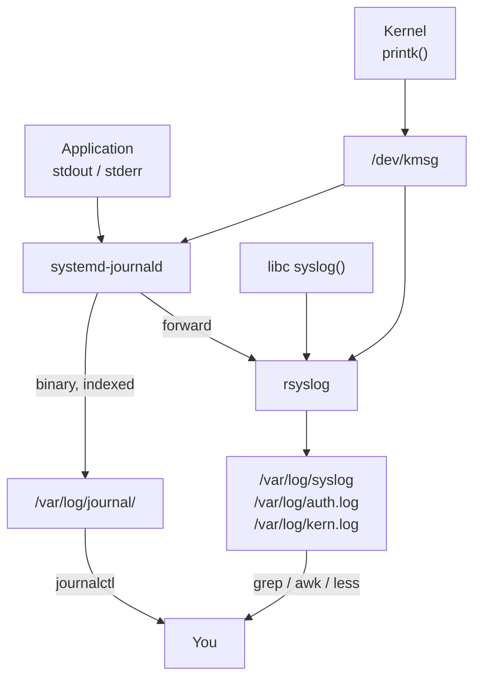

## Table of Contents

1. [Why Logs Are the First Place You Look](#why-logs-are-the-first-place-you-look)
2. [Two Logging Systems, One Machine](#two-logging-systems-one-machine)
3. [Where Logs Actually Live](#where-logs-actually-live)
4. [Syslog Severity Levels](#syslog-severity-levels)
5. [Querying with journalctl](#querying-with-journalctl)
6. [The Kernel Ring Buffer with dmesg](#the-kernel-ring-buffer-with-dmesg)
7. [Rotating Logs with logrotate](#rotating-logs-with-logrotate)
8. [Structured Logging](#structured-logging)
9. [How Logs Break in Production](#how-logs-break-in-production)
10. [Shipping Logs Off the Box](#shipping-logs-off-the-box)
11. [References](#references)

## Why Logs Are the First Place You Look

When a process crashes and restarts before anyone notices, the only artifact left is whatever the system wrote down about itself while it was running. That artifact is the log.

Logs are the black-box recorder of a Linux machine. Every service worth running emits a stream of timestamped messages describing what it tried to do, what it observed, and what went wrong. The kernel does the same for hardware events. systemd does the same for service lifecycles. Get good at logs and most production mysteries become solvable in the time it takes to type a `journalctl` invocation. Stay bad at logs and you spend incidents guessing.

This article covers the two logging systems every modern distribution ships, how to query them efficiently, how to keep them from filling the disk, and the failure modes that bite teams who treat logging as a checkbox.

## Two Logging Systems, One Machine

On Heroku you ran `heroku logs --tail` and got one stream. With Docker you run `docker logs -f web` and get one stream per container. With Kubernetes you run `kubectl logs -f my-pod` and get one stream per pod. The pattern you internalized is simple: one process, one log, one command to read it. A bare Linux server breaks that pattern. There are two different log systems running side by side, both holding mostly the same events, and you need to know which one to ask.

List `/var/log` on a fresh Ubuntu or RHEL box and you will see plain text files like `syslog`, `auth.log`, and `kern.log` sitting next to a binary directory called `journal/`. Both are real, both are being written to right now. Understanding why requires a quick history lesson.

The older system is **syslog**, a protocol from the early 1980s. A background process (the Unix term is **daemon**, basically a long-running service with no terminal attached) listens for messages from the kernel and from any program that calls the `syslog()` function, sorts each message into a category, and writes it to a text file based on rules in `/etc/rsyslog.conf`. Each message gets two labels. The first is the **facility**, which says where the message came from (`auth` for the login system, `cron` for the scheduler, `mail` for the mail server, `kern` for the kernel, `local0` through `local7` for your own apps). The second is the **severity**, which says how loud to scream. The numbering is mostly trivia today, but the facility/severity split is why every modern logging library still has `logger.info(...)` versus `logger.error(...)`. The current implementation of the daemon is `rsyslog`, and on Debian-family distributions it is the one writing those familiar text files.

The newer system is **systemd-journald**. It arrived with systemd in 2010 to fix two problems text logs had outgrown. The first is parsing: when every line is a free-form string, every downstream tool has to guess at structure with regex, and the regex breaks the next time a developer reorders a field. The second is scale. `grep` walking gigabytes of `/var/log/syslog` is acceptable on one box and miserable across a fleet of a hundred, especially when you want to filter by service, priority, and time window simultaneously. journald's answer is to capture the stdout and stderr of every service systemd starts (the same two output streams that `console.log` and `console.error` write to in Node, or that `print()` and `sys.stderr.write()` use in Python), and store entries in a structured binary format under `/var/log/journal/`. Each entry is indexed by metadata fields like the service name (`_SYSTEMD_UNIT`), process ID (`_PID`), user ID (`_UID`), and priority. Because the files are binary, you cannot `grep` them directly. You query them through a dedicated tool called `journalctl`, which trades the universality of text for index lookups that stay fast as the journal grows.

Most distributions run both at once. journald captures everything systemd touches and forwards a copy to rsyslog, which then writes the plain text files. The text files are easy to grep and every Unix tool understands them. The journal preserves structured metadata that text files cannot, and it survives partial corruption better. They are complementary, not competitors.



> A log message that nobody can find is the same as a log message that was never written.

## Where Logs Actually Live

The first time you SSH into an unfamiliar machine during an incident, the file you reach for depends on which family of distribution you landed on. Debian, Ubuntu, and their derivatives keep general system messages in `/var/log/syslog` and authentication events in `/var/log/auth.log`. RHEL, CentOS, Rocky, and Alma keep the same information in `/var/log/messages` and `/var/log/secure`. The contents are equivalent; the filenames diverged decades ago and never reconciled.

Application logs land wherever the application decides to put them. Nginx writes to `/var/log/nginx/`, PostgreSQL to `/var/log/postgresql/`, and most package-managed services follow the same pattern of one subdirectory per service. Anything launched directly by systemd without a custom file destination ends up in the journal and nowhere else, which is why `journalctl -u <service>` is often more reliable than guessing a filename.

| Path | Distribution | Contents |
|------|--------------|----------|
| `/var/log/syslog` | Debian, Ubuntu | General system messages from rsyslog |
| `/var/log/messages` | RHEL, CentOS, Rocky | General system messages from rsyslog |
| `/var/log/auth.log` | Debian, Ubuntu | SSH logins, sudo, PAM authentication |
| `/var/log/secure` | RHEL, CentOS, Rocky | SSH logins, sudo, PAM authentication |
| `/var/log/kern.log` | Debian, Ubuntu | Kernel messages copied from `/dev/kmsg` |
| `/var/log/dmesg` | Both | Kernel ring buffer snapshot at boot |
| `/var/log/journal/` | Both (systemd) | Binary journal, queried with `journalctl` |
| `/var/log/apt/history.log` | Debian, Ubuntu | Package installs, removes, upgrades |
| `/var/log/dnf.log` | RHEL, Fedora | Package installs, removes, upgrades |
| `/var/log/nginx/` | Both | Per-vhost access and error logs (app-specific) |

If `/var/log/journal/` does not exist on a machine, journald is running in **volatile** mode and storing entries under `/run/log/journal/`, which is a `tmpfs` (a filesystem that lives entirely in RAM). That means everything in the journal evaporates on reboot. To make the journal persistent, create the directory and restart the daemon:

```bash
$ sudo mkdir -p /var/log/journal
$ sudo systemd-tmpfiles --create --prefix /var/log/journal
$ sudo systemctl restart systemd-journald
```

Persistent journals are the default on most distributions today, but minimal cloud images and containers often disable them to save space. Check before assuming your post-mortem evidence will outlive a reboot.

## Syslog Severity Levels

If you have ever used a Node logger like Winston or Pino, or Python's `logging` module, you already know `debug`, `info`, `warn`, and `error`. The Sentry dashboard sorts events into the same buckets. Datadog and CloudWatch let you alert on "errors only." The idea that every log line carries a level is universal, and Linux is where the convention came from. Syslog defined eight of these levels in the 1980s, numbered 0 (most urgent) to 7 (most verbose), and every modern logging library inherits the same hierarchy with a slightly different vocabulary.

These levels are not advisory. On a Linux host they drive routing rules in rsyslog, filtering in `journalctl -p`, and the noise floor of every log shipper between your machine and your dashboards. Picking the wrong level when you write application logs is one of the most common sources of alert fatigue.

| Level | Keyword | Meaning | When to use it |
|-------|---------|---------|----------------|
| 0 | `emerg` | System is unusable | Kernel panic, root filesystem unmountable |
| 1 | `alert` | Action must be taken immediately | Database corruption, total auth failure |
| 2 | `crit` | Critical conditions | Hardware failure, primary service down |
| 3 | `err` | Error conditions | Failed request, exception, timeout |
| 4 | `warning` | Warning conditions | Deprecated API, retry succeeded, near limit |
| 5 | `notice` | Normal but significant | Service started, config reloaded, user logged in |
| 6 | `info` | Informational | Routine progress, request completed |
| 7 | `debug` | Debug-level messages | Variable dumps, function entry/exit |

A useful rule of thumb: anything you would wake an engineer up for goes at `crit` or higher. Anything an on-call human should look at within business hours goes at `err`. Anything you only want to see when you are actively investigating goes at `info` or `debug`. If every request your service handles emits a `warning`, your monitoring system will eventually treat all warnings as background noise, and you will miss the real one when it happens.

## Querying with journalctl

Think of `journalctl` as the Linux equivalent of `docker logs` or `kubectl logs`, but for everything systemd manages on the host. Same idea: instead of grepping a file, you ask a tool for the output of one specific service. Where `kubectl logs nginx-pod` gets you the streams from one pod, `journalctl -u nginx` gets you the streams from the nginx service on this machine. The query model is richer because the journal indexes by metadata, but the daily-use shape is familiar.

The tool has dozens of flags and looks daunting at first; a small set covers nearly every real query you will run. The most important habit is to filter early. The journal on a busy host can hold weeks of entries across hundreds of services, and reading all of it interactively is pointless.

Following a service in real time is the equivalent of `docker logs -f` or `tail -f` against a log file:

```bash
$ journalctl -u nginx -f
Apr 19 14:02:11 web-prod-01 nginx[1842]: 10.0.1.52 - - "GET /api/health HTTP/1.1" 200 15
Apr 19 14:02:12 web-prod-01 nginx[1842]: 10.0.1.52 - - "GET /api/health HTTP/1.1" 200 15
Apr 19 14:02:18 web-prod-01 nginx[1842]: 10.0.4.91 - - "POST /v1/orders HTTP/1.1" 502 248
^C
```

Press `Ctrl+C` to stop following. The `-u` flag scopes output to one systemd unit, which is almost always what you want; without it, you get every service interleaved.

Bounding queries by time is the single biggest speedup you can make. The journal accepts both absolute timestamps and relative shorthand:

```bash
$ journalctl -u sshd --since "2026-04-19 13:00" --until "2026-04-19 14:00"
$ journalctl -u sshd --since "1 hour ago"
$ journalctl -u sshd --since yesterday
```

Filtering by severity uses `-p` and accepts either the numeric level or the keyword. A single value means "this severity and worse" (lower numbers are worse), so `-p err` returns errors, criticals, alerts, and emergencies in one query.

```bash
$ journalctl -p err --since "1 hour ago" --no-pager
Apr 19 13:11:04 web-prod-01 myapp[4021]: connection error: refused by db.internal:5432
Apr 19 13:11:04 web-prod-01 myapp[4021]: write error: disk quota exceeded
Apr 19 13:42:18 web-prod-01 nginx[1842]: 10.0.4.91 - - "POST /v1/orders HTTP/1.1" 502 248
```

`-b` scopes to a specific boot. `-b` alone means the current boot; `-b -1` means the previous boot. This is invaluable when a machine crashed and rebooted on its own and you need to see what was happening just before:

```bash
$ journalctl -b -1 -p err
$ journalctl --list-boots
```

`-k` restricts output to kernel messages, equivalent to filtering for the kernel's own facility. JSON output (`-o json` or the prettier `-o json-pretty`) gives you every metadata field the journal recorded, which is what you want when piping into `jq`, a log shipper, or an analysis script:

```bash
$ journalctl -u nginx -n 1 -o json-pretty
{
    "__REALTIME_TIMESTAMP" : "1745067738000000",
    "_HOSTNAME" : "web-prod-01",
    "_SYSTEMD_UNIT" : "nginx.service",
    "SYSLOG_IDENTIFIER" : "nginx",
    "_PID" : "1842",
    "PRIORITY" : "6",
    "MESSAGE" : "10.0.1.52 - - \"GET /api/health HTTP/1.1\" 200 15"
}
```

Here is the working set worth memorizing:

| Flag | Effect |
|------|--------|
| `-u <unit>` | Restrict to one systemd unit |
| `-f` | Follow new entries as they arrive |
| `-n <N>` | Show the last N entries |
| `--since` / `--until` | Bound by time (absolute or relative) |
| `-p <level>` | Filter by severity (this level and worse) |
| `-b` / `-b -1` | Restrict to current or previous boot |
| `-k` | Kernel messages only |
| `-o json` | Emit structured JSON, one entry per line |
| `--no-pager` | Print directly instead of piping into `less` |
| `_PID=<n>` | Match a metadata field exactly |

## The Kernel Ring Buffer with dmesg

When a Node process dies because it ran out of memory, you get a tidy `JavaScript heap out of memory` line in your logs. When a Linux process dies because the whole machine ran out of memory, the kernel killed it, and the kernel does not log to files the way your app does. It cannot, really: opening a file means trusting that the filesystem is healthy and that the disk is not the very thing that just failed. Instead the kernel writes to a small fixed-size area of RAM called a **ring buffer** (a circular queue that overwrites the oldest entries when it fills up). That buffer is exposed as a special file at `/dev/kmsg`, and the command for reading it is `dmesg`.

Both journald and rsyslog drain this buffer into their own stores in the background, so kernel events also show up in `journalctl -k` and in `/var/log/kern.log`. But going to the source matters when you are diagnosing hardware-flavored problems: a disk going bad, a NIC flapping, an out-of-memory kill that took down your container, or USB devices being attached and detached.

```bash
$ dmesg -T | tail -5
[Sat Apr 19 13:58:42 2026] EXT4-fs (sda3): mounted filesystem with ordered data mode
[Sat Apr 19 13:58:43 2026] e1000: ens5 NIC Link is Up 10000 Mbps Full Duplex
[Sat Apr 19 14:01:12 2026] Out of memory: Killed process 4021 (myapp) total-vm:8421MB
[Sat Apr 19 14:01:12 2026] oom_reaper: reaped process 4021 (myapp), now anon-rss:0kB
[Sat Apr 19 14:03:08 2026] systemd[1]: myapp.service: Main process exited, code=killed
```

The `-T` flag converts the kernel's monotonic timestamps (seconds since boot) into human-readable wall-clock time, which is what you almost always want. If you suspect a process was killed by the kernel rather than by your supervisor, `dmesg | grep -i oom` will tell you in one command.

Because the buffer is fixed size, busy systems eventually overwrite old kernel events. Persistent kernel logs live in the journal (`journalctl -k`) or in `/var/log/kern.log` on Debian-family distributions, both of which keep history far beyond what `dmesg` alone shows.

## Rotating Logs with logrotate

A log file that no one rotates grows until the disk is full, and "the disk filled up with logs" is the most boring outage in the catalog: the application is healthy, the network is fine, the database is up, but `/var/log` ate the root partition and now nothing can write. Before tools like `logrotate` existed, the rotation problem was even nastier than it sounds. You could not just rename `app.log` and create a new one, because the application kept writing through its existing file descriptor into the now-renamed old file (more on that quirk in a moment). The only "rotation" that actually worked was to stop the service, move the file, and start it again, which meant downtime every time you cleared logs. `logrotate` exists to solve both halves of that problem in one tool: rename and compress old files on a schedule, then either nudge the application to reopen its file descriptors or copy-and-truncate the file in place so the descriptor stays valid.

`logrotate` is the standard tool for renaming, compressing, and eventually deleting old log files on a schedule. It runs once a day on most distributions, triggered by either a cron job at `/etc/cron.daily/logrotate` or a systemd timer (`logrotate.timer`). The configuration lives in `/etc/logrotate.conf` for global defaults and in `/etc/logrotate.d/<package>` for per-application rules.

A typical per-service configuration looks like this:

```ini
/var/log/myapp/*.log {
    daily
    rotate 14
    compress
    delaycompress
    missingok
    notifempty
    create 0640 myapp myapp
    sharedscripts
    postrotate
        systemctl reload myapp >/dev/null 2>&1 || true
    endscript
}
```

Each directive is doing something specific. `daily` rotates once per day. `rotate 14` keeps the last 14 rotated files and deletes anything older. `compress` gzips rotated files to save space. `delaycompress` leaves the most recently rotated file uncompressed for one cycle, which gives log shippers and tail-readers a window to finish reading before the file format changes. `missingok` skips silently if the log file does not exist. `notifempty` avoids rotating empty files. `create` makes a new empty log file with the right ownership and permissions so the application can keep writing without restarting. `postrotate` runs once after rotation completes, here sending a reload signal so the application reopens its file descriptors.

Why the reload? Because of how Unix files work. When an application opens `/var/log/myapp/app.log`, the kernel hands it a file descriptor (a numeric handle) bound to the underlying inode (the filesystem record for that file), not to the path. If `logrotate` renames `app.log` to `app.log.1` and creates a new empty `app.log`, the application is still happily writing to the old inode through its existing descriptor. The new file stays empty, the old file keeps growing, and no one notices until the disk fills up. Reloading the application forces it to close and reopen the path, picking up the new file. This is the single most common logrotate misconfiguration in the wild.

You can preview what logrotate will do without actually doing it:

```bash
$ sudo logrotate -d /etc/logrotate.d/nginx
reading config file /etc/logrotate.d/nginx
Allocating hash table for state file, size 64 entries
Handling 1 logs
rotating pattern: /var/log/nginx/*.log  weekly (52 rotations)
empty log files are not rotated, log files >= 1048576 are rotated earlier, old logs are removed
```

The journal does not use logrotate; it manages its own retention through `/etc/systemd/journald.conf`. The most useful knobs are `SystemMaxUse=` (cap total journal size on disk), `SystemMaxFileSize=` (cap each individual file before rotation), and `MaxRetentionSec=` (delete entries older than this). After editing the file, restart `systemd-journald` and optionally vacuum old entries by hand:

```bash
$ sudo systemctl restart systemd-journald
$ sudo journalctl --vacuum-size=1G
$ sudo journalctl --vacuum-time=7d
```

## Structured Logging

A traditional log line is a string of free-form text that a human can read and a regex can almost parse. A structured log line is a JSON object with explicit named fields. The difference looks small until you try to answer a question like "show me the p99 latency of POST requests to `/v1/orders` for customer 8421 over the last hour" and realize that nobody ever agreed on what column the customer ID lives in.

Compare two ways of saying the same thing. First, a typical text log:

```text
2026-04-19T14:02:18Z myapp INFO request completed POST /v1/orders 502 248ms customer=8421 trace=abc123
```

Now the structured equivalent:

```json
{"ts":"2026-04-19T14:02:18Z","service":"myapp","level":"info","msg":"request completed","method":"POST","path":"/v1/orders","status":502,"duration_ms":248,"customer_id":8421,"trace_id":"abc123"}
```

The structured version is harder to read at a glance, but every field is unambiguous. Log aggregation systems like Elasticsearch, Loki, Splunk, and Datadog index those fields automatically, so `status:502 AND customer_id:8421` becomes a query you can run in milliseconds across millions of events. With free-form text, you would be writing fragile regexes that break the next time someone reorders the fields.

A few rules of thumb for structured logging that pay off in production:

- Always include a stable identifier for the request (`trace_id` or `request_id`) and propagate it through every downstream call. This is what lets you reconstruct a single user's journey across half a dozen services.
- Use the same field names everywhere. If one service emits `customer_id` and another emits `userId`, you cannot join them in queries. Pick a convention and write it down.
- Log levels still apply. `level: "info"` for routine events, `level: "error"` for failures, `level: "debug"` for things you only want when investigating.
- Never log secrets. Authorization headers, password fields, full credit card numbers, and session tokens should be either omitted or hashed before they hit the logger.

## How Logs Break in Production

Logging looks simple until it fails, and when it fails it tends to fail in the same handful of ways across every team. Recognizing the patterns saves you from learning each one the hard way.

**The disk fills up because a service started screaming.** A bad deploy puts an application into a tight retry loop where every iteration emits a stack trace at `error`. Within hours `/var/log` is full, the database cannot write its WAL (write-ahead log), and unrelated services start failing. The fix during the incident is `sudo truncate -s 0 /var/log/myapp/app.log` rather than `rm`, because `rm` of an open file leaves the disk space allocated until the process closes the descriptor (the same deleted-but-held-open behavior you see in `lsof +L1`). The longer-term fix is monitoring `/var/log` disk usage and rate-limiting the noisy service.

**logrotate runs but the file keeps growing.** As covered above, this is almost always because the application kept its old file descriptor open after rotation. Either add a `postrotate` step that reloads the service, or have the application use `copytruncate` (which copies the file's contents and then truncates the original in place, avoiding the rename entirely). `copytruncate` is simpler but races against writes in flight, so prefer the reload approach when the application supports it.

**The journal is silently corrupted.** Power loss or filesystem damage can leave `/var/log/journal/` in a state where `journalctl` returns nothing or refuses to open files. Run `journalctl --verify` to detect this. Recover by deleting the broken journal files (the next service write recreates them), accepting that you have lost the history they contained.

**Structured logs that nobody parses.** A team adopts JSON logging, ships everything to a log aggregator, and then keeps writing alerts using `grep`-style substring matches on the raw line. The structure is invisible to the queries, so the investment buys nothing. Either commit to query languages that understand the schema (KQL, LogQL, Datadog's query syntax) or do not bother emitting JSON in the first place.

**Sensitive data in logs.** A debug statement someone added during local development logs the entire request body, including authorization headers and PII (personally identifiable information, such as names, email addresses, and government IDs). The logs ship to a third-party SaaS that now contains data your compliance team did not authorize to be there. Audit log output before merging, scrub at the application layer for anything that looks like a token or a credit card, and treat your log aggregator as a data store with its own access controls.

**The journal is volatile and you lose evidence on reboot.** Covered earlier; check `/var/log/journal/` exists on every host where you might want post-mortem evidence.

## Shipping Logs Off the Box

When you used Heroku, you never thought about where logs lived. You ran `heroku logs --tail` from your laptop and the platform showed you a unified stream from every dyno, even ones that had crashed and been recycled. When you wired Sentry into your app, exceptions kept showing up on the dashboard even after the process that threw them was long gone. That experience is what running real Linux servers does not give you for free. Local logs die with the host. If a server crashes, gets terminated by the autoscaler, or is destroyed during an incident, anything sitting only in its own `/var/log` is gone with it.

**Centralized logging** is the practice that recreates the Heroku-or-Sentry experience on your own infrastructure: forward log streams from every host to a dedicated aggregation system, so the evidence outlives the producer and so you can correlate events across an entire fleet from one query interface.

The mechanism varies by platform but the shape is always the same: a small agent process on each host reads local logs (text files, the journal, or both) and ships them over the network to a central store. On AWS, the CloudWatch Logs agent reads files and the journal and forwards entries to CloudWatch log groups. Datadog and Splunk ship their own agents (`datadog-agent`, the Splunk Universal Forwarder) that do the same job into their respective backends. The open-source equivalents are Fluent Bit, Vector, and Promtail, which all feed into stores like Loki, Elasticsearch, or anywhere else you can point them.

Containers change the picture slightly. Docker captures each container's stdout and stderr through a logging driver; the default is `json-file`, which writes one JSON object per line into `/var/lib/docker/containers/<id>/<id>-json.log`. Alternative drivers like `journald`, `awslogs`, and `gelf` send the same stream straight to a remote system without ever touching local disk. Kubernetes builds on top of this: the kubelet expects every container to log to stdout and stderr, captures the streams via the container runtime, and exposes them through `kubectl logs`. A node-level daemon (commonly Fluent Bit or Vector running as a DaemonSet) tails the per-container files under `/var/log/pods/` and forwards them to a cluster-wide store.

For traditional Linux hosts that are not containerized, rsyslog itself can forward natively. A single rule in `/etc/rsyslog.d/50-remote.conf` ships every message to a central collector over TCP:

```ini
# Forward everything to the central log host over TCP (the @@ prefix means TCP; @ means UDP)
*.* @@logserver.internal:514

# Forward only authentication events
auth,authpriv.* @@logserver.internal:514
```

Whichever path you choose, two rules apply. First, ship the structured form whenever possible: a JSON line into Loki indexes far better than a free-form line. Second, do not rely on the local files as your only retention. Treat them as a short-term buffer; the system of record lives in the central store.

---

**References**

- [journalctl(1)](https://man7.org/linux/man-pages/man1/journalctl.1.html) - Authoritative reference for every journalctl flag, filter expression, and output format.
- [systemd-journald.service(8)](https://man7.org/linux/man-pages/man8/systemd-journald.service.8.html) - Daemon documentation covering storage layout, retention configuration, and forwarding behavior.
- [rsyslog Documentation](https://www.rsyslog.com/doc/master/index.html) - Official rsyslog manual including configuration syntax, modules, and remote-forwarding setup.
- [logrotate(8)](https://man7.org/linux/man-pages/man8/logrotate.8.html) - Man page describing every directive available in `/etc/logrotate.conf` and per-package rule files.
- [RFC 5424 - The Syslog Protocol](https://datatracker.ietf.org/doc/html/rfc5424) - The IETF specification defining facilities, severities, and the on-the-wire syslog format.
- [dmesg(1)](https://man7.org/linux/man-pages/man1/dmesg.1.html) - Man page for reading and controlling the kernel ring buffer.
