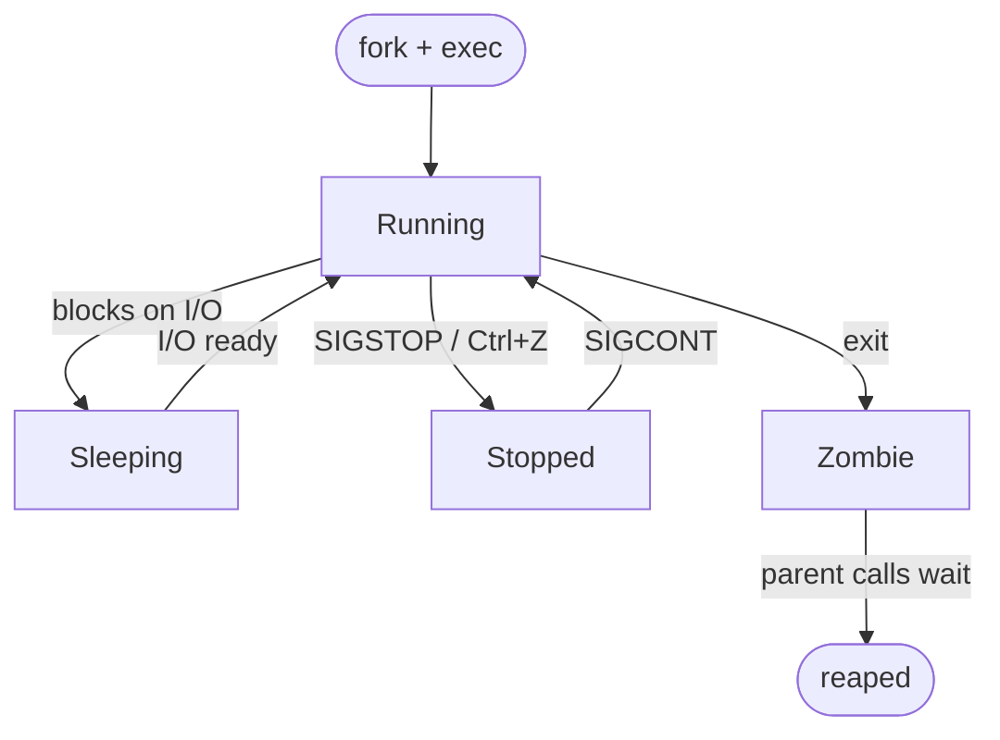

## Table of Contents

1. [What a Process Actually Is](#what-a-process-actually-is)
2. [The Lifecycle: fork, exec, wait, exit](#the-lifecycle-fork-exec-wait-exit)
3. [PIDs, PPIDs, and the Process Tree](#pids-ppids-and-the-process-tree)
4. [Inspecting Processes with ps, top, and htop](#inspecting-processes-with-ps-top-and-htop)
5. [Signals: How Everything Talks to a Process](#signals-how-everything-talks-to-a-process)
6. [Job Control and Background Tasks](#job-control-and-background-tasks)
7. [Priority and the Nice Value](#priority-and-the-nice-value)
8. [The /proc Filesystem: Live Introspection](#the-proc-filesystem-live-introspection)
9. [Failure Modes: Zombies, Orphans, Runaways, and the OOM Killer](#failure-modes-zombies-orphans-runaways-and-the-oom-killer)

## What a Process Actually Is

You start a Python script, refresh a web page, and run `ls`. From your point of view, three completely different things just happened. From the kernel's point of view, three nearly identical things just happened: in each case a new **process** was created, given some memory, handed a CPU slice, and eventually retired. Process management is the part of Linux that makes those three actions look the same from the outside while keeping them isolated on the inside.

Think of a program as a recipe sitting in a cookbook on disk: it is just text, it does not do anything on its own. A process is what happens when somebody actually picks up the book and starts cooking. If you have run `node app.js`, the `app.js` file is the recipe and the running Node process is the meal being prepared. The kernel is the kitchen: it loads the recipe into RAM, sets up the ingredients (memory, open files, the current working directory), and gives the process a turn at the stove.

One piece of vocabulary worth pinning down early, because it shows up everywhere: a **file descriptor** is the kernel's way of giving a process a handle to something it has opened. Every time a process opens a file, a network socket, or a pipe, the kernel hands back a small integer (`0`, `1`, `2`, `3`, ...) and the process uses that integer for all later reads and writes. It is the same idea as the number returned by `open()` in C, or the internal handle behind a Python `file` object, or the numeric `fd` you get from Node's `fs.openSync`. By tradition, every process starts life with three of them already open: `0` for stdin, `1` for stdout, `2` for stderr.

Linux gives every process its own virtual address space, its own file descriptor table, its own current working directory, and its own copy of environment variables. Two processes started from the same binary (say, two `nginx` workers) cannot see each other's memory unless they explicitly arrange to share it. This isolation is the bedrock that everything else (containers, services, multi-user systems) is built on top of.

The reason you need to care about process management as an operator is simple: when a system misbehaves, the symptom is almost always a process. Either the wrong process is running, the right process is using too much memory, a process refuses to exit, or a process exited when you expected it to stay up. Every diagnosis starts with "what is actually running, and what is it doing?"

## The Lifecycle: fork, exec, wait, exit

When you type `ls` and hit enter in your shell, something has to actually start that `ls` program. The way Linux does this is genuinely weird the first time you see it, but it makes sense once you know the trick. Linux never creates a brand-new process from scratch. Instead, it always clones an existing one and lets the clone transform itself into something else.

Why clone instead of just creating a fresh process? Because the two-step fork-then-exec split lets the child inherit the parent's entire environment (open file descriptors, environment variables, working directory) and then selectively modify it *between* the fork and the exec. That gap is how the shell implements I/O redirection and pipes: when you type `ls > output.txt`, the shell forks, the child redirects its stdout to `output.txt`, and *then* execs `ls`. A single "create a new process running program X" call would need an enormous parameter list to express every possible environmental tweak. The fork model also comes nearly free thanks to copy-on-write (COW): the kernel does not actually duplicate the parent's memory pages at fork time; it shares them and only copies a page when one side writes to it.

The cloning step is a system call called **`fork`**. When the shell calls `fork`, it splits into two nearly-identical copies of itself. Both copies have the same code, the same variables, the same open files. The only difference: each one knows whether it is the original (the "parent") or the clone (the "child"). Think of it like calling `Object.assign({}, currentProcess)` and getting back a duplicate that runs alongside you. The weird part of the API is that one function call returns twice, once in each copy: the parent gets back the child's PID, the child gets back `0`. Both then continue from the very next line, independently.

Now the child has to actually become `ls`. That is what the second system call, **`exec`**, does. `exec` is like wiping a process's brain and giving it a new program: same process slot, same PID, but everything inside (the code, the memory) gets replaced with whatever binary you point it at, like `/usr/bin/ls`. After `exec` returns, the child IS the `ls` program. The parent shell, meanwhile, just sits there waiting for the child to finish so it can show you the prompt again. Every single command you type at a shell prompt goes through this same fork-then-exec dance.

"Waiting" sounds passive but it has a specific meaning here. When the `ls` process is done printing its output, it does not just vanish. It hangs around in a kind of half-dead state called a **zombie**, holding onto a tiny piece of information: its exit code (was the command successful or did it fail?). The parent shell calls another system call, **`wait`**, to read that exit code. Only after the parent reads it does the kernel actually clean up the dead process and free its slot in the process table. Reading the child's exit code like this is called **reaping** the child, and it is the parent's job. If the parent forgets, the zombie just sits there forever; more on that in the failure section.

If you have written async JavaScript, this should feel familiar. A `Promise` resolves with a value, and you have to actually `await` it for the value to become useful. A child process exits with a code, and the parent has to actually `wait` for it for the code to be collected. Same pattern, different layer.

> Every process has a story to tell when it dies. `wait` is how the parent listens.



That exit code is not just trivia. It is the only piece of information a process can hand back to its parent without going through a pipe or a file. By convention `0` means success and anything from `1` to `255` means failure, and every ecosystem you already know wraps the same kernel call: Node's `process.exit(1)`, Python's `sys.exit(2)`, Go's `os.Exit(code)`. Shell scripts read the most recent exit code through the special variable `$?`, which is what makes constructs like `command && echo ok || echo failed` work.

## PIDs, PPIDs, and the Process Tree

Now that processes are appearing and disappearing constantly, the kernel needs a way to refer to a specific one. That is what a **PID** (process ID) is: a number the kernel hands out at `fork` time, unique at any given moment, much like a primary key in a database table. When you run `kill 5790`, the `5790` is a PID. When `top` lists rows of running programs, the `PID` column is what tells them apart.

A flat list of PIDs would not be very useful on its own, because it would not tell you who started what. So every process also remembers a second number, its **PPID** (parent process ID): the PID of whoever called `fork` to create it. Following PPIDs upward turns the flat list of running processes into a tree.

PID 1 is special. It is the first user-space process the kernel starts at boot, and it lives at the root of the tree. On modern distributions PID 1 is **systemd**; on minimal containers it might be your application directly, or a tiny init like `tini`. PID 1 has two essential responsibilities: starting and supervising the rest of the system's services, and adopting orphans. When a process dies before its children, those children would otherwise have a dangling parent, so the kernel reassigns their PPID to 1. This is why `pstree` always shows a tree rooted at one node. The structure is a real invariant, not a display convention.

```bash
$ pstree -p | head -20
systemd(1)─┬─NetworkManager(742)─┬─{NetworkManager}(768)
           │                     └─{NetworkManager}(771)
           ├─cron(812)
           ├─dbus-daemon(815)
           ├─sshd(889)───sshd(2104)───sshd(2118)───bash(2119)───pstree(2841)
           ├─systemd-journal(412)
           ├─systemd-logind(821)
           ├─nginx(1841)─┬─nginx(1842)
           │             └─nginx(1843)
           └─postgres(2104)─┬─postgres(2110)
                            ├─postgres(2111)
                            └─postgres(2112)
```

Reading that output left-to-right gives you the parent-child chain. Your interactive shell exists because `sshd` accepted your connection, forked, and exec'd into another `sshd`, which forked and exec'd into `bash`, which forked and exec'd into `pstree`. Every command you type adds a new branch.

Containers add a twist worth knowing about. A container does not have its own kernel (it shares the host's kernel), but it gets its own **PID namespace**. Inside the namespace, the first process the runtime starts gets PID 1 and its own private process tree. From the host, the same process has a completely different PID. So `kill 1` inside a container only signals the container's main process; from the host you would target a much larger PID.

PID 1 is also signal-special in a way that bites containers hard. The kernel will not deliver a signal to PID 1 unless that process has explicitly installed a handler for it. So a shell script running as PID 1 ignores `SIGTERM` by default, and the container takes the full grace period before being `SIGKILL`'d on shutdown. Worse, most shells do not forward signals to the children they spawn, so even if PID 1 catches `SIGTERM`, the actual workload underneath never hears about it. The two fixes are to use a tiny init like `tini` (which reaps zombies and forwards signals correctly), or to launch the workload with `exec` from your entrypoint script so the workload itself becomes PID 1 and can install its own handlers.

## Inspecting Processes with ps, top, and htop

`ps` is your snapshot tool. It prints the process table once and exits. There are two old, incompatible argument styles (BSD and SysV) that everyone mixes freely. The combination most people memorize is `ps aux`:

```bash
$ ps aux
USER         PID %CPU %MEM    VSZ   RSS TTY      STAT START   TIME COMMAND
root           1  0.0  0.1 169572 13280 ?        Ss   Apr09   2:14 /usr/lib/systemd/systemd
root           2  0.0  0.0      0     0 ?        S    Apr09   0:00 [kthreadd]
www-data    1842  0.2  1.4 214856 58432 ?        S    10:03   0:45 nginx: worker process
postgres    2110  0.1  2.3 398712 94208 ?        Ss   Apr09   5:22 postgres: main
deploy      5790  0.0  0.0  11284  3412 pts/0    R+   14:32   0:00 ps aux
```

The columns repay close reading. **VSZ** is virtual memory size, the total address space the process has reserved, most of which may never actually touch RAM. **RSS** (resident set size) is the actual physical memory currently in use, and it is almost always the number you care about.

The **STAT** column tells you what the process is doing right now. Most of the time you will see `S` (sleeping, waiting for something like a network response or a timer) or `R` (running or ready to run on a CPU). The one that should make you look twice is `D`, uninterruptible sleep: the process is stuck waiting on disk or hardware I/O and cannot be interrupted, even by signals. A handful of `D` processes during a burst of disk activity is normal; a screen full of them means something in the I/O subsystem is stuck. `Z` marks a zombie (already exited, waiting for its parent to collect the exit code, as described in the lifecycle section above), and `T` means the process was stopped, usually by `Ctrl+Z`. Trailing characters add context: `s` marks a session leader, `+` means it is in the foreground process group, `<` flags high priority, and `N` flags low priority.

A process name in square brackets like `[kthreadd]` means it is a **kernel thread**, not a real user-space process at all but a worker the kernel runs on its own behalf. They show up in `ps` for completeness; you cannot kill them and you should not try.

For continuous observation, `top` is on every system and `htop` is what you actually want. `top` updates in place and supports interactive sorting (`P` for CPU, `M` for memory, `T` for time). `htop` adds color, mouse support, tree view, scrollable lists, and per-process signal sending from a menu.

```bash
$ top -b -n 1 | head -10
top - 14:32:07 up 7 days,  3:18,  2 users,  load average: 1.24, 0.98, 0.87
Tasks: 214 total,   1 running, 213 sleeping,   0 stopped,   0 zombie
%Cpu(s): 12.3 us,  3.1 sy,  0.0 ni, 82.4 id,  1.8 wa,  0.0 hi,  0.4 si,  0.0 st
MiB Mem :  15926.4 total,   1124.8 free,   6348.2 used,   8453.4 buff/cache
MiB Swap:   4096.0 total,   3968.0 free,    128.0 used.   9412.6 avail Mem

    PID USER      PR  NI    VIRT    RES    SHR S  %CPU  %MEM     TIME+ COMMAND
   2110 postgres  20   0  398712  94208  22016 S   3.3   0.6   5:22.41 postgres
   1842 www-data  20   0  214856  58432  10240 S   1.7   0.4   0:45.18 nginx
   3891 deploy    20   0 1248576 312048  28672 S   1.0   1.9  12:07.33 java
```

The header line is its own diagnostic dashboard. **Load average** is the rolling average number of processes in the runnable or uninterruptible-sleep states over the last 1, 5, and 15 minutes. On a machine with N CPU cores, sustained load above N means you have more work than the CPUs can keep up with. The `%Cpu(s)` line breaks CPU time into user (`us`), kernel (`sy`), nice'd (`ni`), idle (`id`), waiting on I/O (`wa`), and stolen by the hypervisor (`st`). Persistent high `wa` means your bottleneck is disk; persistent high `st` on a VM means a noisy neighbor on the same host.

When you need to find one specific process, two patterns cover almost everything:

```bash
$ pgrep -a nginx
1841 nginx: master process /usr/sbin/nginx
1842 nginx: worker process
1843 nginx: worker process

$ ps aux | grep '[n]ginx'
root      1841  0.0  0.3 141112 12288 ?        Ss   10:03   0:00 nginx: master
www-data  1842  0.2  1.4 214856 58432 ?        S    10:03   0:45 nginx: worker
www-data  1843  0.2  1.5 215120 60224 ?        S    10:03   0:42 nginx: worker
```

The `[n]ginx` trick exploits the fact that `grep` itself shows up in the process list and would otherwise match its own command line. The brackets make the regex match `nginx` while the literal string `[n]ginx` (which is what shows up in `ps`) does not match it. `pgrep` is the cleaner modern equivalent.

## Signals: How Everything Talks to a Process

Despite the name, `kill` is not really about killing. It is the command for sending **signals**, and most signals are not lethal. A signal is a small numeric message the kernel delivers asynchronously to a process. Think of it as the kernel walking up to the process, tapping it on the shoulder, and saying a single word. The process can choose to handle each signal with custom logic, ignore it, or fall back to the default behavior the kernel defines for that signal.

The reason signals are this primitive (a number, not a structured message with a payload) is historical and practical. Early Unix had to deliver them on machines with kilobytes of RAM, where a richer IPC mechanism would have been an extravagance, so a signal got squeezed down to a single small integer the kernel could store as one bit in a per-process bitmask. That constraint stuck, and it turned out to be a feature: because a signal carries no data, the kernel can deliver one to any process from any context (another process, an interrupt handler, a fatal page fault) without allocating memory or blocking. The cost is that signals are a doorbell, not a telephone. They tell a process *that* something happened, not *what*; if you need to send actual data, signals are the wrong tool and you want a pipe, a socket, or shared memory instead.

A few signals are not optional. `SIGKILL` (9) and `SIGSTOP` (19) cannot be caught, blocked, or ignored. Everything else can be intercepted by the process with a signal handler. That is how a Node app cleanly drains connections on shutdown, how `nginx` reloads its config without dropping requests, and how a Python program prints "Goodbye" before exiting on `Ctrl+C`.

| Signal | Number | Default | Typical Use |
|--------|--------|---------|-------------|
| `SIGHUP` | 1 | terminate | Tell a daemon to reload its configuration |
| `SIGINT` | 2 | terminate | What `Ctrl+C` sends; interrupt and exit |
| `SIGQUIT` | 3 | terminate + core | What `Ctrl+\` sends; exit and dump core |
| `SIGKILL` | 9 | terminate | Force kill, cannot be caught or ignored |
| `SIGTERM` | 15 | terminate | Polite shutdown request, the default for `kill` |
| `SIGSTOP` | 19 | stop | Pause the process, cannot be caught |
| `SIGTSTP` | 20 | stop | What `Ctrl+Z` sends; pause and return to shell |
| `SIGCONT` | 18 | continue | Resume a stopped process |
| `SIGUSR1` / `SIGUSR2` | 10 / 12 | terminate | Whatever the application defines (often log rotation) |
| `SIGCHLD` | 17 | ignore | Sent to a parent when one of its children exits |

The two signals you will send by hand most often are `SIGTERM` and `SIGKILL`, in that order:

```bash
$ kill 5790                  # sends SIGTERM (15) by default
$ kill -TERM 5790            # explicit, same thing
$ kill -9 5790               # SIGKILL, last resort
$ kill -HUP $(pidof nginx)   # tell nginx master to reload config
$ pkill -USR1 -x rsyslogd    # log rotation by name
```

The pattern is always: try `SIGTERM` first, give the process a few seconds to shut down cleanly, and only escalate to `SIGKILL` if it ignores you. `SIGTERM` lets the process finish in-flight work, flush buffers, and close sockets. `SIGKILL` rips it out of the run queue mid-instruction; any data the process had not yet written to disk is gone. A long-running service that needs `SIGKILL` to die is a bug, not a feature.

Other ecosystems expose the same primitives. Python has `os.kill(pid, signal.SIGTERM)` and registers handlers with `signal.signal(...)`. Node's `process.kill(pid, 'SIGTERM')` sends it, and `process.on('SIGTERM', handler)` catches it. Container orchestrators like Kubernetes send `SIGTERM` first and wait for `terminationGracePeriodSeconds` before falling back to `SIGKILL`, exactly the same pattern, just automated.

Two failure patterns to watch for. First, a process stuck in **uninterruptible sleep** (the `D` state) cannot be killed even with `SIGKILL`, because the kernel will only deliver signals at certain safe points and a `D`-state process is past all of them. The fix is to clear whatever I/O it is waiting on, not to send more signals. Second, a process can install a `SIGTERM` handler that does nothing or even deliberately ignores the signal. If `kill` returns immediately but the process is still running 30 seconds later, escalate to `SIGKILL`.

## Job Control and Background Tasks

Every interactive shell maintains a small bookkeeping table of **jobs**: commands you started from that shell that are still running. Job control is the set of mechanisms that let you suspend, resume, foreground, and background those jobs without opening another terminal. It predates tabs and tmux by decades, and it is still the fastest way to juggle two or three commands in a single shell.

```bash
$ ./long-build.sh &
[1] 12345

$ vim notes.md
# press Ctrl+Z to suspend vim
[2]+  Stopped                 vim notes.md

$ jobs -l
[1]-  12345 Running                 ./long-build.sh &
[2]+  12400 Stopped                 vim notes.md

$ fg %2          # back to vim
$ bg %1          # would resume job 1 in the background
```

`&` at the end of a command starts it in the background immediately. `Ctrl+Z` sends `SIGTSTP` to the foreground process, which the shell catches and uses to mark the job as stopped. `bg %N` sends `SIGCONT` and lets the job continue without tying up the terminal. `fg %N` brings a job back to the foreground and reconnects its standard input to your keyboard. The `+` in `jobs` output marks the "current" job (the one `fg` and `bg` default to); the `-` marks the "previous" one.

The catch with backgrounded jobs is that they are still children of your shell. When you log out, the shell exits, sends `SIGHUP` to all of its children, and the background jobs die with it. There are two escape hatches. `nohup` runs a command with `SIGHUP` ignored from the start and redirects its output to `nohup.out`. `disown` removes an already-running job from the shell's job table so the shell will not signal it on logout.

```bash
$ nohup ./server.sh > server.log 2>&1 &
[1] 4821
nohup: ignoring input and appending output to 'nohup.out'

$ ./already-running.sh &
[2] 4830
$ disown %2
```

For anything you actually want to keep running across logouts, neither approach is the right answer. Use a service manager (`systemd` on most Linux distros) for production workloads and a terminal multiplexer (`tmux` or `screen`) for interactive sessions you need to detach from and reconnect to later. `nohup` exists for the in-between case: a one-off task on a remote box where your SSH session might drop and you do not want to set up anything more elaborate.

## Priority and the Nice Value

Linux schedules processes onto CPUs roughly in proportion to their priority. The user-visible knob for that priority is the **nice value**, which runs from -20 (most aggressive, hogs CPU) to 19 (least aggressive, yields to everything). The default for any new process is 0. The unintuitive name comes from the convention that a high nice value means the process is being "nice" to others by demanding less.

```bash
$ nice -n 15 tar czf backup.tar.gz /var/log
# Same as starting it normally, then:

$ ps -o pid,ni,comm -p 7841
    PID  NI COMMAND
   7841  15 tar

$ renice -n 5 -p 7841
7841 (process ID) old priority 15, new priority 5
```

Only root can lower a process's nice value (give it more priority). Any user can raise it. This asymmetry exists so that a user cannot launch a CPU-hungry process at higher priority than the system's own daemons.

For I/O-bound work, the nice value barely matters. Disk and network throughput are not divided up by CPU priority. The companion tool `ionice` controls **I/O priority** under the CFQ and BFQ I/O schedulers and is the right knob for things like backups, log compression, or rsync runs that you want to keep out of the way of latency-sensitive services.

```bash
$ ionice -c 3 rsync -a /data /backup
# class 3 = idle: only get I/O when nothing else needs the disk
```

In practice you reach for `nice` and `ionice` only when you cannot solve the problem with proper resource isolation. On a system running containers or systemd units, **cgroups** (control groups, the kernel feature that lets you cap CPU shares, memory, and I/O bandwidth per group of processes) are a more reliable answer. `nice` is the duct-tape version that works on every box without configuration.

## The /proc Filesystem: Live Introspection

In most languages, when you want to know something about a running program, you call an API: Node has `process.memoryUsage()`, Python has the `os` and `psutil` modules, the browser has `performance.now()`. Linux gives you something stranger and (once you get used to it) much friendlier. Every fact about every running process is exposed as a fake file you can read with `cat`. The directory those fake files live in is called **`/proc`**.

"Fake" is the right word. `/proc` does not exist on disk anywhere. The kernel pretends there are files there, and every time you read one, the kernel makes up the answer on the spot and formats it as text. This means the introspection API is just the standard Unix toolbox: `cat` to read, `grep` to filter, `awk` to slice, redirection to log. There is nothing extra to learn.

Each running process gets its own subdirectory named after its PID, like `/proc/1842/`. There is also a magic symlink at `/proc/self/` that always points to the directory of whichever process happens to be reading it, which lets a program introspect itself without first looking up its own PID.

```bash
$ ls /proc/1842/
attr        comm             environ   io        maps       net        oom_score   smaps    statm    timers
cgroup      cpuset           exe       limits    mem        ns         personality stack    status   wchan
clear_refs  cwd              fd        loginuid  mountinfo  numa_maps  root        stat     syscall

$ cat /proc/1842/cmdline | tr '\0' ' '
nginx: worker process

$ readlink /proc/1842/exe
/usr/sbin/nginx

$ readlink /proc/1842/cwd
/

$ ls -l /proc/1842/fd
lr-x------ 1 www-data www-data 64 Apr 16 10:03 0 -> /dev/null
l-wx------ 1 www-data www-data 64 Apr 16 10:03 1 -> /var/log/nginx/access.log
l-wx------ 1 www-data www-data 64 Apr 16 10:03 2 -> /var/log/nginx/error.log
lrwx------ 1 www-data www-data 64 Apr 16 10:03 3 -> 'socket:[48291]'
l-wx------ 1 www-data www-data 64 Apr 16 10:03 6 -> /var/log/nginx/error.log
lrwx------ 1 www-data www-data 64 Apr 16 10:03 9 -> 'socket:[48305]'
```

A few of these files are worth memorizing. `/proc/<pid>/cmdline` shows how the process was launched, with arguments separated by null bytes (which is why the `tr` is needed to make it readable). `/proc/<pid>/exe` is a symlink to the binary the process is actually running, useful when the binary on disk has been replaced or deleted but the process is still using the old version. `/proc/<pid>/cwd` is a symlink to its current working directory. `/proc/<pid>/fd/` lists every open file descriptor with a symlink to the underlying file or socket; this is how you find out which log file a stuck process is writing to, or which socket it has open.

```bash
$ cat /proc/1842/status | head -15
Name:   nginx
Umask:  0022
State:  S (sleeping)
Tgid:   1842
Pid:    1842
PPid:   1841
Uid:    33      33      33      33
Gid:    33      33      33      33
FDSize: 64
Groups: 33
VmPeak:   214856 kB
VmSize:   214856 kB
VmRSS:     58432 kB
RssAnon:   28160 kB
RssFile:   30272 kB
```

`/proc/<pid>/status` is the human-readable summary that `ps` parses behind the scenes. `/proc/<pid>/limits` shows the resource limits applied to the process (max open files, max RAM, max processes). When a long-running daemon mysteriously starts failing to open new sockets, `cat /proc/$(pidof daemon)/limits | grep -i 'open files'` is usually the first thing to check.

`/proc` also has system-wide entries: `/proc/loadavg` for load averages, `/proc/meminfo` for memory, `/proc/cpuinfo` for CPU details, `/proc/mounts` for active mounts. Tools like `ps`, `top`, `free`, and `uptime` are mostly pretty-printers around these files.

## Failure Modes: Zombies, Orphans, Runaways, and the OOM Killer

Processes fail in characteristic ways. Knowing the shape of each failure mode is what lets you skip the trial-and-error stage during an incident.

**Zombie storms.** A zombie is a process that has exited but whose parent has not called `wait()` to collect its exit code. The zombie itself uses almost no resources (just a slot in the kernel's process table), but the table is finite (the limit is in `/proc/sys/kernel/pid_max`, often around 4 million on modern systems). A handful of zombies is normal during transient races; thousands of zombies under one parent means that parent has a bug. You cannot kill a zombie, because it is already dead. The fix is always to fix the parent: either make it call `wait()` properly, or restart it so the kernel re-parents the zombies to PID 1, which reaps them automatically.

```bash
$ ps aux | awk '$8 ~ /Z/'
deploy   8421  0.0  0.0      0     0 ?        Z    13:02   0:00 [worker] <defunct>
deploy   8422  0.0  0.0      0     0 ?        Z    13:02   0:00 [worker] <defunct>
deploy   8423  0.0  0.0      0     0 ?        Z    13:02   0:00 [worker] <defunct>

$ ps -o pid,ppid,stat,comm -p 8421
    PID    PPID STAT COMMAND
   8421    8400 Z    worker <defunct>
# PID 8400 is the parent. That is the process to investigate.
```

**Orphans.** An orphan is the opposite case: a child whose parent died first. Orphans are not a problem on a normal system, because the kernel re-parents them to PID 1, and PID 1's job description includes reaping them. The reason orphans matter is when a containerized application uses a shell as PID 1. Most shells were not written to act as init and do not reap children, so orphaned grandchildren inside the container become permanent zombies. The fix is to use a real init like `tini` or run the application directly as PID 1 with `exec`.

There is one escape hatch worth knowing about. A parent can install `SIG_IGN` (or set the `SA_NOCLDWAIT` flag) for `SIGCHLD`, which tells the kernel "I will never call `wait()`, please reap children automatically." After that, exiting children skip the zombie state entirely and a later `wait()` call returns `ECHILD` instead of an exit code. This is how some long-running daemons sidestep the reaping problem when they spawn fire-and-forget helpers. It is the right fix only when the parent genuinely does not need its children's exit codes; otherwise it silently throws away every failure signal.

**Runaway processes.** A process pinned at 100% CPU is sometimes legitimately busy and sometimes stuck in a tight loop. `top -p <pid>` confirms whether the CPU usage is sustained. To find out what it is actually doing, attach `strace` to inspect its system calls or `perf top -p <pid>` to sample where it is spending CPU time. If the process is yours to fix, that information goes back to the developer. If it is not, `renice` it out of the way and `kill -TERM` it during the next maintenance window.

```bash
$ strace -p 5421 -c       # summarize syscalls for a few seconds, then Ctrl+C
^C% time     seconds  usecs/call     calls    errors syscall
------ ----------- ----------- --------- --------- ----------------
 99.87    4.823412         482     10003           epoll_wait
  0.08    0.003821           3      1024           read
  0.05    0.002104           2       912           write
```

**Signals that get ignored.** A process can install handlers for `SIGTERM`, `SIGHUP`, and almost everything else. If `kill -TERM` does not bring it down, check `/proc/<pid>/status` for the `SigCgt` (caught) and `SigIgn` (ignored) bitmasks. They tell you which signals the process has chosen to handle. `SIGKILL` and `SIGSTOP` cannot be caught, blocked, or ignored, which is why they are the last-resort tools.

**The OOM killer.** When the system runs out of memory, the kernel's **out-of-memory killer** picks a process to terminate so that the rest of the system can keep running. The selection is a heuristic based on memory use, lifetime, and a per-process `oom_score_adj` value. When this happens, the killed process simply disappears as if someone had run `kill -9`, and the only record is in `dmesg` or the system journal:

```bash
$ dmesg -T | grep -i 'killed process'
[Wed Apr 16 03:14:22 2026] Out of memory: Killed process 4821 (java) total-vm:8421120kB, anon-rss:7912448kB, file-rss:0kB, shmem-rss:0kB, UID:1001 pgtables:15824kB oom_score_adj:0
```

If a service mysteriously vanishes and its supervisor restarts it every few hours, OOM is the first thing to rule out. The fix is either to give the process more memory, lower its consumption, or set `oom_score_adj` to protect critical processes (the kernel will prefer to kill anything with a higher score). On systemd-managed services, `OOMScoreAdjust=` in the unit file is the supported way to set it.

The thread connecting all of these failures is the same: every weird process behavior is observable somewhere: in `/proc`, in `dmesg`, in `ps` state codes, in the parent's logs. The job of process management is mostly knowing where to look.

---

**References**

- [signal(7) - Overview of Signals](https://man7.org/linux/man-pages/man7/signal.7.html) - The canonical reference for every signal, its default action, and which signals can or cannot be caught.
- [proc(5) - The /proc Filesystem](https://man7.org/linux/man-pages/man5/proc.5.html) - Comprehensive man page for every file under `/proc`, including all of `/proc/<pid>/`.
- [ps(1) - Process Status](https://man7.org/linux/man-pages/man1/ps.1.html) - Full documentation of `ps` flags in both BSD and SysV styles, including every column code.
- [fork(2) - Create a Child Process](https://man7.org/linux/man-pages/man2/fork.2.html) - Kernel man page describing the semantics of `fork()` and how PIDs and PPIDs are assigned.
- [sched(7) - Linux Scheduler Overview](https://man7.org/linux/man-pages/man7/sched.7.html) - Kernel documentation for scheduling policies, nice values, and real-time priorities.
- [Linux Kernel: Out-of-Memory Management](https://www.kernel.org/doc/gorman/html/understand/understand016.html) - Kernel docs explaining how the OOM killer scores and selects processes.
