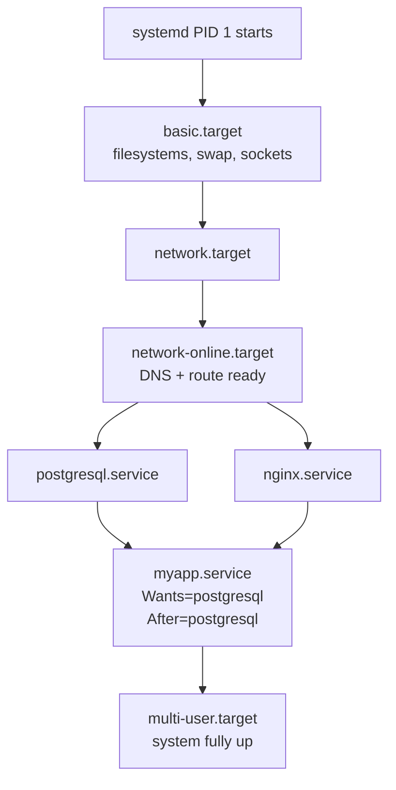

## Table of Contents

1. [Why an Init System Exists](#why-an-init-system-exists)
2. [systemctl: Verbs You Will Type Every Day](#systemctl-verbs-you-will-type-every-day)
3. [Anatomy of a Unit File](#anatomy-of-a-unit-file)
4. [Service Types and What "Active" Means](#service-types-and-what-active-means)
5. [Dependencies, Ordering, and Targets](#dependencies-ordering-and-targets)
6. [Reading Logs with journalctl](#reading-logs-with-journalctl)
7. [Timers: cron Without the Footguns](#timers-cron-without-the-footguns)
8. [Restart Policies and Resource Limits](#restart-policies-and-resource-limits)
9. [Failure Modes You Will Hit](#failure-modes-you-will-hit)

## Why an Init System Exists

If you have ever run `docker-compose up`, you have used an init system without knowing it. Compose reads your `docker-compose.yml`, figures out which containers depend on which others, starts them in the right order, restarts them if they crash, and pipes their output somewhere you can read it. Take that exact same job and apply it to a whole Linux machine instead of a set of containers, and you have an init system. The "compose file" equivalent is a small text file per service, the supervisor is a single program that runs from the moment the kernel finishes booting until the machine shuts down, and the services are everything that makes the box useful: the network, SSH, the database, your web server.

That supervisor is called PID 1, because the kernel always assigns it process ID 1 (the very first thing to run after boot). Whatever PID 1 decides to launch is what your server does. If PID 1 dies, the kernel panics and the machine reboots. So the program that takes the job has to be reliable, and it has to be opinionated about what "a running service" actually means.

The old way of doing this on Linux was a program called SysVinit. Its idea of a service was a shell script in `/etc/init.d/` and its idea of a startup order was alphabetical. That sort of works for a single web server on a single box, but it falls apart fast: it cannot say "start nginx only after postgres is reachable", it cannot restart a daemon (just a Unix-flavored word for "long-running background process", like a Node.js server started with `pm2 start app.js` or a Python worker run under supervisord) when it crashes, and it has no real idea whether a service is healthy or just technically running. Every distribution piled its own scripts on top to compensate, and the result was a mess.

The replacement is `systemd`, which now ships as the default on essentially every mainstream Linux distribution. Treat it as four tools fused into one: a process supervisor (like pm2 or supervisord), a dependency solver (like docker-compose), a log collector (like `docker logs`), and a scheduler (like cron). The vocabulary is different from the tools you may already know, but the underlying problems are the same ones every Heroku Procfile, every Kubernetes Deployment, and every `docker-compose.yml` is also trying to solve. The rest of this article is a tour of how systemd answers each of them.

> PID 1 is not an honor. It is a job. systemd is the program that took that job seriously.

## systemctl: Verbs You Will Type Every Day

`systemctl` is the client you use to ask systemd to do things. The handful of verbs below cover ninety percent of operational work.

```bash
$ sudo systemctl start nginx
$ sudo systemctl stop nginx
$ sudo systemctl restart nginx
$ sudo systemctl reload nginx
$ sudo systemctl enable nginx
$ sudo systemctl disable nginx
$ sudo systemctl enable --now nginx
```

`start` and `stop` do exactly what they say, right now, and forget about it on the next boot. `enable` does not start anything. It creates symlinks under `/etc/systemd/system/` so the service comes up automatically the next time the machine boots. The `--now` shortcut combines `enable` with `start` so you do both in one breath, which is almost always what you want on a fresh deploy.

The difference between `restart` and `reload` matters when you serve real traffic. `restart` is "stop the process, then start a new one" and your service is unavailable for the gap. `reload` sends a signal (typically `SIGHUP`) to the running process so it re-reads its configuration without dropping connections. Whether `reload` works at all depends on whether the unit file declares an `ExecReload=` and whether the program actually supports it. Nginx and PostgreSQL do; many homegrown services do not.

To inspect a service, use `status`:

```bash
$ systemctl status nginx
● nginx.service - A high performance web server and a reverse proxy server
     Loaded: loaded (/lib/systemd/system/nginx.service; enabled; preset: enabled)
     Active: active (running) since Sun 2026-04-19 09:14:03 UTC; 2h 41min ago
       Docs: man:nginx(8)
    Process: 1840 ExecStartPre=/usr/sbin/nginx -t -q (code=exited, status=0/SUCCESS)
   Main PID: 1841 (nginx)
      Tasks: 3 (limit: 4657)
     Memory: 12.4M
        CPU: 1.284s
     CGroup: /system.slice/nginx.service
             ├─1841 "nginx: master process /usr/sbin/nginx"
             └─1842 "nginx: worker process"

Apr 19 09:14:03 web-prod-01 systemd[1]: Started A high performance web server.
```

The first dot is colored: green for active, red for failed, white for inactive. `Loaded:` shows the unit file path and whether it is enabled at boot. `Active:` shows the runtime state and how long it has been there. The CGroup tree at the bottom is invaluable. It shows every child process the service spawned, grouped under a control group (cgroup, the kernel mechanism systemd uses to track and contain a service's processes the way a Docker container is tracked).

To survey the whole machine:

```bash
$ systemctl list-units --type=service --state=running
  UNIT                     LOAD   ACTIVE SUB     DESCRIPTION
  cron.service             loaded active running Regular background program processing
  nginx.service            loaded active running A high performance web server
  postgresql.service       loaded active running PostgreSQL RDBMS
  sshd.service             loaded active running OpenBSD Secure Shell server
  systemd-journald.service loaded active running Journal Service

5 loaded units listed.
```

`list-unit-files --type=service` is the complementary view: every service the system *knows about*, whether running or not, with its enabled/disabled state. That is what you want when auditing what comes up at boot.

## Anatomy of a Unit File

Everything systemd manages is described by a small text file. Think of it as the per-service equivalent of one entry in a `docker-compose.yml`, or one line in a Heroku `Procfile` blown up to give you proper control: which command to run, which user to run it as, what to do when it dies, what has to be up before it starts, and where the logs go. systemd calls these files **unit files**, and the most common kind (the one for a long-running service) ends in `.service`.

The format is INI, the same shape as a `.gitconfig` or a Python `.cfg`: square-bracketed sections with `Key=Value` lines underneath. Service units live in three directories, in priority order:

| Directory | Purpose | Wins conflicts? |
|-----------|---------|-----------------|
| `/etc/systemd/system/` | Operator overrides and locally written units | Yes (highest priority) |
| `/run/systemd/system/` | Runtime-generated units, lost on reboot | Middle |
| `/lib/systemd/system/` (or `/usr/lib/systemd/system/`) | Defaults shipped by distro packages | Lowest |

Never edit the package-shipped file directly. Your changes vanish on the next package upgrade. Either drop a fresh unit into `/etc/systemd/system/` or use `systemctl edit nginx` to layer a small override file on top. The mental model is the same as overriding a base Docker image: you do not edit the original, you write a thin layer that takes precedence.

Here is a complete service unit for a hypothetical web app. Skim it once for shape, and then we will walk through the three sections:

```ini
[Unit]
Description=My Application Server
Documentation=https://internal.docs/myapp
After=network-online.target postgresql.service
Wants=network-online.target
Requires=postgresql.service

[Service]
Type=notify
User=myapp
Group=myapp
WorkingDirectory=/opt/myapp
ExecStart=/opt/myapp/bin/server --config /etc/myapp/config.yaml
ExecReload=/bin/kill -HUP $MAINPID
Restart=on-failure
RestartSec=5
StandardOutput=journal
StandardError=journal
LimitNOFILE=65535

[Install]
WantedBy=multi-user.target
```

Each of the three sections answers a different question, and the split lines up neatly with how a `docker-compose.yml` entry is organized. `[Unit]` is the metadata and the `depends_on` block: what this thing is, what has to be up before it starts, what documentation describes it. `[Service]` is the part that says "here is how to actually run the process": which user, which working directory, which binary to exec, what to do if it dies. `[Install]` is the smallest and the most easily missed: it answers "what does `enable` mean for this unit?". The line `WantedBy=multi-user.target` is the standard answer for any service that should come up on a normal boot, and we will unpack what `multi-user.target` actually is in the next section.

Whenever you create or modify a unit file, you must tell systemd to re-read its configuration. This is the single most-forgotten step in service management:

```bash
$ sudo systemctl daemon-reload
$ sudo systemctl restart myapp
```

`daemon-reload` rescans the unit directories and rebuilds systemd's in-memory dependency graph. Without it, your edits sit on disk and systemd happily keeps running the old version. If you change a unit and `restart` does not seem to pick up your changes, this is almost always the reason.

## Service Types and What "Active" Means

Here is a problem you have probably hit in Docker. You bring up postgres and your app together with `docker-compose up`, your app container starts before postgres is actually accepting connections, and the first query crashes. The fix is some kind of readiness check: a healthcheck in the compose file, a `wait-for-it.sh` wrapper, or a Kubernetes readiness probe. Without one, "the container is running" is not the same as "the service is ready".

systemd has the exact same problem at the host level, and it solves it with a single line called `Type=` in the `[Service]` section. `Type=` tells systemd what shape your process has, and therefore when it should consider the service "started" and unblock anything that was waiting on it. Picking the wrong value is one of the most common reasons a service shows up green in `systemctl status` but nothing is actually answering on the port.

| `Type=` | Systemd considers the service started when… | Use for |
|---------|---------------------------------------------|---------|
| `simple` (default) | The process is `exec()`'d. No readiness check. | Long-running foreground programs that are ready immediately. |
| `exec` | The process has been `exec()`'d successfully. | Same as `simple`, but catches early `exec` failures. |
| `forking` | The parent process exits after forking a child. | Classic Unix daemons that double-fork on their own. |
| `notify` | The process calls `sd_notify(READY=1)`. | Modern services that know when they are ready (e.g. nginx, PostgreSQL). |
| `oneshot` | The process exits cleanly. | Short scripts that do one thing and finish (often paired with `RemainAfterExit=yes`). |
| `dbus` | The process registers a D-Bus name. | Desktop and session bus services. |

`Type=simple` is the wrong default for a service that takes ten seconds to warm up a connection pool, because dependent services will start the instant your binary is launched, before it can answer requests. If your program supports it, prefer `Type=notify`. A single `sd_notify` call (or the `systemd-notify` CLI) at the end of startup tells systemd "I am actually ready now", and dependent services wait. This is the same problem Kubernetes solves with readiness probes, just one layer down.

A few traps in the type table are worth calling out explicitly:

- **`Type=simple` vs `Type=exec`**. Both are for foreground processes, but `simple` considers the unit started the instant systemd calls `fork()`, before the new binary has actually been `exec()`'d. If your `ExecStart=` path is wrong or the binary is missing, dependent services start anyway and only later see the failure. `Type=exec` waits for the `exec()` itself to succeed, so a bad path or a missing binary is caught up front. Prefer `exec` over `simple` whenever the program is ready immediately and you do not have `sd_notify` support.
- **`Type=forking` requires `PIDFile=`**. A double-forking daemon's parent exits and the real worker is some grandchild systemd never directly spawned. Without a `PIDFile=` directive pointing at the file the daemon writes its real PID into, systemd guesses (often wrong) which process to track for `Main PID`, and `systemctl restart`/`reload` will signal the wrong PID. If you find yourself writing `Type=forking` for anything modern, stop and ask whether the program actually needs to double-fork. Most do not.
- **`Type=notify` plus `NotifyAccess=`**. By default `NotifyAccess=main`, meaning only the main process's `sd_notify(READY=1)` counts. A worker process that calls `sd_notify` is silently ignored and the unit hangs in `activating` until `TimeoutStartSec` expires. Set `NotifyAccess=all` (or `=exec` for `Type=exec` units) when readiness is signalled by something other than the `MainPID` process.
- **`Type=oneshot` with `RemainAfterExit=yes`** is the standard pattern for "run a script, then count the unit as active forever." Database migrations, mount setup, and one-time cache warmers use this so other units can `After=migration.service` and only start once the script finished cleanly.

## Dependencies, Ordering, and Targets

If you have ever written a `docker-compose.yml`, you have probably tripped on the difference between two questions that look like one. The first is "does B need A to exist at all before B makes sense?" The second is "does B need A to be fully ready before B starts?" Compose answers both with the same `depends_on` keyword plus an optional healthcheck, which is exactly why people end up with apps that boot before their database is reachable. systemd splits those two questions into separate directives, and learning the split is the difference between a clean dependency graph and the "why won't my service start?" tickets that fill operations channels.

Ordering directives (`After=` and `Before=`) only say *when* relative to another unit. `After=postgresql.service` does not pull postgres in; it just says "if postgres is being started anyway, wait until it is up before starting me."

Dependency directives (`Requires=`, `Wants=`, `Requisite=`, `BindsTo=`, `PartOf=`) actually pull other units in. `Requires=postgresql.service` says "postgres must be active for me to start, and if it fails, I fail." `Wants=` is the soft version: pull it in if possible, but proceed even if it never comes up. Almost every cross-service relationship in production should be `Wants=` plus `After=`, not `Requires=`, because hard requirements turn one bad service into a cascading failure across the host.

The lifecycle-propagation directives are the part most people miss. `Requires=` only propagates *startup* and *failure*: starting the unit pulls in its requirements, and a requirement failing aborts the unit. It does not propagate `systemctl stop` or `systemctl restart` of the requirement to the dependent unit. `BindsTo=` is the stricter variant that does: stopping or crashing the target also stops this unit. `PartOf=` propagates `stop` and `restart` (but not `start`) from the target, which is the right choice when you want `systemctl restart nginx.service` to also restart a sidecar like `nginx-exporter.service` without making the sidecar a hard requirement. `Requisite=` is `Requires=` with no auto-pull: the target must already be active, or this unit fails immediately.

There is also a parallel family of directives that *gate* whether a unit runs at all, without affecting other units. `Condition*=` (for example `ConditionPathExists=`, `ConditionFileNotEmpty=`, `ConditionHost=`) check a precondition at start time; if it fails, systemd silently marks the unit as skipped and reports it as `inactive (dead)` with no error. `Assert*=` is the louder variant: same checks, but a failure marks the unit as `failed` and shows up in `systemctl --failed`. Use `Condition*=` for "only run on hosts where this makes sense" (a GPU-only daemon, a cloud-only agent), and `Assert*=` only when the missing precondition is genuinely a bug worth alerting on.

Targets are how systemd groups units into named milestones. The closest analogue you have probably used is npm scripts: `npm run build` is not itself a binary, it is a name that pulls in a bunch of other steps in the right order. A target is the same idea. It does no work of its own; it just stands for "the system has reached the following state".

There are a handful you will see constantly. `multi-user.target` means "fully booted, networked, ready for users to log in", which is the state a normal server should be in. `network-online.target` is more specific: "DNS works and there is a usable route to the outside world". `graphical.target` adds a desktop environment on top of `multi-user.target`, which matters on a laptop and almost never on a server. When you write `WantedBy=multi-user.target` in `[Install]`, you are telling `enable` to wire your service into the milestone called "a normal boot", the same way adding a script to `"prebuild"` in `package.json` wires it into `npm run build`.



To see what a unit actually depends on once systemd has resolved everything:

```bash
$ systemctl list-dependencies myapp.service
myapp.service
● ├─system.slice
● ├─postgresql.service
● └─network-online.target
●   └─NetworkManager-wait-online.service
```

That tree is the truth. If something is missing from it, your unit file did not say what you thought it said.

## Reading Logs with journalctl

When your Node.js app crashes under pm2, you run `pm2 logs myapp` and see what it printed on the way out. When a Docker container dies, you run `docker logs <id>` for the same reason. systemd has its own version of that command, called `journalctl`, and it works a little differently from anything you may have seen before, so it is worth a paragraph of setup before the flag soup.

Anything your service writes to stdout or stderr is captured automatically by a companion process called `systemd-journald`. You do not redirect to a log file, configure log4j, or pipe through `tee`. If your program just `println`s, the journal already has it. Where flat-text logs in `/var/log/syslog` are one big text file you grep through, the journal stores entries in a structured binary format under `/var/log/journal/`, with fields attached to every line: which unit produced it, which PID, which user, what severity. `journalctl` is the query tool for that store.

```bash
$ sudo journalctl -u myapp -f
Apr 19 11:52:08 web-prod-01 myapp[2143]: starting on :8080
Apr 19 11:52:08 web-prod-01 myapp[2143]: connected to postgres
Apr 19 11:52:09 web-prod-01 systemd[1]: Started My Application Server.
Apr 19 11:52:14 web-prod-01 myapp[2143]: GET /healthz 200 1.2ms
```

`-u` filters to a single unit; `-f` follows new entries the way `tail -f` does for flat files. The other flags you will reach for constantly:

```bash
$ sudo journalctl -u myapp -b              # only this boot
$ sudo journalctl -u myapp --since "1 hour ago"
$ sudo journalctl -u myapp -p err          # priority err and above
$ sudo journalctl -u myapp -o json-pretty  # structured output for parsing
$ sudo journalctl -u myapp -n 200 --no-pager
```

Priority levels match the syslog severity scale, from `emerg` (0) through `debug` (7). `-p err` shows only `err`, `crit`, `alert`, and `emerg`, which is what you want when a service is misbehaving and you do not care about routine `info` chatter.

The journal can grow large. Check its disk usage and trim it when needed:

```bash
$ journalctl --disk-usage
Archived and active journals take up 1.2G in the file system.
$ sudo journalctl --vacuum-size=500M
$ sudo journalctl --vacuum-time=14d
```

For a permanent cap, edit `SystemMaxUse=` in `/etc/systemd/journald.conf` and restart `systemd-journald`.

## Timers: cron Without the Footguns

cron has been the standard Unix scheduler for forty years and it works fine for trivial cases. It also has no idea whether the previous run of your job is still going, no native handling for missed runs after downtime, and its log story is "redirect to a file and hope." systemd timers fix all three.

A timer is a unit file ending in `.timer` that triggers another unit, conventionally a `.service` of the same name. Two files together:

```ini
# /etc/systemd/system/backup.service
[Unit]
Description=Database Backup

[Service]
Type=oneshot
ExecStart=/opt/scripts/backup.sh
```

```ini
# /etc/systemd/system/backup.timer
[Unit]
Description=Run backup every six hours

[Timer]
OnCalendar=*-*-* 00/6:00:00
Persistent=true
RandomizedDelaySec=300

[Install]
WantedBy=timers.target
```

Enable the timer (not the service; the timer triggers it) and inspect the schedule:

```bash
$ sudo systemctl daemon-reload
$ sudo systemctl enable --now backup.timer
$ systemctl list-timers --all
NEXT                        LEFT          LAST                        PASSED       UNIT                    ACTIVATES
Sun 2026-04-19 18:00:00 UTC 3h 27min left Sun 2026-04-19 12:00:00 UTC 2h 32min ago backup.timer            backup.service
Mon 2026-04-20 00:00:00 UTC 9h left       Sun 2026-04-19 00:00:00 UTC 14h ago      logrotate.timer         logrotate.service
```

`OnCalendar=*-*-* 00/6:00:00` means "every six hours starting at midnight." `Persistent=true` is the one feature cron never had: if the machine was off when a fire was scheduled, the timer runs as soon as the machine boots back up. `RandomizedDelaySec=300` adds up to five minutes of jitter, which prevents a fleet of a thousand machines from hammering the same backup endpoint at exactly `00:00:00`.

Because the triggered unit is a normal service, its output goes to the journal automatically. `journalctl -u backup.service` shows you the last run, with timestamps and exit code, no "where did the cron output go" mystery.

## Restart Policies and Resource Limits

Every long-running process eventually dies for a reason that is not your fault: a transient network blip, a kernel out-of-memory kill, one malformed request that trips an unhandled exception. Without a supervisor watching, that crashed nginx just stays dead until a human notices, which on a Sunday afternoon might be hours. Your monitoring catches the symptom (the site is down) long after the cause (the process exited at 14:03) was already fixable in one line. Supervision exists so the answer to "what happens when this crashes?" is not "we wait for a page." The interesting question is not whether to plan for it but who brings the process back. In a Node.js world that job belongs to pm2 or a `restart: always` line in `docker-compose.yml`. In Kubernetes it is the kubelet, governed by the pod's `restartPolicy`. On a plain Linux host it is systemd, and it answers the same question with a handful of `[Service]` directives that say how aggressively to retry, how long to wait between attempts, and when to stop trying and admit the service is broken.

The relevant directives all live in `[Service]`:

```ini
[Service]
Restart=on-failure
RestartSec=5
StartLimitIntervalSec=60
StartLimitBurst=3
LimitNOFILE=65535
LimitNPROC=4096
MemoryMax=512M
TasksMax=256
```

`Restart=on-failure` respawns the process if it exits with a non-zero code or is killed by a signal, but leaves it alone if it exits cleanly with code 0. `Restart=always` respawns no matter what, which is what you want for daemons that should never voluntarily stop. `Restart=no` (the default) is the right answer for `oneshot` jobs.

`RestartSec=5` waits five seconds between attempts. Without a delay, a service that fails on a missing config file will burn CPU spinning through a hundred restarts a second. The `StartLimit*` pair is the next layer of defense: at most three restarts within sixty seconds, after which systemd marks the unit `failed` and stops trying. This is the systemd equivalent of a Docker `restart: on-failure:3` policy or a Kubernetes `CrashLoopBackOff`.

The `Limit*` directives set resource ceilings for the service. `LimitNOFILE=65535` raises the maximum number of open file descriptors (the integer handles the kernel hands back when a process opens a file or socket, the same concept as the file objects Python's `open()` returns) for processes in this unit, which you will need for any service that handles thousands of concurrent connections. `MemoryMax=` and `TasksMax=` are cgroup-enforced ceilings; cross them and the kernel will OOM-kill processes inside the unit without touching anything else on the host.

> A service without a restart policy is a service that goes down at 3am and waits for you to wake up.

## Failure Modes You Will Hit

systemd is precise, which means its failures are precise too. Knowing the half-dozen ways a unit can go wrong shortens debugging from hours to seconds.

**The unit file changed but nothing changed.** You edited `/etc/systemd/system/myapp.service`, ran `systemctl restart myapp`, and the new behavior is missing. You forgot `daemon-reload`. systemd is still running the version of the unit it parsed at last reload. Run `sudo systemctl daemon-reload && sudo systemctl restart myapp` and try again.

**The service is `active (running)` but nothing answers on the port.** Almost always a `Type=` mismatch. You declared `Type=simple` for a process that double-forks, or you declared `Type=forking` for a process that stays in the foreground. Check `systemctl status myapp`. If `Main PID` does not match the process actually serving traffic, the type is wrong.

**The service flaps between `activating` and `failed`.** A restart loop. The journal will tell you why if you look at the right window: `journalctl -u myapp -n 50 --no-pager`. If the same exception repeats every five seconds, your `RestartSec` and `StartLimitBurst` are masking the real problem. Fix the config, do not raise the limit.

**`systemctl start myapp` hangs forever.** A dependency loop. systemd will detect it eventually and refuse, but in the meantime nothing moves. Run `systemd-analyze verify /etc/systemd/system/myapp.service` to surface the cycle, or `systemctl list-dependencies myapp` to see the graph. The usual culprit is two services with `Requires=` pointing at each other.

**`/var/log/journal/` filled the disk.** A chatty service in a tight error loop can write gigabytes of logs in an hour. `df -h` shows the disk full; `journalctl --disk-usage` confirms the journal is the culprit. Vacuum it with `sudo journalctl --vacuum-size=500M` for an immediate fix, then set `SystemMaxUse=1G` in `/etc/systemd/journald.conf` so it never happens again.

**The service starts at boot in dev but not in prod.** Almost always `network-online.target` versus `network.target`. `network.target` only means "the network stack has been configured", not "DNS works and you can actually reach a peer." If your service needs to dial out at startup, depend on `network-online.target` and `Wants=` it so systemd actually pulls the wait-online helper.

**`enable` worked but the service is not running after reboot.** Check that the `[Install]` section actually has a `WantedBy=` (or `RequiredBy=`) line. Without it, `enable` has nothing to symlink and silently does nothing useful. `systemctl is-enabled myapp` will report `static`, which is the giveaway.

The pattern across all of these is the same: ask systemd what it thinks is happening (`status`, `list-dependencies`, `journalctl -u`, `systemd-analyze`) before changing anything. The answer is almost always already on the screen.

---

**References**

- [systemd.unit(5)](https://www.freedesktop.org/software/systemd/man/systemd.unit.html) - Canonical reference for the `[Unit]` and `[Install]` sections, dependency directives, and unit file resolution order.
- [systemd.service(5)](https://www.freedesktop.org/software/systemd/man/systemd.service.html) - Every `[Service]` directive, including all `Type=`, `Restart=`, and `Exec*=` options with their exact semantics.
- [systemd.timer(5)](https://www.freedesktop.org/software/systemd/man/systemd.timer.html) - Timer unit syntax, `OnCalendar=` grammar, and the `Persistent=` / `RandomizedDelaySec=` options that distinguish timers from cron.
- [systemctl(1)](https://www.freedesktop.org/software/systemd/man/systemctl.html) - Full command surface for inspecting and manipulating units, including the less-used verbs like `cat`, `edit`, and `is-enabled`.
- [journalctl(1)](https://www.freedesktop.org/software/systemd/man/journalctl.html) - Query language and output formats for the journal, including filtering by field, boot, priority, and time window.
- [systemd for Administrators (Lennart Poettering)](http://0pointer.de/blog/projects/systemd-for-admins-1.html) - The original blog series from systemd's author explaining the design rationale behind units, targets, and cgroup-based supervision.
