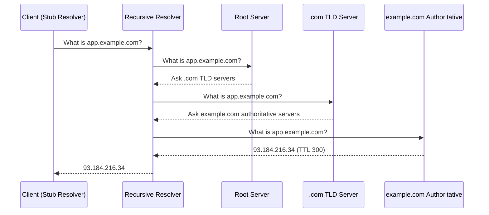

## Table of Contents

1. [What DNS Actually Does](#what-dns-actually-does)
2. [The Resolution Chain](#the-resolution-chain)
3. [Record Types You Will Use](#record-types-you-will-use)
4. [Debugging with dig](#debugging-with-dig)
5. [TTL and Caching: The Migration Trap](#ttl-and-caching-the-migration-trap)
6. [DNS Failure Modes](#dns-failure-modes)

## What DNS Actually Does

Your deploy went out. The load balancer is healthy. The new containers are running. But half your users are still hitting the old server. You check the app logs, the reverse proxy config, the security groups. Everything looks perfect. Then a coworker asks, "Did you lower the TTL before you swapped the IP?" and suddenly you realize the problem was never in your code. The DNS cache has not expired yet.

DNS (Domain Name System) translates human-readable domain names like `app.example.com` into IP addresses like `93.184.216.34`. Computers need numeric addresses to route packets across the internet, but humans are terrible at remembering numbers. DNS bridges that gap. Think of it like the `"name"` field in a `package.json` that maps a readable package name to a registry URL: the name is for humans, the URL is for machines, and there is a lookup system in between that connects the two.

Every time you open a browser tab, run `curl`, or deploy an app behind a load balancer, DNS is doing work underneath. Most of the time it is invisible. The moment it goes wrong, nothing works, and the error messages point everywhere except the actual problem.

## The Resolution Chain

When you type `app.example.com` into a browser, your computer has no idea what number that maps to. Neither does your wifi router. Neither does your ISP, really. The thing that does know is sitting on a server somewhere on the other side of the world, but to find it your computer plays a game of telephone, the same way you would track down a phone number for someone you only know by name.

The first call goes to a helper that lives near you, usually run by your ISP or a public service like Cloudflare's `1.1.1.1` or Google's `8.8.8.8`. Think of it as that one friend who does not have everyone's number memorized but always knows who to call to get one. If the answer is already in their recent contacts (their cache), they hand it back instantly. If not, they start working the phones for you.

They first call the closest thing DNS has to a switchboard operator: the **root name servers** (13 logical clusters labeled `a.root-servers.net` through `m.root-servers.net`). The root operator does not know the IP for `app.example.com`. They do know who runs `.com`, so they say "call these folks." Your helper then calls the **`.com` TLD (Top-Level Domain) servers**, which similarly do not know the answer but do know who runs `example.com`. They hand back the contact info for the **authoritative name servers** for `example.com`. These authoritative servers are essentially the contact card you set up in Cloudflare, AWS Route 53, or whichever provider hosts your DNS. Finally, your helper calls those authoritative servers and gets the real answer: `93.184.216.34`. The helper hands it back to your computer, the browser opens the connection, and you see the page load.

The technical names for the players in this chain: the bit of code on your machine that kicks things off is the **stub resolver**, the friend-with-connections in the middle is the **recursive resolver**, and the whole pattern of "ask one server, get a referral, ask the next" is called recursive resolution. The same dance happens for a `fetch()` call from a Node app, a `curl` from a CI runner, or a pod inside a Kubernetes cluster trying to reach `payments.default.svc.cluster.local` (in that last case the recursive resolver is CoreDNS running inside the cluster, and the authoritative answers come from the Kubernetes API).



The entire chain typically completes in under 100 milliseconds. Subsequent queries for the same domain resolve from cache in under 1 millisecond. This is why TTL values matter enormously during migrations: once a resolver caches an answer, it will not ask again until the TTL expires, no matter how urgently you need it to pick up a change.

> If you cannot explain where a DNS query goes at each step, you cannot debug DNS.

## Record Types You Will Use

DNS stores more than just "name to IP" mappings. If you have ever poked around a Cloudflare or Route 53 dashboard, you have seen rows with cryptic two- and four-letter labels in the Type column: A, AAAA, CNAME, MX, TXT, NS. Each one solves a different problem, and you will run into most of them within your first year of shipping real services.

**A records** map a hostname to an IPv4 address. This is the most common record type. When you point `app.example.com` at your server's IP, you are creating an A record. Every web application, API endpoint, and load balancer needs at least one.

**AAAA records** map a hostname to an IPv6 address. The quad-A name comes from the fact that IPv6 addresses are four times the length of IPv4. You need these when your infrastructure supports IPv6, which is increasingly the default on cloud providers and CDNs.

**CNAME records** create aliases. `www.example.com CNAME app.example.com` means "do not answer directly; instead, go look up `app.example.com`." This is useful when you want multiple names to resolve to the same place without duplicating A records. If the target IP changes, you only update it in one place. The important constraint: a CNAME cannot coexist with other record types at the same name, which is why you cannot put a CNAME at a zone apex (the bare domain like `example.com`). Many DNS providers offer proprietary workarounds (Cloudflare calls theirs "CNAME flattening," AWS calls it an "ALIAS record") but the limitation is baked into the DNS specification itself.

**MX records** specify mail servers for a domain, with priority values. Lower numbers mean higher priority. `example.com MX 10 mail1.example.com` tells sending mail servers where to deliver email for `@example.com` addresses. You need these when you set up email with any provider: Google Workspace, Microsoft 365, or your own mail server.

**TXT records** hold arbitrary text strings. They have become the catch-all for domain ownership verification and email security. SPF, DKIM, and DMARC records (which tell other mail servers how to verify that email from your domain is legitimate) are all TXT records. Domain verification for services like Let's Encrypt, Google Workspace, and Stripe also uses TXT records. If a service asks you to "add this DNS record to prove you own the domain," it is almost always a TXT record.

**NS records** delegate a zone to specific name servers. `example.com NS ns1.provider.com` tells the world which servers are authoritative for that domain. You typically set these at your registrar when you point a domain to a DNS hosting provider like Cloudflare, Route 53, or Google Cloud DNS.

Here is a quick reference for the record types you will see most often:

| Type | Maps | Example | When You Need It |
|------|------|---------|-------------------|
| `A` | Name to IPv4 | `app.example.com → 93.184.216.34` | Every web service |
| `AAAA` | Name to IPv6 | `app.example.com → 2606:2800:220:1:...` | IPv6-enabled infrastructure |
| `CNAME` | Name to name (alias) | `www → app.example.com` | Multiple names, one target |
| `MX` | Domain to mail server | `example.com → mail1.example.com` | Receiving email |
| `TXT` | Domain to text string | `example.com → "v=spf1 ..."` | Email auth, domain verification |
| `NS` | Domain to nameserver | `example.com → ns1.provider.com` | Delegating DNS to a provider |

## Debugging with dig

The `dig` command is the definitive DNS debugging tool. It ships with the `bind-utils` package on most Linux distributions. Learn it, and DNS problems become straightforward to diagnose.

A basic lookup shows you the full response your resolver sends back:

```bash
$ dig app.example.com
```

```
; <<>> DiG 9.18.28 <<>> app.example.com
;; global options: +cmd
;; Got answer:
;; ->>HEADER<<- opcode: QUERY, status: NOERROR, id: 42351
;; flags: qr rd ra; QUERY: 1, ANSWER: 1, AUTHORITY: 0, ADDITIONAL: 1

;; QUESTION SECTION:
;app.example.com.               IN      A

;; ANSWER SECTION:
app.example.com.        300     IN      A       93.184.216.34

;; Query time: 23 msec
;; SERVER: 127.0.0.53#53(127.0.0.53) (UDP)
;; WHEN: Wed Apr 15 14:30:01 UTC 2026
;; MSG SIZE  rcvd: 62
```

The output has four key parts worth reading. The HEADER shows the query status (`NOERROR` means success; `NXDOMAIN` means the domain does not exist). The QUESTION SECTION echoes what you asked. The ANSWER SECTION contains the actual record: the domain name, the TTL in seconds (300 here, meaning resolvers will cache this answer for 5 minutes), the record class (`IN` for Internet), the record type (`A`), and the IP address. The footer shows query latency and which resolver answered.

When you just need the IP and nothing else, `+short` strips away the decoration:

```bash
$ dig +short app.example.com
93.184.216.34
```

This is useful in scripts where you need to capture the result. For example, a simple deployment health check: `dig +short app.example.com | grep "expected-ip"`.

You can query a specific resolver by prefixing its address with `@`. This is critical during migrations when you want to see what different resolvers think the answer is:

```bash
$ dig @8.8.8.8 app.example.com
$ dig @1.1.1.1 app.example.com
```

The `+trace` flag replays the full resolution path from root servers down, which is invaluable when you suspect a delegation issue:

```bash
$ dig +trace app.example.com
```

And you can look up any record type by specifying it after the domain:

```bash
$ dig example.com MX
$ dig example.com TXT
$ dig example.com NS
$ dig -x 93.184.216.34
```

The last one is a reverse lookup: given an IP, find the hostname. This is useful when you see an IP address in logs and want to know what domain it belongs to.

## TTL and Caching: The Migration Trap

Every DNS record has a TTL (Time To Live) measured in seconds. When a resolver caches a response, it holds that answer until the TTL expires and will not query the authoritative server again until then. This is the mechanism that makes DNS fast (billions of queries answered from cache), but it is also the mechanism that bites you during migrations.

Suppose your A record has a TTL of 3600 (one hour) and you change the IP address. A resolver that cached the old IP five minutes ago will serve the stale answer for another 55 minutes. A resolver that has not cached it yet will pick up the new IP immediately. The result is inconsistent behavior that varies by client location and timing: some users see the new deployment, others see the old one, and your monitoring shows a confusing mix of healthy and unhealthy responses.

The fix is simple but requires planning ahead. Before any DNS migration, lower the TTL to 60 or 300 seconds **at least 24 hours in advance**. This matters because the old TTL is what resolvers worldwide have already cached. If the old TTL was 3600, it could take up to an hour for every resolver to expire its cached copy and pick up the new (lower) TTL. Once the lower TTL is active everywhere, make your IP change. Verify propagation. Then raise the TTL back to a reasonable production value (300 to 3600 seconds) once the migration is stable.

You can monitor propagation across multiple public resolvers with a simple loop:

```bash
$ for ns in 8.8.8.8 1.1.1.1 208.67.222.222 9.9.9.9; do
    echo "Resolver $ns:"
    dig @$ns +short app.example.com
done
```

```
Resolver 8.8.8.8:
93.184.216.34
Resolver 1.1.1.1:
93.184.216.34
Resolver 208.67.222.222:
93.184.216.34
Resolver 9.9.9.9:
93.184.216.34
```

If you see different IPs from different resolvers after a change, propagation is still in progress. Keep checking until all resolvers agree on the new address.

To check the current TTL of a cached record (and estimate how long until it expires), look at the number in the ANSWER SECTION:

```bash
$ dig app.example.com | awk '/^app\.example\.com/ {print "TTL:", $2}'
TTL: 300
```

That number counts down from the original TTL. If the original was 3600 and you see 2400, the resolver cached it 1200 seconds (20 minutes) ago and will hold it for another 2400 seconds (40 minutes).

## DNS Failure Modes

DNS problems are disorienting because they masquerade as application failures. Your app is fine, your server is fine, but users cannot reach you. Here are the failure modes you will encounter and how to identify each one.

**NXDOMAIN** means the domain does not exist. The authoritative server looked at its records and there is no entry for the name you asked about. In a Node.js script this surfaces as `Error: getaddrinfo ENOTFOUND app.example.com`. In Python's `requests` library it shows up as `socket.gaierror: [Errno -2] Name or service not known`. In a browser you get a generic "This site can't be reached" page. In `dig` it appears in the header as `status: NXDOMAIN`. They are all the same answer wearing different costumes. The most common causes are typos in the domain name, a missing record that was never created (you forgot to apply the Terraform plan, or the Kubernetes `Service` you are trying to hit lives in a different namespace so the cluster's internal DNS has no entry for the short name you used), or a recently expired domain registration. If you just created a record and still see NXDOMAIN, check that you added it to the correct zone. A record for `app.staging.example.com` needs to exist in the zone for `staging.example.com` (or `example.com` if you manage everything in one zone), not somewhere else.

```bash
$ dig nonexistent.example.com
;; ->>HEADER<<- opcode: QUERY, status: NXDOMAIN, id: 51923
```

**SERVFAIL** means something went wrong on the server side. The recursive resolver tried to get an answer but the authoritative server returned an error, timed out, or sent a response that failed DNSSEC validation. This can happen when the authoritative nameserver is down, when DNSSEC records are misconfigured (the resolver cannot verify the cryptographic chain), or when the zone file has syntax errors. Try querying the authoritative server directly with `dig @ns1.provider.com app.example.com` to isolate where the failure is happening.

```bash
$ dig broken.example.com
;; ->>HEADER<<- opcode: QUERY, status: SERVFAIL, id: 38201
```

**Timeout (no response)** means the resolver could not reach a DNS server at all. The query went out and nothing came back. This is typically a network problem, not a DNS content problem. Firewalls that block UDP port 53 are the most common cause, followed by misconfigured resolvers in `/etc/resolv.conf`. If `dig @8.8.8.8 google.com` also times out, the problem is your network path, not your domain.

```bash
$ dig app.example.com
;; connection timed out; no servers could be reached
```

**Stale cache during migration** is the silent failure: no errors, no timeouts, just the wrong answer. You changed an A record from IP-old to IP-new, but resolvers that cached the old record before you made the change will keep serving IP-old until the TTL expires. Users on those resolvers silently hit the old server. This is not a bug; it is DNS working exactly as designed. The fix was described in the previous section: lower TTLs before you migrate, not after.

Here is a diagnostic cheat sheet for quick triage:

| Symptom | `dig` Status | Likely Cause | First Step |
|---------|-------------|-------------|------------|
| "Site not found" | `NXDOMAIN` | Missing record or typo | Verify the record exists in your DNS provider's dashboard |
| Intermittent failures | `SERVFAIL` | Authoritative server issue or DNSSEC misconfiguration | Query the authoritative server directly |
| Nothing loads, no error | Timeout | Firewall blocking port 53 or bad `/etc/resolv.conf` | Test with `dig @8.8.8.8 google.com` |
| Some users see old site | `NOERROR` (stale IP) | Cached record from before migration | Check TTL; wait for expiry or verify TTL was lowered in advance |

---

**References**

- [RFC 1034: Domain Names - Concepts and Facilities](https://datatracker.ietf.org/doc/html/rfc1034) - The foundational specification defining DNS architecture, the namespace hierarchy, and the resolution algorithm.
- [RFC 1035: Domain Names - Implementation and Specification](https://datatracker.ietf.org/doc/html/rfc1035) - The companion spec covering DNS message format, record types, and the wire protocol.
- [dig(1) - DNS Lookup Utility](https://linux.die.net/man/1/dig) - Man page for the dig command with complete flag and output format documentation.
- [Cloudflare Learning Center: What is DNS?](https://www.cloudflare.com/learning/dns/what-is-dns/) - A clear visual walkthrough of DNS resolution with diagrams, aimed at beginners.
- [How DNS Works (comic)](https://howdns.works/) - An illustrated step-by-step explanation of the resolution chain that is genuinely fun to read.
