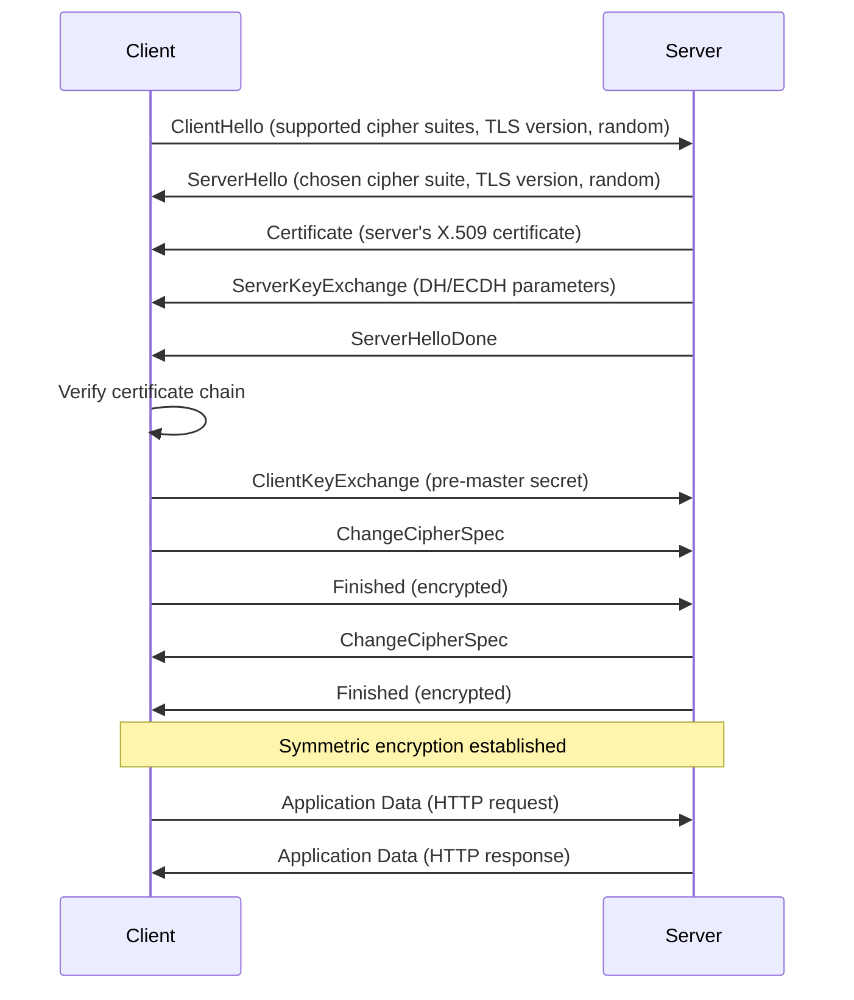

## Table of Contents

1. [What HTTP Looks Like on the Wire](#what-http-looks-like-on-the-wire)
2. [Methods: What Your Request Is Asking For](#methods-what-your-request-is-asking-for)
3. [Status Codes: What the Server Tells You Back](#status-codes-what-the-server-tells-you-back)
4. [Headers That Matter](#headers-that-matter)
5. [Inspecting HTTP with curl](#inspecting-http-with-curl)
6. [TLS: The Encryption Layer](#tls-the-encryption-layer)
7. [Certificates and the Chain of Trust](#certificates-and-the-chain-of-trust)
8. [When HTTP and TLS Break](#when-http-and-tls-break)

## What HTTP Looks Like on the Wire

Every time you call `fetch()` or `axios.get()`, your code is speaking HTTP. But what does that conversation actually look like on the wire?

HTTP is a text-based protocol. Your browser or application sends a block of structured text to a server, and the server sends a block of structured text back. That is the entire contract. No magic, no binary encoding (at least not in HTTP/1.1): just lines of plain text following a precise format.

Here is a real HTTP request, the kind your code generates behind the scenes when you write something like `fetch('https://api.example.com/users', { method: 'GET', headers: { 'Accept': 'application/json' } })`:

```text
GET /users HTTP/1.1
Host: api.example.com
Accept: application/json
Connection: keep-alive
```

The first line is the **request line**: the method (`GET`), the path (`/users`), and the protocol version (`HTTP/1.1`). Everything after that is headers, one per line, each a key-value pair separated by a colon. If the request has a body (like a POST with JSON), it comes after a blank line that separates headers from content.

The server's response follows the same pattern:

```text
HTTP/1.1 200 OK
Content-Type: application/json
Content-Length: 82

[{"id": 1, "name": "Alice"}, {"id": 2, "name": "Bob"}]
```

The first line is the **status line**: protocol version, a numeric status code (`200`), and a human-readable reason phrase (`OK`). Then headers, a blank line, and the response body. That `Content-Type: application/json` header is what tells your `fetch()` call that it can safely call `.json()` on the response.

The mapping from your JavaScript to raw HTTP is direct. The `method` option becomes the first word of the request line. The `headers` object becomes the header block. The `body` option becomes the content after the blank line. Understanding this mapping is the key to debugging network issues, because error messages from servers reference HTTP concepts (status codes, headers, content types), not JavaScript API concepts.

## Methods: What Your Request Is Asking For

HTTP methods tell the server what kind of action you want. If you have used a REST API, you have already been using them, possibly without thinking about what each one formally means.

**GET** retrieves data. It must be safe (no side effects on the server) and idempotent (calling it ten times produces the same result as calling it once). When you write `fetch('/api/users')` with no options, you are sending a GET. Browsers use GET for every page load, every image, every stylesheet. GET requests should never have a body.

**POST** creates a resource or triggers an action. When you submit a form or send `fetch('/api/users', { method: 'POST', body: JSON.stringify(newUser) })`, you are telling the server "here is new data, do something with it." POST is not idempotent: sending the same POST twice might create two records.

**PUT** replaces a resource entirely. Think of it as "overwrite whatever is at this URL with what I am sending." If the resource has ten fields and your PUT body only includes three, the other seven should be wiped. PUT is idempotent: sending the same PUT twice leaves the server in the same state.

**PATCH** applies a partial update. Unlike PUT, PATCH says "here are just the fields I want to change." Most real-world APIs use PATCH more often than PUT because full replacement is rarely what you want.

**DELETE** removes a resource. Like GET and PUT, it is idempotent: deleting something that is already gone typically returns a success code rather than an error.

**HEAD** is identical to GET except the server returns only the headers, no body. This is useful for checking if a resource exists, reading its content type, or verifying cache freshness without downloading the full response.

**OPTIONS** asks the server what methods it supports for a given URL. You will encounter this most often as a CORS preflight request (Cross-Origin Resource Sharing, the browser's mechanism for deciding whether JavaScript on one domain is allowed to call an API on another). Before your browser sends a cross-origin POST, it silently fires an OPTIONS request to ask the server "would you accept this?" If the server does not respond with the right `Access-Control-Allow-*` headers, the browser blocks the real request before it ever leaves.

## Status Codes: What the Server Tells You Back

Status codes are grouped into five families by their first digit, and learning the families matters more than memorizing individual codes. When you see a `4xx` error, you know the problem is on the client side. When you see a `5xx`, the server is at fault. That distinction alone saves hours of debugging because it tells you where to look.

**2xx: Success.** The request worked. `200 OK` is the generic win. `201 Created` means a new resource was made (you will see this after a successful POST). `204 No Content` means the server processed the request successfully but has nothing to send back, common for DELETE responses.

**3xx: Redirection.** The thing you asked for is somewhere else. `301 Moved Permanently` tells clients (and search engines) to update their bookmarks. `302 Found` is a temporary redirect, meaning the original URL is still valid but right now the content is elsewhere. `304 Not Modified` is the caching response: the server is saying "your cached copy is still good, do not bother downloading again."

**4xx: Client error.** You sent something wrong. `400 Bad Request` is the catch-all for malformed requests. `401 Unauthorized` means you need to authenticate (confusingly named; it really means "unauthenticated"). `403 Forbidden` means you authenticated but you do not have permission. `404 Not Found` needs no introduction. `429 Too Many Requests` means you hit a rate limit and need to back off.

**5xx: Server error.** The server tried and failed. `500 Internal Server Error` is the generic crash. `502 Bad Gateway` means the server you reached is fine, but the upstream service it proxied to returned garbage. `503 Service Unavailable` usually means the server is overloaded or in maintenance. `504 Gateway Timeout` means the upstream service did not respond at all within the allowed time.

> A 502 means your server is fine but whatever sits behind it is not. A 504 means the same thing, except the upstream did not even bother to respond. Learn this distinction, and you will save hours of debugging.

Here is a reference table for the codes you will encounter most often:

| Code | Name | What It Means |
|------|------|---------------|
| `200` | OK | Request succeeded, response has a body |
| `201` | Created | Resource was created (typical POST response) |
| `204` | No Content | Success, but no body to return (typical DELETE response) |
| `301` | Moved Permanently | URL has changed forever, update your links |
| `302` | Found | Temporary redirect, original URL still valid |
| `304` | Not Modified | Cached version is still fresh |
| `400` | Bad Request | Malformed request (bad JSON, missing fields) |
| `401` | Unauthorized | Authentication required (really means "unauthenticated") |
| `403` | Forbidden | Authenticated but not authorized |
| `404` | Not Found | Resource does not exist |
| `429` | Too Many Requests | Rate limit exceeded, back off |
| `500` | Internal Server Error | Server crashed |
| `502` | Bad Gateway | Upstream service returned an invalid response |
| `503` | Service Unavailable | Server overloaded or in maintenance |
| `504` | Gateway Timeout | Upstream service did not respond in time |

## Headers That Matter

HTTP headers carry metadata about the request or response. There are dozens of standard headers, but a handful show up in nearly every real-world interaction.

**Content-Type** tells the receiver how to interpret the body. When your API returns `Content-Type: application/json`, the client knows it can parse the body as JSON. When a form submits data, the browser sets `Content-Type: application/x-www-form-urlencoded` or `multipart/form-data`. Getting this wrong is a common source of bugs: if your server expects JSON but the client sends form-encoded data (or vice versa), the request will either fail with a `400` or silently produce garbage.

**Authorization** carries credentials. The most common pattern is `Authorization: Bearer <token>`, where the token is a JWT or an API key. Basic auth sends a base64-encoded `username:password` pair, which is only safe over HTTPS because base64 is encoding, not encryption. Anyone who intercepts a basic auth header over plain HTTP can decode it instantly.

**Cache-Control** dictates how responses can be cached. `Cache-Control: no-store` means "never cache this." `Cache-Control: max-age=3600` means "this response is good for one hour." `Cache-Control: public, max-age=86400` means proxies and CDNs can cache it for a day. Understanding these directives prevents stale data bugs in production and saves bandwidth at scale.

**X-Request-ID** (or `X-Correlation-ID`) is a custom header used to trace a single request through a distributed system. Your API gateway generates a unique ID and attaches it to the request. Every downstream service logs that same ID. When something breaks, you search your logs for that ID and get the complete story of what happened across all services, instead of trying to correlate timestamps from different machines.

```bash
$ curl -I https://api.github.com
```

```text
HTTP/2 200
content-type: application/json; charset=utf-8
cache-control: public, max-age=60, s-maxage=60
x-request-id: AB12:34CD:5E6F:7890:ABCDEF
x-ratelimit-limit: 60
x-ratelimit-remaining: 58
x-ratelimit-reset: 1713600000
```

Notice the `x-ratelimit-*` headers. GitHub is telling you that this API allows 60 requests per window, you have 58 left, and the window resets at the given Unix timestamp. Many APIs communicate rate limiting through headers like these, so checking response headers before retrying a `429` is standard practice.

## Inspecting HTTP with curl

`curl` is the universal HTTP debugging tool. It runs everywhere, requires no installation on most systems, and shows you exactly what is happening at the protocol level. Once you can read `curl -v` output, you can diagnose any HTTP problem.

The `-v` (verbose) flag shows the full request and response, including headers and the TLS handshake:

```bash
$ curl -v https://httpbin.org/get
```

Lines prefixed with `>` are what your client sent. Lines prefixed with `<` are what the server returned. Lines prefixed with `*` are curl's own commentary about the connection (DNS resolution, TLS negotiation, connection reuse).

To send a POST request with a JSON body:

```bash
$ curl -X POST https://httpbin.org/post \
  -H "Content-Type: application/json" \
  -d '{"key": "value"}'
```

The `-X` flag sets the method, `-H` adds a header, and `-d` sets the request body. This is the `curl` equivalent of `fetch('/post', { method: 'POST', headers: { 'Content-Type': 'application/json' }, body: JSON.stringify({ key: 'value' }) })`.

To follow redirects and see every hop:

```bash
$ curl -L -v https://httpbin.org/redirect/3 2>&1 | grep "< HTTP"
```

```text
< HTTP/1.1 302 FOUND
< HTTP/1.1 302 FOUND
< HTTP/1.1 302 FOUND
< HTTP/1.1 200 OK
```

Each line is one hop. The `302` responses are temporary redirects, and the final `200` confirms the request reached its destination. If you see the same URL repeating in the `Location` headers, you have a redirect loop.

To check response headers without downloading the body:

```bash
$ curl -I https://example.com
```

```text
HTTP/2 200
content-type: text/html; charset=UTF-8
content-length: 1256
cache-control: max-age=604800
```

The `-I` flag sends a HEAD request. This is useful for checking content types, cache behavior, or whether a server is responding at all without downloading the full page.

One of the most powerful `curl` features for performance debugging is the `-w` (write-out) flag, which lets you measure every phase of the request lifecycle:

```bash
$ curl -w "\nDNS: %{time_namelookup}s\nConnect: %{time_connect}s\nTLS: %{time_appconnect}s\nTotal: %{time_total}s\n" \
  -o /dev/null -s https://example.com
```

```text
DNS: 0.012s
Connect: 0.045s
TLS: 0.132s
Total: 0.178s
```

Each timing reveals a different phase. DNS is name resolution. Connect is the TCP handshake. TLS is the TLS handshake (zero for plain HTTP). Total is the complete round trip. If DNS is slow, check your resolver. If TLS is slow, you might have a long certificate chain or the server is negotiating an expensive cipher.

## TLS: The Encryption Layer

When you type `https://` instead of `http://`, you are asking for TLS (Transport Layer Security). Without it, every byte of your HTTP conversation travels across the network in cleartext. Anyone sitting between you and the server, your ISP, the coffee shop's Wi-Fi router, a compromised network switch, can read your passwords, your cookies, your API tokens, everything. TLS encrypts that conversation so that only your client and the server can read it.

The way TLS works is elegant. Before any application data flows, the client and server perform a handshake: a short choreographed exchange where they agree on encryption algorithms, verify each other's identity, and generate a shared secret key. Once the handshake completes, everything that follows is encrypted with that key.

Think of it like exchanging locked boxes. The server shows its ID card (a certificate signed by a trusted authority) and the client verifies the signature. Then they perform a key exchange: a clever mathematical protocol (usually Elliptic Curve Diffie-Hellman, or ECDHE) that lets both sides compute the same secret number without ever sending it over the network. Once they share that secret, they use it as a symmetric encryption key for the rest of the session. Symmetric encryption (where both sides use the same key) is fast, hundreds of times faster than the asymmetric cryptography used during the handshake. That is why TLS uses asymmetric crypto only to establish the key, then switches to symmetric for actual data.



This diagram shows TLS 1.2, which requires two round trips before any data can flow. TLS 1.3 (the current standard) reduces this to one round trip by combining several of these steps, and it supports 0-RTT resumption for repeat connections. That difference matters at scale: shaving one round trip off every new connection translates to measurably faster page loads for users across the globe, especially those on high-latency mobile networks.

One more handshake detail worth knowing: the client tells the server which hostname it is trying to reach using the TLS **SNI** (Server Name Indication) extension inside the unencrypted ClientHello. A single IP can host hundreds of HTTPS sites, and the server uses SNI to pick the matching certificate before the handshake continues. Old clients that omit SNI, or test commands like `openssl s_client` without `-servername example.com`, get the server's default vhost certificate instead of the one for the hostname they actually wanted, which then trips a "hostname mismatch" error that has nothing to do with the certificate itself.

## Certificates and the Chain of Trust

The handshake proves you have a private channel. But a private channel to who? Without certificates, you could be having a perfectly encrypted conversation with an attacker who hijacked the connection. Certificates are how the client checks that the server on the other end is actually the one it meant to reach.

Think of a certificate like a passport. It is a document that says "the holder of this passport is allowed to speak for `example.com`," and it includes a public key the server can prove it owns. Like a passport, anyone could print one on their own; what makes it trustworthy is the official stamp. That stamp is a digital signature from a Certificate Authority (CA), an organization browsers and operating systems have agreed to trust. Names you have probably seen: Let's Encrypt, DigiCert, Cloudflare, Sectigo.

The CA does not just hand out certificates. Before signing, it verifies that the applicant actually controls the domain (the most common way is to ask the server to host a specific file at a specific URL, or to add a specific DNS record). Once the CA is satisfied, it signs the certificate with its own private key. Now any client with the CA's public key can verify the signature is genuine.

In practice, no CA signs your certificate directly with its root key. Root keys are too valuable to use day-to-day, so they live offline in a vault and only sign a small number of intermediate CA keys. Those intermediates are what actually sign your server's certificate. So when your browser checks `example.com`, it walks a chain: server certificate signed by intermediate CA, intermediate CA signed by root CA, root CA pre-installed and pre-trusted on your device. Your operating system ships with a list of root CAs (open Keychain Access on macOS or `/etc/ssl/certs/` on Linux to see them). If every link in the chain checks out and ends at one of those pre-trusted roots, the connection proceeds. If any link is broken (an expired certificate, an unknown signer, a name on the certificate that does not match the domain you typed), the client refuses to continue.

You can inspect a certificate with `openssl`:

```bash
$ openssl s_client -connect example.com:443 -showcerts </dev/null 2>/dev/null | \
  openssl x509 -noout -subject -issuer -dates
```

```text
subject=C = US, O = Internet Corporation for Assigned Names and Numbers, CN = www.example.org
issuer=C = US, O = DigiCert Inc, CN = DigiCert Global G2 TLS RSA SHA256 2020 CA1
notBefore=Jan 15 00:00:00 2026 GMT
notAfter=Feb 14 23:59:59 2027 GMT
```

The `subject` is the domain the certificate was issued for. The `issuer` is the CA that signed it. The `notBefore` and `notAfter` fields define the validity window. If today's date falls outside that window, every browser and HTTP client will refuse the connection.

To check when a certificate expires (the single most important thing to monitor):

```bash
$ echo | openssl s_client -connect example.com:443 2>/dev/null | \
  openssl x509 -noout -enddate
```

```text
notAfter=Feb 14 23:59:59 2027 GMT
```

**Let's Encrypt** changed the certificate landscape by providing free, automated certificates through the ACME protocol (Automatic Certificate Management Environment). Tools like `certbot` handle issuance and renewal automatically. Let's Encrypt certificates expire after 90 days, which sounds aggressive but is intentional: short lifetimes limit the damage if a certificate's private key is compromised. Automated renewal means you set it up once and it handles itself, as long as the automation keeps running. When it stops running, you find out at 3 AM when your site goes down. Set up monitoring for certificate expiration, always.

Commercial CAs issue certificates valid for up to 398 days. Regardless of which type you use, the rule is the same: automate renewal and monitor expiration dates. A single expired certificate can take down an entire service, and the browser error message your users see ("Your connection is not private") immediately destroys trust.

You can verify the complete certificate chain and test TLS version support:

```bash
# Test TLS version support
$ openssl s_client -connect example.com:443 -tls1_2
$ openssl s_client -connect example.com:443 -tls1_3

# Verify the full chain against the system trust store
$ openssl verify -CAfile /etc/ssl/certs/ca-certificates.crt chain.pem
```

## When HTTP and TLS Break

HTTP and TLS failures tend to produce cryptic error messages that send engineers on wild goose chases. Knowing the common failure patterns and what to look for turns hours of debugging into minutes.

### Expired Certificates

The most common TLS failure. Your certificate's `notAfter` date passes, and every client immediately refuses to connect. The error message varies by client: browsers show "Your connection is not private" or "NET::ERR_CERT_DATE_INVALID." `curl` reports `SSL certificate problem: certificate has expired.` Node.js throws `CERT_HAS_EXPIRED`. The fix is straightforward (renew the certificate), but the real fix is monitoring: set up alerts for any certificate expiring within 30 days so you never get surprised.

### Mixed Content

You serve your page over HTTPS, but some resources on the page (images, scripts, stylesheets) are loaded over plain HTTP. Browsers block these requests or show console warnings because an HTTPS page loading HTTP resources undermines the security guarantee. The fix is to ensure every URL on your page uses `https://` or protocol-relative paths (`//cdn.example.com/image.png`). In practice, just use `https://` everywhere.

### Wrong Content-Type

Your API returns JSON but the `Content-Type` header says `text/html`. The client tries to parse the response as HTML and gets garbage. Or your server expects `Content-Type: application/json` but the client sends `application/x-www-form-urlencoded`, so the JSON body gets mangled. This is subtle because the HTTP status code might be `200 OK`, and everything looks fine until you inspect the response body. Always verify `Content-Type` headers match the actual content, on both sides.

### Redirect Loops

Server A redirects to Server B, which redirects back to Server A. Or a single server has a rule that redirects `/` to `/home`, while another rule redirects `/home` back to `/`. The browser gives up after a set number of hops (usually 20) and shows "ERR_TOO_MANY_REDIRECTS." `curl -L -v` reveals the loop by printing each hop. The fix is to trace the redirect chain and find the circular rule, usually in your web server config, load balancer, or CDN settings.

```bash
# Trace the full redirect chain
$ curl -L -v https://example.com 2>&1 | grep -E "^< (HTTP|Location:)"
```

### CORS Errors

CORS (Cross-Origin Resource Sharing) is the browser's policy for controlling which domains can call your API from JavaScript. If your frontend at `app.example.com` calls an API at `api.example.com`, the browser first sends an OPTIONS preflight request. If the API does not respond with `Access-Control-Allow-Origin: app.example.com` (or `*`), the browser blocks the request. The confusing part: this is purely a browser restriction. The same request from `curl`, from your server code, or from a mobile app works fine. The API is not broken; the browser is enforcing a security policy. The fix is to configure the API to return the correct CORS headers.

### 502 and 504: Upstream Failures

Both `502 Bad Gateway` and `504 Gateway Timeout` mean the server you reached (your load balancer, reverse proxy, or API gateway) is healthy, but the thing behind it is not. A `502` means the upstream responded with something invalid (crashed mid-response, sent malformed HTTP, returned garbage). A `504` means the upstream did not respond at all within the timeout window.

To diagnose these, you need to look at the upstream service, not the proxy. Check if the upstream process is running, check its logs, check if it is overwhelmed with requests. The proxy is just the messenger; the problem is behind it.

### Hostname Mismatch

The certificate is valid, signed by a real CA, and not expired. But the name on the certificate is `www.example.com` and you connected to `api.example.com`, or the cert covers `example.com` but you are hitting it via its raw IP address. The browser shows "Your connection is not private" with `NET::ERR_CERT_COMMON_NAME_INVALID`. `curl` reports `SSL: no alternative certificate subject name matches target host name`. Node.js throws `ERR_TLS_CERT_ALTNAME_INVALID`. The fix is either to connect using a name the certificate actually covers (check the certificate's Subject Alternative Names with `openssl x509 -noout -text | grep DNS`) or to reissue the certificate to include the name you want. Wildcard certificates (`*.example.com`) cover one level of subdomain, so they are a common solution when you have many services under one domain.

### Certificate Chain Errors

Sometimes the server sends its own certificate but forgets to include the intermediate CA certificate. Your browser might still work (browsers often cache intermediates from previous sites), but `curl`, API clients, and your own backend services will fail. The error messages to recognize:

- `curl`: `SSL certificate problem: unable to get local issuer certificate`
- Node.js: `UNABLE_TO_GET_ISSUER_CERT_LOCALLY` or `SELF_SIGNED_CERT_IN_CHAIN` (the latter usually means the chain ended at a self-signed cert that is not in the trust store, common in corporate networks with their own internal CA)
- Python `requests`: `SSLError: certificate verify failed: unable to get local issuer certificate`

The symptom is misleading because the server itself is fine; the certificate just was not delivered with its full chain attached. The fix is to configure your server (Nginx, Apache, your load balancer) to serve the full chain file: your leaf certificate plus all intermediate certificates concatenated together, in order. Let's Encrypt's `certbot` produces a `fullchain.pem` for exactly this reason. Use that file, not `cert.pem`.

```bash
# Check what the server actually sends
$ openssl s_client -connect example.com:443 </dev/null 2>/dev/null | grep -A2 "Certificate chain"

# Test against a clean trust store with no cached intermediates
$ curl -v https://example.com
```

If you are debugging a Stripe webhook that fails with a chain error while the same URL works in your browser, this is almost always the cause. Stripe (and most webhook providers) do not cache intermediates and will reject any endpoint that does not present the complete chain on its own.

A related failure mode bites minimal container images. Distroless and Alpine images sometimes ship without the `ca-certificates` package, which means the system trust store is empty. Every outbound HTTPS call from inside the container fails with `unable to get local issuer certificate`, even though the same code on the host machine works fine. The fix is `apk add ca-certificates` (Alpine) or pulling in the `ca-certificates` layer in your Dockerfile. Test trust paths explicitly because they vary across base images: Debian uses `/etc/ssl/certs/ca-certificates.crt`, RHEL uses `/etc/pki/tls/certs/ca-bundle.crt`, and a base image upgrade can move the file out from under software that hardcoded the old path.

### Cipher and Protocol Mismatches

When the client and server cannot agree on a cipher suite or TLS version, the handshake aborts with a TLS alert. The most common is `alert 40 handshake_failure`, which `openssl s_client` reports as `sslv3 alert handshake failure`. Real-world causes: a hardened server that disabled everything below TLS 1.2 talking to an old client stuck on TLS 1.0, an old server that only offers RSA key exchange talking to a client that requires forward secrecy (ECDHE), or a middlebox stripping cipher suites. Diagnose by listing what each side supports: `openssl s_client -connect host:443 -tls1_2 -cipher ECDHE-RSA-AES128-GCM-SHA256` proves whether one specific cipher works, and `nmap --script ssl-enum-ciphers -p 443 host` enumerates everything the server will accept.

### Clock Skew

TLS validation checks the certificate's `notBefore` and `notAfter` against the local clock. A machine whose clock is wrong by more than the validity window's slack will reject every certificate as either "not yet valid" or "expired", even though the CA chain is fine. This is common on freshly booted VMs, IoT devices without a battery-backed RTC, and containers whose host has drifted. If `curl` works on one host and fails with cert errors on another against the same endpoint, run `date` and `timedatectl` on both before suspecting the certificate.

---

**References**

- [MDN HTTP Reference](https://developer.mozilla.org/en-US/docs/Web/HTTP) - Comprehensive reference for HTTP methods, status codes, headers, and CORS, written for web developers.
- [RFC 9110: HTTP Semantics](https://www.rfc-editor.org/rfc/rfc9110) - The current HTTP specification defining methods, status codes, and header semantics.
- [RFC 8446: TLS 1.3](https://www.rfc-editor.org/rfc/rfc8446) - The TLS 1.3 specification, covering the handshake protocol, key exchange, and cipher suites.
- [Let's Encrypt Documentation](https://letsencrypt.org/docs/) - Official docs for free certificate issuance, ACME protocol, and automated renewal with Certbot.
- [curl Manual](https://curl.se/docs/manual.html) - Complete curl documentation covering every flag and option for HTTP debugging and testing.
- [SSL Labs Server Test](https://www.ssllabs.com/ssltest/) - Free tool to test your server's TLS configuration, certificate chain, and cipher suite support.
