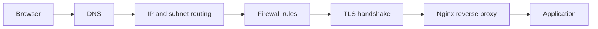

## Table of Contents

1. [The Request Path We Will Follow](#the-request-path-we-will-follow)
2. [What a Network Layer Means](#what-a-network-layer-means)
3. [Encapsulation: How Data Gets Wrapped](#encapsulation-how-data-gets-wrapped)
4. [TCP/IP Layers in One Browser Request](#tcpip-layers-in-one-browser-request)
5. [The OSI Names People Use During Incidents](#the-osi-names-people-use-during-incidents)
6. [Watching Layers with Real Tools](#watching-layers-with-real-tools)
7. [Debugging by Layer](#debugging-by-layer)

## The Request Path We Will Follow
<!-- section-summary: The whole networking section follows one browser request from a domain name to the application process that handles it. -->

Imagine someone opens `https://app.example.com/dashboard` in a browser. The page looks simple to the user, but the machine has to do a lot of small jobs in the right order before your application code sees anything.

The browser first needs an IP address, so it asks DNS to translate `app.example.com` into something like `203.0.113.25`. After that, the operating system decides whether that IP is local or remote by looking at its subnet and route table. The packet then moves toward the server, passing cloud firewalls and host firewalls that decide whether port `443` is allowed. If the packet reaches the server, the browser performs a TLS handshake so the connection is encrypted. Then it sends an HTTP request. Nginx receives that request, handles the public web-server work, and forwards it to the app on an internal port such as `127.0.0.1:3000`.

That is the request path for these networking articles:



Each article in this module focuses on one part of that path. This first article gives the map. The useful idea is simple: a request works because different layers handle different jobs. When a request fails, the error message usually belongs to one of those jobs.

## What a Network Layer Means
<!-- section-summary: A layer is one part of the networking job with its own responsibility, vocabulary, tools, and failure modes. -->

A **network layer** is a boundary between responsibilities. One layer knows how to format an HTTP request. Another knows how to open a reliable TCP connection. Another knows how to route an IP packet. Another knows how to send bits across Wi-Fi or Ethernet. Each layer receives data from the layer above it, adds the information it needs, and hands the result to the layer below it.

This separation lets a browser request survive a messy real network. Your application code can send JSON without knowing whether the user is on fiber, office Wi-Fi, hotel Wi-Fi, or mobile data. A router can forward an IP packet without knowing whether the payload is an image, a login form, or a DNS lookup. A firewall can allow TCP port `443` without reading every line of your application code.

The same separation helps during incidents. A DNS problem gives you names that fail to resolve. A subnet problem gives you routes that point to the wrong place. A firewall problem gives you connections that time out or get refused. A TLS problem gives you certificate or handshake errors. A reverse proxy problem gives you `502` or `504` responses. Those symptoms come from different layers, so they need different checks.

The history matters a little here. The internet grew out of research networks that had to connect very different physical systems. One path might cross copper, satellite, radio, and fiber. The design that won was the one that let the upper layers keep working while the lower transport changed. That is why the request to `https://app.example.com/dashboard` can move through many networks without the browser caring which cable or radio link carried each hop.

## Encapsulation: How Data Gets Wrapped
<!-- section-summary: Encapsulation means every layer wraps the data with its own header, and the receiver unwraps those headers in reverse order. -->

**Encapsulation** means each layer adds its own header around the data it receives. The header is metadata. It tells that layer how to deliver the payload. When the request reaches the destination, the destination machine removes those headers in the opposite order.

For the browser request, the inner data is the HTTP message:

```
GET /dashboard HTTP/1.1
Host: app.example.com
Accept: text/html
```

TCP wraps that message with ports, such as source port `53142` and destination port `443`. IP wraps the TCP segment with source and destination IP addresses. Ethernet or Wi-Fi wraps the IP packet with local MAC addresses for the next hop. The result is a frame that can move across the local link.

| Wrapper | Main fields | Question it answers |
| --- | --- | --- |
| HTTP message | Method, path, headers, body | What does the application want? |
| TCP segment | Source port, destination port, sequence data | Which process should receive it, and in what order? |
| IP packet | Source IP, destination IP, TTL | Which host or network should receive it? |
| Ethernet frame | Source MAC, destination MAC | Which device receives the next local hop? |

This wrapping explains why the browser can connect to `app.example.com`, while Nginx can proxy to `127.0.0.1:3000`, while the application still sees the original `Host` header. Different layers keep different pieces of the story.

It also explains why packet captures look busy. A single HTTP request is not just HTTP. It is HTTP inside TCP, inside IP, inside a local link frame. Once you know what each wrapper is for, the output from tools like `tcpdump` starts to look like evidence instead of noise.

## TCP/IP Layers in One Browser Request
<!-- section-summary: The TCP/IP model groups the request path into application, transport, internet, and network access work. -->

The TCP/IP model is the model that real internet software follows. It has four layers: application, transport, internet, and network access. Let us connect those layers to the `https://app.example.com/dashboard` request.

The **application layer** contains protocols that applications understand directly. DNS, HTTP, and TLS all live here in practical TCP/IP conversations. DNS gives the browser an IP address. TLS protects the connection. HTTP carries the request and response. Your app cares about this layer because this is where URLs, headers, cookies, JSON, redirects, and status codes exist.

The **transport layer** gives the application a conversation. For HTTPS, that usually means TCP. TCP uses ports so the destination machine can deliver traffic to the right process. Port `443` usually belongs to a web server or load balancer. Port `3000` might belong to your Node.js process on the same host. TCP also tracks sequence numbers, acknowledgments, retransmits lost data, and makes the network look like an ordered byte stream to the application.

The **internet layer** handles IP addressing and routing. After DNS returns `203.0.113.25`, the local machine decides where to send packets for that destination. If the destination is outside the local subnet, the packet goes to the default gateway. Routers along the path inspect the destination IP and forward the packet toward the next hop. They do not need to understand your HTTP route or your JSON body.

The **network access layer** handles the local hop. On Ethernet and Wi-Fi, that means frames and MAC addresses. MAC addresses matter only between neighbors on the same local link. Your laptop sends the first frame to the router's MAC address. The router removes that frame, keeps the IP packet, and creates a new frame for the next hop. The IP destination stays meaningful across the path; the MAC destination changes at every hop.

Here is the same idea as a compact table:

| TCP/IP layer | In the request path | Common tools |
| --- | --- | --- |
| Application | DNS, TLS, HTTP, Nginx proxy behavior, app response | `dig`, `curl`, `openssl`, logs |
| Transport | TCP port `443`, TCP port `3000`, connection state | `ss`, `nc`, `tcpdump` |
| Internet | IP address, subnet, route table, TTL | `ip route`, `ping`, `traceroute` |
| Network access | Interface, MAC address, ARP, local link | `ip link`, `ip neigh`, `tcpdump -e` |

The next articles zoom into these pieces. DNS explains the name lookup. IP addressing explains the subnet and routing part. Firewalls explain the allow or deny decision. HTTP and TLS explain the encrypted web conversation. Nginx explains the final public front door before the request reaches the app.

## The OSI Names People Use During Incidents
<!-- section-summary: The OSI model gives teams shared names like Layer 3, Layer 4, and Layer 7 during debugging. -->

You will hear engineers say phrases like "this looks like Layer 4" or "we have a Layer 7 error." They are using the OSI model. The OSI model has seven layers. Real internet stacks do not map perfectly to it, but the layer numbers are useful shared vocabulary during debugging.

| OSI layer | Name | Request-path example | Failure shape |
| --- | --- | --- | --- |
| 7 | Application | DNS, HTTP, app routes, proxy rules | `NXDOMAIN`, `404`, `502`, bad JSON |
| 6 | Presentation | TLS, encoding, compression | certificate mismatch, TLS alert |
| 5 | Session | Long-lived app sessions and connection reuse | dropped WebSocket, stale pool connection |
| 4 | Transport | TCP ports and connection state | connection refused, timeout, reset |
| 3 | Network | IP addresses and routing | no route, wrong subnet, unreachable host |
| 2 | Data link | MAC addresses, ARP, VLANs | ARP failure, duplicate MAC, VLAN mistake |
| 1 | Physical | cable, radio, NIC, link signal | interface down, no carrier |

Most day-to-day incidents land in a smaller set of buckets. Layer 3 means the IP path has a problem. Layer 4 means the port or TCP connection has a problem. Layer 7 means the application protocol, proxy, or app logic has a problem. TLS sometimes gets called Layer 6, though many teams group it with Layer 7 because it sits beside HTTP in the application stack.

A practical example helps. If `dig app.example.com` fails, the browser cannot even find the IP, so you stay in the DNS article. If DNS returns an IP but `traceroute` stops at the first hop, you move to IP routing and subnets. If the route works but `nc -vz app.example.com 443` hangs, you look at firewalls. If port `443` opens but `curl` reports a certificate name mismatch, you inspect TLS. If TLS works but the browser gets `502 Bad Gateway`, you inspect Nginx and the upstream app.

## Watching Layers with Real Tools
<!-- section-summary: `dig`, `ip`, `ss`, `curl`, `openssl`, and `tcpdump` let you collect evidence at different layers instead of guessing. -->

The best networking habit is to turn a vague report into evidence. The user says "the site is down." The tools tell you which part of the path failed.

DNS evidence starts with `dig`:

```bash
$ dig +short app.example.com
203.0.113.25
```

If this returns no answer or a different IP than expected, the problem starts before any TCP connection exists. The DNS article covers that path in detail.

IP and subnet evidence starts with the route table:

```bash
$ ip route get 203.0.113.25
203.0.113.25 via 10.0.0.1 dev eth0 src 10.0.0.42 uid 1000
    cache
```

This says the machine will send packets for `203.0.113.25` to gateway `10.0.0.1` through interface `eth0`. If the gateway is wrong, the subnet article is the right place to look.

Transport evidence checks whether a port opens:

```bash
$ nc -vz app.example.com 443
Connection to app.example.com (203.0.113.25) 443 port [tcp/https] succeeded!
```

If this times out, a firewall or routing rule may be dropping traffic. If it says connection refused, the destination host replied but nothing accepted that port.

TLS evidence comes from `openssl`:

```bash
$ openssl s_client -connect app.example.com:443 -servername app.example.com </dev/null 2>/dev/null | openssl x509 -noout -subject -issuer -dates
subject=CN = app.example.com
issuer=C = US, O = Let's Encrypt, CN = R3
notBefore=Jun 01 00:00:00 2026 GMT
notAfter=Aug 30 23:59:59 2026 GMT
```

This proves which certificate the server presented, who issued it, and whether it is still valid.

HTTP and proxy evidence comes from `curl`:

```bash
$ curl -I https://app.example.com/dashboard
HTTP/2 200
content-type: text/html; charset=utf-8
server: nginx
```

The headers show that TLS and HTTP completed and that Nginx answered. If this returns `502`, the request reached the proxy but the app behind it failed or was unavailable.

Packet evidence comes from `tcpdump` when the usual tools disagree:

```bash
$ sudo tcpdump -i eth0 -n host 203.0.113.25 and port 443 -c 4
12:01:10.100 IP 10.0.0.42.53142 > 203.0.113.25.443: Flags [S], seq 100, length 0
12:01:10.132 IP 203.0.113.25.443 > 10.0.0.42.53142: Flags [S.], seq 200, ack 101, length 0
12:01:10.132 IP 10.0.0.42.53142 > 203.0.113.25.443: Flags [.], ack 201, length 0
12:01:10.150 IP 10.0.0.42.53142 > 203.0.113.25.443: Flags [P.], length 517
```

The first three lines are the TCP handshake. The fourth line carries data, which for HTTPS is encrypted TLS data. This capture proves that the network path and port are open. If the app still fails, the next evidence comes from TLS, Nginx logs, and application logs.

## Debugging by Layer
<!-- section-summary: Layer-based debugging starts with the earliest failing step and moves forward through DNS, routing, firewall, TLS, proxy, and app checks. -->

The shared request path gives you a repeatable debugging order. Start with the name, then the address, then the port, then the encrypted connection, then the proxy, then the app. This order keeps you from blaming the application for a DNS typo or blaming the firewall for an expired certificate.

| Symptom | Likely layer | First useful check |
| --- | --- | --- |
| Browser says the domain cannot be found | DNS / application layer | `dig app.example.com` |
| DNS works but packets leave through the wrong gateway | Internet layer | `ip route get <ip>` |
| Same subnet hosts cannot find each other | Data link layer | `ip neigh show` |
| TCP connection hangs | Transport or firewall | `nc -vz app.example.com 443` and firewall logs |
| TCP connects but TLS fails | TLS / presentation | `openssl s_client -servername app.example.com` |
| TLS works but response is `502` | Proxy / application | Nginx `error.log` and app health check |
| Proxy works but page returns `500` | Application | Application logs and request ID |

Here is a compact incident walk-through. A user reports that `https://app.example.com/dashboard` hangs. DNS returns `203.0.113.25`, so the name works. `ip route get` shows packets leave through the expected gateway, so the local route is sane. `nc -vz app.example.com 443` times out, so the browser never reaches TLS or HTTP. That points at a firewall, load balancer listener, or network ACL. The application logs can wait because the request has not reached the app.

Now imagine `nc` succeeds and `openssl` shows a valid certificate, but `curl -I` returns `HTTP/2 502`. The packet path, firewall, and TLS all work. The failure now sits at the reverse proxy or upstream app. Nginx might be forwarding to the wrong port, or the app process might be down. The evidence moved you forward through the path.

That is the main value of network layers for DevOps work. They turn "networking is broken" into a concrete question: which step of the request path stopped doing its job?

---

**References**

- [RFC 1122: Requirements for Internet Hosts](https://datatracker.ietf.org/doc/html/rfc1122) - Defines the host requirements and layered TCP/IP architecture used by internet systems.
- [RFC 9293: Transmission Control Protocol](https://www.rfc-editor.org/rfc/rfc9293) - Current TCP specification, including connection setup, sequence numbers, and reliable delivery behavior.
- [tcpdump Manual Page](https://www.tcpdump.org/manpages/tcpdump.1.html) - Official reference for tcpdump capture options, filters, and output.
- [IANA Protocol Numbers](https://www.iana.org/assignments/protocol-numbers/protocol-numbers.xhtml) - Registry of protocol numbers used inside IP packets.
- [Cloudflare Learning Center: What is the OSI Model?](https://www.cloudflare.com/learning/ddos/glossary/open-systems-interconnection-model-osi/) - Beginner-friendly explanation of OSI layer names commonly used during troubleshooting.
