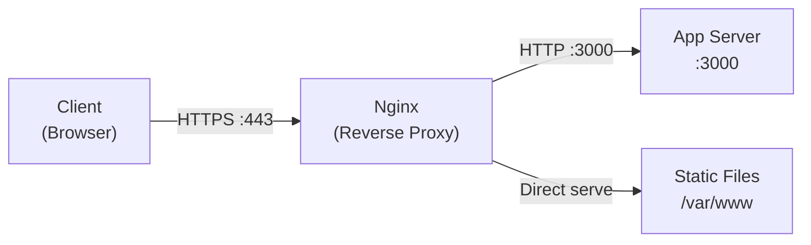
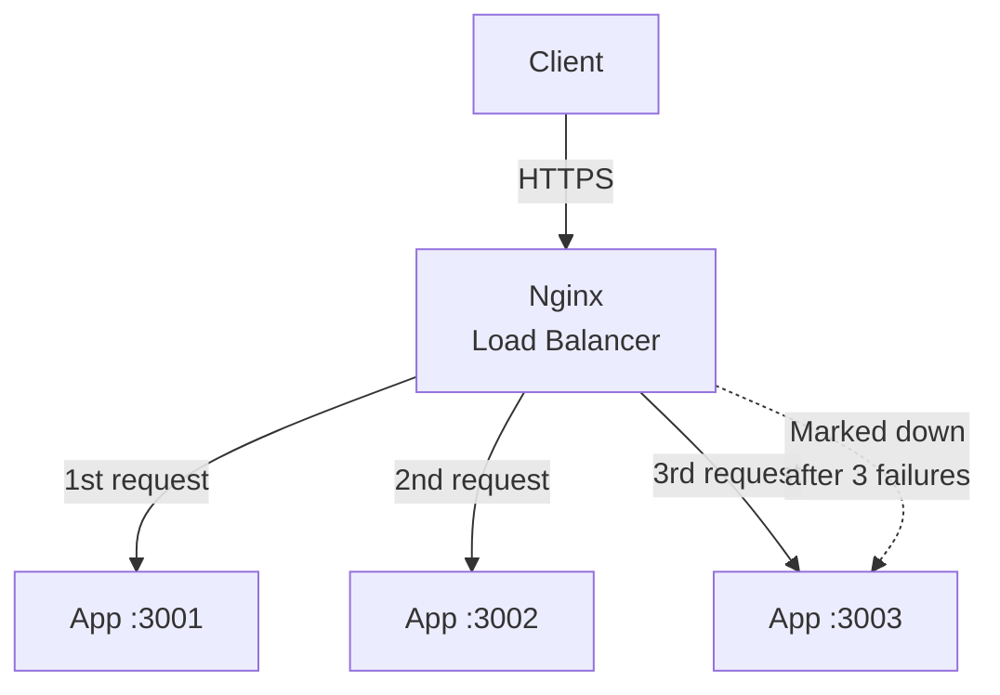

## Table of Contents

1. [Why Your App Needs a Front Door](#why-your-app-needs-a-front-door)
2. [Installing and Starting Nginx](#installing-and-starting-nginx)
3. [Nginx Config File Structure](#nginx-config-file-structure)
4. [Serving Static Files](#serving-static-files)
5. [Reverse Proxy: Forwarding to Your App](#reverse-proxy-forwarding-to-your-app)
6. [TLS Termination with Let's Encrypt](#tls-termination-with-lets-encrypt)
7. [Basic Load Balancing](#basic-load-balancing)
8. [When Nginx Breaks](#when-nginx-breaks)

## Why Your App Needs a Front Door

Your Node.js app listens on port 3000. It works on your laptop. Then you push it to a real server and three problems land at once. Browsers expect HTTP on port 80 and HTTPS on port 443, not 3000, so nobody can reach you at the URL they would naturally type. There is no TLS certificate, so Chrome shows a giant red warning to anyone who does. And Node runs on a single thread by default, so a 50MB video download can hold up every API request stuck behind it. Almost nobody solves these problems by patching their app. Instead they put a small, battle-tested program in front of it whose only job is to receive HTTP requests, do the boring infrastructure work (TLS, logging, gzip, hostname routing), and forward each request internally to the app.

That program is a reverse proxy. Nginx is the most famous one, but Caddy, HAProxy, Traefik, and Apache `httpd` are all variations on the same idea. The cloud has its own versions: AWS Application Load Balancer (ALB), Google Cloud Load Balancer, and Cloudflare sit in front of millions of apps doing the same job from their own infrastructure. Modern hosts like Vercel and Netlify hide the reverse proxy entirely, but the "redirects" and "rewrites" you configure in their dashboards are reverse-proxy rules in a friendly UI. The mental model never changes: a receptionist in a building lobby greets every visitor, checks their ID, and walks them to the right office. Your application developers on floor 3 never deal with lobby security or visitor logs; they just handle the people who make it to their door.

It helps to distinguish two kinds of servers here. An **application server** is your code: your Express app, your Django process, your FastAPI service. It knows your business logic, talks to databases, and generates dynamic responses. A **web server** like Nginx is infrastructure software purpose-built for handling raw HTTP traffic at scale: accepting thousands of simultaneous connections, serving static files efficiently, and encrypting connections with TLS. Your app server can technically do both jobs (Express can serve static files, Node has a built-in `https` module), but doing them well means writing infrastructure code instead of product code. A reverse proxy is the standard answer to "stop making my app do this."

Here is what a reverse proxy gives you in concrete terms:

- **TLS termination**: Nginx handles HTTPS encryption so your app speaks plain HTTP internally.
- **Static file serving**: CSS, JavaScript bundles, images, and fonts are served directly by Nginx without touching your app at all.
- **Load balancing**: Nginx distributes requests across multiple copies of your app.
- **HTTP/2 support**: Your app speaks HTTP/1.1 to Nginx locally; Nginx speaks HTTP/2 to clients over the internet.
- **Rate limiting and request buffering**: Nginx can reject abusive traffic before it reaches your app.



The diagram above shows the typical production setup. Clients connect to Nginx over HTTPS on port 443. Nginx either serves static files directly or forwards dynamic requests to your app server over plain HTTP on localhost. Your app never touches TLS, never serves a single CSS file, and never worries about connection limits. Now let's get Nginx installed and see what you are working with.

## Installing and Starting Nginx

On Ubuntu or Debian, installing Nginx is one command:

```bash
$ sudo apt update && sudo apt install nginx -y
```

Once installed, Nginx registers itself as a systemd service. You manage it with the same `systemctl` commands you use for any other service:

```bash
$ sudo systemctl start nginx
$ sudo systemctl enable nginx
$ sudo systemctl status nginx
```

```text
● nginx.service - A high performance web server and a reverse proxy server
     Loaded: loaded (/lib/systemd/system/nginx.service; enabled; vendor preset: enabled)
     Active: active (running) since Sat 2026-04-19 10:32:15 UTC; 5s ago
    Process: 1234 ExecStartPre=/usr/sbin/nginx -t -q -g daemon on; master_process on; (code=exited, status=0/SUCCESS)
    Process: 1235 ExecStart=/usr/sbin/nginx -g daemon on; master_process on; (code=exited, status=0/SUCCESS)
   Main PID: 1236 (nginx)
      Tasks: 3 (limit: 4678)
     Memory: 6.2M
     CGroup: /system.slice/nginx.service
             ├─1236 "nginx: master process /usr/sbin/nginx -g daemon on; master_process on;"
             ├─1237 "nginx: worker process"
             └─1238 "nginx: worker process"
```

The `start` command launches Nginx, `enable` tells systemd to start it automatically on boot, and `status` confirms it is running. Notice the output shows a master process and two worker processes. The master handles configuration reloading and log rotation; the workers handle actual HTTP connections. Each worker is a single thread that uses an event loop (`epoll` on Linux, `kqueue` on BSD) to juggle thousands of connections at once, the same model Node.js uses.

Nginx exists in this shape because of the C10K problem. By the late 1990s, Apache's prefork model (one process or thread per connection) was hitting a wall: serving 10,000 concurrent connections meant 10,000 processes, each with its own memory footprint and context-switching cost, and the kernel ground to a halt long before that number. Igor Sysoev wrote Nginx in 2002-2004 specifically to handle the connections Apache could not. The trick is that most connections are idle most of the time (waiting on the network, not doing work), so a single thread can manage tens of thousands of them by sleeping on a single `epoll_wait` call and only waking up for the few that have data ready. This is why Nginx uses a fixed pool of workers (one per CPU core, set by `worker_processes auto`) instead of one worker per request, and it is also why your Node.js app behind Nginx can punch above its weight: Nginx absorbs the slow clients, drip-feeds the fast bytes to your app, and only forwards a request once it has the whole thing buffered.

You can verify Nginx is serving its default page by hitting localhost:

```bash
$ curl -s localhost | head -5
```

```text
<!DOCTYPE html>
<html>
<head>
<title>Welcome to nginx!</title>
<style>
```

If you see the welcome page HTML, Nginx is running and listening on port 80. Now let's look at where the config files live, because you will be editing them constantly.

Nginx organizes its configuration across a few key paths:

| Path | Purpose |
|------|---------|
| `/etc/nginx/nginx.conf` | Main configuration file, top-level settings |
| `/etc/nginx/sites-available/` | Individual site config files (available but not active) |
| `/etc/nginx/sites-enabled/` | Symlinks to configs in `sites-available/` that are actually active |
| `/etc/nginx/conf.d/` | Drop-in config files loaded automatically |
| `/var/log/nginx/access.log` | Every request Nginx handled |
| `/var/log/nginx/error.log` | Errors and warnings |

The `sites-available` / `sites-enabled` pattern is a Debian/Ubuntu convention. You create a config file in `sites-available/`, then symlink it into `sites-enabled/` to activate it. This lets you disable a site without deleting its configuration: just remove the symlink. If you are on CentOS/RHEL, you will use `conf.d/` instead, where every `.conf` file is loaded automatically.

## Nginx Config File Structure

If you have ever written Express middleware, Nginx configuration will feel surprisingly familiar. The config file is a hierarchy of nested blocks, each scoping its directives to a specific layer of request handling.

Here is a stripped-down version of the default `nginx.conf` with annotations:

```nginx
# Top level: global settings that affect the entire server
worker_processes auto;           # One worker per CPU core
error_log /var/log/nginx/error.log warn;
pid /run/nginx.pid;

# Connection handling settings
events {
    worker_connections 1024;     # Max simultaneous connections per worker
}

# HTTP server settings (all web traffic config lives inside here)
http {
    include /etc/nginx/mime.types;
    default_type application/octet-stream;

    access_log /var/log/nginx/access.log;

    sendfile on;
    keepalive_timeout 65;

    # Load all site configs
    include /etc/nginx/conf.d/*.conf;
    include /etc/nginx/sites-enabled/*;
}
```

Four nested layers define the structure:

**Top level** sets global process behavior: how many workers to run, where to write the PID file, the default error log. Think of this as your `package.json` scripts section: it configures the runtime itself, not your application logic.

**`events {}`** controls connection handling. The `worker_connections` directive caps how many simultaneous connections each worker process can hold. With 2 workers and 1024 connections each, Nginx handles up to 2048 concurrent connections. In practice, Nginx can handle tens of thousands because most connections are idle at any given moment.

**`http {}`** is where all web-serving configuration lives. This is like the Express `app` object: it holds global middleware (logging, MIME types, timeouts) and includes individual site configurations. The `include` directives pull in separate files so you do not have to cram everything into one massive file.

**`server {}`** blocks live inside `http {}` and define a virtual host: one website or application bound to a specific domain name and port. If you are an Express developer, think of `server` blocks as separate `express()` app instances running behind the same port, with Nginx routing to the right one based on the `Host` header. Each `server` block has a `listen` directive (which port) and a `server_name` directive (which domain names).

**`location {}`** blocks live inside `server {}` and match request paths. This is the closest analog to `app.get('/path', handler)` in Express. When a request comes in, Nginx walks through the `location` blocks in a specific priority order and picks the best match:

```nginx
server {
    listen 80;
    server_name example.com;

    # Exact match (highest priority)
    location = /health {
        return 200 "OK";
    }

    # Prefix match
    location /api/ {
        proxy_pass http://localhost:3000;
    }

    # Default: serves static files
    location / {
        root /var/www/html;
        index index.html;
    }
}
```

In this example, a request to `/health` hits the exact match and returns "OK" immediately. A request to `/api/users` matches the `/api/` prefix and gets forwarded to your app server. Everything else falls through to the root location and gets served as a static file. This cascading logic is the core of Nginx configuration, and once you understand it, every config file you encounter will make sense.

## Serving Static Files

The simplest thing Nginx does is serve files from a directory. No proxying, no application logic, just mapping URL paths to filesystem paths and streaming bytes to the client. This is what happens when you deploy a React, Next.js, or Vue build output: you run `npm run build`, get a folder full of HTML, CSS, and JavaScript files, and point Nginx at it.

Here is a `server` block that serves a static site:

```nginx
server {
    listen 80;
    server_name mysite.example.com;

    root /var/www/mysite;
    index index.html;

    location / {
        try_files $uri $uri/ /index.html;
    }
}
```

Three directives do all the work. `root` tells Nginx which directory maps to the site's URL root. A request for `/about.html` translates to the filesystem path `/var/www/mysite/about.html`. `index` specifies which file to serve when a request hits a directory path (so `/` becomes `/index.html`). `try_files` is the interesting one: it tells Nginx to try multiple paths in order. `$uri` checks if the exact file exists, `$uri/` checks if it is a directory with an index file, and `/index.html` is the final fallback.

That fallback line solves a problem every React or Vue developer hits the first time they self-host a build. Locally, `npm run dev` works fine: the dev server intercepts every URL and hands it to your SPA router. You ship the build to a server, click around, everything works. Then a user copies a URL like `https://example.com/dashboard/settings`, pastes it into a new tab, and gets a 404. Why? There is no `dashboard/settings` file on disk. The browser asks Nginx for that exact path, Nginx looks in the build folder, finds nothing, and gives up. With `try_files $uri $uri/ /index.html`, Nginx falls back to serving `index.html` instead, your app boots, reads `window.location`, and renders the right page client-side. This is exactly the problem Vercel and Netlify solve with their "rewrites" config (`/* /index.html 200`); the syntax differs but the trick is identical.

To deploy a Next.js static export, the process looks like this:

```bash
$ npm run build
$ sudo mkdir -p /var/www/mysite
$ sudo cp -r out/* /var/www/mysite/
$ sudo chown -R www-data:www-data /var/www/mysite
```

The `chown` command sets the file ownership to `www-data`, which is the user Nginx runs as on Debian/Ubuntu. If Nginx cannot read the files, you get a `403 Forbidden` error. This is one of the most common deployment mistakes, so always check permissions.

After creating or editing an Nginx config file, you need to test and reload:

```bash
$ sudo nginx -t
```

```text
nginx: the configuration file /etc/nginx/nginx.conf syntax is ok
nginx: configuration file /etc/nginx/nginx.conf test is successful
```

```bash
$ sudo systemctl reload nginx
```

Always run `nginx -t` before reloading. If the config has a syntax error, `nginx -t` catches it and Nginx keeps running with the old config. If you skip the test and the config is broken, a `reload` will silently fail and a full `restart` will take the server down entirely. This two-step habit will save you from self-inflicted outages.

## Reverse Proxy: Forwarding to Your App

Serving static files is useful, but the real power of Nginx is forwarding dynamic requests to your application server. This is the "reverse proxy" in Nginx's title, and it boils down to one directive: `proxy_pass`.

```nginx
server {
    listen 80;
    server_name api.example.com;

    location / {
        proxy_pass http://localhost:3000;

        proxy_set_header Host $host;
        proxy_set_header X-Real-IP $remote_addr;
        proxy_set_header X-Forwarded-For $proxy_add_x_forwarded_for;
        proxy_set_header X-Forwarded-Proto $scheme;
    }
}
```

The `proxy_pass` line tells Nginx: take the incoming request and forward it to `http://localhost:3000`. From your app's perspective, it looks like Nginx is the client. That is the "reverse" in reverse proxy: the client thinks it is talking directly to your server, but Nginx is secretly relaying the conversation.

The `proxy_set_header` lines are important, and skipping them is a common mistake. Without these headers, your application has a blind spot. Here is what each one does:

| Header | Value | Why It Matters |
|--------|-------|----------------|
| `Host` | `$host` | Forwards the original domain name. Without it, your app sees `localhost:3000` as the host, which breaks virtual hosting and URL generation. |
| `X-Real-IP` | `$remote_addr` | The actual client IP. Without it, your app sees every request as coming from `127.0.0.1` (Nginx itself). |
| `X-Forwarded-For` | `$proxy_add_x_forwarded_for` | The chain of proxy IPs the request passed through. Essential for rate limiting and geo-IP. |
| `X-Forwarded-Proto` | `$scheme` | Whether the original request was HTTP or HTTPS. Without it, your app cannot generate correct redirect URLs. |

Without these headers, your application cannot tell who the real client is. Your rate limiter sees one IP address (Nginx) sending all the traffic. Your logging shows every request coming from `127.0.0.1`. Your app generates `http://` links even though the client connected over HTTPS. Setting these headers correctly is not optional; it is a requirement for any production reverse proxy setup.

One subtle behavior of `proxy_pass` trips up almost everyone the first time. Whether or not you put a trailing slash on the upstream URL changes how the path is forwarded. The rule is a historical accident: when the upstream URL has no path component (no slash after the host), Nginx forwards the request URI unchanged; when the upstream URL has any path component (even just a `/`), Nginx replaces the matching `location` prefix with that path. The original authors needed both behaviors and the trailing slash was the lever they picked, but nothing about the syntax tells you which mode you are in. Document it because it bites everyone, and once you know the rule, both forms become predictable. Compare:

```nginx
# No trailing slash: the full original URI is forwarded as-is
location /api/ {
    proxy_pass http://localhost:3000;
    # /api/users  ->  http://localhost:3000/api/users
}

# Trailing slash: the location prefix is stripped
location /api/ {
    proxy_pass http://localhost:3000/;
    # /api/users  ->  http://localhost:3000/users
}
```

If your backend's router has routes registered as `/api/users`, use the no-slash form. If your backend only knows about `/users` and you are using Nginx to add the `/api` prefix from the outside, use the trailing-slash form. Mixing them up is the source of an enormous amount of "why does my route 404 only behind Nginx?" debugging time.

A common pattern splits static assets and API routes into different `location` blocks:

```nginx
server {
    listen 80;
    server_name example.com;

    # Static assets: served directly by Nginx
    location /static/ {
        alias /var/www/example/static/;
        expires 30d;
        add_header Cache-Control "public, immutable";
    }

    # API requests: forwarded to the app
    location /api/ {
        proxy_pass http://localhost:3000;
        proxy_set_header Host $host;
        proxy_set_header X-Real-IP $remote_addr;
        proxy_set_header X-Forwarded-For $proxy_add_x_forwarded_for;
        proxy_set_header X-Forwarded-Proto $scheme;
    }

    # Everything else: SPA fallback
    location / {
        root /var/www/example/dist;
        try_files $uri $uri/ /index.html;
    }
}
```

This setup gives you the best of both worlds. Nginx handles static files and SPA routing at wire speed, while your app server only sees the dynamic API requests it needs to process. The `expires 30d` directive on static assets tells browsers to cache them for 30 days, reducing repeat requests to zero for returning visitors. With this in place, Nginx takes on the heavy lifting and your app can focus purely on business logic.

## TLS Termination with Let's Encrypt

By now you know from the HTTP & TLS article that HTTPS encrypts traffic between clients and your server. The question is: who handles that encryption? In a reverse proxy setup, the answer is Nginx. Your application speaks plain HTTP on `localhost:3000`, and Nginx handles all the TLS handshaking, certificate management, and encryption on port 443. This is called TLS termination, because Nginx is the endpoint where the encrypted TLS connection terminates and gets unwrapped into plain HTTP for your app.

This is the same pattern Cloudflare and AWS ALB use, just one layer further out. Cloudflare terminates TLS at its global edge using its own certificates, then re-encrypts (or sends plain HTTP over a private link) to your origin server. AWS ALB terminates TLS using certificates issued by AWS Certificate Manager and forwards plain HTTP to your EC2 or container targets behind it. Caddy does the same job as Nginx but auto-provisions Let's Encrypt certificates for you with zero config. Once you understand termination, every product in this category looks like a variation on the same theme.

The easiest way to get a TLS certificate is Let's Encrypt, which provides free certificates through an automated tool called `certbot`. Install it and request a certificate:

```bash
$ sudo apt install certbot python3-certbot-nginx -y
$ sudo certbot --nginx -d example.com -d www.example.com
```

Certbot does several things: it verifies you control the domain (by placing a temporary file on your server and having Let's Encrypt fetch it), obtains the certificate, and modifies your Nginx config automatically to enable HTTPS. It also sets up a systemd timer for automatic renewal, since Let's Encrypt certificates expire after 90 days.

After certbot finishes, your Nginx config will look something like this:

```nginx
# Redirect all HTTP traffic to HTTPS
server {
    listen 80;
    server_name example.com www.example.com;
    return 301 https://$host$request_uri;
}

# HTTPS server
server {
    listen 443 ssl;
    server_name example.com www.example.com;

    ssl_certificate /etc/letsencrypt/live/example.com/fullchain.pem;
    ssl_certificate_key /etc/letsencrypt/live/example.com/privkey.pem;

    ssl_protocols TLSv1.2 TLSv1.3;
    ssl_ciphers HIGH:!aNULL:!MD5;
    ssl_prefer_server_ciphers on;

    location / {
        proxy_pass http://localhost:3000;
        proxy_set_header Host $host;
        proxy_set_header X-Real-IP $remote_addr;
        proxy_set_header X-Forwarded-For $proxy_add_x_forwarded_for;
        proxy_set_header X-Forwarded-Proto $scheme;
    }
}
```

Two `server` blocks work together here. The first listens on port 80 (plain HTTP) and immediately redirects every request to HTTPS with a `301 Moved Permanently` status. The second listens on port 443 with `ssl` enabled and handles all actual traffic. The `ssl_certificate` directive points to the full certificate chain (your certificate plus intermediate CA certificates), and `ssl_certificate_key` points to the private key. The `ssl_protocols` line restricts connections to TLS 1.2 and 1.3, rejecting older, insecure versions.

To verify your certificate is working and check when it expires:

```bash
$ sudo certbot certificates
```

```text
Found the following certs:
  Certificate Name: example.com
    Domains: example.com www.example.com
    Expiry Date: 2026-07-18 (VALID: 89 days)
    Certificate Path: /etc/letsencrypt/live/example.com/fullchain.pem
    Private Key Path: /etc/letsencrypt/live/example.com/privkey.pem
```

You can also test automatic renewal without actually renewing:

```bash
$ sudo certbot renew --dry-run
```

If the dry run succeeds, you are set. Certbot's systemd timer runs twice daily and renews any certificate within 30 days of expiration. But do not trust automation blindly: set up external monitoring (Uptime Kuma, a cron job that checks `openssl s_client`, or a service like StatusCake) to alert you if a certificate does expire. Finding out from a monitoring alert at 10 AM is manageable. Finding out because your users see a browser warning at 3 AM is not.

## Basic Load Balancing

Once your app is running behind Nginx, scaling up means running multiple copies and distributing traffic across them. Nginx handles this with the `upstream` directive, which defines a group of backend servers that Nginx can forward requests to.

```nginx
upstream app_servers {
    server 127.0.0.1:3001;
    server 127.0.0.1:3002;
    server 127.0.0.1:3003;
}

server {
    listen 443 ssl;
    server_name example.com;

    ssl_certificate /etc/letsencrypt/live/example.com/fullchain.pem;
    ssl_certificate_key /etc/letsencrypt/live/example.com/privkey.pem;

    location / {
        proxy_pass http://app_servers;
        proxy_set_header Host $host;
        proxy_set_header X-Real-IP $remote_addr;
        proxy_set_header X-Forwarded-For $proxy_add_x_forwarded_for;
        proxy_set_header X-Forwarded-Proto $scheme;
    }
}
```

Instead of `proxy_pass http://localhost:3000`, you now `proxy_pass http://app_servers`, and Nginx picks one of the three backends for each request. By default, Nginx uses **round-robin**: it sends the first request to `:3001`, the second to `:3002`, the third to `:3003`, then cycles back to `:3001`. This is simple and works well when all backends are equally fast.

If your backends have different capacities or some requests take much longer than others, round-robin can leave one server overloaded while another is idle. The `least_conn` strategy fixes this by sending each new request to the backend with the fewest active connections:

```nginx
upstream app_servers {
    least_conn;
    server 127.0.0.1:3001;
    server 127.0.0.1:3002;
    server 127.0.0.1:3003;
}
```

You can also assign **weights** to backends. If one machine has twice the CPU of the others, give it a weight of 2 so it receives twice as many requests:

```nginx
upstream app_servers {
    server 127.0.0.1:3001 weight=2;
    server 127.0.0.1:3002 weight=1;
    server 127.0.0.1:3003 weight=1;
}
```

A third strategy, `ip_hash`, routes every request from a given client IP to the same backend. This was historically a workaround for in-memory sessions: pin a user to one server so their session always exists where they land. It is brittle (a user switching from WiFi to mobile data gets a new IP and a new server, losing their session anyway), and the proper fix is to move sessions to Redis or a database as described at the end of this section. AWS ALB calls the same idea "sticky sessions" and Cloudflare Load Balancing calls it "session affinity"; whatever the name, treat it as a temporary band-aid, not an architecture.

Nginx includes basic passive health checking out of the box. If a backend fails to respond (connection refused or timeout), Nginx marks it as unavailable and stops sending traffic to it. The `max_fails` and `fail_timeout` parameters control this behavior:

```nginx
upstream app_servers {
    server 127.0.0.1:3001 max_fails=3 fail_timeout=30s;
    server 127.0.0.1:3002 max_fails=3 fail_timeout=30s;
    server 127.0.0.1:3003 max_fails=3 fail_timeout=30s;
}
```

This configuration says: if a backend fails 3 times within 30 seconds, stop sending it traffic for 30 seconds, then try again. If the backend has recovered, it re-enters the rotation. If not, the timer resets. This keeps one crashed backend from dragging down your entire service.



One important caveat: if your application uses sessions (login state stored in server memory), round-robin will break things. User A logs in and hits server `:3001`, where the session is stored. Their next request goes to `:3002`, which has no session, so they appear logged out. The fix is to store sessions externally (Redis, a database) rather than in server memory, so any backend can serve any request. This is called making your application "stateless," and it is a prerequisite for any load-balanced deployment.

## When Nginx Breaks

Nginx is remarkably stable, but when something goes wrong, the errors are predictable. Learning to recognize the common failure patterns means you can diagnose issues in seconds instead of guessing for hours.

### 502 Bad Gateway

This is the most common Nginx error and it means one thing: Nginx successfully received the client's request, tried to forward it to your application server, and the application server was not there. Either the app crashed, is not running, or is listening on a different port than Nginx expects.

```bash
$ sudo systemctl status your-app
$ curl -v http://localhost:3000
```

If the first command shows your app is not running, start it. If it is running but the `curl` command fails, your app is listening on a different port or only on a specific network interface. A common mistake is binding your app to `127.0.0.1` on one port while Nginx is configured to forward to a different port.

### 504 Gateway Timeout

Similar to 502, but the app is running and reachable; it just takes too long to respond. Nginx has a default proxy timeout of 60 seconds. If your backend takes 90 seconds to process a request, Nginx gives up and returns 504. You can increase the timeout, but that is usually treating the symptom: figure out why your app is slow first.

```nginx
location /api/ {
    proxy_pass http://localhost:3000;
    proxy_read_timeout 120s;
    proxy_connect_timeout 10s;
    proxy_send_timeout 60s;
}
```

### Port Already in Use

When Nginx fails to start with this error, something else is already listening on port 80 or 443:

```text
nginx: [emerg] bind() to 0.0.0.0:80 failed (98: Address already in use)
```

Find what is occupying the port and decide whether to stop it or change Nginx's listen port:

```bash
$ sudo ss -tlnp | grep ':80'
```

```text
LISTEN  0  511  0.0.0.0:80  0.0.0.0:*  users:(("apache2",pid=1234,fd=4))
```

In this case, Apache is running on port 80. Either stop Apache (`sudo systemctl stop apache2`) or configure Nginx to listen on a different port.

### Config Syntax Errors

A typo in your config file will prevent Nginx from starting or reloading. This is why you always run `nginx -t` before applying changes:

```bash
$ sudo nginx -t
```

```text
nginx: [emerg] unknown directive "proxypass" in /etc/nginx/sites-enabled/mysite:12
nginx: configuration file /etc/nginx/nginx.conf test failed
```

The error is specific: it tells you the bad directive, the file, and the line number. In this case, `proxypass` should be `proxy_pass` (with an underscore). Fix the typo, run `nginx -t` again, and reload.

### Permission Denied on SSL Certificates

Nginx runs its worker processes as the `www-data` user. If the certificate files are only readable by root, Nginx will fail to start:

```text
nginx: [emerg] SSL_CTX_use_certificate_chain("/etc/letsencrypt/live/example.com/fullchain.pem") failed
  (SSL: error:0200100D:system library:fopen:Permission denied)
```

Certbot normally handles permissions correctly, but if you copy certificate files manually or change ownership, you can break it. Check that the Nginx master process (which runs as root) can read the cert directory:

```bash
$ sudo ls -la /etc/letsencrypt/live/example.com/
```

If the symlinks or underlying files have restrictive permissions, fix them with `chmod` or ensure the Nginx master process starts as root (which is the default). The master reads the certificates as root, then drops privileges to `www-data` for the worker processes.

### WebSockets Work in Dev but Not in Prod

Your app uses Socket.IO or a raw WebSocket, and the chat feature works fine on `localhost` but breaks the moment Nginx is in the middle. The browser console shows the connection upgrading and then immediately closing, or it falls back to long-polling and feels sluggish. The cause is that WebSocket connections start life as a regular HTTP request with two special headers (`Upgrade: websocket` and `Connection: Upgrade`), and Nginx strips those by default when proxying. You have to opt in:

```nginx
location /socket.io/ {
    proxy_pass http://localhost:3000;

    proxy_http_version 1.1;
    proxy_set_header Upgrade $http_upgrade;
    proxy_set_header Connection "upgrade";

    proxy_read_timeout 86400s;  # Keep idle connections open
}
```

`proxy_http_version 1.1` is required because WebSocket upgrades only exist in HTTP/1.1, not the HTTP/1.0 default Nginx uses for upstreams. The two `Upgrade` headers tell Nginx to forward the upgrade handshake to the backend instead of swallowing it. The long `proxy_read_timeout` keeps idle sockets alive past Nginx's default 60 seconds, which would otherwise look like random disconnections to your users.

### Streaming Responses Arrive in One Chunk

Nginx buffers responses from upstream by default: it reads the entire response into memory (or a temp file) before sending anything back to the client. This is great for fast, small responses (Nginx releases the upstream connection sooner) but wrong for streaming endpoints like Server-Sent Events, LLM token streams, or long-running log tails. The symptom is that the client sees nothing for 30 seconds, then gets the whole stream at once. Disable buffering on those routes:

```nginx
location /events {
    proxy_pass http://localhost:3000;
    proxy_buffering off;
    proxy_cache off;
}
```

If you are putting Nginx in front of an AI chat backend and tokens arrive in a single clump at the end instead of streaming character by character, this is almost always the reason.

### Quick Diagnostic Checklist

When something is wrong and you are not sure where to start, run through these in order:

```bash
# 1. Is Nginx running?
$ sudo systemctl status nginx

# 2. Is the config valid?
$ sudo nginx -t

# 3. What do the logs say?
$ sudo tail -20 /var/log/nginx/error.log

# 4. Is the backend reachable?
$ curl -v http://localhost:3000

# 5. What is listening on which ports?
$ sudo ss -tlnp | grep -E ':80|:443|:3000'
```

These five commands will diagnose the vast majority of Nginx problems. The error log in particular is your best friend: Nginx writes clear, specific error messages that tell you exactly what went wrong and where.

---

**References**

- [Nginx Admin Guide](https://docs.nginx.com/nginx/admin-guide/) - Official guide covering installation, configuration, load balancing, and TLS setup for both open-source and commercial Nginx.
- [Nginx Beginner's Guide](https://nginx.org/en/docs/beginners_guide.html) - The official introductory tutorial from the Nginx project, covering config structure and basic server setup.
- [Certbot Documentation](https://eff-certbot.readthedocs.io/) - Complete guide to automated TLS certificate issuance and renewal with Let's Encrypt.
- [DigitalOcean Nginx Tutorials](https://www.digitalocean.com/community/tags/nginx) - Practical, step-by-step guides for common Nginx configurations including reverse proxying, load balancing, and security hardening.
- [Mozilla SSL Configuration Generator](https://ssl-config.mozilla.org/) - Generates secure TLS configurations for Nginx, Apache, and other servers based on your target browser compatibility.
