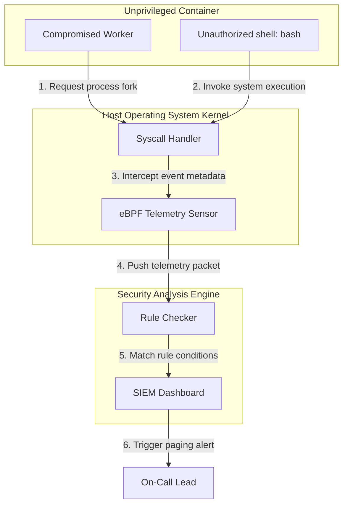

## Table of Contents

1. [The Runtime Detection Gap](#the-runtime-detection-gap)
2. [Kernel-Level Telemetry with eBPF](#kernel-level-telemetry-with-ebpf)
3. [Runtime Threat Rules](#runtime-threat-rules)
4. [Structuring Alert Triage Pipelines](#structuring-alert-triage-pipelines)
5. [Common Telemetry Failures](#common-telemetry-failures)
6. [Putting It All Together](#putting-it-all-together)
7. [What's Next](#whats-next)

## The Runtime Detection Gap

Traditional cloud infrastructure relies on strict perimeter defense. Engineering teams apply network firewalls, compile minimal container images, and run extensive static analysis before deploying an application. While these preventative boundaries are critical, they operate under the assumption that an attacker will attempt to breach the system from the outside network edge. They cannot protect against threats that execute inside the application memory boundary.

Consider a Data Processing Worker that continuously pulls and parses encoded image files from an internal message queue. Because the worker only pulls data from an internal queue, the cloud architecture blocks all external inbound network traffic. However, an attacker uploads a maliciously encoded image file through a public web form on a separate service. When the Data Processing Worker decodes the file, a zero-day vulnerability in the parsing library triggers a remote code execution exploit directly inside the container memory. 

```yaml
- rule: Shell in Container
  desc: A shell was spawned inside a running application container namespace.
  condition: container.id != host and proc.name = bash and spawned_process
  output: >
    Shell spawned in container (user=%user.name user_id=%user.uid
    container_id=%container.id container_name=%container.name
    proc_name=%proc.name parent=%proc.pname cmdline=%proc.cmdline)
  priority: WARNING
  tags: ["container", "shell", "mitre_execution"]
```

Because the network firewall only inspects inbound traffic and the static scanner approved the container image days ago, the perimeter defenses are completely blind to this intrusion. The attacker gains a foothold inside the container and attempts to launch a system shell to explore the local file system. To detect these post-breach execution attempts, organizations must deploy active runtime sensors that continuously audit low-level behavior deep within the host kernel.

## Kernel-Level Telemetry with eBPF

To monitor an application securely without modifying its source code or relying on vulnerable user-space logging daemons, modern runtime sensors utilize eBPF (Extended Berkeley Packet Filter). eBPF acts as a sandboxed execution engine embedded directly within the operating system kernel. It functions as an automated flight recorder, observing low-level system calls such as network socket creation, file modifications, and process executions in real time.

When the compromised Data Processing Worker attempts to launch a shell, the container runtime must request the host operating system kernel to execute the new process via the `execve` system call. An eBPF probe attached to this kernel call intercepts the request instantly. It extracts the parent process ID, the exact command string requested, and the associated container metadata. The probe then immediately forwards this detailed event payload to a secure user-space monitoring daemon.

Because eBPF operates entirely inside the kernel space, it is immune to container-level tampering. If an attacker gains root privileges inside the container namespace and attempts to delete local application logs to cover their tracks, the kernel-level eBPF sensor continues to record every action uninterrupted, ensuring a tamper-proof audit trail.

## Runtime Threat Rules

Raw eBPF telemetry generates immense data volume. To translate these raw system calls into actionable security alerts, platform teams deploy open-source runtime analysis engines like Falco. These engines parse the incoming eBPF event stream and evaluate the metadata against a strict set of threat detection rules.

When the monitoring daemon receives an event payload from the eBPF probe, the analysis engine checks the process attributes. 



If the engine determines that the executing process is `bash`, the namespace does not belong to the primary host node, and the process is newly spawned, it triggers a violation of the "Shell in Container" rule. The engine instantly generates a high-priority security alert. This alert includes context parameters—such as the exact Kubernetes pod name, the container ID, and the command arguments—allowing security analysts to identify exactly which workload is under attack without needing to manually hunt through generic system logs.

## Structuring Alert Triage Pipelines

While capturing granular system calls provides deep visibility, it also generates significant operational noise. If every anomalous network connection triggers a paging alarm to the incident response team, the responders will quickly experience alert fatigue. They will begin ignoring critical threat signals buried among thousands of benign warnings. 

To prevent this fatigue, organizations must establish structured alert triage pipelines. They configure the runtime analysis engine to forward all rule violations directly to a centralized Security Information and Event Management (SIEM) platform. The SIEM acts as the primary aggregation hub. 

The SIEM applies dynamic grouping rules, consolidating dozens of individual event warnings generated by the same container ID or host node into a single cohesive incident ticket. It then performs contextual correlation. If an alert indicating an unexpected shell spawn occurs mere seconds after the CI/CD pipeline deploys a fresh container image, the SIEM may deprioritize the alert as a routine debugging artifact. However, if that identical alert occurs on a stable production image that has remained unchanged for months, the SIEM immediately escalates the incident and pages the on-call security team.

## Common Telemetry Failures

When implementing kernel-level detection systems, platform teams encounter significant operational and technical hurdles.

The most immediate challenge is CPU and memory overhead. Recording every single file read and write operation across a cluster running hundreds of containers requires massive computational resources and generates prohibitive log storage costs. Teams must configure selective eBPF filters, restricting the probes to monitor only high-risk system calls—such as `execve` for process execution, `connect` for outbound networking, and `openat` for sensitive administrative files—while ignoring routine application data flows.

Dynamic application behavior frequently triggers false positives. Standard operational tasks, such as automated configuration updates, health checks, or database backup scripts, often spawn short-lived processes that mimic intrusion techniques. If detection rules are overly aggressive, these benign maintenance tasks will trigger continuous alarms. Security engineers must continuously tune their rules, creating specific namespace and process-level allowlists for known maintenance operations.

Finally, raw telemetry lacks actionable context. If an eBPF sensor only reports raw system process IDs without translating them into Kubernetes pod names or deployment labels, incident responders cannot locate the affected workload in the cluster. Telemetry pipelines must integrate directly with the cluster API to automatically enrich raw host kernel events with dynamic container and namespace metadata before generating an alert.

## Putting It All Together

Runtime threat detection acknowledges that static boundaries and perimeter firewalls cannot stop every intrusion. The runtime detection gap demonstrates how attackers bypass network controls by exploiting vulnerabilities inside the application memory, launching post-breach operations directly from the container.

By deploying eBPF sensors in the host kernel, organizations capture untamperable telemetry data detailing exact process executions and system calls. Analysis engines evaluate this data against strict behavioral rules to generate precise threat signals. Finally, routing these signals through a structured SIEM triage pipeline groups related events and correlates context, ensuring that incident responders receive high-fidelity alerts without suffering from alert fatigue.

## What's Next

Capturing and triaging host threat signals ensures that active runtime compromises are identified immediately. Once an active security signal is verified, responders must execute systematic runbooks to safely isolate the threat. In the next article, we will examine incident response procedures, focusing on the NIST incident handling lifecycle, preservation-first containment sequences, and the value of actionable, step-by-step CLI runbooks during crisis scenarios.
