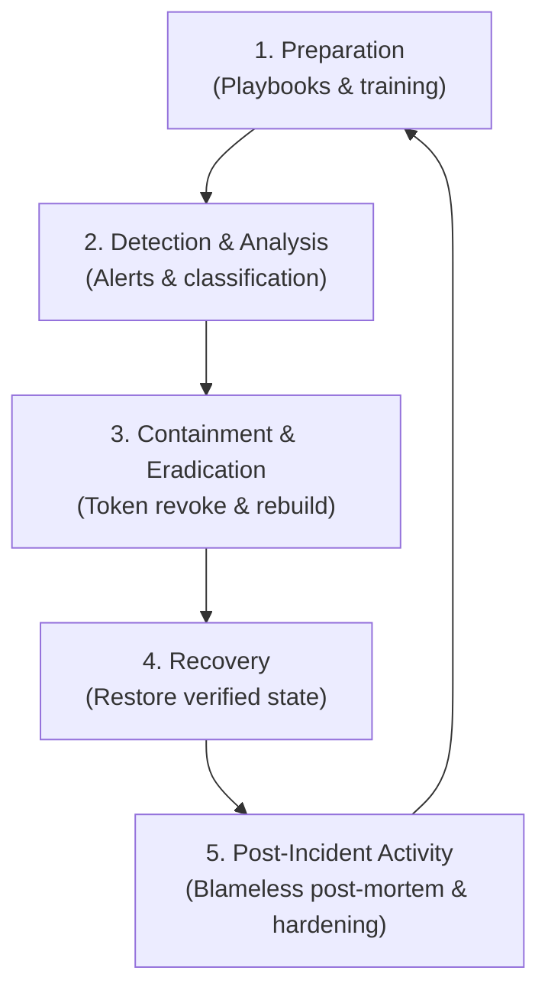

## Table of Contents

1. [Operational Coordination Under Security Pressure](#operational-coordination-under-security-pressure)
2. [Anatomy of an Uncoordinated Crisis Response](#anatomy-of-an-uncoordinated-crisis-response)
3. [The NIST Incident Response Lifecycle](#the-nist-incident-response-lifecycle)
4. [Classifying the Event: Knowns, Unknowns, and Core Roles](#classifying-the-event-knowns-unknowns-and-core-roles)
5. [Containing the Threat Without Losing Forensic Evidence](#containing-the-threat-without-losing-forensic-evidence)
6. [Designing Predictable Security Runbooks](#designing-predictable-security-runbooks)
7. [Defining Stop Points and Escalation Gates](#defining-stop-points-and-escalation-gates)
8. [The Boundaries of Safe Runbook Automation](#the-boundaries-of-safe-runbook-automation)
9. [Putting It All Together](#putting-it-all-together)

## Operational Coordination Under Security Pressure

When a security incident strikes, the operational environment changes instantly. Standard procedures, deployment schedules, and product sprint goals are immediately suspended. The team is forced to make high-stakes, time-sensitive decisions while operating under immense psychological pressure and working with incomplete, confusing information.

In these high-pressure scenarios, a lack of clear coordination is just as dangerous as the security breach itself. If engineers act independently without central leadership—running ad-hoc scripts to delete resources, rotating random credentials, or shutting down active servers—they frequently compound the crisis. 

Uncoordinated actions can cause massive self-inflicted production outages, break active application integrations, and permanently erase the volatile filesystem memory and log trails that forensic investigators need to identify the attacker.

To manage these events successfully, organizations must deploy a structured **Incident Response and Runbooks** framework. Incident response is the operational discipline that coordinates people, evidence, and mitigations during a crisis. 

By replacing ad-hoc panic with predictable, step-by-step security playbooks, we ensure that threats are isolated rapidly, communication channels remain clear, and critical evidence is preserved to trace the breach completely.

## Anatomy of an Uncoordinated Crisis Response

To understand why structured, coordinated playbooks are an absolute requirement, we must trace how an ad-hoc, unguided response compounds a security breach. Consider a real-world incident.

An automated security scanning system raises a high-severity alert: an unauthorized third-party package has executed a malicious build script inside the primary continuous integration runner for the orders API, exposing the pipeline's active NPM registry publish key and cloud deployment credentials.

The platform engineer on call receives the alert, panics, and immediately jumps onto the main repository server. Bypassing the security team, they attempt to rotate the credentials manually. 

Because they are working rapidly under pressure without a written playbook, they rotate the active NPM publish token but accidentally copy the new key into the wrong pipeline secret field, breaking the automated production deployment queue.

Simultaneously, a developer on the application team sees the deployment errors, assumes the runner is suffering a memory leak, and deletes the entire CI runner workspace directory to clear the build cache.

This action permanently erases the transient dependency installation folders and network execution logs where the malicious package executed. When the security team finally joins the triage channel, they find themselves blind. The volatile forensic evidence is completely gone, the production deploy pipeline is broken, and they possess no path to verify whether the attacker used the exposed credentials to pivot into other systems.

This crisis illustrates that the primary failure was not the initial package compromise, but the unguided, uncoordinated response. Had the team utilized a structured incident classification, paused the pipeline cleanly, preserved the runner state, and executed a written token-rotation runbook, the threat would have been contained in minutes, preserving the logs and keeping production healthy.

## The NIST Incident Response Lifecycle

To structure our crisis response, we adopt the industry-standard **NIST Incident Response Lifecycle** (NIST SP 800-61). This framework partitions incident management into four continuous, highly structured phases:

* **1. Preparation**: Designing the controls, writing the playbooks, establishing communication channels, and training the team *before* an incident occurs. This phase builds the organizational capacity to handle crises.
* **2. Detection and Analysis**: Monitoring alerts, analyzing telemetry logs, classifying the event severity, and verifying if a security boundary was actually breached. This phase separates background operational anomalies from active security threats.
* **3. Containment, Eradication, and Recovery**: Restricting the attacker's network paths, revoking compromised credentials (containment), removing the root cause vulnerability or malicious code (eradication), and restoring services to a verified, secure operating state (recovery).
* **4. Post-Incident Activity**: Gathering the response team, conducting a blameless post-mortem, tracing the root cause, and executing systemic architectural hardening changes to prevent the incident from repeating.



This lifecycle operates as a continuous improvement loop. The lessons learned during post-incident activities flow directly back into the preparation phase, refining your runbooks and closing architectural gaps to make the cluster inherently more resilient.

## Classifying the Event: Knowns, Unknowns, and Core Roles

The moment a security signal is verified, the team must formally declare an incident and establish a **Classification Record**. The classification record acts as the central command log, defining exactly what is currently known, what remains unknown, and who is leading the response.

During the first critical hour of a crisis, the incident lead must enforce strict information hygiene, resisting the urge to fill gaps with speculation.

Consider a formal classification record declared for the orders API pipeline compromise:

```text
Incident ID: INC-418
Declared: 2026-05-18T10:08:00Z
Target System: devpolaris-orders-api
Trigger Signal: Malicious package `orders-helper-build@2.0.7` executed postinstall script inside runner workflow #1187

Incident Knowns:
  - Malicious code executed with NPM_PUBLISH_TOKEN available in environment memory.
  - Active runner task possessed temporary production deployment identity role.
  - No unauthorized package versions have been published to our official registry.

Incident Unknowns:
  - Whether the malicious script read and exfiltrated the publish token.
  - Whether the temporary deployment identity was abused to query cloud APIs.
  - How the transitive dependency was introduced into the source manifest.

Assigned Incident Roles:
  - Incident Lead: maya-dev (Coordinates the timeline and decision gates)
  - Security Lead: oren-platform (Owns containment actions, forensics, and risk calls)
  - Communications Owner: lina-support (Manages internal updates and stakeholder reports)
  - Scribe: noah-platform (Records all actions, timestamps, and links in the incident log)
```

This record establishes immediate, operational clarity. It draws a hard line between verified facts and unknowns, providing the security lead with a clear list of investigation targets. 

Furthermore, by assigning explicit roles, the team eliminates confusion: the incident lead owns the decision cadence, the security lead focuses on forensics, the communications owner keeps stakeholders aligned, and the scribe captures every decision in real-time, ensuring no details are lost.

## Containing the Threat Without Losing Forensic Evidence

Containment is the first operational phase of a live incident. Its goal is simple: stop ongoing harm, isolate the compromised systems, and block the attacker's access paths. 

However, containment is highly delicate. If you contain a threat by abruptly rebooting a host node or wiping a container filesystem, you destroy the volatile forensic evidence—such as active process trees, memory dumps, and ephemeral socket connections—that security leads need to trace the attacker.

To execute a secure containment, the security team must follow a strict **Preservation-First** sequence:

First, **Snapshot and Export**. Before deleting or resetting any workflow run or container instance, export all volatile logs, build descriptors, and container layers to an isolated, read-only security storage repository.

Second, **Revoke Credentials**. Rather than attempting to patch the code first, immediately revoke the exposed credentials. In a pipeline compromise, this means revoking the active NPM registry tokens and terminating the runner's OIDC cloud role sessions, rendering the attacker's exfiltrated keys useless:

```text
Containment Log: INC-418-C02
Time: 2026-05-18T10:21:09Z
Action: Revoked NPM publish token `npm-orders-release-2026-q2`
Validation: Verified token list is empty. Test publish command returned 401.
Owner: oren-platform
```

Third, **Pause Pipelines**. Temporarily disable the affected CI/CD workflows to prevent any new, automated commits from triggering builds or deploying code while the root cause is investigated.

Fourth, **Verify Boundary Isolation**. Confirm that all neighboring namespaces and databases remain secure, using network policy checks and cloud API audit logs to prove the compromise was contained to the host runner namespace.

By prioritizing evidence preservation alongside isolation, you guarantee that your containment actions protect the system without blinding your forensic investigators.

## Designing Predictable Security Runbooks

A security runbook is a written, repeatable procedure designed to guide engineers through critical operations (such as token rotations, credential revocations, or system isolations) during a crisis. A runbook must not read like general architectural documentation. To be effective under stress, it must be highly predictable, self-contained, and explicit.

Every step in a security runbook must declare three properties: the exact command to run, the *exact* expected result, and the specific evidence the operator must save.

Consider a professional, step-by-step token rotation runbook:

### Runbook: NPM Publish Token Rotation

* **Purpose**: Revoke and replace an exposed NPM registry publish token for namespaced packages.
* **Initiation Trigger**: Declared incident workflow (Incident Lead request)
* **Required Inputs**: Target package scope (`@devpolaris/orders-api`), affected workflow name, and active incident ticket ID.

#### Step 1: Identify the Compromised Token
* **Action**: List the active registry tokens from the command line interface:
  ```bash
  $ npm token list --json
  ```
* **Expected Result**: The output array contains a token metadata object matching the affected key prefix, with the `readonly` attribute set to `false`:
  ```json
  [
    {
      "key": "abcd1234",
      "token": "npm_************q2",
      "created": "2026-04-01T09:02:44.000Z",
      "readonly": false,
      "automation": true
    }
  ]
  ```
* **Evidence to Save**: Copy the JSON token metadata object and attach it to the incident ticket.

#### Step 2: Revoke the Compromised Token
* **Action**: Execute the revocation command using the target token key ID identified in Step 1:
  ```bash
  $ npm token revoke abcd1234
  ```
* **Expected Result**: The command exits with status code 0, and a follow-up list command returns an empty array or proves the key `abcd1234` is absent.
* **Evidence to Save**: Copy the terminal execution output and the follow-up empty token list.

#### Step 3: Provision and Inject the Replacement Token
* **Action**: Generate a new automation token, copy the key, and inject it as a GitHub Environment Secret (`NPM_PUBLISH_TOKEN`) under the production environment settings.
* **Expected Result**: The repository audit log shows a successful secret update event, and a dry-run check workflow runs successfully in a sandbox:
  ```bash
  $ npm whoami
  devpolaris-release-bot
  ```
* **Evidence to Save**: Attach the dry-run workflow execution log showing successful authentication without package modification.

---

This runbook design leaves no room for guesswork. By detailing the exact command and expected output, it guarantees that even a junior engineer working under intense stress can execute the rotation successfully, collecting the precise evidence required to prove the control was operated.

## Defining Stop Points and Escalation Gates

A common failure mode in runbook execution is "tunnel vision." An engineer executing a routine playbook may encounter unexpected, highly suspicious activity—such as finding multiple administrative tokens they did not expect, or seeing active, unauthorized uploads—but continues executing the runbook steps quietly, hoping to resolve the issue themselves.

To prevent this, every security runbook must declare explicit **Stop Points** and **Escalation Gates** near the top of the document.

A stop point is a concrete, observable boundary. If the operator encounters a stop condition, they must immediately halt the runbook, freeze the operational environment, and escalate the event to the incident lead.

Standard escalation triggers for a credential rotation playbook include:

* **Unrevokable Tokens**: The revocation command fails, or the token remains active after execution, indicating an API failure or active administrative hijacking.
* **Unaccounted Registry Activity**: The registry audit log reveals package publishing events that cannot be mapped to any approved repository commits.
* **Multi-Secret Exposure**: The logs reveal that secondary production keys (such as database credentials or KMS keys) were also loaded in the compromised runner context.
* **Evidence Anomalies**: The workflow log files are missing, truncated, or have been deleted outside of standard retention limits, indicating an active attempt to cover tracks.

By codifying these stop points, you ensure that routine operations are immediately escalated to incident coordination the moment the threat boundaries expand.

## The Boundaries of Safe Runbook Automation

When designing runbooks, platform teams frequently seek to automate every step. While automation is highly valuable for speed, we must define the clear boundaries of safe runbook automation. Some tasks must remain strictly manual to prevent catastrophic failures.

Consider a **Decision-vs-Automation Matrix**:

* **Exporting workflow logs (Automated)**: High-speed, low-risk. Automation extracts the data immediately, ensuring volatile logs are saved before deletion.
* **Verifying token absence (Automated)**: Simple, deterministic check. Automation queries the API and confirms the key is gone.
* **Revoking a single, explicitly verified key (Automated)**: Safe when the key ID is confirmed via peer approval.
* **Revoking every key in the cloud account (Manual)**: Extremely dangerous. Automating a blanket revocation during a panic can destroy the entire corporate infrastructure, breaking healthy applications and shutting down communication channels.
* **Deciding customer impact and legal notifications (Manual)**: Requires deep context, architectural understanding, and executive coordination. It must never be automated.

The operational rule is to automate **evidence collection** and **deterministic verifications**, while reserving **remediation decisions** and **broad scope revocations** for human judgment.

## Putting It All Together

Coordinating active security incidents requires replacing ad-hoc panic with structured NIST processes, preservation-first containment sequences, and predictable runbooks. By mapping response tasks, classifying knowns and unknowns, designing step-by-step playbooks with expected outputs, and establishing explicit manual stop points, you maintain operational control during a crisis.

When structuring and auditing your incident readiness systems, ensure you enforce these five core practices:

First, operate incident response through the four NIST phases. Train your teams on Preparation, Detection, Containment/Recovery, and Post-Incident learning to ensure systematic coordination.

Second, compile a formal Classification Record immediately. Draw a clear line between verified facts and unknowns, and assign explicit roles (Incident Lead, Security Lead, Scribe) to keep coordination focused.

Third, execute containment with a preservation-first mindset. Snapshot and export volatile runner logs, process trees, and container filesystems before executing resets or deletions.

Fourth, write predictable, step-by-step security runbooks. Detail the exact command to run, the expected output schema, and the precise evidence the operator must save.

Fifth, define explicit Stop Points and Escalation Gates in every playbook. Ensure operators halt routine steps and escalate immediately if they encounter unrevokable tokens, unaccounted logs, or multi-secret exposures.

## What's Next

Coordinating incident responses and playbooks protects the cluster during active crises. However, the largest security improvements occur after the incident has closed. In the final chapter, **Post-Incident Hardening**, we will cover conducting blameless post-mortems, executing the "Five Whys" root-cause methodology, codifying pipeline fixes as declarative code, and verifying mitigations continuously.


*This summary shows incident classification, containment, evidence preservation, runbooks, escalation, and recovery.*

---

**References**

- [NIST SP 800-61 Rev. 2 Computer Security Incident Handling Guide](https://csrc.nist.gov/pubs/sp/800/61/r2/final) - NIST standards governing incident response lifecycles, coordination roles, and evidence handling.
- [Google SRE Workbook: Incident Response](https://sre.google/workbook/incident-response/) - Practical playbook design, incident management, and communication guidelines.
- [NPM Registry Token API Reference](https://docs.npmjs.com/about-npm-tokens) - Technical documentation on listing, creating, and revoking registry keys.
- [OWASP Software Supply Chain Security Guide](https://owasp.org/www-project-integration-standards/writeups/build_environment_security/) - Recommendations on securing pipeline runners, credential rotations, and workspace logs.
- [Sigstore Cosign Image Attestation](https://docs.sigstore.dev/cosign/attestation/) - Best practices for cryptographically signing build and scan artifacts.
