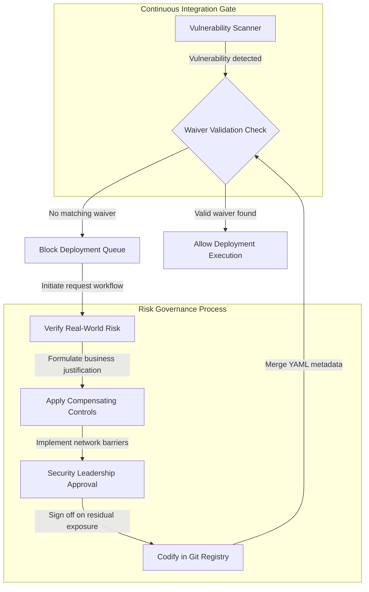

## Table of Contents

1. [The Legacy Dependency Dilemma](#the-legacy-dependency-dilemma)
2. [The Risk Exception Lifecycle](#the-risk-exception-lifecycle)
3. [Designing Compensating Controls](#designing-compensating-controls)
4. [Codifying the Exception Registry](#codifying-the-exception-registry)
5. [Common Governance Failures](#common-governance-failures)
6. [Putting It All Together](#putting-it-all-together)
7. [What's Next](#whats-next)

## The Legacy Dependency Dilemma

Continuous integration pipelines block deployments when vulnerability scanners identify critical flaws in application code or underlying infrastructure. This strict enforcement model works perfectly for modern, stateless microservices where patching simply involves updating a package version and redeploying. However, it breaks down entirely when applied to complex, stateful enterprise systems.

Consider an inventory management platform that relies on a legacy, proprietary database engine. The vendor publishes a security advisory revealing a critical authentication bypass vulnerability in the database connector library used by the application. The continuous integration scanner immediately flags the vulnerability and blocks the next release candidate. The development team attempts to update the connector library, but the new version fundamentally alters the network handshakes, entirely breaking the connection to the legacy database backend. 

```yaml
exception_id: EX-2026-901
title: Legacy Database Connector Vulnerability
status: Approved
dates:
  created: "2026-05-18"
  expires: "2026-11-18"
risk_metadata:
  rule_id: CVE-2026-1234
  affected_component: "src/db/connector.js"
  original_severity: Critical
business_justification: |
  The database connector relies on a vendor-supplied binary that lacks active updates.
  Migrating to a replacement connector requires a database engine upgrade scheduled for Q4.
compensating_controls:
  - "Restricted network ingress: Database subnet ingress is limited exclusively to app-tier security groups."
  - "WAF inspection: Edge WAF rules actively scan all incoming HTTP request payloads for SQL injection patterns."
approval:
  authorized_by: "maya-security-lead"
  approval_ticket: "SEC-9821"
```

To fully resolve the vulnerability, the team must execute a six-month database migration project. If the security gate remains strictly enforced without exceptions, the delivery pipeline completely halts for six months, preventing the team from shipping minor feature updates, unrelated bug fixes, or even critical security patches for other components. To maintain business continuity without abandoning security oversight, engineering teams must deploy compensating controls and document the residual exposure through a formalized risk exception lifecycle.

## The Risk Exception Lifecycle

A risk exception is a temporary, formally documented compliance waiver. It functions as a binding contract between the development and security teams, acknowledging the presence of a known vulnerability, evaluating its operational threat, and agreeing on a rigid timeline for resolution.

The lifecycle begins with identification. The security scanner flags a critical exposure, and the engineering team determines that applying a direct patch represents a breaking architectural change. They initiate an exception request detailing the business constraint. 

The security lead then evaluates the real-world exploitation risk. If the vulnerable service is internet-facing and handles sensitive user records, the exception is typically rejected immediately. If the vulnerable service is an internal analytics tool buried deep within a private subnet, the security lead proceeds to the mitigation phase.

The engineering team then designs and applies alternative defensive barriers—known as compensating controls—to reduce the threat surface. Once these controls are verified, the security lead signs the formal waiver, the exception metadata is recorded in the central repository, and the continuous integration pipeline dynamically unblocks the deployment.

## Designing Compensating Controls

When a direct software patch is unavailable, compensating controls alter the surrounding threat landscape to isolate the vulnerable component, reducing the overall exploitation probability to acceptable thresholds.

Network microsegmentation is often the most effective compensating control. If a container's internal data processing library is vulnerable to remote code execution, platform teams wrap the specific pod in a strict network policy. They block all lateral connection routes, allowing only verified traffic from designated internal namespaces to reach the container, effectively cutting off external attack vectors.



If the vulnerability exists in a web-facing service, teams configure input filtering at the edge. They deploy web application firewalls and API gateways to inspect incoming HTTP payloads for patterns that target the unpatched vulnerability. These edge filters strip out malicious request streams long before they reach the vulnerable application container. 

Finally, organizations establish robust runtime auditing. They deploy low-level sensors inside the container namespace to monitor process behavior. If the unpatched component suddenly spawns unexpected child processes or attempts unauthorized outbound connections, the sensors trigger immediate alerts to the incident response team.

## Codifying the Exception Registry

Maintaining audit integrity requires teams to reject informal, untraceable verbal approvals or scattered email waivers entirely. Every risk exception must be codified as a version-controlled YAML or JSON document stored directly alongside the application source code in a dedicated registry directory.

Storing exceptions in Git establishes complete transparency. Every engineer working in the repository has real-time visibility into the active risks associated with the codebase. The exception files explicitly document the technical justification for the vulnerability, the active compensating controls, and the identity of the authorizing security lead.

Git commit histories function as an immutable audit trail. During a compliance review, external auditors can trace the exact history of every exception, verifying when a waiver was introduced, who approved it, and whether its expiration boundary was ever improperly extended. Furthermore, codifying waivers in Git allows continuous integration pipelines to automatically ingest the exception directory. If a scanner generates an alert that matches an approved, non-expired waiver file in the repository tree, the pipeline suppresses the warning and proceeds with the deployment autonomously.

## Common Governance Failures

When establishing risk exception protocols, platform teams encounter significant operational challenges that can quickly degrade their security posture.

The most dangerous failure mode involves infinite waiver extensions. Risk exceptions are granted strictly as temporary measures while a permanent fix is planned. If the governance pipeline does not enforce rigid expiration dates, engineering teams will repeatedly extend waivers simply to avoid the difficult architectural work required to fix the underlying issue. Temporary risks calcify into permanent security gaps. Engineering leadership must enforce maximum duration limits on all waivers, requiring executive-level justification for any extension beyond the initial window.

Compensating controls are frequently deployed but rarely verified. Writing a web application firewall rule to protect a vulnerable endpoint is useless if the rule syntax is misconfigured and allows malicious payloads to pass through. Platform teams must mandate dynamic, automated vulnerability testing to explicitly prove that the compensating control successfully blocks exploitation attempts against the unpatched component before the waiver is approved.

Finally, wildcard exception scopes destroy compliance integrity. Writing a risk waiver that broadly exempts an entire repository namespace from all dependency vulnerability rules allows developers to introduce completely unrelated, highly critical vulnerabilities without ever triggering a pipeline block. Exception YAML files must be strictly pinned to a specific CVE identifier and an explicit code component path.

## Putting It All Together

Managing unavoidable software risks requires replacing ad-hoc workarounds with a structured risk exception lifecycle, version-controlled repository registries, and verifiable compensating controls. The legacy dependency dilemma highlights why strictly failing closed on all vulnerabilities will eventually break business continuity.

By isolating vulnerable services through network microsegmentation and edge filtering, organizations reduce the exploitation threat to acceptable levels. Documenting the business justifications and active controls directly in Git ensures complete transparency and provides auditors with an immutable evidence trail. Enforcing hard expiration dates on these waivers guarantees that risk acceptance remains a temporary bridge to a permanent architectural fix.

## What's Next

Establishing risk exceptions and compensating controls allows organizations to safely manage unpatchable vulnerabilities while preserving their delivery pipelines. However, despite these layered defenses, active security incidents will inevitably occur. In the next submodule, **Incident Readiness**, we will shift focus to runtime threat detection, examining eBPF telemetry and alert triage to isolate active threats inside the cluster.


*This summary keeps risk acceptance tied to owners, expiry, compensating controls, a registry, and review.*

