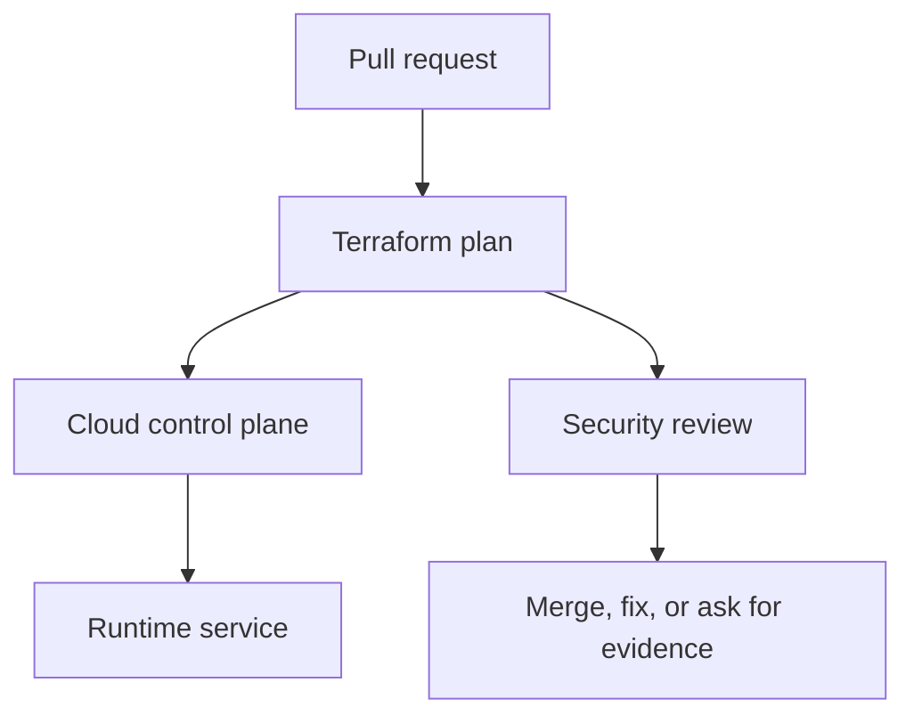

## Table of Contents

1. [The Change You Are Really Reviewing](#the-change-you-are-really-reviewing)
2. [The devpolaris-orders-api Baseline](#the-devpolaris-orders-api-baseline)
3. [Emergency Access Still Needs a Shape](#emergency-access-still-needs-a-shape)
4. [Activate With a Ticket and a Timer](#activate-with-a-ticket-and-a-timer)
5. [Audit Every Privileged Action](#audit-every-privileged-action)
6. [Close the Door After the Incident](#close-the-door-after-the-incident)
7. [Failure Modes and Fix Directions](#failure-modes-and-fix-directions)
8. [A Reviewer Checklist](#a-reviewer-checklist)

## The Change You Are Really Reviewing

Cloud infrastructure security work often arrives as an ordinary pull request. For
devpolaris-orders-api, the change might be a Terraform edit that adds storage access, opens
a listener, changes a policy rule, or updates an emergency role. The review is not separate
from delivery work. It is the part of delivery where you prove that the cloud control plane
will receive the change you intended.

In this article, break glass access means the practical habit of reading cloud
configuration, plan output, account state, and audit evidence together. The running example
uses Terraform-managed AWS resources for devpolaris-orders-api. The same mental model also
works in Azure: a role assignment, a network security group rule, or a policy exemption
still needs a caller, a target, a scope, and evidence.

The service accepts order requests, writes invoice files, emits logs, and calls a small set
of cloud APIs. That shape gives us enough reality to make security decisions without
inventing a large platform. You will see Terraform snippets, plan excerpts, CLI output, and
failure evidence that a reviewer can use before merge or during an incident.



The important point is sequence. A reviewer should catch broad access, exposed paths, weak
policy decisions, and drift before the apply changes production. When the change has already
happened, the same evidence becomes the diagnostic trail for cleanup.

## The devpolaris-orders-api Baseline

A useful security review starts with a baseline. The baseline is the normal shape of the
service: which identity runs it, which network paths should reach it, which storage it owns,
and which teams are allowed to change it. Without that baseline, every finding looks
isolated, and you cannot tell whether a change is intentional or accidental.

For this module, the production stack is small. Terraform manages an ECS service or Azure
Container App equivalent, an application role, a private database endpoint, an invoice
bucket or storage account, a log destination, and network rules for HTTPS traffic. The exact
provider matters less than the review habit: name the resource, name the scope, and compare
it with the service story.

| Baseline item | Expected shape | Why it matters |
|---|---|---|
| Runtime identity | `orders-api-prod` role or managed identity | Limits what the app can do |
| Public entry | HTTPS through approved edge only | Keeps direct service ports private |
| Storage | Invoice objects under service-owned bucket path | Prevents cross-service data access |
| State owner | Terraform workspace for production | Gives changes a reviewed path |
| Audit owner | Platform security channel and ticket | Lets incidents reconstruct actions |

A baseline should be boring enough to remember. If a reviewer cannot say what identity the
app uses or which ports should be public, the team will approve changes by reading line
syntax instead of reading risk. That is how a small edit becomes a surprise after apply.

The baseline also gives you a fair way to review exceptions. A temporary public rule, a
broad permission, or an emergency role activation may be justified during a migration or
incident. The review question is whether the exception is named, time-limited, logged, and
connected to a real operational need.

## Emergency Access Still Needs a Shape

Break glass access is a reserved path for emergencies when normal access cannot solve the
problem. The phrase comes from the idea of breaking glass to reach emergency equipment, but
in cloud systems the access should still be planned, logged, and closed. Unplanned emergency
access becomes permanent privileged access with a dramatic name.

For devpolaris-orders-api, normal production changes go through Terraform CI. Break glass
might be needed if CI is down, a bad IAM change blocks Terraform, or an incident requires
temporary production inspection. The access should answer who can activate it, what they can
do, how long it lasts, and where the evidence is stored.

| Question | Expected answer |
|---|---|
| Who can activate? | Small on-call group with strong MFA |
| What can it touch? | Production account or subscription scope needed for recovery |
| How long? | Short session with expiry and ticket link |
| Who is notified? | Incident channel and audit log owner |
| How is it closed? | Session ends, changes reviewed, access path reset |

## Activate With a Ticket and a Timer

The activation process should be short enough to work during an incident and strict enough
to avoid silent use. A ticket or incident record gives the activation a reason. A timer
prevents the emergency path from becoming the new normal. MFA and hardware-backed
credentials reduce the risk that the emergency account is stolen.

```text
Incident: INC-2026-05-08-014
Service: devpolaris-orders-api
Reason: Terraform role cannot update production security group after failed policy deploy
Activator: maya.oncall
Approver: lee.incident-commander
Access path: break-glass-prod role
Expiry: 2026-05-08T20:00:00Z
```

The record is not paperwork for its own sake. It lets another engineer understand why
privileged actions appear in audit logs. It also gives the team a place to attach the
post-incident review and any Terraform changes needed to return to normal operations.

## Audit Every Privileged Action

Break glass access without audit logging is just a shared secret. Every activation should
create events that answer who assumed the role, which source address was used, which API
calls followed, and when the session ended. The audit trail should be visible to people who
are not the same person using the access.

```bash
$ aws cloudtrail lookup-events --lookup-attributes AttributeKey=Username,AttributeValue=break-glass-prod

EventTime              EventName          Username          SourceIPAddress
2026-05-08T18:34:12Z   AssumeRole         break-glass-prod  198.51.100.44
2026-05-08T18:36:02Z   PutRolePolicy      break-glass-prod  198.51.100.44
2026-05-08T18:51:29Z   DeleteRolePolicy   break-glass-prod  198.51.100.44
```

This evidence shows a role assumption followed by a temporary policy change and cleanup.
During review, compare the API calls with the incident record. If the incident needed only a
security group fix but the audit trail shows bucket policy edits, ask for an explanation and
inspect the resulting state.

## Close the Door After the Incident

The closing step is part of the access design. After the service is stable, the team should
remove temporary policies, rotate or disable emergency credentials if they were exposed,
restore Terraform as the owner, and write down what normal access failed. Otherwise the same
emergency path will be used again for routine work.

```text
Post-incident access closure

[done] break-glass-prod session expired
[done] temporary role policy removed
[done] Terraform plan returns no unexpected changes
[done] CloudTrail events attached to INC-2026-05-08-014
[todo] add CI role permission for approved security group rollback
```

The final todo is the real improvement. If the incident used break glass because the CI role
lacked a safe rollback permission, fix the normal path. A healthy break glass process should
become less necessary over time because each activation teaches the team which normal
control failed.

## Failure Modes and Fix Directions

Most cloud security failures are visible if you know which layer to inspect. A bad IAM
change appears as an access denied error, a suspicious allow statement, or an unexpected
audit event. A network exposure appears as a wide CIDR range, a public IP, an open listener,
or traffic from places the service should never see. A policy failure appears as a denied CI
job or, worse, a missing denial where one should have happened.

| Symptom | Likely cause | First fix direction |
|---|---|---|
| `AccessDenied` after deploy | Required action missing from role | Add the smallest action and resource scope |
| Plan opens `0.0.0.0/0` | Rule copied from test or console | Restrict to edge, VPN, or private CIDR |
| Scanner fails on generated module | Module default is too broad | Override input or patch module upstream |
| Drift keeps returning | Console edits bypass Terraform | Import, revert, or move ownership clearly |
| Emergency role remains active | No expiry or closure step | Disable session path and file review ticket |

The fix direction should be specific enough that another engineer can start. Make it secure
is not a fix. Replace the public CIDR with the ALB security group source is a fix direction.
Attach s3:PutObject only to arn:aws:s3:::dp-orders-invoices-prod/* is a fix direction. The
reader should leave the review knowing the next safe edit.

Some failures need a product conversation rather than only a Terraform patch. If support
engineers need production invoice access, the answer may be a read-only support tool with
audit logging, not a wider S3 policy. If a partner needs inbound traffic, the answer may be
PrivateLink, IP allowlisting, or a separate edge path, not a public service port.

## A Reviewer Checklist

A checklist helps when the pull request is large or the release is busy. It should not
replace thinking. It gives the reviewer a stable order so they do not skip identity,
network, policy, drift, or emergency access evidence just because the Terraform diff is
noisy.

| Check | Evidence | Decision |
|---|---|---|
| Scope | Resource ARN, Azure scope, or module path | Is the target narrow enough? |
| Caller | Role, user, managed identity, or workflow identity | Is the caller expected? |
| Action | API action, port, or policy rule | Is the action needed by the service? |
| Time | Expiry, ticket, or lifecycle note | Should this access end later? |
| Detection | Log, alert, scan, or drift check | Will the team notice misuse or change? |

For devpolaris-orders-api, the final review note should be short and concrete. A good note
says what changed, what evidence was checked, and what remains intentionally accepted. That
note becomes useful later when someone asks why a role has a permission or why a network
rule exists.

> Good cloud security review is not a search for perfect infrastructure. It is a search for accurate intent, narrow scope, and usable evidence.

---
For Break Glass Access, connect each finding to one named resource, one owner, and one next
action. A finding without an owner becomes background noise during a release review, even
when the risk is real.

A finding with a clear resource path, evidence, and fix direction can move through normal
delivery work. That difference matters because security work succeeds when engineers can see
exactly what changed and why.

For Break Glass Access, connect each finding to one named resource, one owner, and one next
action. A finding without an owner becomes background noise during a release review, even
when the risk is real.

A finding with a clear resource path, evidence, and fix direction can move through normal
delivery work. That difference matters because security work succeeds when engineers can see
exactly what changed and why.

For Break Glass Access, connect each finding to one named resource, one owner, and one next
action. A finding without an owner becomes background noise during a release review, even
when the risk is real.

A finding with a clear resource path, evidence, and fix direction can move through normal
delivery work. That difference matters because security work succeeds when engineers can see
exactly what changed and why.

For Break Glass Access, connect each finding to one named resource, one owner, and one next
action. A finding without an owner becomes background noise during a release review, even
when the risk is real.

A finding with a clear resource path, evidence, and fix direction can move through normal
delivery work. That difference matters because security work succeeds when engineers can see
exactly what changed and why.

For Break Glass Access, connect each finding to one named resource, one owner, and one next
action. A finding without an owner becomes background noise during a release review, even
when the risk is real.

A finding with a clear resource path, evidence, and fix direction can move through normal
delivery work. That difference matters because security work succeeds when engineers can see
exactly what changed and why.

For Break Glass Access, connect each finding to one named resource, one owner, and one next
action. A finding without an owner becomes background noise during a release review, even
when the risk is real.

A finding with a clear resource path, evidence, and fix direction can move through normal
delivery work. That difference matters because security work succeeds when engineers can see
exactly what changed and why.

For Break Glass Access, connect each finding to one named resource, one owner, and one next
action. A finding without an owner becomes background noise during a release review, even
when the risk is real.

A finding with a clear resource path, evidence, and fix direction can move through normal
delivery work. That difference matters because security work succeeds when engineers can see
exactly what changed and why.

For Break Glass Access, connect each finding to one named resource, one owner, and one next
action. A finding without an owner becomes background noise during a release review, even
when the risk is real.

A finding with a clear resource path, evidence, and fix direction can move through normal
delivery work. That difference matters because security work succeeds when engineers can see
exactly what changed and why.

For Break Glass Access, connect each finding to one named resource, one owner, and one next
action. A finding without an owner becomes background noise during a release review, even
when the risk is real.

A finding with a clear resource path, evidence, and fix direction can move through normal
delivery work. That difference matters because security work succeeds when engineers can see
exactly what changed and why.

For Break Glass Access, connect each finding to one named resource, one owner, and one next
action. A finding without an owner becomes background noise during a release review, even
when the risk is real.

A finding with a clear resource path, evidence, and fix direction can move through normal
delivery work. That difference matters because security work succeeds when engineers can see
exactly what changed and why.

For Break Glass Access, connect each finding to one named resource, one owner, and one next
action. A finding without an owner becomes background noise during a release review, even
when the risk is real.

A finding with a clear resource path, evidence, and fix direction can move through normal
delivery work. That difference matters because security work succeeds when engineers can see
exactly what changed and why.

For Break Glass Access, connect each finding to one named resource, one owner, and one next
action. A finding without an owner becomes background noise during a release review, even
when the risk is real.

A finding with a clear resource path, evidence, and fix direction can move through normal
delivery work. That difference matters because security work succeeds when engineers can see
exactly what changed and why.


**References**

- [AWS Root User Best Practices](https://docs.aws.amazon.com/IAM/latest/UserGuide/root-user-best-practices.html) - AWS guidance for protecting emergency-level account access.
- [AWS IAM User Guide](https://docs.aws.amazon.com/IAM/latest/UserGuide/introduction.html) - Canonical AWS documentation for identities, policies, roles, and access evaluation.
- [Microsoft Entra Privileged Identity Management](https://learn.microsoft.com/entra/id-governance/privileged-identity-management/pim-configure) - Microsoft guidance for just-in-time privileged role activation.
- [Azure RBAC Documentation](https://learn.microsoft.com/azure/role-based-access-control/overview) - Canonical Azure documentation for role assignments and scope.
