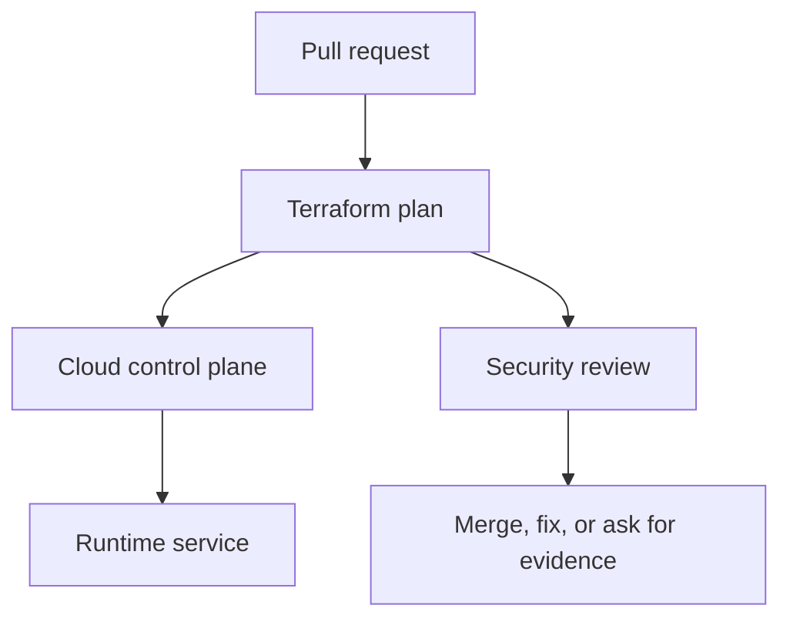

## Table of Contents

1. [The Change You Are Really Reviewing](#the-change-you-are-really-reviewing)
2. [The devpolaris-orders-api Baseline](#the-devpolaris-orders-api-baseline)
3. [Separate Desired State From Real State](#separate-desired-state-from-real-state)
4. [Use Audit Logs to Explain the Difference](#use-audit-logs-to-explain-the-difference)
5. [Choose Revert, Import, or Codify](#choose-revert-import-or-codify)
6. [Detect Misconfiguration Beyond Terraform](#detect-misconfiguration-beyond-terraform)
7. [Failure Modes and Fix Directions](#failure-modes-and-fix-directions)
8. [A Reviewer Checklist](#a-reviewer-checklist)

## The Change You Are Really Reviewing

Cloud infrastructure security work often arrives as an ordinary pull request. For
devpolaris-orders-api, the change might be a Terraform edit that adds storage access, opens
a listener, changes a policy rule, or updates an emergency role. The review is not separate
from delivery work. It is the part of delivery where you prove that the cloud control plane
will receive the change you intended.

In this article, drift and misconfiguration detection means the practical habit of reading
cloud configuration, plan output, account state, and audit evidence together. The running
example uses Terraform-managed AWS resources for devpolaris-orders-api. The same mental
model also works in Azure: a role assignment, a network security group rule, or a policy
exemption still needs a caller, a target, a scope, and evidence.

The service accepts order requests, writes invoice files, emits logs, and calls a small set
of cloud APIs. That shape gives us enough reality to make security decisions without
inventing a large platform. You will see Terraform snippets, plan excerpts, CLI output, and
failure evidence that a reviewer can use before merge or during an incident.



The important point is sequence. A reviewer should catch broad access, exposed paths, weak
policy decisions, and drift before the apply changes production. When the change has already
happened, the same evidence becomes the diagnostic trail for cleanup.

## The devpolaris-orders-api Baseline

A useful security review starts with a baseline. The baseline is the normal shape of the
service: which identity runs it, which network paths should reach it, which storage it owns,
and which teams are allowed to change it. Without that baseline, every finding looks
isolated, and you cannot tell whether a change is intentional or accidental.

For this module, the production stack is small. Terraform manages an ECS service or Azure
Container App equivalent, an application role, a private database endpoint, an invoice
bucket or storage account, a log destination, and network rules for HTTPS traffic. The exact
provider matters less than the review habit: name the resource, name the scope, and compare
it with the service story.

| Baseline item | Expected shape | Why it matters |
|---|---|---|
| Runtime identity | `orders-api-prod` role or managed identity | Limits what the app can do |
| Public entry | HTTPS through approved edge only | Keeps direct service ports private |
| Storage | Invoice objects under service-owned bucket path | Prevents cross-service data access |
| State owner | Terraform workspace for production | Gives changes a reviewed path |
| Audit owner | Platform security channel and ticket | Lets incidents reconstruct actions |

A baseline should be boring enough to remember. If a reviewer cannot say what identity the
app uses or which ports should be public, the team will approve changes by reading line
syntax instead of reading risk. That is how a small edit becomes a surprise after apply.

The baseline also gives you a fair way to review exceptions. A temporary public rule, a
broad permission, or an emergency role activation may be justified during a migration or
incident. The review question is whether the exception is named, time-limited, logged, and
connected to a real operational need.

## Separate Desired State From Real State

Drift means real infrastructure no longer matches the configuration or state that is
supposed to describe it. The cause may be an emergency console edit, a provider default
changing, a manual cleanup, or a resource created outside Terraform. Drift matters because
future plans may surprise the team.

```bash
$ terraform plan -refresh-only

  # aws_security_group_rule.orders_api_admin has changed
  ~ resource "aws_security_group_rule" "orders_api_admin" {
      from_port   = 22
      to_port     = 22
    ~ cidr_blocks = [
        - "10.42.8.0/24",
        + "203.0.113.17/32",
      ]
    }

Plan: 0 to add, 1 to change, 0 to destroy.
```

The plan says the admin source changed from the private network to one public IP. That may
have been an emergency fix. It may also be a forgotten console edit. The next step is not
automatic apply. The next step is to identify who changed it, why, and whether Terraform
should revert or adopt the change.

## Use Audit Logs to Explain the Difference

A refresh-only plan tells you that reality changed. Audit logs help explain how. In AWS,
look for events such as AuthorizeSecurityGroupIngress, RevokeSecurityGroupIngress,
PutBucketPolicy, and AttachRolePolicy. In Azure, inspect role assignment writes, network
security group rule writes, and policy exemption changes.

```bash
$ aws cloudtrail lookup-events --lookup-attributes AttributeKey=ResourceName,AttributeValue=sg-0ordersapi

EventTime              EventName                       Username
2026-05-08T12:18:02Z   AuthorizeSecurityGroupIngress   bob.admin
2026-05-08T12:49:31Z   RevokeSecurityGroupIngress      ci-terraform
```

The first line explains the drift source. The second line may show Terraform later
correcting it. If the drift remains, the team should attach the console edit to an incident
or change ticket, then decide whether to revert or encode the intended rule in Terraform.

## Choose Revert, Import, or Codify

Drift is not always bad. Sometimes it reveals that Terraform is missing a real requirement.
The decision is about ownership. If Terraform owns the resource, the desired state should
eventually live in Terraform. If Terraform should not own it, the team should remove the
confusing partial ownership.

| Situation | Best direction | Reason |
|---|---|---|
| Manual risky change | Revert through Terraform | Restores reviewed baseline |
| Valid resource created manually | Import and add configuration | Brings ownership under review |
| Provider default changed | Update config or ignore intentionally | Prevents repeated noisy plans |
| Shared resource owned elsewhere | Use data source or separate workspace | Avoids ownership conflict |

For devpolaris-orders-api, a one-off public admin rule should usually be reverted. A new log
archive bucket created during an incident may be imported if the service now depends on it.
The reviewer should avoid leaving production in a mixed state where Terraform will fight the
console every week.

## Detect Misconfiguration Beyond Terraform

Some misconfigurations never appear in Terraform because the resource is unmanaged, created
by another system, or changed after apply. Cloud inventory and configuration services help
here. AWS Config, IAM Access Analyzer, Security Hub, Azure Policy, and Defender for Cloud
can report current state even when Terraform is not the owner.

```text
Finding: S3 bucket allows public read
Resource: arn:aws:s3:::dp-orders-invoices-prod
First observed: 2026-05-08T11:02:00Z
Status: ACTIVE
Evidence: bucket policy statement Principal="*" Action="s3:GetObject"
```

The fix direction is to inspect the bucket policy, identify the writer, and remove public
read unless the bucket is intentionally public. Then decide why Terraform or policy checks
did not catch it. The prevention may be a Terraform resource, a scanner rule, or a cloud
policy that blocks public bucket policies.

## Failure Modes and Fix Directions

Most cloud security failures are visible if you know which layer to inspect. A bad IAM
change appears as an access denied error, a suspicious allow statement, or an unexpected
audit event. A network exposure appears as a wide CIDR range, a public IP, an open listener,
or traffic from places the service should never see. A policy failure appears as a denied CI
job or, worse, a missing denial where one should have happened.

| Symptom | Likely cause | First fix direction |
|---|---|---|
| `AccessDenied` after deploy | Required action missing from role | Add the smallest action and resource scope |
| Plan opens `0.0.0.0/0` | Rule copied from test or console | Restrict to edge, VPN, or private CIDR |
| Scanner fails on generated module | Module default is too broad | Override input or patch module upstream |
| Drift keeps returning | Console edits bypass Terraform | Import, revert, or move ownership clearly |
| Emergency role remains active | No expiry or closure step | Disable session path and file review ticket |

The fix direction should be specific enough that another engineer can start. Make it secure
is not a fix. Replace the public CIDR with the ALB security group source is a fix direction.
Attach s3:PutObject only to arn:aws:s3:::dp-orders-invoices-prod/* is a fix direction. The
reader should leave the review knowing the next safe edit.

Some failures need a product conversation rather than only a Terraform patch. If support
engineers need production invoice access, the answer may be a read-only support tool with
audit logging, not a wider S3 policy. If a partner needs inbound traffic, the answer may be
PrivateLink, IP allowlisting, or a separate edge path, not a public service port.

## A Reviewer Checklist

A checklist helps when the pull request is large or the release is busy. It should not
replace thinking. It gives the reviewer a stable order so they do not skip identity,
network, policy, drift, or emergency access evidence just because the Terraform diff is
noisy.

| Check | Evidence | Decision |
|---|---|---|
| Scope | Resource ARN, Azure scope, or module path | Is the target narrow enough? |
| Caller | Role, user, managed identity, or workflow identity | Is the caller expected? |
| Action | API action, port, or policy rule | Is the action needed by the service? |
| Time | Expiry, ticket, or lifecycle note | Should this access end later? |
| Detection | Log, alert, scan, or drift check | Will the team notice misuse or change? |

For devpolaris-orders-api, the final review note should be short and concrete. A good note
says what changed, what evidence was checked, and what remains intentionally accepted. That
note becomes useful later when someone asks why a role has a permission or why a network
rule exists.

> Good cloud security review is not a search for perfect infrastructure. It is a search for accurate intent, narrow scope, and usable evidence.

---
For Drift and Misconfiguration Detection, connect each finding to one named resource, one
owner, and one next action. A finding without an owner becomes background noise during a
release review, even when the risk is real.

A finding with a clear resource path, evidence, and fix direction can move through normal
delivery work. That difference matters because security work succeeds when engineers can see
exactly what changed and why.

For Drift and Misconfiguration Detection, connect each finding to one named resource, one
owner, and one next action. A finding without an owner becomes background noise during a
release review, even when the risk is real.

A finding with a clear resource path, evidence, and fix direction can move through normal
delivery work. That difference matters because security work succeeds when engineers can see
exactly what changed and why.

For Drift and Misconfiguration Detection, connect each finding to one named resource, one
owner, and one next action. A finding without an owner becomes background noise during a
release review, even when the risk is real.

A finding with a clear resource path, evidence, and fix direction can move through normal
delivery work. That difference matters because security work succeeds when engineers can see
exactly what changed and why.

For Drift and Misconfiguration Detection, connect each finding to one named resource, one
owner, and one next action. A finding without an owner becomes background noise during a
release review, even when the risk is real.

A finding with a clear resource path, evidence, and fix direction can move through normal
delivery work. That difference matters because security work succeeds when engineers can see
exactly what changed and why.

For Drift and Misconfiguration Detection, connect each finding to one named resource, one
owner, and one next action. A finding without an owner becomes background noise during a
release review, even when the risk is real.

A finding with a clear resource path, evidence, and fix direction can move through normal
delivery work. That difference matters because security work succeeds when engineers can see
exactly what changed and why.

For Drift and Misconfiguration Detection, connect each finding to one named resource, one
owner, and one next action. A finding without an owner becomes background noise during a
release review, even when the risk is real.

A finding with a clear resource path, evidence, and fix direction can move through normal
delivery work. That difference matters because security work succeeds when engineers can see
exactly what changed and why.

For Drift and Misconfiguration Detection, connect each finding to one named resource, one
owner, and one next action. A finding without an owner becomes background noise during a
release review, even when the risk is real.

A finding with a clear resource path, evidence, and fix direction can move through normal
delivery work. That difference matters because security work succeeds when engineers can see
exactly what changed and why.

For Drift and Misconfiguration Detection, connect each finding to one named resource, one
owner, and one next action. A finding without an owner becomes background noise during a
release review, even when the risk is real.

A finding with a clear resource path, evidence, and fix direction can move through normal
delivery work. That difference matters because security work succeeds when engineers can see
exactly what changed and why.

For Drift and Misconfiguration Detection, connect each finding to one named resource, one
owner, and one next action. A finding without an owner becomes background noise during a
release review, even when the risk is real.

A finding with a clear resource path, evidence, and fix direction can move through normal
delivery work. That difference matters because security work succeeds when engineers can see
exactly what changed and why.

For Drift and Misconfiguration Detection, connect each finding to one named resource, one
owner, and one next action. A finding without an owner becomes background noise during a
release review, even when the risk is real.

A finding with a clear resource path, evidence, and fix direction can move through normal
delivery work. That difference matters because security work succeeds when engineers can see
exactly what changed and why.

For Drift and Misconfiguration Detection, connect each finding to one named resource, one
owner, and one next action. A finding without an owner becomes background noise during a
release review, even when the risk is real.

A finding with a clear resource path, evidence, and fix direction can move through normal
delivery work. That difference matters because security work succeeds when engineers can see
exactly what changed and why.


**References**

- [Terraform Plan Command](https://developer.hashicorp.com/terraform/cli/commands/plan) - Official command reference for reading proposed infrastructure changes before apply.
- [Terraform State](https://developer.hashicorp.com/terraform/language/state) - Terraform documentation for how managed resources are tracked.
- [Terraform Import](https://developer.hashicorp.com/terraform/cli/import) - Official reference for bringing existing infrastructure under Terraform management.
- [AWS IAM Access Analyzer](https://docs.aws.amazon.com/IAM/latest/UserGuide/what-is-access-analyzer.html) - Official service documentation for finding external access and unused access.
