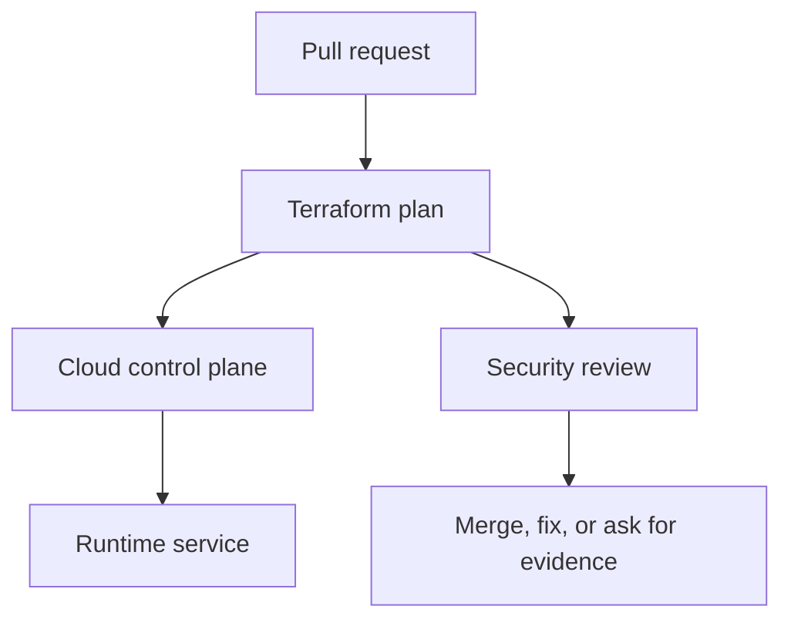

## Table of Contents

1. [The Change You Are Really Reviewing](#the-change-you-are-really-reviewing)
2. [The devpolaris-orders-api Baseline](#the-devpolaris-orders-api-baseline)
3. [Scan Before the Provider API Call](#scan-before-the-provider-api-call)
4. [Know What the Scanner Can See](#know-what-the-scanner-can-see)
5. [Treat Suppressions as Design Decisions](#treat-suppressions-as-design-decisions)
6. [Wire Scan Results Into Pull Requests](#wire-scan-results-into-pull-requests)
7. [Failure Modes and Fix Directions](#failure-modes-and-fix-directions)
8. [A Reviewer Checklist](#a-reviewer-checklist)

## The Change You Are Really Reviewing

Cloud infrastructure security work often arrives as an ordinary pull request. For
devpolaris-orders-api, the change might be a Terraform edit that adds storage access, opens
a listener, changes a policy rule, or updates an emergency role. The review is not separate
from delivery work. It is the part of delivery where you prove that the cloud control plane
will receive the change you intended.

In this article, iac security scanning means the practical habit of reading cloud
configuration, plan output, account state, and audit evidence together. The running example
uses Terraform-managed AWS resources for devpolaris-orders-api. The same mental model also
works in Azure: a role assignment, a network security group rule, or a policy exemption
still needs a caller, a target, a scope, and evidence.

The service accepts order requests, writes invoice files, emits logs, and calls a small set
of cloud APIs. That shape gives us enough reality to make security decisions without
inventing a large platform. You will see Terraform snippets, plan excerpts, CLI output, and
failure evidence that a reviewer can use before merge or during an incident.



The important point is sequence. A reviewer should catch broad access, exposed paths, weak
policy decisions, and drift before the apply changes production. When the change has already
happened, the same evidence becomes the diagnostic trail for cleanup.

## The devpolaris-orders-api Baseline

A useful security review starts with a baseline. The baseline is the normal shape of the
service: which identity runs it, which network paths should reach it, which storage it owns,
and which teams are allowed to change it. Without that baseline, every finding looks
isolated, and you cannot tell whether a change is intentional or accidental.

For this module, the production stack is small. Terraform manages an ECS service or Azure
Container App equivalent, an application role, a private database endpoint, an invoice
bucket or storage account, a log destination, and network rules for HTTPS traffic. The exact
provider matters less than the review habit: name the resource, name the scope, and compare
it with the service story.

| Baseline item | Expected shape | Why it matters |
|---|---|---|
| Runtime identity | `orders-api-prod` role or managed identity | Limits what the app can do |
| Public entry | HTTPS through approved edge only | Keeps direct service ports private |
| Storage | Invoice objects under service-owned bucket path | Prevents cross-service data access |
| State owner | Terraform workspace for production | Gives changes a reviewed path |
| Audit owner | Platform security channel and ticket | Lets incidents reconstruct actions |

A baseline should be boring enough to remember. If a reviewer cannot say what identity the
app uses or which ports should be public, the team will approve changes by reading line
syntax instead of reading risk. That is how a small edit becomes a surprise after apply.

The baseline also gives you a fair way to review exceptions. A temporary public rule, a
broad permission, or an emergency role activation may be justified during a migration or
incident. The review question is whether the exception is named, time-limited, logged, and
connected to a real operational need.

## Scan Before the Provider API Call

Infrastructure-as-code scanning checks files before Terraform calls cloud APIs. That timing
matters. It is cheaper to fix a security group rule in a pull request than to discover after
apply that production has a public admin port. A scanner is not a replacement for review,
but it gives reviewers a repeatable first pass.

```bash
$ checkov -d infra/live/prod/orders-api

Check: CKV_AWS_260: "Ensure no security groups allow ingress from 0.0.0.0:0 to port 80"
FAILED for resource: aws_security_group.orders_api
File: /network.tf:18-43

Passed checks: 42, Failed checks: 1, Skipped checks: 0
```

The output gives a check id, a failing resource, and a file location. The reviewer should
open network.tf and compare the finding with the service baseline. If the service should
only receive traffic from the load balancer, the public source is a real failure, not just a
scanner preference.

## Know What the Scanner Can See

Scanners read configuration and sometimes plan JSON. They are good at finding patterns such
as public CIDRs, missing encryption flags, weak logging defaults, and broad IAM actions.
They are weaker at understanding business intent. A scanner may know that 0.0.0.0/0 is
public, but it cannot always know whether the resource is an approved internet edge.

| Scanner input | Good at finding | Blind spot |
|---|---|---|
| Terraform HCL | Hardcoded risky settings | Values from variables or modules |
| Terraform plan JSON | Resolved values and actions | Provider reality after apply |
| Cloud inventory | Current misconfiguration | Pull request intent |
| Custom policy | Team-specific rules | Poorly maintained exceptions |

For devpolaris-orders-api, file scanning might flag a variable default. Plan scanning can
show the resolved production value. If the pipeline can afford it, scan both the Terraform
directory and the saved plan JSON so reviewers see static intent and resolved change
evidence.

## Treat Suppressions as Design Decisions

A suppression tells the scanner to ignore a finding. Suppressions are sometimes valid. A
public load balancer listener is expected. A storage account used for static public assets
might allow public reads. The problem begins when suppressions have no owner, no reason, and
no expiry.

```hcl
resource "aws_security_group_rule" "orders_api_edge_https" {
  #checkov:skip=CKV_AWS_260:Public HTTPS is allowed only on the approved edge security group
  type              = "ingress"
  from_port         = 443
  to_port           = 443
  protocol          = "tcp"
  cidr_blocks       = ["0.0.0.0/0"]
  security_group_id = aws_security_group.orders_edge.id
}
```

The reason names the approved edge. That makes the exception reviewable. If the same
suppression appears on the internal service group, the reviewer can reject it because the
resource name and baseline do not match.

## Wire Scan Results Into Pull Requests

A scanner helps most when its output appears where the change is reviewed. A CI job should
fail on high-confidence findings and publish enough context for the author to fix the
resource. The job should not require the reviewer to download an artifact just to learn
which line failed.

```yaml
name: infrastructure-security

on: [pull_request]

jobs:
  scan-terraform:
    runs-on: ubuntu-latest
    steps:
      - uses: actions/checkout@v4
      - name: Run Checkov
        run: checkov -d infra/live/prod/orders-api --quiet
```

The workflow is intentionally small. The important parts are the checked directory and the
failure behavior. Larger teams may add SARIF upload, severity thresholds, module downloads,
and plan scanning, but the first value comes from making risky changes visible before merge.

## Failure Modes and Fix Directions

Most cloud security failures are visible if you know which layer to inspect. A bad IAM
change appears as an access denied error, a suspicious allow statement, or an unexpected
audit event. A network exposure appears as a wide CIDR range, a public IP, an open listener,
or traffic from places the service should never see. A policy failure appears as a denied CI
job or, worse, a missing denial where one should have happened.

| Symptom | Likely cause | First fix direction |
|---|---|---|
| `AccessDenied` after deploy | Required action missing from role | Add the smallest action and resource scope |
| Plan opens `0.0.0.0/0` | Rule copied from test or console | Restrict to edge, VPN, or private CIDR |
| Scanner fails on generated module | Module default is too broad | Override input or patch module upstream |
| Drift keeps returning | Console edits bypass Terraform | Import, revert, or move ownership clearly |
| Emergency role remains active | No expiry or closure step | Disable session path and file review ticket |

The fix direction should be specific enough that another engineer can start. Make it secure
is not a fix. Replace the public CIDR with the ALB security group source is a fix direction.
Attach s3:PutObject only to arn:aws:s3:::dp-orders-invoices-prod/* is a fix direction. The
reader should leave the review knowing the next safe edit.

Some failures need a product conversation rather than only a Terraform patch. If support
engineers need production invoice access, the answer may be a read-only support tool with
audit logging, not a wider S3 policy. If a partner needs inbound traffic, the answer may be
PrivateLink, IP allowlisting, or a separate edge path, not a public service port.

## A Reviewer Checklist

A checklist helps when the pull request is large or the release is busy. It should not
replace thinking. It gives the reviewer a stable order so they do not skip identity,
network, policy, drift, or emergency access evidence just because the Terraform diff is
noisy.

| Check | Evidence | Decision |
|---|---|---|
| Scope | Resource ARN, Azure scope, or module path | Is the target narrow enough? |
| Caller | Role, user, managed identity, or workflow identity | Is the caller expected? |
| Action | API action, port, or policy rule | Is the action needed by the service? |
| Time | Expiry, ticket, or lifecycle note | Should this access end later? |
| Detection | Log, alert, scan, or drift check | Will the team notice misuse or change? |

For devpolaris-orders-api, the final review note should be short and concrete. A good note
says what changed, what evidence was checked, and what remains intentionally accepted. That
note becomes useful later when someone asks why a role has a permission or why a network
rule exists.

> Good cloud security review is not a search for perfect infrastructure. It is a search for accurate intent, narrow scope, and usable evidence.

---
For IaC Security Scanning, connect each finding to one named resource, one owner, and one
next action. A finding without an owner becomes background noise during a release review,
even when the risk is real.

A finding with a clear resource path, evidence, and fix direction can move through normal
delivery work. That difference matters because security work succeeds when engineers can see
exactly what changed and why.

For IaC Security Scanning, connect each finding to one named resource, one owner, and one
next action. A finding without an owner becomes background noise during a release review,
even when the risk is real.

A finding with a clear resource path, evidence, and fix direction can move through normal
delivery work. That difference matters because security work succeeds when engineers can see
exactly what changed and why.

For IaC Security Scanning, connect each finding to one named resource, one owner, and one
next action. A finding without an owner becomes background noise during a release review,
even when the risk is real.

A finding with a clear resource path, evidence, and fix direction can move through normal
delivery work. That difference matters because security work succeeds when engineers can see
exactly what changed and why.

For IaC Security Scanning, connect each finding to one named resource, one owner, and one
next action. A finding without an owner becomes background noise during a release review,
even when the risk is real.

A finding with a clear resource path, evidence, and fix direction can move through normal
delivery work. That difference matters because security work succeeds when engineers can see
exactly what changed and why.

For IaC Security Scanning, connect each finding to one named resource, one owner, and one
next action. A finding without an owner becomes background noise during a release review,
even when the risk is real.

A finding with a clear resource path, evidence, and fix direction can move through normal
delivery work. That difference matters because security work succeeds when engineers can see
exactly what changed and why.

For IaC Security Scanning, connect each finding to one named resource, one owner, and one
next action. A finding without an owner becomes background noise during a release review,
even when the risk is real.

A finding with a clear resource path, evidence, and fix direction can move through normal
delivery work. That difference matters because security work succeeds when engineers can see
exactly what changed and why.

For IaC Security Scanning, connect each finding to one named resource, one owner, and one
next action. A finding without an owner becomes background noise during a release review,
even when the risk is real.

A finding with a clear resource path, evidence, and fix direction can move through normal
delivery work. That difference matters because security work succeeds when engineers can see
exactly what changed and why.

For IaC Security Scanning, connect each finding to one named resource, one owner, and one
next action. A finding without an owner becomes background noise during a release review,
even when the risk is real.

A finding with a clear resource path, evidence, and fix direction can move through normal
delivery work. That difference matters because security work succeeds when engineers can see
exactly what changed and why.

For IaC Security Scanning, connect each finding to one named resource, one owner, and one
next action. A finding without an owner becomes background noise during a release review,
even when the risk is real.

A finding with a clear resource path, evidence, and fix direction can move through normal
delivery work. That difference matters because security work succeeds when engineers can see
exactly what changed and why.

For IaC Security Scanning, connect each finding to one named resource, one owner, and one
next action. A finding without an owner becomes background noise during a release review,
even when the risk is real.

A finding with a clear resource path, evidence, and fix direction can move through normal
delivery work. That difference matters because security work succeeds when engineers can see
exactly what changed and why.

For IaC Security Scanning, connect each finding to one named resource, one owner, and one
next action. A finding without an owner becomes background noise during a release review,
even when the risk is real.

A finding with a clear resource path, evidence, and fix direction can move through normal
delivery work. That difference matters because security work succeeds when engineers can see
exactly what changed and why.


**References**

- [Checkov Documentation](https://www.checkov.io/1.Welcome/What%20is%20Checkov.html) - Official documentation for scanning Terraform and other infrastructure definitions.
- [Terraform Plan Command](https://developer.hashicorp.com/terraform/cli/commands/plan) - Official command reference for reading proposed infrastructure changes before apply.
- [Open Policy Agent Documentation](https://www.openpolicyagent.org/docs/latest/) - Canonical OPA documentation for policy decisions and Rego language basics.
- [Conftest Documentation](https://www.conftest.dev/) - Canonical documentation for testing configuration files with OPA policies.
