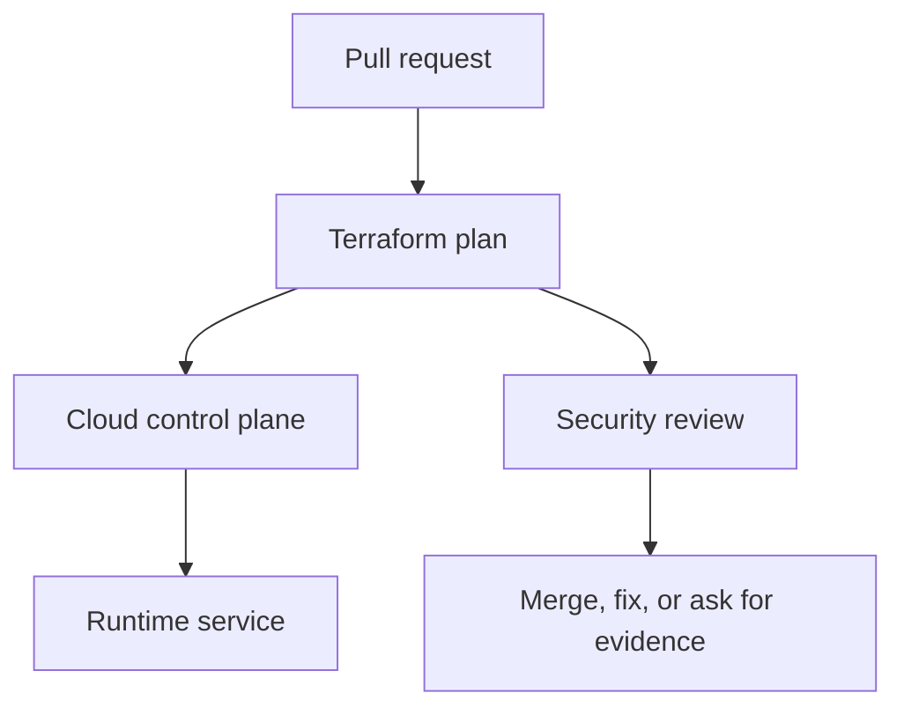

## Table of Contents

1. [The Change You Are Really Reviewing](#the-change-you-are-really-reviewing)
2. [The devpolaris-orders-api Baseline](#the-devpolaris-orders-api-baseline)
3. [Read the Principal, Action, and Resource](#read-the-principal-action-and-resource)
4. [Catch Broad Access Before It Looks Normal](#catch-broad-access-before-it-looks-normal)
5. [Use Runtime Errors as Review Evidence](#use-runtime-errors-as-review-evidence)
6. [Audit Who Changed Access](#audit-who-changed-access)
7. [Failure Modes and Fix Directions](#failure-modes-and-fix-directions)
8. [A Reviewer Checklist](#a-reviewer-checklist)

## The Change You Are Really Reviewing

Cloud infrastructure security work often arrives as an ordinary pull request. For
devpolaris-orders-api, the change might be a Terraform edit that adds storage access, opens
a listener, changes a policy rule, or updates an emergency role. The review is not separate
from delivery work. It is the part of delivery where you prove that the cloud control plane
will receive the change you intended.

In this article, iam review means the practical habit of reading cloud configuration, plan
output, account state, and audit evidence together. The running example uses
Terraform-managed AWS resources for devpolaris-orders-api. The same mental model also works
in Azure: a role assignment, a network security group rule, or a policy exemption still
needs a caller, a target, a scope, and evidence.

The service accepts order requests, writes invoice files, emits logs, and calls a small set
of cloud APIs. That shape gives us enough reality to make security decisions without
inventing a large platform. You will see Terraform snippets, plan excerpts, CLI output, and
failure evidence that a reviewer can use before merge or during an incident.



The important point is sequence. A reviewer should catch broad access, exposed paths, weak
policy decisions, and drift before the apply changes production. When the change has already
happened, the same evidence becomes the diagnostic trail for cleanup.

## The devpolaris-orders-api Baseline

A useful security review starts with a baseline. The baseline is the normal shape of the
service: which identity runs it, which network paths should reach it, which storage it owns,
and which teams are allowed to change it. Without that baseline, every finding looks
isolated, and you cannot tell whether a change is intentional or accidental.

For this module, the production stack is small. Terraform manages an ECS service or Azure
Container App equivalent, an application role, a private database endpoint, an invoice
bucket or storage account, a log destination, and network rules for HTTPS traffic. The exact
provider matters less than the review habit: name the resource, name the scope, and compare
it with the service story.

| Baseline item | Expected shape | Why it matters |
|---|---|---|
| Runtime identity | `orders-api-prod` role or managed identity | Limits what the app can do |
| Public entry | HTTPS through approved edge only | Keeps direct service ports private |
| Storage | Invoice objects under service-owned bucket path | Prevents cross-service data access |
| State owner | Terraform workspace for production | Gives changes a reviewed path |
| Audit owner | Platform security channel and ticket | Lets incidents reconstruct actions |

A baseline should be boring enough to remember. If a reviewer cannot say what identity the
app uses or which ports should be public, the team will approve changes by reading line
syntax instead of reading risk. That is how a small edit becomes a surprise after apply.

The baseline also gives you a fair way to review exceptions. A temporary public rule, a
broad permission, or an emergency role activation may be justified during a migration or
incident. The review question is whether the exception is named, time-limited, logged, and
connected to a real operational need.

## Read the Principal, Action, and Resource

An IAM policy is easier to review when you split it into three plain questions. Who can act?
What can they do? Which object can they do it to? AWS calls those pieces principal, action,
and resource. Azure RBAC uses different nouns, but the same idea appears as security
principal, role definition, and scope.

The devpolaris-orders-api role needs to write invoice PDFs after an order is completed. It
does not need to list every bucket in the account, delete old invoices, or edit bucket
policy. The policy should describe that narrow job.

```text
Terraform will perform the following actions:

  # aws_iam_role_policy.orders_api_write_invoices will be updated in-place
  ~ resource "aws_iam_role_policy" "orders_api_write_invoices" {
      name = "orders-api-write-invoices"
    ~ policy = jsonencode({
        Statement = [
          {
            Action   = [
              "s3:PutObject",
              "s3:GetObject"
            ]
            Effect   = "Allow"
            Resource = "arn:aws:s3:::dp-orders-invoices-prod/*"
          },
        ]
      })
    }

Plan: 0 to add, 1 to change, 0 to destroy.
```

This plan is reasonable because the action list is small and the resource points to objects
inside one production bucket. The reviewer should still ask whether GetObject is needed. If
the app only writes new PDFs and never reads them back, remove s3:GetObject and keep the
role easier to explain.

## Catch Broad Access Before It Looks Normal

Broad access often enters a system as a temporary unblock. Someone uses s3:* during
development, the service starts working, and the wildcard survives because nobody wants to
break the release. The danger is not only one bad action. The danger is that future AWS
features and future code paths may also match the wildcard.

```json
{
  "Effect": "Allow",
  "Action": "s3:*",
  "Resource": "*"
}
```

A reviewer should translate that statement into a sentence: the orders API can perform every
S3 action against every S3 resource in the account. That sentence usually sounds much bigger
than the JSON looked. The fix is to name the required actions and the specific bucket or
object prefix.

| Bad sign | Better shape |
|---|---|
| `Action: "*"` | Name the API actions the code calls |
| `Resource: "*"` | Use bucket, object prefix, queue, key, or vault scope |
| Human user in app policy | Use workload role or managed identity |
| Shared role across services | Create service-owned role |

## Use Runtime Errors as Review Evidence

IAM review is not only static JSON reading. Runtime errors tell you which permission the app
actually attempted to use. If devpolaris-orders-api fails after deploy, the error message
often contains the missing action and resource. That evidence helps you add the smallest
permission instead of guessing.

```text
2026-05-08T18:21:04Z ERROR invoice.writer AccessDenied: User: arn:aws:sts::111122223333:assumed-role/orders-api-prod/task-71d2 is not authorized to perform: s3:PutObject on resource: arn:aws:s3:::dp-orders-invoices-prod/2026/05/order-8841.pdf
```

The fix direction is not to attach an admin policy. The fix is to allow s3:PutObject to the
invoice object path used by the service. If encryption is enabled with a customer managed
KMS key, the next error may mention kms:Encrypt; review that key policy with the same
principal, action, and resource shape.

## Audit Who Changed Access

A policy may look fine in Terraform but still be unsafe if production can be changed through
the console with no review. Audit logs tell you who changed access, from where, and through
which tool. In AWS, CloudTrail records IAM actions. In Azure, Activity Log records role
assignment writes and policy changes.

```bash
$ aws cloudtrail lookup-events --lookup-attributes AttributeKey=EventName,AttributeValue=PutRolePolicy

EventTime              Username          ResourceName                  SourceIPAddress
2026-05-08T15:14:03Z   ci-terraform      orders-api-write-invoices      192.0.2.41
2026-05-08T16:02:44Z   alice.admin       orders-api-prod                198.51.100.12
```

The first event fits the baseline if CI is the normal Terraform path. The second event needs
an explanation because a human changed the production role directly. The fix may be to
revert the console edit, import it into Terraform if it is valid, and tighten who can edit
IAM in production.

## Failure Modes and Fix Directions

Most cloud security failures are visible if you know which layer to inspect. A bad IAM
change appears as an access denied error, a suspicious allow statement, or an unexpected
audit event. A network exposure appears as a wide CIDR range, a public IP, an open listener,
or traffic from places the service should never see. A policy failure appears as a denied CI
job or, worse, a missing denial where one should have happened.

| Symptom | Likely cause | First fix direction |
|---|---|---|
| `AccessDenied` after deploy | Required action missing from role | Add the smallest action and resource scope |
| Plan opens `0.0.0.0/0` | Rule copied from test or console | Restrict to edge, VPN, or private CIDR |
| Scanner fails on generated module | Module default is too broad | Override input or patch module upstream |
| Drift keeps returning | Console edits bypass Terraform | Import, revert, or move ownership clearly |
| Emergency role remains active | No expiry or closure step | Disable session path and file review ticket |

The fix direction should be specific enough that another engineer can start. Make it secure
is not a fix. Replace the public CIDR with the ALB security group source is a fix direction.
Attach s3:PutObject only to arn:aws:s3:::dp-orders-invoices-prod/* is a fix direction. The
reader should leave the review knowing the next safe edit.

Some failures need a product conversation rather than only a Terraform patch. If support
engineers need production invoice access, the answer may be a read-only support tool with
audit logging, not a wider S3 policy. If a partner needs inbound traffic, the answer may be
PrivateLink, IP allowlisting, or a separate edge path, not a public service port.

## A Reviewer Checklist

A checklist helps when the pull request is large or the release is busy. It should not
replace thinking. It gives the reviewer a stable order so they do not skip identity,
network, policy, drift, or emergency access evidence just because the Terraform diff is
noisy.

| Check | Evidence | Decision |
|---|---|---|
| Scope | Resource ARN, Azure scope, or module path | Is the target narrow enough? |
| Caller | Role, user, managed identity, or workflow identity | Is the caller expected? |
| Action | API action, port, or policy rule | Is the action needed by the service? |
| Time | Expiry, ticket, or lifecycle note | Should this access end later? |
| Detection | Log, alert, scan, or drift check | Will the team notice misuse or change? |

For devpolaris-orders-api, the final review note should be short and concrete. A good note
says what changed, what evidence was checked, and what remains intentionally accepted. That
note becomes useful later when someone asks why a role has a permission or why a network
rule exists.

> Good cloud security review is not a search for perfect infrastructure. It is a search for accurate intent, narrow scope, and usable evidence.

---

For IAM Review, connect each finding to one named resource, one owner, and one next action.
A finding without an owner becomes background noise during a release review, even when the
risk is real.

A finding with a clear resource path, evidence, and fix direction can move through normal
delivery work. That difference matters because security work succeeds when engineers can see
exactly what changed and why.

For IAM Review, connect each finding to one named resource, one owner, and one next action.
A finding without an owner becomes background noise during a release review, even when the
risk is real.

A finding with a clear resource path, evidence, and fix direction can move through normal
delivery work. That difference matters because security work succeeds when engineers can see
exactly what changed and why.

For IAM Review, connect each finding to one named resource, one owner, and one next action.
A finding without an owner becomes background noise during a release review, even when the
risk is real.

A finding with a clear resource path, evidence, and fix direction can move through normal
delivery work. That difference matters because security work succeeds when engineers can see
exactly what changed and why.

For IAM Review, connect each finding to one named resource, one owner, and one next action.
A finding without an owner becomes background noise during a release review, even when the
risk is real.

A finding with a clear resource path, evidence, and fix direction can move through normal
delivery work. That difference matters because security work succeeds when engineers can see
exactly what changed and why.

For IAM Review, connect each finding to one named resource, one owner, and one next action.
A finding without an owner becomes background noise during a release review, even when the
risk is real.

A finding with a clear resource path, evidence, and fix direction can move through normal
delivery work. That difference matters because security work succeeds when engineers can see
exactly what changed and why.

For IAM Review, connect each finding to one named resource, one owner, and one next action.
A finding without an owner becomes background noise during a release review, even when the
risk is real.

A finding with a clear resource path, evidence, and fix direction can move through normal
delivery work. That difference matters because security work succeeds when engineers can see
exactly what changed and why.

For IAM Review, connect each finding to one named resource, one owner, and one next action.
A finding without an owner becomes background noise during a release review, even when the
risk is real.

A finding with a clear resource path, evidence, and fix direction can move through normal
delivery work. That difference matters because security work succeeds when engineers can see
exactly what changed and why.

For IAM Review, connect each finding to one named resource, one owner, and one next action.
A finding without an owner becomes background noise during a release review, even when the
risk is real.

A finding with a clear resource path, evidence, and fix direction can move through normal
delivery work. That difference matters because security work succeeds when engineers can see
exactly what changed and why.

For IAM Review, connect each finding to one named resource, one owner, and one next action.
A finding without an owner becomes background noise during a release review, even when the
risk is real.

A finding with a clear resource path, evidence, and fix direction can move through normal
delivery work. That difference matters because security work succeeds when engineers can see
exactly what changed and why.

**References**

- [AWS IAM User Guide](https://docs.aws.amazon.com/IAM/latest/UserGuide/introduction.html) - Canonical AWS documentation for identities, policies, roles, and access evaluation.
- [AWS IAM Security Best Practices](https://docs.aws.amazon.com/IAM/latest/UserGuide/best-practices.html) - AWS guidance for least privilege, temporary credentials, and access review.
- [AWS IAM Access Analyzer](https://docs.aws.amazon.com/IAM/latest/UserGuide/what-is-access-analyzer.html) - Official service documentation for finding external access and unused access.
- [Azure RBAC Documentation](https://learn.microsoft.com/azure/role-based-access-control/overview) - Canonical Azure documentation for role assignments and scope.
- [Terraform Plan Command](https://developer.hashicorp.com/terraform/cli/commands/plan) - Official command reference for reading proposed infrastructure changes before apply.
