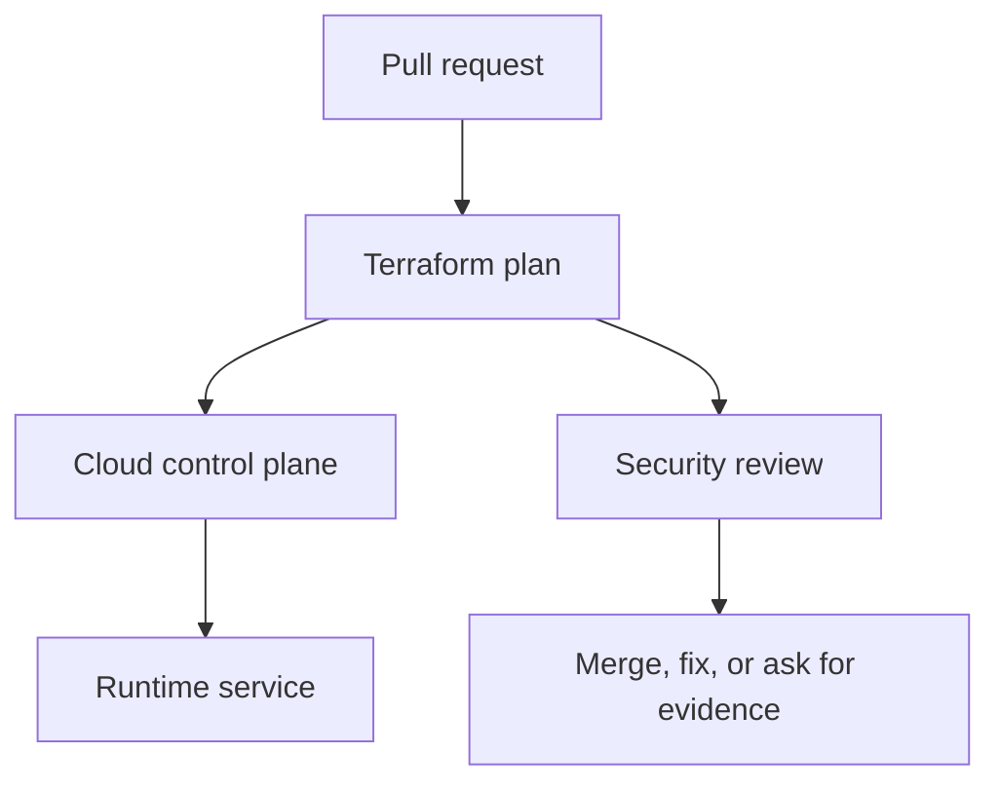
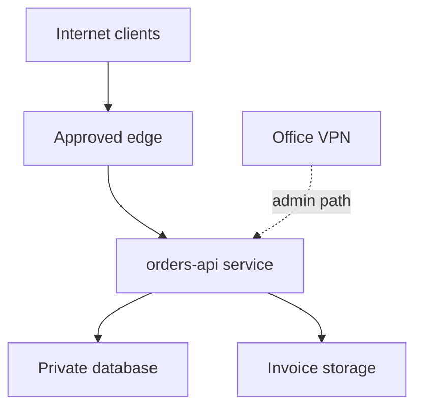

## Table of Contents

1. [The Change You Are Really Reviewing](#the-change-you-are-really-reviewing)
2. [The devpolaris-orders-api Baseline](#the-devpolaris-orders-api-baseline)
3. [Start With Reachability, Not Port Numbers](#start-with-reachability-not-port-numbers)
4. [Spot Public CIDR Changes in Terraform](#spot-public-cidr-changes-in-terraform)
5. [Check Routes and Public Addresses](#check-routes-and-public-addresses)
6. [Use Traffic Evidence After Deploy](#use-traffic-evidence-after-deploy)
7. [Failure Modes and Fix Directions](#failure-modes-and-fix-directions)
8. [A Reviewer Checklist](#a-reviewer-checklist)

## The Change You Are Really Reviewing

Cloud infrastructure security work often arrives as an ordinary pull request. For
devpolaris-orders-api, the change might be a Terraform edit that adds storage access, opens
a listener, changes a policy rule, or updates an emergency role. The review is not separate
from delivery work. It is the part of delivery where you prove that the cloud control plane
will receive the change you intended.

In this article, network exposure review means the practical habit of reading cloud
configuration, plan output, account state, and audit evidence together. The running example
uses Terraform-managed AWS resources for devpolaris-orders-api. The same mental model also
works in Azure: a role assignment, a network security group rule, or a policy exemption
still needs a caller, a target, a scope, and evidence.

The service accepts order requests, writes invoice files, emits logs, and calls a small set
of cloud APIs. That shape gives us enough reality to make security decisions without
inventing a large platform. You will see Terraform snippets, plan excerpts, CLI output, and
failure evidence that a reviewer can use before merge or during an incident.



The important point is sequence. A reviewer should catch broad access, exposed paths, weak
policy decisions, and drift before the apply changes production. When the change has already
happened, the same evidence becomes the diagnostic trail for cleanup.

## The devpolaris-orders-api Baseline

A useful security review starts with a baseline. The baseline is the normal shape of the
service: which identity runs it, which network paths should reach it, which storage it owns,
and which teams are allowed to change it. Without that baseline, every finding looks
isolated, and you cannot tell whether a change is intentional or accidental.

For this module, the production stack is small. Terraform manages an ECS service or Azure
Container App equivalent, an application role, a private database endpoint, an invoice
bucket or storage account, a log destination, and network rules for HTTPS traffic. The exact
provider matters less than the review habit: name the resource, name the scope, and compare
it with the service story.

| Baseline item | Expected shape | Why it matters |
|---|---|---|
| Runtime identity | `orders-api-prod` role or managed identity | Limits what the app can do |
| Public entry | HTTPS through approved edge only | Keeps direct service ports private |
| Storage | Invoice objects under service-owned bucket path | Prevents cross-service data access |
| State owner | Terraform workspace for production | Gives changes a reviewed path |
| Audit owner | Platform security channel and ticket | Lets incidents reconstruct actions |

A baseline should be boring enough to remember. If a reviewer cannot say what identity the
app uses or which ports should be public, the team will approve changes by reading line
syntax instead of reading risk. That is how a small edit becomes a surprise after apply.

The baseline also gives you a fair way to review exceptions. A temporary public rule, a
broad permission, or an emergency role activation may be justified during a migration or
incident. The review question is whether the exception is named, time-limited, logged, and
connected to a real operational need.

## Start With Reachability, Not Port Numbers

A network review should begin with reachability. A port number alone does not tell you
whether customers, partners, office users, or the whole internet can reach the service. The
reviewer needs to trace the path from caller to edge, from edge to service, and from service
to dependencies.



For devpolaris-orders-api, public customers should reach HTTPS through the approved edge.
They should not reach the container task, VM, database, SSH port, or internal metrics
endpoint directly. That plain sentence is the review baseline.

## Spot Public CIDR Changes in Terraform

A CIDR block is a compact way to describe an IP range. 0.0.0.0/0 means every IPv4 address.
It is sometimes correct at an internet edge, but it is usually wrong on an internal service
security group. The plan should make any move to a public CIDR stand out.

```text
# aws_security_group_rule.orders_api_ingress will be updated in-place
  ~ resource "aws_security_group_rule" "orders_api_ingress" {
      from_port   = 443
      to_port     = 443
      protocol    = "tcp"
    ~ cidr_blocks = [
        - "10.42.0.0/16",
        + "0.0.0.0/0",
      ]
    }

Plan: 0 to add, 1 to change, 0 to destroy.
```

This change turns an internal HTTPS path into an internet-reachable path. The fix direction
depends on the intended caller. If only the load balancer should call the service, use the
load balancer security group as the source. If a partner needs access, prefer an approved
edge, private connectivity, or a narrow allowlist with an owner and expiry.

## Check Routes and Public Addresses

Firewall rules are only one part of exposure. A service can also become reachable because a
subnet routes to an internet gateway, a public IP is attached, or a private endpoint is
removed. Reviewers should inspect both the rule and the network placement.

```bash
$ aws ec2 describe-instances --filters Name=tag:service,Values=devpolaris-orders-api --query 'Reservations[].Instances[].{Id:InstanceId,PublicIp:PublicIpAddress,Subnet:SubnetId}'

[
  {
    "Id": "i-0a12ordersprod",
    "PublicIp": null,
    "Subnet": "subnet-private-0c21"
  }
]
```

The useful field is PublicIp. A null value supports the baseline that the service is private
behind the edge. If the field contains an address, the next checks are the subnet route
table, security group inbound rules, and whether the instance or task should exist in that
subnet at all.

## Use Traffic Evidence After Deploy

After a network change, logs help prove whether the path behaves as intended. Load balancer
logs, VPC flow logs, Azure NSG flow logs, and application logs each tell a different part of
the story. You do not need every log for every review, but you need one source that can
answer who reached the service.

```text
2026-05-08T17:40:11Z alb request client=198.51.100.28 target=10.42.18.91:8080 status=200 path=/api/orders
2026-05-08T17:40:13Z alb request client=203.0.113.74 target=10.42.18.91:8080 status=403 path=/internal/metrics
```

The second line shows the edge denying an internal path, which is expected. If similar
traffic appears directly in service logs without the edge fields, the team should
investigate whether a direct public path exists. The fix may be a security group source
change, route correction, or removal of a public address.

## Failure Modes and Fix Directions

Most cloud security failures are visible if you know which layer to inspect. A bad IAM
change appears as an access denied error, a suspicious allow statement, or an unexpected
audit event. A network exposure appears as a wide CIDR range, a public IP, an open listener,
or traffic from places the service should never see. A policy failure appears as a denied CI
job or, worse, a missing denial where one should have happened.

| Symptom | Likely cause | First fix direction |
|---|---|---|
| `AccessDenied` after deploy | Required action missing from role | Add the smallest action and resource scope |
| Plan opens `0.0.0.0/0` | Rule copied from test or console | Restrict to edge, VPN, or private CIDR |
| Scanner fails on generated module | Module default is too broad | Override input or patch module upstream |
| Drift keeps returning | Console edits bypass Terraform | Import, revert, or move ownership clearly |
| Emergency role remains active | No expiry or closure step | Disable session path and file review ticket |

The fix direction should be specific enough that another engineer can start. Make it secure
is not a fix. Replace the public CIDR with the ALB security group source is a fix direction.
Attach s3:PutObject only to arn:aws:s3:::dp-orders-invoices-prod/* is a fix direction. The
reader should leave the review knowing the next safe edit.

Some failures need a product conversation rather than only a Terraform patch. If support
engineers need production invoice access, the answer may be a read-only support tool with
audit logging, not a wider S3 policy. If a partner needs inbound traffic, the answer may be
PrivateLink, IP allowlisting, or a separate edge path, not a public service port.

## A Reviewer Checklist

A checklist helps when the pull request is large or the release is busy. It should not
replace thinking. It gives the reviewer a stable order so they do not skip identity,
network, policy, drift, or emergency access evidence just because the Terraform diff is
noisy.

| Check | Evidence | Decision |
|---|---|---|
| Scope | Resource ARN, Azure scope, or module path | Is the target narrow enough? |
| Caller | Role, user, managed identity, or workflow identity | Is the caller expected? |
| Action | API action, port, or policy rule | Is the action needed by the service? |
| Time | Expiry, ticket, or lifecycle note | Should this access end later? |
| Detection | Log, alert, scan, or drift check | Will the team notice misuse or change? |

For devpolaris-orders-api, the final review note should be short and concrete. A good note
says what changed, what evidence was checked, and what remains intentionally accepted. That
note becomes useful later when someone asks why a role has a permission or why a network
rule exists.

> Good cloud security review is not a search for perfect infrastructure. It is a search for accurate intent, narrow scope, and usable evidence.

---
For Network Exposure Review, connect each finding to one named resource, one owner, and one
next action. A finding without an owner becomes background noise during a release review,
even when the risk is real.

A finding with a clear resource path, evidence, and fix direction can move through normal
delivery work. That difference matters because security work succeeds when engineers can see
exactly what changed and why.

For Network Exposure Review, connect each finding to one named resource, one owner, and one
next action. A finding without an owner becomes background noise during a release review,
even when the risk is real.

A finding with a clear resource path, evidence, and fix direction can move through normal
delivery work. That difference matters because security work succeeds when engineers can see
exactly what changed and why.

For Network Exposure Review, connect each finding to one named resource, one owner, and one
next action. A finding without an owner becomes background noise during a release review,
even when the risk is real.

A finding with a clear resource path, evidence, and fix direction can move through normal
delivery work. That difference matters because security work succeeds when engineers can see
exactly what changed and why.

For Network Exposure Review, connect each finding to one named resource, one owner, and one
next action. A finding without an owner becomes background noise during a release review,
even when the risk is real.

A finding with a clear resource path, evidence, and fix direction can move through normal
delivery work. That difference matters because security work succeeds when engineers can see
exactly what changed and why.

For Network Exposure Review, connect each finding to one named resource, one owner, and one
next action. A finding without an owner becomes background noise during a release review,
even when the risk is real.

A finding with a clear resource path, evidence, and fix direction can move through normal
delivery work. That difference matters because security work succeeds when engineers can see
exactly what changed and why.

For Network Exposure Review, connect each finding to one named resource, one owner, and one
next action. A finding without an owner becomes background noise during a release review,
even when the risk is real.

A finding with a clear resource path, evidence, and fix direction can move through normal
delivery work. That difference matters because security work succeeds when engineers can see
exactly what changed and why.

For Network Exposure Review, connect each finding to one named resource, one owner, and one
next action. A finding without an owner becomes background noise during a release review,
even when the risk is real.

A finding with a clear resource path, evidence, and fix direction can move through normal
delivery work. That difference matters because security work succeeds when engineers can see
exactly what changed and why.

For Network Exposure Review, connect each finding to one named resource, one owner, and one
next action. A finding without an owner becomes background noise during a release review,
even when the risk is real.

A finding with a clear resource path, evidence, and fix direction can move through normal
delivery work. That difference matters because security work succeeds when engineers can see
exactly what changed and why.

For Network Exposure Review, connect each finding to one named resource, one owner, and one
next action. A finding without an owner becomes background noise during a release review,
even when the risk is real.

A finding with a clear resource path, evidence, and fix direction can move through normal
delivery work. That difference matters because security work succeeds when engineers can see
exactly what changed and why.

For Network Exposure Review, connect each finding to one named resource, one owner, and one
next action. A finding without an owner becomes background noise during a release review,
even when the risk is real.

A finding with a clear resource path, evidence, and fix direction can move through normal
delivery work. That difference matters because security work succeeds when engineers can see
exactly what changed and why.

For Network Exposure Review, connect each finding to one named resource, one owner, and one
next action. A finding without an owner becomes background noise during a release review,
even when the risk is real.

A finding with a clear resource path, evidence, and fix direction can move through normal
delivery work. That difference matters because security work succeeds when engineers can see
exactly what changed and why.


**References**

- [AWS VPC Security Groups](https://docs.aws.amazon.com/vpc/latest/userguide/vpc-security-groups.html) - Official behavior for instance-level firewall rules in AWS.
- [Azure Network Security Groups](https://learn.microsoft.com/azure/virtual-network/network-security-groups-overview) - Official documentation for Azure firewall rule behavior at subnet and network interface scope.
- [Terraform Plan Command](https://developer.hashicorp.com/terraform/cli/commands/plan) - Official command reference for reading proposed infrastructure changes before apply.
- [Checkov Documentation](https://www.checkov.io/1.Welcome/What%20is%20Checkov.html) - Official documentation for scanning Terraform and other infrastructure definitions.
