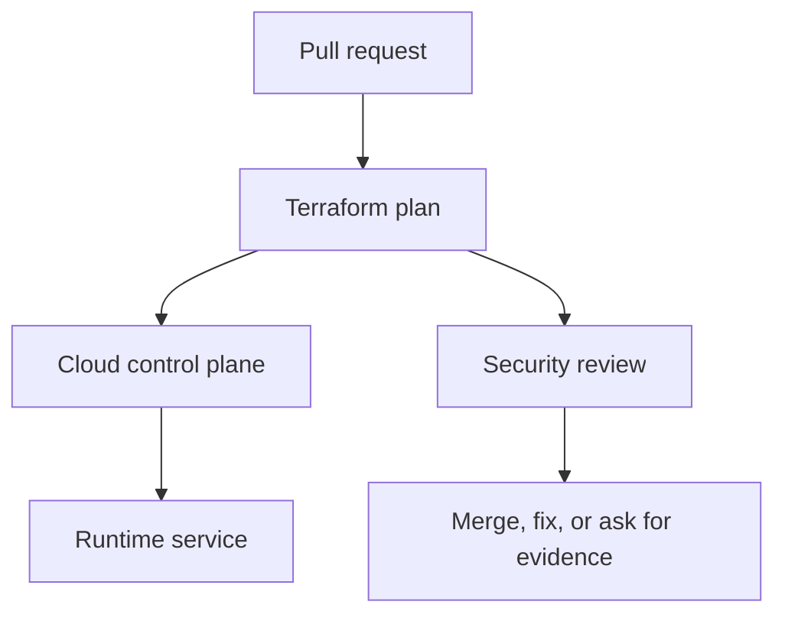

## Table of Contents

1. [The Change You Are Really Reviewing](#the-change-you-are-really-reviewing)
2. [The devpolaris-orders-api Baseline](#the-devpolaris-orders-api-baseline)
3. [Turn Repeated Review Comments Into Tests](#turn-repeated-review-comments-into-tests)
4. [Keep Policies Close to Plain Language](#keep-policies-close-to-plain-language)
5. [Choose Deny, Warn, or Require Review](#choose-deny-warn-or-require-review)
6. [Test the Policy Like Application Code](#test-the-policy-like-application-code)
7. [Failure Modes and Fix Directions](#failure-modes-and-fix-directions)
8. [A Reviewer Checklist](#a-reviewer-checklist)

## The Change You Are Really Reviewing

Cloud infrastructure security work often arrives as an ordinary pull request. For
devpolaris-orders-api, the change might be a Terraform edit that adds storage access, opens
a listener, changes a policy rule, or updates an emergency role. The review is not separate
from delivery work. It is the part of delivery where you prove that the cloud control plane
will receive the change you intended.

In this article, policy as code means the practical habit of reading cloud configuration,
plan output, account state, and audit evidence together. The running example uses
Terraform-managed AWS resources for devpolaris-orders-api. The same mental model also works
in Azure: a role assignment, a network security group rule, or a policy exemption still
needs a caller, a target, a scope, and evidence.

The service accepts order requests, writes invoice files, emits logs, and calls a small set
of cloud APIs. That shape gives us enough reality to make security decisions without
inventing a large platform. You will see Terraform snippets, plan excerpts, CLI output, and
failure evidence that a reviewer can use before merge or during an incident.



The important point is sequence. A reviewer should catch broad access, exposed paths, weak
policy decisions, and drift before the apply changes production. When the change has already
happened, the same evidence becomes the diagnostic trail for cleanup.

## The devpolaris-orders-api Baseline

A useful security review starts with a baseline. The baseline is the normal shape of the
service: which identity runs it, which network paths should reach it, which storage it owns,
and which teams are allowed to change it. Without that baseline, every finding looks
isolated, and you cannot tell whether a change is intentional or accidental.

For this module, the production stack is small. Terraform manages an ECS service or Azure
Container App equivalent, an application role, a private database endpoint, an invoice
bucket or storage account, a log destination, and network rules for HTTPS traffic. The exact
provider matters less than the review habit: name the resource, name the scope, and compare
it with the service story.

| Baseline item | Expected shape | Why it matters |
|---|---|---|
| Runtime identity | `orders-api-prod` role or managed identity | Limits what the app can do |
| Public entry | HTTPS through approved edge only | Keeps direct service ports private |
| Storage | Invoice objects under service-owned bucket path | Prevents cross-service data access |
| State owner | Terraform workspace for production | Gives changes a reviewed path |
| Audit owner | Platform security channel and ticket | Lets incidents reconstruct actions |

A baseline should be boring enough to remember. If a reviewer cannot say what identity the
app uses or which ports should be public, the team will approve changes by reading line
syntax instead of reading risk. That is how a small edit becomes a surprise after apply.

The baseline also gives you a fair way to review exceptions. A temporary public rule, a
broad permission, or an emergency role activation may be justified during a migration or
incident. The review question is whether the exception is named, time-limited, logged, and
connected to a real operational need.

## Turn Repeated Review Comments Into Tests

Policy as code is useful when reviewers keep writing the same comment. If every
infrastructure pull request needs someone to ask whether a security group is public, the
rule is ready to become a test. The policy does not remove human judgment. It protects the
review from forgetting a known rule.

```bash
$ terraform show -json tfplan.binary > tfplan.json
$ conftest test tfplan.json --policy policy/terraform

FAIL - tfplan.json - main - aws_security_group_rule.orders_api_ingress exposes 443 to 0.0.0.0/0 without an approved exception

1 test, 0 passed, 0 warnings, 1 failure
```

This failure is clear because it names the resource and the denied condition. The author can
inspect the Terraform plan and either narrow the source, move the rule to the approved edge,
or add an explicit exception path if the team allows one.

## Keep Policies Close to Plain Language

A good policy starts as a sentence before it becomes Rego. For devpolaris-orders-api, the
sentence is: internal service security groups must not allow inbound traffic from the whole
internet unless the resource is tagged as an approved edge. The sentence gives you the
inputs and the exception model.

```text
package main

deny[msg] {
  resource := input.resource_changes[_]
  resource.type == "aws_security_group_rule"
  resource.change.after.type == "ingress"
  resource.change.after.cidr_blocks[_] == "0.0.0.0/0"
  not approved_edge(resource)
  msg := sprintf("%s exposes ingress to 0.0.0.0/0 without an approved exception", [resource.address])
}

approved_edge(resource) {
  resource.change.after.tags.exposure == "public-edge"
}
```

The policy reads Terraform plan JSON. It loops through changed resources, finds ingress
rules, checks for the public CIDR, and asks whether the rule is an approved edge. The
message is as important as the logic because it is what the author sees under time pressure.

## Choose Deny, Warn, or Require Review

Not every policy should block the pipeline. Some rules catch definite mistakes, such as
public SSH on a production service. Others need human context, such as a new public HTTPS
listener. The team should decide which findings deny merge, which warn, and which require a
named approval.

| Policy result | Use when | Example |
|---|---|---|
| Deny | The configuration is almost always unsafe | Public admin port in production |
| Warn | The risk depends on context | Missing optional tag during migration |
| Require review | A specialist should approve | New cross-account trust |
| Record only | The team is collecting data | Legacy resources before cleanup |

For devpolaris-orders-api, a public ingress rule on the internal service should deny. A
public ingress rule on the approved edge may pass if the tag and owner are present. A
cross-account role trust might require security review because the risk depends on the
external account and condition keys.

## Test the Policy Like Application Code

Policy code can have bugs. A missing field check can fail every pull request. A loose
exception can allow the risky case. Treat policy tests like application unit tests: give the
policy small input documents and assert the expected decision.

```text
test_public_ingress_is_denied {
  result := deny with input as {
    "resource_changes": [{
      "address": "aws_security_group_rule.orders_api_ingress",
      "type": "aws_security_group_rule",
      "change": {"after": {"type": "ingress", "cidr_blocks": ["0.0.0.0/0"], "tags": {}}}
    }]
  }
  count(result) == 1
}
```

The test input is small on purpose. It proves one rule without requiring a full Terraform
plan fixture. Larger tests can use real plan JSON from a safe sample, but small tests make
policy behavior easier to read during review.

## Failure Modes and Fix Directions

Most cloud security failures are visible if you know which layer to inspect. A bad IAM
change appears as an access denied error, a suspicious allow statement, or an unexpected
audit event. A network exposure appears as a wide CIDR range, a public IP, an open listener,
or traffic from places the service should never see. A policy failure appears as a denied CI
job or, worse, a missing denial where one should have happened.

| Symptom | Likely cause | First fix direction |
|---|---|---|
| `AccessDenied` after deploy | Required action missing from role | Add the smallest action and resource scope |
| Plan opens `0.0.0.0/0` | Rule copied from test or console | Restrict to edge, VPN, or private CIDR |
| Scanner fails on generated module | Module default is too broad | Override input or patch module upstream |
| Drift keeps returning | Console edits bypass Terraform | Import, revert, or move ownership clearly |
| Emergency role remains active | No expiry or closure step | Disable session path and file review ticket |

The fix direction should be specific enough that another engineer can start. Make it secure
is not a fix. Replace the public CIDR with the ALB security group source is a fix direction.
Attach s3:PutObject only to arn:aws:s3:::dp-orders-invoices-prod/* is a fix direction. The
reader should leave the review knowing the next safe edit.

Some failures need a product conversation rather than only a Terraform patch. If support
engineers need production invoice access, the answer may be a read-only support tool with
audit logging, not a wider S3 policy. If a partner needs inbound traffic, the answer may be
PrivateLink, IP allowlisting, or a separate edge path, not a public service port.

## A Reviewer Checklist

A checklist helps when the pull request is large or the release is busy. It should not
replace thinking. It gives the reviewer a stable order so they do not skip identity,
network, policy, drift, or emergency access evidence just because the Terraform diff is
noisy.

| Check | Evidence | Decision |
|---|---|---|
| Scope | Resource ARN, Azure scope, or module path | Is the target narrow enough? |
| Caller | Role, user, managed identity, or workflow identity | Is the caller expected? |
| Action | API action, port, or policy rule | Is the action needed by the service? |
| Time | Expiry, ticket, or lifecycle note | Should this access end later? |
| Detection | Log, alert, scan, or drift check | Will the team notice misuse or change? |

For devpolaris-orders-api, the final review note should be short and concrete. A good note
says what changed, what evidence was checked, and what remains intentionally accepted. That
note becomes useful later when someone asks why a role has a permission or why a network
rule exists.

> Good cloud security review is not a search for perfect infrastructure. It is a search for accurate intent, narrow scope, and usable evidence.

---
For Policy as Code, connect each finding to one named resource, one owner, and one next
action. A finding without an owner becomes background noise during a release review, even
when the risk is real.

A finding with a clear resource path, evidence, and fix direction can move through normal
delivery work. That difference matters because security work succeeds when engineers can see
exactly what changed and why.

For Policy as Code, connect each finding to one named resource, one owner, and one next
action. A finding without an owner becomes background noise during a release review, even
when the risk is real.

A finding with a clear resource path, evidence, and fix direction can move through normal
delivery work. That difference matters because security work succeeds when engineers can see
exactly what changed and why.

For Policy as Code, connect each finding to one named resource, one owner, and one next
action. A finding without an owner becomes background noise during a release review, even
when the risk is real.

A finding with a clear resource path, evidence, and fix direction can move through normal
delivery work. That difference matters because security work succeeds when engineers can see
exactly what changed and why.

For Policy as Code, connect each finding to one named resource, one owner, and one next
action. A finding without an owner becomes background noise during a release review, even
when the risk is real.

A finding with a clear resource path, evidence, and fix direction can move through normal
delivery work. That difference matters because security work succeeds when engineers can see
exactly what changed and why.

For Policy as Code, connect each finding to one named resource, one owner, and one next
action. A finding without an owner becomes background noise during a release review, even
when the risk is real.

A finding with a clear resource path, evidence, and fix direction can move through normal
delivery work. That difference matters because security work succeeds when engineers can see
exactly what changed and why.

For Policy as Code, connect each finding to one named resource, one owner, and one next
action. A finding without an owner becomes background noise during a release review, even
when the risk is real.

A finding with a clear resource path, evidence, and fix direction can move through normal
delivery work. That difference matters because security work succeeds when engineers can see
exactly what changed and why.

For Policy as Code, connect each finding to one named resource, one owner, and one next
action. A finding without an owner becomes background noise during a release review, even
when the risk is real.

A finding with a clear resource path, evidence, and fix direction can move through normal
delivery work. That difference matters because security work succeeds when engineers can see
exactly what changed and why.

For Policy as Code, connect each finding to one named resource, one owner, and one next
action. A finding without an owner becomes background noise during a release review, even
when the risk is real.

A finding with a clear resource path, evidence, and fix direction can move through normal
delivery work. That difference matters because security work succeeds when engineers can see
exactly what changed and why.

For Policy as Code, connect each finding to one named resource, one owner, and one next
action. A finding without an owner becomes background noise during a release review, even
when the risk is real.

A finding with a clear resource path, evidence, and fix direction can move through normal
delivery work. That difference matters because security work succeeds when engineers can see
exactly what changed and why.

For Policy as Code, connect each finding to one named resource, one owner, and one next
action. A finding without an owner becomes background noise during a release review, even
when the risk is real.

A finding with a clear resource path, evidence, and fix direction can move through normal
delivery work. That difference matters because security work succeeds when engineers can see
exactly what changed and why.

For Policy as Code, connect each finding to one named resource, one owner, and one next
action. A finding without an owner becomes background noise during a release review, even
when the risk is real.

A finding with a clear resource path, evidence, and fix direction can move through normal
delivery work. That difference matters because security work succeeds when engineers can see
exactly what changed and why.


**References**

- [Open Policy Agent Documentation](https://www.openpolicyagent.org/docs/latest/) - Canonical OPA documentation for policy decisions and Rego language basics.
- [Conftest Documentation](https://www.conftest.dev/) - Canonical documentation for testing configuration files with OPA policies.
- [Terraform Plan Command](https://developer.hashicorp.com/terraform/cli/commands/plan) - Official command reference for reading proposed infrastructure changes before apply.
- [AWS VPC Security Groups](https://docs.aws.amazon.com/vpc/latest/userguide/vpc-security-groups.html) - Official behavior for instance-level firewall rules in AWS.
