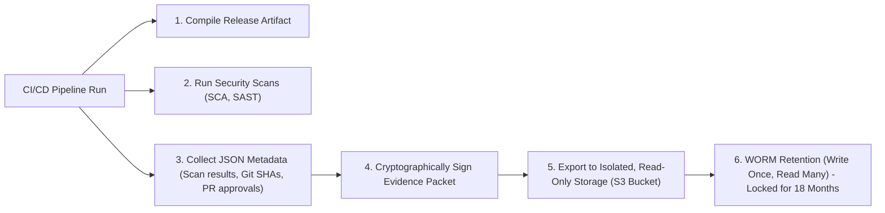

## Table of Contents

1. [Continuous Compliance vs. Manual Audits](#continuous-compliance-vs-manual-audits)
2. [Anatomy of a Compliance Audit Request](#anatomy-of-a-compliance-audit-request)
3. [Reusing Normal Engineering Records](#reusing-normal-engineering-records)
4. [Control and Evidence Mapping](#control-and-evidence-mapping)
5. [Access Control Audits: Reviewing Permissions with Proof](#access-control-audits-reviewing-permissions-with-proof)
6. [The Log Retention Trap and Automated Archiving](#the-log-retention-trap-and-automated-archiving)
7. [Compiling the Perfect Evidence Packet](#compiling-the-perfect-evidence-packet)
8. [Putting It All Together](#putting-it-all-together)
9. [What's Next](#whats-next)

## Continuous Compliance vs. Manual Audits

Historically, compliance audits (such as SOC 2 Type II or ISO/IEC 27001) were treated as disruptive, manual exercises that occurred once a year. When audit season arrived, engineering and security teams would halt their active roadmaps for weeks. They manually dug through old emails, took endless screenshots of repository settings, and tried to reconstruct the history of production releases from memory.

This manual model is highly fragile and inefficient. A spreadsheet compiled weeks after a change occurred is not a reliable security control; it is simply a historical narrative. If a critical change was deployed without review, the team only discovers the violation months later during the audit, when the risk has already been active in production for half a year.

Modern DevSecOps architectures replace this model with **Continuous Compliance**. Instead of treating compliance as a separate documentation exercise, we design our software delivery pipelines to programmatically compile **Evidence** as an inherent byproduct of normal engineering work.

Continuous compliance operates on a simple principle: the same systems we use to write, test, scan, and deploy code are the exact source systems that generate our audit proof. Every Git commit signature, Static Application Security Testing (SAST) scan log, pull request approval, container digest hash, and CloudTrail api record represents highly detailed, non-repudiable compliance evidence. 

By structuring these records automatically, we eliminate audit panic, provide auditors with mathematical proof of our security gates, and guarantee that our guardrails remain active on every single release.

## Anatomy of a Compliance Audit Request

To understand how continuous compliance changes audit dynamics, we must trace how an auditor evaluates a change-control policy. During a formal audit, a reviewer does not merely ask for your written policy document; they select a random sample of production modifications and demand absolute proof that your policies were actively operated.

Consider a typical audit request:

```text
Audit Request: DEVSEC-VM-01-Sample-08
Control: Changes to production environments must be authorized, tested, and scanned for vulnerabilities before deployment.
Selected Sample: Release deployed on 2026-05-18T15:10:00Z (devpolaris-orders-api)
Requirement: Provide the complete, auditable chain of custody proving this release met all compliance standards.
```

In a legacy engineering environment, this request triggers a scramble to link Jira tickets to developer names, find old screenshots of completed tests, and prove that someone approved the release in a chat channel.

In a continuous compliance environment, the response is immediate, standardized, and self-evident. The platform team presents a single, cryptographically linked **Evidence Packet** compiled automatically by the pipeline. The packet contains the precise Git commit SHA, the pull request approval logs, the verified unit test reports, the container registry image digest, and the production deployment log. 

By presenting this programmatic chain, the team satisfies the request within minutes, proving that the control is not merely a written promise, but a hardcoded, non-bypassable property of the delivery infrastructure.

## Reusing Normal Engineering Records

The core discipline of continuous compliance is to identify the normal engineering records that already exist in your workflow and map them to compliance verification requirements. Every step in a secure DevSecOps pipeline leaves a clean footprint.

Consider the patch lifecycle we analyzed in our previous chapters. When we remediate a high-severity dependency vulnerability in the orders API, the workflow automatically generates six distinct, highly detailed records:

* **Triage Records**: The security ticket documenting the vulnerability identifier (CVE), the reachability check, the assigned severity, and the remediation priority. This proves the risk was formally assessed.
* **Source Pull Requests**: The Git pull request showing the package-lock file modifications and the addition of a regression test, linked directly to the triage ID. This proves what changed and why.
* **Required Status Checks**: The CI runner execution logs showing that unit tests, dependency scans, and container scans completed successfully before the branch was allowed to merge. This proves the automated gates were active.
* **Immutable Image Digests**: The cryptographic SHA-256 content address of the compiled container image. This establishes a permanent, unalterable link between the code that was scanned and the artifact that was built.
* **Deployment logs**: The continuous delivery release log showing the exact transition from the old image digest to the new, hardened digest in production. This proves exactly what artifact was deployed.
* **Closure Scans**: The follow-up container scan report proving the vulnerability is absent from the active production image. This verifies the remediation.

By linking these six standard engineering records into a single, contiguous chain, you satisfy the entire change-control and vulnerability management audit requirement without creating a single extra form or spreadsheet for developers to fill out.

## Control and Evidence Mapping

To make continuous compliance understandable to both auditors and engineering teams, we must define a **Control Map**. A control map is a structured registry that pairs your corporate security standards with their precise evidence sources, owners, frequencies, and retention targets.

By establishing this map, you translate abstract compliance jargon (such as SOC 2 Common Criteria or ISO 27001 Annex A controls) into concrete engineering requirements.

Consider a standardized control map for vulnerability management:

```text
Control ID: DEVSEC-VM-01
Framework Mapping: SOC 2 CC7.1 (Vulnerability Management), ISO 27001 A.12.6.1 (Technical Vulnerabilities)
Control Statement: High and critical vulnerabilities in production environments must be identified, triaged, and remediated within the defined SLA windows.
System Scope: devpolaris-orders-api
Evidence Sources:
  - Vulnerability triage tickets documenting risk assessment
  - Pull request logs showing peer review and linked triage IDs
  - Container registry scan logs confirming vulnerability absence
  - Production deployment logs proving target image transition
Owner: security-team
Operator: platform-team and orders-team
Frequency: Continuous, sampled monthly
Retention Target: 18 months
Sample Instance: VULN-2026-0518-001
```

This registry provides a clear operating model. The `Evidence Sources` tell the engineering team exactly what logs they must preserve, while the `Retention Target` defines how long the system must store those logs. 

For an auditor, this map represents the perfect review guide, illustrating exactly which source systems they will inspect to verify that the control operated continuously over the review period.

## Access Control Audits: Reviewing Permissions with Proof

A major requirement in any compliance audit is proving that only authorized individuals have permission to modify production environments, merge code to protected branches, or access sensitive credentials. This control area is known as **Identity and Access Reviews**.

An access review must not rely on vague statements like "only senior engineers have access." The auditor requires formal, timestamped evidence of your active permission population, and proof that unauthorized access was systematically revoked.

To satisfy this requirement, the platform team must export structured **Access Review Records** regularly. Consider a formal review record designed for the orders API repository:

```text
Access Review Record: ACCESS-2026-05-orders-api
Date: 2026-05-19T10:00:00Z
Reviewer: maya-dev (Engineering Lead)
System: GitHub Repository devpolaris/orders-api
Repository Admins: platform-admins (Team)
Merge Approvers: orders-maintainers (Team)
Deployment Approvers: orders-release-managers (Team)
Cloud Deploy Identity Users: GitHub Environment `production`

Revoked Accounts:
  - sam-contractor (User account removed from orders-maintainers due to contract termination)
  - old-ci-bot (System account removed from deployment approvers due to token rotation)

Temporary Exceptions:
  - security-team (Granted read-only log access to orders-prod until 2026-05-23 under INC-418)

Result: Approved after remediation of revoked accounts
```

This review record is high-confidence audit evidence. It names the reviewer, maps the exact permission groups, documents active removals (which proves the review was an active, critical check rather than a rubber-stamp exercise), and outlines explicit, time-limited exceptions. 

Pair these review records with exports of your repository's branch protection settings, showing that the branch rules mandate at least one peer approval, enforce status checks, and restrict push privileges. This combination proves that your access controls are actively enforced.

## The Log Retention Trap and Automated Archiving

When designing a continuous compliance framework, platform teams frequently fall into the **Log Retention Trap**. 

Engineers assume that because they run automated scanners and deploy via CI/CD pipelines, their evidence is secure. However, most modern SaaS platforms enforce strict, default log expiration limits. For example, GitHub Actions logs and build artifacts typically expire and are permanently deleted after 90 days. 

If an external compliance auditor requests a sample release from nine months ago, and your build logs have expired, you have a critical compliance failure. You possess no proof that the required security scans actually ran on that release.

To avoid the retention trap, you must design an **Automated Archiving Pipeline**:



This archiving pipeline operates in six systematic stages:

First, the CI/CD pipeline compiles your release artifact, generating the immutable image digest.

Second, the pipeline runs all required status checks, including dependency, secret, and container vulnerability scans.

Third, the pipeline executes a post-build script that queries the API of your code repository and scanner platform. It collects the raw JSON metadata documenting the pull request approval, the test results, the exact vulnerability scan logs, and the git signature.

Fourth, the pipeline cryptographically signs the compiled metadata using the pipeline's OIDC identity key, establishing absolute proof of authenticity.

Fifth, the pipeline exports the signed evidence packet to a dedicated, centralized storage repository (such as an AWS S3 bucket) located in an isolated, read-only security cloud account.

Sixth, the storage repository enforces **WORM (Write Once, Read Many)** retention policies. Once the evidence packet is written, the repository lock prevents anyone—including administrators—from modifying or deleting the file until the retention target (such as 18 months) is reached.

By implementing this automated archiving pipeline, you guarantee that your audit evidence remains permanent, unalterable, and immediately accessible, regardless of SaaS platform retention limits or database cleanups.

## Compiling the Perfect Evidence Packet

The ultimate deliverable of a continuous compliance pipeline is the **Evidence Packet**. The packet is a self-contained, reviewable JSON or Markdown document compiled for a single production release sample. It ties all of our control maps, source records, digests, and signatures into a single, undeniable chain of custody.

Consider a highly structured, native markdown evidence packet compiled for our `devpolaris-orders-api` patch:

### Continuous Compliance Evidence Packet

* **Control ID**: DEVSEC-VM-01 (Vulnerability Management)
* **Sample ID**: SAMPLE-DEVSEC-VM-01-2026-05
* **Target System**: devpolaris-orders-api (Production)
* **Reference Vulnerability**: VULN-2026-0518-001 (CVE-2026-11842)

#### 1. Risk Identification and Triage
* **Source Signal**: Production container image scan alert
* **Vulnerability ID**: GHSA-7p9x-6m2q-8h4v (CVE-2026-11842)
* **Risk Assessment**: High severity (CVSS 8.1). Reachable through public route `/orders/search` invoking `qs.parse(req.query.filter)`.
* **Remediation SLA**: 24-hour hotfix mandate.
* **Triage Record Link**: [VULN-2026-0518-001](file:///Users/senlin/Documents/dev-roadmaps/devsecops/compliance-incident-readiness/vulnerability-triage.md#VULN-2026-0518-001)

#### 2. Source Code Modification and Peer Review
* **Remediation Action**: Upgrade `qs` package from `6.10.1` to `6.11.0` in `package.json` and rebuild `package-lock.json`.
* **Linked Pull Request**: [PR #742](https://github.example/devpolaris/orders-api/pull/742)
* **Git Commit SHA**: `8c2d9a1f4b8e6c7d9a0f1b2c3d4e5f6a7b8c9d0e`
* **Peer Approver**: `maya-dev` (Engineering Lead)
* **Security Sign-Off**: `oren-platform` (Security Architect)

#### 3. Automated Validation and Build
* **CI/CD Execution Run**: [Workflow Run #1189](https://github.example/devpolaris/orders-api/actions/runs/1189)
* **Required Status Checks**:
  * Unit testing suite: PASS
  * SAST CodeQL scan: PASS
  * SCA Dependency review: PASS
* **Compiled Image Digest**: `ghcr.io/devpolaris/orders-api@sha256:7a9f26e4b8e6c7d9a0f1b2c3d4e5f6a7b8c9d0e1f2a3b4c5d6e7f8a9b0c1d2e3`

#### 4. Vulnerability Mitigation Verification
* **Post-Build Scan Engine**: Docker Scout CVE Audit
* **Target Artifact**: `sha256:7a9f26e4b8e6c7d9a0f1b2c3d4e5f6a7b8c9d0e1f2a3b4c5d6e7f8a9b0c1d2e3`
* **Audit Query**: package=qs vulnerability=GHSA-7p9x-6m2q-8h4v
* **Scan Status**: REMEDIATED (Vulnerability absent from target image)
* **Scan Report Link**: [Docker Scout Report #1189](https://docker-scout.example/reports/7a9f26e4)

#### 5. Production Deployment
* **Continuous Delivery Log**: [Deployment prod-orders-api-2026-05-18-1510](https://deployer.example/releases/prod-orders-api-2026-05-18-1510)
* **Old Image Digest**: `sha256:31b7c0a9...` (Vulnerable)
* **New Image Digest**: `sha256:7a9f26e4...` (Remediated)
* **Operation Timestamp**: 2026-05-18T15:10:03Z
* **Runtime Verification**: Endpoint `/health` returned 200. Synthetic search request check PASS.
* **Release Approver**: `maya-dev`

---

This evidence packet is a complete, self-contained, and undeniable chain of custody. It tells a clear, chronological story of a secure release: the risk was identified, the fix was written and approved, the automated pipeline verified the build, the scanner confirmed the vulnerability was gone, and production transitioned cleanly to the new digest. By delivering packets like this to your compliance reviewers, you transform audits from a painful documentation cycle into a frictionless, programmatic verification step.

## Putting It All Together

Continuous compliance transforms audit requirements into structured, automated engineering pipelines. By reusing normal pipeline records, establishing detailed control maps, exporting verified access review logs, implementing automated WORM archiving pipelines, and compiling self-contained evidence packets, we prove our security posture continuously without imposing operational friction on developers.

When designing and auditing your continuous compliance systems, ensure you enforce these five core practices:

First, reuse normal engineering records as your primary audit proof. Never build spreadsheets or documentation packages after the fact; leverage Git metadata, scan reports, and deployment logs directly.

Second, maintain an active, detailed Control Map. Pair every framework requirement (such as SOC 2 or ISO 27001) with its precise evidence sources, operators, retention targets, and active system owners.

Third, export structured Access Review Records regularly. Document active permission groups, record explicit removals to prove the checks are active, and bind temporary overrides to explicit incident tickets with expiration dates.

Fourth, implement an automated archiving pipeline to bypass SaaS retention limits. Export signed JSON metadata packages to isolated, read-only storage repositories enforcing WORM policies for your entire retention window.

Fifth, compile self-contained, cryptographically linked Evidence Packets for release samples. Gather all relevant ticket IDs, pull request links, status check logs, image digests, scan reports, and deployment records into a single chronological chain.

## What's Next

Compiling continuous compliance evidence packets proves that our routine gates and controls operate correctly. However, organizations must also prepare for unexpected security incidents that require rapid, live coordination. In the next chapter, **Incident Response and Runbooks**, we will explore how to classify security events under pressure, coordinate response roles using NIST standards, contain compromises without losing forensic evidence, and write predictable, automated runbooks with strict manual stop points.

---

**References**

- [NIST SP 800-218 Secure Software Development Framework](https://csrc.nist.gov/pubs/sp/800/218/final) - NIST recommendations on automated verification, change integrity, and continuous compliance evidence.
- [ISO/IEC 27001 Information Security Management](https://www.iso.org/standard/27001) - International standard detailing information security controls and audit requirements.
- [AICPA SOC 2 Trust Services Criteria](https://www.aicpa-cima.com/resources/landing/system-and-organization-controls-soc-suite-of-services) - Framework governing security, availability, processing integrity, confidentiality, and privacy controls.
- [OWASP Software Component Verification Standard](https://owasp.org/www-project-software-component-verification-standard/) - OWASP guidelines on software supply-chain integrity, SBOM verification, and continuous audit evidence.
- [GitHub Actions Security Hardening and Logs](https://docs.github.com/en/actions/security-hardening-your-workflows/about-security-hardening-with-openid-connect) - Technical references on pipeline OIDC identity tokens, log parameters, and metadata exports.
