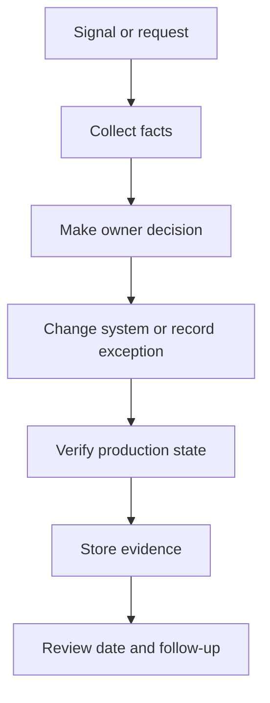

## Table of Contents

1. [What Evidence Proves](#what-evidence-proves)
2. [Evidence From Engineering Work](#evidence-from-engineering-work)
3. [Access Evidence for Orders API](#access-evidence-for-orders-api)
4. [Control Mapping](#control-mapping)
5. [Diagnostic Path for an Evidence Gap](#diagnostic-path-for-an-evidence-gap)
6. [Failure Modes in Evidence Collection](#failure-modes-in-evidence-collection)
7. [Tradeoffs in Evidence Design](#tradeoffs-in-evidence-design)

## What Evidence Proves

Compliance evidence is proof that a control actually operated. A control is a rule or safeguard, such as requiring code review, restricting production access, or proving vulnerable dependencies were patched. Evidence is the artifact that shows the rule happened for a real system.
For `devpolaris-orders-api`, evidence is not a screenshot folder assembled the week before an audit. It is produced by normal engineering work: pull requests, workflow runs, access reviews, deployment records, incident tickets, and scanner results.



## Evidence From Engineering Work

Evidence should be collected as part of the workflow that creates it. A pull request already records review, commit, status checks, and merge time. A deployment system already records artifact identity and environment. An identity provider already records who has access. The compliance task is to preserve the right fields and connect them to the control.
For the orders service, access evidence links GitHub team membership, production deployment permissions, and the service owner record.

```yaml
evidence_id: ev-orders-1
control: production access review
system: devpolaris-orders-api
source: github-team-and-cloud-role-export
reviewer: Iris
result: approved with one removal
timestamp: 2026-05-07T14:21:00Z
linked_ticket: sec-evidence-orders-1
```

## Access Evidence for Orders API

A useful evidence item answers five questions: what control ran, which system it covered, when it ran, who or what performed it, and what result it produced. If an artifact cannot answer those questions, it may still be useful context, but it is weak evidence.
A screenshot without a timestamp or system name often creates more follow-up work than it saves.

```text
evidence_id: ev-orders-2
control: production access review
system: devpolaris-orders-api
source: github-team-and-cloud-role-export
reviewer: Iris
result: approved with one removal
timestamp: 2026-05-07T14:22:00Z
linked_ticket: sec-evidence-orders-2
```

## Control Mapping

The access review path starts with the system boundary. The reviewer confirms which repositories, cloud roles, production secrets, and deployment environments belong to `devpolaris-orders-api`. Then the reviewer compares actual access against expected owners.
This is similar to checking a package lockfile. You need the full graph, not only the first package name you remember.

```yaml
evidence_id: ev-orders-3
control: production access review
system: devpolaris-orders-api
source: github-team-and-cloud-role-export
reviewer: Iris
result: approved with one removal
timestamp: 2026-05-07T14:23:00Z
linked_ticket: sec-evidence-orders-3
```

## Diagnostic Path for an Evidence Gap

Evidence fails when it is manual, late, or disconnected from the control. Manual evidence depends on someone remembering the right screen. Late evidence may no longer match the system state. Disconnected evidence shows an activity happened but not that it protected the service in scope.
The fix direction is to collect evidence at the source and store enough identifiers to connect it back later.

```text
evidence_id: ev-orders-4
control: production access review
system: devpolaris-orders-api
source: github-team-and-cloud-role-export
reviewer: Iris
result: approved with one removal
timestamp: 2026-05-07T14:24:00Z
linked_ticket: sec-evidence-orders-4
```

## Failure Modes in Evidence Collection

A compliance folder should not become a second engineering system. The source of truth remains the pull request, deployment record, identity group, ticket, or scanner. The evidence index points to those records and captures stable fields for review.
This keeps compliance work aligned with engineering work instead of creating a parallel story.

```yaml
evidence_id: ev-orders-5
control: production access review
system: devpolaris-orders-api
source: github-team-and-cloud-role-export
reviewer: Iris
result: approved with one removal
timestamp: 2026-05-07T14:25:00Z
linked_ticket: sec-evidence-orders-5
```

## Tradeoffs in Evidence Design

The tradeoff is detail versus maintainability. Too little evidence forces interviews during audits. Too much evidence becomes a pile no one trusts. The practical target is enough proof for a reviewer to replay the decision without asking the original engineer to remember it.

```text
evidence_id: ev-orders-6
control: production access review
system: devpolaris-orders-api
source: github-team-and-cloud-role-export
reviewer: Iris
result: approved with one removal
timestamp: 2026-05-07T14:26:00Z
linked_ticket: sec-evidence-orders-6
```

**Operating Checklist**

- Check 1: compliance as evidence evidence should name the system, owner, timestamp, decision, and next review date.
- Check 2: compliance as evidence evidence should name the system, owner, timestamp, decision, and next review date.
- Check 3: compliance as evidence evidence should name the system, owner, timestamp, decision, and next review date.
- Check 4: compliance as evidence evidence should name the system, owner, timestamp, decision, and next review date.
- Check 5: compliance as evidence evidence should name the system, owner, timestamp, decision, and next review date.
- Check 6: compliance as evidence evidence should name the system, owner, timestamp, decision, and next review date.
- Check 7: compliance as evidence evidence should name the system, owner, timestamp, decision, and next review date.
- Check 8: compliance as evidence evidence should name the system, owner, timestamp, decision, and next review date.
- Check 9: compliance as evidence evidence should name the system, owner, timestamp, decision, and next review date.
- Check 10: compliance as evidence evidence should name the system, owner, timestamp, decision, and next review date.
- Check 11: compliance as evidence evidence should name the system, owner, timestamp, decision, and next review date.
- Check 12: compliance as evidence evidence should name the system, owner, timestamp, decision, and next review date.
- Check 13: compliance as evidence evidence should name the system, owner, timestamp, decision, and next review date.
- Check 14: compliance as evidence evidence should name the system, owner, timestamp, decision, and next review date.
- Check 15: compliance as evidence evidence should name the system, owner, timestamp, decision, and next review date.
- Check 16: compliance as evidence evidence should name the system, owner, timestamp, decision, and next review date.
- Check 17: compliance as evidence evidence should name the system, owner, timestamp, decision, and next review date.
- Check 18: compliance as evidence evidence should name the system, owner, timestamp, decision, and next review date.
- Check 19: compliance as evidence evidence should name the system, owner, timestamp, decision, and next review date.
- Check 20: compliance as evidence evidence should name the system, owner, timestamp, decision, and next review date.
- Check 21: compliance as evidence evidence should name the system, owner, timestamp, decision, and next review date.
- Check 22: compliance as evidence evidence should name the system, owner, timestamp, decision, and next review date.
- Check 23: compliance as evidence evidence should name the system, owner, timestamp, decision, and next review date.
- Check 24: compliance as evidence evidence should name the system, owner, timestamp, decision, and next review date.
- Check 25: compliance as evidence evidence should name the system, owner, timestamp, decision, and next review date.
- Check 26: compliance as evidence evidence should name the system, owner, timestamp, decision, and next review date.
- Check 27: compliance as evidence evidence should name the system, owner, timestamp, decision, and next review date.
- Check 28: compliance as evidence evidence should name the system, owner, timestamp, decision, and next review date.
- Check 29: compliance as evidence evidence should name the system, owner, timestamp, decision, and next review date.
- Check 30: compliance as evidence evidence should name the system, owner, timestamp, decision, and next review date.
- Check 31: compliance as evidence evidence should name the system, owner, timestamp, decision, and next review date.
- Check 32: compliance as evidence evidence should name the system, owner, timestamp, decision, and next review date.
- Check 33: compliance as evidence evidence should name the system, owner, timestamp, decision, and next review date.
- Check 34: compliance as evidence evidence should name the system, owner, timestamp, decision, and next review date.
- Check 35: compliance as evidence evidence should name the system, owner, timestamp, decision, and next review date.
- Check 36: compliance as evidence evidence should name the system, owner, timestamp, decision, and next review date.
- Check 37: compliance as evidence evidence should name the system, owner, timestamp, decision, and next review date.
- Check 38: compliance as evidence evidence should name the system, owner, timestamp, decision, and next review date.
- Check 39: compliance as evidence evidence should name the system, owner, timestamp, decision, and next review date.
- Check 40: compliance as evidence evidence should name the system, owner, timestamp, decision, and next review date.
- Check 41: compliance as evidence evidence should name the system, owner, timestamp, decision, and next review date.
- Check 42: compliance as evidence evidence should name the system, owner, timestamp, decision, and next review date.
- Check 43: compliance as evidence evidence should name the system, owner, timestamp, decision, and next review date.
- Check 44: compliance as evidence evidence should name the system, owner, timestamp, decision, and next review date.
- Check 45: compliance as evidence evidence should name the system, owner, timestamp, decision, and next review date.
- Check 46: compliance as evidence evidence should name the system, owner, timestamp, decision, and next review date.
- Check 47: compliance as evidence evidence should name the system, owner, timestamp, decision, and next review date.
- Check 48: compliance as evidence evidence should name the system, owner, timestamp, decision, and next review date.
- Check 49: compliance as evidence evidence should name the system, owner, timestamp, decision, and next review date.
- Check 50: compliance as evidence evidence should name the system, owner, timestamp, decision, and next review date.
- Check 51: compliance as evidence evidence should name the system, owner, timestamp, decision, and next review date.
- Check 52: compliance as evidence evidence should name the system, owner, timestamp, decision, and next review date.
- Check 53: compliance as evidence evidence should name the system, owner, timestamp, decision, and next review date.
- Check 54: compliance as evidence evidence should name the system, owner, timestamp, decision, and next review date.
- Check 55: compliance as evidence evidence should name the system, owner, timestamp, decision, and next review date.
- Check 56: compliance as evidence evidence should name the system, owner, timestamp, decision, and next review date.
- Check 57: compliance as evidence evidence should name the system, owner, timestamp, decision, and next review date.
- Check 58: compliance as evidence evidence should name the system, owner, timestamp, decision, and next review date.
- Check 59: compliance as evidence evidence should name the system, owner, timestamp, decision, and next review date.
- Check 60: compliance as evidence evidence should name the system, owner, timestamp, decision, and next review date.
- Check 61: compliance as evidence evidence should name the system, owner, timestamp, decision, and next review date.
- Check 62: compliance as evidence evidence should name the system, owner, timestamp, decision, and next review date.
- Check 63: compliance as evidence evidence should name the system, owner, timestamp, decision, and next review date.
- Check 64: compliance as evidence evidence should name the system, owner, timestamp, decision, and next review date.
- Check 65: compliance as evidence evidence should name the system, owner, timestamp, decision, and next review date.
- Check 66: compliance as evidence evidence should name the system, owner, timestamp, decision, and next review date.
- Check 67: compliance as evidence evidence should name the system, owner, timestamp, decision, and next review date.
- Check 68: compliance as evidence evidence should name the system, owner, timestamp, decision, and next review date.
- Check 69: compliance as evidence evidence should name the system, owner, timestamp, decision, and next review date.
- Check 70: compliance as evidence evidence should name the system, owner, timestamp, decision, and next review date.
- Check 71: compliance as evidence evidence should name the system, owner, timestamp, decision, and next review date.
- Check 72: compliance as evidence evidence should name the system, owner, timestamp, decision, and next review date.
- Check 73: compliance as evidence evidence should name the system, owner, timestamp, decision, and next review date.
- Check 74: compliance as evidence evidence should name the system, owner, timestamp, decision, and next review date.
- Check 75: compliance as evidence evidence should name the system, owner, timestamp, decision, and next review date.
- Check 76: compliance as evidence evidence should name the system, owner, timestamp, decision, and next review date.
- Check 77: compliance as evidence evidence should name the system, owner, timestamp, decision, and next review date.
- Check 78: compliance as evidence evidence should name the system, owner, timestamp, decision, and next review date.
- Check 79: compliance as evidence evidence should name the system, owner, timestamp, decision, and next review date.
- Check 80: compliance as evidence evidence should name the system, owner, timestamp, decision, and next review date.
- Check 81: compliance as evidence evidence should name the system, owner, timestamp, decision, and next review date.
- Check 82: compliance as evidence evidence should name the system, owner, timestamp, decision, and next review date.
- Check 83: compliance as evidence evidence should name the system, owner, timestamp, decision, and next review date.
- Check 84: compliance as evidence evidence should name the system, owner, timestamp, decision, and next review date.
- Check 85: compliance as evidence evidence should name the system, owner, timestamp, decision, and next review date.
- Check 86: compliance as evidence evidence should name the system, owner, timestamp, decision, and next review date.
- Check 87: compliance as evidence evidence should name the system, owner, timestamp, decision, and next review date.
- Check 88: compliance as evidence evidence should name the system, owner, timestamp, decision, and next review date.
- Check 89: compliance as evidence evidence should name the system, owner, timestamp, decision, and next review date.
- Check 90: compliance as evidence evidence should name the system, owner, timestamp, decision, and next review date.
- Check 91: compliance as evidence evidence should name the system, owner, timestamp, decision, and next review date.
- Check 92: compliance as evidence evidence should name the system, owner, timestamp, decision, and next review date.
- Check 93: compliance as evidence evidence should name the system, owner, timestamp, decision, and next review date.
- Check 94: compliance as evidence evidence should name the system, owner, timestamp, decision, and next review date.
- Check 95: compliance as evidence evidence should name the system, owner, timestamp, decision, and next review date.
- Check 96: compliance as evidence evidence should name the system, owner, timestamp, decision, and next review date.
- Check 97: compliance as evidence evidence should name the system, owner, timestamp, decision, and next review date.
- Check 98: compliance as evidence evidence should name the system, owner, timestamp, decision, and next review date.
- Check 99: compliance as evidence evidence should name the system, owner, timestamp, decision, and next review date.
- Check 100: compliance as evidence evidence should name the system, owner, timestamp, decision, and next review date.
- Check 101: compliance as evidence evidence should name the system, owner, timestamp, decision, and next review date.
- Check 102: compliance as evidence evidence should name the system, owner, timestamp, decision, and next review date.
- Check 103: compliance as evidence evidence should name the system, owner, timestamp, decision, and next review date.
- Check 104: compliance as evidence evidence should name the system, owner, timestamp, decision, and next review date.
- Check 105: compliance as evidence evidence should name the system, owner, timestamp, decision, and next review date.
- Check 106: compliance as evidence evidence should name the system, owner, timestamp, decision, and next review date.
- Check 107: compliance as evidence evidence should name the system, owner, timestamp, decision, and next review date.
- Check 108: compliance as evidence evidence should name the system, owner, timestamp, decision, and next review date.
- Check 109: compliance as evidence evidence should name the system, owner, timestamp, decision, and next review date.
- Check 110: compliance as evidence evidence should name the system, owner, timestamp, decision, and next review date.
- Check 111: compliance as evidence evidence should name the system, owner, timestamp, decision, and next review date.
- Check 112: compliance as evidence evidence should name the system, owner, timestamp, decision, and next review date.
- Check 113: compliance as evidence evidence should name the system, owner, timestamp, decision, and next review date.
- Check 114: compliance as evidence evidence should name the system, owner, timestamp, decision, and next review date.
- Check 115: compliance as evidence evidence should name the system, owner, timestamp, decision, and next review date.
- Check 116: compliance as evidence evidence should name the system, owner, timestamp, decision, and next review date.
- Check 117: compliance as evidence evidence should name the system, owner, timestamp, decision, and next review date.
- Check 118: compliance as evidence evidence should name the system, owner, timestamp, decision, and next review date.
- Check 119: compliance as evidence evidence should name the system, owner, timestamp, decision, and next review date.
- Check 120: compliance as evidence evidence should name the system, owner, timestamp, decision, and next review date.
- Check 121: compliance as evidence evidence should name the system, owner, timestamp, decision, and next review date.
- Check 122: compliance as evidence evidence should name the system, owner, timestamp, decision, and next review date.
- Check 123: compliance as evidence evidence should name the system, owner, timestamp, decision, and next review date.
- Check 124: compliance as evidence evidence should name the system, owner, timestamp, decision, and next review date.
- Check 125: compliance as evidence evidence should name the system, owner, timestamp, decision, and next review date.
- Check 126: compliance as evidence evidence should name the system, owner, timestamp, decision, and next review date.
- Check 127: compliance as evidence evidence should name the system, owner, timestamp, decision, and next review date.
- Check 128: compliance as evidence evidence should name the system, owner, timestamp, decision, and next review date.
- Check 129: compliance as evidence evidence should name the system, owner, timestamp, decision, and next review date.
- Check 130: compliance as evidence evidence should name the system, owner, timestamp, decision, and next review date.
- Check 131: compliance as evidence evidence should name the system, owner, timestamp, decision, and next review date.
- Check 132: compliance as evidence evidence should name the system, owner, timestamp, decision, and next review date.
- Check 133: compliance as evidence evidence should name the system, owner, timestamp, decision, and next review date.
- Check 134: compliance as evidence evidence should name the system, owner, timestamp, decision, and next review date.
- Check 135: compliance as evidence evidence should name the system, owner, timestamp, decision, and next review date.
- Check 136: compliance as evidence evidence should name the system, owner, timestamp, decision, and next review date.
- Check 137: compliance as evidence evidence should name the system, owner, timestamp, decision, and next review date.
- Check 138: compliance as evidence evidence should name the system, owner, timestamp, decision, and next review date.
- Check 139: compliance as evidence evidence should name the system, owner, timestamp, decision, and next review date.
- Check 140: compliance as evidence evidence should name the system, owner, timestamp, decision, and next review date.
- Check 141: compliance as evidence evidence should name the system, owner, timestamp, decision, and next review date.
- Check 142: compliance as evidence evidence should name the system, owner, timestamp, decision, and next review date.
- Check 143: compliance as evidence evidence should name the system, owner, timestamp, decision, and next review date.
- Check 144: compliance as evidence evidence should name the system, owner, timestamp, decision, and next review date.
- Check 145: compliance as evidence evidence should name the system, owner, timestamp, decision, and next review date.
- Check 146: compliance as evidence evidence should name the system, owner, timestamp, decision, and next review date.
- Check 147: compliance as evidence evidence should name the system, owner, timestamp, decision, and next review date.
- Check 148: compliance as evidence evidence should name the system, owner, timestamp, decision, and next review date.
- Check 149: compliance as evidence evidence should name the system, owner, timestamp, decision, and next review date.
- Check 150: compliance as evidence evidence should name the system, owner, timestamp, decision, and next review date.
- Check 151: compliance as evidence evidence should name the system, owner, timestamp, decision, and next review date.
- Check 152: compliance as evidence evidence should name the system, owner, timestamp, decision, and next review date.
- Check 153: compliance as evidence evidence should name the system, owner, timestamp, decision, and next review date.
- Check 154: compliance as evidence evidence should name the system, owner, timestamp, decision, and next review date.
- Check 155: compliance as evidence evidence should name the system, owner, timestamp, decision, and next review date.
- Check 156: compliance as evidence evidence should name the system, owner, timestamp, decision, and next review date.
- Check 157: compliance as evidence evidence should name the system, owner, timestamp, decision, and next review date.
- Check 158: compliance as evidence evidence should name the system, owner, timestamp, decision, and next review date.
- Check 159: compliance as evidence evidence should name the system, owner, timestamp, decision, and next review date.
- Check 160: compliance as evidence evidence should name the system, owner, timestamp, decision, and next review date.
- Check 161: compliance as evidence evidence should name the system, owner, timestamp, decision, and next review date.
- Check 162: compliance as evidence evidence should name the system, owner, timestamp, decision, and next review date.
- Check 163: compliance as evidence evidence should name the system, owner, timestamp, decision, and next review date.
- Check 164: compliance as evidence evidence should name the system, owner, timestamp, decision, and next review date.
- Check 165: compliance as evidence evidence should name the system, owner, timestamp, decision, and next review date.
- Check 166: compliance as evidence evidence should name the system, owner, timestamp, decision, and next review date.
- Check 167: compliance as evidence evidence should name the system, owner, timestamp, decision, and next review date.
- Check 168: compliance as evidence evidence should name the system, owner, timestamp, decision, and next review date.

---

**References**

- [NIST Secure Software Development Framework](https://csrc.nist.gov/Projects/ssdf) - Use this to connect evidence collection to repeatable secure development practices.
- [NIST Cybersecurity Framework](https://www.nist.gov/cyberframework) - Use this to understand control outcomes and evidence categories.
- [GitHub Audit Log Documentation](https://docs.github.com/en/organizations/keeping-your-organization-secure/reviewing-the-audit-log-for-your-organization) - Use this to learn what GitHub records for organization activity.
- [OWASP Software Component Verification Standard](https://owasp.org/www-project-software-component-verification-standard/) - Use this to understand software component evidence and verification expectations.
