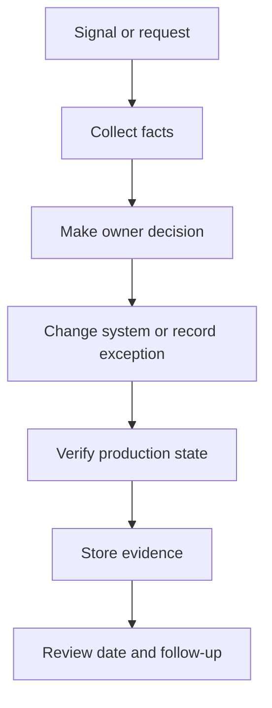

## Table of Contents

1. [What Patch Workflows Protect](#what-patch-workflows-protect)
2. [From Finding to Pull Request](#from-finding-to-pull-request)
3. [Production Proof](#production-proof)
4. [Exception Records](#exception-records)
5. [Diagnostic Path for Patch Closure](#diagnostic-path-for-patch-closure)
6. [Failure Modes in Patch Work](#failure-modes-in-patch-work)
7. [Risk Tradeoffs and Review Cadence](#risk-tradeoffs-and-review-cadence)

## What Patch Workflows Protect

Patch work starts when a finding has a clear owner and a clear decision. The work is not only "bump the package". It includes choosing the safest fix, proving the changed artifact reached production, and recording any exception when the fix cannot happen inside the normal window.
For `devpolaris-orders-api`, the same parser finding becomes a patch workflow. The team needs to update the dependency, run tests, build a new image, release it, and keep evidence that the scanner closed for the production artifact.



## From Finding to Pull Request

The patch path begins by separating the engineering fix from the risk decision. The engineering fix updates the package and rebuilds the service. The risk decision explains whether the fix must ship immediately, can wait for the next release, or needs a temporary exception because the safe change is larger than expected.
The orders team creates one pull request for the dependency update. The pull request title names the finding so the connection survives later searches: `Patch example-json-parser for vuln-2026-05-orders-014`.

```yaml
workflow_step: patch-verification-1
service: devpolaris-orders-api
source_pr: https://github.com/devpolaris/orders-api/pull/1842
required_status:
  dependency_update: merged
  unit_tests: passed
  integration_tests: passed
  image_digest: sha256:patched1af
  production_version_endpoint: patched
close_condition: scanner alert closed for production artifact
```

## Production Proof

A patch is not complete when the lockfile changes. The service must run the new dependency in the environment where the risk existed. That means the evidence chain needs the pull request, CI result, image digest, deployment record, and scanner status after deployment.
If any link is missing, the team can still be vulnerable while the ticket looks closed.

```text
workflow_step: patch-verification-2
service: devpolaris-orders-api
source_pr: https://github.com/devpolaris/orders-api/pull/1842
required_status:
  dependency_update: merged
  unit_tests: passed
  integration_tests: passed
  image_digest: sha256:patched2af
  production_version_endpoint: patched
close_condition: scanner alert closed for production artifact
```

## Exception Records

Exceptions are time-limited risk decisions. They are useful when a direct patch breaks production behavior, when the vendor has not released a fixed version, or when the affected code path is blocked by a temporary control. They are dangerous when they become a place to hide work.
A good exception names the risk, the reason, the temporary control, the owner, the expiry date, and the evidence needed for renewal.

```yaml
workflow_step: patch-verification-3
service: devpolaris-orders-api
source_pr: https://github.com/devpolaris/orders-api/pull/1842
required_status:
  dependency_update: merged
  unit_tests: passed
  integration_tests: passed
  image_digest: sha256:patched3af
  production_version_endpoint: patched
close_condition: scanner alert closed for production artifact
```

## Diagnostic Path for Patch Closure

The diagnostic path for a patch checks four states: source, build, deploy, and scanner. Source proves the dependency changed. Build proves tests passed with the new dependency. Deploy proves the new artifact reached production. Scanner proves the original signal changed state or has a documented reason for staying open.
This path prevents the common mistake of treating a merged pull request as the end of remediation.

```text
workflow_step: patch-verification-4
service: devpolaris-orders-api
source_pr: https://github.com/devpolaris/orders-api/pull/1842
required_status:
  dependency_update: merged
  unit_tests: passed
  integration_tests: passed
  image_digest: sha256:patched4af
  production_version_endpoint: patched
close_condition: scanner alert closed for production artifact
```

## Failure Modes in Patch Work

Patch workflows fail when the fix is too broad, too narrow, or not released. A broad update can pull unrelated package changes into an emergency. A narrow update can miss another vulnerable package path. A merged update can sit unreleased for days.
The fix direction is to keep emergency changes small, inspect the dependency tree, and require production evidence before closing the finding.

```yaml
workflow_step: patch-verification-5
service: devpolaris-orders-api
source_pr: https://github.com/devpolaris/orders-api/pull/1842
required_status:
  dependency_update: merged
  unit_tests: passed
  integration_tests: passed
  image_digest: sha256:patched5af
  production_version_endpoint: patched
close_condition: scanner alert closed for production artifact
```

## Risk Tradeoffs and Review Cadence

The tradeoff is speed versus confidence. Emergency patching favors small changes and fast release. Normal patching allows more regression testing and batching. Exceptions allow service stability when a direct fix is risky, but they require stronger review because the known risk remains.
The workflow should make these choices explicit instead of hiding them in chat messages.

```text
workflow_step: patch-verification-6
service: devpolaris-orders-api
source_pr: https://github.com/devpolaris/orders-api/pull/1842
required_status:
  dependency_update: merged
  unit_tests: passed
  integration_tests: passed
  image_digest: sha256:patched6af
  production_version_endpoint: patched
close_condition: scanner alert closed for production artifact
```

**Operating Checklist**

- Check 1: patch and exception workflows evidence should name the system, owner, timestamp, decision, and next review date.
- Check 2: patch and exception workflows evidence should name the system, owner, timestamp, decision, and next review date.
- Check 3: patch and exception workflows evidence should name the system, owner, timestamp, decision, and next review date.
- Check 4: patch and exception workflows evidence should name the system, owner, timestamp, decision, and next review date.
- Check 5: patch and exception workflows evidence should name the system, owner, timestamp, decision, and next review date.
- Check 6: patch and exception workflows evidence should name the system, owner, timestamp, decision, and next review date.
- Check 7: patch and exception workflows evidence should name the system, owner, timestamp, decision, and next review date.
- Check 8: patch and exception workflows evidence should name the system, owner, timestamp, decision, and next review date.
- Check 9: patch and exception workflows evidence should name the system, owner, timestamp, decision, and next review date.
- Check 10: patch and exception workflows evidence should name the system, owner, timestamp, decision, and next review date.
- Check 11: patch and exception workflows evidence should name the system, owner, timestamp, decision, and next review date.
- Check 12: patch and exception workflows evidence should name the system, owner, timestamp, decision, and next review date.
- Check 13: patch and exception workflows evidence should name the system, owner, timestamp, decision, and next review date.
- Check 14: patch and exception workflows evidence should name the system, owner, timestamp, decision, and next review date.
- Check 15: patch and exception workflows evidence should name the system, owner, timestamp, decision, and next review date.
- Check 16: patch and exception workflows evidence should name the system, owner, timestamp, decision, and next review date.
- Check 17: patch and exception workflows evidence should name the system, owner, timestamp, decision, and next review date.
- Check 18: patch and exception workflows evidence should name the system, owner, timestamp, decision, and next review date.
- Check 19: patch and exception workflows evidence should name the system, owner, timestamp, decision, and next review date.
- Check 20: patch and exception workflows evidence should name the system, owner, timestamp, decision, and next review date.
- Check 21: patch and exception workflows evidence should name the system, owner, timestamp, decision, and next review date.
- Check 22: patch and exception workflows evidence should name the system, owner, timestamp, decision, and next review date.
- Check 23: patch and exception workflows evidence should name the system, owner, timestamp, decision, and next review date.
- Check 24: patch and exception workflows evidence should name the system, owner, timestamp, decision, and next review date.
- Check 25: patch and exception workflows evidence should name the system, owner, timestamp, decision, and next review date.
- Check 26: patch and exception workflows evidence should name the system, owner, timestamp, decision, and next review date.
- Check 27: patch and exception workflows evidence should name the system, owner, timestamp, decision, and next review date.
- Check 28: patch and exception workflows evidence should name the system, owner, timestamp, decision, and next review date.
- Check 29: patch and exception workflows evidence should name the system, owner, timestamp, decision, and next review date.
- Check 30: patch and exception workflows evidence should name the system, owner, timestamp, decision, and next review date.
- Check 31: patch and exception workflows evidence should name the system, owner, timestamp, decision, and next review date.
- Check 32: patch and exception workflows evidence should name the system, owner, timestamp, decision, and next review date.
- Check 33: patch and exception workflows evidence should name the system, owner, timestamp, decision, and next review date.
- Check 34: patch and exception workflows evidence should name the system, owner, timestamp, decision, and next review date.
- Check 35: patch and exception workflows evidence should name the system, owner, timestamp, decision, and next review date.
- Check 36: patch and exception workflows evidence should name the system, owner, timestamp, decision, and next review date.
- Check 37: patch and exception workflows evidence should name the system, owner, timestamp, decision, and next review date.
- Check 38: patch and exception workflows evidence should name the system, owner, timestamp, decision, and next review date.
- Check 39: patch and exception workflows evidence should name the system, owner, timestamp, decision, and next review date.
- Check 40: patch and exception workflows evidence should name the system, owner, timestamp, decision, and next review date.
- Check 41: patch and exception workflows evidence should name the system, owner, timestamp, decision, and next review date.
- Check 42: patch and exception workflows evidence should name the system, owner, timestamp, decision, and next review date.
- Check 43: patch and exception workflows evidence should name the system, owner, timestamp, decision, and next review date.
- Check 44: patch and exception workflows evidence should name the system, owner, timestamp, decision, and next review date.
- Check 45: patch and exception workflows evidence should name the system, owner, timestamp, decision, and next review date.
- Check 46: patch and exception workflows evidence should name the system, owner, timestamp, decision, and next review date.
- Check 47: patch and exception workflows evidence should name the system, owner, timestamp, decision, and next review date.
- Check 48: patch and exception workflows evidence should name the system, owner, timestamp, decision, and next review date.
- Check 49: patch and exception workflows evidence should name the system, owner, timestamp, decision, and next review date.
- Check 50: patch and exception workflows evidence should name the system, owner, timestamp, decision, and next review date.
- Check 51: patch and exception workflows evidence should name the system, owner, timestamp, decision, and next review date.
- Check 52: patch and exception workflows evidence should name the system, owner, timestamp, decision, and next review date.
- Check 53: patch and exception workflows evidence should name the system, owner, timestamp, decision, and next review date.
- Check 54: patch and exception workflows evidence should name the system, owner, timestamp, decision, and next review date.
- Check 55: patch and exception workflows evidence should name the system, owner, timestamp, decision, and next review date.
- Check 56: patch and exception workflows evidence should name the system, owner, timestamp, decision, and next review date.
- Check 57: patch and exception workflows evidence should name the system, owner, timestamp, decision, and next review date.
- Check 58: patch and exception workflows evidence should name the system, owner, timestamp, decision, and next review date.
- Check 59: patch and exception workflows evidence should name the system, owner, timestamp, decision, and next review date.
- Check 60: patch and exception workflows evidence should name the system, owner, timestamp, decision, and next review date.
- Check 61: patch and exception workflows evidence should name the system, owner, timestamp, decision, and next review date.
- Check 62: patch and exception workflows evidence should name the system, owner, timestamp, decision, and next review date.
- Check 63: patch and exception workflows evidence should name the system, owner, timestamp, decision, and next review date.
- Check 64: patch and exception workflows evidence should name the system, owner, timestamp, decision, and next review date.
- Check 65: patch and exception workflows evidence should name the system, owner, timestamp, decision, and next review date.
- Check 66: patch and exception workflows evidence should name the system, owner, timestamp, decision, and next review date.
- Check 67: patch and exception workflows evidence should name the system, owner, timestamp, decision, and next review date.
- Check 68: patch and exception workflows evidence should name the system, owner, timestamp, decision, and next review date.
- Check 69: patch and exception workflows evidence should name the system, owner, timestamp, decision, and next review date.
- Check 70: patch and exception workflows evidence should name the system, owner, timestamp, decision, and next review date.
- Check 71: patch and exception workflows evidence should name the system, owner, timestamp, decision, and next review date.
- Check 72: patch and exception workflows evidence should name the system, owner, timestamp, decision, and next review date.
- Check 73: patch and exception workflows evidence should name the system, owner, timestamp, decision, and next review date.
- Check 74: patch and exception workflows evidence should name the system, owner, timestamp, decision, and next review date.
- Check 75: patch and exception workflows evidence should name the system, owner, timestamp, decision, and next review date.
- Check 76: patch and exception workflows evidence should name the system, owner, timestamp, decision, and next review date.
- Check 77: patch and exception workflows evidence should name the system, owner, timestamp, decision, and next review date.
- Check 78: patch and exception workflows evidence should name the system, owner, timestamp, decision, and next review date.
- Check 79: patch and exception workflows evidence should name the system, owner, timestamp, decision, and next review date.
- Check 80: patch and exception workflows evidence should name the system, owner, timestamp, decision, and next review date.
- Check 81: patch and exception workflows evidence should name the system, owner, timestamp, decision, and next review date.
- Check 82: patch and exception workflows evidence should name the system, owner, timestamp, decision, and next review date.
- Check 83: patch and exception workflows evidence should name the system, owner, timestamp, decision, and next review date.
- Check 84: patch and exception workflows evidence should name the system, owner, timestamp, decision, and next review date.
- Check 85: patch and exception workflows evidence should name the system, owner, timestamp, decision, and next review date.
- Check 86: patch and exception workflows evidence should name the system, owner, timestamp, decision, and next review date.
- Check 87: patch and exception workflows evidence should name the system, owner, timestamp, decision, and next review date.
- Check 88: patch and exception workflows evidence should name the system, owner, timestamp, decision, and next review date.
- Check 89: patch and exception workflows evidence should name the system, owner, timestamp, decision, and next review date.
- Check 90: patch and exception workflows evidence should name the system, owner, timestamp, decision, and next review date.
- Check 91: patch and exception workflows evidence should name the system, owner, timestamp, decision, and next review date.
- Check 92: patch and exception workflows evidence should name the system, owner, timestamp, decision, and next review date.
- Check 93: patch and exception workflows evidence should name the system, owner, timestamp, decision, and next review date.
- Check 94: patch and exception workflows evidence should name the system, owner, timestamp, decision, and next review date.
- Check 95: patch and exception workflows evidence should name the system, owner, timestamp, decision, and next review date.
- Check 96: patch and exception workflows evidence should name the system, owner, timestamp, decision, and next review date.
- Check 97: patch and exception workflows evidence should name the system, owner, timestamp, decision, and next review date.
- Check 98: patch and exception workflows evidence should name the system, owner, timestamp, decision, and next review date.
- Check 99: patch and exception workflows evidence should name the system, owner, timestamp, decision, and next review date.
- Check 100: patch and exception workflows evidence should name the system, owner, timestamp, decision, and next review date.
- Check 101: patch and exception workflows evidence should name the system, owner, timestamp, decision, and next review date.
- Check 102: patch and exception workflows evidence should name the system, owner, timestamp, decision, and next review date.
- Check 103: patch and exception workflows evidence should name the system, owner, timestamp, decision, and next review date.
- Check 104: patch and exception workflows evidence should name the system, owner, timestamp, decision, and next review date.
- Check 105: patch and exception workflows evidence should name the system, owner, timestamp, decision, and next review date.
- Check 106: patch and exception workflows evidence should name the system, owner, timestamp, decision, and next review date.
- Check 107: patch and exception workflows evidence should name the system, owner, timestamp, decision, and next review date.
- Check 108: patch and exception workflows evidence should name the system, owner, timestamp, decision, and next review date.
- Check 109: patch and exception workflows evidence should name the system, owner, timestamp, decision, and next review date.
- Check 110: patch and exception workflows evidence should name the system, owner, timestamp, decision, and next review date.
- Check 111: patch and exception workflows evidence should name the system, owner, timestamp, decision, and next review date.
- Check 112: patch and exception workflows evidence should name the system, owner, timestamp, decision, and next review date.
- Check 113: patch and exception workflows evidence should name the system, owner, timestamp, decision, and next review date.
- Check 114: patch and exception workflows evidence should name the system, owner, timestamp, decision, and next review date.
- Check 115: patch and exception workflows evidence should name the system, owner, timestamp, decision, and next review date.
- Check 116: patch and exception workflows evidence should name the system, owner, timestamp, decision, and next review date.
- Check 117: patch and exception workflows evidence should name the system, owner, timestamp, decision, and next review date.
- Check 118: patch and exception workflows evidence should name the system, owner, timestamp, decision, and next review date.
- Check 119: patch and exception workflows evidence should name the system, owner, timestamp, decision, and next review date.
- Check 120: patch and exception workflows evidence should name the system, owner, timestamp, decision, and next review date.
- Check 121: patch and exception workflows evidence should name the system, owner, timestamp, decision, and next review date.
- Check 122: patch and exception workflows evidence should name the system, owner, timestamp, decision, and next review date.
- Check 123: patch and exception workflows evidence should name the system, owner, timestamp, decision, and next review date.
- Check 124: patch and exception workflows evidence should name the system, owner, timestamp, decision, and next review date.
- Check 125: patch and exception workflows evidence should name the system, owner, timestamp, decision, and next review date.
- Check 126: patch and exception workflows evidence should name the system, owner, timestamp, decision, and next review date.
- Check 127: patch and exception workflows evidence should name the system, owner, timestamp, decision, and next review date.
- Check 128: patch and exception workflows evidence should name the system, owner, timestamp, decision, and next review date.
- Check 129: patch and exception workflows evidence should name the system, owner, timestamp, decision, and next review date.
- Check 130: patch and exception workflows evidence should name the system, owner, timestamp, decision, and next review date.
- Check 131: patch and exception workflows evidence should name the system, owner, timestamp, decision, and next review date.
- Check 132: patch and exception workflows evidence should name the system, owner, timestamp, decision, and next review date.
- Check 133: patch and exception workflows evidence should name the system, owner, timestamp, decision, and next review date.
- Check 134: patch and exception workflows evidence should name the system, owner, timestamp, decision, and next review date.
- Check 135: patch and exception workflows evidence should name the system, owner, timestamp, decision, and next review date.
- Check 136: patch and exception workflows evidence should name the system, owner, timestamp, decision, and next review date.
- Check 137: patch and exception workflows evidence should name the system, owner, timestamp, decision, and next review date.
- Check 138: patch and exception workflows evidence should name the system, owner, timestamp, decision, and next review date.
- Check 139: patch and exception workflows evidence should name the system, owner, timestamp, decision, and next review date.
- Check 140: patch and exception workflows evidence should name the system, owner, timestamp, decision, and next review date.
- Check 141: patch and exception workflows evidence should name the system, owner, timestamp, decision, and next review date.
- Check 142: patch and exception workflows evidence should name the system, owner, timestamp, decision, and next review date.
- Check 143: patch and exception workflows evidence should name the system, owner, timestamp, decision, and next review date.
- Check 144: patch and exception workflows evidence should name the system, owner, timestamp, decision, and next review date.
- Check 145: patch and exception workflows evidence should name the system, owner, timestamp, decision, and next review date.
- Check 146: patch and exception workflows evidence should name the system, owner, timestamp, decision, and next review date.
- Check 147: patch and exception workflows evidence should name the system, owner, timestamp, decision, and next review date.
- Check 148: patch and exception workflows evidence should name the system, owner, timestamp, decision, and next review date.
- Check 149: patch and exception workflows evidence should name the system, owner, timestamp, decision, and next review date.
- Check 150: patch and exception workflows evidence should name the system, owner, timestamp, decision, and next review date.
- Check 151: patch and exception workflows evidence should name the system, owner, timestamp, decision, and next review date.
- Check 152: patch and exception workflows evidence should name the system, owner, timestamp, decision, and next review date.
- Check 153: patch and exception workflows evidence should name the system, owner, timestamp, decision, and next review date.
- Check 154: patch and exception workflows evidence should name the system, owner, timestamp, decision, and next review date.
- Check 155: patch and exception workflows evidence should name the system, owner, timestamp, decision, and next review date.

---

**References**

- [NIST Secure Software Development Framework](https://csrc.nist.gov/Projects/ssdf) - Use this to connect patch decisions to secure software development practices.
- [CISA Known Exploited Vulnerabilities Catalog](https://www.cisa.gov/known-exploited-vulnerabilities-catalog) - Use this to prioritize fixes when exploitation is known.
- [GitHub Dependabot Alerts](https://docs.github.com/en/code-security/dependabot/dependabot-alerts) - Use this to understand dependency alert review and remediation workflows.
- [OWASP Vulnerability Management Guide](https://owasp.org/www-project-vulnerability-management-guide/) - Use this for practical vulnerability management process guidance.
