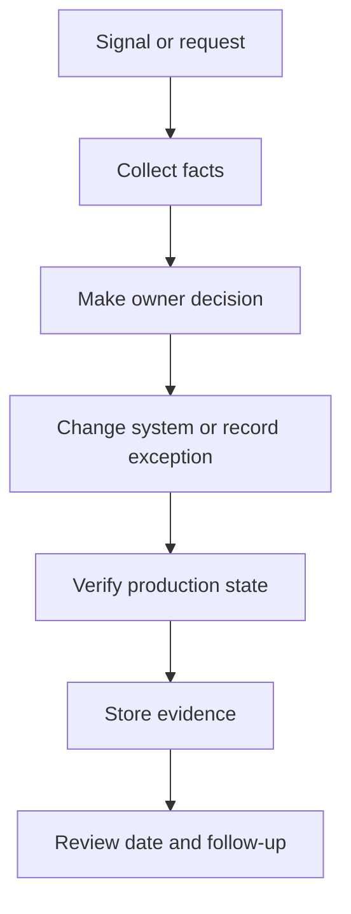

## Table of Contents

1. [What Hardening Changes](#what-hardening-changes)
2. [Turn Facts Into Actions](#turn-facts-into-actions)
3. [Diagnostic Path After the Event](#diagnostic-path-after-the-event)
4. [Controls You Can Test](#controls-you-can-test)
5. [Prioritize the Follow-Up](#prioritize-the-followup)
6. [Evidence of Learning](#evidence-of-learning)
7. [Failure Modes in Hardening](#failure-modes-in-hardening)
8. [Tradeoffs in Depth and Speed](#tradeoffs-in-depth-and-speed)

## What Hardening Changes

Post-incident hardening is the work that changes the system after an incident so the same weakness is harder to repeat. It is not a blame meeting and it is not only a document. It turns what the team learned into code, tests, controls, dashboards, ownership, and review dates.
For `devpolaris-orders-api`, the incident follow-up shows that the parser patch reached most containers, but one stale task kept serving requests. The hardening work improves deployment verification, image drift detection, dependency policy, and access evidence.



## Turn Facts Into Actions

Hardening begins by turning incident facts into system changes. The team should avoid vague actions such as `be more careful`. A useful action names the control, the owner, the system, the test, and the review date.
For the stale task incident, the hardening action is not only `patch faster`. It is `detect production image drift after every deployment and block closure until all tasks match the patched digest`.

```yaml
hardening_item: orders-post-incident-1
lesson: stale task kept vulnerable parser in production
control_change: compare all running task image digests after deployment
owner: platform-runtime
test: fail verification when any task runs old digest
evidence: workflow run plus production task inventory
```

## Diagnostic Path After the Event

The diagnostic path looks backward and forward. Backward checks explain how the incident happened. Forward checks prove the same path is now harder to repeat. This means reviewing deployment logs, task inventory, scanner timing, and alert routing.
Each fact should produce either no action, a code change, a control change, or a documented risk decision.

```text
hardening_item: orders-post-incident-2
lesson: stale task kept vulnerable parser in production
control_change: compare all running task image digests after deployment
owner: platform-runtime
test: fail verification when any task runs old digest
evidence: workflow run plus production task inventory
```

## Controls You Can Test

Control changes should be testable. A control that cannot be tested becomes a promise. Examples of testable controls include a CI check that fails on critical runtime vulnerabilities, a deployment verification step that compares image digests, and an access review job that exports current production deployers.
The test should run close to the place where failure would happen.

```yaml
hardening_item: orders-post-incident-3
lesson: stale task kept vulnerable parser in production
control_change: compare all running task image digests after deployment
owner: platform-runtime
test: fail verification when any task runs old digest
evidence: workflow run plus production task inventory
```

## Prioritize the Follow-Up

Post-incident work often fails because every action becomes high priority. That overloads the team and hides the few changes that would reduce the most risk. The better path is to rank actions by recurrence risk, user impact, and implementation size.
Small high-value controls should ship first while larger design changes get tracked with realistic owners.

```text
hardening_item: orders-post-incident-4
lesson: stale task kept vulnerable parser in production
control_change: compare all running task image digests after deployment
owner: platform-runtime
test: fail verification when any task runs old digest
evidence: workflow run plus production task inventory
```

## Evidence of Learning

Hardening evidence matters because it proves learning became engineering work. The evidence can be a merged pull request, a new workflow run, a passing control check, an updated runbook, or a dashboard alert that fired in a test.
Meeting notes alone are not enough because they do not change the system.

```yaml
hardening_item: orders-post-incident-5
lesson: stale task kept vulnerable parser in production
control_change: compare all running task image digests after deployment
owner: platform-runtime
test: fail verification when any task runs old digest
evidence: workflow run plus production task inventory
```

## Failure Modes in Hardening

The tradeoff is speed versus depth. Shipping a guardrail this week may prevent the next repeat incident. A deeper redesign may remove the class of risk later. The follow-up plan should include both when the risk justifies it.

```text
hardening_item: orders-post-incident-6
lesson: stale task kept vulnerable parser in production
control_change: compare all running task image digests after deployment
owner: platform-runtime
test: fail verification when any task runs old digest
evidence: workflow run plus production task inventory
```

## Tradeoffs in Depth and Speed

Hardening begins by turning incident facts into system changes. The team should avoid vague actions such as `be more careful`. A useful action names the control, the owner, the system, the test, and the review date.
For the stale task incident, the hardening action is not only `patch faster`. It is `detect production image drift after every deployment and block closure until all tasks match the patched digest`.

```yaml
hardening_item: orders-post-incident-7
lesson: stale task kept vulnerable parser in production
control_change: compare all running task image digests after deployment
owner: platform-runtime
test: fail verification when any task runs old digest
evidence: workflow run plus production task inventory
```

**Operating Checklist**

- Check 1: post-incident hardening evidence should name the system, owner, timestamp, decision, and next review date.
- Check 2: post-incident hardening evidence should name the system, owner, timestamp, decision, and next review date.
- Check 3: post-incident hardening evidence should name the system, owner, timestamp, decision, and next review date.
- Check 4: post-incident hardening evidence should name the system, owner, timestamp, decision, and next review date.
- Check 5: post-incident hardening evidence should name the system, owner, timestamp, decision, and next review date.
- Check 6: post-incident hardening evidence should name the system, owner, timestamp, decision, and next review date.
- Check 7: post-incident hardening evidence should name the system, owner, timestamp, decision, and next review date.
- Check 8: post-incident hardening evidence should name the system, owner, timestamp, decision, and next review date.
- Check 9: post-incident hardening evidence should name the system, owner, timestamp, decision, and next review date.
- Check 10: post-incident hardening evidence should name the system, owner, timestamp, decision, and next review date.
- Check 11: post-incident hardening evidence should name the system, owner, timestamp, decision, and next review date.
- Check 12: post-incident hardening evidence should name the system, owner, timestamp, decision, and next review date.
- Check 13: post-incident hardening evidence should name the system, owner, timestamp, decision, and next review date.
- Check 14: post-incident hardening evidence should name the system, owner, timestamp, decision, and next review date.
- Check 15: post-incident hardening evidence should name the system, owner, timestamp, decision, and next review date.
- Check 16: post-incident hardening evidence should name the system, owner, timestamp, decision, and next review date.
- Check 17: post-incident hardening evidence should name the system, owner, timestamp, decision, and next review date.
- Check 18: post-incident hardening evidence should name the system, owner, timestamp, decision, and next review date.
- Check 19: post-incident hardening evidence should name the system, owner, timestamp, decision, and next review date.
- Check 20: post-incident hardening evidence should name the system, owner, timestamp, decision, and next review date.
- Check 21: post-incident hardening evidence should name the system, owner, timestamp, decision, and next review date.
- Check 22: post-incident hardening evidence should name the system, owner, timestamp, decision, and next review date.
- Check 23: post-incident hardening evidence should name the system, owner, timestamp, decision, and next review date.
- Check 24: post-incident hardening evidence should name the system, owner, timestamp, decision, and next review date.
- Check 25: post-incident hardening evidence should name the system, owner, timestamp, decision, and next review date.
- Check 26: post-incident hardening evidence should name the system, owner, timestamp, decision, and next review date.
- Check 27: post-incident hardening evidence should name the system, owner, timestamp, decision, and next review date.
- Check 28: post-incident hardening evidence should name the system, owner, timestamp, decision, and next review date.
- Check 29: post-incident hardening evidence should name the system, owner, timestamp, decision, and next review date.
- Check 30: post-incident hardening evidence should name the system, owner, timestamp, decision, and next review date.
- Check 31: post-incident hardening evidence should name the system, owner, timestamp, decision, and next review date.
- Check 32: post-incident hardening evidence should name the system, owner, timestamp, decision, and next review date.
- Check 33: post-incident hardening evidence should name the system, owner, timestamp, decision, and next review date.
- Check 34: post-incident hardening evidence should name the system, owner, timestamp, decision, and next review date.
- Check 35: post-incident hardening evidence should name the system, owner, timestamp, decision, and next review date.
- Check 36: post-incident hardening evidence should name the system, owner, timestamp, decision, and next review date.
- Check 37: post-incident hardening evidence should name the system, owner, timestamp, decision, and next review date.
- Check 38: post-incident hardening evidence should name the system, owner, timestamp, decision, and next review date.
- Check 39: post-incident hardening evidence should name the system, owner, timestamp, decision, and next review date.
- Check 40: post-incident hardening evidence should name the system, owner, timestamp, decision, and next review date.
- Check 41: post-incident hardening evidence should name the system, owner, timestamp, decision, and next review date.
- Check 42: post-incident hardening evidence should name the system, owner, timestamp, decision, and next review date.
- Check 43: post-incident hardening evidence should name the system, owner, timestamp, decision, and next review date.
- Check 44: post-incident hardening evidence should name the system, owner, timestamp, decision, and next review date.
- Check 45: post-incident hardening evidence should name the system, owner, timestamp, decision, and next review date.
- Check 46: post-incident hardening evidence should name the system, owner, timestamp, decision, and next review date.
- Check 47: post-incident hardening evidence should name the system, owner, timestamp, decision, and next review date.
- Check 48: post-incident hardening evidence should name the system, owner, timestamp, decision, and next review date.
- Check 49: post-incident hardening evidence should name the system, owner, timestamp, decision, and next review date.
- Check 50: post-incident hardening evidence should name the system, owner, timestamp, decision, and next review date.
- Check 51: post-incident hardening evidence should name the system, owner, timestamp, decision, and next review date.
- Check 52: post-incident hardening evidence should name the system, owner, timestamp, decision, and next review date.
- Check 53: post-incident hardening evidence should name the system, owner, timestamp, decision, and next review date.
- Check 54: post-incident hardening evidence should name the system, owner, timestamp, decision, and next review date.
- Check 55: post-incident hardening evidence should name the system, owner, timestamp, decision, and next review date.
- Check 56: post-incident hardening evidence should name the system, owner, timestamp, decision, and next review date.
- Check 57: post-incident hardening evidence should name the system, owner, timestamp, decision, and next review date.
- Check 58: post-incident hardening evidence should name the system, owner, timestamp, decision, and next review date.
- Check 59: post-incident hardening evidence should name the system, owner, timestamp, decision, and next review date.
- Check 60: post-incident hardening evidence should name the system, owner, timestamp, decision, and next review date.
- Check 61: post-incident hardening evidence should name the system, owner, timestamp, decision, and next review date.
- Check 62: post-incident hardening evidence should name the system, owner, timestamp, decision, and next review date.
- Check 63: post-incident hardening evidence should name the system, owner, timestamp, decision, and next review date.
- Check 64: post-incident hardening evidence should name the system, owner, timestamp, decision, and next review date.
- Check 65: post-incident hardening evidence should name the system, owner, timestamp, decision, and next review date.
- Check 66: post-incident hardening evidence should name the system, owner, timestamp, decision, and next review date.
- Check 67: post-incident hardening evidence should name the system, owner, timestamp, decision, and next review date.
- Check 68: post-incident hardening evidence should name the system, owner, timestamp, decision, and next review date.
- Check 69: post-incident hardening evidence should name the system, owner, timestamp, decision, and next review date.
- Check 70: post-incident hardening evidence should name the system, owner, timestamp, decision, and next review date.
- Check 71: post-incident hardening evidence should name the system, owner, timestamp, decision, and next review date.
- Check 72: post-incident hardening evidence should name the system, owner, timestamp, decision, and next review date.
- Check 73: post-incident hardening evidence should name the system, owner, timestamp, decision, and next review date.
- Check 74: post-incident hardening evidence should name the system, owner, timestamp, decision, and next review date.
- Check 75: post-incident hardening evidence should name the system, owner, timestamp, decision, and next review date.
- Check 76: post-incident hardening evidence should name the system, owner, timestamp, decision, and next review date.
- Check 77: post-incident hardening evidence should name the system, owner, timestamp, decision, and next review date.
- Check 78: post-incident hardening evidence should name the system, owner, timestamp, decision, and next review date.
- Check 79: post-incident hardening evidence should name the system, owner, timestamp, decision, and next review date.
- Check 80: post-incident hardening evidence should name the system, owner, timestamp, decision, and next review date.
- Check 81: post-incident hardening evidence should name the system, owner, timestamp, decision, and next review date.
- Check 82: post-incident hardening evidence should name the system, owner, timestamp, decision, and next review date.
- Check 83: post-incident hardening evidence should name the system, owner, timestamp, decision, and next review date.
- Check 84: post-incident hardening evidence should name the system, owner, timestamp, decision, and next review date.
- Check 85: post-incident hardening evidence should name the system, owner, timestamp, decision, and next review date.
- Check 86: post-incident hardening evidence should name the system, owner, timestamp, decision, and next review date.
- Check 87: post-incident hardening evidence should name the system, owner, timestamp, decision, and next review date.
- Check 88: post-incident hardening evidence should name the system, owner, timestamp, decision, and next review date.
- Check 89: post-incident hardening evidence should name the system, owner, timestamp, decision, and next review date.
- Check 90: post-incident hardening evidence should name the system, owner, timestamp, decision, and next review date.
- Check 91: post-incident hardening evidence should name the system, owner, timestamp, decision, and next review date.
- Check 92: post-incident hardening evidence should name the system, owner, timestamp, decision, and next review date.
- Check 93: post-incident hardening evidence should name the system, owner, timestamp, decision, and next review date.
- Check 94: post-incident hardening evidence should name the system, owner, timestamp, decision, and next review date.
- Check 95: post-incident hardening evidence should name the system, owner, timestamp, decision, and next review date.
- Check 96: post-incident hardening evidence should name the system, owner, timestamp, decision, and next review date.
- Check 97: post-incident hardening evidence should name the system, owner, timestamp, decision, and next review date.
- Check 98: post-incident hardening evidence should name the system, owner, timestamp, decision, and next review date.
- Check 99: post-incident hardening evidence should name the system, owner, timestamp, decision, and next review date.
- Check 100: post-incident hardening evidence should name the system, owner, timestamp, decision, and next review date.
- Check 101: post-incident hardening evidence should name the system, owner, timestamp, decision, and next review date.
- Check 102: post-incident hardening evidence should name the system, owner, timestamp, decision, and next review date.
- Check 103: post-incident hardening evidence should name the system, owner, timestamp, decision, and next review date.
- Check 104: post-incident hardening evidence should name the system, owner, timestamp, decision, and next review date.
- Check 105: post-incident hardening evidence should name the system, owner, timestamp, decision, and next review date.
- Check 106: post-incident hardening evidence should name the system, owner, timestamp, decision, and next review date.
- Check 107: post-incident hardening evidence should name the system, owner, timestamp, decision, and next review date.
- Check 108: post-incident hardening evidence should name the system, owner, timestamp, decision, and next review date.
- Check 109: post-incident hardening evidence should name the system, owner, timestamp, decision, and next review date.
- Check 110: post-incident hardening evidence should name the system, owner, timestamp, decision, and next review date.
- Check 111: post-incident hardening evidence should name the system, owner, timestamp, decision, and next review date.
- Check 112: post-incident hardening evidence should name the system, owner, timestamp, decision, and next review date.
- Check 113: post-incident hardening evidence should name the system, owner, timestamp, decision, and next review date.
- Check 114: post-incident hardening evidence should name the system, owner, timestamp, decision, and next review date.
- Check 115: post-incident hardening evidence should name the system, owner, timestamp, decision, and next review date.
- Check 116: post-incident hardening evidence should name the system, owner, timestamp, decision, and next review date.
- Check 117: post-incident hardening evidence should name the system, owner, timestamp, decision, and next review date.
- Check 118: post-incident hardening evidence should name the system, owner, timestamp, decision, and next review date.
- Check 119: post-incident hardening evidence should name the system, owner, timestamp, decision, and next review date.
- Check 120: post-incident hardening evidence should name the system, owner, timestamp, decision, and next review date.
- Check 121: post-incident hardening evidence should name the system, owner, timestamp, decision, and next review date.
- Check 122: post-incident hardening evidence should name the system, owner, timestamp, decision, and next review date.
- Check 123: post-incident hardening evidence should name the system, owner, timestamp, decision, and next review date.
- Check 124: post-incident hardening evidence should name the system, owner, timestamp, decision, and next review date.
- Check 125: post-incident hardening evidence should name the system, owner, timestamp, decision, and next review date.
- Check 126: post-incident hardening evidence should name the system, owner, timestamp, decision, and next review date.
- Check 127: post-incident hardening evidence should name the system, owner, timestamp, decision, and next review date.
- Check 128: post-incident hardening evidence should name the system, owner, timestamp, decision, and next review date.
- Check 129: post-incident hardening evidence should name the system, owner, timestamp, decision, and next review date.
- Check 130: post-incident hardening evidence should name the system, owner, timestamp, decision, and next review date.
- Check 131: post-incident hardening evidence should name the system, owner, timestamp, decision, and next review date.
- Check 132: post-incident hardening evidence should name the system, owner, timestamp, decision, and next review date.
- Check 133: post-incident hardening evidence should name the system, owner, timestamp, decision, and next review date.
- Check 134: post-incident hardening evidence should name the system, owner, timestamp, decision, and next review date.
- Check 135: post-incident hardening evidence should name the system, owner, timestamp, decision, and next review date.
- Check 136: post-incident hardening evidence should name the system, owner, timestamp, decision, and next review date.
- Check 137: post-incident hardening evidence should name the system, owner, timestamp, decision, and next review date.
- Check 138: post-incident hardening evidence should name the system, owner, timestamp, decision, and next review date.
- Check 139: post-incident hardening evidence should name the system, owner, timestamp, decision, and next review date.
- Check 140: post-incident hardening evidence should name the system, owner, timestamp, decision, and next review date.
- Check 141: post-incident hardening evidence should name the system, owner, timestamp, decision, and next review date.
- Check 142: post-incident hardening evidence should name the system, owner, timestamp, decision, and next review date.
- Check 143: post-incident hardening evidence should name the system, owner, timestamp, decision, and next review date.
- Check 144: post-incident hardening evidence should name the system, owner, timestamp, decision, and next review date.
- Check 145: post-incident hardening evidence should name the system, owner, timestamp, decision, and next review date.
- Check 146: post-incident hardening evidence should name the system, owner, timestamp, decision, and next review date.
- Check 147: post-incident hardening evidence should name the system, owner, timestamp, decision, and next review date.
- Check 148: post-incident hardening evidence should name the system, owner, timestamp, decision, and next review date.
- Check 149: post-incident hardening evidence should name the system, owner, timestamp, decision, and next review date.
- Check 150: post-incident hardening evidence should name the system, owner, timestamp, decision, and next review date.
- Check 151: post-incident hardening evidence should name the system, owner, timestamp, decision, and next review date.
- Check 152: post-incident hardening evidence should name the system, owner, timestamp, decision, and next review date.
- Check 153: post-incident hardening evidence should name the system, owner, timestamp, decision, and next review date.
- Check 154: post-incident hardening evidence should name the system, owner, timestamp, decision, and next review date.
- Check 155: post-incident hardening evidence should name the system, owner, timestamp, decision, and next review date.
- Check 156: post-incident hardening evidence should name the system, owner, timestamp, decision, and next review date.
- Check 157: post-incident hardening evidence should name the system, owner, timestamp, decision, and next review date.
- Check 158: post-incident hardening evidence should name the system, owner, timestamp, decision, and next review date.
- Check 159: post-incident hardening evidence should name the system, owner, timestamp, decision, and next review date.
- Check 160: post-incident hardening evidence should name the system, owner, timestamp, decision, and next review date.
- Check 161: post-incident hardening evidence should name the system, owner, timestamp, decision, and next review date.
- Check 162: post-incident hardening evidence should name the system, owner, timestamp, decision, and next review date.
- Check 163: post-incident hardening evidence should name the system, owner, timestamp, decision, and next review date.
- Check 164: post-incident hardening evidence should name the system, owner, timestamp, decision, and next review date.
- Check 165: post-incident hardening evidence should name the system, owner, timestamp, decision, and next review date.

---

**References**

- [NIST Computer Security Incident Handling Guide](https://csrc.nist.gov/pubs/sp/800/61/r2/final) - Use this for post-incident activity and lessons learned expectations.
- [NIST Secure Software Development Framework](https://csrc.nist.gov/Projects/ssdf) - Use this to turn lessons into secure development changes.
- [OWASP Application Security Verification Standard](https://owasp.org/www-project-application-security-verification-standard/) - Use this to convert incident lessons into testable application controls.
- [CISA Known Exploited Vulnerabilities Catalog](https://www.cisa.gov/known-exploited-vulnerabilities-catalog) - Use this to keep hardening priorities connected to exploited weaknesses.
