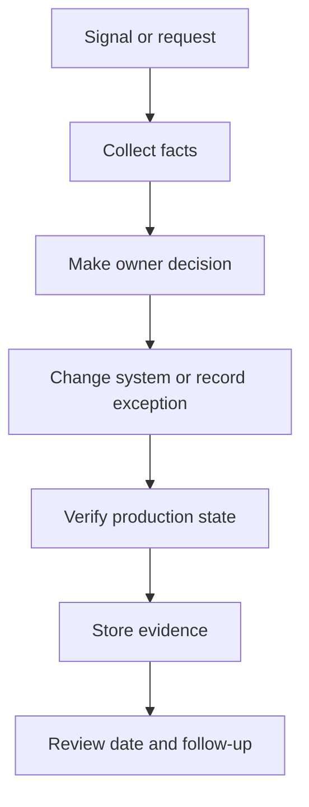

## Table of Contents

1. [What Incident Response Coordinates](#what-incident-response-coordinates)
2. [Classify the Event](#classify-the-event)
3. [Contain the Risk](#contain-the-risk)
4. [Investigate With Evidence](#investigate-with-evidence)
5. [Roles and Communication](#roles-and-communication)
6. [Recovery Criteria](#recovery-criteria)
7. [Failure Modes in Response](#failure-modes-in-response)
8. [Tradeoffs During Investigation](#tradeoffs-during-investigation)

## What Incident Response Coordinates

Incident response is the organized work of detecting, containing, investigating, fixing, and communicating about a security event. It exists because a real event has too many moving parts for memory alone: logs, owners, customer impact, access decisions, evidence handling, and recovery steps all happen at once.
For `devpolaris-orders-api`, the incident begins after a patched dependency still appears in production on one old container. The team treats it as a security incident because a known vulnerable parser may have handled public requests after the expected fix time.



## Classify the Event

The first response decision is classification. Classification means deciding whether the event is a security incident, an operational incident, a policy exception, or a false alarm. The label matters because it controls who joins, what evidence is preserved, and how quickly containment starts.
In the orders example, the vulnerable parser remained active in one production task after the expected patch. That is enough to start a security incident because public traffic may have reached known vulnerable code.

```yaml
incident_id: sec-2026-05-orders-1
status: active
lead: Maya
service: devpolaris-orders-api
current_fact: one production task served the old image after patch window
containment: drain stale task and block old digest
evidence_needed:
  - task inventory
  - request logs by image digest
  - scanner status
  - customer impact assessment
```

## Contain the Risk

Containment reduces further harm while investigation continues. It should be specific to the risk. Restarting every service may create an outage without removing the vulnerable path. Blocking one route, draining stale tasks, or forcing a new deployment may reduce exposure with less damage.
The team chooses the least disruptive action that removes the known risky state.

```text
incident_id: sec-2026-05-orders-2
status: active
lead: Maya
service: devpolaris-orders-api
current_fact: one production task served the old image after patch window
containment: drain stale task and block old digest
evidence_needed:
  - task inventory
  - request logs by image digest
  - scanner status
  - customer impact assessment
```

## Investigate With Evidence

Investigation depends on logs that identify request path, task version, image digest, caller context, and error shape. Logs should not include secrets or full payment data. They should include enough stable identifiers to answer which requests reached the stale task.
If logs only say `request failed`, the incident team has to infer too much.

```yaml
incident_id: sec-2026-05-orders-3
status: active
lead: Maya
service: devpolaris-orders-api
current_fact: one production task served the old image after patch window
containment: drain stale task and block old digest
evidence_needed:
  - task inventory
  - request logs by image digest
  - scanner status
  - customer impact assessment
```

## Roles and Communication

Communication keeps the work coordinated. The incident lead records facts, decisions, owners, and timestamps. The app engineer investigates code and deployment state. The security reviewer helps interpret risk and evidence. The support owner prepares customer-facing language if impact is confirmed.
Clear roles prevent duplicate work during the first hour.

```text
incident_id: sec-2026-05-orders-4
status: active
lead: Maya
service: devpolaris-orders-api
current_fact: one production task served the old image after patch window
containment: drain stale task and block old digest
evidence_needed:
  - task inventory
  - request logs by image digest
  - scanner status
  - customer impact assessment
```

## Recovery Criteria

Recovery means returning the system to a known safe state and proving it. For this incident, recovery requires all production tasks to run the patched image digest, the vulnerable package to be absent or fixed, and the scanner to show the expected result.
The incident is not ready to close while old tasks can still serve traffic.

```yaml
incident_id: sec-2026-05-orders-5
status: active
lead: Maya
service: devpolaris-orders-api
current_fact: one production task served the old image after patch window
containment: drain stale task and block old digest
evidence_needed:
  - task inventory
  - request logs by image digest
  - scanner status
  - customer impact assessment
```

## Failure Modes in Response

Incident response trades speed for evidence quality. Fast containment protects users, but careless commands can destroy the facts needed to understand impact. The team should preserve logs and state snapshots before destructive cleanup when that delay does not increase harm.

```text
incident_id: sec-2026-05-orders-6
status: active
lead: Maya
service: devpolaris-orders-api
current_fact: one production task served the old image after patch window
containment: drain stale task and block old digest
evidence_needed:
  - task inventory
  - request logs by image digest
  - scanner status
  - customer impact assessment
```

## Tradeoffs During Investigation

The first response decision is classification. Classification means deciding whether the event is a security incident, an operational incident, a policy exception, or a false alarm. The label matters because it controls who joins, what evidence is preserved, and how quickly containment starts.
In the orders example, the vulnerable parser remained active in one production task after the expected patch. That is enough to start a security incident because public traffic may have reached known vulnerable code.

```yaml
incident_id: sec-2026-05-orders-7
status: active
lead: Maya
service: devpolaris-orders-api
current_fact: one production task served the old image after patch window
containment: drain stale task and block old digest
evidence_needed:
  - task inventory
  - request logs by image digest
  - scanner status
  - customer impact assessment
```

**Operating Checklist**

- Check 1: security incident response evidence should name the system, owner, timestamp, decision, and next review date.
- Check 2: security incident response evidence should name the system, owner, timestamp, decision, and next review date.
- Check 3: security incident response evidence should name the system, owner, timestamp, decision, and next review date.
- Check 4: security incident response evidence should name the system, owner, timestamp, decision, and next review date.
- Check 5: security incident response evidence should name the system, owner, timestamp, decision, and next review date.
- Check 6: security incident response evidence should name the system, owner, timestamp, decision, and next review date.
- Check 7: security incident response evidence should name the system, owner, timestamp, decision, and next review date.
- Check 8: security incident response evidence should name the system, owner, timestamp, decision, and next review date.
- Check 9: security incident response evidence should name the system, owner, timestamp, decision, and next review date.
- Check 10: security incident response evidence should name the system, owner, timestamp, decision, and next review date.
- Check 11: security incident response evidence should name the system, owner, timestamp, decision, and next review date.
- Check 12: security incident response evidence should name the system, owner, timestamp, decision, and next review date.
- Check 13: security incident response evidence should name the system, owner, timestamp, decision, and next review date.
- Check 14: security incident response evidence should name the system, owner, timestamp, decision, and next review date.
- Check 15: security incident response evidence should name the system, owner, timestamp, decision, and next review date.
- Check 16: security incident response evidence should name the system, owner, timestamp, decision, and next review date.
- Check 17: security incident response evidence should name the system, owner, timestamp, decision, and next review date.
- Check 18: security incident response evidence should name the system, owner, timestamp, decision, and next review date.
- Check 19: security incident response evidence should name the system, owner, timestamp, decision, and next review date.
- Check 20: security incident response evidence should name the system, owner, timestamp, decision, and next review date.
- Check 21: security incident response evidence should name the system, owner, timestamp, decision, and next review date.
- Check 22: security incident response evidence should name the system, owner, timestamp, decision, and next review date.
- Check 23: security incident response evidence should name the system, owner, timestamp, decision, and next review date.
- Check 24: security incident response evidence should name the system, owner, timestamp, decision, and next review date.
- Check 25: security incident response evidence should name the system, owner, timestamp, decision, and next review date.
- Check 26: security incident response evidence should name the system, owner, timestamp, decision, and next review date.
- Check 27: security incident response evidence should name the system, owner, timestamp, decision, and next review date.
- Check 28: security incident response evidence should name the system, owner, timestamp, decision, and next review date.
- Check 29: security incident response evidence should name the system, owner, timestamp, decision, and next review date.
- Check 30: security incident response evidence should name the system, owner, timestamp, decision, and next review date.
- Check 31: security incident response evidence should name the system, owner, timestamp, decision, and next review date.
- Check 32: security incident response evidence should name the system, owner, timestamp, decision, and next review date.
- Check 33: security incident response evidence should name the system, owner, timestamp, decision, and next review date.
- Check 34: security incident response evidence should name the system, owner, timestamp, decision, and next review date.
- Check 35: security incident response evidence should name the system, owner, timestamp, decision, and next review date.
- Check 36: security incident response evidence should name the system, owner, timestamp, decision, and next review date.
- Check 37: security incident response evidence should name the system, owner, timestamp, decision, and next review date.
- Check 38: security incident response evidence should name the system, owner, timestamp, decision, and next review date.
- Check 39: security incident response evidence should name the system, owner, timestamp, decision, and next review date.
- Check 40: security incident response evidence should name the system, owner, timestamp, decision, and next review date.
- Check 41: security incident response evidence should name the system, owner, timestamp, decision, and next review date.
- Check 42: security incident response evidence should name the system, owner, timestamp, decision, and next review date.
- Check 43: security incident response evidence should name the system, owner, timestamp, decision, and next review date.
- Check 44: security incident response evidence should name the system, owner, timestamp, decision, and next review date.
- Check 45: security incident response evidence should name the system, owner, timestamp, decision, and next review date.
- Check 46: security incident response evidence should name the system, owner, timestamp, decision, and next review date.
- Check 47: security incident response evidence should name the system, owner, timestamp, decision, and next review date.
- Check 48: security incident response evidence should name the system, owner, timestamp, decision, and next review date.
- Check 49: security incident response evidence should name the system, owner, timestamp, decision, and next review date.
- Check 50: security incident response evidence should name the system, owner, timestamp, decision, and next review date.
- Check 51: security incident response evidence should name the system, owner, timestamp, decision, and next review date.
- Check 52: security incident response evidence should name the system, owner, timestamp, decision, and next review date.
- Check 53: security incident response evidence should name the system, owner, timestamp, decision, and next review date.
- Check 54: security incident response evidence should name the system, owner, timestamp, decision, and next review date.
- Check 55: security incident response evidence should name the system, owner, timestamp, decision, and next review date.
- Check 56: security incident response evidence should name the system, owner, timestamp, decision, and next review date.
- Check 57: security incident response evidence should name the system, owner, timestamp, decision, and next review date.
- Check 58: security incident response evidence should name the system, owner, timestamp, decision, and next review date.
- Check 59: security incident response evidence should name the system, owner, timestamp, decision, and next review date.
- Check 60: security incident response evidence should name the system, owner, timestamp, decision, and next review date.
- Check 61: security incident response evidence should name the system, owner, timestamp, decision, and next review date.
- Check 62: security incident response evidence should name the system, owner, timestamp, decision, and next review date.
- Check 63: security incident response evidence should name the system, owner, timestamp, decision, and next review date.
- Check 64: security incident response evidence should name the system, owner, timestamp, decision, and next review date.
- Check 65: security incident response evidence should name the system, owner, timestamp, decision, and next review date.
- Check 66: security incident response evidence should name the system, owner, timestamp, decision, and next review date.
- Check 67: security incident response evidence should name the system, owner, timestamp, decision, and next review date.
- Check 68: security incident response evidence should name the system, owner, timestamp, decision, and next review date.
- Check 69: security incident response evidence should name the system, owner, timestamp, decision, and next review date.
- Check 70: security incident response evidence should name the system, owner, timestamp, decision, and next review date.
- Check 71: security incident response evidence should name the system, owner, timestamp, decision, and next review date.
- Check 72: security incident response evidence should name the system, owner, timestamp, decision, and next review date.
- Check 73: security incident response evidence should name the system, owner, timestamp, decision, and next review date.
- Check 74: security incident response evidence should name the system, owner, timestamp, decision, and next review date.
- Check 75: security incident response evidence should name the system, owner, timestamp, decision, and next review date.
- Check 76: security incident response evidence should name the system, owner, timestamp, decision, and next review date.
- Check 77: security incident response evidence should name the system, owner, timestamp, decision, and next review date.
- Check 78: security incident response evidence should name the system, owner, timestamp, decision, and next review date.
- Check 79: security incident response evidence should name the system, owner, timestamp, decision, and next review date.
- Check 80: security incident response evidence should name the system, owner, timestamp, decision, and next review date.
- Check 81: security incident response evidence should name the system, owner, timestamp, decision, and next review date.
- Check 82: security incident response evidence should name the system, owner, timestamp, decision, and next review date.
- Check 83: security incident response evidence should name the system, owner, timestamp, decision, and next review date.
- Check 84: security incident response evidence should name the system, owner, timestamp, decision, and next review date.
- Check 85: security incident response evidence should name the system, owner, timestamp, decision, and next review date.
- Check 86: security incident response evidence should name the system, owner, timestamp, decision, and next review date.
- Check 87: security incident response evidence should name the system, owner, timestamp, decision, and next review date.
- Check 88: security incident response evidence should name the system, owner, timestamp, decision, and next review date.
- Check 89: security incident response evidence should name the system, owner, timestamp, decision, and next review date.
- Check 90: security incident response evidence should name the system, owner, timestamp, decision, and next review date.
- Check 91: security incident response evidence should name the system, owner, timestamp, decision, and next review date.
- Check 92: security incident response evidence should name the system, owner, timestamp, decision, and next review date.
- Check 93: security incident response evidence should name the system, owner, timestamp, decision, and next review date.
- Check 94: security incident response evidence should name the system, owner, timestamp, decision, and next review date.
- Check 95: security incident response evidence should name the system, owner, timestamp, decision, and next review date.
- Check 96: security incident response evidence should name the system, owner, timestamp, decision, and next review date.
- Check 97: security incident response evidence should name the system, owner, timestamp, decision, and next review date.
- Check 98: security incident response evidence should name the system, owner, timestamp, decision, and next review date.
- Check 99: security incident response evidence should name the system, owner, timestamp, decision, and next review date.
- Check 100: security incident response evidence should name the system, owner, timestamp, decision, and next review date.
- Check 101: security incident response evidence should name the system, owner, timestamp, decision, and next review date.
- Check 102: security incident response evidence should name the system, owner, timestamp, decision, and next review date.
- Check 103: security incident response evidence should name the system, owner, timestamp, decision, and next review date.
- Check 104: security incident response evidence should name the system, owner, timestamp, decision, and next review date.
- Check 105: security incident response evidence should name the system, owner, timestamp, decision, and next review date.
- Check 106: security incident response evidence should name the system, owner, timestamp, decision, and next review date.
- Check 107: security incident response evidence should name the system, owner, timestamp, decision, and next review date.
- Check 108: security incident response evidence should name the system, owner, timestamp, decision, and next review date.
- Check 109: security incident response evidence should name the system, owner, timestamp, decision, and next review date.
- Check 110: security incident response evidence should name the system, owner, timestamp, decision, and next review date.
- Check 111: security incident response evidence should name the system, owner, timestamp, decision, and next review date.
- Check 112: security incident response evidence should name the system, owner, timestamp, decision, and next review date.
- Check 113: security incident response evidence should name the system, owner, timestamp, decision, and next review date.
- Check 114: security incident response evidence should name the system, owner, timestamp, decision, and next review date.
- Check 115: security incident response evidence should name the system, owner, timestamp, decision, and next review date.
- Check 116: security incident response evidence should name the system, owner, timestamp, decision, and next review date.
- Check 117: security incident response evidence should name the system, owner, timestamp, decision, and next review date.
- Check 118: security incident response evidence should name the system, owner, timestamp, decision, and next review date.
- Check 119: security incident response evidence should name the system, owner, timestamp, decision, and next review date.
- Check 120: security incident response evidence should name the system, owner, timestamp, decision, and next review date.
- Check 121: security incident response evidence should name the system, owner, timestamp, decision, and next review date.
- Check 122: security incident response evidence should name the system, owner, timestamp, decision, and next review date.
- Check 123: security incident response evidence should name the system, owner, timestamp, decision, and next review date.
- Check 124: security incident response evidence should name the system, owner, timestamp, decision, and next review date.
- Check 125: security incident response evidence should name the system, owner, timestamp, decision, and next review date.
- Check 126: security incident response evidence should name the system, owner, timestamp, decision, and next review date.
- Check 127: security incident response evidence should name the system, owner, timestamp, decision, and next review date.
- Check 128: security incident response evidence should name the system, owner, timestamp, decision, and next review date.
- Check 129: security incident response evidence should name the system, owner, timestamp, decision, and next review date.
- Check 130: security incident response evidence should name the system, owner, timestamp, decision, and next review date.

---

**References**

- [NIST Computer Security Incident Handling Guide](https://csrc.nist.gov/pubs/sp/800/61/r2/final) - Use this for the canonical incident response lifecycle and role model.
- [CISA Incident Response Playbooks](https://www.cisa.gov/resources-tools/resources/federal-government-cybersecurity-incident-and-vulnerability-response-playbooks) - Use this for practical response activities and communication patterns.
- [GitHub Code Security Documentation](https://docs.github.com/en/code-security) - Use this to connect repository security signals to incident investigation.
- [OWASP Logging Cheat Sheet](https://cheatsheetseries.owasp.org/cheatsheets/Logging_Cheat_Sheet.html) - Use this to design logs that help during investigation without leaking secrets.
