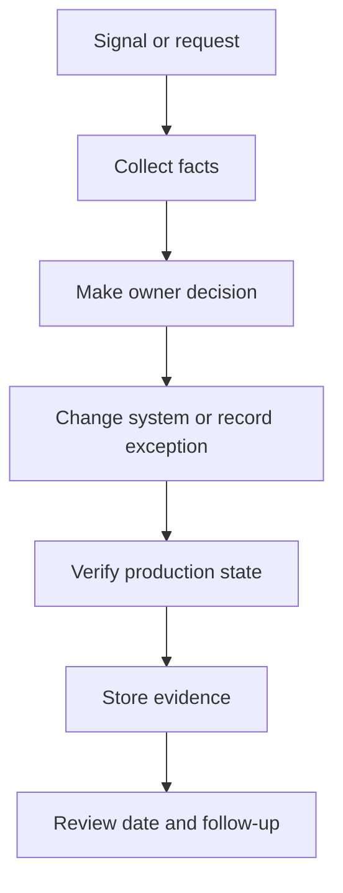

## Table of Contents

1. [What a Security Runbook Does](#what-a-security-runbook-does)
2. [Define Scope Before Steps](#define-scope-before-steps)
3. [Expected Results Matter](#expected-results-matter)
4. [Escalation Triggers](#escalation-triggers)
5. [Automation Boundaries](#automation-boundaries)
6. [Runbook Testing](#runbook-testing)
7. [Failure Modes in Runbooks](#failure-modes-in-runbooks)
8. [Tradeoffs in Runbook Detail](#tradeoffs-in-runbook-detail)

## What a Security Runbook Does

A security runbook is a repeatable operating guide for a specific security task. It tells an engineer what to check, what evidence to collect, when to escalate, and where the stop points are. It exists so the team does not rebuild the response process during every finding or incident.
For `devpolaris-orders-api`, the runbooks cover dependency triage, emergency patching, access evidence review, suspicious token investigation, and post-incident hardening. Each one is short enough to use during real work and specific enough to avoid guessing.



## Define Scope Before Steps

A runbook should start with scope. Scope tells the reader when to use it and when not to use it. Without scope, engineers apply the wrong checklist to the wrong event, such as using a dependency patch runbook for a suspected credential leak.
The orders team keeps separate runbooks because dependency risk, access evidence, and incident containment have different stop points.

```yaml
runbook: orders-1
trigger: security finding requires production verification
owner: orders-platform
first_check: confirm service and environment
stop_if:
  - customer data exposure suspected
  - production owner unavailable
  - evidence contradicts scanner finding
expected_output: named decision, owner, due date, and evidence link
```

## Expected Results Matter

Each step needs an expected result. A command without an expected result only proves someone typed something. The runbook should say which field matters and what value is acceptable.
For example, a production image check should name the patched digest, not only say `kubectl get pods` or `gh run view`.

```text
runbook: orders-2
trigger: security finding requires production verification
owner: orders-platform
first_check: confirm service and environment
stop_if:
  - customer data exposure suspected
  - production owner unavailable
  - evidence contradicts scanner finding
expected_output: named decision, owner, due date, and evidence link
```

## Escalation Triggers

Runbooks should include escalation triggers. An escalation trigger is a condition that tells the engineer to bring in another owner or pause the workflow. Examples include customer data exposure, unknown production access, failed rollback, or evidence that contradicts the original finding.
Triggers protect junior engineers from having to guess the political weight of a decision.

```yaml
runbook: orders-3
trigger: security finding requires production verification
owner: orders-platform
first_check: confirm service and environment
stop_if:
  - customer data exposure suspected
  - production owner unavailable
  - evidence contradicts scanner finding
expected_output: named decision, owner, due date, and evidence link
```

## Automation Boundaries

Automation belongs where the step is repeatable and the expected result is easy to check. Human review belongs where the context matters, such as deciding whether a compensating control is enough for an exception.
The best runbooks combine both instead of pretending one can replace the other.

```text
runbook: orders-4
trigger: security finding requires production verification
owner: orders-platform
first_check: confirm service and environment
stop_if:
  - customer data exposure suspected
  - production owner unavailable
  - evidence contradicts scanner finding
expected_output: named decision, owner, due date, and evidence link
```

## Runbook Testing

Runbooks fail when they age silently. A command changes, a service moves, a team ownership label changes, or a dashboard link dies. The failure usually appears during the next incident, which is the worst time to discover it.
The fix direction is to test runbooks during normal work and attach a last-reviewed date with an owner.

```yaml
runbook: orders-5
trigger: security finding requires production verification
owner: orders-platform
first_check: confirm service and environment
stop_if:
  - customer data exposure suspected
  - production owner unavailable
  - evidence contradicts scanner finding
expected_output: named decision, owner, due date, and evidence link
```

## Failure Modes in Runbooks

The tradeoff is completeness versus usability. A fifty-page runbook may contain every detail, but few people will use it correctly during a real event. A one-page checklist may be usable, but it can hide important evidence steps. The practical answer is a short primary path with links to deeper procedures.

```text
runbook: orders-6
trigger: security finding requires production verification
owner: orders-platform
first_check: confirm service and environment
stop_if:
  - customer data exposure suspected
  - production owner unavailable
  - evidence contradicts scanner finding
expected_output: named decision, owner, due date, and evidence link
```

## Tradeoffs in Runbook Detail

A runbook should start with scope. Scope tells the reader when to use it and when not to use it. Without scope, engineers apply the wrong checklist to the wrong event, such as using a dependency patch runbook for a suspected credential leak.
The orders team keeps separate runbooks because dependency risk, access evidence, and incident containment have different stop points.

```yaml
runbook: orders-7
trigger: security finding requires production verification
owner: orders-platform
first_check: confirm service and environment
stop_if:
  - customer data exposure suspected
  - production owner unavailable
  - evidence contradicts scanner finding
expected_output: named decision, owner, due date, and evidence link
```

**Operating Checklist**

- Check 1: security runbooks evidence should name the system, owner, timestamp, decision, and next review date.
- Check 2: security runbooks evidence should name the system, owner, timestamp, decision, and next review date.
- Check 3: security runbooks evidence should name the system, owner, timestamp, decision, and next review date.
- Check 4: security runbooks evidence should name the system, owner, timestamp, decision, and next review date.
- Check 5: security runbooks evidence should name the system, owner, timestamp, decision, and next review date.
- Check 6: security runbooks evidence should name the system, owner, timestamp, decision, and next review date.
- Check 7: security runbooks evidence should name the system, owner, timestamp, decision, and next review date.
- Check 8: security runbooks evidence should name the system, owner, timestamp, decision, and next review date.
- Check 9: security runbooks evidence should name the system, owner, timestamp, decision, and next review date.
- Check 10: security runbooks evidence should name the system, owner, timestamp, decision, and next review date.
- Check 11: security runbooks evidence should name the system, owner, timestamp, decision, and next review date.
- Check 12: security runbooks evidence should name the system, owner, timestamp, decision, and next review date.
- Check 13: security runbooks evidence should name the system, owner, timestamp, decision, and next review date.
- Check 14: security runbooks evidence should name the system, owner, timestamp, decision, and next review date.
- Check 15: security runbooks evidence should name the system, owner, timestamp, decision, and next review date.
- Check 16: security runbooks evidence should name the system, owner, timestamp, decision, and next review date.
- Check 17: security runbooks evidence should name the system, owner, timestamp, decision, and next review date.
- Check 18: security runbooks evidence should name the system, owner, timestamp, decision, and next review date.
- Check 19: security runbooks evidence should name the system, owner, timestamp, decision, and next review date.
- Check 20: security runbooks evidence should name the system, owner, timestamp, decision, and next review date.
- Check 21: security runbooks evidence should name the system, owner, timestamp, decision, and next review date.
- Check 22: security runbooks evidence should name the system, owner, timestamp, decision, and next review date.
- Check 23: security runbooks evidence should name the system, owner, timestamp, decision, and next review date.
- Check 24: security runbooks evidence should name the system, owner, timestamp, decision, and next review date.
- Check 25: security runbooks evidence should name the system, owner, timestamp, decision, and next review date.
- Check 26: security runbooks evidence should name the system, owner, timestamp, decision, and next review date.
- Check 27: security runbooks evidence should name the system, owner, timestamp, decision, and next review date.
- Check 28: security runbooks evidence should name the system, owner, timestamp, decision, and next review date.
- Check 29: security runbooks evidence should name the system, owner, timestamp, decision, and next review date.
- Check 30: security runbooks evidence should name the system, owner, timestamp, decision, and next review date.
- Check 31: security runbooks evidence should name the system, owner, timestamp, decision, and next review date.
- Check 32: security runbooks evidence should name the system, owner, timestamp, decision, and next review date.
- Check 33: security runbooks evidence should name the system, owner, timestamp, decision, and next review date.
- Check 34: security runbooks evidence should name the system, owner, timestamp, decision, and next review date.
- Check 35: security runbooks evidence should name the system, owner, timestamp, decision, and next review date.
- Check 36: security runbooks evidence should name the system, owner, timestamp, decision, and next review date.
- Check 37: security runbooks evidence should name the system, owner, timestamp, decision, and next review date.
- Check 38: security runbooks evidence should name the system, owner, timestamp, decision, and next review date.
- Check 39: security runbooks evidence should name the system, owner, timestamp, decision, and next review date.
- Check 40: security runbooks evidence should name the system, owner, timestamp, decision, and next review date.
- Check 41: security runbooks evidence should name the system, owner, timestamp, decision, and next review date.
- Check 42: security runbooks evidence should name the system, owner, timestamp, decision, and next review date.
- Check 43: security runbooks evidence should name the system, owner, timestamp, decision, and next review date.
- Check 44: security runbooks evidence should name the system, owner, timestamp, decision, and next review date.
- Check 45: security runbooks evidence should name the system, owner, timestamp, decision, and next review date.
- Check 46: security runbooks evidence should name the system, owner, timestamp, decision, and next review date.
- Check 47: security runbooks evidence should name the system, owner, timestamp, decision, and next review date.
- Check 48: security runbooks evidence should name the system, owner, timestamp, decision, and next review date.
- Check 49: security runbooks evidence should name the system, owner, timestamp, decision, and next review date.
- Check 50: security runbooks evidence should name the system, owner, timestamp, decision, and next review date.
- Check 51: security runbooks evidence should name the system, owner, timestamp, decision, and next review date.
- Check 52: security runbooks evidence should name the system, owner, timestamp, decision, and next review date.
- Check 53: security runbooks evidence should name the system, owner, timestamp, decision, and next review date.
- Check 54: security runbooks evidence should name the system, owner, timestamp, decision, and next review date.
- Check 55: security runbooks evidence should name the system, owner, timestamp, decision, and next review date.
- Check 56: security runbooks evidence should name the system, owner, timestamp, decision, and next review date.
- Check 57: security runbooks evidence should name the system, owner, timestamp, decision, and next review date.
- Check 58: security runbooks evidence should name the system, owner, timestamp, decision, and next review date.
- Check 59: security runbooks evidence should name the system, owner, timestamp, decision, and next review date.
- Check 60: security runbooks evidence should name the system, owner, timestamp, decision, and next review date.
- Check 61: security runbooks evidence should name the system, owner, timestamp, decision, and next review date.
- Check 62: security runbooks evidence should name the system, owner, timestamp, decision, and next review date.
- Check 63: security runbooks evidence should name the system, owner, timestamp, decision, and next review date.
- Check 64: security runbooks evidence should name the system, owner, timestamp, decision, and next review date.
- Check 65: security runbooks evidence should name the system, owner, timestamp, decision, and next review date.
- Check 66: security runbooks evidence should name the system, owner, timestamp, decision, and next review date.
- Check 67: security runbooks evidence should name the system, owner, timestamp, decision, and next review date.
- Check 68: security runbooks evidence should name the system, owner, timestamp, decision, and next review date.
- Check 69: security runbooks evidence should name the system, owner, timestamp, decision, and next review date.
- Check 70: security runbooks evidence should name the system, owner, timestamp, decision, and next review date.
- Check 71: security runbooks evidence should name the system, owner, timestamp, decision, and next review date.
- Check 72: security runbooks evidence should name the system, owner, timestamp, decision, and next review date.
- Check 73: security runbooks evidence should name the system, owner, timestamp, decision, and next review date.
- Check 74: security runbooks evidence should name the system, owner, timestamp, decision, and next review date.
- Check 75: security runbooks evidence should name the system, owner, timestamp, decision, and next review date.
- Check 76: security runbooks evidence should name the system, owner, timestamp, decision, and next review date.
- Check 77: security runbooks evidence should name the system, owner, timestamp, decision, and next review date.
- Check 78: security runbooks evidence should name the system, owner, timestamp, decision, and next review date.
- Check 79: security runbooks evidence should name the system, owner, timestamp, decision, and next review date.
- Check 80: security runbooks evidence should name the system, owner, timestamp, decision, and next review date.
- Check 81: security runbooks evidence should name the system, owner, timestamp, decision, and next review date.
- Check 82: security runbooks evidence should name the system, owner, timestamp, decision, and next review date.
- Check 83: security runbooks evidence should name the system, owner, timestamp, decision, and next review date.
- Check 84: security runbooks evidence should name the system, owner, timestamp, decision, and next review date.
- Check 85: security runbooks evidence should name the system, owner, timestamp, decision, and next review date.
- Check 86: security runbooks evidence should name the system, owner, timestamp, decision, and next review date.
- Check 87: security runbooks evidence should name the system, owner, timestamp, decision, and next review date.
- Check 88: security runbooks evidence should name the system, owner, timestamp, decision, and next review date.
- Check 89: security runbooks evidence should name the system, owner, timestamp, decision, and next review date.
- Check 90: security runbooks evidence should name the system, owner, timestamp, decision, and next review date.
- Check 91: security runbooks evidence should name the system, owner, timestamp, decision, and next review date.
- Check 92: security runbooks evidence should name the system, owner, timestamp, decision, and next review date.
- Check 93: security runbooks evidence should name the system, owner, timestamp, decision, and next review date.
- Check 94: security runbooks evidence should name the system, owner, timestamp, decision, and next review date.
- Check 95: security runbooks evidence should name the system, owner, timestamp, decision, and next review date.
- Check 96: security runbooks evidence should name the system, owner, timestamp, decision, and next review date.
- Check 97: security runbooks evidence should name the system, owner, timestamp, decision, and next review date.
- Check 98: security runbooks evidence should name the system, owner, timestamp, decision, and next review date.
- Check 99: security runbooks evidence should name the system, owner, timestamp, decision, and next review date.
- Check 100: security runbooks evidence should name the system, owner, timestamp, decision, and next review date.
- Check 101: security runbooks evidence should name the system, owner, timestamp, decision, and next review date.
- Check 102: security runbooks evidence should name the system, owner, timestamp, decision, and next review date.
- Check 103: security runbooks evidence should name the system, owner, timestamp, decision, and next review date.
- Check 104: security runbooks evidence should name the system, owner, timestamp, decision, and next review date.
- Check 105: security runbooks evidence should name the system, owner, timestamp, decision, and next review date.
- Check 106: security runbooks evidence should name the system, owner, timestamp, decision, and next review date.
- Check 107: security runbooks evidence should name the system, owner, timestamp, decision, and next review date.
- Check 108: security runbooks evidence should name the system, owner, timestamp, decision, and next review date.
- Check 109: security runbooks evidence should name the system, owner, timestamp, decision, and next review date.
- Check 110: security runbooks evidence should name the system, owner, timestamp, decision, and next review date.
- Check 111: security runbooks evidence should name the system, owner, timestamp, decision, and next review date.
- Check 112: security runbooks evidence should name the system, owner, timestamp, decision, and next review date.
- Check 113: security runbooks evidence should name the system, owner, timestamp, decision, and next review date.
- Check 114: security runbooks evidence should name the system, owner, timestamp, decision, and next review date.
- Check 115: security runbooks evidence should name the system, owner, timestamp, decision, and next review date.
- Check 116: security runbooks evidence should name the system, owner, timestamp, decision, and next review date.
- Check 117: security runbooks evidence should name the system, owner, timestamp, decision, and next review date.
- Check 118: security runbooks evidence should name the system, owner, timestamp, decision, and next review date.
- Check 119: security runbooks evidence should name the system, owner, timestamp, decision, and next review date.
- Check 120: security runbooks evidence should name the system, owner, timestamp, decision, and next review date.
- Check 121: security runbooks evidence should name the system, owner, timestamp, decision, and next review date.
- Check 122: security runbooks evidence should name the system, owner, timestamp, decision, and next review date.
- Check 123: security runbooks evidence should name the system, owner, timestamp, decision, and next review date.
- Check 124: security runbooks evidence should name the system, owner, timestamp, decision, and next review date.
- Check 125: security runbooks evidence should name the system, owner, timestamp, decision, and next review date.
- Check 126: security runbooks evidence should name the system, owner, timestamp, decision, and next review date.
- Check 127: security runbooks evidence should name the system, owner, timestamp, decision, and next review date.
- Check 128: security runbooks evidence should name the system, owner, timestamp, decision, and next review date.
- Check 129: security runbooks evidence should name the system, owner, timestamp, decision, and next review date.
- Check 130: security runbooks evidence should name the system, owner, timestamp, decision, and next review date.
- Check 131: security runbooks evidence should name the system, owner, timestamp, decision, and next review date.
- Check 132: security runbooks evidence should name the system, owner, timestamp, decision, and next review date.
- Check 133: security runbooks evidence should name the system, owner, timestamp, decision, and next review date.
- Check 134: security runbooks evidence should name the system, owner, timestamp, decision, and next review date.
- Check 135: security runbooks evidence should name the system, owner, timestamp, decision, and next review date.
- Check 136: security runbooks evidence should name the system, owner, timestamp, decision, and next review date.
- Check 137: security runbooks evidence should name the system, owner, timestamp, decision, and next review date.
- Check 138: security runbooks evidence should name the system, owner, timestamp, decision, and next review date.
- Check 139: security runbooks evidence should name the system, owner, timestamp, decision, and next review date.
- Check 140: security runbooks evidence should name the system, owner, timestamp, decision, and next review date.
- Check 141: security runbooks evidence should name the system, owner, timestamp, decision, and next review date.
- Check 142: security runbooks evidence should name the system, owner, timestamp, decision, and next review date.
- Check 143: security runbooks evidence should name the system, owner, timestamp, decision, and next review date.
- Check 144: security runbooks evidence should name the system, owner, timestamp, decision, and next review date.

---

**References**

- [NIST Computer Security Incident Handling Guide](https://csrc.nist.gov/pubs/sp/800/61/r2/final) - Use this to align runbooks with preparation, detection, containment, eradication, and recovery.
- [CISA Incident Response Playbooks](https://www.cisa.gov/resources-tools/resources/federal-government-cybersecurity-incident-and-vulnerability-response-playbooks) - Use this for response task examples that can become team runbook steps.
- [OWASP Logging Cheat Sheet](https://cheatsheetseries.owasp.org/cheatsheets/Logging_Cheat_Sheet.html) - Use this to make runbook diagnostics depend on useful logs.
- [GitHub Actions Workflow Syntax](https://docs.github.com/en/actions/writing-workflows/workflow-syntax-for-github-actions) - Use this when automation turns a runbook step into a checked workflow.
