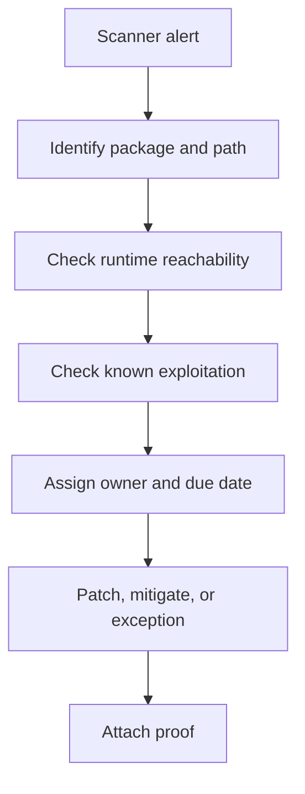

## Table of Contents

1. [What Triage Decides](#what-triage-decides)
2. [The Example Finding](#the-example-finding)
3. [Severity Is Not Priority](#severity-is-not-priority)
4. [Build the Evidence Packet](#build-the-evidence-packet)
5. [Diagnostic Path for a Dependency Finding](#diagnostic-path-for-a-dependency-finding)
6. [Decision Records and Owners](#decision-records-and-owners)
7. [Failure Modes in Triage](#failure-modes-in-triage)
8. [Tradeoffs in Risk-Based Prioritization](#tradeoffs-in-riskbased-prioritization)

## What Triage Decides

Vulnerability triage is the process of deciding what a security finding means for a real system. A scanner can say that a package has a known weakness, but the scanner does not know whether that package is reachable from the internet, loaded in production, protected by another control, or already replaced in the next release branch.
Triage exists because teams cannot fix every finding in the same hour. You still take findings seriously, but you sort them into decisions that engineering can act on: patch now, patch in the next planned release, add a temporary control, accept a time-limited exception, or mark the finding as not applicable with evidence.
For DevPolaris, the running service is `devpolaris-orders-api`, a Node.js API that accepts checkout requests and writes order records. The example starts with a dependency scanner finding in GitHub, then follows the path a security-minded engineer uses before asking the service team to patch.



## The Example Finding

The finding arrives as a dependency alert on a pull request that updates the lockfile. The package name matters, but the path matters more. A transitive dependency (a package pulled in by another package) may be present because of a development tool, a test-only helper, or code that runs inside the production server.
The first useful artifact is a small alert summary. It should be short enough that an app engineer can read it without opening five tabs, but specific enough that the next action is clear.

```text
repository: devpolaris/orders-api
service: devpolaris-orders-api
environment: production
package: example-json-parser
introduced_by: package-lock.json
used_by: src/http/orders/parse-order-body.ts
advisory: GHSA-example-parser-overread
cvss_vector: AV:N/AC:L/PR:N/UI:N/S:U/C:H/I:N/A:N
scanner_status: open
first_seen: 2026-05-06T09:12:41Z
```

This summary does not say "critical, fix immediately" by itself. It says the package is in the order API, the affected code path parses request bodies, and the vector claims the issue can be triggered over the network. That is enough to start a high-priority investigation.

## Severity Is Not Priority

Severity is the score assigned to the vulnerability. Priority is the order in which your team should work. They are related, but they are not the same. A high severity bug in a build-only package can be less urgent than a medium severity bug in a public login path that is being exploited.
CVSS (Common Vulnerability Scoring System) gives a shared vocabulary for technical severity. It helps teams avoid inventing their own words for impact and exploitability. Your triage still has to add local facts: exposure, business context, compensating controls, and whether the issue appears in the CISA Known Exploited Vulnerabilities catalog.

| Signal | What It Means for devpolaris-orders-api | Priority Effect |
|--------|------------------------------------------|-----------------|
| Network attack vector | The parser handles public checkout requests | Raises priority |
| No authentication required | Attack can happen before the user is known | Raises priority |
| Package only in devDependencies | Not shipped in the production container | Lowers priority if proven |
| KEV listed | Exploitation is known in real environments | Raises priority sharply |
| WAF blocks exact payload | Temporary mitigation exists | Buys time, does not close the finding |

## Build the Evidence Packet

An evidence packet is the small collection of facts that supports the decision. It should let another engineer understand why you chose the action without replaying the whole investigation. For a dependency finding, the packet usually includes the advisory, dependency path, runtime reachability, affected endpoint, environment, mitigation status, owner, due date, and final verification.
Evidence is not only for auditors. It protects the team during handoff. If Maya starts the investigation and Theo finishes the patch, Theo should not have to guess whether the vulnerable package was actually loaded in production.

```yaml
finding_id: vuln-2026-05-orders-014
service: devpolaris-orders-api
owner: orders-platform
status: triaged
priority: urgent
decision: patch
reason:
  - vulnerable package is present in production image
  - parser is used by POST /orders
  - unauthenticated requests can reach the parser
  - no permanent compensating control exists
due: 2026-05-09
evidence:
  advisory_url: https://github.com/advisories/GHSA-example-parser-overread
  lockfile_path: package-lock.json
  endpoint: POST /orders
  production_image: ghcr.io/devpolaris/orders-api@sha256:9c1cfbb3
  scanner_run: github-code-scanning-88421
```

## Diagnostic Path for a Dependency Finding

A good diagnostic path starts with package presence, then moves toward runtime use. Presence answers "is the package in the dependency graph?" Runtime use answers "can production code call it?" Both questions matter because many false positives come from packages that never enter the deployed service.
For `devpolaris-orders-api`, the dependency path begins in the lockfile. The engineer checks whether the package is reachable from a production dependency, then checks whether source code imports the package directly or through the framework.

```text
$ npm ls example-json-parser
orders-api@1.9.0 /workspace/devpolaris-orders-api
`-- @devpolaris/http-body@2.4.1
    `-- example-json-parser@1.7.2

$ rg "example-json-parser|parseOrderBody" src
src/http/orders/parse-order-body.ts:import { parseOrderBody } from "@devpolaris/http-body";
src/http/orders/routes.ts:const body = parseOrderBody(req);
```

The next check is the container image. A local lockfile can differ from the image running in production. The triage record should name the image digest or release ID that proves the vulnerable package is actually deployed.

```text
image: ghcr.io/devpolaris/orders-api@sha256:9c1cfbb3
node_env: production
package found: /app/node_modules/example-json-parser/package.json
version found: 1.7.2
runtime route: POST /orders
```

## Decision Records and Owners

A decision record turns investigation into work. It should be visible to the service owner, security reviewer, and release owner. The record needs a single next action. "Investigate" is useful early, but it cannot remain the final state because no one knows what done means.
The owner should be the team that can change the affected system. Security can help interpret the risk, but the orders team owns the patch because they own the repository, tests, and release path.

```text
decision: patch_now
owner_team: orders-platform
owner_person: Theo
due_date: 2026-05-09
required_evidence:
  - dependency update pull request
  - CI result for unit and integration tests
  - image digest after rebuild
  - production /version response
  - scanner alert closed or justified exception
```

## Failure Modes in Triage

Triage fails in repeatable ways. The most common failure is treating the scanner score as the whole decision. Another common failure is closing a finding because a branch is fixed while production still runs the old image. A third failure is accepting an exception with no expiry date.
These failures are avoidable when the triage record asks for proof at each step. If the evidence is missing, the finding is not done.

| Failure Mode | What It Looks Like | Fix Direction |
|--------------|--------------------|---------------|
| Score-only decision | Every critical alert gets the same due date | Add exposure, reachability, and KEV checks |
| Branch fixed, prod still vulnerable | PR merged but scanner still sees old image | Require production digest evidence |
| Owner unclear | Security ticket waits for a volunteer | Route by service ownership map |
| Exception never expires | Accepted risk remains open forever | Add expiry, reviewer, and renewal evidence |
| False positive closed too fast | Package is dismissed without runtime proof | Attach dependency path and image inspection |

## Tradeoffs in Risk-Based Prioritization

Risk-based prioritization gives you speed where speed matters. The tradeoff is that the process needs discipline. If every team invents its own priority rules, leadership cannot compare risk across services and engineers lose trust in the queue.
For DevPolaris, the practical compromise is a small standard model. Known exploitation, internet reachability, sensitive data exposure, and production presence raise priority. Dev-only scope, unreachable code, and strong temporary controls can lower priority, but only with evidence. The model is simple enough to use during a busy week and strict enough to prevent wishful thinking.

**Operating Checklist**

- Check 1: vulnerability triage evidence should name the system, owner, timestamp, decision, and next review date.
- Check 2: vulnerability triage evidence should name the system, owner, timestamp, decision, and next review date.
- Check 3: vulnerability triage evidence should name the system, owner, timestamp, decision, and next review date.
- Check 4: vulnerability triage evidence should name the system, owner, timestamp, decision, and next review date.
- Check 5: vulnerability triage evidence should name the system, owner, timestamp, decision, and next review date.
- Check 6: vulnerability triage evidence should name the system, owner, timestamp, decision, and next review date.
- Check 7: vulnerability triage evidence should name the system, owner, timestamp, decision, and next review date.
- Check 8: vulnerability triage evidence should name the system, owner, timestamp, decision, and next review date.
- Check 9: vulnerability triage evidence should name the system, owner, timestamp, decision, and next review date.
- Check 10: vulnerability triage evidence should name the system, owner, timestamp, decision, and next review date.
- Check 11: vulnerability triage evidence should name the system, owner, timestamp, decision, and next review date.
- Check 12: vulnerability triage evidence should name the system, owner, timestamp, decision, and next review date.
- Check 13: vulnerability triage evidence should name the system, owner, timestamp, decision, and next review date.
- Check 14: vulnerability triage evidence should name the system, owner, timestamp, decision, and next review date.
- Check 15: vulnerability triage evidence should name the system, owner, timestamp, decision, and next review date.
- Check 16: vulnerability triage evidence should name the system, owner, timestamp, decision, and next review date.
- Check 17: vulnerability triage evidence should name the system, owner, timestamp, decision, and next review date.
- Check 18: vulnerability triage evidence should name the system, owner, timestamp, decision, and next review date.
- Check 19: vulnerability triage evidence should name the system, owner, timestamp, decision, and next review date.
- Check 20: vulnerability triage evidence should name the system, owner, timestamp, decision, and next review date.
- Check 21: vulnerability triage evidence should name the system, owner, timestamp, decision, and next review date.
- Check 22: vulnerability triage evidence should name the system, owner, timestamp, decision, and next review date.
- Check 23: vulnerability triage evidence should name the system, owner, timestamp, decision, and next review date.
- Check 24: vulnerability triage evidence should name the system, owner, timestamp, decision, and next review date.
- Check 25: vulnerability triage evidence should name the system, owner, timestamp, decision, and next review date.
- Check 26: vulnerability triage evidence should name the system, owner, timestamp, decision, and next review date.
- Check 27: vulnerability triage evidence should name the system, owner, timestamp, decision, and next review date.
- Check 28: vulnerability triage evidence should name the system, owner, timestamp, decision, and next review date.
- Check 29: vulnerability triage evidence should name the system, owner, timestamp, decision, and next review date.
- Check 30: vulnerability triage evidence should name the system, owner, timestamp, decision, and next review date.
- Check 31: vulnerability triage evidence should name the system, owner, timestamp, decision, and next review date.
- Check 32: vulnerability triage evidence should name the system, owner, timestamp, decision, and next review date.
- Check 33: vulnerability triage evidence should name the system, owner, timestamp, decision, and next review date.
- Check 34: vulnerability triage evidence should name the system, owner, timestamp, decision, and next review date.
- Check 35: vulnerability triage evidence should name the system, owner, timestamp, decision, and next review date.
- Check 36: vulnerability triage evidence should name the system, owner, timestamp, decision, and next review date.
- Check 37: vulnerability triage evidence should name the system, owner, timestamp, decision, and next review date.
- Check 38: vulnerability triage evidence should name the system, owner, timestamp, decision, and next review date.
- Check 39: vulnerability triage evidence should name the system, owner, timestamp, decision, and next review date.
- Check 40: vulnerability triage evidence should name the system, owner, timestamp, decision, and next review date.
- Check 41: vulnerability triage evidence should name the system, owner, timestamp, decision, and next review date.
- Check 42: vulnerability triage evidence should name the system, owner, timestamp, decision, and next review date.
- Check 43: vulnerability triage evidence should name the system, owner, timestamp, decision, and next review date.
- Check 44: vulnerability triage evidence should name the system, owner, timestamp, decision, and next review date.
- Check 45: vulnerability triage evidence should name the system, owner, timestamp, decision, and next review date.
- Check 46: vulnerability triage evidence should name the system, owner, timestamp, decision, and next review date.
- Check 47: vulnerability triage evidence should name the system, owner, timestamp, decision, and next review date.
- Check 48: vulnerability triage evidence should name the system, owner, timestamp, decision, and next review date.
- Check 49: vulnerability triage evidence should name the system, owner, timestamp, decision, and next review date.
- Check 50: vulnerability triage evidence should name the system, owner, timestamp, decision, and next review date.
- Check 51: vulnerability triage evidence should name the system, owner, timestamp, decision, and next review date.
- Check 52: vulnerability triage evidence should name the system, owner, timestamp, decision, and next review date.
- Check 53: vulnerability triage evidence should name the system, owner, timestamp, decision, and next review date.
- Check 54: vulnerability triage evidence should name the system, owner, timestamp, decision, and next review date.
- Check 55: vulnerability triage evidence should name the system, owner, timestamp, decision, and next review date.
- Check 56: vulnerability triage evidence should name the system, owner, timestamp, decision, and next review date.
- Check 57: vulnerability triage evidence should name the system, owner, timestamp, decision, and next review date.
- Check 58: vulnerability triage evidence should name the system, owner, timestamp, decision, and next review date.
- Check 59: vulnerability triage evidence should name the system, owner, timestamp, decision, and next review date.
- Check 60: vulnerability triage evidence should name the system, owner, timestamp, decision, and next review date.
- Check 61: vulnerability triage evidence should name the system, owner, timestamp, decision, and next review date.
- Check 62: vulnerability triage evidence should name the system, owner, timestamp, decision, and next review date.
- Check 63: vulnerability triage evidence should name the system, owner, timestamp, decision, and next review date.
- Check 64: vulnerability triage evidence should name the system, owner, timestamp, decision, and next review date.
- Check 65: vulnerability triage evidence should name the system, owner, timestamp, decision, and next review date.
- Check 66: vulnerability triage evidence should name the system, owner, timestamp, decision, and next review date.
- Check 67: vulnerability triage evidence should name the system, owner, timestamp, decision, and next review date.
- Check 68: vulnerability triage evidence should name the system, owner, timestamp, decision, and next review date.
- Check 69: vulnerability triage evidence should name the system, owner, timestamp, decision, and next review date.
- Check 70: vulnerability triage evidence should name the system, owner, timestamp, decision, and next review date.
- Check 71: vulnerability triage evidence should name the system, owner, timestamp, decision, and next review date.
- Check 72: vulnerability triage evidence should name the system, owner, timestamp, decision, and next review date.
- Check 73: vulnerability triage evidence should name the system, owner, timestamp, decision, and next review date.
- Check 74: vulnerability triage evidence should name the system, owner, timestamp, decision, and next review date.
- Check 75: vulnerability triage evidence should name the system, owner, timestamp, decision, and next review date.
- Check 76: vulnerability triage evidence should name the system, owner, timestamp, decision, and next review date.
- Check 77: vulnerability triage evidence should name the system, owner, timestamp, decision, and next review date.
- Check 78: vulnerability triage evidence should name the system, owner, timestamp, decision, and next review date.
- Check 79: vulnerability triage evidence should name the system, owner, timestamp, decision, and next review date.
- Check 80: vulnerability triage evidence should name the system, owner, timestamp, decision, and next review date.
- Check 81: vulnerability triage evidence should name the system, owner, timestamp, decision, and next review date.
- Check 82: vulnerability triage evidence should name the system, owner, timestamp, decision, and next review date.
- Check 83: vulnerability triage evidence should name the system, owner, timestamp, decision, and next review date.
- Check 84: vulnerability triage evidence should name the system, owner, timestamp, decision, and next review date.
- Check 85: vulnerability triage evidence should name the system, owner, timestamp, decision, and next review date.
- Check 86: vulnerability triage evidence should name the system, owner, timestamp, decision, and next review date.
- Check 87: vulnerability triage evidence should name the system, owner, timestamp, decision, and next review date.
- Check 88: vulnerability triage evidence should name the system, owner, timestamp, decision, and next review date.
- Check 89: vulnerability triage evidence should name the system, owner, timestamp, decision, and next review date.
- Check 90: vulnerability triage evidence should name the system, owner, timestamp, decision, and next review date.
- Check 91: vulnerability triage evidence should name the system, owner, timestamp, decision, and next review date.
- Check 92: vulnerability triage evidence should name the system, owner, timestamp, decision, and next review date.
- Check 93: vulnerability triage evidence should name the system, owner, timestamp, decision, and next review date.
- Check 94: vulnerability triage evidence should name the system, owner, timestamp, decision, and next review date.
- Check 95: vulnerability triage evidence should name the system, owner, timestamp, decision, and next review date.
- Check 96: vulnerability triage evidence should name the system, owner, timestamp, decision, and next review date.
- Check 97: vulnerability triage evidence should name the system, owner, timestamp, decision, and next review date.
- Check 98: vulnerability triage evidence should name the system, owner, timestamp, decision, and next review date.
- Check 99: vulnerability triage evidence should name the system, owner, timestamp, decision, and next review date.
- Check 100: vulnerability triage evidence should name the system, owner, timestamp, decision, and next review date.
- Check 101: vulnerability triage evidence should name the system, owner, timestamp, decision, and next review date.
- Check 102: vulnerability triage evidence should name the system, owner, timestamp, decision, and next review date.
- Check 103: vulnerability triage evidence should name the system, owner, timestamp, decision, and next review date.
- Check 104: vulnerability triage evidence should name the system, owner, timestamp, decision, and next review date.
- Check 105: vulnerability triage evidence should name the system, owner, timestamp, decision, and next review date.
- Check 106: vulnerability triage evidence should name the system, owner, timestamp, decision, and next review date.
- Check 107: vulnerability triage evidence should name the system, owner, timestamp, decision, and next review date.
- Check 108: vulnerability triage evidence should name the system, owner, timestamp, decision, and next review date.
- Check 109: vulnerability triage evidence should name the system, owner, timestamp, decision, and next review date.
- Check 110: vulnerability triage evidence should name the system, owner, timestamp, decision, and next review date.
- Check 111: vulnerability triage evidence should name the system, owner, timestamp, decision, and next review date.
- Check 112: vulnerability triage evidence should name the system, owner, timestamp, decision, and next review date.
- Check 113: vulnerability triage evidence should name the system, owner, timestamp, decision, and next review date.
- Check 114: vulnerability triage evidence should name the system, owner, timestamp, decision, and next review date.
- Check 115: vulnerability triage evidence should name the system, owner, timestamp, decision, and next review date.
- Check 116: vulnerability triage evidence should name the system, owner, timestamp, decision, and next review date.
- Check 117: vulnerability triage evidence should name the system, owner, timestamp, decision, and next review date.
- Check 118: vulnerability triage evidence should name the system, owner, timestamp, decision, and next review date.
- Check 119: vulnerability triage evidence should name the system, owner, timestamp, decision, and next review date.
- Check 120: vulnerability triage evidence should name the system, owner, timestamp, decision, and next review date.
- Check 121: vulnerability triage evidence should name the system, owner, timestamp, decision, and next review date.
- Check 122: vulnerability triage evidence should name the system, owner, timestamp, decision, and next review date.
- Check 123: vulnerability triage evidence should name the system, owner, timestamp, decision, and next review date.
- Check 124: vulnerability triage evidence should name the system, owner, timestamp, decision, and next review date.
- Check 125: vulnerability triage evidence should name the system, owner, timestamp, decision, and next review date.
- Check 126: vulnerability triage evidence should name the system, owner, timestamp, decision, and next review date.
- Check 127: vulnerability triage evidence should name the system, owner, timestamp, decision, and next review date.
- Check 128: vulnerability triage evidence should name the system, owner, timestamp, decision, and next review date.
- Check 129: vulnerability triage evidence should name the system, owner, timestamp, decision, and next review date.
- Check 130: vulnerability triage evidence should name the system, owner, timestamp, decision, and next review date.
- Check 131: vulnerability triage evidence should name the system, owner, timestamp, decision, and next review date.
- Check 132: vulnerability triage evidence should name the system, owner, timestamp, decision, and next review date.
- Check 133: vulnerability triage evidence should name the system, owner, timestamp, decision, and next review date.
- Check 134: vulnerability triage evidence should name the system, owner, timestamp, decision, and next review date.
- Check 135: vulnerability triage evidence should name the system, owner, timestamp, decision, and next review date.
- Check 136: vulnerability triage evidence should name the system, owner, timestamp, decision, and next review date.
- Check 137: vulnerability triage evidence should name the system, owner, timestamp, decision, and next review date.
- Check 138: vulnerability triage evidence should name the system, owner, timestamp, decision, and next review date.
- Check 139: vulnerability triage evidence should name the system, owner, timestamp, decision, and next review date.
- Check 140: vulnerability triage evidence should name the system, owner, timestamp, decision, and next review date.

---

**References**

- [CVSS v4.0 Specification](https://www.first.org/cvss/) - Use this to understand the common scoring language behind many vulnerability records.
- [CISA Known Exploited Vulnerabilities Catalog](https://www.cisa.gov/known-exploited-vulnerabilities-catalog) - Use this to check whether a vulnerability is known to be actively exploited.
- [GitHub Security Advisories](https://docs.github.com/en/code-security/security-advisories) - Use this to understand how GitHub publishes and manages advisory information.
- [OWASP Dependency-Check](https://owasp.org/www-project-dependency-check/) - Use this to learn how dependency scanners map packages to known vulnerabilities.
