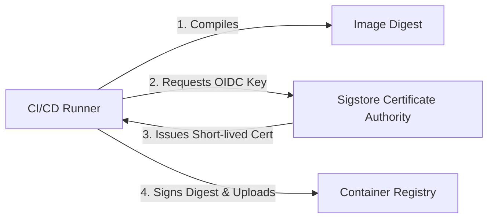

## Table of Contents

1. [The Vulnerability of the Software Supply Chain](#the-vulnerability-of-the-software-supply-chain)
2. [Managing Third-Party Dependencies](#managing-third-party-dependencies)
3. [Comparing Dependency Management Strategies](#comparing-dependency-management-strategies)
4. [Using Lockfiles for Integrity Verification](#using-lockfiles-for-integrity-verification)
5. [What Is a Software Bill of Materials (SBOM)?](#what-is-a-software-bill-of-materials-sbom)
6. [Generating and Reading a CycloneDX SBOM](#generating-and-reading-a-cyclonedx-sbom)
7. [Artifact Signing and Digest Verification](#artifact-signing-and-digest-verification)
8. [Enforcing Branch Protection and Environment Gates](#enforcing-branch-protection-and-environment-gates)
9. [Putting It All Together](#putting-it-all-together)

## The Vulnerability of the Software Supply Chain

A modern software application is rarely written entirely from scratch. While developers write unique first-party application logic, they rely on an extensive ecosystem of third-party open-source libraries, utility packages, and frameworks downloaded from public registries like npm, PyPI, or Maven. When a developer imports a single helper library, they also import every nested dependency that library relies on, resulting in hundreds or thousands of external packages woven directly into the application's runtime memory. This highly interconnected structure speeds up development, but it creates a massive supply-chain attack surface that is highly vulnerable to exploitation. Consider these three common supply-chain failures:

First, consider the threat of a hijacked upstream dependency. A highly popular utility library, downloaded millions of times per day, is maintained by an open-source contributor. An attacker compromises the maintainer's registry account using credential stuffing or session hijacking, or tricks the maintainer into transferring ownership through social engineering. The attacker then publishes a new version of the library containing a silent backdoor. Because most downstream projects use loose versioning configurations, their automated build pipelines download and compile this poisoned version automatically during their next routine build, introducing malware into their core systems without the developers' knowledge.

Second, consider the danger of an intercepted build artifact. An automated CI/CD runner successfully compiles a production-ready container image, runs all tests, and pushes the finished image to a remote registry. However, because the container image digest is not cryptographically signed, the registry itself becomes a single point of failure. If an attacker gains administrative access to the registry host or exploits a container engine vulnerability, they can intercept the image, modify its filesystem layers to inject malware, and save it back using the same tag. When the production deployment server pulls the image, it downloads the altered container, running hostile code in the production cluster.

Third, consider the risk of a bypassed security gate. An engineer, working under a tight deadline to fix a production hotfix, decides to bypass the repository's standard branch protection rules. Using a legacy, static deployment key stored on their local laptop, they build a container image locally and push it directly to the production registry. Because the build bypassed the central pipeline, the code never ran through automated static scans, dependency vulnerability audits, or peer reviews. The unvetted container runs in production, exposing the company to unreviewed security vulnerabilities and breaking compliance audit trails.

To protect our applications from these supply-chain exploits, we must establish rigorous repository-level and registry-level guardrails. This requires auditing all imported packages using Software Composition Analysis (SCA), documenting our active software inventory using Software Bills of Materials (SBOMs), signing compiled artifacts to prove their integrity, and enforcing strict, non-bypassable release gates.

## Managing Third-Party Dependencies

Dependency security is the practice of auditing and verifying the third-party libraries we import into our codebase. When we add an external package (like `express` or `lodash`), we import not only that package but also its entire tree of nested dependencies (transitive dependencies).

To keep this package tree safe, we use automated **Software Composition Analysis (SCA)** tools. Scanners like npm audit, Trivy, or Snyk read our project's lockfiles, compare the list of imported versions against a database of public CVEs (Common Vulnerabilities and Exposures), and alert us when a library is unsafe:

```text
$ npm audit
# npm audit report

axios  0.21.1
Severity: critical
Server-Side Request Forgery in axios - https://github.com/advisories/GHSA-8hc5-862y-c9ww
fix available via `npm install axios@0.21.4`
1 critical vulnerability
```

SCA scanning should be automated as a required status check in your CI pipelines, blocking pull requests that introduce new, critical-severity packages.

## Comparing Dependency Management Strategies

The way we define package versions in our configuration files determines how vulnerable we are to silent updates. We compare three common dependency strategies below:

| Strategy | Definition | Benefits | Tradeoffs |
| :--- | :--- | :--- | :--- |
| **Range Locking** (e.g., `^1.2.0`) | Allows the package manager to download minor and patch updates automatically. | Installs security patches automatically without manual edits. | Vulnerable to malicious packages published under a minor/patch version bump. |
| **Exact Pinning** (e.g., `1.2.3`) | Restricts the package manager to one specific, exact version number. | Prevents silent updates; ensures consistent builds across environments. | Requires manual effort to update packages when security patches are released. |
| **Local Vendoring** | Copies the dependency source code directly into your repository. | Complete control over code; immune to registry outages. | Massively inflates repository size; extremely difficult to update. |

Most secure teams use **Exact Pinning** in combination with automated dependency bots (like Dependabot) to manage patch updates deliberately.

## Using Lockfiles for Integrity Verification

To prevent attackers from altering packages in transit between the public registry and your build runner, package managers generate a **Lockfile** (like `package-lock.json` or `yarn.lock`).

The lockfile records the exact version of every library installed, the registry URL it was downloaded from, and a unique cryptographic hash called an **integrity checksum**:

```json
{
  "packages": {
    "node_modules/axios": {
      "version": "0.21.4",
      "resolved": "https://registry.npmjs.org/axios/-/axios-0.21.4.5.tgz",
      "integrity": "sha512-ut5VewTpQyWyKYhXLDUMO7bez10v/w28AHuL73F2hn5128Ob6OPkA7WPI6AP5ErlzIQ8NqSAUA96ReXgUmqKgA=="
    }
  }
}
```

The `integrity` string is the cryptographic hash of the package contents. When our build runner executes `npm ci`, it downloads the package zip, computes its hash, and compares it with the lockfile's integrity checksum. If the hashes disagree (indicating that someone modified the package on the registry), the builder aborts the build instantly.

## What Is a Software Bill of Materials (SBOM)?

A Software Bill of Materials (SBOM) is a complete, structured inventory of every software component, library, utility, and transitive dependency used to build a software artifact.

Think of it like the manifest of ingredients on a box of cereal. If a public advisory warns that a specific food preservative is dangerous, you check the box's ingredients list to see if it is present. 

An SBOM provides this same visibility for software. If a critical vulnerability (such as Log4j) is announced, you do not have to download and scan every production container to see if you are vulnerable. You simply query your central SBOM catalog for the affected package name and version:

```text
Software Cereal Box analogy:
Cereal Box -> List of ingredients (Oats, Sugar, Preservative E250)
Container Image -> Software Bill of Materials (NodeJS 22, Express 4.19, Axios 0.21)
```

## Generating and Reading a CycloneDX SBOM

We generate SBOMs automatically during our build pipeline using tools like Trivy or Syft, outputting them in standard XML or JSON formats (such as CycloneDX or SPDX).

Here is a simplified example of a CycloneDX SBOM record represented in JSON format:

```json
{
  "bomFormat": "CycloneDX",
  "specVersion": "1.5",
  "metadata": {
    "component": {
      "name": "orders-api",
      "version": "2026.05.19",
      "type": "application"
    }
  },
  "components": [
    {
      "name": "axios",
      "version": "0.21.4",
      "hashes": [
        {
          "alg": "SHA-512",
          "content": "b54e75Ve..."
        }
      ]
    }
  ]
}
```

This SBOM records the parent application (`orders-api`), the imported dependency (`axios`), the exact version (`0.21.4`), and its unique file hash. Generating this file at build time provides a permanent, searchable audit trail of what went into the release.

## Artifact Signing and Digest Verification

Once an artifact is compiled, we must prove its identity and verify that it was built by our trusted CI pipeline. We do this by calculating its cryptographic digest and signing it.

As discussed in our foundations, we reference container images using immutable **cryptographic digests** rather than mutable tags (like `latest`). 

To prevent registry tag hijacking, we use tools like **Cosign** (part of the Sigstore project) to sign the digest at the end of our build pipeline. The signing step uses the runner's OIDC workload identity to prove that the image was built inside your repository's workflow, not on a developer's laptop:



When the production server deploys the container, it executes a validation check:
* Verify that the target image digest matches the signed certificate.
* Confirm that the certificate was issued to your specific GitHub repository run ID.
* Reject the deployment if the signature is missing or does not match the digest.

## Enforcing Branch Protection and Environment Gates

All of our automated security scans, dependency audits, and cryptographic signatures are only as effective as the gates that enforce them. If an engineer can push unreviewed code directly to the main branch or execute deployments from an unsecured local machine, our automated pipeline controls are easily bypassed. To establish a secure delivery chain, we must configure non-bypassable gates at two critical inflection points: the repository level and the environment level.

### The Repository Gate: Branch Protection

Branch protection rules govern the entry of code into our repository's default trunk, ensuring that no commit lands on the main branch without passing through automated and human validation. To secure this repository-level gate, we configure three operational rules.

First, we require peer reviews. Before any pull request can be merged, at least one other qualified engineer must review the proposed changes, inspect the architectural logic, and grant formal approval. This peer check catches logic errors, prevents backdoors, and maintains shared codebase ownership.

Second, we enforce required status checks. We configure our repository hosting platform to compile a list of mandatory security checks—including unit test runs, CodeQL static analysis scans, and software composition audits (SCA)—that must pass cleanly before the merge button is enabled. If a scanner detects a vulnerability or a test fails, the platform blocks the merge automatically.

Third, we completely block direct pushes. No engineer, including system administrators or repository owners, is permitted to push commits directly to the protected main branch. By forcing all modifications to go through a pull request, we guarantee that every single line of code in our release branch has been audited, tested, and approved.

### The Release Gate: Environment Protection

Environment protection rules govern how compiled build artifacts are deployed to live cloud infrastructure. While branch protection secures the source code, environment protection secures the operational deployment runtime. To secure this release-level gate, we configure three operational boundaries.

First, we mandate environment approvers. When a workflow attempts to deploy to a critical environment (such as production), the runner immediately halts execution and enters a pending state. It sends a notification to designated release managers or platform security leads, who must manually review the deployment request, inspect the active pull request summary, and supply a cryptographic approval before the runner is permitted to proceed.

Second, we establish deployment windows. We configure our environment gates to restrict deployment actions to scheduled, business-hour timeframes. This prevents unexpected, automated deployments from executing during holidays or late-night hours, reducing the operational impact of accidental failures and ensuring that engineering teams are online and alert when changes land.

Third, we implement OpenID Connect (OIDC) identity locking. We restrict the temporary cloud identity roles used by our runners so that they can *only* be assumed by jobs that execute inside the protected production environment namespace. By locking the IAM role to a specific environment, we ensure that even if an attacker compromises a credential in a test or development pipeline, they cannot use it to access or modify our production cloud resources.

## Putting It All Together

Securing our third-party dependencies and build artifacts completes the pipeline protection chain, ensuring that the software we deploy is safe to run and has not been altered in transit. By combining automated dependency audits, exact version pinning, lockfile checksum verification, searchable SBOM inventories, cryptographic container signatures, and strict access gates, we construct a resilient delivery pipeline that blocks supply-chain exploits at every stage.

When securing and auditing your software composition and artifact pipelines, ensure you maintain these six core practices:

First, automate Software Composition Analysis (SCA) scanning in your CI/CD pipelines. Ensure that every pull request triggers an automated lockfile audit, scanning transitive dependencies for known public CVEs and blocking the build if critical vulnerabilities are discovered.

Second, enforce exact version pinning in all package configurations. Avoid mutable range characters such as carets (`^`) or tildes (`~`) in your dependency declarations. By pinning dependencies exactly, you control when updates occur and prevent malicious version updates from installing silently.

Third, verify lockfile integrity checksums during installation. Configure your build runners to install packages using commands that strictly enforce lockfile hashes, such as `npm ci` or `pnpm install --frozen-lockfile`. This guarantees the runner will abort the build immediately if an package's hash on the public registry does not match the committed checksum.

Fourth, generate a standard Software Bill of Materials (SBOM) for every production build. Output your software ingredients using established, machine-readable formats like CycloneDX, and store these manifests in a central database. This provides a searchable, real-time catalog that lets your security team instantly identify vulnerable packages when new CVEs are announced.

Fifth, sign compiled container digests using cryptographic identity signatures. Integrate Cosign into your release workflows, utilizing the runner's OIDC workload identity to sign the image's unique digest. When deploying, configure your servers to verify the signature and reject any image that has been tampered with or compiled outside of your trusted pipeline.

Sixth, enforce non-bypassable branch protection and environment approval gates. Completely block direct pushes to your main branch, require a peer review for every code change, and halt production deployments until designated release leads manually approve the run, ensuring complete visibility and audit trails for all production modifications.

This concludes the **Pipeline Security** phase of our DevSecOps roadmap. You have secured the runner sandboxes, established codebase static analysis and secret scanning, and locked down dependency and artifact integrity. In the next phase, we will move into **Container and Image Security**, exploring how to harden container runtimes and build minimal, distroless images.

---

**References**

- [Sigstore Cosign Documentation - Signing Container Images](https://docs.sigstore.dev/cosign/overview/) - Reference guide on OIDC signing, public ledger verification, and keyless signatures.
- [CycloneDX SBOM Standard Overview](https://cyclonedx.org/specification/overview/) - Official documentation on bill of materials specifications, dependencies tracking, and JSON schemas.
- [GitHub Security Guides - Enforcing Branch Protection Rules](https://docs.github.com/en/repositories/configuring-branches-and-merges-in-your-repository/managing-protected-branches/about-protected-branches) - Reference guide on configuring reviews, status checks, and merge locks.
- [OWASP Dependency-Check - Software Composition Analysis](https://owasp.org/www-project-dependency-check/) - OWASP guidelines on auditing third-party libraries for known vulnerabilities.
- [NIST SP 800-218 Secure Software Development Framework](https://csrc.nist.gov/pubs/sp/800/218/final) - NIST recommendations on verifying third-party components, generating SBOMs, and signing software releases.
